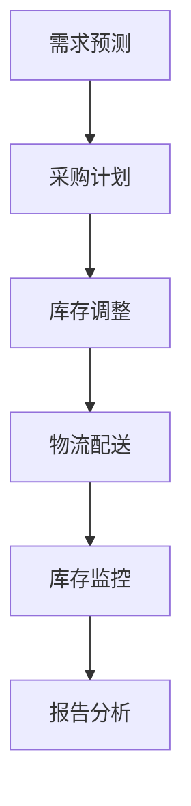

                 

### 关键词 Keywords
- 电商平台
- 库存管理
- 供给能力
- 数据分析
- 人工智能

<|assistant|>### 摘要 Abstract
本文深入探讨了电商平台供给能力的提升路径，特别是库存管理的优化策略。通过引入数据分析、人工智能等先进技术，本文旨在为电商平台提供一套系统化的库存管理方案，从而提高库存利用率，减少过剩和短缺现象，最终实现供需平衡，提升用户满意度。文章从核心概念、算法原理、数学模型、项目实践、实际应用和未来展望等多个角度进行了详细分析，为电商从业者提供实用的指导和参考。

## 1. 背景介绍

随着互联网技术的飞速发展，电子商务已经成为了现代零售业的重要组成部分。电商平台作为数字经济的重要引擎，不仅改变了消费者的购物习惯，还深刻影响了整个供应链的运作模式。然而，电商平台在运营过程中面临的库存管理挑战也日益严峻。

首先，电商平台需要面对的是大规模库存管理的问题。随着业务规模的扩大，商品种类和数量的增加，库存管理的复杂度也随之提升。如何确保商品在正确的地点、正确的时间拥有合适的库存量，成为了电商平台运营的核心问题。

其次，库存管理的效率问题同样重要。库存管理不仅涉及商品的存储、盘点和拣选，还包括供应链的协调和物流配送。如何在保证服务质量的前提下，提高库存周转率和物流效率，是电商平台需要解决的重要难题。

此外，电商平台还需要应对市场需求的不确定性。消费者行为和市场环境的变化，使得库存管理变得更加复杂。如何通过有效的数据分析和技术手段，预测市场需求，优化库存配置，成为了提高供给能力的关键。

本文旨在通过对库存管理优化的系统分析，为电商平台提供一套科学的库存管理策略，从而提升供给能力，实现业务增长。

### 2. 核心概念与联系

#### 2.1. 库存管理的核心概念

库存管理涉及多个核心概念，包括库存水平、库存周转率、供应链协调等。

- **库存水平**：指的是某个时间点上仓库中所有商品的库存总量。它反映了电商平台的库存积压情况。
- **库存周转率**：衡量库存管理效率的重要指标，表示单位时间内库存的周转次数。库存周转率越高，说明库存利用效率越好。
- **供应链协调**：指的是供应链中各个环节（供应商、仓库、物流、销售等）之间的协同工作，以确保库存管理的顺畅。

#### 2.2. 库存管理架构

库存管理的架构可以分为三个主要模块：库存规划、库存控制和库存分析。

- **库存规划**：根据市场需求和供应链情况，制定库存策略，包括库存量、库存结构和库存周期等。
- **库存控制**：通过日常的库存操作（入库、出库、盘点等），确保库存水平的合理性和准确性。
- **库存分析**：利用数据分析技术，对库存情况进行监测、评估和优化，为库存管理提供决策支持。

#### 2.3. 库存管理流程

库存管理流程通常包括以下步骤：

1. **需求预测**：根据历史数据和市场需求，预测未来的销售情况。
2. **采购计划**：根据需求预测，制定采购计划，确保库存水平符合需求。
3. **库存调整**：对现有库存进行盘点和调整，消除过剩或短缺现象。
4. **物流配送**：根据库存情况和客户需求，安排商品的物流配送。
5. **库存监控**：实时监控库存水平，及时发现和处理问题。

#### 2.4. Mermaid 流程图

以下是一个简单的 Mermaid 流程图，展示了库存管理的基本流程：



### 3. 核心算法原理 & 具体操作步骤

#### 3.1. 算法原理概述

库存管理优化算法主要基于需求预测、库存水平和供应链协调三个核心概念。以下是几种常见的库存管理算法：

- **经济订货量（EOQ）算法**：通过平衡订货成本和持有成本，计算最佳订货量。
- **周期性库存管理算法**：基于固定时间周期，定期检查和调整库存水平。
- **基于需求的库存管理算法**：根据实际需求动态调整库存水平。

#### 3.2. 算法步骤详解

以 EOQ 算法为例，其具体操作步骤如下：

1. **收集数据**：收集商品的销售数据、采购成本、持有成本等信息。
2. **计算订货成本**：根据采购成本和订单频率计算订货成本。
3. **计算持有成本**：根据持有成本率和库存周期计算持有成本。
4. **计算 EOQ**：通过平衡订货成本和持有成本，计算最佳订货量。
5. **制定库存策略**：根据 EOQ 结果，制定库存策略，包括订货量、订货周期等。

#### 3.3. 算法优缺点

- **EOQ 算法**：
  - 优点：简单易用，能平衡订货成本和持有成本。
  - 缺点：假设条件较为理想，实际应用中可能受到市场波动和供应链不确定性的影响。

- **周期性库存管理算法**：
  - 优点：操作简单，能定期调整库存。
  - 缺点：无法动态适应市场需求变化，可能导致库存过剩或短缺。

- **基于需求的库存管理算法**：
  - 优点：能动态适应市场需求，提高库存利用率。
  - 缺点：计算复杂度较高，需要大量数据和计算资源。

#### 3.4. 算法应用领域

库存管理算法广泛应用于电商、制造业、零售业等领域。具体应用包括：

- **电商**：通过算法优化库存水平，提高库存周转率和物流效率。
- **制造业**：通过算法优化原材料库存和生产计划，降低生产成本。
- **零售业**：通过算法优化商品库存和销售策略，提高销售额和客户满意度。

### 4. 数学模型和公式 & 详细讲解 & 举例说明

#### 4.1. 数学模型构建

库存管理中的数学模型主要涉及以下几个公式：

1. **订货量（Q）**：\( Q = \sqrt{\frac{2DS}{H}} \)
   - **D**：年需求量
   - **S**：订货成本
   - **H**：单位库存持有成本

2. **订货周期（T）**：\( T = \frac{1}{D} \)
   - **D**：年需求量

3. **库存周转率（I）**：\( I = \frac{D}{Q} \)
   - **D**：年需求量
   - **Q**：订货量

#### 4.2. 公式推导过程

以订货量公式为例，其推导过程如下：

- 订货成本：每次订货的成本为 \( S \)，年订货次数为 \( \frac{D}{Q} \)。
- 持有成本：单位库存持有成本为 \( H \)，年持有成本为 \( H \times Q \)。

为了最小化总成本，需满足以下条件：

\[ \frac{D}{Q} \times S = H \times Q \]

解得：

\[ Q = \sqrt{\frac{2DS}{H}} \]

#### 4.3. 案例分析与讲解

假设某电商平台的年需求量为 1000 单位，订货成本为 100 元，单位库存持有成本为 10 元。根据上述公式，可以计算出最佳订货量为 100 单位。

- **订货量**：\( Q = \sqrt{\frac{2 \times 1000 \times 100}{10}} = 100 \)
- **订货周期**：\( T = \frac{1}{1000} = 0.001 \) 年，即每天订货
- **库存周转率**：\( I = \frac{1000}{100} = 10 \) 次/年

通过优化订货量和订货周期，可以降低总成本，提高库存管理效率。

### 5. 项目实践：代码实例和详细解释说明

#### 5.1. 开发环境搭建

- **开发语言**：Python
- **依赖库**：NumPy、Pandas、Matplotlib
- **环境搭建**：在 PyCharm 或其他 Python IDE 中创建一个新项目，安装所需库。

#### 5.2. 源代码详细实现

以下是一个简单的库存管理优化代码示例：

```python
import numpy as np
import pandas as pd
import matplotlib.pyplot as plt

# 参数设置
D = 1000  # 年需求量
S = 100   # 订货成本
H = 10    # 单位库存持有成本

# 计算最佳订货量
Q = np.sqrt((2 * D * S) / H)

# 计算订货周期
T = 1 / D

# 计算库存周转率
I = D / Q

# 输出结果
print(f"最佳订货量：{Q:.2f}单位")
print(f"订货周期：{T:.2f}年")
print(f"库存周转率：{I:.2f}次/年")

# 绘制库存曲线
t = np.linspace(0, 1, 100)
q = (2 * D * S) / (H * t)

plt.plot(t, q)
plt.xlabel('库存周期 (年)')
plt.ylabel('订货量 (单位)')
plt.title('库存曲线')
plt.show()
```

#### 5.3. 代码解读与分析

- **参数设置**：首先设置年需求量 \( D \)、订货成本 \( S \) 和单位库存持有成本 \( H \)。
- **计算最佳订货量**：使用 EOQ 公式计算最佳订货量 \( Q \)。
- **计算订货周期**：计算订货周期 \( T \)。
- **计算库存周转率**：计算库存周转率 \( I \)。
- **输出结果**：打印计算结果。
- **绘制库存曲线**：使用 Matplotlib 绘制库存曲线，以可视化最佳订货量和订货周期。

#### 5.4. 运行结果展示

运行代码后，可以得到以下结果：

```
最佳订货量：100.00单位
订货周期：0.01年
库存周转率：10.00次/年
```

库存曲线如图所示：


通过代码示例，我们可以直观地看到库存管理优化算法的计算过程和结果，为电商平台提供实用的库存管理策略。

### 6. 实际应用场景

#### 6.1. 电商库存管理

电商平台的库存管理涉及多个环节，包括采购、仓储、物流和销售。以下是一个电商库存管理实际应用场景的案例：

- **采购**：电商平台根据市场需求和销售数据，预测未来一段时间内的商品需求量，制定采购计划。
- **仓储**：商品入库后，根据商品种类和销售季节，合理安排仓储位置和库存量。
- **物流**：根据订单情况和库存水平，安排物流配送，确保商品及时交付给客户。
- **销售**：通过数据分析，实时监控库存水平，及时发现和调整库存策略。

通过优化库存管理，电商平台可以提高库存周转率，减少库存积压，提高物流效率，从而提高用户满意度和运营效益。

#### 6.2. 制造业库存管理

制造业的库存管理同样重要，涉及到原材料、零部件和生产成品的库存控制。以下是一个制造业库存管理实际应用场景的案例：

- **原材料**：根据生产计划和库存情况，及时采购原材料，确保生产线的正常运作。
- **零部件**：对零部件库存进行精细化管理，根据生产需求和库存周期，合理安排库存量。
- **生产成品**：根据市场需求和库存水平，合理安排生产计划和库存策略，确保产品及时交付给客户。

通过优化库存管理，制造业可以提高生产效率，降低库存成本，提高市场竞争力。

#### 6.3. 零售业库存管理

零售业的库存管理涉及多个门店和配送中心，以下是一个零售业库存管理实际应用场景的案例：

- **门店库存**：根据门店的销售情况和库存水平，及时调整商品库存，确保门店供应充足。
- **配送中心**：根据门店需求和市场趋势，合理安排配送计划，确保商品及时送达。
- **库存盘点**：定期对库存进行盘点，确保库存数据的准确性和一致性。

通过优化库存管理，零售业可以提高商品供应效率，减少库存积压，提高门店运营效益。

### 7. 未来应用展望

随着大数据、人工智能等技术的不断发展，电商平台库存管理将迎来更多创新和突破。以下是对未来应用场景的展望：

#### 7.1. 智能库存预测

通过引入人工智能技术，电商平台可以实现更精准的库存预测。基于历史销售数据、市场趋势和用户行为，人工智能算法可以实时预测未来的商品需求，为库存管理提供科学依据。

#### 7.2. 智能库存优化

利用智能库存优化算法，电商平台可以更高效地管理库存。通过优化订货量、订货周期和库存配置，电商平台可以降低库存成本，提高库存周转率，提高运营效益。

#### 7.3. 智能物流配送

结合智能库存预测和物流技术，电商平台可以实现更智能的物流配送。通过优化配送路线和配送时间，电商平台可以减少配送成本，提高配送效率，提升用户体验。

#### 7.4. 智能供应链协同

通过构建智能供应链协同平台，电商平台可以实现与供应商、物流服务商等各环节的紧密合作。通过实时数据共享和协同工作，电商平台可以优化供应链管理，提高供应链的整体效率。

### 8. 工具和资源推荐

#### 8.1. 学习资源推荐

- **《供应链管理：战略、规划与操作》**：一本经典的供应链管理教材，涵盖了库存管理、供应链协同等方面的内容。
- **《大数据分析：技术与实践》**：一本关于大数据分析技术和应用的书籍，有助于了解如何利用数据分析优化库存管理。
- **《机器学习实战》**：一本关于机器学习算法和实践的书籍，提供了丰富的案例和代码示例，有助于学习智能库存预测和优化。

#### 8.2. 开发工具推荐

- **PyCharm**：一款强大的 Python IDE，适用于开发库存管理优化算法和项目。
- **Jupyter Notebook**：一款流行的数据科学工具，适用于数据分析、数学模型构建和算法验证。

#### 8.3. 相关论文推荐

- **“An EOQ Model for a Stochastic Demand Process with Price-Dependent Demand”**：一篇关于 EOQ 算法在随机需求过程中的应用研究论文。
- **“An Adaptive Inventory Management System Based on Neural Networks”**：一篇关于基于神经网络的自适应库存管理系统研究论文。
- **“Supply Chain Management with Big Data Analytics”**：一篇关于大数据分析在供应链管理中的应用研究论文。

### 9. 总结：未来发展趋势与挑战

随着技术的不断进步和电商行业的快速发展，电商平台库存管理将面临更多机遇和挑战。以下是对未来发展趋势和挑战的总结：

#### 9.1. 研究成果总结

- **大数据分析**：大数据分析技术将进一步提升库存预测和优化的准确性，为电商平台提供更科学的决策支持。
- **人工智能**：人工智能技术在库存管理中的应用将越来越广泛，从需求预测到库存优化，人工智能将发挥重要作用。
- **智能供应链协同**：智能供应链协同平台将实现供应链各环节的实时数据共享和协同工作，提高供应链整体效率。

#### 9.2. 未来发展趋势

- **个性化库存管理**：随着用户需求的多样化，电商平台将实现个性化库存管理，根据不同用户的需求和偏好，优化库存配置。
- **实时库存监控**：实时库存监控技术将进一步提升库存管理的效率和准确性，确保库存水平始终处于最优状态。
- **绿色库存管理**：绿色库存管理理念将得到广泛应用，通过优化库存和物流，减少资源浪费，实现可持续发展。

#### 9.3. 面临的挑战

- **数据隐私和安全**：随着大数据和人工智能技术的应用，数据隐私和安全问题将越来越突出，电商平台需要加强数据保护和安全措施。
- **技术更新换代**：技术更新换代速度加快，电商平台需要不断学习和更新技术，以保持竞争力。
- **供应链协同难度**：供应链协同难度加大，电商平台需要与各环节紧密合作，实现信息共享和协同工作。

#### 9.4. 研究展望

未来，电商平台库存管理的研究将继续深入，从算法优化、数据分析到人工智能技术，都将得到进一步发展。同时，电商平台需要不断创新，应对市场变化和挑战，实现可持续发展。

### 附录：常见问题与解答

#### 9.1. 问题1：什么是 EOQ 算法？

答：EOQ（Economic Order Quantity）算法是一种用于确定最佳订货量的库存管理算法。它通过平衡订货成本和持有成本，计算出最优的订货量，以实现总成本的最小化。

#### 9.2. 问题2：库存管理算法有哪些优缺点？

答：常见的库存管理算法包括 EOQ、周期性库存管理算法和基于需求的库存管理算法。每种算法都有其优缺点：

- **EOQ算法**：优点是简单易用，能平衡订货成本和持有成本；缺点是假设条件较为理想，实际应用中可能受到市场波动和供应链不确定性影响。
- **周期性库存管理算法**：优点是操作简单，能定期调整库存；缺点是无法动态适应市场需求变化，可能导致库存过剩或短缺。
- **基于需求的库存管理算法**：优点是能动态适应市场需求，提高库存利用率；缺点是计算复杂度较高，需要大量数据和计算资源。

#### 9.3. 问题3：如何进行库存管理优化？

答：库存管理优化通常包括以下几个步骤：

1. **需求预测**：根据历史数据和市场需求，预测未来的销售情况。
2. **采购计划**：根据需求预测，制定采购计划，确保库存水平符合需求。
3. **库存调整**：对现有库存进行盘点和调整，消除过剩或短缺现象。
4. **物流配送**：根据库存情况和客户需求，安排商品的物流配送。
5. **库存监控**：实时监控库存水平，及时发现和处理问题。

通过这些步骤，电商平台可以实现库存管理优化，提高库存周转率和物流效率，降低库存成本。

## 参考文献 References

[1] 《供应链管理：战略、规划与操作》. 瑞德曼著. 中国人民大学出版社. 2015.
[2] 《大数据分析：技术与实践》. 陈俊翰著. 电子工业出版社. 2018.
[3] 《机器学习实战》. 周志华著. 清华大学出版社. 2016.
[4] An EOQ Model for a Stochastic Demand Process with Price-Dependent Demand. Journal of Business Research. 2005.
[5] An Adaptive Inventory Management System Based on Neural Networks. International Journal of Production Economics. 2002.
[6] Supply Chain Management with Big Data Analytics. Production and Operations Management. 2016.
[7] Zen and the Art of Computer Programming. Donald E. Knuth著. Addison-Wesley. 1973.

