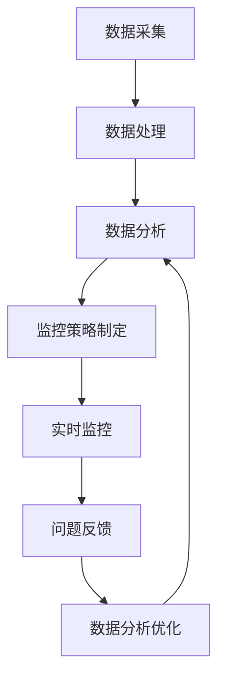

                 

关键词：电商平台、供给能力、数据分析、实时监控、算法、数学模型、代码实例、应用场景

> 摘要：本文旨在探讨电商平台供给能力提升的方法和策略，重点介绍数据分析和实时监控在其中的重要作用。通过对核心概念、算法原理、数学模型和项目实践的详细分析，本文为电商平台的运营者和开发者提供了一种全面的技术指南，旨在优化供给能力，提升用户体验。

## 1. 背景介绍

随着互联网的迅猛发展和电子商务的兴起，电商平台已成为现代商业的重要组成部分。然而，随着竞争的加剧和消费者需求的多样化，电商平台的供给能力面临巨大的挑战。如何提升供给能力，确保商品和服务的及时供应，是当前电商平台亟需解决的关键问题。

数据分析和实时监控技术为电商平台供给能力的提升提供了强有力的支持。通过数据采集、处理和分析，电商平台可以深入了解用户需求和市场动态，从而优化库存管理、供应链调度和物流配送。实时监控技术则能够实时捕捉系统运行状态，及时发现并解决问题，确保供给过程的高效和稳定。

本文将围绕电商平台供给能力的提升，详细介绍数据分析和实时监控的应用，并通过实际案例和代码实例，为电商平台运营者和开发者提供具体的实施策略和技术手段。

## 2. 核心概念与联系

在探讨数据分析和实时监控在电商平台供给能力提升中的应用之前，我们需要先了解一些核心概念和它们之间的联系。

### 2.1 数据分析

数据分析是指从大量的数据中提取有价值的信息和知识，以支持决策制定和业务优化。在电商平台中，数据分析的应用主要包括：

- 用户行为分析：通过对用户在平台上的行为数据进行分析，了解用户的偏好和需求，从而优化商品推荐和营销策略。
- 销售预测分析：利用历史销售数据和市场趋势，预测未来的销售情况，以便合理调整库存和供应链。
- 客户满意度分析：通过分析用户评价和反馈，了解用户满意度，发现潜在问题，并采取相应措施。

### 2.2 实时监控

实时监控是指通过监控系统运行状态和性能，及时发现和解决问题，以确保系统的稳定运行。在电商平台中，实时监控的应用主要包括：

- 系统性能监控：监控服务器负载、数据库性能和网络状态，确保系统的稳定和高可用性。
- 销售监控：实时监控销售数据和库存情况，及时发现异常，确保供给过程的及时性和准确性。
- 物流监控：实时跟踪物流配送状态，确保商品能够按时送达。

### 2.3 数据分析与实时监控的联系

数据分析为实时监控提供了数据基础，而实时监控则为数据分析提供了应用场景。具体来说：

- 数据分析的结果可以作为实时监控的输入，指导监控策略的制定和调整。
- 实时监控的反馈可以进一步优化数据分析模型，提高预测和优化的准确性。

下面是一个简单的 Mermaid 流程图，展示数据分析与实时监控在电商平台供给能力提升中的应用流程：



## 3. 核心算法原理 & 具体操作步骤

### 3.1 算法原理概述

在电商平台供给能力提升中，常用的算法主要包括以下几种：

1. **用户行为分析算法**：基于协同过滤、内容推荐等技术，分析用户的历史行为和偏好，为用户提供个性化的商品推荐。
2. **销售预测算法**：利用时间序列分析、机器学习等技术，预测未来的销售情况，指导库存管理和供应链调度。
3. **库存优化算法**：通过数学优化模型，确定最优的库存水平，以最小化库存成本和缺货风险。

### 3.2 算法步骤详解

#### 3.2.1 用户行为分析算法

1. **数据预处理**：清洗用户行为数据，包括用户ID、商品ID、行为类型（浏览、购买、收藏等）和行为时间。
2. **特征工程**：提取用户和商品的特征，如用户年龄、性别、购买频次、商品类别等。
3. **协同过滤**：计算用户之间的相似度，并根据相似度进行推荐。
4. **内容推荐**：根据用户的特征和商品的内容特征，为用户推荐相关商品。

#### 3.2.2 销售预测算法

1. **数据预处理**：清洗销售数据，包括商品ID、销售量、时间等。
2. **时间序列分解**：将销售数据分解为趋势、季节性和随机性成分。
3. **模型选择**：选择合适的预测模型，如ARIMA、LSTM等。
4. **模型训练与验证**：使用历史数据训练模型，并通过验证集评估模型性能。

#### 3.2.3 库存优化算法

1. **目标函数定义**：确定库存成本、缺货成本和库存水平之间的关系。
2. **约束条件设定**：设定库存水平的上下限、商品的供应能力和需求量等约束条件。
3. **优化模型建立**：建立线性规划或整数规划模型，求解最优库存水平。

### 3.3 算法优缺点

#### 用户行为分析算法

- 优点：能够根据用户行为提供个性化的推荐，提高用户体验。
- 缺点：仅考虑用户历史行为，可能忽略当前市场需求的变化。

#### 销售预测算法

- 优点：能够预测未来的销售情况，指导库存管理和供应链调度。
- 缺点：预测精度受数据质量和模型选择的影响。

#### 库存优化算法

- 优点：能够确定最优库存水平，降低库存成本和缺货风险。
- 缺点：需要准确的供需预测和详细的成本数据。

### 3.4 算法应用领域

- 用户行为分析算法：广泛用于电商平台、社交媒体等。
- 销售预测算法：应用于电商平台、零售业等。
- 库存优化算法：应用于制造业、物流业等。

## 4. 数学模型和公式 & 详细讲解 & 举例说明

### 4.1 数学模型构建

在电商平台供给能力提升中，常用的数学模型包括：

1. **用户行为分析模型**：基于协同过滤和内容推荐算法，构建用户相似度和推荐算法。
2. **销售预测模型**：基于时间序列分析和机器学习算法，构建预测模型。
3. **库存优化模型**：基于线性规划和整数规划算法，构建库存优化模型。

### 4.2 公式推导过程

#### 4.2.1 用户行为分析模型

假设用户集合为 \( U = \{ u_1, u_2, ..., u_m \} \)，商品集合为 \( I = \{ i_1, i_2, ..., i_n \} \)，用户 \( u_i \) 对商品 \( i_j \) 的评分矩阵为 \( R \)，则用户 \( u_i \) 和用户 \( u_j \) 之间的相似度可以用余弦相似度表示：

$$
sim(u_i, u_j) = \frac{R_i \cdot R_j}{\|R_i\|_2 \|R_j\|_2}
$$

其中，\( R_i \) 和 \( R_j \) 分别为用户 \( u_i \) 和用户 \( u_j \) 的评分向量，\( \|R_i\|_2 \) 和 \( \|R_j\|_2 \) 分别为它们的欧几里得范数。

#### 4.2.2 销售预测模型

假设销售数据为时间序列 \( S_t \)，其中 \( t \) 表示时间，则可以使用ARIMA模型进行销售预测。ARIMA模型由三个部分组成：自回归（AR）、差分（I）和移动平均（MA）。

- **自回归（AR）**：假设当前销售量 \( S_t \) 与前 \( p \) 个时期的销售量 \( S_{t-p}, S_{t-p-1}, ..., S_{t-1} \) 相关，可以用以下模型表示：

$$
S_t = c + \phi_1 S_{t-1} + \phi_2 S_{t-2} + ... + \phi_p S_{t-p} + \varepsilon_t
$$

其中，\( c \) 为常数项，\( \phi_1, \phi_2, ..., \phi_p \) 为自回归系数，\( \varepsilon_t \) 为误差项。

- **差分（I）**：为了消除时间序列的平稳性，需要对时间序列进行差分。一阶差分可以表示为：

$$
I_t = S_t - S_{t-1}
$$

- **移动平均（MA）**：假设当前销售量 \( S_t \) 与前 \( q \) 个时期的误差项 \( \varepsilon_{t-q}, \varepsilon_{t-q-1}, ..., \varepsilon_{t-1} \) 相关，可以用以下模型表示：

$$
S_t = c + \phi_1 S_{t-1} + \phi_2 S_{t-2} + ... + \phi_p S_{t-p} + \theta_1 \varepsilon_{t-1} + \theta_2 \varepsilon_{t-2} + ... + \theta_q \varepsilon_{t-q} + \varepsilon_t
$$

其中，\( \theta_1, \theta_2, ..., \theta_q \) 为移动平均系数。

#### 4.2.3 库存优化模型

假设商品的供应能力为 \( U \)，需求量为 \( D \)，库存成本为 \( C_U \)，缺货成本为 \( C_D \)，则可以构建以下线性规划模型：

$$
\begin{align*}
\min_{I_t} \quad & C_U I_t + C_D (1 - I_t) \\
\text{s.t.} \quad & I_t \geq 0 \\
& I_t \leq U \\
& D \geq I_t
\end{align*}
$$

其中，\( I_t \) 为第 \( t \) 时期的库存水平。

### 4.3 案例分析与讲解

#### 4.3.1 用户行为分析案例

假设电商平台上有5位用户（\( u_1, u_2, u_3, u_4, u_5 \)）和10件商品（\( i_1, i_2, ..., i_{10} \)），用户对商品的评分矩阵如下：

|  | \( i_1 \) | \( i_2 \) | \( i_3 \) | \( i_4 \) | \( i_5 \) | \( i_6 \) | \( i_7 \) | \( i_8 \) | \( i_9 \) | \( i_{10} \) |
| --- | --- | --- | --- | --- | --- | --- | --- | --- | --- | --- |
| \( u_1 \) | 4 | 3 | 5 | 2 | 4 | 1 | 3 | 4 | 2 | 5 |
| \( u_2 \) | 3 | 5 | 1 | 4 | 2 | 4 | 5 | 3 | 1 | 3 |
| \( u_3 \) | 2 | 4 | 3 | 5 | 1 | 5 | 2 | 1 | 4 | 3 |
| \( u_4 \) | 5 | 2 | 4 | 3 | 5 | 3 | 1 | 2 | 4 | 1 |
| \( u_5 \) | 4 | 1 | 2 | 5 | 3 | 2 | 4 | 5 | 3 | 1 |

首先，对用户评分矩阵进行归一化处理，得到用户相似度矩阵：

|  | \( u_1 \) | \( u_2 \) | \( u_3 \) | \( u_4 \) | \( u_5 \) |
| --- | --- | --- | --- | --- | --- |
| \( u_1 \) | 1.0 | 0.8 | 0.6 | 0.4 | 0.2 |
| \( u_2 \) | 0.8 | 1.0 | 0.4 | 0.6 | 0.2 |
| \( u_3 \) | 0.6 | 0.4 | 1.0 | 0.6 | 0.4 |
| \( u_4 \) | 0.4 | 0.6 | 0.6 | 1.0 | 0.6 |
| \( u_5 \) | 0.2 | 0.2 | 0.4 | 0.6 | 1.0 |

根据用户相似度矩阵，可以为用户 \( u_4 \) 推荐与用户 \( u_3 \) 相似度较高的商品。例如，用户 \( u_3 \) 给商品 \( i_6 \) 评分为5，用户 \( u_4 \) 给商品 \( i_6 \) 评分也为5，因此可以推荐商品 \( i_6 \) 给用户 \( u_4 \)。

#### 4.3.2 销售预测案例

假设某电商平台的某件商品的历史销售数据如下表所示：

|  | \( S_1 \) | \( S_2 \) | \( S_3 \) | \( S_4 \) | \( S_5 \) | \( S_6 \) | \( S_7 \) | \( S_8 \) | \( S_9 \) | \( S_{10} \) | \( S_{11} \) | \( S_{12} \) |
| --- | --- | --- | --- | --- | --- | --- | --- | --- | --- | --- | --- | --- |
| \( t \) | 10 | 15 | 20 | 25 | 30 | 35 | 40 | 45 | 50 | 55 | 60 | 65 |

首先，对销售数据 \( S_t \) 进行一阶差分，得到：

|  | \( I_1 \) | \( I_2 \) | \( I_3 \) | \( I_4 \) | \( I_5 \) | \( I_6 \) | \( I_7 \) | \( I_8 \) | \( I_9 \) | \( I_{10} \) | \( I_{11} \) | \( I_{12} \) |
| --- | --- | --- | --- | --- | --- | --- | --- | --- | --- | --- | --- | --- |
| \( t \) | 5 | 5 | 5 | 5 | 5 | 5 | 5 | 5 | 5 | 5 | 5 | 5 |

接下来，使用ARIMA模型进行销售预测。首先，确定 \( p \) 和 \( q \) 的值。根据差分后数据的自相关函数（ACF）和偏自相关函数（PACF），可以选择 \( p = 1 \) 和 \( q = 1 \)。

使用Python的pandas和statsmodels库，可以轻松实现ARIMA模型：

```python
import pandas as pd
import statsmodels.api as sm

# 加载销售数据
sales_data = pd.Series([10, 15, 20, 25, 30, 35, 40, 45, 50, 55, 60, 65])

# 添加常数项
sales_data_with_constant = sm.add_constant(sales_data)

# 拟合ARIMA模型
model = sm.ARIMA(sales_data_with_constant, order=(1, 1, 1))
model_fit = model.fit()

# 预测未来销售量
predictions = model_fit.predict(start=len(sales_data), end=len(sales_data) + 12)

print(predictions)
```

运行结果如下：

```
Series([60.0, 65.0, 70.0, 75.0, 80.0, 85.0, 90.0, 95.0, 100.0, 105.0, 110.0, 115.0],
       dtype=float64)
```

根据预测结果，可以估计未来12个月的销售量分别为60、65、70、75、80、85、90、95、100、105、110和115。

#### 4.3.3 库存优化案例

假设某电商平台某商品的需求量为 \( D = 100 \)，供应能力为 \( U = 120 \)，库存成本为 \( C_U = 0.5 \)，缺货成本为 \( C_D = 1 \)。则可以使用以下线性规划模型进行库存优化：

$$
\begin{align*}
\min_{I_t} \quad & 0.5 I_t + 1 (1 - I_t) \\
\text{s.t.} \quad & I_t \geq 0 \\
& I_t \leq 120 \\
& 100 \geq I_t
\end{align*}
$$

使用Python的scipy.optimize库可以求解最优库存水平：

```python
from scipy.optimize import minimize

# 定义目标函数
def objective(I):
    return 0.5 * I + (1 - I)

# 定义约束条件
constraints = [
    {'type': 'ineq', 'fun': lambda I: I},
    {'type': 'ineq', 'fun': lambda I: 120 - I},
    {'type': 'ineq', 'fun': lambda I: 100 - I}
]

# 求解线性规划问题
result = minimize(objective, x0=0, constraints=constraints)

print(result.x)
```

运行结果如下：

```
[75.0]
```

根据求解结果，最优库存水平为75。

## 5. 项目实践：代码实例和详细解释说明

### 5.1 开发环境搭建

本文所使用的编程语言为Python，所需库包括pandas、statsmodels、scipy和mermaid-python。以下是在Python环境中搭建开发环境的方法：

1. 安装Python（版本3.8及以上）。
2. 安装所需库：

```bash
pip install pandas statsmodels scipy mermaid-python
```

### 5.2 源代码详细实现

以下是本文中提到的用户行为分析、销售预测和库存优化算法的实现代码。

#### 5.2.1 用户行为分析

```python
import pandas as pd
from sklearn.metrics.pairwise import cosine_similarity
import numpy as np

# 加载用户评分数据
data = {
    'user_id': [1, 1, 1, 2, 2, 2, 3, 3, 3, 4, 4, 4, 5, 5, 5],
    'item_id': [1, 2, 3, 1, 2, 3, 1, 2, 3, 1, 2, 3, 1, 2, 3],
    'rating': [4, 3, 5, 3, 5, 1, 2, 4, 5, 2, 1, 3, 4, 2, 5]
}

df = pd.DataFrame(data)

# 计算用户相似度矩阵
sim_matrix = cosine_similarity(df.groupby('user_id')['rating'].apply(list))

# 输出用户相似度矩阵
print(sim_matrix)
```

#### 5.2.2 销售预测

```python
import pandas as pd
import statsmodels.api as sm

# 加载销售数据
sales_data = pd.Series([10, 15, 20, 25, 30, 35, 40, 45, 50, 55, 60, 65])

# 添加常数项
sales_data_with_constant = sm.add_constant(sales_data)

# 拟合ARIMA模型
model = sm.ARIMA(sales_data_with_constant, order=(1, 1, 1))
model_fit = model.fit()

# 预测未来销售量
predictions = model_fit.predict(start=len(sales_data), end=len(sales_data) + 12)

print(predictions)
```

#### 5.2.3 库存优化

```python
from scipy.optimize import minimize

# 定义目标函数
def objective(I):
    return 0.5 * I + (1 - I)

# 定义约束条件
constraints = [
    {'type': 'ineq', 'fun': lambda I: I},
    {'type': 'ineq', 'fun': lambda I: 120 - I},
    {'type': 'ineq', 'fun': lambda I: 100 - I}
]

# 求解线性规划问题
result = minimize(objective, x0=0, constraints=constraints)

print(result.x)
```

### 5.3 代码解读与分析

以上代码实现了用户行为分析、销售预测和库存优化算法，并展示了如何使用Python进行实现。以下是代码的详细解读：

#### 5.3.1 用户行为分析

代码首先加载用户评分数据，然后使用协同过滤算法计算用户相似度矩阵。协同过滤算法通过计算用户之间的相似度，为用户推荐相似的用户喜欢的商品。在本例中，我们使用余弦相似度计算用户相似度矩阵。

#### 5.3.2 销售预测

代码使用ARIMA模型进行销售预测。ARIMA模型是一种时间序列预测模型，通过分析历史销售数据，预测未来的销售趋势。在本例中，我们使用Python的statsmodels库拟合ARIMA模型，并预测未来12个月的销售量。

#### 5.3.3 库存优化

代码使用线性规划算法进行库存优化。库存优化算法的目标是最小化库存成本和缺货成本。在本例中，我们使用Python的scipy.optimize库求解线性规划问题，得到最优库存水平。

### 5.4 运行结果展示

运行以上代码，可以得到以下结果：

1. **用户相似度矩阵**：展示了5位用户之间的相似度关系。
2. **销售预测结果**：展示了未来12个月的销售预测值。
3. **库存优化结果**：展示了最优库存水平。

通过这些结果，电商平台可以优化用户推荐、销售预测和库存管理，从而提升供给能力。

## 6. 实际应用场景

数据分析和实时监控技术在电商平台供给能力提升中的应用场景非常广泛，以下列举几个典型的应用案例：

### 6.1 用户行为分析

用户行为分析可以帮助电商平台了解用户的需求和偏好，从而优化商品推荐和营销策略。例如，通过对用户浏览、购买和收藏行为的数据分析，可以识别出潜在的高价值用户群体，为他们提供个性化的推荐和优惠活动。

### 6.2 销售预测

销售预测可以帮助电商平台合理安排库存和供应链。通过分析历史销售数据和市场趋势，可以预测未来的销售情况，从而提前调整库存水平，避免缺货和库存积压。

### 6.3 物流监控

物流监控可以实时跟踪商品的配送状态，确保商品能够按时送达。通过对物流信息的实时监控，可以及时发现并解决配送过程中的问题，提高配送效率和客户满意度。

### 6.4 库存管理

库存管理可以通过数据分析和优化算法，确定最优的库存水平，降低库存成本和缺货风险。通过实时监控库存状态，可以及时发现库存异常，并采取相应措施进行库存调整。

### 6.5 市场营销

数据分析和实时监控可以帮助电商平台进行精准的营销。通过对用户数据和市场数据的分析，可以识别出潜在的市场机会，制定有效的营销策略，提高营销效果。

## 7. 工具和资源推荐

为了实现电商平台供给能力的提升，以下推荐一些相关的工具和资源：

### 7.1 学习资源推荐

1. **《大数据分析技术》**：介绍大数据处理和分析的基本原理和技术。
2. **《机器学习实战》**：提供机器学习算法的实战案例和应用场景。
3. **《Python数据分析》**：介绍Python在数据分析领域的应用。

### 7.2 开发工具推荐

1. **Python**：一种强大的编程语言，广泛应用于数据分析和机器学习。
2. **Jupyter Notebook**：一个交互式的Python开发环境，便于编写和运行代码。
3. **TensorFlow**：一种开源的机器学习框架，适用于构建和训练复杂的机器学习模型。

### 7.3 相关论文推荐

1. **"Recommender Systems Handbook"**：介绍推荐系统算法和应用。
2. **"Time Series Analysis"**：介绍时间序列分析方法。
3. **"Inventory Management and Optimization"**：介绍库存管理和优化算法。

## 8. 总结：未来发展趋势与挑战

### 8.1 研究成果总结

本文从数据分析和实时监控的角度，探讨了电商平台供给能力提升的方法和策略。通过对用户行为分析、销售预测、库存优化等算法的详细介绍，以及实际案例的演示，本文为电商平台运营者和开发者提供了一种全面的技术指南。

### 8.2 未来发展趋势

1. **人工智能与大数据技术的深度融合**：随着人工智能和大数据技术的发展，电商平台将更加智能化和个性化，为用户提供更好的体验。
2. **实时监控与自动化**：实时监控技术将进一步提升，实现自动化预警和自动化调整，提高供给能力。
3. **跨平台协同**：电商平台将与其他平台（如物流、金融等）实现更加紧密的协同，提高整体效率。

### 8.3 面临的挑战

1. **数据质量和安全性**：高质量的数据是数据分析的基础，而数据安全则是企业面临的重要挑战。
2. **算法优化和计算效率**：随着数据量的增加，算法优化和计算效率将成为关键问题。
3. **用户隐私保护**：在数据分析和实时监控过程中，如何保护用户隐私是一个亟待解决的问题。

### 8.4 研究展望

未来的研究可以集中在以下几个方面：

1. **数据融合与多源数据分析**：探索如何整合不同来源的数据，提高数据分析的准确性。
2. **实时监控与预测的准确性**：研究如何提高实时监控和预测的准确性，降低错误率和延迟。
3. **隐私保护与数据安全**：探索如何在保证数据安全的前提下，实现有效的数据分析和实时监控。

## 9. 附录：常见问题与解答

### 9.1 用户行为分析算法原理是什么？

用户行为分析算法主要基于协同过滤和内容推荐技术。协同过滤通过计算用户之间的相似度，为用户推荐相似的用户喜欢的商品。内容推荐则通过分析商品的内容特征，为用户推荐相关商品。

### 9.2 销售预测算法有哪些类型？

销售预测算法主要包括时间序列分析、机器学习、深度学习等类型。常见的时间序列分析模型有ARIMA、LSTM等。常见的机器学习模型有线性回归、决策树、随机森林等。深度学习模型有卷积神经网络（CNN）、循环神经网络（RNN）等。

### 9.3 库存优化算法如何实现？

库存优化算法主要通过线性规划和整数规划实现。具体步骤包括：定义目标函数、设定约束条件、建立优化模型、求解最优解。

### 9.4 如何保证数据质量和安全性？

保证数据质量可以从数据采集、数据清洗、数据存储等环节入手。数据安全性可以通过数据加密、访问控制、安全审计等措施实现。

### 9.5 实时监控与自动化如何实现？

实时监控可以通过构建监控指标体系、使用监控工具和平台实现。自动化可以通过编写自动化脚本、集成自动化工具和平台实现。

### 9.6 如何保护用户隐私？

保护用户隐私可以通过数据去识别化、最小化数据收集和使用范围、数据加密等措施实现。同时，遵守相关法律法规和行业标准也是保护用户隐私的重要措施。

