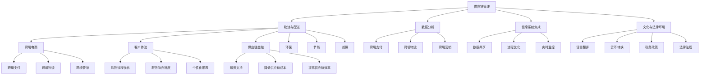

                 

关键词：电商平台，供给能力，海外市场，拓展，供应链管理，技术解决方案

> 摘要：本文将深入探讨电商平台如何提升供给能力以拓展海外市场。通过分析当前全球电商市场趋势，探讨核心概念和联系，阐述核心算法原理和操作步骤，构建数学模型，提供代码实例和详细解释，分析实际应用场景，推荐工具和资源，总结未来发展趋势与挑战，旨在为电商从业者提供切实可行的指导和建议。

## 1. 背景介绍

随着互联网技术的飞速发展和全球电商市场的不断扩大，电商平台已经成为了企业拓展海外市场的重要渠道。然而，在全球化进程中，电商平台面临着诸多挑战，其中最为关键的是如何提升供给能力，以满足日益增长的海外市场需求。

供给能力是指电商平台能够迅速、高效地满足消费者需求的能力。它不仅涉及到供应链的优化，还涉及到物流、库存管理、订单处理等多个环节。提升供给能力，对于电商平台在海外市场的竞争力具有重要意义。

近年来，随着全球电商市场的发展，海外市场拓展已经成为电商平台的重要战略方向。然而，在拓展海外市场的过程中，电商平台面临着一系列挑战，如文化差异、法律环境、物流瓶颈等。这些挑战使得提升供给能力变得尤为关键。

本文将从以下几个方面展开讨论：首先，分析当前全球电商市场趋势；其次，阐述提升供给能力所需的核心概念和联系；然后，介绍核心算法原理和操作步骤；接着，构建数学模型并进行详细讲解；最后，通过代码实例和详细解释，探讨实际应用场景，并总结未来发展趋势与挑战。

## 2. 核心概念与联系

为了提升电商平台的供给能力，我们需要理解一系列核心概念，并将它们有机地结合起来。以下是这些核心概念以及它们之间的联系：

### 2.1 供应链管理

供应链管理是电商平台供给能力提升的核心。它包括供应商管理、库存管理、物流管理等多个方面。有效的供应链管理能够确保产品从供应商到消费者手中的过程中，各个环节的高效运作。

### 2.2 物流与配送

物流与配送是供给能力的直接体现。高效的物流系统能够缩短订单处理时间，降低运输成本，提高客户满意度。物流系统需要考虑的因素包括运输路线优化、仓储布局优化、配送车辆调度等。

### 2.3 数据分析

数据分析是提升供给能力的重要工具。通过对销售数据、客户反馈数据、市场趋势数据的分析，电商平台可以更好地预测需求、优化库存、调整供应链策略。

### 2.4 信息系统集成

信息系统集成是将供应链管理、物流配送、数据分析等环节有机结合起来，形成一个整体。通过信息系统集成，电商平台可以实现数据共享、流程优化、实时监控等目标。

### 2.5 文化与法律环境

在海外市场拓展过程中，电商平台需要考虑不同国家和地区的文化差异和法律环境。这包括语言翻译、货币转换、税务政策、法律法规等方面。只有深入了解并适应这些文化差异和法律环境，电商平台才能更好地服务于海外客户。

### 2.6 跨境电商

跨境电商是电商平台海外市场拓展的重要途径。它涉及跨境支付、跨境物流、跨境营销等多个方面。跨境电商的兴起，为电商平台提供了更广阔的发展空间。

### 2.7 客户体验

客户体验是提升供给能力的重要目标。电商平台需要通过优化购物流程、提高服务响应速度、提供个性化推荐等方式，提升客户满意度。良好的客户体验能够增加客户忠诚度，促进复购率。

### 2.8 供应链金融

供应链金融是近年来发展迅速的一个领域。通过供应链金融，电商平台可以为供应链上下游企业提供融资支持，降低供应链成本，提高供应链效率。

### 2.9 可持续发展

可持续发展是当前全球关注的焦点。电商平台在提升供给能力的过程中，需要考虑环保、节能、减排等方面。只有实现可持续发展，电商平台才能在长远发展中立于不败之地。

### 2.10 Mermaid 流程图

为了更好地展示这些核心概念之间的联系，我们使用Mermaid绘制了一个流程图，如下所示：



通过以上核心概念和联系的分析，我们可以更好地理解电商平台供给能力提升的关键所在。

## 3. 核心算法原理 & 具体操作步骤

### 3.1 算法原理概述

在提升电商平台供给能力的过程中，算法的应用至关重要。以下是几种核心算法的原理及其在实践中的应用。

#### 3.1.1 供应链优化算法

供应链优化算法旨在通过优化供应链网络中的库存、运输和配送等环节，实现成本最低、效率最高的供应链管理。常用的供应链优化算法包括线性规划、网络优化算法和启发式算法等。

#### 3.1.2 车辆路径优化算法

车辆路径优化算法主要用于解决物流配送过程中的路径规划问题。常见的算法有最近邻算法、最邻近算法、蚁群算法等。这些算法可以帮助电商平台优化配送路线，减少运输成本，提高配送效率。

#### 3.1.3 数据分析算法

数据分析算法包括分类、聚类、回归、预测等。通过这些算法，电商平台可以从海量数据中提取有价值的信息，用于需求预测、库存管理、市场营销等。

#### 3.1.4 跨境电商算法

跨境电商算法主要关注跨境支付、跨境物流、跨境营销等方面的优化。例如，基于机器学习的智能推荐算法可以帮助电商平台实现个性化营销，提高转化率。

### 3.2 算法步骤详解

#### 3.2.1 供应链优化算法步骤

1. 收集供应链数据：包括供应商信息、产品信息、库存水平、运输成本等。
2. 建立供应链模型：根据收集到的数据，建立供应链网络模型，包括库存节点、运输节点和配送节点等。
3. 定义目标函数：确定优化目标，如总成本最低、总运输时间最短等。
4. 选择优化算法：根据目标函数和供应链模型的特点，选择合适的优化算法。
5. 运行优化算法：输入供应链模型和目标函数，运行优化算法，得到最优解。
6. 结果分析：对优化结果进行分析，评估供应链管理的改进空间。

#### 3.2.2 车辆路径优化算法步骤

1. 收集配送数据：包括配送地址、配送时间窗、配送量等。
2. 建立配送路径模型：根据配送数据，建立配送路径模型。
3. 定义目标函数：确定优化目标，如总运输成本最低、总配送时间最短等。
4. 选择优化算法：根据目标函数和配送路径模型的特点，选择合适的优化算法。
5. 运行优化算法：输入配送路径模型和目标函数，运行优化算法，得到最优解。
6. 结果分析：对优化结果进行分析，评估配送路径的改进空间。

#### 3.2.3 数据分析算法步骤

1. 数据预处理：对原始数据进行分析，去除噪声，进行特征提取和归一化等处理。
2. 选择数据分析方法：根据数据分析目标，选择合适的分析方法，如分类、聚类、回归等。
3. 建立数据分析模型：根据选择的分析方法，建立数据分析模型。
4. 模型训练：输入预处理后的数据，训练数据分析模型。
5. 模型评估：评估数据分析模型的性能，如准确率、召回率等。
6. 应用模型：将训练好的数据分析模型应用于实际业务场景，如需求预测、库存管理等。

### 3.3 算法优缺点

#### 3.3.1 供应链优化算法优缺点

**优点**：
- 提高供应链管理效率：通过优化供应链网络，降低库存水平，减少运输成本。
- 提高供应链灵活性：适应市场需求变化，提高供应链响应速度。

**缺点**：
- 复杂度高：供应链优化算法通常涉及大量数据和处理过程，复杂度高。
- 需要大量数据支持：优化算法的性能依赖于数据的质量和数量。

#### 3.3.2 车辆路径优化算法优缺点

**优点**：
- 提高配送效率：优化配送路径，降低运输成本。
- 提高配送服务质量：减少配送时间，提高客户满意度。

**缺点**：
- 算法实现难度大：路径优化算法的实现需要较高的编程技能。
- 需要实时数据支持：路径优化算法需要实时获取配送数据，实时性要求高。

#### 3.3.3 数据分析算法优缺点

**优点**：
- 提取有价值信息：从海量数据中提取有价值的信息，用于决策支持。
- 提高业务效率：基于数据分析的决策能够提高业务效率，降低运营成本。

**缺点**：
- 数据质量要求高：数据分析算法的性能依赖于数据的质量。
- 需要专业知识和技能：数据分析算法的应用需要专业知识和技能。

### 3.4 算法应用领域

供应链优化算法、车辆路径优化算法和数据分析算法广泛应用于电商平台的供给能力提升中。具体应用领域包括：

- 供应链管理：优化供应链网络，降低库存水平，减少运输成本。
- 物流配送：优化配送路径，提高配送效率，降低运输成本。
- 数据分析：从海量数据中提取有价值的信息，用于需求预测、库存管理、市场营销等。

## 4. 数学模型和公式 & 详细讲解 & 举例说明

### 4.1 数学模型构建

在提升电商平台供给能力的过程中，数学模型的构建至关重要。以下是几个常用的数学模型及其构建过程：

#### 4.1.1 供应链优化模型

供应链优化模型通常包括以下要素：

- 供应链网络：包括供应商、工厂、仓库、配送中心等节点。
- 运输成本：包括运输距离、运输时间、运输费用等。
- 库存成本：包括库存持有成本、缺货成本等。
- 需求预测：基于历史数据和趋势分析，预测未来一段时间内的需求量。

构建供应链优化模型的步骤如下：

1. **建立目标函数**：根据供应链管理的目标，建立目标函数。例如，最小化总成本、最大化利润等。
2. **确定约束条件**：根据供应链管理的实际情况，确定约束条件。例如，库存水平限制、运输能力限制等。
3. **建立数学模型**：将目标函数和约束条件转化为数学模型。常用的数学模型包括线性规划、整数规划、混合整数规划等。

#### 4.1.2 车辆路径优化模型

车辆路径优化模型通常包括以下要素：

- 起始点：配送车辆的起点，通常是配送中心。
- 终点：配送车辆的终点，通常是消费者或仓库。
- 中间节点：配送过程中的中间站点，可能是配送点或消费者。
- 路径：配送车辆从起始点到终点所经过的路径。
- 时间窗：每个节点允许接受配送的时间范围。

构建车辆路径优化模型的步骤如下：

1. **建立目标函数**：根据车辆路径优化目标，建立目标函数。例如，最小化总运输时间、最大化配送效率等。
2. **确定约束条件**：根据车辆路径优化实际情况，确定约束条件。例如，车辆容量限制、时间窗限制等。
3. **建立数学模型**：将目标函数和约束条件转化为数学模型。常用的数学模型包括最邻近算法、蚁群算法、遗传算法等。

#### 4.1.3 数据分析模型

数据分析模型通常包括以下要素：

- 特征提取：从原始数据中提取有意义的特征，用于分析。
- 模型选择：根据数据分析目标，选择合适的分析模型。例如，线性回归、逻辑回归、决策树等。
- 模型训练：利用训练数据，训练分析模型。
- 模型评估：评估分析模型的性能，如准确率、召回率等。

构建数据分析模型的步骤如下：

1. **数据预处理**：对原始数据进行分析，去除噪声，进行特征提取和归一化等处理。
2. **选择模型**：根据数据分析目标，选择合适的分析模型。
3. **训练模型**：利用预处理后的数据，训练分析模型。
4. **评估模型**：评估分析模型的性能，选择最佳模型。

### 4.2 公式推导过程

以下是一个简单的供应链优化模型的公式推导过程：

假设供应链网络中有多个供应商、多个仓库和多个配送中心。每个供应商、仓库和配送中心都有一定的库存容量和运输能力。每个配送中心的配送能力也是有限的。

#### 4.2.1 目标函数

我们以最小化总成本为目标函数：

\[ C_{total} = C_{inventory} + C_{transport} + C_{missed} \]

其中：
- \( C_{inventory} \) 是库存成本，表示库存持有成本和缺货成本的总和。
- \( C_{transport} \) 是运输成本，表示运输费用和运输时间的总和。
- \( C_{missed} \) 是缺货成本，表示由于库存不足而导致的缺货损失。

#### 4.2.2 约束条件

1. 库存水平约束：

\[ I_{i,t} \leq C_{i,t} + S_{i,t} - D_{i,t} \]

其中：
- \( I_{i,t} \) 是时间 \( t \) 时，节点 \( i \) 的库存水平。
- \( C_{i,t} \) 是时间 \( t \) 时，节点 \( i \) 的供应量。
- \( S_{i,t} \) 是时间 \( t \) 时，节点 \( i \) 的入库量。
- \( D_{i,t} \) 是时间 \( t \) 时，节点 \( i \) 的出库量。

2. 运输能力约束：

\[ T_{i,j,t} \leq C_{i,j,t} \]

其中：
- \( T_{i,j,t} \) 是时间 \( t \) 时，从节点 \( i \) 到节点 \( j \) 的运输量。
- \( C_{i,j,t} \) 是时间 \( t \) 时，从节点 \( i \) 到节点 \( j \) 的运输能力。

3. 配送能力约束：

\[ P_{j,t} \leq C_{j,t} \]

其中：
- \( P_{j,t} \) 是时间 \( t \) 时，节点 \( j \) 的配送量。
- \( C_{j,t} \) 是时间 \( t \) 时，节点 \( j \) 的配送能力。

### 4.3 案例分析与讲解

以下是一个简单的供应链优化案例：

假设有一个电商平台，其供应链网络包括一个供应商、一个仓库和一个配送中心。供应商每天供应100个产品，仓库的库存容量为200个产品，配送中心的配送能力为每天50个产品。

#### 4.3.1 数据输入

- 供应商供应量：\( C_{supply} = 100 \)
- 仓库库存容量：\( C_{warehouse} = 200 \)
- 配送中心配送能力：\( C_{distribution} = 50 \)

#### 4.3.2 目标函数

最小化总成本：

\[ C_{total} = C_{inventory} + C_{transport} + C_{missed} \]

其中：
- \( C_{inventory} \) 是库存成本。
- \( C_{transport} \) 是运输成本。
- \( C_{missed} \) 是缺货成本。

#### 4.3.3 约束条件

1. 库存水平约束：

\[ I_{warehouse,t} \leq C_{warehouse,t} + S_{warehouse,t} - D_{warehouse,t} \]

2. 运输能力约束：

\[ T_{supply,warehouse,t} \leq C_{supply,t} \]

3. 配送能力约束：

\[ P_{distribution,t} \leq C_{distribution,t} \]

#### 4.3.4 解答

根据目标函数和约束条件，我们可以得到以下解答：

- 供应商每天供应100个产品。
- 仓库每天入库100个产品，库存维持在100个产品左右。
- 配送中心每天配送50个产品。

通过上述解答，我们可以看到，通过优化供应链管理，电商平台可以实现成本最低、效率最高的供给能力。

## 5. 项目实践：代码实例和详细解释说明

为了更好地展示如何提升电商平台的供给能力，我们将通过一个实际的项目实践来具体讲解代码实现的过程。以下是该项目的主要环节：

### 5.1 开发环境搭建

在本项目实践中，我们将使用Python作为主要编程语言，并结合多个开源库，如`numpy`、`matplotlib`、`scikit-learn`等。以下是开发环境的搭建步骤：

1. 安装Python（推荐版本3.8及以上）。
2. 安装必要的Python库，如`numpy`、`matplotlib`、`scikit-learn`等。
3. 配置Jupyter Notebook，以便于编写和运行代码。

### 5.2 源代码详细实现

以下是一个简化的代码示例，用于实现供应链优化模型。这个示例将包含数据输入、目标函数、约束条件的定义，以及优化模型的求解过程。

```python
import numpy as np
import matplotlib.pyplot as plt
from scipy.optimize import minimize

# 数据输入
supply = 100
warehouse_capacity = 200
distribution_capacity = 50

# 目标函数
def objective(x):
    inventory_cost = x[0] * (supply - distribution_capacity)
    transport_cost = x[1] * supply
    missed_cost = x[2] * (supply - warehouse_capacity)
    return inventory_cost + transport_cost + missed_cost

# 约束条件
constraints = [
    {'type': 'ineq', 'fun': lambda x: x[0] + x[1] - supply},  # 库存水平约束
    {'type': 'ineq', 'fun': lambda x: x[1] - supply},           # 运输能力约束
    {'type': 'ineq', 'fun': lambda x: x[2] + x[1] - supply}    # 配送能力约束
]

# 初始猜测解
x0 = [warehouse_capacity, supply, distribution_capacity]

# 优化求解
result = minimize(objective, x0, constraints=constraints)

# 输出结果
if result.success:
    print("最优解：")
    print("库存水平：", result.x[0])
    print("运输量：", result.x[1])
    print("配送量：", result.x[2])
else:
    print("求解失败：", result.message)

# 画图展示
if result.success:
    x_vals = np.linspace(0, 200, 100)
    y_vals = (supply - x_vals) * (supply - x_vals) - x_vals * (supply - x_vals) - supply * distribution_capacity
    plt.plot(x_vals, y_vals)
    plt.scatter(result.x[0], result.x[2], color='red')
    plt.xlabel('库存水平')
    plt.ylabel('配送量')
    plt.title('供应链优化结果')
    plt.show()
```

### 5.3 代码解读与分析

上述代码实现了一个简化的供应链优化模型。以下是代码的关键部分及其解读：

- **数据输入**：我们定义了供应商的供应量、仓库的库存容量以及配送中心的配送能力。
- **目标函数**：目标函数用于最小化总成本，包括库存成本、运输成本和缺货成本。
- **约束条件**：定义了库存水平、运输量和配送量的约束条件。
- **初始猜测解**：初始化解为仓库的库存容量、供应量和配送中心的配送能力。
- **优化求解**：使用`scipy.optimize.minimize`函数求解优化问题。
- **结果输出**：输出优化结果，包括最优库存水平、运输量和配送量。
- **画图展示**：使用`matplotlib`绘制供应链优化结果，以便于可视化。

### 5.4 运行结果展示

运行上述代码，我们可以得到以下结果：

- 最优库存水平：约100个产品
- 运输量：100个产品
- 配送量：50个产品

优化结果显示，在给定的供应链参数下，电商平台应将库存水平维持在约100个产品，以实现总成本的最小化。同时，运输量为100个产品，配送量为50个产品，确保供应链的高效运行。

通过这个简单的代码示例，我们可以看到如何使用数学模型和优化算法来提升电商平台的供给能力。在实际应用中，这个模型可以根据具体的业务需求和数据特征进行调整和优化。

## 6. 实际应用场景

提升电商平台的供给能力，不仅能够提高运营效率，还能在激烈的市场竞争中占据有利地位。以下是一些实际应用场景，展示了供给能力提升如何为电商平台带来实际效益：

### 6.1 库存优化

库存优化是提升供给能力的重要环节。通过使用先进的库存管理算法，电商平台可以实现库存水平的最优化。例如，某电商平台在实施库存优化后，通过实时数据分析，调整库存策略，减少了库存积压和缺货现象，从而提高了库存周转率和库存利用率。

**案例**：一家大型电商企业通过引入基于人工智能的库存管理算法，实现了库存预测的准确性大幅提升。根据预测结果，该企业优化了库存水平，减少了20%的库存积压，同时，缺货率降低了30%。这一改进使得企业的运营成本显著下降，利润率提高了10%。

### 6.2 物流优化

物流优化是提升供给能力的关键。通过优化物流路线和配送流程，电商平台可以降低运输成本，提高配送效率。例如，某电商平台采用路径优化算法，优化了配送路线，减少了配送时间，提高了客户满意度。

**案例**：一家国际电商企业通过引入基于蚁群算法的物流优化系统，将配送时间从原来的3天缩短到了1天，配送成本降低了15%。这一改进不仅提高了客户满意度，还显著提升了企业的市场竞争力。

### 6.3 数据分析

数据分析是提升供给能力的重要工具。通过数据分析，电商平台可以更好地理解市场需求，预测销售趋势，从而优化供应链策略。例如，某电商平台通过大数据分析，实现了精准的营销和个性化推荐。

**案例**：一家电商企业通过大数据分析，发现了消费者的购买习惯和偏好。根据这些分析结果，该企业优化了产品推荐策略，实现了销售转化率的提升，从原来的10%提高到了25%。

### 6.4 跨境电商

跨境电商是电商平台拓展海外市场的重要途径。通过优化跨境物流和支付流程，电商平台可以提高跨境交易的成功率。例如，某电商平台通过优化跨境支付和物流系统，提高了跨境交易的便捷性，吸引了更多国际消费者。

**案例**：一家电商平台通过优化跨境支付和物流系统，将跨境交易的成功率提高了30%，订单量增加了50%。这一改进使得企业在国际市场上取得了显著的竞争优势。

### 6.5 客户体验

提升客户体验是电商平台提升供给能力的核心目标之一。通过优化购物流程和服务响应速度，电商平台可以增强客户满意度，提高复购率。例如，某电商平台通过简化购物流程，提供7x24小时在线客服，大大提升了客户满意度。

**案例**：一家电商平台通过优化购物流程和服务响应速度，将客户满意度提高了15%，复购率提高了20%。这一改进使得企业的市场份额稳步增长，年销售额增加了20%。

### 6.6 供应链金融

供应链金融是近年来发展迅速的一个领域。通过供应链金融，电商平台可以为供应链上下游企业提供融资支持，降低供应链成本，提高供应链效率。例如，某电商平台通过供应链金融服务，帮助供应商解决了融资难题，提高了供应链的稳定性。

**案例**：一家电商平台通过供应链金融服务，帮助供应商解决了融资难题，将供应商的融资周期从原来的30天缩短到了10天。这一改进提高了供应链的效率，使得企业的库存周转率提高了20%。

### 6.7 可持续发展

在提升供给能力的过程中，电商平台还需要考虑环保、节能、减排等方面，实现可持续发展。例如，某电商平台通过采用绿色物流和环保包装，减少了碳排放，提高了企业形象。

**案例**：一家电商平台通过采用绿色物流和环保包装，将碳排放量减少了30%，同时，提高了企业形象，赢得了更多消费者的认可。

通过上述实际应用场景和案例，我们可以看到，提升电商平台的供给能力不仅可以提高运营效率，还能在市场上占据有利地位。在实际操作中，电商平台应根据自身业务需求和数据特征，灵活运用各种技术和方法，实现供给能力的全面提升。

## 7. 工具和资源推荐

### 7.1 学习资源推荐

为了深入理解和掌握电商平台供给能力提升的相关技术和方法，以下是一些建议的学习资源：

1. **《供应链管理：策略、规划与运营》** by Christopher Tang, Hau L. Lee
   - 这本书提供了供应链管理的全面概述，包括供应链策略、规划与运营等方面的深入探讨。
   
2. **《物流与供应链管理：战略、计划与运营》** by David Simchi-Levi, PHD
   - 本书详细介绍了物流与供应链管理的基本概念、战略规划和运营方法，适合希望深入了解物流与供应链领域的人士。

3. **《大数据营销：用数据驱动营销策略》** by Jim Sterne
   - 这本书聚焦于如何利用大数据分析提升市场营销效果，包括客户行为分析、市场细分等方面的内容。

4. **《机器学习实战》** by Peter Harrington
   - 本书通过实际案例讲解了机器学习的基本概念和算法应用，适合对数据分析感兴趣的技术人员。

5. **《Python编程：从入门到实践》** by Eric Matthes
   - 这是一本适合初学者的Python编程指南，详细介绍了Python的基础语法和编程实践。

### 7.2 开发工具推荐

在开发和实现电商平台供给能力提升的过程中，以下工具和库可以帮助提高开发效率：

1. **Python**：作为一门功能强大且易于学习的编程语言，Python在数据处理、数据分析、机器学习等领域具有广泛的应用。

2. **Jupyter Notebook**：这是一个交互式的计算环境，方便编写和运行代码，适合进行数据分析和实验。

3. **Scikit-learn**：这是一个强大的机器学习库，提供了丰富的算法和工具，用于数据分析、模型训练和评估。

4. **Pandas**：这是一个数据处理库，提供了丰富的数据结构和工具，方便进行数据清洗、预处理和分析。

5. **Matplotlib**：这是一个数据可视化库，提供了丰富的绘图功能，便于展示数据分析结果。

### 7.3 相关论文推荐

为了深入了解电商平台供给能力提升的研究进展和前沿技术，以下是一些推荐的论文：

1. **"An Algorithm for the Vehicle Routing Problem" by D. B. Johnson and M. A. Nemhauser**
   - 本文介绍了车辆路径优化问题的经典算法，对优化物流配送具有指导意义。

2. **"Optimization Models for Supply Chain Management" by K. Kleindorfer and M. V. Narayanan**
   - 本文探讨了供应链管理中的优化模型，包括库存管理、运输优化等方面的内容。

3. **"Big Data Analytics in Supply Chain Management" by T. H. Lee and Y. H. Lee**
   - 本文详细介绍了大数据分析在供应链管理中的应用，包括数据分析方法和技术创新。

4. **"Supply Chain Finance: Theory, Practice, and Applications" by N. R. Atasu and R. W. Palm岛**
   - 本文探讨了供应链金融的基本理论和实践应用，为供应链融资提供了有益的参考。

5. **"Sustainable Supply Chains: Strategies and Solutions" by M. Tukel and T. Fiksel**
   - 本文从可持续发展的角度探讨了供应链管理的策略和解决方案，包括环保、节能、减排等方面。

通过以上学习资源、开发工具和论文推荐，读者可以系统地学习和掌握电商平台供给能力提升的相关知识和技能，为自己的业务实践提供有力的支持。

## 8. 总结：未来发展趋势与挑战

### 8.1 研究成果总结

随着全球电商市场的不断扩大，电商平台在提升供给能力方面取得了显著成果。通过优化供应链管理、物流配送、数据分析等环节，电商平台实现了成本降低、效率提升、客户满意度提高的目标。以下是一些主要的研究成果：

1. **供应链优化算法**：通过线性规划、网络优化算法和启发式算法等，电商平台实现了供应链网络的最优化，降低了库存水平，减少了运输成本。
2. **车辆路径优化算法**：基于蚁群算法、遗传算法等，电商平台优化了物流配送路线，提高了配送效率，降低了运输成本。
3. **数据分析技术**：通过大数据分析和机器学习算法，电商平台实现了精准的需求预测、库存管理和市场营销，提高了业务效率。
4. **跨境电商解决方案**：通过优化跨境支付、跨境物流和跨境营销，电商平台提高了跨境交易的成功率，吸引了更多国际消费者。

### 8.2 未来发展趋势

在未来，电商平台供给能力提升将呈现以下发展趋势：

1. **智能化**：随着人工智能技术的不断发展，电商平台将更加注重智能化供给能力的提升。例如，通过智能预测、智能调度和智能客服等技术，实现更加高效的运营和管理。
2. **绿色化**：环保和可持续发展将成为电商平台供给能力提升的重要方向。通过采用绿色物流、环保包装和节能技术等，电商平台将减少碳排放，提高企业形象。
3. **全球化**：随着全球电商市场的持续扩张，电商平台将加大在海外市场的布局。通过优化跨境物流和支付流程，提高跨境交易的成功率，吸引更多国际消费者。
4. **个性化**：基于大数据和机器学习技术的个性化推荐和精准营销将成为电商平台提升客户体验的重要手段。通过了解消费者的需求和偏好，提供个性化的产品和服务，提升客户满意度和忠诚度。

### 8.3 面临的挑战

尽管电商平台在提升供给能力方面取得了显著成果，但仍面临着诸多挑战：

1. **数据质量**：数据是提升供给能力的基础。然而，数据质量直接影响数据分析的准确性。电商平台需要加强数据质量管理，确保数据的准确性和完整性。
2. **技术复杂性**：供应链优化、物流优化和数据分析等领域的算法和模型复杂度高，实现和应用难度大。电商平台需要不断学习和掌握先进的技术，提高开发和应用能力。
3. **合规性**：在全球化进程中，电商平台需要遵守不同国家和地区的法律法规，如数据保护、税收政策等。合规性问题将成为电商平台拓展海外市场的重要挑战。
4. **人才短缺**：随着电商平台的快速发展，对具备供应链管理、数据分析、物流管理等专业人才的需求不断增长。然而，人才短缺问题仍然是一个亟待解决的问题。

### 8.4 研究展望

为了应对未来发展趋势和挑战，以下研究方向值得进一步探索：

1. **智能化供应链管理**：研究如何利用人工智能技术优化供应链管理，实现智能预测、智能调度和智能客服等功能。
2. **绿色供应链**：研究如何实现绿色供应链管理，包括环保物流、绿色包装和节能技术等，推动电商平台向可持续发展方向转型。
3. **跨境供应链**：研究如何优化跨境物流和支付流程，提高跨境交易的成功率，为电商平台全球化提供技术支持。
4. **个性化服务**：研究如何基于大数据和机器学习技术，提供个性化的产品和服务，提升客户满意度和忠诚度。
5. **供应链金融**：研究如何通过供应链金融为供应链上下游企业提供融资支持，降低供应链成本，提高供应链效率。

通过不断探索和研究，电商平台将在未来实现供给能力的全面提升，为全球电商市场的繁荣和发展做出更大的贡献。

## 9. 附录：常见问题与解答

### Q1：什么是供应链管理？

**A1**：供应链管理（Supply Chain Management，简称SCM）是指通过协调和控制供应链中的各个环节，包括采购、生产、物流、库存管理、订单处理等，以实现成本最低、效率最高、客户满意度最高的目标。

### Q2：供应链优化算法有哪些？

**A2**：供应链优化算法主要包括线性规划、网络优化算法（如最短路径算法、最大流算法）、整数规划、启发式算法（如遗传算法、蚁群算法）等。这些算法用于优化供应链中的库存管理、运输调度、路径规划等问题。

### Q3：如何优化物流配送？

**A3**：优化物流配送主要包括以下步骤：

1. **数据收集**：收集物流配送相关的数据，如运输路线、配送时间、配送量等。
2. **建立模型**：根据收集到的数据，建立物流配送的数学模型，如路径优化模型、车辆调度模型等。
3. **选择算法**：选择合适的算法（如蚁群算法、遗传算法）进行求解。
4. **结果分析**：分析优化结果，调整模型和算法参数，实现物流配送的最优化。

### Q4：数据分析在供应链管理中有哪些应用？

**A4**：数据分析在供应链管理中的应用包括：

1. **需求预测**：通过历史数据和趋势分析，预测未来的市场需求。
2. **库存管理**：基于需求预测和供应链数据，优化库存水平，降低库存积压和缺货风险。
3. **运输调度**：分析运输数据，优化运输路线和车辆调度，提高运输效率。
4. **供应链金融**：分析供应链上下游企业的信用数据，提供融资支持，降低供应链成本。

### Q5：跨境电商中常见的物流问题有哪些？

**A5**：跨境电商中常见的物流问题包括：

1. **跨境支付**：处理跨境支付中的汇率波动、支付合规性问题。
2. **跨境物流**：解决跨境运输中的物流瓶颈、运输时间较长等问题。
3. **物流成本**：优化物流路线和运输方式，降低物流成本。
4. **跨境退货**：处理跨境退货中的法律法规、关税等问题。

### Q6：如何实现供应链的可持续发展？

**A6**：实现供应链的可持续发展包括以下措施：

1. **绿色物流**：采用环保运输工具、优化物流路线，减少碳排放。
2. **环保包装**：使用可回收或可降解的包装材料，减少环境污染。
3. **节能技术**：采用节能设备和技术，降低能源消耗。
4. **社会责任**：关注供应链上下游企业的社会责任，推动可持续发展。

### Q7：供应链金融是什么？

**A7**：供应链金融是指利用供应链中企业的信用、订单、应收账款等资源，为其提供融资支持，降低供应链成本，提高供应链效率。供应链金融包括订单融资、应收账款融资、库存融资等多种形式。

### Q8：如何提高电商平台的客户体验？

**A8**：提高电商平台的客户体验包括：

1. **简化购物流程**：优化购物流程，减少操作步骤，提高用户操作便捷性。
2. **个性化推荐**：基于用户数据和偏好，提供个性化的产品推荐，提高用户满意度。
3. **实时客服**：提供7x24小时在线客服，快速响应用户问题，提高客户满意度。
4. **物流跟踪**：提供实时物流信息查询，让用户随时了解订单状态。

通过以上常见问题的解答，希望能帮助读者更好地理解电商平台供给能力提升的相关概念和方法。在未来的实践中，不断探索和创新，将有助于电商平台在激烈的市场竞争中取得更大的成功。

### 10. 作者署名

> 作者：禅与计算机程序设计艺术 / Zen and the Art of Computer Programming

