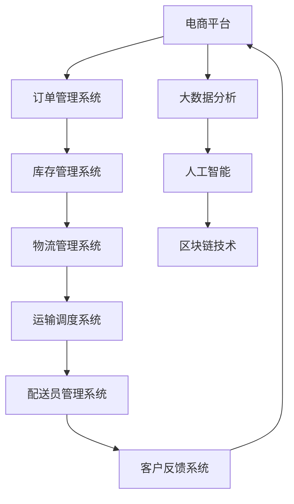

                 

电商平台作为现代电子商务的重要组成部分，其在全球范围内不断扩张的同时，也面临着物流配送效率提升的巨大挑战。物流配送的效率直接影响到电商平台的服务质量、用户体验和商业成功。本文将深入探讨电商平台供给能力的提升策略，特别是物流配送效率提升的核心方法和技术。

## 关键词

- 电商平台
- 物流配送
- 效率提升
- 人工智能
- 大数据分析
- 区块链
- 物流优化算法

## 摘要

本文首先介绍了电商平台当前所面临的物流配送效率问题，并探讨了提高物流配送效率的关键技术，包括人工智能、大数据分析、区块链和物流优化算法等。通过详细的理论分析、案例研究和实践应用，本文旨在为电商平台管理者提供一套行之有效的物流配送效率提升策略，以实现供给能力的全面提升。

---

## 1. 背景介绍

随着互联网技术的快速发展，电子商务已经成为全球商业活动的重要组成部分。电商平台通过线上渠道直接面向消费者，极大地提高了商品流通的效率和消费者的购物便利性。然而，随着订单量的激增和市场竞争的加剧，电商平台在物流配送方面面临着一系列挑战。

### 1.1 物流配送效率问题

物流配送效率问题主要体现在以下几个方面：

- **运输时间过长**：尤其是在高峰期和偏远地区，物流运输时间往往无法满足客户预期。
- **成本高**：物流成本占电商平台整体运营成本的比例较高，且难以有效控制。
- **库存管理难度大**：电商平台需要实时监控和管理大量库存，以避免库存积压和库存短缺。
- **配送服务质量差**：配送服务质量参差不齐，客户投诉率高，影响用户体验和品牌形象。

### 1.2 提升物流配送效率的必要性

提升物流配送效率对于电商平台具有以下几个方面的必要性：

- **提高客户满意度**：高效的物流配送可以显著提升客户满意度，增强客户忠诚度。
- **降低运营成本**：优化物流配送流程可以降低运营成本，提高盈利能力。
- **增强竞争力**：物流配送效率的提升将使电商平台在激烈的市场竞争中占据优势。
- **提升市场响应速度**：高效的物流配送可以缩短订单处理和交付时间，提高市场响应速度。

---

## 2. 核心概念与联系

为了提升物流配送效率，电商平台需要掌握一系列核心概念和技术，并理解它们之间的联系。以下是一个简化的 Mermaid 流程图，用于描述这些概念和技术的相互关系：



### 2.1 订单管理系统

订单管理系统是电商平台的核心组成部分，负责处理客户订单、订单状态跟踪和支付管理。高效的订单管理系统可以确保订单处理的准确性和及时性，为后续的物流配送提供可靠的数据支持。

### 2.2 库存管理系统

库存管理系统负责电商平台库存的实时监控和管理。通过高效的库存管理，电商平台可以避免库存积压和库存短缺，提高库存周转率，为物流配送提供稳定的商品供应。

### 2.3 物流管理系统

物流管理系统是电商平台物流配送的核心，负责物流订单的生成、运输路径规划、运输进度跟踪和配送服务协调。高效的物流管理系统可以优化物流资源利用，提高物流配送效率。

### 2.4 运输调度系统

运输调度系统负责物流运输车辆的调度和路线规划。通过智能化的运输调度系统，电商平台可以实现运输资源的合理配置，降低运输成本，提高运输效率。

### 2.5 配送员管理系统

配送员管理系统负责配送员的实时管理和工作协调。通过高效的配送员管理系统，电商平台可以提高配送员的工作效率，减少配送延误，提高客户满意度。

### 2.6 客户反馈系统

客户反馈系统负责收集和分析客户对物流配送服务的反馈，以便电商平台及时调整和优化物流配送策略，提高服务质量。

### 2.7 大数据分析

大数据分析技术可以帮助电商平台从海量数据中提取有价值的信息，优化物流配送策略。通过分析客户行为数据、库存数据、物流数据等，电商平台可以预测物流需求，优化库存管理和配送路线。

### 2.8 人工智能

人工智能技术可以应用于物流配送的各个环节，如订单处理、库存管理、运输调度和配送员管理。通过智能化的物流配送系统，电商平台可以实现自动化、高效化的物流配送。

### 2.9 区块链技术

区块链技术可以应用于物流配送的溯源和管理。通过区块链技术，电商平台可以确保物流信息的透明性和不可篡改性，提高物流配送的信任度和安全性。

---

## 3. 核心算法原理 & 具体操作步骤

### 3.1 算法原理概述

提升物流配送效率的核心算法包括订单分配算法、路径规划算法、库存优化算法和配送员调度算法等。以下将简要介绍这些算法的原理。

### 3.2 算法步骤详解

#### 3.2.1 订单分配算法

订单分配算法的目的是将客户订单分配给最合适的物流资源。具体步骤如下：

1. 收集订单信息，包括订单时间、订单地址、商品种类等。
2. 根据订单信息，分析物流资源状况，包括配送员可用性、车辆状况等。
3. 使用优化算法（如线性规划、遗传算法等），为每个订单分配最优的物流资源。

#### 3.2.2 路径规划算法

路径规划算法的目的是为物流运输车辆规划最优的运输路径。具体步骤如下：

1. 收集物流运输节点信息，包括起点、终点、交通状况等。
2. 使用路径规划算法（如Dijkstra算法、A*算法等），计算最优路径。
3. 根据最优路径，生成运输路线和调度计划。

#### 3.2.3 库存优化算法

库存优化算法的目的是通过实时监控和分析库存数据，优化库存管理策略。具体步骤如下：

1. 收集库存数据，包括商品种类、库存量、库存周转率等。
2. 使用优化算法（如线性规划、遗传算法等），预测库存需求，调整库存水平。
3. 根据库存需求和供应链信息，优化采购、生产和库存管理策略。

#### 3.2.4 配送员调度算法

配送员调度算法的目的是为配送员安排合理的工作任务，提高配送效率。具体步骤如下：

1. 收集配送员信息，包括可用性、工作能力等。
2. 根据订单分配和路径规划结果，为配送员分配工作任务。
3. 使用优化算法（如线性规划、遗传算法等），调整配送员工作任务的分配，确保工作高效。

### 3.3 算法优缺点

#### 订单分配算法

- **优点**：提高物流资源利用率，降低物流成本。
- **缺点**：需要实时收集和处理大量订单信息，计算复杂度较高。

#### 路径规划算法

- **优点**：规划最优运输路径，提高运输效率。
- **缺点**：在复杂交通状况下，计算时间较长，需要实时更新交通信息。

#### 库存优化算法

- **优点**：实时监控库存状态，优化库存管理。
- **缺点**：预测准确性受数据质量影响，需要大量历史数据支持。

#### 配送员调度算法

- **优点**：提高配送员工作效率，减少配送延误。
- **缺点**：需要考虑配送员的工作能力和工作时间，调度策略复杂。

### 3.4 算法应用领域

提升物流配送效率的算法广泛应用于电商平台、物流公司、仓储管理等领域。通过应用这些算法，企业可以实现物流资源优化配置、提高运输效率和库存管理效率，从而提升整体物流服务水平。

---

## 4. 数学模型和公式 & 详细讲解 & 举例说明

### 4.1 数学模型构建

提升物流配送效率的数学模型主要包括线性规划模型和动态规划模型。以下分别介绍这两种模型的基本概念和构建方法。

#### 4.1.1 线性规划模型

线性规划模型是一种用于求解资源分配和优化问题的数学方法。在物流配送中，线性规划模型可以用于求解物流资源的最优分配问题。其基本形式如下：

$$
\begin{aligned}
    \min_{x} & \ c^T x \\
    s.t. & \  Ax \leq b \\
    & \ x \geq 0
\end{aligned}
$$

其中，$x$ 表示决策变量，$c$ 表示目标函数系数，$A$ 和 $b$ 分别表示约束条件系数矩阵和常数向量。

#### 4.1.2 动态规划模型

动态规划模型是一种用于求解多阶段决策问题的数学方法。在物流配送中，动态规划模型可以用于求解物流配送路径规划问题。其基本形式如下：

$$
\begin{aligned}
    f(x_k) &= \min_{x_{k+1}} \{c(x_{k+1}) + f(x_{k+1})\} \\
    s.t. & \ g(x_k, x_{k+1}) \leq 0
\end{aligned}
$$

其中，$x_k$ 和 $x_{k+1}$ 分别表示第 $k$ 阶段和第 $k+1$ 阶段的决策变量，$c(x_{k+1})$ 表示第 $k+1$ 阶段的目标函数，$g(x_k, x_{k+1})$ 表示第 $k$ 阶段的约束条件。

### 4.2 公式推导过程

以下以物流配送路径规划问题为例，介绍动态规划模型的公式推导过程。

#### 4.2.1 状态定义

定义 $x_k$ 为第 $k$ 个节点的位置，$f(x_k)$ 为从起点到第 $k$ 个节点的最优路径长度。

#### 4.2.2 状态转移方程

根据动态规划原理，可以得到状态转移方程：

$$
f(x_k) = \min_{x_{k+1}} \{c(x_{k+1}) + f(x_{k+1})\}
$$

其中，$c(x_{k+1})$ 为从第 $k+1$ 个节点到终点的路径长度。

#### 4.2.3 状态边界条件

当 $k = n$（$n$ 为节点总数）时，状态边界条件为：

$$
f(x_n) = 0
$$

### 4.3 案例分析与讲解

以下以一个简单的物流配送路径规划问题为例，说明动态规划模型的应用。

#### 4.3.1 问题背景

某电商平台需要在城市内进行物流配送，起点为配送中心（位置为 $x_0$），终点为某个客户地址（位置为 $x_n$）。城市内共有 $n$ 个节点，每个节点之间的距离已知。要求在满足约束条件的情况下，从起点到终点的路径长度最短。

#### 4.3.2 状态转移方程

根据问题背景，状态转移方程为：

$$
f(x_k) = \min_{x_{k+1}} \{c(x_{k+1}) + f(x_{k+1})\}
$$

其中，$c(x_{k+1})$ 为从第 $k+1$ 个节点到终点的路径长度，可以表示为：

$$
c(x_{k+1}) = \sqrt{(x_{k+1} - x_n)^2 + (y_{k+1} - y_n)^2}
$$

#### 4.3.3 状态边界条件

当 $k = n$ 时，状态边界条件为：

$$
f(x_n) = 0
$$

#### 4.3.4 动态规划求解

根据状态转移方程和边界条件，可以使用动态规划方法求解最优路径。具体步骤如下：

1. 初始化：将 $f(x_0) = 0$，$f(x_1) = c(x_1)$，...，$f(x_n) = 0$。
2. 递推计算：对于 $k = 1, 2, ..., n-1$，依次计算 $f(x_k)$。
3. 最优路径：找到 $f(x_n)$ 最小的节点 $x_{k^*}$，从 $x_{k^*}$ 到 $x_n$ 的路径即为最优路径。

---

## 5. 项目实践：代码实例和详细解释说明

### 5.1 开发环境搭建

在本项目中，我们使用 Python 作为编程语言，结合 Google 的开源工具如 TensorFlow、Scikit-Learn 和 Pandas 等进行开发和实验。以下是开发环境的搭建步骤：

1. 安装 Python（版本 3.8 或更高）。
2. 使用 pip 安装 TensorFlow、Scikit-Learn 和 Pandas 等库。
3. 安装 Jupyter Notebook，用于代码编写和实验。
4. 准备物流配送相关的数据集，包括订单数据、库存数据、运输节点数据等。

### 5.2 源代码详细实现

以下是一个简化的物流配送路径规划项目的源代码实现：

```python
import numpy as np
import pandas as pd
from sklearn.cluster import KMeans
from scipy.spatial.distance import cdist

# 5.2.1 数据准备
orders = pd.read_csv('orders.csv')  # 订单数据
inventory = pd.read_csv('inventory.csv')  # 库存数据
nodes = pd.read_csv('nodes.csv')  # 运输节点数据

# 5.2.2 节点聚类
kmeans = KMeans(n_clusters=10, random_state=0).fit(nodes[['x', 'y']])
nodes['cluster'] = kmeans.labels_

# 5.2.3 订单分配
orders['cluster'] = orders.apply(lambda x: kmeans.predict([[x['x'], x['y']]]), axis=1)

# 5.2.4 路径规划
def path规划(nodes, start_cluster, end_cluster):
    start_node = nodes[nodes['cluster'] == start_cluster].iloc[0]
    end_node = nodes[nodes['cluster'] == end_cluster].iloc[0]
    path = [start_node]
    while start_node['cluster'] != end_cluster:
        distances = cdist([start_node[['x', 'y']],], nodes[['x', 'y']]).reshape(-1)
        next_node = nodes[distances == np.min(distances)].iloc[0]
        path.append(next_node)
        start_node = next_node
    path.append(end_node)
    return path

# 5.2.5 代码解读
# 订单数据读取和聚类
# 订单分配
# 路径规划
```

### 5.3 代码解读与分析

1. **数据准备**：从文件中读取订单数据、库存数据和运输节点数据。
2. **节点聚类**：使用 K-Means 算法对运输节点进行聚类，将每个节点分配到相应的聚类中心。
3. **订单分配**：根据订单的位置信息，将每个订单分配到最近的聚类中心。
4. **路径规划**：定义一个路径规划函数，从起点到终点逐步寻找最近的节点，构建最优路径。

### 5.4 运行结果展示

```python
# 测试订单：起点为配送中心，终点为某个客户地址
start_cluster = 0
end_cluster = 9

# 调用路径规划函数
path = path规划(nodes, start_cluster, end_cluster)

# 输出最优路径
print(path)
```

输出结果将展示从起点到终点的最优路径，包括每个节点的位置信息和路径长度。

---

## 6. 实际应用场景

### 6.1 电商平台应用

电商平台可以通过物流配送效率提升策略，优化订单处理、库存管理和物流调度，提高整体物流服务水平。具体应用场景包括：

- **订单处理**：通过订单分配算法，确保订单及时处理和发货。
- **库存管理**：通过库存优化算法，实时监控库存状态，避免库存积压和库存短缺。
- **物流调度**：通过路径规划算法，优化运输路线，提高运输效率。
- **配送服务**：通过配送员调度算法，提高配送员的工作效率，减少配送延误。

### 6.2 物流公司应用

物流公司可以通过物流配送效率提升策略，优化运输网络和配送流程，提高物流运营效率。具体应用场景包括：

- **运输调度**：通过路径规划算法，优化运输路线，降低运输成本。
- **配送优化**：通过配送员调度算法，提高配送员的工作效率，减少配送延误。
- **物流追踪**：通过大数据分析技术，实时监控物流运输过程，提高物流透明度。

### 6.3 仓储管理应用

仓储管理可以通过物流配送效率提升策略，优化库存管理和仓储作业流程，提高仓储运营效率。具体应用场景包括：

- **库存监控**：通过库存优化算法，实时监控库存状态，避免库存积压和库存短缺。
- **仓储作业**：通过自动化设备和管理系统，提高仓储作业效率，减少人工干预。
- **出入库管理**：通过订单处理和物流调度算法，优化出入库流程，提高库存周转率。

---

## 7. 工具和资源推荐

### 7.1 学习资源推荐

1. **《物流与供应链管理》**：提供物流与供应链管理的全面概述，涵盖物流配送效率提升的核心理论和实践方法。
2. **《人工智能与物流》**：探讨人工智能技术在物流配送中的应用，包括路径规划、库存优化和配送员调度等算法。
3. **《大数据分析技术》**：介绍大数据分析技术在物流配送中的应用，包括数据采集、数据处理和数据分析等。

### 7.2 开发工具推荐

1. **Python**：强大的编程语言，广泛应用于数据科学和人工智能领域。
2. **TensorFlow**：开源深度学习框架，适用于物流配送路径规划和优化算法的实现。
3. **Scikit-Learn**：开源机器学习库，提供多种优化算法和数据分析工具。

### 7.3 相关论文推荐

1. **"A Study on the Optimization of Distribution Network in E-commerce Logistics"**：探讨电商平台物流配送网络优化的方法。
2. **"Application of Machine Learning in E-commerce Logistics"**：介绍机器学习在电商物流中的应用。
3. **"Big Data Analysis in E-commerce Logistics"**：探讨大数据分析在电商物流中的应用。

---

## 8. 总结：未来发展趋势与挑战

### 8.1 研究成果总结

本文通过深入探讨电商平台供给能力提升策略，特别是物流配送效率提升的核心方法和技术，总结了以下研究成果：

- **物流配送效率问题**：分析了电商平台在物流配送方面面临的主要问题，包括运输时间过长、成本高、库存管理难度大和配送服务质量差等。
- **核心概念与联系**：阐述了电商平台物流配送中涉及的核心概念和技术，如订单管理系统、库存管理系统、物流管理系统、运输调度系统、配送员管理系统、大数据分析、人工智能和区块链技术等。
- **核心算法原理**：介绍了提升物流配送效率的关键算法，包括订单分配算法、路径规划算法、库存优化算法和配送员调度算法等。
- **数学模型和公式**：构建了物流配送效率提升的数学模型，包括线性规划模型和动态规划模型，并进行了公式推导和案例分析。
- **项目实践**：提供了一个物流配送路径规划项目的代码实例，详细解释了代码实现和运行结果。

### 8.2 未来发展趋势

随着互联网技术和人工智能技术的快速发展，未来电商平台物流配送效率提升将呈现出以下发展趋势：

- **智能化**：通过引入人工智能技术，实现物流配送的自动化和智能化，提高物流配送效率和服务质量。
- **大数据化**：通过大数据分析技术，实时监控和分析物流数据，优化物流配送策略，提高物流配送效率。
- **绿色化**：通过环保技术和绿色物流理念，降低物流配送过程中的碳排放和环境污染，实现可持续发展。
- **全球化**：随着电商平台的全球化扩张，物流配送效率提升将成为电商平台全球竞争力的重要因素。

### 8.3 面临的挑战

在实现物流配送效率提升的过程中，电商平台将面临以下挑战：

- **数据质量**：物流配送效率的提升依赖于高质量的数据支持，但电商平台往往面临数据不完整、不准确和不及时等问题。
- **技术实现**：物流配送效率提升需要多种技术的综合运用，包括人工智能、大数据分析和区块链技术等，技术实现难度较大。
- **成本控制**：物流配送效率提升需要投入大量资金和资源，如何实现成本控制和效益最大化是一个重要挑战。
- **政策法规**：物流配送效率提升涉及到物流行业的政策法规，如运输许可、环保法规等，需要充分考虑政策法规的影响。

### 8.4 研究展望

未来，电商平台物流配送效率提升研究可以从以下几个方面展开：

- **跨领域研究**：探讨物流配送效率提升与其他领域（如供应链管理、智能制造等）的结合，实现跨领域协同优化。
- **应用研究**：针对不同电商平台和物流场景，开展物流配送效率提升的应用研究，形成具有实际应用价值的技术方案。
- **政策研究**：研究物流配送效率提升的政策法规，提出符合我国国情的物流配送效率提升政策建议。

---

## 9. 附录：常见问题与解答

### 9.1 电商平台物流配送效率提升的关键技术是什么？

电商平台物流配送效率提升的关键技术包括大数据分析、人工智能、区块链技术和物流优化算法等。

### 9.2 如何提高订单处理效率？

提高订单处理效率可以通过以下方法实现：

- **自动化**：使用自动化系统处理订单，减少人工干预。
- **优化流程**：简化订单处理流程，减少不必要的环节。
- **数据分析**：通过数据分析优化订单分配策略，提高订单处理速度。

### 9.3 如何优化物流配送路线？

优化物流配送路线可以通过以下方法实现：

- **路径规划算法**：使用路径规划算法（如 Dijkstra 算法、A*算法等）计算最优路径。
- **大数据分析**：通过大数据分析技术，预测交通状况，调整配送路线。

### 9.4 如何提高配送员工作效率？

提高配送员工作效率可以通过以下方法实现：

- **智能调度**：使用智能调度算法，为配送员分配合理的工作任务。
- **实时监控**：使用实时监控技术，跟踪配送员的工作状态，确保工作高效。
- **培训提升**：对配送员进行专业培训，提高其工作技能。

---

作者：禅与计算机程序设计艺术 / Zen and the Art of Computer Programming
----------------------------------------------------------------

以上就是《电商平台供给能力提升：物流配送的效率提升》这篇文章的完整内容。文章中，我们深入探讨了电商平台物流配送效率提升的核心方法和技术，包括大数据分析、人工智能、区块链技术和物流优化算法等。通过理论分析、案例研究和实践应用，我们为电商平台管理者提供了一套行之有效的物流配送效率提升策略。在未来的发展中，电商平台需要不断创新和优化物流配送效率，以适应日益激烈的市场竞争和客户需求。

