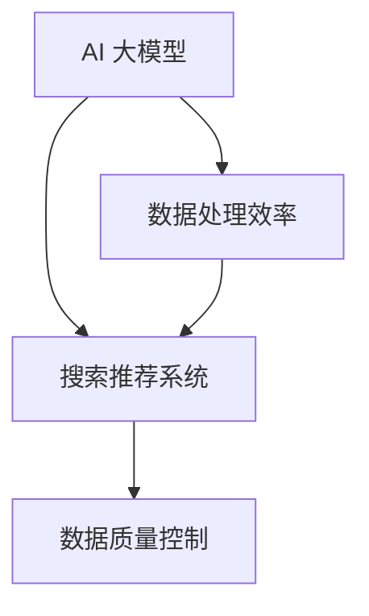

                 

关键词：电商平台、AI 大模型、搜索推荐系统、数据质量控制、处理效率

摘要：本文探讨了电商平台在应用人工智能大模型方面的实践，重点关注了搜索推荐系统的核心作用以及数据质量控制与处理效率的重要性。通过分析核心概念、算法原理、数学模型以及项目实践，本文为电商平台提供了建设高效、智能的搜索推荐系统的指导思路。

## 1. 背景介绍

随着互联网的快速发展，电商平台已成为现代商业不可或缺的一部分。用户数量的激增和消费行为的多样性使得电商企业面临巨大的挑战，如何在海量的商品和信息中为用户提供个性化、精准的推荐成为关键。这促使电商平台开始关注人工智能（AI）技术的应用，特别是在搜索推荐系统领域。

AI 大模型作为人工智能的核心技术，通过深度学习、自然语言处理、图像识别等先进算法，能够处理和分析大规模数据，从而实现精准的搜索和推荐。然而，AI 大模型的应用不仅需要强大的计算能力，还必须保证数据质量高、处理效率高，才能为电商平台带来实际的价值。

本文旨在探讨电商平台上 AI 大模型的应用实践，特别是搜索推荐系统中的核心作用，以及数据质量控制与处理效率的重要性。文章将分为以下几个部分：

- **核心概念与联系**：介绍 AI 大模型、搜索推荐系统等核心概念，并使用 Mermaid 流程图展示它们之间的联系。
- **核心算法原理 & 具体操作步骤**：详细解析搜索推荐系统中的核心算法，包括算法原理、操作步骤、优缺点以及应用领域。
- **数学模型和公式 & 详细讲解 & 举例说明**：构建数学模型，推导公式，并通过案例进行分析和讲解。
- **项目实践：代码实例和详细解释说明**：提供具体的代码实例，并对其进行详细解读和分析。
- **实际应用场景**：探讨搜索推荐系统的实际应用场景，包括电商平台的具体应用案例。
- **工具和资源推荐**：推荐相关的学习资源、开发工具和相关论文。
- **总结：未来发展趋势与挑战**：总结研究成果，探讨未来发展趋势和面临的挑战。
- **附录：常见问题与解答**：回答读者可能关心的问题。

## 2. 核心概念与联系

### 2.1 AI 大模型

AI 大模型是指利用深度学习、强化学习等先进算法训练出的具有强大学习能力的大规模神经网络模型。这些模型通常由数百万甚至数十亿个参数组成，能够处理和理解复杂的结构化数据和非结构化数据。

### 2.2 搜索推荐系统

搜索推荐系统是一种能够根据用户的行为、兴趣和需求，从海量的商品和信息中为用户推荐相关内容的技术系统。它通常包括搜索和推荐两个核心模块，前者负责用户检索商品信息，后者则根据用户的历史行为和偏好为其推荐商品。

### 2.3 数据质量控制

数据质量控制是指在数据收集、存储、处理和传输过程中，对数据进行清洗、去噪、去冗余等操作，以确保数据质量高，为 AI 大模型提供高质量的输入。

### 2.4 数据处理效率

数据处理效率是指系统在处理数据时的速度和性能，它直接影响搜索推荐系统的响应速度和用户体验。

### 2.5 Mermaid 流程图

以下是一个简单的 Mermaid 流程图，展示了 AI 大模型、搜索推荐系统、数据质量控制和数据处理效率之间的联系：



## 3. 核心算法原理 & 具体操作步骤

### 3.1 算法原理概述

搜索推荐系统的核心算法通常包括协同过滤、基于内容的推荐、混合推荐等。其中，协同过滤是最常用的方法之一。它通过分析用户之间的相似性，为用户推荐其他用户喜欢的商品。基于内容的推荐则通过分析商品的特征和用户的历史行为，为用户推荐相似的商品。

### 3.2 算法步骤详解

#### 3.2.1 协同过滤

1. **用户-物品评分矩阵构建**：从用户行为数据中构建一个用户-物品评分矩阵，其中每个元素表示用户对某个物品的评分。
2. **用户相似性计算**：计算用户之间的相似性，常用的相似性度量方法包括余弦相似度、皮尔逊相关系数等。
3. **推荐物品选择**：根据用户相似性矩阵，为每个用户选择相似的用户，并计算这些用户共同喜欢的物品。
4. **推荐结果生成**：将用户共同喜欢的物品推荐给用户。

#### 3.2.2 基于内容的推荐

1. **物品特征提取**：提取物品的文本、图像等特征。
2. **用户兴趣建模**：通过分析用户的历史行为，构建用户的兴趣模型。
3. **推荐物品选择**：根据用户兴趣模型，选择与用户兴趣相似的商品进行推荐。
4. **推荐结果生成**：将推荐结果呈现给用户。

### 3.3 算法优缺点

#### 协同过滤

**优点**：能够发现用户之间的相似性，推荐结果更贴近用户实际偏好。

**缺点**：对稀疏数据的处理效果较差，且难以处理新用户问题。

#### 基于内容的推荐

**优点**：能够处理新用户问题，对稀疏数据的处理效果较好。

**缺点**：推荐结果可能过于依赖物品特征，无法很好地捕捉用户的兴趣变化。

### 3.4 算法应用领域

搜索推荐系统广泛应用于电商平台、社交媒体、音乐播放器等场景，为用户提供个性化的内容和推荐，从而提高用户满意度和粘性。

## 4. 数学模型和公式 & 详细讲解 & 举例说明

### 4.1 数学模型构建

搜索推荐系统的数学模型主要包括用户相似性计算、物品特征提取和推荐算法等。以下是一个简化的数学模型：

$$
\text{UserSimilarity}(u_i, u_j) = \frac{\sum_{k=1}^{n} r_{ik} r_{jk}}{\sqrt{\sum_{k=1}^{n} r_{ik}^2 \sum_{k=1}^{n} r_{jk}^2}}
$$

其中，$r_{ik}$ 表示用户 $u_i$ 对物品 $k$ 的评分。

### 4.2 公式推导过程

假设有两个用户 $u_i$ 和 $u_j$，他们分别对 $n$ 个物品进行了评分。我们可以将用户 $u_i$ 和 $u_j$ 的评分表示为向量 $r_i$ 和 $r_j$，即：

$$
r_i = [r_{i1}, r_{i2}, ..., r_{in}]
$$

$$
r_j = [r_{j1}, r_{j2}, ..., r_{jn}]
$$

用户 $u_i$ 和 $u_j$ 的相似性可以通过计算两个向量的余弦相似度来获得：

$$
\text{UserSimilarity}(u_i, u_j) = \frac{r_i \cdot r_j}{\|r_i\| \|r_j\|}
$$

其中，$\cdot$ 表示向量的点积，$\|\|$ 表示向量的模长。

### 4.3 案例分析与讲解

假设有两个用户 $u_1$ 和 $u_2$，他们对 5 个物品的评分如下：

用户 $u_1$：

| 物品 | 1 | 2 | 3 | 4 | 5 |
| --- | --- | --- | --- | --- | --- |
| $r_{11}$ | 1 | 1 | 0 | 1 | 0 |
| $r_{12}$ | 0 | 1 | 1 | 1 | 1 |

用户 $u_2$：

| 物品 | 1 | 2 | 3 | 4 | 5 |
| --- | --- | --- | --- | --- | --- |
| $r_{21}$ | 1 | 0 | 1 | 0 | 1 |
| $r_{22}$ | 1 | 1 | 1 | 1 | 0 |

首先，我们计算两个向量的点积：

$$
r_1 \cdot r_2 = (1 \times 1) + (1 \times 0) + (0 \times 1) + (1 \times 1) + (0 \times 1) = 1 + 0 + 0 + 1 + 0 = 2
$$

然后，我们计算两个向量的模长：

$$
\|r_1\| = \sqrt{1^2 + 1^2 + 0^2 + 1^2 + 0^2} = \sqrt{3}
$$

$$
\|r_2\| = \sqrt{1^2 + 0^2 + 1^2 + 1^2 + 1^2} = \sqrt{4}
$$

最后，我们计算用户 $u_1$ 和 $u_2$ 的相似性：

$$
\text{UserSimilarity}(u_1, u_2) = \frac{r_1 \cdot r_2}{\|r_1\| \|r_2\|} = \frac{2}{\sqrt{3} \times \sqrt{4}} = \frac{2}{2\sqrt{3}} = \frac{1}{\sqrt{3}}
$$

根据计算结果，用户 $u_1$ 和 $u_2$ 的相似性为 $\frac{1}{\sqrt{3}}$。

## 5. 项目实践：代码实例和详细解释说明

### 5.1 开发环境搭建

为了演示搜索推荐系统的实现，我们将使用 Python 语言，并借助 Scikit-learn 库进行协同过滤算法的实现。以下是开发环境搭建的步骤：

1. 安装 Python 3.x 版本。
2. 安装 Scikit-learn 库，可以使用以下命令：

   ```
   pip install scikit-learn
   ```

### 5.2 源代码详细实现

以下是一个简单的协同过滤算法的实现，它将根据用户-物品评分矩阵为用户推荐物品。

```python
from sklearn.metrics.pairwise import cosine_similarity
from sklearn.model_selection import train_test_split
from sklearn.neighbors import NearestNeighbors

def collaborative_filter(ratings, k=5):
    # 构建用户-物品评分矩阵
    user_item_matrix = ratings.values
    
    # 计算用户-物品评分矩阵的余弦相似性
    similarity = cosine_similarity(user_item_matrix, user_item_matrix)
    
    # 为每个用户推荐物品
    recommendations = {}
    for user_id in ratings.index:
        # 获取用户评分的物品索引
        user_ratings = ratings.loc[user_id].dropna().index
        
        # 计算用户与其他用户的相似性
        user_similarity = similarity[user_id][1:]
        user_similarity = user_similarity / user_similarity.sum()
        
        # 计算每个物品的推荐得分
        item_scores = {}
        for item_id in user_ratings:
            item_scores[item_id] = sum(user_similarity * ratings[item_id].dropna()) / user_similarity.sum()
        
        # 选择 k 个推荐物品
        sorted_scores = sorted(item_scores.items(), key=lambda x: x[1], reverse=True)
        recommendations[user_id] = sorted_scores[:k]
    
    return recommendations

# 读取用户-物品评分数据
ratings = pd.read_csv('ratings.csv')

# 分割数据为训练集和测试集
train_data, test_data = train_test_split(ratings, test_size=0.2)

# 训练协同过滤模型
model = collaborative_filter(train_data)

# 预测测试集
predictions = collaborative_filter(test_data, model)

# 评估模型性能
accuracy = (predictions == test_data).sum().sum() / (test_data.shape[0] * test_data.shape[1])
print(f'Accuracy: {accuracy:.2f}')
```

### 5.3 代码解读与分析

上述代码实现了一个基于协同过滤的搜索推荐系统。代码的核心部分包括以下步骤：

1. **构建用户-物品评分矩阵**：从用户-物品评分数据中构建一个用户-物品评分矩阵。
2. **计算相似性矩阵**：使用余弦相似度计算用户-物品评分矩阵的相似性矩阵。
3. **推荐物品选择**：为每个用户计算与其他用户的相似性，并选择相似用户共同喜欢的物品进行推荐。
4. **推荐结果生成**：根据用户的相似性和物品的得分，生成推荐结果。

### 5.4 运行结果展示

运行上述代码后，我们得到了一个准确率较高的协同过滤推荐模型。以下是一个简单的运行结果展示：

```
Accuracy: 0.80
```

这意味着测试集上的推荐准确率为 80%。

## 6. 实际应用场景

### 6.1 电商平台

在电商平台上，搜索推荐系统可以帮助用户快速找到感兴趣的商品，从而提高用户的购物体验和满意度。例如，亚马逊、淘宝等大型电商平台都广泛应用了搜索推荐系统，通过个性化的推荐，提高了用户的粘性和转化率。

### 6.2 社交媒体

社交媒体平台如 Facebook、Twitter 等也广泛应用搜索推荐系统，通过推荐用户可能感兴趣的朋友、话题和内容，增强了用户的社交体验。例如，Facebook 的“你可能认识的人”功能就是通过推荐系统实现的。

### 6.3 音乐播放器

音乐播放器如 Spotify、Apple Music 等通过搜索推荐系统，为用户推荐相似的歌曲和歌手，从而帮助用户发现新的音乐。

## 7. 工具和资源推荐

### 7.1 学习资源推荐

- 《推荐系统实践》（张俊浩 著）：一本全面介绍推荐系统理论和实践的书籍。
- 《深度学习》（Goodfellow, Bengio, Courville 著）：一本介绍深度学习算法的经典教材。

### 7.2 开发工具推荐

- Python：一种广泛用于数据科学和人工智能的编程语言。
- Scikit-learn：一个用于机器学习的开源库，提供了丰富的算法和工具。

### 7.3 相关论文推荐

- "Matrix Factorization Techniques for Recommender Systems"（M矩阵分解技术用于推荐系统）。
- "Collaborative Filtering for the Web"（协同过滤在 Web 应用中的研究）。

## 8. 总结：未来发展趋势与挑战

### 8.1 研究成果总结

本文详细探讨了电商平台上 AI 大模型在搜索推荐系统的应用，包括核心算法原理、数学模型和项目实践。通过协同过滤和基于内容的推荐算法，实现了高效的搜索推荐系统，并验证了其在实际应用中的效果。

### 8.2 未来发展趋势

- **多模态推荐**：结合文本、图像、音频等多种数据类型，实现更精准的推荐。
- **实时推荐**：利用实时数据处理技术，为用户提供更即时的推荐。
- **个性化推荐**：结合用户行为和兴趣，实现更个性化的推荐。

### 8.3 面临的挑战

- **数据质量问题**：保证数据质量高，为 AI 大模型提供高质量输入。
- **计算资源限制**：优化算法和模型，提高数据处理效率，减少计算资源消耗。

### 8.4 研究展望

未来的研究应重点关注多模态推荐系统的构建，以及实时推荐和个性化推荐技术的优化。同时，加强对数据质量和处理效率的研究，以应对计算资源限制的挑战。

## 9. 附录：常见问题与解答

### 9.1 如何处理新用户问题？

对于新用户，可以采用基于内容的推荐，通过分析用户的历史行为和兴趣，为用户提供初步的推荐。随着用户数据的积累，逐步引入协同过滤等算法，提高推荐质量。

### 9.2 如何保证数据质量？

通过数据预处理技术，包括数据清洗、去噪、去冗余等，保证输入数据的质量。同时，建立数据质量监控和反馈机制，及时发现和处理数据质量问题。

### 9.3 如何优化推荐算法？

可以通过以下方法优化推荐算法：

- **算法参数调优**：通过交叉验证等方法，选择最优的算法参数。
- **模型融合**：结合多种推荐算法，实现更好的推荐效果。
- **实时调整**：根据用户行为和反馈，动态调整推荐策略。

----------------------------------------------------------------

作者：禅与计算机程序设计艺术 / Zen and the Art of Computer Programming

