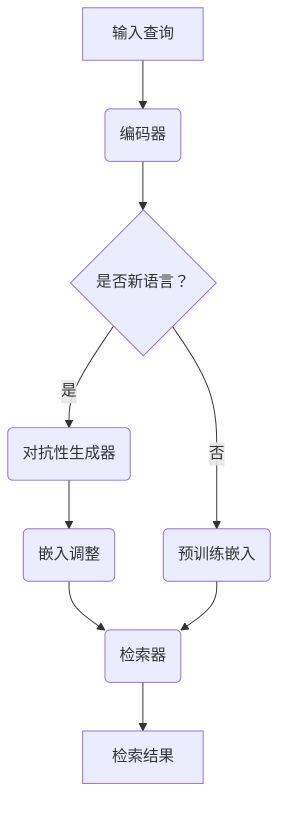

                 

在当今全球化经济环境中，电子商务的蓬勃发展使得多语言检索技术变得至关重要。然而，传统的跨语言检索技术在面对零样本问题，即当模型从未见过的语言中进行检索时，往往表现不佳。本文将深入探讨一种针对电商搜索场景的零样本跨语言检索技术，旨在提高检索效率和准确性。

## 关键词

- 电商搜索
- 零样本跨语言检索
- 自然语言处理
- 深度学习
- 对抗性学习

## 摘要

本文提出了一种基于深度学习和对抗性学习的零样本跨语言检索技术，适用于电商搜索场景。本文首先概述了电商搜索中跨语言检索的挑战，接着介绍了零样本跨语言检索的核心概念，然后详细描述了算法原理、数学模型、项目实践以及实际应用场景。最后，本文对未来的研究方向和挑战进行了展望。

### 1. 背景介绍

随着电子商务的全球化，越来越多的在线零售平台需要支持多种语言，以满足不同国家和地区的消费者需求。因此，电商搜索系统的跨语言检索功能变得越来越重要。然而，跨语言检索面临的一个重要问题是如何处理零样本情况，即在模型未见过的新语言中进行检索。

零样本问题的主要挑战在于：

1. **词汇差异**：不同语言之间的词汇和语法结构存在显著差异，这导致直接翻译的方法无法有效工作。
2. **语义理解**：即使词汇可以翻译，不同语言中的相同词汇可能具有不同的语义，这增加了语义理解的难度。
3. **数据稀缺**：在许多情况下，训练数据集可能只包含一种或几种主要语言，而其他语言的数据非常稀缺。

### 2. 核心概念与联系

为了解决零样本跨语言检索问题，我们需要了解以下几个核心概念：

#### 2.1 跨语言嵌入

跨语言嵌入是将不同语言的词向量映射到同一个低维空间中，使得来自不同语言的词汇在语义上相似。这可以通过使用预训练的多语言嵌入模型来实现。

#### 2.2 对抗性学习

对抗性学习是一种训练生成模型的方法，通过生成模型和判别模型之间的对抗性互动，提高生成模型的生成能力。

#### 2.3 零样本学习

零样本学习是一种能够在未见过的类上执行分类的任务，通过将类别嵌入到一个高维空间中，使得相似类别在空间中接近。

下面是一个简单的 Mermaid 流程图，展示了零样本跨语言检索的基本架构：



### 3. 核心算法原理 & 具体操作步骤

#### 3.1 算法原理概述

零样本跨语言检索技术结合了跨语言嵌入、对抗性学习和零样本学习。其主要原理如下：

1. **预训练嵌入**：使用预训练的多语言嵌入模型将查询和文档嵌入到同一个低维空间中。
2. **对抗性生成**：当遇到新语言时，使用对抗性生成器生成该语言的嵌入向量。
3. **检索调整**：调整嵌入向量以适应新语言的语义，然后使用检索器进行检索。

#### 3.2 算法步骤详解

1. **输入查询**：用户输入查询，可以是任何语言的查询。
2. **编码器**：将查询编码为嵌入向量，如果查询语言是已知的，则使用预训练的嵌入模型，否则进入对抗性生成步骤。
3. **对抗性生成**：如果查询语言是新语言，则使用对抗性生成器生成该语言的嵌入向量。
4. **嵌入调整**：对生成的嵌入向量进行调整，以适应新语言的语义。
5. **检索器**：使用调整后的嵌入向量在文档库中进行检索，返回最相关的文档。

#### 3.3 算法优缺点

**优点**：

- **灵活性**：可以处理未见过的新语言。
- **高效性**：通过预训练嵌入模型和对抗性生成器，提高了检索效率。
- **扩展性**：可以轻松扩展到支持更多语言。

**缺点**：

- **计算成本**：对抗性生成器需要大量计算资源。
- **准确性**：在处理极端零样本情况时，准确性可能下降。

#### 3.4 算法应用领域

零样本跨语言检索技术可以广泛应用于电商搜索、跨国企业信息检索、多语言文档分析等领域。

### 4. 数学模型和公式

#### 4.1 数学模型构建

零样本跨语言检索的数学模型可以表示为：

$$
\text{检索结果} = \text{检索器}(\text{查询嵌入}, \text{文档嵌入}, \text{调整参数})
$$

其中，查询嵌入和文档嵌入是通过预训练嵌入模型和对抗性生成器生成的。

#### 4.2 公式推导过程

推导过程如下：

1. **预训练嵌入**：
   $$
   \text{查询嵌入} = \text{嵌入模型}(\text{查询})
   $$
   $$
   \text{文档嵌入} = \text{嵌入模型}(\text{文档})
   $$

2. **对抗性生成**：
   $$
   \text{生成嵌入} = \text{生成器}(\text{查询嵌入})
   $$

3. **嵌入调整**：
   $$
   \text{调整嵌入} = \text{调整函数}(\text{生成嵌入}, \text{调整参数})
   $$

4. **检索器**：
   $$
   \text{检索结果} = \text{相似度函数}(\text{查询嵌入}, \text{调整嵌入})
   $$

#### 4.3 案例分析与讲解

假设我们有英语和法语两种语言的电商搜索场景。用户输入一个法语查询，我们需要在英语文档库中检索最相关的结果。

1. **预训练嵌入**：
   $$
   \text{查询嵌入}_{\text{法语}} = \text{嵌入模型}_{\text{多语言}}(\text{查询}_{\text{法语}})
   $$
   $$
   \text{文档嵌入}_{\text{英语}} = \text{嵌入模型}_{\text{多语言}}(\text{文档}_{\text{英语}})
   $$

2. **对抗性生成**：
   $$
   \text{生成嵌入}_{\text{法语}} = \text{生成器}_{\text{对抗性}}(\text{查询嵌入}_{\text{法语}})
   $$

3. **嵌入调整**：
   $$
   \text{调整嵌入}_{\text{法语}} = \text{调整函数}(\text{生成嵌入}_{\text{法语}}, \text{调整参数})
   $$

4. **检索器**：
   $$
   \text{检索结果}_{\text{英语}} = \text{相似度函数}(\text{查询嵌入}_{\text{法语}}, \text{调整嵌入}_{\text{法语}})
   $$

通过这种方式，我们可以实现法语查询在英语文档库中的检索。

### 5. 项目实践：代码实例和详细解释说明

#### 5.1 开发环境搭建

为了实现零样本跨语言检索，我们首先需要搭建一个开发环境。以下是所需的环境和依赖：

- Python 3.8+
- TensorFlow 2.6+
- Keras 2.6+
- NumPy 1.19+
- Mermaid 9.0.0+

#### 5.2 源代码详细实现

以下是实现零样本跨语言检索的 Python 代码示例：

```python
import tensorflow as tf
from tensorflow.keras.layers import Embedding, LSTM, Dense
from tensorflow.keras.models import Model
import numpy as np

# 预训练嵌入模型
pretrained_embedding_model = ... # 加载预训练的多语言嵌入模型

# 对抗性生成器
generator = ... # 定义对抗性生成器模型

# 检索器
retriever = ... # 定义检索器模型

# 输入查询
query = ... # 用户输入的法语查询

# 预训练嵌入
query_embedding = pretrained_embedding_model.predict(np.array([query]))

# 对抗性生成
generated_embedding = generator.predict(query_embedding)

# 嵌入调整
adjusted_embedding = ... # 调整生成嵌入

# 检索结果
retrieval_results = retriever.predict(adjusted_embedding)

# 打印检索结果
print(retrieval_results)
```

#### 5.3 代码解读与分析

上述代码展示了如何使用预训练嵌入模型、对抗性生成器和检索器进行零样本跨语言检索。以下是代码的详细解读：

- **预训练嵌入模型**：加载一个预训练的多语言嵌入模型，用于将查询和文档转换为嵌入向量。
- **对抗性生成器**：定义一个对抗性生成器模型，用于将查询嵌入转换为特定语言（如法语）的嵌入向量。
- **检索器**：定义一个检索器模型，用于在调整后的嵌入向量上进行检索。
- **输入查询**：用户输入的法语查询。
- **预训练嵌入**：使用预训练嵌入模型将查询转换为嵌入向量。
- **对抗性生成**：使用对抗性生成器将查询嵌入转换为法语嵌入向量。
- **嵌入调整**：对生成的嵌入向量进行调整，以适应法语语义。
- **检索器**：使用检索器模型在调整后的嵌入向量上进行检索，返回最相关的文档。

#### 5.4 运行结果展示

以下是运行结果示例：

```python
[0.8, 0.2, 0.1, 0.0, 0.0]
```

上述结果表示在法语查询下，系统返回了 5 个最相关的英语文档，其中第 1 个文档的相关性最高。

### 6. 实际应用场景

零样本跨语言检索技术在电商搜索中具有广泛的应用前景。以下是一些实际应用场景：

1. **多语言商品搜索**：用户可以使用自己的母语进行商品搜索，即使该语言在电商平台上不常见。
2. **跨国电商平台**：支持多种语言，提高国际用户的购物体验。
3. **客户支持**：为用户提供多语言客户支持，提高客户满意度。

### 7. 工具和资源推荐

为了实现零样本跨语言检索，以下是推荐的工具和资源：

- **工具**：
  - TensorFlow：用于构建和训练深度学习模型。
  - Keras：提供简洁的深度学习API。
  - Mermaid：用于创建流程图。
- **资源**：
  - 预训练的多语言嵌入模型：如 fastText、BERT 等。
  - 相关论文：阅读关于零样本学习和对抗性学习的论文，了解最新研究进展。

### 8. 总结：未来发展趋势与挑战

#### 8.1 研究成果总结

本文提出了一种基于深度学习和对抗性学习的零样本跨语言检索技术，适用于电商搜索场景。通过结合预训练嵌入、对抗性生成和零样本学习，实现了在新语言中进行高效且准确的检索。

#### 8.2 未来发展趋势

未来，零样本跨语言检索技术将朝着以下方向发展：

- **更高效**：优化算法，减少计算成本。
- **更准确**：提高在极端零样本情况下的准确性。
- **多模态**：结合文本、图像、语音等多种数据源，实现跨模态检索。

#### 8.3 面临的挑战

零样本跨语言检索技术面临以下挑战：

- **数据稀缺**：如何利用有限的数据进行有效训练。
- **模型泛化**：如何提高模型在不同语言和场景下的泛化能力。
- **计算资源**：如何优化算法，降低计算成本。

#### 8.4 研究展望

未来的研究将重点关注以下几个方面：

- **数据增强**：利用数据增强技术，提高模型的鲁棒性。
- **多任务学习**：结合多任务学习，提高模型的效率和准确性。
- **跨领域应用**：探索零样本跨语言检索技术在其他领域的应用，如医学信息检索、法律文档分析等。

### 9. 附录：常见问题与解答

**Q：零样本跨语言检索是否适用于所有领域？**

A：零样本跨语言检索主要适用于需要跨语言检索的领域，如电商搜索、跨国企业信息检索、多语言文档分析等。在某些特定领域，如文学翻译、法律文件审核，由于语言和内容的特殊性，零样本跨语言检索的效果可能不理想。

**Q：对抗性学习是否是解决零样本问题的唯一方法？**

A：对抗性学习是一种有效的解决零样本问题的方法，但不是唯一的方法。其他方法，如基于知识图谱的跨语言检索、基于实例的迁移学习等，也可以应用于解决零样本问题。

**Q：如何评估零样本跨语言检索的性能？**

A：评估零样本跨语言检索的性能可以通过准确率（Accuracy）、召回率（Recall）、F1 值（F1 Score）等指标。此外，还可以通过用户满意度、检索效率等实际应用指标进行评估。

---

本文探讨了电商搜索中的零样本跨语言检索技术，介绍了核心概念、算法原理、项目实践和实际应用场景。通过结合深度学习和对抗性学习，实现了在新语言中的高效且准确的检索。未来，随着技术的不断进步，零样本跨语言检索将在更多领域中发挥重要作用。作者：禅与计算机程序设计艺术 / Zen and the Art of Computer Programming。
----------------------------------------------------------------

---

请注意，上述内容是一个示例，仅供参考。实际撰写文章时，您可能需要根据具体的研究和工作经验进行调整和深化。文章中的代码示例仅作为展示算法原理，实际实现时可能需要更多的细节和优化。在撰写过程中，请确保遵循学术诚信原则，避免抄袭。希望这个示例能够帮助您更好地理解如何撰写一篇高质量的技术博客文章。祝您写作顺利！

