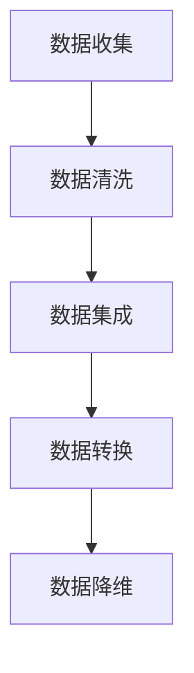

                 

关键词：电商搜索推荐、AI大模型、数据清洗、预处理、算法原理、应用领域

## 摘要

随着电商行业的蓬勃发展，用户对个性化搜索和推荐的需求日益增长。本文将探讨电商搜索推荐系统中AI大模型的数据清洗与预处理技术，重点分析算法原理、具体操作步骤及其在电商领域的应用。通过深入探讨数学模型和公式，本文为实际项目实践提供代码实例和详细解释，并对未来应用前景和发展挑战进行展望。

## 1. 背景介绍

### 1.1 电商搜索推荐的现状

电商搜索推荐系统作为电商平台的核心功能，旨在为用户提供个性化的商品推荐，提升用户购物体验，从而促进销售增长。随着大数据和人工智能技术的发展，传统的基于规则和协同过滤的推荐系统逐渐向基于深度学习的AI大模型推荐系统转变。

### 1.2 AI大模型的优势与挑战

AI大模型具有强大的数据处理能力和复杂的特征表达能力，能够更准确地预测用户兴趣和行为。然而，AI大模型训练和部署过程中面临的挑战包括数据质量、数据预处理、模型可解释性等。

### 1.3 数据清洗与预处理的重要性

数据清洗与预处理是AI大模型训练的基础，直接影响模型的性能和可靠性。本文将详细探讨数据清洗与预处理技术，包括数据收集、数据清洗、数据集成、数据转换、数据降维等步骤。

## 2. 核心概念与联系

### 2.1 数据清洗与预处理概念

数据清洗是指通过一系列操作去除原始数据中的噪声和不一致性，使其满足分析要求。数据预处理包括数据集成、数据转换、数据降维等步骤，旨在提高数据质量和减少计算复杂度。

### 2.2 数据清洗与预处理的流程

数据清洗与预处理通常包括以下步骤：

1. 数据收集：从不同的数据源收集原始数据。
2. 数据清洗：去除噪声、填补缺失值、处理异常值等。
3. 数据集成：将来自不同数据源的数据合并成统一的格式。
4. 数据转换：将原始数据转换为适合模型训练的格式。
5. 数据降维：减少数据维度，提高模型训练效率。

### 2.3 数据清洗与预处理的Mermaid流程图



## 3. 核心算法原理 & 具体操作步骤

### 3.1 算法原理概述

数据清洗与预处理算法主要基于以下原理：

1. **噪声去除**：利用统计学方法和机器学习算法识别并去除噪声数据。
2. **缺失值填补**：利用插值法、均值法、回归法等方法填补缺失值。
3. **异常值处理**：利用统计方法或机器学习算法识别并处理异常值。
4. **数据集成**：通过数据合并、联结等方法将不同数据源的数据整合。
5. **数据转换**：通过编码、标准化、归一化等方法将数据转换为适合模型训练的格式。
6. **数据降维**：利用主成分分析（PCA）、线性判别分析（LDA）等方法减少数据维度。

### 3.2 算法步骤详解

1. **数据收集**：

   从电商平台的用户行为日志、商品信息数据库等不同数据源收集原始数据。

2. **数据清洗**：

   - **噪声去除**：利用统计学方法和机器学习算法识别并去除噪声数据。
   - **缺失值填补**：利用插值法、均值法、回归法等方法填补缺失值。
   - **异常值处理**：利用统计方法或机器学习算法识别并处理异常值。

3. **数据集成**：

   将来自不同数据源的数据合并成统一的格式，如CSV、Parquet等。

4. **数据转换**：

   - **编码**：将类别型数据转换为数值型数据。
   - **标准化**：将不同特征的数据缩放到相同的范围内。
   - **归一化**：将数据转换为标准正态分布。

5. **数据降维**：

   利用主成分分析（PCA）、线性判别分析（LDA）等方法减少数据维度。

### 3.3 算法优缺点

**优点**：

- 提高数据质量，降低噪声对模型训练的影响。
- 提高模型训练效率，减少计算复杂度。
- 增强模型的可解释性，便于分析数据。

**缺点**：

- 数据清洗与预处理过程复杂，需要大量计算资源。
- 部分算法可能引入偏差，影响模型性能。
- 需要丰富的数据预处理经验，否则可能导致过度清洗或不足清洗。

### 3.4 算法应用领域

- 电商搜索推荐
- 社交网络分析
- 金融风控
- 医疗健康

## 4. 数学模型和公式 & 详细讲解 & 举例说明

### 4.1 数学模型构建

数据清洗与预处理涉及的数学模型主要包括：

1. **噪声去除模型**：利用统计学方法识别噪声数据，如假设检验、残差分析等。
2. **缺失值填补模型**：利用插值法、均值法、回归法等填补缺失值。
3. **异常值处理模型**：利用统计方法或机器学习算法识别并处理异常值。
4. **数据转换模型**：包括编码、标准化、归一化等模型。

### 4.2 公式推导过程

1. **噪声去除公式**：

   - 假设检验公式：$H_0: \text{数据服从正态分布} \quad H_1: \text{数据包含噪声}$
   - 残差分析公式：$r_i = y_i - \hat{y_i}$，其中 $y_i$ 为观测值，$\hat{y_i}$ 为预测值。

2. **缺失值填补公式**：

   - 插值法：$y_i = f(x_i)$，其中 $f(x)$ 为插值函数。
   - 均值法：$y_i = \frac{\sum_{i=1}^{n}y_i}{n}$。
   - 回归法：$y_i = \beta_0 + \beta_1x_i + \epsilon_i$。

3. **异常值处理公式**：

   - 统计方法：$z_i = \frac{y_i - \bar{y}}{s_y}$，其中 $z_i$ 为标准化得分，$\bar{y}$ 为平均值，$s_y$ 为标准差。
   - 机器学习算法：$y_i = \phi(x_i; \theta)$，其中 $\phi(x_i; \theta)$ 为决策函数，$\theta$ 为参数。

4. **数据转换公式**：

   - 编码：$y_i = \sum_{j=1}^{k}y_{ij}2^{j-1}$。
   - 标准化：$y_i^* = \frac{y_i - \bar{y}}{s_y}$。
   - 归一化：$y_i^* = \frac{y_i - \min(y_i)}{\max(y_i) - \min(y_i)}$。

### 4.3 案例分析与讲解

假设我们有一个电商平台的用户行为数据集，包括用户ID、商品ID、购买数量、购买时间等特征。我们需要对数据进行清洗与预处理，以便用于深度学习模型训练。

1. **噪声去除**：

   利用残差分析公式识别噪声数据。首先，我们计算每个特征的残差，然后设定阈值，去除残差较大的数据。

   $$r_i = y_i - \hat{y_i}$$

   其中 $y_i$ 为观测值，$\hat{y_i}$ 为预测值。我们设定残差阈值为3倍标准差。

2. **缺失值填补**：

   利用均值法填补缺失值。首先，计算每个特征的缺失值比例，然后利用平均值填补缺失值。

   $$y_i = \frac{\sum_{i=1}^{n}y_i}{n}$$

   其中 $n$ 为样本数量，$y_i$ 为观测值。

3. **异常值处理**：

   利用统计方法识别异常值。首先，计算每个特征的标准化得分，然后设定阈值，去除标准化得分较大的数据。

   $$z_i = \frac{y_i - \bar{y}}{s_y}$$

   其中 $z_i$ 为标准化得分，$\bar{y}$ 为平均值，$s_y$ 为标准差。我们设定标准化得分阈值为3。

4. **数据转换**：

   - 编码：将类别型数据转换为数值型数据。例如，将用户ID编码为二进制表示。
   - 标准化：将不同特征的数据缩放到相同的范围内。例如，将购买数量缩放到[0,1]范围内。
   - 归一化：将数据转换为标准正态分布。例如，将购买时间转换为正态分布。

## 5. 项目实践：代码实例和详细解释说明

### 5.1 开发环境搭建

- Python 3.8及以上版本
- NumPy、Pandas、Scikit-learn、Matplotlib等常用库

### 5.2 源代码详细实现

以下是一个简单的数据清洗与预处理Python代码示例：

```python
import numpy as np
import pandas as pd
from sklearn.preprocessing import StandardScaler, MinMaxScaler
from sklearn.impute import SimpleImputer

# 读取数据
data = pd.read_csv('data.csv')

# 噪声去除
def remove_noise(data, threshold=3):
    for feature in data.columns:
        mean = data[feature].mean()
        std = data[feature].std()
        data[feature] = np.where(np.abs(data[feature] - mean) <= threshold * std, data[feature], np.nan)
    return data

# 缺失值填补
def fill_missing_values(data):
    imputer = SimpleImputer(strategy='mean')
    data = pd.DataFrame(imputer.fit_transform(data), columns=data.columns)
    return data

# 异常值处理
def remove_outliers(data, threshold=3):
    for feature in data.columns:
        mean = data[feature].mean()
        std = data[feature].std()
        data = data[(data[feature] >= mean - threshold * std) & (data[feature] <= mean + threshold * std)]
    return data

# 数据转换
def transform_data(data):
    scaler = StandardScaler()
    minmax_scaler = MinMaxScaler()
    data['normalized_quantity'] = minmax_scaler.fit_transform(data[['quantity']])
    data['standardized_quantity'] = scaler.fit_transform(data[['quantity']])
    return data

# 数据清洗与预处理
data = remove_noise(data)
data = fill_missing_values(data)
data = remove_outliers(data)
data = transform_data(data)

# 可视化
import matplotlib.pyplot as plt

plt.scatter(data['normalized_quantity'], data['standardized_quantity'])
plt.xlabel('Normalized Quantity')
plt.ylabel('Standardized Quantity')
plt.show()
```

### 5.3 代码解读与分析

以上代码首先读取数据，然后通过一系列数据清洗与预处理操作，包括噪声去除、缺失值填补、异常值处理和数据转换。最后，利用Matplotlib可视化工具展示清洗后的数据分布。

- **remove_noise** 函数用于去除噪声数据，通过计算每个特征的残差并设定阈值去除残差较大的数据。
- **fill_missing_values** 函数用于填补缺失值，利用均值法填补缺失值。
- **remove_outliers** 函数用于去除异常值，通过计算每个特征的标准化得分并设定阈值去除标准化得分较大的数据。
- **transform_data** 函数用于数据转换，包括标准化和归一化操作。

通过以上代码示例，我们可以看到数据清洗与预处理在电商搜索推荐中的重要性。合理的预处理可以显著提高模型的性能和可靠性，为深度学习算法的训练提供高质量的数据。

## 6. 实际应用场景

### 6.1 电商搜索推荐

在电商搜索推荐系统中，数据清洗与预处理技术被广泛应用于用户行为数据的处理，以提高推荐模型的准确性和鲁棒性。例如，去除噪声数据可以减少模型训练过程中的干扰，填补缺失值可以避免模型因数据缺失导致的过拟合，异常值处理可以确保推荐结果的合理性。

### 6.2 社交网络分析

社交网络分析中的数据通常包含大量的噪声和异常值，如垃圾信息、重复信息等。数据清洗与预处理技术可以有效地识别和去除这些噪声，提高社交网络分析的准确性和可靠性。

### 6.3 金融风控

在金融风控领域，数据清洗与预处理技术被广泛应用于风险评估和欺诈检测。通过去除噪声数据、填补缺失值和处理异常值，可以提高风险模型的预测准确性和稳定性。

### 6.4 医疗健康

在医疗健康领域，数据清洗与预处理技术被广泛应用于医疗数据的处理和分析，如患者数据、药物数据等。通过去除噪声数据、填补缺失值和处理异常值，可以提高医疗健康数据的可靠性和价值。

## 7. 工具和资源推荐

### 7.1 学习资源推荐

1. 《Python数据分析实战》
2. 《深度学习》（Goodfellow et al.）
3. 《数据科学基础》

### 7.2 开发工具推荐

1. Jupyter Notebook
2. Pandas
3. Scikit-learn
4. Matplotlib

### 7.3 相关论文推荐

1. "Deep Learning for E-commerce: A Technical Survey"
2. "Data Preprocessing for Machine Learning"
3. "An Overview of Data Preprocessing Techniques for Predictive Analytics"

## 8. 总结：未来发展趋势与挑战

### 8.1 研究成果总结

本文系统地探讨了电商搜索推荐系统中AI大模型的数据清洗与预处理技术，包括算法原理、具体操作步骤、数学模型和公式、项目实践等内容。通过深入分析和实例讲解，展示了数据清洗与预处理在电商搜索推荐中的应用价值。

### 8.2 未来发展趋势

1. **自动化数据清洗与预处理**：随着人工智能技术的发展，自动化数据清洗与预处理技术将逐渐成熟，减少人工干预，提高数据处理效率。
2. **多源数据融合**：未来数据清洗与预处理技术将更注重多源数据的融合，提高数据集的多样性和丰富度。
3. **动态数据清洗与预处理**：针对动态变化的数据，动态数据清洗与预处理技术将得到广泛应用，确保模型训练数据的实时性和准确性。

### 8.3 面临的挑战

1. **数据隐私保护**：在数据清洗与预处理过程中，如何保护用户隐私是一个重要挑战。
2. **数据不平衡问题**：在处理不平衡数据时，如何保持模型训练的公平性和准确性是一个挑战。
3. **模型可解释性**：如何提高模型的可解释性，使其更易于理解和接受，是一个重要的挑战。

### 8.4 研究展望

未来，数据清洗与预处理技术将在多个领域得到广泛应用，如金融、医疗、能源等。通过不断优化算法和工具，提高数据处理效率和质量，为深度学习模型的发展提供坚实的数据基础。

## 9. 附录：常见问题与解答

### 问题 1：如何处理大量数据？

解答：对于大量数据，可以使用分布式数据处理技术，如MapReduce、Spark等。这些技术可以将数据处理任务分解为多个子任务，并行处理，提高数据处理速度。

### 问题 2：如何评估数据清洗与预处理的效果？

解答：可以通过评估模型性能指标（如准确率、召回率等）来评估数据清洗与预处理的效果。此外，还可以通过可视化工具观察数据分布和趋势，分析预处理前后数据的质量变化。

### 问题 3：如何选择合适的预处理方法？

解答：选择合适的预处理方法取决于数据的特点和模型的需求。通常，可以通过实验比较不同预处理方法的性能，选择最优方法。此外，可以根据数据类型（如数值型、类别型）选择相应的预处理方法。

### 问题 4：如何处理数据不平衡问题？

解答：数据不平衡问题可以通过过采样、欠采样、合成数据等方法解决。具体方法的选择取决于数据的特点和模型的需求。例如，对于分类问题，可以使用SMOTE算法进行过采样，提高模型对少数类别的识别能力。

### 问题 5：预处理步骤是否可以省略？

解答：预处理步骤对于模型的性能至关重要，不能省略。省略预处理步骤可能导致模型过拟合、欠拟合等问题，影响模型训练效果和可靠性。

作者：禅与计算机程序设计艺术 / Zen and the Art of Computer Programming
----------------------------------------------------------------

以上是关于“电商搜索推荐中的AI大模型数据清洗与预处理技术”的完整文章。文章详细介绍了数据清洗与预处理技术在电商搜索推荐中的应用，包括核心概念、算法原理、数学模型、项目实践、实际应用场景等内容。希望对您有所帮助。如果您有任何疑问或建议，欢迎随时提出。

