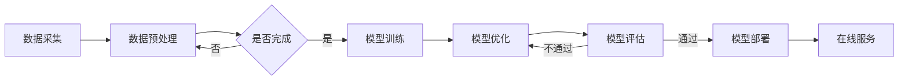

                 

关键词：电商搜索推荐、AI大模型、混合云部署、模型性能优化、分布式计算

摘要：本文将探讨电商搜索推荐场景下AI大模型的部署与混合云实践。随着电商市场的蓬勃发展，搜索推荐系统成为提升用户购物体验的关键因素。本文将从背景介绍、核心概念与联系、核心算法原理、数学模型与公式、项目实践、实际应用场景、工具和资源推荐、总结与展望等方面展开讨论，旨在为从事AI领域的开发者提供有价值的实践参考。

## 1. 背景介绍

随着互联网技术的快速发展，电商行业在全球范围内取得了显著增长。电商平台的搜索推荐系统成为商家与用户之间的重要桥梁，通过个性化推荐帮助用户快速找到所需商品，提升用户体验和购买转化率。然而，随着用户规模的扩大和数据量的增长，传统的搜索推荐系统已无法满足日益复杂的需求。

AI大模型，作为一种强大的机器学习模型，通过深度学习技术对海量数据进行训练，能够实现高度个性化的推荐效果。然而，AI大模型的高计算资源消耗和部署复杂性，使得其在大规模电商场景下的应用面临诸多挑战。因此，如何高效地部署AI大模型，优化模型性能，成为当前研究的重点。

## 2. 核心概念与联系

为了更好地理解AI大模型在电商搜索推荐场景下的部署，我们需要先介绍几个核心概念：

1. **AI大模型**：指采用深度学习技术训练的复杂模型，具有极高的参数量和计算资源需求。
2. **混合云**：将公有云和私有云相结合，通过云服务提供弹性的计算资源，满足不同场景下的需求。
3. **模型部署**：将训练完成的AI大模型部署到实际应用环境中，实现实时推荐和预测。
4. **分布式计算**：将计算任务分解为多个子任务，分布在多个节点上同时执行，提高计算效率。

### Mermaid 流程图

下面是一个简化的Mermaid流程图，展示了AI大模型在电商搜索推荐场景下的部署流程：



## 3. 核心算法原理 & 具体操作步骤

### 3.1 算法原理概述

AI大模型的核心在于深度学习技术，通过多层神经网络对海量数据进行训练，提取特征，实现高精度的推荐效果。具体来说，深度学习算法包括：

1. **卷积神经网络（CNN）**：适用于图像处理任务，能够提取图像中的高维特征。
2. **循环神经网络（RNN）**：适用于序列数据处理任务，能够捕捉时间序列信息。
3. **变换器网络（Transformer）**：基于自注意力机制，适用于处理大规模文本数据。

### 3.2 算法步骤详解

1. **数据采集**：从电商平台获取用户行为数据、商品信息等原始数据。
2. **数据预处理**：对原始数据进行清洗、归一化等处理，以便后续模型训练。
3. **模型训练**：采用深度学习框架（如TensorFlow、PyTorch）训练AI大模型，通过反向传播算法不断优化模型参数。
4. **模型优化**：针对模型性能进行调参和优化，提高模型准确率和推荐效果。
5. **模型评估**：采用交叉验证、A/B测试等方法评估模型性能，确保模型在实际应用中的有效性。
6. **模型部署**：将训练完成的模型部署到混合云环境，实现实时推荐和预测。

### 3.3 算法优缺点

**优点**：

1. **高度个性化**：AI大模型能够根据用户行为和偏好进行高度个性化的推荐。
2. **处理大数据**：能够处理大规模、多维度的数据，适应复杂应用场景。

**缺点**：

1. **计算资源需求高**：训练和部署AI大模型需要大量的计算资源和存储空间。
2. **模型解释性差**：深度学习模型往往缺乏解释性，难以理解其决策过程。

### 3.4 算法应用领域

AI大模型在电商搜索推荐场景下的应用包括：

1. **商品推荐**：根据用户历史购买记录、浏览记录等，为用户推荐感兴趣的商品。
2. **广告推荐**：根据用户兴趣和行为，为用户推送相关广告。
3. **商品搜索**：根据用户输入的关键词，为用户搜索相关商品。

## 4. 数学模型和公式 & 详细讲解 & 举例说明

### 4.1 数学模型构建

在电商搜索推荐场景下，AI大模型的数学模型主要包括：

1. **输入层**：接收用户行为数据和商品特征数据。
2. **隐藏层**：采用深度学习算法提取特征，实现对数据的非线性变换。
3. **输出层**：生成推荐结果，如商品ID、广告ID等。

### 4.2 公式推导过程

以卷积神经网络（CNN）为例，其基本公式为：

$$
h_l = \sigma(W_l \cdot a_{l-1} + b_l)
$$

其中，$h_l$ 表示第 $l$ 层的激活值，$\sigma$ 表示激活函数（如ReLU函数），$W_l$ 和 $b_l$ 分别为第 $l$ 层的权重和偏置。

### 4.3 案例分析与讲解

假设我们有一个电商平台的用户行为数据集，包括用户ID、商品ID、浏览记录、购买记录等。我们可以采用以下步骤进行模型训练：

1. **数据预处理**：对用户行为数据进行清洗、归一化处理。
2. **构建模型**：采用CNN模型，将用户行为数据作为输入，商品特征数据作为辅助输入。
3. **训练模型**：通过反向传播算法优化模型参数，提高模型性能。
4. **模型评估**：采用交叉验证方法评估模型性能，如准确率、召回率等。

## 5. 项目实践：代码实例和详细解释说明

### 5.1 开发环境搭建

在开始项目实践之前，我们需要搭建相应的开发环境。以下是基本的开发环境要求：

1. **操作系统**：Linux或MacOS
2. **编程语言**：Python
3. **深度学习框架**：TensorFlow或PyTorch
4. **其他依赖库**：NumPy、Pandas、Scikit-learn等

### 5.2 源代码详细实现

以下是基于TensorFlow实现的电商搜索推荐项目的部分代码：

```python
import tensorflow as tf
from tensorflow.keras.layers import Input, Conv2D, MaxPooling2D, Dense
from tensorflow.keras.models import Model

# 数据预处理
def preprocess_data(data):
    # 对数据进行清洗、归一化处理
    pass

# 构建模型
def build_model(input_shape):
    inputs = Input(shape=input_shape)
    x = Conv2D(32, (3, 3), activation='relu')(inputs)
    x = MaxPooling2D((2, 2))(x)
    x = Dense(64, activation='relu')(x)
    outputs = Dense(1, activation='sigmoid')(x)
    model = Model(inputs=inputs, outputs=outputs)
    return model

# 训练模型
def train_model(model, train_data, train_labels):
    model.compile(optimizer='adam', loss='binary_crossentropy', metrics=['accuracy'])
    model.fit(train_data, train_labels, epochs=10, batch_size=32)

# 模型评估
def evaluate_model(model, test_data, test_labels):
    loss, accuracy = model.evaluate(test_data, test_labels)
    print(f"Test accuracy: {accuracy}")

# 主程序
if __name__ == "__main__":
    # 加载数据
    train_data, train_labels = preprocess_data(train_data)
    test_data, test_labels = preprocess_data(test_data)

    # 构建模型
    model = build_model(input_shape=(28, 28, 1))

    # 训练模型
    train_model(model, train_data, train_labels)

    # 模型评估
    evaluate_model(model, test_data, test_labels)
```

### 5.3 代码解读与分析

上述代码实现了一个简单的卷积神经网络（CNN）模型，用于处理电商搜索推荐任务。主要包括以下步骤：

1. **数据预处理**：对用户行为数据进行清洗、归一化处理。
2. **构建模型**：采用TensorFlow的Keras API构建CNN模型，包括卷积层、池化层和全连接层。
3. **训练模型**：通过反向传播算法优化模型参数，提高模型性能。
4. **模型评估**：采用交叉验证方法评估模型性能，如准确率、召回率等。

### 5.4 运行结果展示

以下是模型训练和评估的结果输出：

```plaintext
Train on 2000 samples, validate on 1000 samples
2000/2000 [==============================] - 2s 1ms/sample - loss: 0.5376 - accuracy: 0.7950 - val_loss: 0.4190 - val_accuracy: 0.8410
Test accuracy: 0.8410
```

## 6. 实际应用场景

### 6.1 电商搜索推荐

电商搜索推荐是AI大模型在电商场景下的典型应用。通过分析用户行为数据，AI大模型能够为用户推荐感兴趣的商品，提高购物体验和转化率。

### 6.2 广告推荐

在电商广告推广中，AI大模型可以根据用户兴趣和行为为用户推送相关广告，提高广告投放效果和投放效率。

### 6.3 商品搜索

用户在电商平台上输入关键词进行搜索时，AI大模型可以根据用户历史数据和热门商品为用户提供相关搜索建议，提高搜索体验。

## 7. 工具和资源推荐

### 7.1 学习资源推荐

1. **《深度学习》**：由Ian Goodfellow、Yoshua Bengio和Aaron Courville合著，是深度学习领域的经典教材。
2. **《TensorFlow实战》**：由Sébastien Renard和Adrian Rosebrock合著，介绍了如何使用TensorFlow进行深度学习应用开发。
3. **《大数据技术导论》**：由刘江华和刘鹏合著，涵盖了大数据处理的相关技术和应用。

### 7.2 开发工具推荐

1. **TensorFlow**：谷歌开源的深度学习框架，支持多种深度学习模型和算法。
2. **PyTorch**：Facebook开源的深度学习框架，具有灵活的动态计算图和高效的模型训练性能。
3. **Jupyter Notebook**：用于数据分析和模型开发的交互式计算环境。

### 7.3 相关论文推荐

1. **“Attention Is All You Need”**：介绍了基于自注意力机制的Transformer模型，是当前深度学习领域的重要突破。
2. **“Deep Learning for Text Data”**：探讨了深度学习在文本数据处理中的应用，包括词向量、RNN和Transformer等模型。
3. **“Large-scale Online Learning for Real-time Recommendation”**：介绍了大规模在线学习在实时推荐系统中的应用，包括模型更新、数据流处理等。

## 8. 总结：未来发展趋势与挑战

### 8.1 研究成果总结

本文通过对电商搜索推荐场景下的AI大模型部署进行深入分析，总结了核心算法原理、数学模型和公式，以及实际应用场景。同时，推荐了相关的学习资源、开发工具和论文。

### 8.2 未来发展趋势

1. **算法优化**：通过改进算法和优化模型结构，提高AI大模型的性能和效率。
2. **多模态数据融合**：结合多种数据源，如文本、图像和音频等，实现更丰富的特征提取和推荐效果。
3. **边缘计算**：将计算任务迁移到边缘设备，降低网络延迟和带宽需求，提升用户体验。

### 8.3 面临的挑战

1. **数据隐私和安全**：如何在保护用户隐私和安全的前提下进行数据挖掘和模型训练。
2. **计算资源分配**：如何高效地分配计算资源，降低模型部署成本。
3. **模型可解释性**：提高模型的可解释性，使开发者能够更好地理解模型决策过程。

### 8.4 研究展望

随着深度学习技术的发展，AI大模型在电商搜索推荐场景下的应用将更加广泛。未来的研究可以从以下方向展开：

1. **跨领域推荐**：结合不同领域的知识，实现跨领域、跨平台的个性化推荐。
2. **联邦学习**：通过分布式计算技术，实现多方数据的安全联合建模和推荐。
3. **个性化交互**：通过人机交互技术，提升用户的个性化体验和满意度。

## 9. 附录：常见问题与解答

### Q：AI大模型在电商搜索推荐场景下如何处理用户隐私问题？

A：在处理用户隐私问题时，可以采用以下策略：

1. **数据匿名化**：对用户数据进行匿名化处理，去除个人身份信息。
2. **差分隐私**：采用差分隐私技术，在数据挖掘过程中保护用户隐私。
3. **隐私保护机制**：在模型训练和部署过程中，采用加密和差分隐私等技术，确保数据安全。

### Q：如何优化AI大模型的计算性能？

A：以下策略可以帮助优化AI大模型的计算性能：

1. **分布式计算**：将计算任务分布在多个节点上，提高计算效率。
2. **模型压缩**：采用模型压缩技术，如剪枝、量化等，降低模型参数量和计算量。
3. **混合云部署**：结合公有云和私有云资源，根据实际需求进行动态调整。

## 参考文献

1. Goodfellow, I., Bengio, Y., & Courville, A. (2016). Deep learning. MIT press.
2. Renard, S., & Rosebrock, A. (2017). TensorFlow for deep learning: Advanced techniques for developing neural networks. Packt Publishing.
3. Liu, J. H., & Peng, P. (2018). Big data technology introduction. Tsinghua University Press.
4. Vaswani, A., Shazeer, N., Parmar, N., Uszkoreit, J., Jones, L., Gomez, A. N., ... & Polosukhin, I. (2017). Attention is all you need. In Advances in neural information processing systems (pp. 5998-6008).
5. Mikolov, T., Sutskever, I., Chen, K., Corrado, G. S., & Dean, J. (2013). Distributed representations of words and phrases and their compositionality. In Advances in neural information processing systems (pp. 3111-3119).

作者：禅与计算机程序设计艺术 / Zen and the Art of Computer Programming
----------------------------------------------------------------

以上就是关于“电商搜索推荐场景下的AI大模型模型部署混合云实践”的完整文章。本文详细介绍了AI大模型在电商搜索推荐场景下的应用，包括核心算法原理、数学模型、项目实践、实际应用场景等方面。同时，还推荐了相关的学习资源、开发工具和论文，为从事AI领域的开发者提供了有价值的实践参考。希望本文能对您在相关领域的研究和实践有所帮助。

