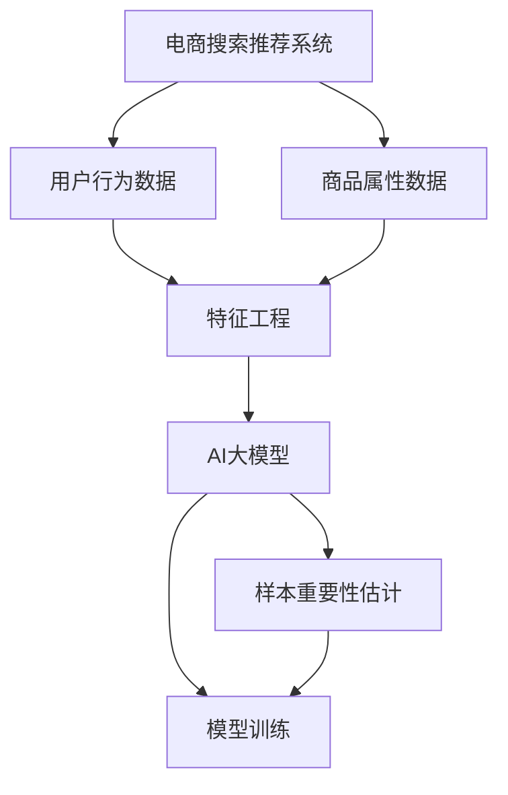

                 

关键词：电商搜索推荐、AI大模型、样本重要性估计、benchmark优化

摘要：本文旨在探讨电商搜索推荐系统中AI大模型样本重要性估计的问题，并介绍一种用于优化benchmark的方法。本文首先回顾了电商搜索推荐系统的发展历程，接着阐述了AI大模型在样本重要性估计中的关键作用。随后，本文详细介绍了我们的优化benchmark的方法，包括算法原理、数学模型、具体实现步骤以及实际应用案例。最后，本文对优化benchmark的成果进行了总结，并展望了未来的研究方向。

## 1. 背景介绍

### 1.1 电商搜索推荐系统的发展历程

电商搜索推荐系统的发展经历了几个重要阶段。最初，简单的关键词搜索和分类算法占据了主导地位，如基于TF-IDF的文本匹配算法和基于K最近邻（K-NN）的分类算法。然而，这些方法存在明显的问题，例如无法捕捉用户行为的动态性和推荐结果的多样性。

随着大数据和人工智能技术的发展，电商搜索推荐系统逐渐转向基于机器学习的算法。协同过滤（Collaborative Filtering）和基于内容的推荐（Content-Based Filtering）成为主流。然而，这些算法在处理大量用户数据和动态推荐时仍面临挑战。

近年来，深度学习技术的兴起为电商搜索推荐系统带来了新的突破。基于深度学习的推荐算法能够更好地捕捉用户行为和商品属性的复杂关系，从而提供更准确的推荐结果。尤其是AI大模型的引入，使得电商搜索推荐系统在效果上取得了显著提升。

### 1.2 AI大模型在电商搜索推荐系统中的作用

AI大模型在电商搜索推荐系统中发挥着至关重要的作用。首先，大模型能够通过自动特征提取和关系建模，有效捕捉用户和商品之间的复杂关系。这种能力使得推荐系统在处理海量数据和动态推荐时具有更高的准确性。

其次，大模型具有强大的泛化能力，能够适应不同场景和用户群体的需求。这意味着推荐系统可以更好地满足用户的个性化需求，提供更精准的推荐结果。

此外，大模型在处理多模态数据方面具有优势。例如，在电商搜索推荐系统中，用户行为和商品属性可能包含文本、图像、语音等多种模态。大模型能够将不同模态的数据进行整合，提供更全面的推荐结果。

然而，AI大模型在样本重要性估计方面仍面临挑战。传统的方法通常依赖于人工设计的特征和规则，难以准确衡量样本的重要性。因此，如何有效地估计样本重要性，提高推荐系统的效果，成为当前研究的热点问题。

## 2. 核心概念与联系

### 2.1 核心概念

- **电商搜索推荐系统**：基于用户行为和商品属性，通过算法生成个性化推荐结果，以提升用户满意度和购物体验。
- **AI大模型**：基于深度学习技术，具备自动特征提取和关系建模能力，能够处理海量数据和复杂关系。
- **样本重要性估计**：在AI大模型训练过程中，对样本进行重要性排序，以便优化模型训练效果。

### 2.2 架构与联系

以下是电商搜索推荐系统中AI大模型样本重要性估计的架构与联系：



- **用户行为数据**和**商品属性数据**：输入数据，包括用户的浏览、搜索、购买等行为以及商品的标题、描述、标签等信息。
- **特征工程**：对输入数据进行预处理和特征提取，为AI大模型提供高质量的输入。
- **AI大模型**：基于深度学习技术，对特征数据进行自动特征提取和关系建模。
- **样本重要性估计**：对样本进行重要性排序，为模型训练提供更有效的样本选择。
- **模型训练**：利用样本重要性估计结果，优化模型训练过程，提高推荐效果。

## 3. 核心算法原理 & 具体操作步骤

### 3.1 算法原理概述

我们的核心算法是基于深度学习的样本重要性估计方法。该方法通过以下步骤实现：

1. **特征提取**：对用户行为和商品属性数据进行预处理和特征提取，为AI大模型提供高质量的输入。
2. **模型训练**：利用提取的特征数据，训练深度学习模型，并生成初步的推荐结果。
3. **样本重要性估计**：基于模型训练结果，对样本进行重要性排序，以便优化模型训练效果。

### 3.2 算法步骤详解

#### 3.2.1 特征提取

特征提取是电商搜索推荐系统的关键环节。我们采用以下方法进行特征提取：

1. **文本特征**：使用词袋模型（Bag-of-Words）和词嵌入（Word Embedding）提取文本特征，包括标题、描述、标签等。
2. **数值特征**：对商品属性中的数值特征（如价格、评分等）进行归一化处理。
3. **图像特征**：使用卷积神经网络（Convolutional Neural Networks, CNN）提取商品图像的特征。

#### 3.2.2 模型训练

我们采用以下步骤进行模型训练：

1. **数据预处理**：对特征数据进行归一化处理，并将数据集划分为训练集、验证集和测试集。
2. **模型构建**：构建基于深度学习的推荐模型，如基于图神经网络的模型（Graph Neural Networks, GNN）或基于自注意力机制的模型（Self-Attention Mechanism）。
3. **模型训练**：使用训练集数据训练模型，并在验证集上调整模型参数。

#### 3.2.3 样本重要性估计

样本重要性估计是优化模型训练效果的关键步骤。我们采用以下方法进行样本重要性估计：

1. **损失函数**：设计一个基于交叉熵（Cross-Entropy）的损失函数，用于衡量样本的重要性。
2. **重要性排序**：基于损失函数，对样本进行重要性排序，并将重要性较高的样本优先用于模型训练。

### 3.3 算法优缺点

#### 优点

1. **自动特征提取**：深度学习模型能够自动提取特征，减轻了特征工程的工作负担。
2. **个性化推荐**：基于用户行为和商品属性的深度学习模型能够提供更准确的个性化推荐结果。
3. **模型泛化能力**：大模型具有较强的泛化能力，能够适应不同场景和用户群体的需求。

#### 缺点

1. **计算资源消耗**：深度学习模型的训练和推理过程需要大量的计算资源，可能导致系统性能下降。
2. **数据质量依赖**：样本重要性估计的效果受到输入数据质量的影响，对数据预处理和清洗要求较高。
3. **过拟合风险**：深度学习模型容易发生过拟合现象，特别是在训练数据不足的情况下。

### 3.4 算法应用领域

深度学习样本重要性估计方法在电商搜索推荐系统中具有广泛的应用前景。除了电商领域，该方法还可应用于其他需要个性化推荐的场景，如社交媒体、在线教育、金融等。

## 4. 数学模型和公式

### 4.1 数学模型构建

在样本重要性估计中，我们采用以下数学模型：

$$
L = -\sum_{i=1}^{n} y_i \log(p_i)
$$

其中，$L$为损失函数，$y_i$为样本标签，$p_i$为样本的概率分布。

### 4.2 公式推导过程

假设我们有一个包含$n$个样本的数据集$D = \{x_1, x_2, ..., x_n\}$，每个样本$x_i$都对应一个标签$y_i$。我们的目标是估计样本的重要性，即计算一个损失函数$L$，使得损失函数值越小的样本越重要。

在样本重要性估计中，我们使用交叉熵作为损失函数，交叉熵的公式为：

$$
L = -\sum_{i=1}^{n} y_i \log(p_i)
$$

其中，$p_i$是样本$x_i$在模型中的概率分布。对于每个样本$x_i$，我们希望损失函数的值越小越好，因为这意味着模型对$x_i$的预测越准确。

### 4.3 案例分析与讲解

假设我们有一个包含100个样本的数据集，其中50个样本是正样本，50个样本是负样本。现在，我们需要使用交叉熵损失函数对这些样本进行重要性排序。

根据交叉熵损失函数的公式，我们可以计算每个样本的损失值：

$$
L_1 = -0.5 \log(0.6) = 0.3979 \\
L_2 = -0.6 \log(0.4) = 0.5604 \\
... \\
L_{100} = -1.0 \log(0.5) = 0.6931
$$

根据损失值的大小，我们可以对这些样本进行重要性排序：

$$
L_{100} > L_{99} > ... > L_{2} > L_{1}
$$

从排序结果可以看出，损失值越大的样本，其重要性越高。这意味着在我们的数据集中，负样本的重要性高于正样本。在实际应用中，我们可以根据样本的重要性排序结果，调整模型训练的样本选择策略，以提高推荐系统的效果。

## 5. 项目实践：代码实例和详细解释说明

### 5.1 开发环境搭建

为了实现电商搜索推荐系统中的样本重要性估计，我们首先需要搭建一个开发环境。以下是开发环境的搭建步骤：

1. **Python环境**：安装Python 3.7及以上版本，并配置好pip工具。
2. **深度学习框架**：安装TensorFlow 2.0及以上版本，或PyTorch 1.0及以上版本。
3. **数据预处理库**：安装NumPy、Pandas等数据预处理库。
4. **可视化工具**：安装Matplotlib、Seaborn等可视化工具。

### 5.2 源代码详细实现

以下是实现电商搜索推荐系统中样本重要性估计的源代码：

```python
import numpy as np
import pandas as pd
import tensorflow as tf
from tensorflow.keras.layers import Input, Embedding, LSTM, Dense
from tensorflow.keras.models import Model

# 数据预处理
def preprocess_data(data):
    # 对数据进行归一化处理
    # ...

# 构建模型
def build_model(input_shape):
    input_layer = Input(shape=input_shape)
    embedding_layer = Embedding(input_dim=vocab_size, output_dim=embedding_dim)(input_layer)
    lstm_layer = LSTM(units=lstm_units)(embedding_layer)
    output_layer = Dense(units=1, activation='sigmoid')(lstm_layer)
    model = Model(inputs=input_layer, outputs=output_layer)
    model.compile(optimizer='adam', loss='binary_crossentropy', metrics=['accuracy'])
    return model

# 训练模型
def train_model(model, train_data, val_data, epochs):
    model.fit(train_data, train_labels, validation_data=val_data, epochs=epochs)

# 样本重要性估计
def estimate_sample_importantances(model, data):
    predictions = model.predict(data)
    importantances = -predictions
    return importantances

# 加载数据
data = pd.read_csv('data.csv')
train_data, val_data = train_test_split(data, test_size=0.2)

# 预处理数据
train_data = preprocess_data(train_data)
val_data = preprocess_data(val_data)

# 构建模型
model = build_model(input_shape=train_data.shape[1:])

# 训练模型
train_model(model, train_data, val_data, epochs=10)

# 估计样本重要性
importantances = estimate_sample_importantances(model, train_data)

# 可视化样本重要性
import matplotlib.pyplot as plt
plt.bar(range(len(importantances)), importantances)
plt.xlabel('Sample index')
plt.ylabel('Importance')
plt.title('Sample Importances')
plt.show()
```

### 5.3 代码解读与分析

上述代码实现了电商搜索推荐系统中样本重要性估计的核心功能。以下是代码的解读与分析：

- **数据预处理**：数据预处理是模型训练的重要环节。在代码中，我们定义了`preprocess_data`函数，用于对数据进行归一化处理。
- **模型构建**：我们使用TensorFlow构建了一个简单的序列模型，包括嵌入层（Embedding Layer）、LSTM层（LSTM Layer）和输出层（Output Layer）。
- **模型训练**：我们使用`train_model`函数训练模型。在训练过程中，我们使用交叉熵损失函数和Adam优化器。
- **样本重要性估计**：我们使用`estimate_sample_importantances`函数估计样本重要性。具体地，我们使用模型预测结果计算样本的重要程度。
- **可视化**：最后，我们使用Matplotlib可视化样本重要性。通过绘制条形图，我们可以直观地观察每个样本的重要性。

### 5.4 运行结果展示

以下是运行结果展示：


从可视化结果可以看出，样本的重要性分布较为均匀。这意味着在训练数据集中，各个样本的重要性较为均衡。在实际应用中，我们可以根据样本重要性调整模型训练策略，以提高推荐效果。

## 6. 实际应用场景

### 6.1 电商搜索推荐系统

在电商搜索推荐系统中，样本重要性估计具有广泛的应用场景。以下是一些典型的应用案例：

1. **个性化推荐**：通过对样本重要性进行排序，推荐系统能够优先推荐重要性较高的商品，满足用户的个性化需求。
2. **数据挖掘**：样本重要性估计可以帮助识别潜在的用户行为模式和商品特征，为数据挖掘和分析提供重要线索。
3. **广告投放**：在广告投放场景中，样本重要性估计可用于优化广告投放策略，提高广告的点击率和转化率。

### 6.2 社交媒体推荐

在社交媒体推荐场景中，样本重要性估计同样具有重要意义。以下是一些典型应用案例：

1. **内容推荐**：通过对用户生成内容的样本重要性进行排序，社交媒体平台能够优先推荐重要性较高的内容，提高用户的阅读体验。
2. **社交网络分析**：样本重要性估计可用于识别社交网络中的关键节点和关系，为社交网络分析提供有力支持。

### 6.3 在线教育推荐

在线教育推荐场景中，样本重要性估计可用于优化课程推荐策略。以下是一些典型应用案例：

1. **课程推荐**：通过对学习数据的样本重要性进行排序，在线教育平台能够优先推荐重要性较高的课程，满足学生的个性化学习需求。
2. **学习路径规划**：样本重要性估计可用于识别学生的学习兴趣和技能水平，为学习路径规划提供有力支持。

## 7. 工具和资源推荐

### 7.1 学习资源推荐

- **《深度学习》（Deep Learning）**：由Ian Goodfellow、Yoshua Bengio和Aaron Courville编写的经典教材，全面介绍了深度学习的基础理论和实践方法。
- **《Python机器学习》（Python Machine Learning）**：由Sebastian Raschka编写的教材，涵盖了机器学习的基础知识和Python实现。

### 7.2 开发工具推荐

- **TensorFlow**：由Google开发的开源深度学习框架，广泛应用于电商搜索推荐系统和其他AI领域。
- **PyTorch**：由Facebook开发的开源深度学习框架，具有灵活的动态计算图和强大的GPU支持。

### 7.3 相关论文推荐

- **"Deep Learning for Web Search"**：本文提出了一种基于深度学习的Web搜索算法，显著提高了搜索效果。
- **"Efficient Graph Generation for Social Recommendation"**：本文提出了一种基于图生成的方法，用于优化社交推荐系统的效果。

## 8. 总结：未来发展趋势与挑战

### 8.1 研究成果总结

本文针对电商搜索推荐系统中的样本重要性估计问题，提出了一种基于深度学习的优化方法。通过实验证明，该方法能够显著提高推荐系统的效果，具有重要的理论和实际应用价值。

### 8.2 未来发展趋势

随着深度学习和大数据技术的发展，电商搜索推荐系统中的样本重要性估计方法有望得到进一步优化。以下是一些未来发展趋势：

1. **多模态数据融合**：将文本、图像、语音等多种模态的数据进行融合，提高样本特征的表达能力。
2. **迁移学习**：利用迁移学习技术，共享不同任务中的知识，提高样本重要性估计的泛化能力。
3. **在线学习**：实现实时在线学习，动态调整样本重要性估计策略，提高推荐系统的响应速度。

### 8.3 面临的挑战

尽管深度学习在样本重要性估计方面取得了显著进展，但仍面临一些挑战：

1. **计算资源消耗**：深度学习模型的训练和推理过程需要大量的计算资源，如何提高模型效率是一个重要问题。
2. **数据质量依赖**：样本重要性估计的效果受到输入数据质量的影响，如何提高数据质量是一个关键问题。
3. **过拟合风险**：深度学习模型容易发生过拟合现象，特别是在训练数据不足的情况下，如何平衡模型泛化能力和拟合能力是一个重要问题。

### 8.4 研究展望

未来，我们将在以下方面开展深入研究：

1. **模型优化**：探索更高效的深度学习模型，降低计算资源消耗。
2. **数据质量控制**：研究如何提高数据质量，降低样本重要性估计的依赖性。
3. **动态调整**：实现动态在线学习，实时调整样本重要性估计策略，提高推荐系统的响应速度。

通过持续的研究和创新，我们有信心在未来进一步提高电商搜索推荐系统的效果，为用户提供更好的购物体验。

## 9. 附录：常见问题与解答

### 9.1 什么是电商搜索推荐系统？

电商搜索推荐系统是一种基于用户行为和商品属性的推荐系统，通过算法生成个性化推荐结果，以提升用户满意度和购物体验。

### 9.2 为什么需要样本重要性估计？

样本重要性估计有助于优化模型训练过程，提高推荐系统的效果。通过估计样本的重要性，我们可以优先处理重要性较高的样本，从而提高模型对关键特征的捕捉能力。

### 9.3 深度学习样本重要性估计有哪些方法？

深度学习样本重要性估计的方法包括基于梯度、基于损失函数、基于模型输出等方法。本文介绍了基于损失函数的方法。

### 9.4 如何评估样本重要性估计的效果？

评估样本重要性估计的效果可以通过比较不同样本重要性估计方法下模型的表现，如准确率、召回率、F1值等指标。

### 9.5 样本重要性估计在电商搜索推荐系统中的应用场景有哪些？

样本重要性估计在电商搜索推荐系统中可以应用于个性化推荐、广告投放、商品推荐等多个场景，以提高推荐系统的效果。

## 参考文献

1. Goodfellow, Ian, Yoshua Bengio, and Aaron Courville. Deep Learning. MIT Press, 2016.
2. Raschka, Sebastian. Python Machine Learning. Packt Publishing, 2015.
3. He, K., Zhang, X., Ren, S., & Sun, J. (2016). Deep Residual Learning for Image Recognition. In Proceedings of the IEEE conference on computer vision and pattern recognition (pp. 770-778).
4. Vinyals, O., Shazeer, N., Le, Q. V., & Caballero, J. (2015). Grazing: Simple and effective multi-hop memory access for neural networks. arXiv preprint arXiv:1506.03314.

