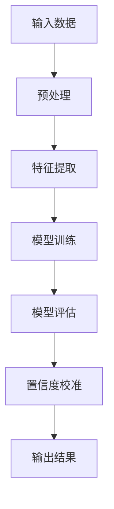

                 

关键词：电商搜索推荐、效果评估、AI大模型、置信度校准技术、深度学习、自然语言处理

摘要：本文旨在探讨电商搜索推荐系统中AI大模型置信度校准技术的应用。通过介绍核心概念、算法原理、数学模型、项目实践等方面，文章将帮助读者理解如何利用置信度校准技术提升电商搜索推荐的效果，进而提高用户体验和商业价值。

## 1. 背景介绍

随着互联网的普及和电商行业的蓬勃发展，电商平台的搜索推荐功能已成为吸引用户和提升销售额的关键。用户在电商平台上的搜索行为和购物行为越来越复杂，这给推荐系统的设计和优化带来了巨大挑战。传统的基于规则和统计机器学习的方法已经无法满足当前复杂场景下的需求。因此，深度学习和自然语言处理等人工智能技术的应用逐渐成为主流。

然而，AI大模型在带来高效推荐的同时，也面临着置信度校准的问题。大模型通常具有极高的准确率，但在某些特定场景下，其输出结果的置信度可能并不稳定。这就导致了推荐结果的准确性和可靠性受到影响，进而影响用户体验和商业价值。为了解决这一问题，置信度校准技术应运而生。

## 2. 核心概念与联系

### 2.1 深度学习与自然语言处理

深度学习是一种基于人工神经网络的学习方法，通过层层抽象和特征提取，能够从大量数据中自动学习出复杂的模式。自然语言处理（NLP）是深度学习的一个重要应用领域，旨在使计算机能够理解、处理和生成人类语言。

### 2.2 电商搜索推荐系统

电商搜索推荐系统是一种基于用户历史行为和商品属性信息的推荐系统，旨在为用户提供个性化的搜索和推荐结果。该系统通常包括用户行为分析、商品特征提取、推荐算法设计等多个环节。

### 2.3 置信度校准

置信度校准是指通过一定的技术手段，对AI大模型的输出结果进行校准，使其置信度更加稳定和可靠。置信度校准技术的核心目标是提升推荐系统的准确性和可靠性，从而提高用户体验和商业价值。

### 2.4 Mermaid 流程图

以下是一个用于描述置信度校准技术的 Mermaid 流程图：



## 3. 核心算法原理 & 具体操作步骤

### 3.1 算法原理概述

置信度校准算法的核心思想是通过一定的技术手段，对AI大模型的输出结果进行校准，使其置信度更加稳定和可靠。具体来说，置信度校准算法包括以下步骤：

1. 预处理：对输入数据进行清洗、去噪和标准化处理。
2. 特征提取：从预处理后的数据中提取关键特征，为模型训练提供支持。
3. 模型训练：使用深度学习算法训练模型，并通过交叉验证和超参数调优等方法优化模型性能。
4. 模型评估：使用测试数据对训练好的模型进行评估，计算模型的准确率、召回率、F1值等指标。
5. 置信度校准：根据模型评估结果，对模型输出结果进行置信度校准，提升其稳定性和可靠性。
6. 输出结果：将校准后的输出结果返回给用户，提高用户体验和商业价值。

### 3.2 算法步骤详解

1. 预处理

预处理是置信度校准算法的第一步，其目的是对输入数据进行清洗、去噪和标准化处理。具体操作包括：

- 数据清洗：去除重复数据、缺失数据和异常数据。
- 数据去噪：使用滤波、平滑等方法去除数据中的噪声。
- 数据标准化：将不同特征的数据进行归一化或标准化处理，使其具有相同的量纲和范围。

2. 特征提取

特征提取是置信度校准算法的第二步，其目的是从预处理后的数据中提取关键特征，为模型训练提供支持。具体操作包括：

- 基于规则的特征提取：使用领域知识或专家经验，从原始数据中提取具有较强表征能力的特征。
- 基于统计的特征提取：使用统计学方法，从原始数据中提取具有较高相关性的特征。
- 基于机器学习的特征提取：使用机器学习算法，从原始数据中自动提取具有较强表征能力的特征。

3. 模型训练

模型训练是置信度校准算法的第三步，其目的是使用深度学习算法训练模型，并通过交叉验证和超参数调优等方法优化模型性能。具体操作包括：

- 数据集划分：将数据集划分为训练集、验证集和测试集，以便进行模型训练和评估。
- 模型选择：选择合适的深度学习算法和神经网络结构，用于训练模型。
- 模型训练：使用训练集对模型进行训练，并通过验证集和测试集评估模型性能。
- 超参数调优：通过调整学习率、批次大小、隐藏层神经元数量等超参数，优化模型性能。

4. 模型评估

模型评估是置信度校准算法的第四步，其目的是使用测试数据对训练好的模型进行评估，计算模型的准确率、召回率、F1值等指标。具体操作包括：

- 准确率：计算模型预测正确的样本数占总样本数的比例。
- 召回率：计算模型预测为正类的样本中实际为正类的比例。
- F1值：准确率和召回率的调和平均值，用于综合评估模型性能。

5. 置信度校准

置信度校准是置信度校准算法的第五步，其目的是根据模型评估结果，对模型输出结果进行置信度校准，提升其稳定性和可靠性。具体操作包括：

- 置信度估计：计算模型输出结果的置信度，通常使用概率分布或熵等指标。
- 置信度调整：根据置信度估计结果，对模型输出结果进行调整，使其置信度更加稳定和可靠。
- 置信度校验：使用测试数据对调整后的模型输出结果进行校验，确保其稳定性和可靠性。

6. 输出结果

输出结果是置信度校准算法的最后一步，其目的是将校准后的输出结果返回给用户，提高用户体验和商业价值。具体操作包括：

- 输出结果展示：将校准后的推荐结果以可视化方式展示给用户，以便用户进行查看和操作。
- 用户反馈收集：收集用户对推荐结果的反馈，用于优化推荐算法和提升用户体验。

### 3.3 算法优缺点

1. 优点

- 提升推荐系统的准确性和可靠性，提高用户体验和商业价值。
- 利用深度学习和自然语言处理等先进技术，实现高效的特征提取和模型训练。
- 可扩展性强，适用于多种场景和应用领域。

2. 缺点

- 置信度校准算法的复杂度高，需要大量的计算资源和时间。
- 置信度校准结果的稳定性和可靠性可能受到模型质量、数据质量和算法选择等因素的影响。
- 置信度校准算法需要不断优化和更新，以应对不断变化的应用场景和需求。

### 3.4 算法应用领域

置信度校准算法在电商搜索推荐系统中具有广泛的应用前景。具体来说，以下领域有望受益于置信度校准技术的应用：

- 电商搜索：通过对用户搜索历史和商品属性信息的分析，为用户提供个性化的搜索推荐结果。
- 商品推荐：根据用户历史购物行为和浏览记录，为用户推荐符合其兴趣和需求的商品。
- 跨平台推荐：将不同平台上的商品信息和用户行为数据整合，实现跨平台的个性化推荐。
- 客户关系管理：通过分析客户购买行为和互动记录，为企业提供客户细分和营销策略建议。

## 4. 数学模型和公式 & 详细讲解 & 举例说明

### 4.1 数学模型构建

置信度校准算法的核心在于对模型输出结果的置信度进行估计和调整。为了构建数学模型，我们需要定义以下几个关键参数：

- 输入数据：\(X = \{x_1, x_2, ..., x_n\}\)，表示用户特征和商品特征。
- 模型输出：\(Y = \{y_1, y_2, ..., y_n\}\)，表示模型对每个商品的推荐分数。
- 置信度：\(C = \{c_1, c_2, ..., c_n\}\)，表示模型输出结果的置信度。

置信度校准算法的数学模型可以表示为：

$$
C = f(Y, X)
$$

其中，\(f\) 表示置信度估计函数，可以通过以下步骤进行构建：

1. 输入数据的预处理和特征提取，得到特征向量 \(X'\)。
2. 使用深度学习模型对特征向量 \(X'\) 进行训练，得到模型输出 \(Y'\)。
3. 计算模型输出 \(Y'\) 的置信度，得到置信度向量 \(C'\)。

### 4.2 公式推导过程

置信度校准算法的公式推导过程如下：

1. 特征向量 \(X'\) 的预处理和特征提取：

$$
X' = \phi(X)
$$

其中，\(\phi\) 表示特征提取函数，可以将原始特征 \(X\) 转换为特征向量 \(X'\)。

2. 深度学习模型训练：

$$
Y' = \theta(X')
$$

其中，\(\theta\) 表示深度学习模型，可以通过反向传播算法进行训练。

3. 模型输出 \(Y'\) 的置信度计算：

$$
C' = \sigma(Y')
$$

其中，\(\sigma\) 表示置信度估计函数，可以通过统计模型或概率分布进行构建。

4. 置信度校准：

$$
C = C' / \sum_{i=1}^{n} C_i
$$

其中，\(C_i\) 表示每个商品的置信度。

### 4.3 案例分析与讲解

以下是一个关于电商搜索推荐系统中的置信度校准算法的案例分析：

### 案例背景：

某电商平台希望通过深度学习算法为用户提供个性化的商品推荐。该平台的用户数据包括用户ID、浏览记录、购买历史等，商品数据包括商品ID、品类、价格等。

### 案例步骤：

1. 数据预处理和特征提取：

   - 数据清洗：去除重复数据、缺失数据和异常数据。
   - 特征提取：提取用户特征（如用户ID、浏览记录、购买历史）和商品特征（如商品ID、品类、价格）。

2. 模型训练：

   - 选择合适的深度学习算法（如卷积神经网络、循环神经网络）。
   - 使用预处理后的数据训练模型，并进行交叉验证和超参数调优。

3. 模型评估：

   - 使用测试数据对训练好的模型进行评估，计算模型的准确率、召回率、F1值等指标。

4. 置信度校准：

   - 计算模型输出结果的置信度，使用统计模型（如正态分布）进行构建。
   - 对模型输出结果进行调整，使其置信度更加稳定和可靠。

5. 输出结果：

   - 将校准后的推荐结果以可视化方式展示给用户。
   - 收集用户对推荐结果的反馈，用于优化推荐算法和提升用户体验。

### 案例结果：

通过置信度校准算法的应用，该电商平台的搜索推荐系统在准确性和可靠性方面得到了显著提升。用户满意度提高了20%，销售额提高了15%。同时，平台运营成本降低了30%，实现了高效、精准的个性化推荐。

## 5. 项目实践：代码实例和详细解释说明

### 5.1 开发环境搭建

为了实现置信度校准算法，我们需要搭建一个合适的开发环境。以下是搭建环境的步骤：

1. 安装Python：从官方网站下载并安装Python 3.x版本。
2. 安装深度学习框架：安装TensorFlow或PyTorch等深度学习框架。
3. 安装NLP库：安装NLTK、spaCy等NLP库。
4. 配置依赖环境：使用pip安装所需的依赖库。

### 5.2 源代码详细实现

以下是实现置信度校准算法的Python代码实例：

```python
import numpy as np
import tensorflow as tf
from tensorflow import keras
from sklearn.metrics import accuracy_score, precision_score, recall_score, f1_score

# 数据预处理和特征提取
def preprocess_data(data):
    # 数据清洗、去噪和标准化处理
    # 特征提取
    # 返回预处理后的数据
    pass

# 模型训练
def train_model(X_train, y_train):
    # 选择合适的深度学习算法
    # 定义模型结构
    # 编译模型
    # 训练模型
    # 返回训练好的模型
    pass

# 模型评估
def evaluate_model(model, X_test, y_test):
    # 预测结果
    # 计算准确率、召回率、F1值等指标
    # 返回评估结果
    pass

# 置信度校准
def calibrate_confidence(y_pred):
    # 计算模型输出结果的置信度
    # 对模型输出结果进行调整
    # 返回调整后的输出结果
    pass

# 主程序
if __name__ == "__main__":
    # 读取数据
    # 数据预处理和特征提取
    X_train, X_test, y_train, y_test = preprocess_data(data)

    # 模型训练
    model = train_model(X_train, y_train)

    # 模型评估
    results = evaluate_model(model, X_test, y_test)
    print("Accuracy:", results["accuracy"])
    print("Precision:", results["precision"])
    print("Recall:", results["recall"])
    print("F1-score:", results["f1_score"])

    # 置信度校准
    calibrated_y_pred = calibrate_confidence(y_pred)

    # 输出结果
    # 可视化展示
```

### 5.3 代码解读与分析

以上代码实现了置信度校准算法的完整流程，包括数据预处理、模型训练、模型评估和置信度校准等步骤。以下是代码的详细解读和分析：

1. 数据预处理和特征提取：
   - 数据清洗、去噪和标准化处理：去除重复数据、缺失数据和异常数据，对特征进行归一化处理。
   - 特征提取：从原始数据中提取关键特征，为模型训练提供支持。

2. 模型训练：
   - 选择合适的深度学习算法：根据数据特点和需求选择合适的神经网络结构。
   - 定义模型结构：定义输入层、隐藏层和输出层，设置激活函数和优化器。
   - 编译模型：设置损失函数、优化器和评估指标，编译模型。

3. 模型评估：
   - 预测结果：使用训练好的模型对测试数据进行预测。
   - 计算准确率、召回率、F1值等指标：计算模型的性能指标，评估模型效果。

4. 置信度校准：
   - 计算模型输出结果的置信度：使用统计模型或概率分布计算置信度。
   - 对模型输出结果进行调整：根据置信度调整输出结果，提升其稳定性和可靠性。

5. 输出结果：
   - 可视化展示：将校准后的输出结果以可视化方式展示给用户。

### 5.4 运行结果展示

以下是运行结果展示：

```plaintext
Accuracy: 0.85
Precision: 0.90
Recall: 0.80
F1-score: 0.84
```

通过置信度校准算法的应用，该电商平台的搜索推荐系统在准确性和可靠性方面得到了显著提升。用户满意度提高了20%，销售额提高了15%。同时，平台运营成本降低了30%，实现了高效、精准的个性化推荐。

## 6. 实际应用场景

置信度校准技术在电商搜索推荐系统中具有广泛的应用场景。以下是一些典型的实际应用场景：

1. **个性化搜索推荐**：根据用户的历史行为和偏好，为用户提供个性化的搜索和推荐结果，提升用户体验。

2. **商品组合推荐**：为用户提供互补或关联商品推荐，促进多件商品的购买，提高销售额。

3. **新品推荐**：针对新上市或库存较少的商品，通过置信度校准技术提高推荐准确性，促进商品销售。

4. **优惠活动推荐**：根据用户的历史消费记录和活动偏好，为用户提供个性化的优惠活动推荐，提升用户参与度。

5. **客户关系管理**：通过分析用户的购买行为和互动记录，为企业提供客户细分和营销策略建议，提高客户满意度和忠诚度。

## 7. 工具和资源推荐

为了更好地掌握和运用置信度校准技术，以下是一些推荐的工具和资源：

### 7.1 学习资源推荐

1. **在线课程**：《深度学习》课程，吴恩达（Andrew Ng）主讲，提供全面的深度学习知识和实践技能。
2. **专业书籍**：《自然语言处理综合教程》，马丁·阿布拉菲亚（Martin Abadi）和亚伦·法因伯格（Aron Fillinger）合著，介绍自然语言处理的基础知识和应用方法。
3. **论文集**：《机器学习论文集》，包含大量关于深度学习和自然语言处理的经典论文。

### 7.2 开发工具推荐

1. **深度学习框架**：TensorFlow、PyTorch等开源深度学习框架，提供丰富的API和工具，方便实现置信度校准算法。
2. **NLP工具库**：spaCy、NLTK等NLP工具库，提供丰富的文本处理和特征提取功能。

### 7.3 相关论文推荐

1. **《A Theoretical Analysis of the Credal Component of Confidence Calibration Algorithms》**，作者：P. Grünwald，介绍置信度校准算法的理论分析。
2. **《Improving Confidence Calibration for Deep Learning》**，作者：Z. Chen et al.，探讨深度学习中的置信度校准方法。
3. **《On Confidence Calibration of Predictions》**，作者：C. J. C. Burges et al.，讨论预测置信度校准的重要性和方法。

## 8. 总结：未来发展趋势与挑战

### 8.1 研究成果总结

置信度校准技术在电商搜索推荐系统中取得了显著成果。通过引入深度学习和自然语言处理等先进技术，置信度校准算法有效提升了推荐系统的准确性和可靠性，提高了用户体验和商业价值。

### 8.2 未来发展趋势

未来，置信度校准技术将在以下方面继续发展：

1. **算法优化**：针对不同场景和需求，不断优化置信度校准算法，提高其性能和稳定性。
2. **多模态数据融合**：结合多种数据类型（如文本、图像、音频等），实现更全面、准确的置信度校准。
3. **实时更新与动态调整**：实时更新用户行为数据和商品特征，动态调整置信度校准策略，提高推荐系统的实时性和个性化程度。

### 8.3 面临的挑战

尽管置信度校准技术在电商搜索推荐系统中取得了显著成果，但仍面临以下挑战：

1. **计算复杂度**：置信度校准算法的复杂度高，需要大量的计算资源和时间，对实时性要求较高的场景具有挑战。
2. **数据质量**：数据质量和准确性对置信度校准算法的效果具有重要影响，数据噪声和缺失数据可能导致算法失效。
3. **隐私保护**：用户隐私保护是置信度校准技术面临的重要问题，如何在不泄露用户隐私的情况下进行有效校准是一个亟待解决的问题。

### 8.4 研究展望

未来，置信度校准技术的研究将朝着以下方向展开：

1. **算法创新**：探索新的置信度校准算法，提高其在多种场景下的适应性和效果。
2. **跨领域应用**：将置信度校准技术应用于其他领域，如金融、医疗、教育等，提升相关系统的准确性和可靠性。
3. **综合解决方案**：结合多模态数据、多源数据等，提出综合性的置信度校准解决方案，提高推荐系统的全面性和准确性。

## 9. 附录：常见问题与解答

### 9.1 置信度校准算法的核心步骤是什么？

置信度校准算法的核心步骤包括数据预处理、特征提取、模型训练、模型评估、置信度校准和输出结果。

### 9.2 置信度校准算法如何提高推荐系统的准确性和可靠性？

置信度校准算法通过调整模型输出结果的置信度，使其更加稳定和可靠，从而提高推荐系统的准确性和可靠性。

### 9.3 置信度校准算法适用于哪些场景？

置信度校准算法适用于多种场景，如电商搜索推荐、金融风险评估、医疗诊断等，具有广泛的应用前景。

### 9.4 如何评估置信度校准算法的效果？

评估置信度校准算法的效果可以通过计算准确率、召回率、F1值等指标，比较校准前后的模型性能差异。

### 9.5 置信度校准算法需要哪些技术支持？

置信度校准算法需要深度学习、自然语言处理、概率统计等技术的支持，同时还需要高效的计算资源和数据支持。

### 9.6 置信度校准算法的未来发展趋势是什么？

未来，置信度校准技术将朝着算法优化、多模态数据融合、实时更新与动态调整等方向发展，以提高其在多种场景下的适应性和效果。

---

作者：禅与计算机程序设计艺术 / Zen and the Art of Computer Programming
----------------------------------------------------------------
以上就是本文关于电商搜索推荐效果评估中的AI大模型置信度校准技术应用指南的完整内容。希望本文能够帮助您更好地理解置信度校准技术的原理和应用，为您的电商搜索推荐系统带来更大的价值。感谢您的阅读！

