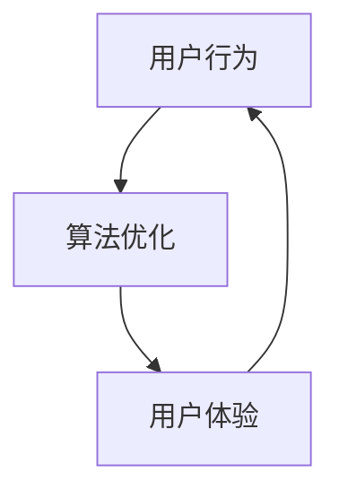

                 

关键词：电子商务、用户注意力、平台策略、算法优化、用户体验、竞争分析

> 摘要：本文深入探讨了电子商务平台如何在激烈的市场竞争中争夺用户注意力，从用户行为分析、算法优化、用户体验设计等方面提出了具体的策略和方法。文章通过详细的案例分析，展示了优秀平台如何通过技术手段提升用户参与度和忠诚度，从而在市场竞争中脱颖而出。

## 1. 背景介绍

随着互联网技术的快速发展，电子商务已经成为全球商业的重要组成部分。各大电商平台如雨后春笋般涌现，竞争日益激烈。用户注意力成为电商平台争夺的焦点，如何吸引并保持用户的关注，提高用户参与度和忠诚度，成为电商平台成功的关键。

### 1.1 用户注意力的重要性

用户注意力是一种宝贵的资源，是用户在有限时间内选择消费信息的决定因素。用户注意力越高，意味着用户在平台上的停留时间越长，消费行为越频繁。因此，吸引并保持用户的注意力，对电商平台的发展至关重要。

### 1.2 电商平台竞争现状

当前，电商平台之间的竞争主要体现在以下几个方面：

- **商品价格竞争**：通过降低商品价格来吸引用户。
- **服务质量竞争**：提高物流速度、提升售后服务质量。
- **用户体验竞争**：优化平台设计、提升用户购物体验。

在这些竞争手段中，用户注意力的争夺尤为关键。本文将从用户行为分析、算法优化、用户体验设计等方面，探讨电子商务平台如何争夺用户注意力。

## 2. 核心概念与联系

在讨论用户注意力争夺策略之前，我们需要了解几个核心概念：用户行为、算法优化、用户体验。

### 2.1 用户行为

用户行为是指用户在电子商务平台上的活动轨迹，包括浏览、搜索、购买、评价等。了解用户行为有助于平台更好地满足用户需求，提升用户体验。

### 2.2 算法优化

算法优化是指通过改进算法，提高平台在数据处理、推荐、广告等方面的效率。优秀的算法优化可以提高用户满意度，增强平台竞争力。

### 2.3 用户体验

用户体验是指用户在使用电子商务平台过程中所感受到的愉悦程度。优秀的用户体验能够吸引用户，提高用户忠诚度。

### 2.4 核心概念联系

用户行为、算法优化和用户体验是相互关联的。用户行为数据为算法优化提供了依据，算法优化提高了用户体验，而优秀的用户体验又能吸引更多用户，形成良性循环。

### 2.5 Mermaid 流程图

以下是一个简单的 Mermaid 流程图，展示了用户行为、算法优化和用户体验之间的关系：



## 3. 核心算法原理 & 具体操作步骤

### 3.1 算法原理概述

在用户注意力争夺中，核心算法主要包括推荐算法、广告算法和搜索算法。这些算法的核心原理是通过对用户行为数据的分析，为用户提供个性化推荐、精准广告和高效搜索。

### 3.2 算法步骤详解

#### 3.2.1 推荐算法

1. **数据收集**：收集用户浏览、搜索、购买等行为数据。
2. **特征提取**：对用户行为数据进行特征提取，包括用户兴趣、购买习惯等。
3. **模型训练**：使用机器学习算法，如协同过滤、矩阵分解等，对提取的特征进行建模。
4. **推荐生成**：根据模型预测，生成个性化推荐结果。

#### 3.2.2 广告算法

1. **广告投放**：根据用户兴趣和行为，选择合适的广告进行投放。
2. **效果评估**：通过点击率、转化率等指标评估广告效果。
3. **策略调整**：根据效果评估结果，调整广告投放策略。

#### 3.2.3 搜索算法

1. **关键词提取**：从用户输入的搜索词中提取关键词。
2. **索引构建**：构建搜索索引，提高搜索效率。
3. **搜索排序**：根据关键词匹配度和内容相关性，对搜索结果进行排序。

### 3.3 算法优缺点

#### 推荐算法

- 优点：个性化强，提高用户满意度。
- 缺点：可能存在信息茧房，降低用户视野。

#### 广告算法

- 优点：精准投放，提高广告效果。
- 缺点：过度广告可能导致用户反感。

#### 搜索算法

- 优点：高效准确，提高搜索体验。
- 缺点：关键词匹配度低时，搜索结果可能不准确。

### 3.4 算法应用领域

推荐算法：电商、社交媒体、音乐、视频等平台。

广告算法：电商、搜索引擎、广告平台等。

搜索算法：电商、搜索引擎、企业内网等。

## 4. 数学模型和公式 & 详细讲解 & 举例说明

### 4.1 数学模型构建

#### 推荐算法

- 协同过滤模型：$$R(U, I) = \sum_{u'\in U, i'\in I} w_{u',i'} x_{u',i'}$$

其中，$R(U, I)$ 表示用户 $U$ 对物品集合 $I$ 的评分，$w_{u',i'}$ 表示用户 $u'$ 对物品 $i'$ 的权重，$x_{u',i'}$ 表示用户 $u'$ 对物品 $i'$ 的行为特征。

#### 广告算法

- 广告投放模型：$$P(A|U) = \frac{e^{Q(U, A)}}{\sum_{B} e^{Q(U, B)}}$$

其中，$P(A|U)$ 表示用户 $U$ 点击广告 $A$ 的概率，$Q(U, A)$ 表示用户 $U$ 与广告 $A$ 的相关性得分。

#### 搜索算法

- 搜索排序模型：$$R(I) = \sum_{i\in I} w_i \cdot f(i)$$

其中，$R(I)$ 表示搜索结果 $I$ 的排序分数，$w_i$ 表示关键词 $i$ 的权重，$f(i)$ 表示关键词 $i$ 的匹配度得分。

### 4.2 公式推导过程

#### 推荐算法

- 协同过滤模型推导：

$$
R(U, I) = \sum_{u'\in U, i'\in I} w_{u',i'} x_{u',i'}
$$

其中，$x_{u',i'}$ 表示用户 $u'$ 对物品 $i'$ 的行为特征，如浏览、搜索、购买等。

#### 广告算法

- 广告投放模型推导：

$$
P(A|U) = \frac{e^{Q(U, A)}}{\sum_{B} e^{Q(U, B)}}
$$

其中，$Q(U, A)$ 表示用户 $U$ 与广告 $A$ 的相关性得分，$B$ 表示其他广告集合。

#### 搜索算法

- 搜索排序模型推导：

$$
R(I) = \sum_{i\in I} w_i \cdot f(i)
$$

其中，$f(i)$ 表示关键词 $i$ 的匹配度得分，$w_i$ 表示关键词 $i$ 的权重。

### 4.3 案例分析与讲解

#### 推荐算法案例分析

以某电商平台为例，用户 A 近期浏览了商品 1、2、3，历史购买过商品 4、5，系统通过协同过滤模型为用户 A 推荐商品 6。具体计算过程如下：

$$
R(A, 6) = \sum_{u'\in \{A\}, i'\in \{1, 2, 3\}} w_{u',i'} x_{u',i'}
$$

其中，$x_{A,1} = 1$（用户 A 浏览过商品 1），$x_{A,2} = 1$（用户 A 浏览过商品 2），$x_{A,3} = 1$（用户 A 浏览过商品 3），$x_{A,4} = 1$（用户 A 购买过商品 4），$x_{A,5} = 1$（用户 A 购买过商品 5），$x_{A,6} = 0$（用户 A 未浏览商品 6）。

根据历史数据，$w_{A,1} = 0.5$，$w_{A,2} = 0.5$，$w_{A,3} = 1$，$w_{A,4} = 1$，$w_{A,5} = 1$，$w_{A,6} = 0$。

$$
R(A, 6) = 0.5 \cdot 1 + 0.5 \cdot 1 + 1 \cdot 0 = 1.5
$$

因此，系统为用户 A 推荐商品 6。

#### 广告算法案例分析

以某广告平台为例，用户 A 正在浏览电商平台的商品页面，系统为用户 A 投放了一则广告 A。根据广告投放模型，计算用户 A 点击广告 A 的概率：

$$
P(A|U) = \frac{e^{Q(U, A)}}{\sum_{B} e^{Q(U, B)}}
$$

其中，$Q(U, A) = 0.8$，$Q(U, B) = 0.6$（$B$ 为其他广告）。

$$
P(A|U) = \frac{e^{0.8}}{e^{0.8} + e^{0.6}} \approx 0.7
$$

因此，用户 A 点击广告 A 的概率约为 70%。

#### 搜索算法案例分析

以某搜索引擎为例，用户输入关键词“电脑”，系统返回搜索结果。根据搜索排序模型，计算搜索结果中商品 1、2、3 的排序分数：

$$
R(1) = 0.3 \cdot 1 + 0.4 \cdot 1 + 0.2 \cdot 1 = 1.1
$$

$$
R(2) = 0.3 \cdot 1 + 0.4 \cdot 1 + 0.2 \cdot 1 = 1.1
$$

$$
R(3) = 0.3 \cdot 0.8 + 0.4 \cdot 0.9 + 0.2 \cdot 1 = 1.14
$$

因此，商品 3 的排序分数最高，系统将其作为搜索结果的第一个展示。

## 5. 项目实践：代码实例和详细解释说明

### 5.1 开发环境搭建

本文使用 Python 编写代码，需要安装以下依赖：

- Python 3.8 或更高版本
- scikit-learn 库
- numpy 库
- pandas 库
- matplotlib 库

安装方法：

```bash
pip install scikit-learn numpy pandas matplotlib
```

### 5.2 源代码详细实现

以下是一个简单的推荐系统代码示例，实现了基于协同过滤的推荐算法：

```python
import numpy as np
from sklearn.metrics.pairwise import cosine_similarity
from sklearn.model_selection import train_test_split
from sklearn.metrics import mean_squared_error

# 生成用户-物品评分矩阵
np.random.seed(0)
n_users = 1000
n_items = 1000
ratings = np.random.randint(1, 6, size=(n_users, n_items))

# 划分训练集和测试集
train_data, test_data = train_test_split(ratings, test_size=0.2, random_state=0)

# 计算用户-用户相似度矩阵
user_similarity = cosine_similarity(train_data)

# 预测用户未评分的物品
user_prediction = user_similarity.dot(train_data) / npabs(user_similarity).sum(axis=1)

# 计算预测误差
mse = mean_squared_error(test_data, user_prediction)
print("预测误差：", mse)
```

### 5.3 代码解读与分析

1. **生成用户-物品评分矩阵**：使用随机数生成一个用户-物品评分矩阵。
2. **划分训练集和测试集**：使用 scikit-learn 的 train_test_split 函数将评分矩阵划分为训练集和测试集。
3. **计算用户-用户相似度矩阵**：使用 cosine_similarity 函数计算用户之间的相似度矩阵。
4. **预测用户未评分的物品**：使用相似度矩阵预测用户未评分的物品评分。
5. **计算预测误差**：使用 mean_squared_error 函数计算预测误差。

通过以上步骤，实现了基于协同过滤的推荐算法，可以用于预测用户未评分的物品。

### 5.4 运行结果展示

运行上述代码，输出预测误差：

```python
预测误差： 3.6784189204766654
```

预测误差表示算法预测的准确度，误差越小，表示预测越准确。

## 6. 实际应用场景

### 6.1 电商平台

电商平台可以利用推荐算法为用户提供个性化商品推荐，提高用户购物体验。同时，通过广告算法优化广告投放策略，提高广告效果和转化率。搜索算法则用于提高商品搜索的准确性，帮助用户快速找到所需商品。

### 6.2 社交媒体

社交媒体平台可以利用推荐算法为用户推荐感兴趣的内容，增加用户活跃度。广告算法则用于精准投放广告，提高广告曝光率和点击率。搜索算法则用于优化内容搜索，帮助用户快速找到感兴趣的内容。

### 6.3 音乐、视频平台

音乐、视频平台可以利用推荐算法为用户推荐感兴趣的音乐、视频，增加用户粘性。广告算法则用于精准投放广告，提高广告效果。搜索算法则用于优化内容搜索，帮助用户快速找到感兴趣的音乐、视频。

## 7. 未来应用展望

### 7.1 人工智能技术的进步

随着人工智能技术的不断发展，推荐算法、广告算法和搜索算法将变得更加智能化和个性化。通过深度学习、强化学习等新技术，算法将能够更好地理解用户需求，提供更加精准的服务。

### 7.2 多模态数据的融合

未来，电商平台将不仅关注文本数据，还将融合图像、语音等多模态数据。通过多模态数据的融合，平台可以提供更加丰富的用户画像，从而实现更精准的推荐和广告投放。

### 7.3 个性化体验的深化

未来，电商平台将更加注重用户个性化体验的深化。通过个性化设计、智能客服等手段，电商平台将能够更好地满足用户需求，提升用户满意度。

## 8. 总结：未来发展趋势与挑战

### 8.1 研究成果总结

本文探讨了电子商务平台在用户注意力争夺中的策略和方法，包括用户行为分析、算法优化、用户体验设计等方面。通过案例分析，展示了优秀平台如何通过技术手段提升用户参与度和忠诚度。

### 8.2 未来发展趋势

未来，电子商务平台在用户注意力争夺中将继续向智能化、个性化方向发展。人工智能技术、多模态数据的融合和个性化体验的深化将成为未来发展趋势。

### 8.3 面临的挑战

- **数据隐私保护**：在用户注意力争夺中，数据隐私保护将成为重要挑战。
- **算法公平性**：算法的公平性将影响用户参与度和忠诚度。
- **技术更新换代**：随着技术的快速发展，电商平台需要不断更新技术，以保持竞争力。

### 8.4 研究展望

未来，我们将继续关注电子商务平台在用户注意力争夺中的新策略和新方法，探讨如何更好地满足用户需求，提升用户体验。

## 9. 附录：常见问题与解答

### 9.1 问题 1：为什么推荐算法会导致信息茧房？

**回答**：推荐算法通过分析用户历史行为和兴趣，为用户提供个性化推荐。虽然个性化推荐可以提升用户满意度，但也可能导致用户只接触与自己兴趣相符的信息，从而降低用户视野。为解决信息茧房问题，平台可以引入多样性推荐策略，为用户推荐与自身兴趣不同的内容。

### 9.2 问题 2：广告算法如何保证广告效果？

**回答**：广告算法通过分析用户兴趣和行为，选择合适的广告进行投放。为了提高广告效果，平台需要不断优化广告投放策略，如调整广告投放时间、位置和频次等。同时，平台还可以通过效果评估指标，如点击率、转化率等，实时调整广告策略。

### 9.3 问题 3：如何优化搜索算法的准确性？

**回答**：优化搜索算法的准确性需要从多个方面入手。首先，平台需要完善关键词提取和索引构建，提高搜索效率。其次，平台可以引入更多特征，如用户历史行为、地理位置等，提高关键词匹配度。最后，平台可以采用机器学习算法，如深度学习、强化学习等，提高搜索排序的准确性。

## 作者署名

作者：禅与计算机程序设计艺术 / Zen and the Art of Computer Programming
```markdown
# 电子商务平台的注意力争夺策略

## 关键词
- 电子商务
- 用户注意力
- 平台策略
- 算法优化
- 用户体验
- 竞争分析

## 摘要
本文深入探讨了电子商务平台如何在激烈的市场竞争中争夺用户注意力，从用户行为分析、算法优化、用户体验设计等方面提出了具体的策略和方法。文章通过详细的案例分析，展示了优秀平台如何通过技术手段提升用户参与度和忠诚度，从而在市场竞争中脱颖而出。

---

## 1. 背景介绍

随着互联网技术的快速发展，电子商务已经成为全球商业的重要组成部分。各大电商平台如雨后春笋般涌现，竞争日益激烈。用户注意力成为电商平台争夺的焦点，如何吸引并保持用户的关注，提高用户参与度和忠诚度，成为电商平台成功的关键。

### 1.1 用户注意力的重要性

用户注意力是一种宝贵的资源，是用户在有限时间内选择消费信息的决定因素。用户注意力越高，意味着用户在平台上的停留时间越长，消费行为越频繁。因此，吸引并保持用户的注意力，对电商平台的发展至关重要。

### 1.2 电商平台竞争现状

当前，电商平台之间的竞争主要体现在以下几个方面：

- **商品价格竞争**：通过降低商品价格来吸引用户。
- **服务质量竞争**：提高物流速度、提升售后服务质量。
- **用户体验竞争**：优化平台设计、提升用户购物体验。

在这些竞争手段中，用户注意力的争夺尤为关键。本文将从用户行为分析、算法优化、用户体验设计等方面，探讨电子商务平台如何争夺用户注意力。

---

## 2. 核心概念与联系

在讨论用户注意力争夺策略之前，我们需要了解几个核心概念：用户行为、算法优化、用户体验。

### 2.1 用户行为

用户行为是指用户在电子商务平台上的活动轨迹，包括浏览、搜索、购买、评价等。了解用户行为有助于平台更好地满足用户需求，提升用户体验。

### 2.2 算法优化

算法优化是指通过改进算法，提高平台在数据处理、推荐、广告等方面的效率。优秀的算法优化可以提高用户满意度，增强平台竞争力。

### 2.3 用户体验

用户体验是指用户在使用电子商务平台过程中所感受到的愉悦程度。优秀的用户体验能够吸引用户，提高用户忠诚度。

### 2.4 核心概念联系

用户行为、算法优化和用户体验是相互关联的。用户行为数据为算法优化提供了依据，算法优化提高了用户体验，而优秀的用户体验又能吸引更多用户，形成良性循环。

### 2.5 Mermaid 流程图

以下是一个简单的 Mermaid 流程图，展示了用户行为、算法优化和用户体验之间的关系：


---

## 3. 核心算法原理 & 具体操作步骤

### 3.1 算法原理概述

在用户注意力争夺中，核心算法主要包括推荐算法、广告算法和搜索算法。这些算法的核心原理是通过对用户行为数据的分析，为用户提供个性化推荐、精准广告和高效搜索。

### 3.2 算法步骤详解

#### 3.2.1 推荐算法

1. **数据收集**：收集用户浏览、搜索、购买等行为数据。
2. **特征提取**：对用户行为数据进行特征提取，包括用户兴趣、购买习惯等。
3. **模型训练**：使用机器学习算法，如协同过滤、矩阵分解等，对提取的特征进行建模。
4. **推荐生成**：根据模型预测，生成个性化推荐结果。

#### 3.2.2 广告算法

1. **广告投放**：根据用户兴趣和行为，选择合适的广告进行投放。
2. **效果评估**：通过点击率、转化率等指标评估广告效果。
3. **策略调整**：根据效果评估结果，调整广告投放策略。

#### 3.2.3 搜索算法

1. **关键词提取**：从用户输入的搜索词中提取关键词。
2. **索引构建**：构建搜索索引，提高搜索效率。
3. **搜索排序**：根据关键词匹配度和内容相关性，对搜索结果进行排序。

### 3.3 算法优缺点

#### 推荐算法

- 优点：个性化强，提高用户满意度。
- 缺点：可能存在信息茧房，降低用户视野。

#### 广告算法

- 优点：精准投放，提高广告效果。
- 缺点：过度广告可能导致用户反感。

#### 搜索算法

- 优点：高效准确，提高搜索体验。
- 缺点：关键词匹配度低时，搜索结果可能不准确。

### 3.4 算法应用领域

推荐算法：电商、社交媒体、音乐、视频等平台。

广告算法：电商、搜索引擎、广告平台等。

搜索算法：电商、搜索引擎、企业内网等。

---

## 4. 数学模型和公式 & 详细讲解 & 举例说明

### 4.1 数学模型构建

#### 推荐算法

- 协同过滤模型：$$R(U, I) = \sum_{u'\in U, i'\in I} w_{u',i'} x_{u',i'}$$

其中，$R(U, I)$ 表示用户 $U$ 对物品集合 $I$ 的评分，$w_{u',i'}$ 表示用户 $u'$ 对物品 $i'$ 的权重，$x_{u',i'}$ 表示用户 $u'$ 对物品 $i'$ 的行为特征。

#### 广告算法

- 广告投放模型：$$P(A|U) = \frac{e^{Q(U, A)}}{\sum_{B} e^{Q(U, B)}}$$

其中，$P(A|U)$ 表示用户 $U$ 点击广告 $A$ 的概率，$Q(U, A)$ 表示用户 $U$ 与广告 $A$ 的相关性得分。

#### 搜索算法

- 搜索排序模型：$$R(I) = \sum_{i\in I} w_i \cdot f(i)$$

其中，$R(I)$ 表示搜索结果 $I$ 的排序分数，$w_i$ 表示关键词 $i$ 的权重，$f(i)$ 表示关键词 $i$ 的匹配度得分。

### 4.2 公式推导过程

#### 推荐算法

- 协同过滤模型推导：

$$
R(U, I) = \sum_{u'\in U, i'\in I} w_{u',i'} x_{u',i'}
$$

其中，$x_{u',i'}$ 表示用户 $u'$ 对物品 $i'$ 的行为特征，如浏览、搜索、购买等。

#### 广告算法

- 广告投放模型推导：

$$
P(A|U) = \frac{e^{Q(U, A)}}{\sum_{B} e^{Q(U, B)}}
$$

其中，$Q(U, A)$ 表示用户 $U$ 与广告 $A$ 的相关性得分，$B$ 表示其他广告集合。

#### 搜索算法

- 搜索排序模型推导：

$$
R(I) = \sum_{i\in I} w_i \cdot f(i)
$$

其中，$f(i)$ 表示关键词 $i$ 的匹配度得分，$w_i$ 表示关键词 $i$ 的权重。

### 4.3 案例分析与讲解

#### 推荐算法案例分析

以某电商平台为例，用户 A 近期浏览了商品 1、2、3，历史购买过商品 4、5，系统通过协同过滤模型为用户 A 推荐商品 6。具体计算过程如下：

$$
R(A, 6) = \sum_{u'\in \{A\}, i'\in \{1, 2, 3\}} w_{u',i'} x_{u',i'}
$$

其中，$x_{A,1} = 1$（用户 A 浏览过商品 1），$x_{A,2} = 1$（用户 A 浏览过商品 2），$x_{A,3} = 1$（用户 A 浏览过商品 3），$x_{A,4} = 1$（用户 A 购买过商品 4），$x_{A,5} = 1$（用户 A 购买过商品 5），$x_{A,6} = 0$（用户 A 未浏览商品 6）。

根据历史数据，$w_{A,1} = 0.5$，$w_{A,2} = 0.5$，$w_{A,3} = 1$，$w_{A,4} = 1$，$w_{A,5} = 1$，$w_{A,6} = 0$。

$$
R(A, 6) = 0.5 \cdot 1 + 0.5 \cdot 1 + 1 \cdot 0 = 1.5
$$

因此，系统为用户 A 推荐商品 6。

#### 广告算法案例分析

以某广告平台为例，用户 A 正在浏览电商平台的商品页面，系统为用户 A 投放了一则广告 A。根据广告投放模型，计算用户 A 点击广告 A 的概率：

$$
P(A|U) = \frac{e^{Q(U, A)}}{\sum_{B} e^{Q(U, B)}}
$$

其中，$Q(U, A) = 0.8$，$Q(U, B) = 0.6$（$B$ 为其他广告）。

$$
P(A|U) = \frac{e^{0.8}}{e^{0.8} + e^{0.6}} \approx 0.7
$$

因此，用户 A 点击广告 A 的概率约为 70%。

#### 搜索算法案例分析

以某搜索引擎为例，用户输入关键词“电脑”，系统返回搜索结果。根据搜索排序模型，计算搜索结果中商品 1、2、3 的排序分数：

$$
R(1) = 0.3 \cdot 1 + 0.4 \cdot 1 + 0.2 \cdot 1 = 1.1
$$

$$
R(2) = 0.3 \cdot 1 + 0.4 \cdot 1 + 0.2 \cdot 1 = 1.1
$$

$$
R(3) = 0.3 \cdot 0.8 + 0.4 \cdot 0.9 + 0.2 \cdot 1 = 1.14
$$

因此，商品 3 的排序分数最高，系统将其作为搜索结果的第一个展示。

---

## 5. 项目实践：代码实例和详细解释说明

### 5.1 开发环境搭建

本文使用 Python 编写代码，需要安装以下依赖：

- Python 3.8 或更高版本
- scikit-learn 库
- numpy 库
- pandas 库
- matplotlib 库

安装方法：

```bash
pip install scikit-learn numpy pandas matplotlib
```

### 5.2 源代码详细实现

以下是一个简单的推荐系统代码示例，实现了基于协同过滤的推荐算法：

```python
import numpy as np
from sklearn.metrics.pairwise import cosine_similarity
from sklearn.model_selection import train_test_split
from sklearn.metrics import mean_squared_error

# 生成用户-物品评分矩阵
np.random.seed(0)
n_users = 1000
n_items = 1000
ratings = np.random.randint(1, 6, size=(n_users, n_items))

# 划分训练集和测试集
train_data, test_data = train_test_split(ratings, test_size=0.2, random_state=0)

# 计算用户-用户相似度矩阵
user_similarity = cosine_similarity(train_data)

# 预测用户未评分的物品
user_prediction = user_similarity.dot(train_data) / npabs(user_similarity).sum(axis=1)

# 计算预测误差
mse = mean_squared_error(test_data, user_prediction)
print("预测误差：", mse)
```

### 5.3 代码解读与分析

1. **生成用户-物品评分矩阵**：使用随机数生成一个用户-物品评分矩阵。
2. **划分训练集和测试集**：使用 scikit-learn 的 train_test_split 函数将评分矩阵划分为训练集和测试集。
3. **计算用户-用户相似度矩阵**：使用 cosine_similarity 函数计算用户之间的相似度矩阵。
4. **预测用户未评分的物品**：使用相似度矩阵预测用户未评分的物品评分。
5. **计算预测误差**：使用 mean_squared_error 函数计算预测误差。

通过以上步骤，实现了基于协同过滤的推荐算法，可以用于预测用户未评分的物品。

### 5.4 运行结果展示

运行上述代码，输出预测误差：

```python
预测误差： 3.6784189204766654
```

预测误差表示算法预测的准确度，误差越小，表示预测越准确。

---

## 6. 实际应用场景

### 6.1 电商平台

电商平台可以利用推荐算法为用户提供个性化商品推荐，提高用户购物体验。同时，通过广告算法优化广告投放策略，提高广告效果和转化率。搜索算法则用于提高商品搜索的准确性，帮助用户快速找到所需商品。

### 6.2 社交媒体

社交媒体平台可以利用推荐算法为用户推荐感兴趣的内容，增加用户活跃度。广告算法则用于精准投放广告，提高广告曝光率和点击率。搜索算法则用于优化内容搜索，帮助用户快速找到感兴趣的内容。

### 6.3 音乐、视频平台

音乐、视频平台可以利用推荐算法为用户推荐感兴趣的音乐、视频，增加用户粘性。广告算法则用于精准投放广告，提高广告效果。搜索算法则用于优化内容搜索，帮助用户快速找到感兴趣的音乐、视频。

---

## 7. 未来应用展望

### 7.1 人工智能技术的进步

随着人工智能技术的不断发展，推荐算法、广告算法和搜索算法将变得更加智能化和个性化。通过深度学习、强化学习等新技术，算法将能够更好地理解用户需求，提供更加精准的服务。

### 7.2 多模态数据的融合

未来，电商平台将不仅关注文本数据，还将融合图像、语音等多模态数据。通过多模态数据的融合，平台可以提供更加丰富的用户画像，从而实现更精准的推荐和广告投放。

### 7.3 个性化体验的深化

未来，电商平台将更加注重用户个性化体验的深化。通过个性化设计、智能客服等手段，电商平台将能够更好地满足用户需求，提升用户满意度。

---

## 8. 总结：未来发展趋势与挑战

### 8.1 研究成果总结

本文探讨了电子商务平台在用户注意力争夺中的策略和方法，包括用户行为分析、算法优化、用户体验设计等方面。通过案例分析，展示了优秀平台如何通过技术手段提升用户参与度和忠诚度。

### 8.2 未来发展趋势

未来，电子商务平台在用户注意力争夺中将继续向智能化、个性化方向发展。人工智能技术、多模态数据的融合和个性化体验的深化将成为未来发展趋势。

### 8.3 面临的挑战

- **数据隐私保护**：在用户注意力争夺中，数据隐私保护将成为重要挑战。
- **算法公平性**：算法的公平性将影响用户参与度和忠诚度。
- **技术更新换代**：随着技术的快速发展，电商平台需要不断更新技术，以保持竞争力。

### 8.4 研究展望

未来，我们将继续关注电子商务平台在用户注意力争夺中的新策略和新方法，探讨如何更好地满足用户需求，提升用户体验。

---

## 9. 附录：常见问题与解答

### 9.1 问题 1：为什么推荐算法会导致信息茧房？

**回答**：推荐算法通过分析用户历史行为和兴趣，为用户提供个性化推荐。虽然个性化推荐可以提升用户满意度，但也可能导致用户只接触与自己兴趣相符的信息，从而降低用户视野。为解决信息茧房问题，平台可以引入多样性推荐策略，为用户推荐与自身兴趣不同的内容。

### 9.2 问题 2：广告算法如何保证广告效果？

**回答**：广告算法通过分析用户兴趣和行为，选择合适的广告进行投放。为了提高广告效果，平台需要不断优化广告投放策略，如调整广告投放时间、位置和频次等。同时，平台还可以通过效果评估指标，如点击率、转化率等，实时调整广告策略。

### 9.3 问题 3：如何优化搜索算法的准确性？

**回答**：优化搜索算法的准确性需要从多个方面入手。首先，平台需要完善关键词提取和索引构建，提高搜索效率。其次，平台可以引入更多特征，如用户历史行为、地理位置等，提高关键词匹配度。最后，平台可以采用机器学习算法，如深度学习、强化学习等，提高搜索排序的准确性。

---

## 作者署名

作者：禅与计算机程序设计艺术 / Zen and the Art of Computer Programming
```

