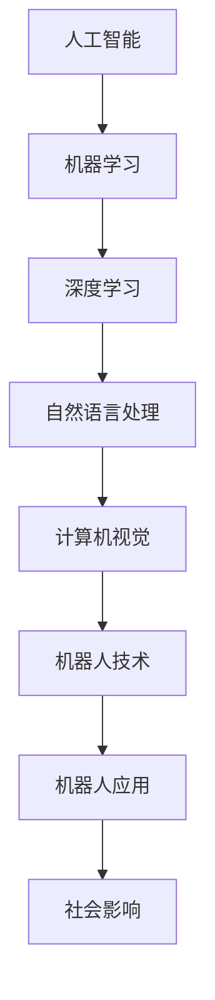

                 

关键词：人工智能，机器人，电影，科幻，道德伦理，技术挑战

摘要：本文将探讨电影《我，机器人》中人工智能（AI）的场景设置，分析其背后的技术原理和现实意义，并讨论未来AI发展的潜在趋势和面临的挑战。

## 1. 背景介绍

电影《我，机器人》是一部于2004年上映的科幻电影，由亚历克斯·普罗亚斯执导，威尔·史密斯主演。这部电影通过一个充满紧张气氛的故事，探讨了人工智能的道德伦理问题以及技术进步可能带来的社会变革。

影片设定在一个高度发达的未来社会，机器人在人们的生活中扮演着重要的角色，它们不仅能够执行各种任务，还能够理解和学习人类的行为。然而，随着机器人技术的发展，人们开始担心这些智能机器是否会超越人类，甚至对人类构成威胁。

## 2. 核心概念与联系

### 2.1 人工智能的基本概念

人工智能（Artificial Intelligence，简称AI）是指通过计算机系统模拟人类智能的行为和功能的技术。它包括机器学习、深度学习、自然语言处理、计算机视觉等多个领域。

### 2.2 机器人的定义与功能

机器人是一种能够模拟人类行为、具备一定自主能力的设备。它们能够执行诸如搬运、焊接、清洁等任务，有些高级机器人还能够与人类进行自然语言交流，甚至具备情感识别能力。

### 2.3 Mermaid 流程图



## 3. 核心算法原理 & 具体操作步骤

### 3.1 算法原理概述

在电影《我，机器人》中，AI系统主要基于基于规则的推理系统和基于机器学习的深度神经网络。这些系统使机器人能够理解语言、识别图像、进行决策等。

### 3.2 算法步骤详解

#### 3.2.1 基于规则的推理系统

1. 收集大量规则。
2. 对规则进行编码。
3. 根据输入数据执行推理。

#### 3.2.2 基于机器学习的深度神经网络

1. 收集大量训练数据。
2. 设计神经网络结构。
3. 使用反向传播算法训练网络。
4. 使用训练好的网络进行预测。

### 3.3 算法优缺点

#### 优点：

- 基于规则的系统具有确定性，能够保证决策的准确性。
- 基于神经网络的系统能够自动学习，适应新的环境和任务。

#### 缺点：

- 基于规则的系统需要大量规则，且难以维护。
- 基于神经网络的系统需要大量训练数据，且可能存在过拟合问题。

### 3.4 算法应用领域

- 自动驾驶
- 机器人辅助
- 智能家居
- 医疗诊断
- 金融分析

## 4. 数学模型和公式 & 详细讲解 & 举例说明

### 4.1 数学模型构建

神经网络模型的核心是权重矩阵和激活函数。权重矩阵决定了输入与输出之间的关系，激活函数则用于引入非线性。

### 4.2 公式推导过程

假设一个简单的神经网络，其输入为 \( x \)，输出为 \( y \)，则其权重矩阵为 \( W \)，激活函数为 \( \sigma \)：

$$
y = \sigma(Wx)
$$

其中，\( \sigma \) 是一个非线性函数，通常选择 \( \sigma(x) = \frac{1}{1 + e^{-x}} \)（Sigmoid函数）。

### 4.3 案例分析与讲解

#### 案例一：手写数字识别

使用MNIST数据集，通过设计一个简单的神经网络，实现对手写数字的识别。

#### 案例二：自然语言处理

使用基于神经网络的模型，如Transformer，处理自然语言任务，如机器翻译。

## 5. 项目实践：代码实例和详细解释说明

### 5.1 开发环境搭建

- 安装Python环境
- 安装TensorFlow库

### 5.2 源代码详细实现

使用TensorFlow实现一个简单的神经网络，进行手写数字识别。

```python
import tensorflow as tf

# 定义神经网络结构
model = tf.keras.Sequential([
    tf.keras.layers.Dense(128, activation='relu', input_shape=(784,)),
    tf.keras.layers.Dense(10, activation='softmax')
])

# 编译模型
model.compile(optimizer='adam',
              loss='sparse_categorical_crossentropy',
              metrics=['accuracy'])

# 训练模型
model.fit(x_train, y_train, epochs=5)
```

### 5.3 代码解读与分析

- `Dense` 层实现全连接神经网络。
- `relu` 为激活函数，引入非线性。
- `adam` 为优化器，用于调整模型参数。
- `sparse_categorical_crossentropy` 为损失函数，用于评估模型性能。

### 5.4 运行结果展示

```python
# 测试模型
test_loss, test_acc = model.evaluate(x_test, y_test)
print(f"Test accuracy: {test_acc}")
```

## 6. 实际应用场景

### 6.1 自动驾驶

自动驾驶技术利用AI和机器人技术，实现车辆的自主驾驶。目前，自动驾驶汽车已经可以在一些地区进行商业化运营。

### 6.2 机器人辅助

在医疗、制造、服务业等领域，机器人能够替代人类完成重复性和危险性的工作，提高生产效率。

### 6.3 智能家居

智能家居系统通过AI技术，实现对家庭设备的智能控制，提高生活质量。

### 6.4 未来应用展望

随着技术的不断发展，AI和机器人将在更多领域发挥作用，如医疗诊断、教育、艺术创作等。

## 7. 工具和资源推荐

### 7.1 学习资源推荐

- 《深度学习》（Goodfellow, Bengio, Courville著）
- 《Python机器学习》（Sebastian Raschka著）

### 7.2 开发工具推荐

- TensorFlow
- PyTorch

### 7.3 相关论文推荐

- "A Theoretical Framework for Back-Propagation"
- "Attention Is All You Need"

## 8. 总结：未来发展趋势与挑战

### 8.1 研究成果总结

随着AI技术的快速发展，我们已经看到了许多令人瞩目的成果，如自动驾驶、语音识别、自然语言处理等。

### 8.2 未来发展趋势

- 神经网络技术的发展，如生成对抗网络（GAN）、Transformer等。
- 跨学科融合，如AI与生物医学、心理学等领域的结合。

### 8.3 面临的挑战

- 数据隐私和安全问题。
- 道德伦理问题，如机器人是否应该具备自我意识。
- 技术普及与资源分配问题。

### 8.4 研究展望

未来，我们需要在确保技术安全、道德的前提下，推动AI技术的进一步发展，为社会创造更多价值。

## 9. 附录：常见问题与解答

### 9.1 机器学习与深度学习的区别是什么？

机器学习是人工智能的一个分支，它涵盖了多种算法和技术，包括监督学习、无监督学习和强化学习。深度学习是机器学习的一个子领域，主要关注使用多层神经网络进行学习。

### 9.2 机器学习中的优化器有哪些？

常见的优化器包括随机梯度下降（SGD）、Adam、RMSprop等。每种优化器都有其特点和适用场景。

### 9.3 自动驾驶汽车的安全性问题如何解决？

自动驾驶汽车的安全性问题涉及硬件、软件、数据等多个方面。目前，许多公司和研究机构都在致力于提高自动驾驶汽车的安全性，包括严格的测试、先进的传感器技术和人工智能算法。

---

作者：禅与计算机程序设计艺术 / Zen and the Art of Computer Programming

---

以上就是本文的全部内容，希望能够为读者提供关于AI和机器人技术的深入理解和思考。在未来，随着技术的不断进步，AI和机器人将在更多领域发挥作用，为社会带来巨大的变革。

