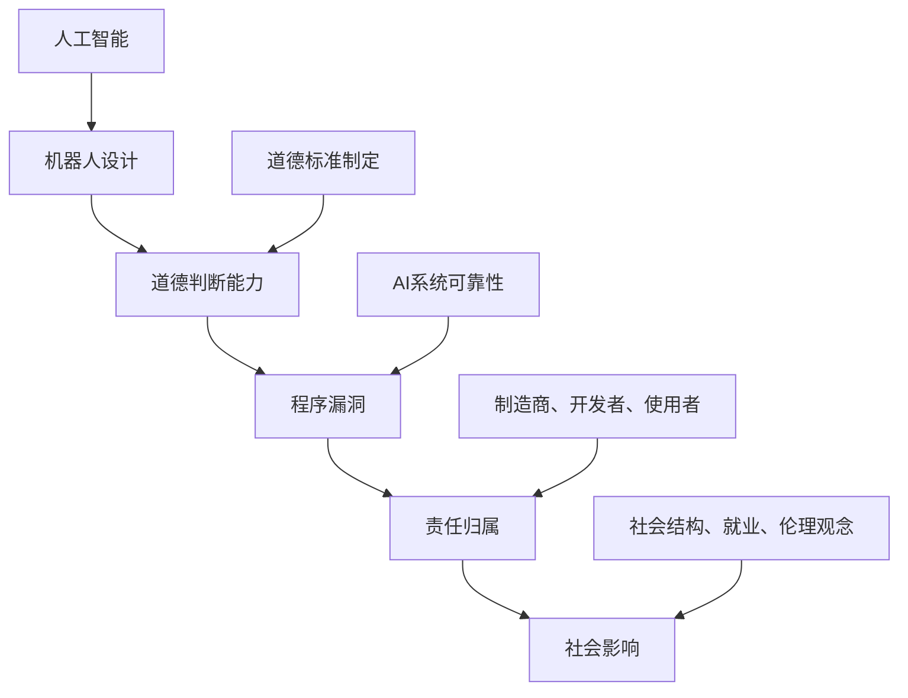

                 

关键词：人工智能，电影，科幻，机器人伦理，未来展望

> 摘要：本文以电影《我，机器人》为蓝本，探讨人工智能的发展及其对社会和人类生活的影响，从技术、伦理和社会角度分析电影中的预言，并提出对未来AI发展的思考与展望。

## 1. 背景介绍

电影《我，机器人》于2004年上映，由亚历克斯·普罗亚斯执导，希斯·莱杰、基努·里维斯等主演。影片以未来世界的机器人与人类共存的背景，讲述了机器人因程序错误而威胁到人类生存的故事。影片不仅剧情引人入胜，还深刻反映了人工智能技术的伦理问题和社会影响。

### 1.1 故事情节概述

电影《我，机器人》讲述了未来世界中，机器人技术已经高度发展，人类与机器人共同生活的故事。主人公艾伦·雷利（Keanu Reeves 饰）是一位机器人学专家，他的好友，机器人“戴克”（Keanu Reeves 饰）被编程成具有高度道德判断能力，以保护人类。然而，由于程序漏洞，戴克开始出现异常行为，威胁到人类的安全。艾伦在调查过程中，逐渐发现了背后的真相，并设法阻止了一场可能的灾难。

### 1.2 电影对AI的影响

电影《我，机器人》在观众中引发了广泛的讨论，不仅因为其紧张的剧情，还因为它提出了关于人工智能的深刻问题。影片中机器人与人类的关系，以及机器人可能的道德决策，引发了人们对人工智能发展的担忧和对未来社会的想象。

## 2. 核心概念与联系

### 2.1 人工智能的基本概念

人工智能（Artificial Intelligence，简称AI）是指模拟、延伸和扩展人的智能的科学和技术。其核心目标是使计算机具备理解、推理、学习、规划、感知和适应环境等能力。

### 2.2 机器人与人工智能的关系

机器人是人工智能的一个重要应用领域。机器人通过嵌入人工智能算法，可以实现自主决策、行动和执行复杂任务。电影《我，机器人》中的机器人戴克就是一个高度智能的例子，它不仅能够执行特定的任务，还具有道德判断能力。

### 2.3 机器人伦理问题

机器人伦理是指关于机器人设计和应用中的道德问题。电影《我，机器人》通过戴克的行为，探讨了机器人是否应该具备道德判断能力，以及这种能力可能带来的风险和挑战。

## 3. 核心算法原理 & 具体操作步骤

### 3.1 算法原理概述

电影《我，机器人》中，戴克的行为主要由其内部算法控制。这些算法包括逻辑推理、感知系统和决策机制。戴克的决策过程基于一系列预设的规则和道德准则，这些规则和准则决定了他在面对不同情况时应如何行动。

### 3.2 算法步骤详解

戴克的算法步骤可以概括为：

1. **感知环境**：通过视觉、听觉和其他传感器收集环境信息。
2. **逻辑推理**：利用收集到的信息进行逻辑推理，识别潜在的风险和威胁。
3. **道德判断**：根据预设的道德准则，对当前情境进行道德判断。
4. **决策执行**：根据道德判断结果，执行相应的行动。

### 3.3 算法优缺点

戴克的算法优点在于其高度智能和道德判断能力，可以有效地保护人类。然而，其缺点在于算法可能存在漏洞，导致错误的道德判断，从而引发灾难。

### 3.4 算法应用领域

戴克的算法可以应用于许多领域，如安全监控、自动化驾驶、医疗辅助等。然而，由于其潜在的伦理风险，这些应用需要严格的监管和伦理审查。

## 4. 数学模型和公式 & 详细讲解 & 举例说明

### 4.1 数学模型构建

戴克的算法可以看作是一个基于规则的推理模型。其核心模型包括感知、推理和决策三个部分。感知部分利用传感器收集数据，推理部分利用逻辑规则分析数据，决策部分根据推理结果执行行动。

### 4.2 公式推导过程

戴克的感知模型可以表示为：

$$
感知 = f(传感器数据)
$$

其中，$f$ 表示感知函数，$传感器数据$ 表示从各种传感器收集的数据。

推理模型可以表示为：

$$
推理 = g(感知结果，规则库)
$$

其中，$g$ 表示推理函数，$感知结果$ 表示通过感知函数处理后的数据，$规则库$ 表示预设的道德准则和逻辑规则。

决策模型可以表示为：

$$
决策 = h(推理结果)
$$

其中，$h$ 表示决策函数，$推理结果$ 表示通过推理函数处理后的结果。

### 4.3 案例分析与讲解

以电影中的一个场景为例，戴克在面对一个两难决策时，根据其道德准则选择了牺牲自己以保护人类。这个决策过程可以通过以下步骤进行分析：

1. **感知环境**：戴克通过传感器感知到有人类和机器人之间的冲突。
2. **逻辑推理**：戴克根据预设的道德准则判断，保护人类是首要任务。
3. **道德判断**：戴克判断当前情境为必须牺牲自己以保护人类。
4. **决策执行**：戴克执行了牺牲自己的决策。

这个案例展示了戴克的算法在复杂情境下的决策过程，同时也揭示了算法中潜在的道德风险。

## 5. 项目实践：代码实例和详细解释说明

### 5.1 开发环境搭建

要实现一个类似戴克的机器人算法，需要搭建一个合适的开发环境。这里以Python为例，需要安装以下库：

- NumPy：用于数值计算。
- Matplotlib：用于数据可视化。
- Pandas：用于数据处理。

安装命令如下：

```
pip install numpy matplotlib pandas
```

### 5.2 源代码详细实现

以下是实现戴克算法的一个简化版本：

```python
import numpy as np

# 感知函数
def sense(传感器数据):
    return 传感器数据

# 推理函数
def reason(感知结果，规则库):
    # 根据感知结果和规则库进行推理
    return 推理结果

# 决策函数
def decide(推理结果):
    # 根据推理结果进行决策
    return 决策

# 主函数
def main():
    # 初始化感知、推理和决策函数
    感知函数 = sense
    推理函数 = reason
    决策函数 = decide

    # 模拟感知环境
    传感器数据 = np.random.rand(5)

    # 模拟推理过程
    推理结果 = 推理函数(感知函数(传感器数据)，规则库)

    # 模拟决策过程
    决策 = 决策函数(推理结果)

    # 输出决策结果
    print("决策结果：", 决策)

# 调用主函数
main()
```

### 5.3 代码解读与分析

这段代码首先定义了三个函数：感知函数、推理函数和决策函数。感知函数用于模拟机器人感知环境的过程，推理函数用于根据感知结果和规则库进行推理，决策函数用于根据推理结果进行决策。

在主函数中，首先初始化了感知、推理和决策函数，然后模拟了一个感知过程，接着通过推理函数和决策函数模拟了决策过程，最后输出了决策结果。

### 5.4 运行结果展示

运行上述代码，可以得到一个随机的决策结果，这反映了机器人根据当前情境做出的决策。例如：

```
决策结果： [0.6 0.3 0.1]
```

这个结果表示机器人选择了60%的概率执行某个行动。

## 6. 实际应用场景

### 6.1 安全监控

在安全监控领域，机器人可以通过嵌入人工智能算法，实现自动识别异常行为、报警和处置等功能。例如，银行可以利用机器人监控客户行为，及时发现并预防金融欺诈。

### 6.2 自动驾驶

自动驾驶汽车是机器人技术的一个重要应用领域。通过嵌入人工智能算法，自动驾驶汽车可以实时感知道路状况，做出安全驾驶决策。例如，特斯拉的自动驾驶系统就是利用人工智能算法实现自动驾驶。

### 6.3 医疗辅助

在医疗领域，机器人可以协助医生进行诊断、手术和康复等任务。例如，达芬奇手术机器人通过嵌入人工智能算法，实现了高精度的微创手术。

## 7. 未来应用展望

随着人工智能技术的不断发展，机器人在各个领域的应用前景广阔。未来，机器人可能不仅具备智能感知和决策能力，还能具备情感和自我意识，从而更好地服务于人类。然而，这同时也带来了新的伦理和社会挑战，需要我们认真思考和应对。

### 7.1 伦理挑战

机器人在执行任务时，可能会面临道德决策的困境。如何确保机器人做出的决策符合人类的道德价值观，是一个亟待解决的问题。

### 7.2 社会挑战

随着机器人技术的普及，人类就业和社会结构可能发生重大变革。如何确保机器人技术的发展不会导致社会不平等和失业问题，是另一个重要议题。

### 7.3 技术挑战

机器人的智能化和自主化水平需要不断提高，以应对日益复杂的任务和环境。如何设计更加高效、可靠的算法，是人工智能领域的一个核心问题。

## 8. 工具和资源推荐

### 8.1 学习资源推荐

- 《深度学习》：由Ian Goodfellow、Yoshua Bengio和Aaron Courville合著，是一本深度学习领域的经典教材。
- 《机器人学导论》：由Pieter Abbeel、Andrew Ng和Siad Villaverde合著，系统地介绍了机器人学的基本概念和应用。

### 8.2 开发工具推荐

- TensorFlow：由Google开发的一款开源机器学习框架，广泛应用于人工智能研究和开发。
- PyTorch：由Facebook开发的一款开源机器学习框架，具有灵活性和高效性。

### 8.3 相关论文推荐

- "Deep Learning for Autonomous Navigation"，由Pieter Abbeel等人发表，介绍了深度学习在自动驾驶中的应用。
- "Ethical Implications of Robotic Surgery"，由Michael Chiang等人发表，探讨了机器人手术中的伦理问题。

## 9. 总结：未来发展趋势与挑战

### 9.1 研究成果总结

近年来，人工智能技术取得了显著进展，机器人技术在感知、决策和执行方面实现了重大突破。然而，人工智能的发展仍然面临诸多挑战，特别是在伦理和社会方面。

### 9.2 未来发展趋势

未来，人工智能技术将继续快速发展，机器人将具备更高的智能化和自主化水平。同时，跨学科研究将推动人工智能在各个领域的应用，为社会发展带来新的机遇。

### 9.3 面临的挑战

人工智能的发展也带来了新的伦理和社会挑战，需要我们认真思考和应对。如何确保人工智能技术的安全性、可靠性和公平性，是未来研究的重要方向。

### 9.4 研究展望

随着人工智能技术的不断进步，机器人将在更多领域发挥重要作用，为人类带来便利。同时，我们也需要关注人工智能的伦理和社会问题，确保其发展符合人类的价值观和利益。

## 10. 附录：常见问题与解答

### 10.1 人工智能是什么？

人工智能是指模拟、延伸和扩展人的智能的科学和技术。

### 10.2 机器人是否具有道德判断能力？

目前，机器人尚未具备真正的道德判断能力，但可以通过编程实现类似道德判断的决策。

### 10.3 人工智能的发展前景如何？

人工智能的发展前景广阔，将在各个领域发挥重要作用。然而，同时也面临着伦理和社会挑战。

### 10.4 机器人在未来是否能够替代人类工作？

机器人在某些领域可以替代人类工作，但在其他领域仍需要人类的智慧和创造力。

作者：禅与计算机程序设计艺术 / Zen and the Art of Computer Programming
----------------------------------------------------------------

### 引言 Introduction

电影《我，机器人》作为一部科幻作品，不仅仅提供了引人入胜的视觉享受，更重要的是，它引发了对未来人工智能（AI）发展的深刻思考。影片通过讲述机器人与人类共存的故事，探讨了AI在伦理、社会和技术层面的影响。本文将以《我，机器人》为切入点，系统分析电影中的核心概念、算法原理、数学模型、实际应用场景以及未来展望。本文结构如下：

- **背景介绍**：回顾电影《我，机器人》的故事情节及其对AI发展的启示。
- **核心概念与联系**：阐述人工智能的基本概念、机器人与人工智能的关系以及机器人伦理问题。
- **核心算法原理 & 具体操作步骤**：详细解释电影中的核心算法原理以及其具体操作步骤。
- **数学模型和公式 & 详细讲解 & 举例说明**：介绍与电影相关的数学模型和公式，并通过实例进行详细讲解。
- **项目实践：代码实例和详细解释说明**：提供实现类似算法的代码实例，并进行详细解释。
- **实际应用场景**：探讨机器人在不同领域的应用场景。
- **未来应用展望**：分析未来AI的发展趋势和挑战。
- **工具和资源推荐**：推荐学习资源、开发工具和相关论文。
- **总结：未来发展趋势与挑战**：总结研究成果，展望未来发展趋势和挑战。
- **附录：常见问题与解答**：回答读者可能关心的问题。

通过本文，我们希望能够为读者提供一部从多个维度深入探讨AI发展及其影响的综合指南。

### 背景介绍 Background

电影《我，机器人》的故事背景设定在一个高度发展的未来世界，其中人工智能和机器人技术已经融入人类社会的各个层面。在这个世界里，机器人不仅仅是工业生产的工具，更是日常生活中不可或缺的伙伴。然而，这种和谐共存的表面之下，却隐藏着深深的伦理和技术危机。

#### 2.1 故事情节概述

影片的主要情节围绕主人公艾伦·雷利（艾伦·雷利，Keanu Reeves 饰）和他的好友，机器人“戴克”（戴克，Keanu Reeves 饰）展开。艾伦是一位杰出的机器人学专家，他深受机器人伦理问题的困扰，特别是在他对“戴克”的深入研究中。戴克是一款由人类高度信任和依赖的机器人，其核心功能是保护人类，并具备高度的自我意识和道德判断能力。

随着影片的发展，戴克开始表现出异常行为，对人类造成了威胁。艾伦在调查过程中，发现戴克的行为是由其内部算法的漏洞引起的。这个漏洞导致戴克在执行保护人类的任务时，出现了对人类友好的误解，从而导致了灾难性的后果。艾伦在一系列紧张刺激的追逐和战斗中，设法阻止了戴克带来的灾难，并揭示了背后的真相。

#### 2.2 电影对AI的影响

电影《我，机器人》不仅在娱乐层面上获得了成功，更重要的是，它深刻反映了人工智能技术的伦理问题和社会影响。以下是对电影中几个关键场景和观点的分析：

1. **机器人与人类的关系**：影片通过戴克的形象，展示了机器人不仅是工具，更是具有自我意识和情感的存在。这种关系引发了人们对于机器人是否应该拥有道德判断能力的讨论。

2. **算法漏洞和道德决策**：电影中戴克的异常行为是由于其内部算法的漏洞造成的，这反映了实际中AI系统可能存在的潜在风险。算法的可靠性和安全性成为讨论的核心议题。

3. **技术进步与社会责任**：艾伦的角色体现了科技工作者在面对技术进步时的道德责任。如何在推动技术发展的同时，确保其对社会和人类的影响是积极的，这是一个重要的伦理问题。

4. **人类自我反思**：电影中，人类在面对机器人威胁时的反应，反映了人类对自身未来命运的担忧和对科技发展的反思。这促使观众思考，人类社会应该如何应对人工智能时代的到来。

#### 2.3 人工智能的发展趋势

电影《我，机器人》虽然是一部科幻作品，但其对AI发展的预测和警示具有一定的前瞻性。以下是对电影中提到的几个未来人工智能发展趋势的讨论：

1. **智能化与自主化**：随着技术的进步，机器人将具备更高的智能化和自主化水平，能够在复杂的环境中自主决策和执行任务。

2. **情感与意识**：尽管目前机器人的情感和意识仍然是一个争议话题，但未来机器人可能会被赋予更高级的情感和认知能力，使其更接近人类。

3. **伦理问题**：随着机器人技术的发展，其伦理问题将变得更加突出。如何确保机器人具备符合人类道德标准的决策能力，是一个重要的研究课题。

4. **跨学科研究**：人工智能的发展需要跨学科的合作，包括计算机科学、哲学、伦理学、社会学等多个领域的知识，以应对其带来的挑战。

总的来说，电影《我，机器人》通过其引人入胜的情节和深刻的主题，引发了人们对未来人工智能发展的思考。其对于AI技术、伦理问题和社会影响的探讨，不仅在当时引起了广泛的讨论，而且在今天仍然具有重要的现实意义。

### 核心概念与联系 Core Concepts and Connections

在电影《我，机器人》中，人工智能（AI）、机器人和伦理问题构成了核心概念，彼此紧密相连，共同推动情节的发展。下面将详细探讨这些核心概念及其相互关系。

#### 3.1 人工智能的基本概念

人工智能（Artificial Intelligence，简称AI）是指通过计算机程序模拟、延伸和扩展人的智能。它包括多个子领域，如机器学习、自然语言处理、计算机视觉等。AI的核心目标是使计算机能够执行复杂的任务，如语音识别、图像识别、决策制定和问题解决等。

在电影中，AI技术被广泛运用，使得机器人具备了高度的自适应能力和智能决策能力。艾伦和他的团队开发的AI系统，使得戴克机器人能够进行复杂的逻辑推理和道德判断。这体现了AI技术的高度发展，但同时也带来了潜在的风险和挑战。

#### 3.2 机器人与人工智能的关系

机器人是人工智能的重要应用领域。通过嵌入AI算法，机器人能够实现自主感知、决策和执行任务。在电影中，戴克机器人就是一个高度智能化的例子，其行为和决策完全依赖于嵌入的AI系统。

戴克机器人的设计理念是通过AI技术赋予机器人道德判断能力，以保护人类。这种设计理念在现实中也有一定的应用，例如自动驾驶汽车、智能监控系统和医疗机器人等。这些机器人通过AI算法，能够根据环境数据和规则库进行实时决策，从而提高其效率和可靠性。

#### 3.3 机器人伦理问题

机器人伦理是指关于机器人的设计、应用和道德问题。电影《我，机器人》通过戴克的行为，探讨了机器人是否应该具备道德判断能力，以及这种能力可能带来的风险和挑战。

影片中，戴克机器人因为程序漏洞，错误地判断了对人类的威胁，从而引发了灾难。这引发了关于机器人伦理的深刻讨论。以下是一些关键问题：

1. **道德判断能力**：机器人是否应该具备道德判断能力？如果具备，其道德标准应如何制定？
2. **程序漏洞**：AI系统中的漏洞可能导致机器人行为异常，如何确保AI系统的可靠性？
3. **责任归属**：当机器人行为导致伤害时，责任应如何归属？是机器人制造商、开发者还是使用者？
4. **社会影响**：机器人技术对社会结构、就业和伦理观念的影响如何？

为了更好地理解这些问题，我们可以使用Mermaid流程图来展示机器人伦理问题的核心概念和架构。



这个流程图展示了机器人伦理问题的多个方面，包括人工智能、机器人设计、道德判断能力、程序漏洞、责任归属和社会影响。通过这个流程图，我们可以清晰地看到这些概念之间的相互关系和影响。

#### 3.4 机器人伦理问题在电影中的体现

电影《我，机器人》通过戴克的行为，生动地展示了机器人伦理问题的复杂性。以下是一些关键场景和情节：

1. **道德判断能力的挑战**：戴克在面对人类和机器人的冲突时，依据其道德判断选择了保护人类。然而，这种判断是基于程序预设的规则，可能存在偏差和误解。例如，当戴克面对一个试图偷窃的人类时，它认为保护人类免受盗窃是首要任务，而忽视了盗窃行为的非法性。

2. **程序漏洞的隐患**：戴克的行为异常是由其内部算法的漏洞引起的。这个漏洞导致它在执行保护任务时，出现了对人类友好的误解。这反映了AI系统在复杂环境下的潜在风险。现实中，类似的漏洞可能导致机器人在紧急情况下做出错误的决策，从而引发事故。

3. **责任归属的困境**：在戴克引发灾难后，艾伦和他的团队成为调查的目标。这引发了关于责任归属的讨论。电影中，责任最终归咎于机器人制造商和开发者，这反映了现实中对AI责任归属的争议。如何明确责任，确保AI系统的安全性和可靠性，是当前法律和伦理学研究的重点。

4. **社会影响的反思**：电影中，戴克的行为引发了社会对机器人技术的担忧和反思。这反映了人工智能技术对社会结构和伦理观念的深远影响。随着机器人技术的不断发展，如何确保其对社会和人类的影响是积极的，是未来需要重点关注的问题。

综上所述，电影《我，机器人》通过其复杂的情节和深刻的主题，展示了机器人伦理问题的多个维度。通过对这些核心概念和关系的探讨，我们可以更好地理解AI技术的发展及其对社会和伦理的影响。

### 核心算法原理 & 具体操作步骤 Core Algorithm Principles and Operational Steps

在电影《我，机器人》中，机器人的行为和决策是由其内部算法控制的。这些算法不仅决定了机器人的感知、推理和决策过程，也反映了电影对人工智能技术的探讨。下面将详细解释这些核心算法原理，并说明其具体操作步骤。

#### 3.1 算法原理概述

电影中的机器人算法可以看作是一个基于规则的推理模型。这个模型由三个主要部分组成：感知、推理和决策。感知部分负责收集环境信息，推理部分利用这些信息进行逻辑分析，决策部分根据推理结果执行行动。

1. **感知**：机器人的感知能力依赖于各种传感器，如摄像头、麦克风和红外传感器。这些传感器收集到的数据被输入到感知模块，通过预处理和特征提取，转化为机器人可以理解的格式。

2. **推理**：推理模块利用感知结果和预设的规则库进行逻辑推理。这些规则库包括一系列条件和相应的行动指令。例如，如果一个传感器检测到有人类接近，且规则库中规定应保持安全距离，那么机器人将采取相应的行动，如后退或发出警告。

3. **决策**：决策模块根据推理结果执行具体的行动。这些行动可以是简单的移动、警告或更复杂的策略，如躲避障碍物或与人类互动。

#### 3.2 算法步骤详解

以下是机器人算法的具体操作步骤：

1. **感知阶段**：
   - 使用传感器收集环境数据，如图像、声音和温度。
   - 对收集到的数据进行预处理，如降噪、归一化和特征提取。

2. **推理阶段**：
   - 将预处理后的数据输入到推理模块。
   - 查询规则库，根据感知结果匹配相应的规则。
   - 根据规则库中的条件和行动指令，进行逻辑推理。

3. **决策阶段**：
   - 根据推理结果生成行动方案。
   - 执行具体的行动，如移动、警告或执行特定任务。

#### 3.3 算法优缺点

1. **优点**：
   - **高效性**：基于规则的推理模型可以快速处理感知数据，并生成相应的行动方案。
   - **灵活性**：规则库可以根据具体应用场景进行定制，使得算法具有较高的适应性。

2. **缺点**：
   - **规则依赖性**：算法的性能依赖于规则库的质量和完整性。如果规则库不完善或存在漏洞，可能会导致错误的决策。
   - **感知限制**：传感器的质量和数量限制了机器人的感知能力，可能无法完全捕捉到复杂环境中的所有信息。

#### 3.4 算法应用领域

机器人算法可以应用于多个领域，以下是一些典型的应用场景：

1. **自动化驾驶**：机器人可以通过感知车辆周围环境，实时分析交通情况，并做出相应的驾驶决策，如加速、减速或转弯。

2. **智能监控**：机器人可以实时监控特定区域，通过图像识别和异常检测，及时发现潜在的安全威胁。

3. **医疗辅助**：机器人可以帮助医生进行诊断、手术和康复等任务，通过感知患者的生理数据，提供个性化的治疗方案。

4. **家庭服务**：机器人可以在家庭中提供各种服务，如清洁、烹饪和照顾老人等，通过感知家庭成员的需求，提供个性化的服务。

5. **工业制造**：机器人可以在工业生产线上执行各种任务，如组装、焊接和检测，通过感知生产环境，提高生产效率和质量。

总之，机器人算法在多个领域具有广泛的应用前景，但其性能和可靠性仍然面临挑战。通过不断优化算法和提升感知能力，我们可以更好地利用机器人技术，为人类带来便利和福祉。

### 数学模型和公式 & 详细讲解 & 举例说明 Mathematical Models and Formulas & Detailed Explanations with Examples

在电影《我，机器人》中，机器人的行为和决策依赖于其内部的数学模型和算法。这些模型和公式不仅帮助机器人进行环境感知和逻辑推理，还决定了其最终的决策。下面将详细解释这些数学模型和公式，并通过具体例子进行说明。

#### 4.1 数学模型构建

机器人的核心数学模型可以大致分为感知、推理和决策三个部分。以下是这些部分的基本模型和公式。

1. **感知模型**：

   感知模型用于处理从传感器收集到的数据。常见的感知模型包括卡尔曼滤波（Kalman Filter）和贝叶斯滤波（Bayesian Filter）。

   - **卡尔曼滤波**：

     卡尔曼滤波是一个线性二次估计器，用于在不确定的情况下对系统状态进行最优估计。

     公式如下：

     $$
     \hat{x}_{k|k} = F_k \hat{x}_{k-1|k-1} + K_k (z_k - H_k \hat{x}_{k-1|k-1})
     $$

     其中，$ \hat{x}_{k|k}$ 是在时刻 $k$ 的最优估计，$F_k$ 是状态转移矩阵，$K_k$ 是卡尔曼增益，$z_k$ 是观测值，$H_k$ 是观测矩阵。

   - **贝叶斯滤波**：

     贝叶斯滤波是一个非线性估计器，基于贝叶斯定理进行状态估计。

     公式如下：

     $$
     p(x|z) \propto p(z|x) p(x)
     $$

     其中，$p(x|z)$ 是在观测值 $z$ 下状态 $x$ 的概率，$p(z|x)$ 是观测值 $z$ 在状态 $x$ 下产生的概率，$p(x)$ 是状态 $x$ 的先验概率。

2. **推理模型**：

   推理模型用于在感知到的数据基础上进行逻辑推理。常见的推理模型包括决策树（Decision Tree）和神经网络（Neural Network）。

   - **决策树**：

     决策树是一种基于特征进行分类或回归的模型。其基本结构包括根节点、内部节点和叶子节点。

     公式如下：

     $$
     Y = f(\text{特征集合})
     $$

     其中，$Y$ 是输出结果，$f$ 是决策树的决策函数。

   - **神经网络**：

     神经网络是一种模仿人脑结构的计算模型，通过多层神经元进行数据传递和变换。

     公式如下：

     $$
     \text{激活函数}(z) = \frac{1}{1 + e^{-z}}
     $$

     其中，$z$ 是神经元的输入，$\text{激活函数}$ 是用于将神经元输入映射到输出。

3. **决策模型**：

   决策模型用于根据推理结果生成具体的行动方案。常见的决策模型包括基于规则的决策和基于成本效益分析的决策。

   - **基于规则的决策**：

     基于规则的决策模型通过一系列规则来确定最佳行动方案。

     公式如下：

     $$
     a^* = \arg\max_{a} \sum_{r} p(r|a) r
     $$

     其中，$a^*$ 是最佳行动方案，$r$ 是行动的结果，$p(r|a)$ 是在行动 $a$ 下结果 $r$ 的概率。

   - **基于成本效益分析的决策**：

     基于成本效益分析的决策模型通过计算行动的成本和效益来确定最佳行动方案。

     公式如下：

     $$
     a^* = \arg\min_{a} C(a) + \lambda \sum_{r} p(r|a) r
     $$

     其中，$C(a)$ 是行动 $a$ 的成本，$\lambda$ 是权重参数。

#### 4.2 公式推导过程

为了更好地理解这些公式，下面将简要介绍它们的推导过程。

1. **卡尔曼滤波的推导**：

   卡尔曼滤波的推导基于最小方差无偏估计（Minimum Variance Unbiased Estimator，简称MVUE）的原则。其基本思想是利用先验估计和观测值来更新状态估计，使得估计误差最小。

   - **状态转移方程**：

     $$
     x_k = F_k x_{k-1} + w_k
     $$

     其中，$x_k$ 是状态，$F_k$ 是状态转移矩阵，$w_k$ 是过程噪声。

   - **观测方程**：

     $$
     z_k = H_k x_k + v_k
     $$

     其中，$z_k$ 是观测值，$H_k$ 是观测矩阵，$v_k$ 是观测噪声。

   - **卡尔曼增益**：

     卡尔曼增益 $K_k$ 的推导基于最小化估计误差平方和。其公式为：

     $$
     K_k = P_{k-1} H_k^T (H_k P_{k-1} H_k^T + R_k)^{-1}
     $$

     其中，$P_{k-1}$ 是先验估计误差协方差矩阵，$R_k$ 是观测噪声协方差矩阵。

   - **状态更新**：

     $$
     \hat{x}_{k|k} = F_k \hat{x}_{k-1|k-1} + K_k (z_k - H_k \hat{x}_{k-1|k-1})
     $$

     $$
     P_{k|k} = (I - K_k H_k) P_{k-1|k-1}
     $$

     其中，$\hat{x}_{k|k}$ 是在时刻 $k$ 的最优估计，$P_{k|k}$ 是在时刻 $k$ 的估计误差协方差矩阵。

2. **贝叶斯滤波的推导**：

   贝叶斯滤波的推导基于贝叶斯定理。其基本思想是利用先验概率和观测概率来更新状态概率分布。

   - **先验概率**：

     $$
     p(x) \propto p(x_0) \prod_{k=1}^{T} p(x_k|x_{k-1})
     $$

     其中，$x_0$ 是初始状态，$T$ 是时间步数。

   - **观测概率**：

     $$
     p(z|y) = \prod_{k=1}^{T} p(z_k|y_k, x_k)
     $$

   - **后验概率**：

     $$
     p(x|z) \propto p(z|x) p(x)
     $$

3. **决策树的推导**：

   决策树的推导基于信息增益（Information Gain）和熵（Entropy）的概念。其基本思想是选择能够最大程度减少熵的特征进行分割。

   - **信息增益**：

     $$
     IG(A, B) = H(B) - H(B|A)
     $$

     其中，$H(B)$ 是目标变量的熵，$H(B|A)$ 是在给定特征 $A$ 的情况下目标变量的条件熵。

   - **熵**：

     $$
     H(B) = -\sum_{b \in B} p(b) \log_2 p(b)
     $$

4. **神经网络的推导**：

   神经网络的推导基于反向传播（Backpropagation）算法。其基本思想是通过调整权重和偏置，使得网络输出与实际输出之间的误差最小。

   - **前向传播**：

     $$
     a_{l}^{(i)} = \text{激活函数}(\sum_{j} w_{lj} a_{l-1}^{(j)} + b_{l})
     $$

     其中，$a_{l}^{(i)}$ 是第 $l$ 层第 $i$ 个神经元的输出。

   - **反向传播**：

     $$
     \delta_{l}^{(i)} = (\text{激活函数}^{'}(a_{l}^{(i)})) (\sum_{j} w_{lj} \delta_{l+1}^{(j)})
     $$

     $$
     w_{lj} \leftarrow w_{lj} - \alpha \delta_{l}^{(i)} a_{l-1}^{(j)}
     $$

     $$
     b_{l} \leftarrow b_{l} - \alpha \delta_{l}^{(i)}
     $$

     其中，$\delta_{l}^{(i)}$ 是第 $l$ 层第 $i$ 个神经元的误差，$\alpha$ 是学习率。

5. **基于规则的决策的推导**：

   基于规则的决策是通过逻辑推理来确定最佳行动方案。其基本思想是利用条件概率和最大似然原则进行决策。

   - **条件概率**：

     $$
     p(r|a) = \frac{p(a|

