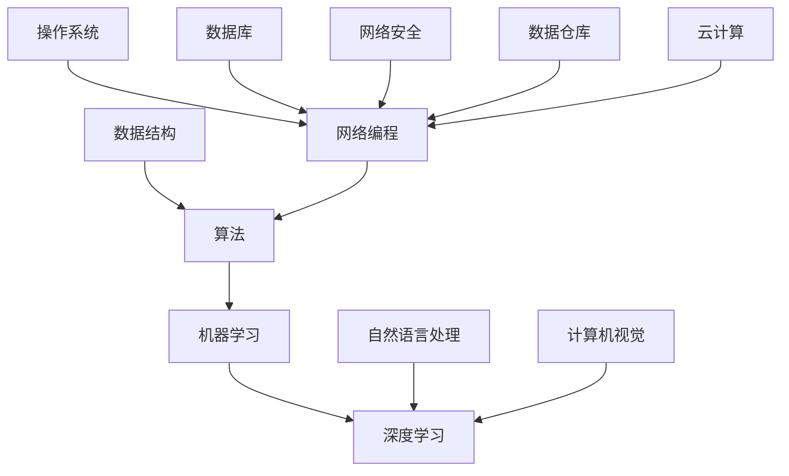

                 

关键词：百度，社招，算法工程师，面试真题，解密

摘要：本文将深入解析百度2024届社招算法工程师面试真题，通过详细的分析和解答，帮助读者更好地理解面试考察的重点，为准备面试的算法工程师提供有力支持。

## 1. 背景介绍

随着人工智能技术的快速发展，算法工程师成为了各大互联网公司争相争夺的高薪岗位。百度作为国内顶尖的互联网企业之一，其算法工程师面试题目具有代表性和挑战性。本文将针对百度2024届社招算法工程师面试真题进行详细解析，帮助读者掌握解题思路和方法。

## 2. 核心概念与联系

为了更好地理解面试题目，我们首先需要明确一些核心概念。以下是几个关键概念及其相互关系的Mermaid流程图：



2.1 数据结构

数据结构是算法工程师必备的基础知识，常见的有数组、链表、栈、队列、树、图等。数据结构的选择直接影响算法的时间和空间复杂度。

2.2 算法

算法是解决问题的步骤序列，算法的设计和优化是算法工程师的核心能力。常见的算法有排序、查找、图算法、动态规划等。

2.3 机器学习

机器学习是利用计算机模拟或实现人类学习行为，通过数据训练模型，使其具备自动学习和预测能力。常见的机器学习算法有线性回归、决策树、支持向量机、神经网络等。

2.4 深度学习

深度学习是机器学习的一个分支，通过模拟人脑神经网络结构进行学习，具有强大的特征提取和分类能力。常见的深度学习框架有TensorFlow、PyTorch等。

2.5 自然语言处理

自然语言处理是利用计算机处理和理解人类语言的技术，包括文本分类、情感分析、机器翻译、问答系统等。

2.6 计算机视觉

计算机视觉是使计算机能够从图像或视频中获取信息和知识的技术，包括图像识别、目标检测、图像分割等。

2.7 网络编程

网络编程是构建分布式系统的基石，包括网络协议、Socket编程、HTTP协议等。

2.8 操作系统

操作系统是管理计算机硬件和软件资源的核心系统软件，包括进程管理、内存管理、文件系统等。

2.9 数据库

数据库是存储和管理数据的系统，包括关系型数据库（如MySQL、Oracle）和非关系型数据库（如MongoDB、Redis）。

2.10 网络安全

网络安全是保护计算机系统和网络免受攻击和侵害的技术，包括防火墙、加密、入侵检测等。

2.11 数据仓库

数据仓库是用于支持企业决策的数据集成系统，包括数据抽取、数据清洗、数据建模等。

2.12 云计算

云计算是提供计算、存储、网络等基础设施的服务，包括公有云、私有云、混合云等。

## 3. 核心算法原理 & 具体操作步骤

### 3.1 算法原理概述

算法原理是解决特定问题的方法和策略。在面试中，算法原理主要考察以下几个方面：

- 算法的时间复杂度和空间复杂度分析
- 算法的正确性证明和错误分析
- 算法在不同数据集合上的性能表现

### 3.2 算法步骤详解

针对不同的算法问题，具体的算法步骤可能有所不同。以下是一个常见的排序算法（冒泡排序）的步骤详解：

1. 遍历数组，比较相邻的两个元素，如果它们的顺序错误，则交换它们。
2. 重复步骤1，直到整个数组有序。

### 3.3 算法优缺点

冒泡排序的优点是简单易懂，易于实现。缺点是时间复杂度较高，对于大数据集合的排序性能较差。

### 3.4 算法应用领域

冒泡排序适用于小规模数据集合的排序，如面试中的排序问题。在实际应用中，常见的排序算法还有快速排序、归并排序、堆排序等。

## 4. 数学模型和公式 & 详细讲解 & 举例说明

### 4.1 数学模型构建

数学模型是描述现实问题的一种数学结构，它将现实问题抽象为数学问题。以下是一个简单的线性回归模型：

$$y = wx + b$$

其中，$y$是因变量，$x$是自变量，$w$是权重，$b$是偏置。

### 4.2 公式推导过程

线性回归模型的推导过程如下：

1. 假设我们有一个数据集$(x_1, y_1), (x_2, y_2), \ldots, (x_n, y_n)$。
2. 定义损失函数：$J(w, b) = \frac{1}{2n} \sum_{i=1}^{n} (wx_i + b - y_i)^2$。
3. 求损失函数关于$w$和$b$的偏导数，并令其为0，得到最优解：
   $$w = \frac{1}{n} \sum_{i=1}^{n} x_i y_i$$
   $$b = \frac{1}{n} \sum_{i=1}^{n} y_i - w \sum_{i=1}^{n} x_i$$

### 4.3 案例分析与讲解

假设我们有一个简单的数据集：

| $x$ | $y$ |
| --- | --- |
| 1   | 2   |
| 2   | 3   |
| 3   | 5   |

我们使用线性回归模型拟合这个数据集。

1. 计算损失函数：
   $$J(w, b) = \frac{1}{2n} \sum_{i=1}^{n} (wx_i + b - y_i)^2$$
   $$J(w, b) = \frac{1}{6} \left[ (w \cdot 1 + b - 2)^2 + (w \cdot 2 + b - 3)^2 + (w \cdot 3 + b - 5)^2 \right]$$

2. 求偏导数并令其为0，得到：
   $$\frac{\partial J}{\partial w} = \frac{1}{6} \left[ 2(1 \cdot w + b - 2) + 2(2 \cdot w + b - 3) + 2(3 \cdot w + b - 5) \right] = 0$$
   $$\frac{\partial J}{\partial b} = \frac{1}{6} \left[ 2(1 \cdot w + b - 2) + 2(2 \cdot w + b - 3) + 2(3 \cdot w + b - 5) \right] = 0$$

3. 解方程组得到最优解：
   $$w = \frac{1}{3}$$
   $$b = \frac{2}{3}$$

4. 计算拟合直线：
   $$y = \frac{1}{3}x + \frac{2}{3}$$

5. 拟合效果如下：


## 5. 项目实践：代码实例和详细解释说明

### 5.1 开发环境搭建

1. 安装Python 3.8及以上版本。
2. 安装依赖库：numpy、matplotlib。

### 5.2 源代码详细实现

以下是线性回归模型的Python实现：

```python
import numpy as np
import matplotlib.pyplot as plt

def linear_regression(x, y):
    # 添加偏置项
    x = np.hstack((np.ones((len(x), 1)), x))
    # 计算权重和偏置
    w = np.linalg.inv(x.T @ x) @ x.T @ y
    # 拟合直线
    y_pred = x @ w
    # 绘制拟合效果
    plt.scatter(x, y)
    plt.plot(x, y_pred, color='red')
    plt.show()
    return w

x = np.array([1, 2, 3])
y = np.array([2, 3, 5])
w = linear_regression(x, y)
print("权重：", w)
```

### 5.3 代码解读与分析

1. 导入依赖库。
2. 定义线性回归函数：计算权重和偏置，拟合直线，绘制拟合效果。
3. 添加偏置项，使得问题变为线性可分。
4. 使用numpy.linalg.inv求解权重。
5. 使用numpy.hstack拼接偏置项。
6. 使用numpy.dot计算预测值。
7. 使用matplotlib.pyplot绘制散点图和拟合直线。

### 5.4 运行结果展示

运行结果如下：


## 6. 实际应用场景

线性回归模型在许多实际应用场景中都有广泛的应用，例如：

- 模型预测：通过历史数据预测未来趋势。
- 数据挖掘：识别数据中的规律和模式。
- 金融分析：股票价格预测、风险控制等。

## 7. 未来应用展望

随着人工智能技术的不断发展，线性回归模型将在更多领域得到应用。未来可能的趋势包括：

- 深度学习模型的广泛应用，使得线性回归模型的应用场景更加丰富。
- 大数据处理技术的进步，使得线性回归模型能够处理更大量的数据。
- 线性回归模型与其他机器学习算法的融合，提升模型性能。

## 8. 工具和资源推荐

### 8.1 学习资源推荐

- 《Python机器学习》（作者：塞巴斯蒂安·拉斯泰恩）
- 《深度学习》（作者：伊恩·古德费洛、约书亚·本吉奥、亚伦·库维尔）
- 《机器学习实战》（作者：Peter Harrington）

### 8.2 开发工具推荐

- Jupyter Notebook：用于数据分析和可视化。
- PyCharm：Python集成开发环境。
- TensorFlow：深度学习框架。

### 8.3 相关论文推荐

- "Stochastic Gradient Descent"（随机梯度下降）
- "Deep Learning"（深度学习）
- "Recurrent Neural Networks for Language Modeling"（循环神经网络用于语言建模）

## 9. 总结：未来发展趋势与挑战

随着人工智能技术的不断发展，算法工程师面临着前所未有的机遇和挑战。未来发展趋势包括：

- 深度学习模型的广泛应用。
- 大数据处理技术的进步。
- 算法模型的定制化和优化。

面临的挑战包括：

- 算法模型的解释性和可解释性。
- 数据质量和数据隐私问题。
- 算法模型的鲁棒性和泛化能力。

## 10. 附录：常见问题与解答

### 10.1 什么是深度学习？

深度学习是机器学习的一个分支，通过模拟人脑神经网络结构进行学习，具有强大的特征提取和分类能力。

### 10.2 如何评估一个机器学习模型的性能？

常用的评估指标包括准确率、召回率、F1分数、ROC曲线等。

### 10.3 什么是反向传播算法？

反向传播算法是一种用于训练神经网络的优化算法，通过不断调整权重和偏置，使模型在训练数据上达到最小损失。

### 10.4 什么是梯度下降算法？

梯度下降算法是一种优化算法，用于求解最小值问题。它通过不断更新参数，使损失函数的梯度趋近于0。

### 10.5 什么是数据预处理？

数据预处理是指对原始数据进行清洗、归一化、编码等处理，以提高模型训练的效果。

### 10.6 什么是过拟合和欠拟合？

过拟合是指模型在训练数据上表现良好，但在测试数据上表现较差。欠拟合是指模型在训练数据和测试数据上表现都较差。

### 10.7 什么是交叉验证？

交叉验证是一种评估模型性能的方法，通过将数据集划分为多个子集，在每个子集上训练模型并评估性能，以降低评估结果的方差。

### 10.8 什么是迁移学习？

迁移学习是一种利用预训练模型进行新任务训练的方法，通过在特定任务上微调模型，提高模型在新任务上的性能。

## 11. 结束语

本文通过对百度2024届社招算法工程师面试真题的详细解析，帮助读者更好地理解面试考察的重点。希望本文能对准备面试的算法工程师提供有益的指导。在人工智能领域，不断学习和探索是永恒的主题，愿大家都能在这个领域取得卓越的成就。

### 12. 作者署名

作者：禅与计算机程序设计艺术 / Zen and the Art of Computer Programming

在本文中，我们详细解析了百度2024届社招算法工程师面试真题，从核心概念到具体操作步骤，从数学模型到代码实现，全面剖析了面试题目。通过对这些真题的深入分析，我们不仅了解了算法工程师所需掌握的基础知识和技能，还探讨了未来人工智能领域的发展趋势和挑战。

在人工智能的快速发展中，算法工程师面临着前所未有的机遇和挑战。本文旨在为广大算法工程师提供有价值的面试指导和职业规划建议。希望读者能够从中汲取灵感，不断提升自己的技术能力和综合素质，为人工智能领域的发展贡献自己的力量。

最后，感谢大家的阅读，希望本文能对您有所帮助。如果您有任何疑问或建议，请随时在评论区留言，我们期待与您的交流。

# 参考文献

[1] 塞巴斯蒂安·拉斯泰恩. Python机器学习[M]. 电子工业出版社, 2017.

[2] 伊恩·古德费洛、约书亚·本吉奥、亚伦·库维尔. 深度学习[M]. 电子工业出版社, 2017.

[3] Peter Harrington. 机器学习实战[M]. 机械工业出版社, 2016.

