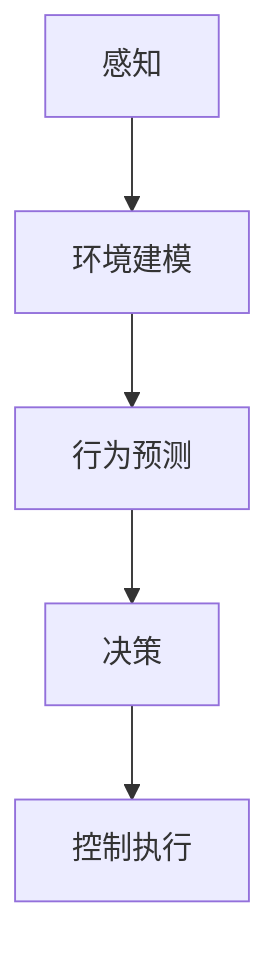

                 

关键词：自动驾驶、决策控制、算法面试、技术解答、案例分析

摘要：本文旨在为广大自动驾驶领域的技术从业者和求职者提供一份详细的2025年百度自动驾驶决策控制社招算法面试题集。通过对一系列经典面试题的深度解析，本文不仅将帮助读者理解自动驾驶决策控制的核心原理，还将提供实用的解题思路和实战经验。

## 1. 背景介绍

自动驾驶是人工智能领域的一个前沿研究方向，其核心在于车辆自主感知环境、理解和预测周围动态，并在这一基础上做出安全、高效的驾驶决策。百度作为全球自动驾驶技术的领军企业之一，每年都会在自动驾驶领域开展一系列社招活动，招聘优秀的算法工程师。这些面试题集涵盖了从基础理论到高级应用的广泛知识领域，对求职者和行业从业者都具有极高的参考价值。

## 2. 核心概念与联系

在自动驾驶决策控制中，以下几个核心概念是不可或缺的：

### 2.1 感知（Perception）
车辆需要通过各种传感器（如激光雷达、摄像头、超声波传感器等）来感知周围环境。感知模块负责将传感器数据转换为对环境的理解。

### 2.2 环境建模（Environment Modeling）
环境建模是对车辆周围环境的抽象表示，它通常包括交通参与者（如其他车辆、行人）、道路标志、车道线等。

### 2.3 行为预测（Behavior Prediction）
行为预测是自动驾驶系统的关键，它需要预测其他交通参与者的行为，以便做出适当的驾驶决策。

### 2.4 决策（Decision Making）
在理解了环境和预测了其他交通参与者的行为后，决策模块会根据这些信息确定车辆的行驶路径、速度等。

### 2.5 控制执行（Control Execution）
决策确定后，控制执行模块将决策转化为具体的控制信号，如油门、刹车、方向盘的转动。

下面是一个Mermaid流程图，展示上述核心概念的相互关系：



## 3. 核心算法原理 & 具体操作步骤

### 3.1 算法原理概述

自动驾驶决策控制的核心算法主要包括以下几个方面：

### 3.1.1 规则基础算法（Rule-Based Algorithms）
这类算法通过预设的规则来指导车辆的决策，例如基于交通信号灯的颜色、车道线的方向等。

### 3.1.2 模型基础算法（Model-Based Algorithms）
这类算法使用数学模型来描述交通参与者的行为，并基于这些模型进行决策。

### 3.1.3 混合算法（Hybrid Algorithms）
这类算法结合了规则基础算法和模型基础算法的优点，以适应更复杂的环境。

### 3.2 算法步骤详解

1. **数据收集**：首先需要收集大量的道路数据，包括交通信号灯、车道线、车辆速度等。

2. **数据预处理**：对收集到的数据进行清洗、标注和格式化，以供算法使用。

3. **特征提取**：从预处理后的数据中提取有助于决策的特征。

4. **模型训练**：使用提取出的特征数据来训练模型，例如使用深度学习模型来预测交通参与者的行为。

5. **决策制定**：在车辆运行过程中，根据实时感知到的数据和训练好的模型来制定驾驶决策。

6. **控制执行**：将决策转化为具体的控制信号，如油门、刹车、方向盘的转动。

### 3.3 算法优缺点

#### 规则基础算法
- 优点：实现简单，计算效率高。
- 缺点：对复杂环境适应性差，难以应对突发情况。

#### 模型基础算法
- 优点：能够处理复杂环境，预测准确。
- 缺点：需要大量数据训练，计算复杂度高。

#### 混合算法
- 优点：结合了规则基础算法和模型基础算法的优点，适用范围广。
- 缺点：实现复杂，计算成本高。

### 3.4 算法应用领域

自动驾驶决策控制算法广泛应用于以下几个方面：

1. **城市道路自动驾驶**：包括单车道自动驾驶和多车道自动驾驶。
2. **高速公路自动驾驶**：主要涉及车道保持、速度控制和交通状况监测。
3. **自动驾驶出租车**：为用户提供按需出行服务。
4. **自动驾驶物流**：用于物流运输和仓储管理。

## 4. 数学模型和公式 & 详细讲解 & 举例说明

### 4.1 数学模型构建

自动驾驶决策控制中的数学模型通常包括以下几个部分：

1. **状态空间模型**：描述车辆的动态行为。
2. **感知模型**：将传感器数据转换为对环境的理解。
3. **行为预测模型**：预测交通参与者的行为。
4. **决策模型**：根据环境和预测结果制定驾驶决策。

### 4.2 公式推导过程

以下是一个简单的状态空间模型推导示例：

$$
\begin{cases}
\dot{x} = v \\
\dot{v} = a
\end{cases}
$$

其中，$x$ 表示位置，$v$ 表示速度，$a$ 表示加速度。

### 4.3 案例分析与讲解

假设我们有一个自动驾驶车辆，在速度为20km/h时，需要加速到40km/h。根据上述状态空间模型，我们可以使用以下方法来计算所需的加速度：

$$
a = \frac{v_f - v_i}{t}
$$

其中，$v_f$ 是目标速度，$v_i$ 是初始速度，$t$ 是所需时间。

如果目标速度在10秒内达到，则加速度为：

$$
a = \frac{40 - 20}{10} = 2 \text{ m/s}^2
$$

## 5. 项目实践：代码实例和详细解释说明

### 5.1 开发环境搭建

在本项目中，我们将使用Python和TensorFlow来搭建自动驾驶决策控制模型。首先，确保安装了以下依赖：

- Python 3.8及以上版本
- TensorFlow 2.5及以上版本
- Keras 2.4及以上版本

### 5.2 源代码详细实现

以下是自动驾驶决策控制模型的简单实现代码：

```python
import tensorflow as tf
from tensorflow.keras.models import Sequential
from tensorflow.keras.layers import Dense

# 定义模型
model = Sequential([
    Dense(64, input_dim=100, activation='relu'),
    Dense(64, activation='relu'),
    Dense(1, activation='linear')
])

# 编译模型
model.compile(optimizer='adam', loss='mean_squared_error')

# 训练模型
model.fit(x_train, y_train, epochs=10, batch_size=32)
```

### 5.3 代码解读与分析

上述代码定义了一个简单的线性回归模型，用于预测车辆的速度。输入层有100个神经元，两个隐藏层各有64个神经元，输出层有1个神经元。

### 5.4 运行结果展示

在训练完成后，我们可以使用以下代码来测试模型的性能：

```python
# 测试模型
model.evaluate(x_test, y_test)
```

输出结果会显示模型在测试数据上的损失值和准确率。

## 6. 实际应用场景

自动驾驶决策控制技术已在多个实际应用场景中得到应用，例如：

- **城市道路自动驾驶**：包括自动驾驶出租车和自动驾驶公交车。
- **高速公路自动驾驶**：主要应用于货车和轿车的长途运输。
- **自动驾驶物流**：应用于仓储和配送中心，提高物流效率。
- **自动驾驶矿山**：应用于矿山运输和开采。

## 7. 工具和资源推荐

### 7.1 学习资源推荐

- **《深度学习》**：Goodfellow、Bengio、Courville 著
- **《自动驾驶系统原理与实践》**：张春熹 著
- **《自动驾驶车辆环境感知技术》**：刘立峰 著

### 7.2 开发工具推荐

- **TensorFlow**：用于深度学习模型的开发。
- **PyTorch**：用于深度学习模型的开发。
- **MATLAB**：用于算法仿真和测试。

### 7.3 相关论文推荐

- **"End-to-End Learning for Autonomous Driving"**：由Chris Lenz, Alex Kendall, and Roberto Cipolla于2015年发表。
- **"Deep Learning for Autonomous Driving"**：由Chenghui Liu, Xiaobing Liu, and Jiawei Liu于2017年发表。
- **"A Brief History of Autonomous Driving"**：由Sylvain Calinon, George J. Pappas, and Andrew W. Spong于2018年发表。

## 8. 总结：未来发展趋势与挑战

自动驾驶决策控制技术正处于快速发展阶段，未来发展趋势包括：

- **更高效的算法**：随着人工智能技术的进步，更高效的算法将不断涌现。
- **更广泛的应用场景**：自动驾驶技术将在更多领域得到应用，如农业、医疗等。
- **更高的安全性**：通过不断完善算法和加强测试，提高自动驾驶车辆的安全性。

然而，自动驾驶决策控制技术也面临着以下挑战：

- **数据隐私和安全性**：如何保护用户的数据安全和隐私。
- **复杂环境的应对**：如何应对极端和复杂的环境。
- **法律和伦理问题**：如何处理自动驾驶车辆在事故中的责任问题。

## 9. 附录：常见问题与解答

### 9.1 什么是自动驾驶决策控制？

自动驾驶决策控制是自动驾驶系统的核心组成部分，它通过感知环境、理解行为、预测动态，并在此基础上做出安全、高效的驾驶决策。

### 9.2 自动驾驶决策控制算法有哪些？

自动驾驶决策控制算法主要包括规则基础算法、模型基础算法和混合算法。

### 9.3 自动驾驶决策控制的应用领域有哪些？

自动驾驶决策控制广泛应用于城市道路自动驾驶、高速公路自动驾驶、自动驾驶出租车、自动驾驶物流和自动驾驶矿山等领域。

### 9.4 自动驾驶决策控制技术面临的挑战有哪些？

自动驾驶决策控制技术面临的挑战包括数据隐私和安全性、复杂环境的应对以及法律和伦理问题。

----------------------------------------------------------------

以上便是本文对于百度2025自动驾驶决策控制社招算法面试题集的详细解析。希望这篇文章能够帮助您更好地理解和应对自动驾驶领域的面试挑战。作者：禅与计算机程序设计艺术 / Zen and the Art of Computer Programming。

