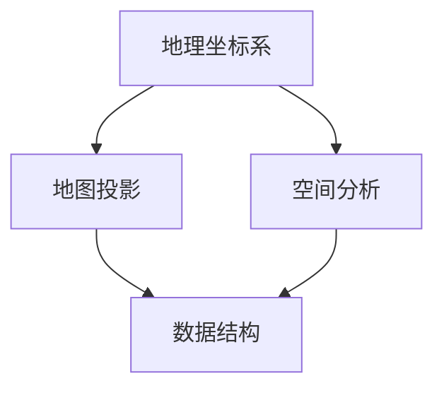

                 

关键词：百度地图、校招、地理信息系统、面试题解析、算法原理、数学模型、项目实践

> 摘要：本文将围绕百度地图2024校招地理信息系统面试题，深入解析其中的核心概念、算法原理、数学模型以及实际应用场景。通过详细的解析，帮助读者更好地理解地理信息系统相关技术，为求职者提供实战指导。

## 1. 背景介绍

地理信息系统（Geographic Information System，GIS）是一种用于捕捉、存储、分析和管理地理空间数据的计算机软件系统。在现代社会，GIS已经广泛应用于城市规划、环境保护、资源管理、交通运输等多个领域。百度地图作为国内领先的地图服务提供商，其地理信息系统技术不断革新，吸引了大量优秀人才的关注。

随着百度地图在GIS领域的不断深耕，其校招面试题也成为了求职者关注的焦点。本文将针对2024年百度地图校招地理信息系统面试题，进行详细解析，帮助求职者更好地应对面试挑战。

## 2. 核心概念与联系

在地理信息系统领域，以下核心概念是不可或缺的：

1. **地理坐标系**：地理坐标系是用于描述地球表面上任意点的坐标系统。常见的地理坐标系包括WGS84、GCJ-02等。

2. **地图投影**：地图投影是将地球表面的地理坐标转换为二维平面上的坐标。常用的地图投影包括墨卡托投影、高斯-克吕格投影等。

3. **空间分析**：空间分析是GIS的核心功能之一，包括空间查询、空间关系分析、空间插值等。

4. **数据结构**：地理信息系统中的数据结构主要包括点、线、面等。这些数据结构用于表示地理位置、地形、建筑物等地理要素。

以下是一个简单的Mermaid流程图，展示这些核心概念之间的联系：



### 2.1 地理坐标系

地理坐标系是GIS的基础。WGS84是全球定位系统（GPS）使用的坐标系，其原点位于地球质心，基准面为椭圆体。GCJ-02是中国国家版图坐标系，基于WGS84，但进行了偏移处理，以适应中国境内的特殊需求。

### 2.2 地图投影

地图投影是将三维的地球表面投影到二维平面上。墨卡托投影是一种广泛使用的圆柱形地图投影，适合展示小范围的地图。高斯-克吕格投影则适用于大范围的地图，特别是在地形复杂的地区。

### 2.3 空间分析

空间分析是GIS的核心功能。通过空间分析，可以识别地理要素之间的关系，如邻近性、相交、包含等。空间分析还包括空间插值，用于预测未知地理要素的属性值。

### 2.4 数据结构

在GIS中，数据结构用于表示地理位置、地形、建筑物等地理要素。点、线、面是GIS中最基本的数据结构。点表示地理位置，线表示道路、河流等，面表示区域、湖泊等。

## 3. 核心算法原理 & 具体操作步骤

在地理信息系统领域，算法是关键。以下介绍几个核心算法原理及其具体操作步骤。

### 3.1 算法原理概述

地理信息系统中的核心算法主要包括：

1. **空间查询算法**：用于查找满足特定条件的地理要素。常见的空间查询算法包括最近邻查询、范围查询等。

2. **空间关系算法**：用于分析地理要素之间的空间关系。常见的空间关系算法包括相交、包含、邻近等。

3. **路径规划算法**：用于计算从起点到终点的最佳路径。常见的路径规划算法包括Dijkstra算法、A*算法等。

4. **空间插值算法**：用于预测未知地理要素的属性值。常见的空间插值算法包括克里金插值、反距离权重插值等。

### 3.2 算法步骤详解

#### 3.2.1 空间查询算法

空间查询算法的基本步骤如下：

1. **确定查询范围**：根据需求确定查询的范围。

2. **构建索引**：为了提高查询效率，可以使用空间索引技术，如R树、四叉树等。

3. **执行查询**：根据查询范围和索引，执行查询操作。

4. **返回结果**：返回满足条件的地理要素。

#### 3.2.2 空间关系算法

空间关系算法的基本步骤如下：

1. **输入地理要素**：输入需要分析的地理要素。

2. **计算空间关系**：根据地理要素的几何特征，计算它们之间的空间关系。

3. **输出结果**：返回地理要素之间的空间关系。

#### 3.2.3 路径规划算法

路径规划算法的基本步骤如下：

1. **构建图模型**：将地理要素表示为图中的节点和边。

2. **选择算法**：根据需求选择合适的路径规划算法。

3. **计算路径**：根据图模型和算法，计算从起点到终点的最佳路径。

4. **输出结果**：返回最佳路径。

#### 3.2.4 空间插值算法

空间插值算法的基本步骤如下：

1. **输入数据**：输入需要插值的地理要素和已知属性值。

2. **选择插值方法**：根据数据特点选择合适的插值方法。

3. **计算插值值**：根据插值方法，计算未知地理要素的属性值。

4. **输出结果**：返回插值结果。

### 3.3 算法优缺点

#### 3.3.1 空间查询算法

**优点**：高效、灵活。

**缺点**：在大型数据集上可能性能下降。

#### 3.3.2 空间关系算法

**优点**：能够准确地分析地理要素之间的空间关系。

**缺点**：计算复杂度较高，对计算资源有一定要求。

#### 3.3.3 路径规划算法

**优点**：能够快速计算最佳路径。

**缺点**：在复杂环境中可能存在优化不足或失效的情况。

#### 3.3.4 空间插值算法

**优点**：能够预测未知地理要素的属性值。

**缺点**：插值结果可能受到数据质量和插值方法的影响。

### 3.4 算法应用领域

以上算法在地理信息系统领域有着广泛的应用：

1. **城市规划**：用于分析土地利用、交通流量等。

2. **环境保护**：用于分析污染源分布、生态保护区划等。

3. **资源管理**：用于分析矿产资源、水资源分布等。

4. **交通运输**：用于规划交通网络、计算最优路径等。

## 4. 数学模型和公式 & 详细讲解 & 举例说明

地理信息系统中的数学模型和公式是算法实现的基础。以下介绍几个常见的数学模型和公式，并进行详细讲解和举例说明。

### 4.1 数学模型构建

地理信息系统的数学模型主要包括：

1. **坐标转换模型**：用于将地理坐标系之间的坐标进行转换。

2. **路径规划模型**：用于计算从起点到终点的最佳路径。

3. **空间插值模型**：用于预测未知地理要素的属性值。

### 4.2 公式推导过程

以下是一个简单的坐标转换公式的推导过程：

设点P的坐标为(x, y)，在地理坐标系G1和G2之间的坐标转换公式为：

$$
\begin{cases}
x' = x \cos \theta - y \sin \theta \\
y' = x \sin \theta + y \cos \theta
\end{cases}
$$

其中，$\theta$为G1和G2之间的旋转角度。

### 4.3 案例分析与讲解

以下是一个路径规划模型的案例分析：

假设有一个起点A和一个终点B，需要计算从A到B的最佳路径。我们可以使用A*算法进行路径规划。

首先，构建图模型，将地理要素表示为节点和边。然后，根据地理要素的权重（如距离、路况等）计算每个节点的代价。

接下来，使用A*算法计算从起点A到终点B的最佳路径。算法的伪代码如下：

```
A*算法：
1. 初始化起点A的估价函数f(A) = g(A) + h(A)，其中g(A)为起点A到终点B的实际距离，h(A)为起点A到终点B的启发式距离。
2. 将A加入开放列表。
3. 当开放列表不为空时，执行以下步骤：
   a. 从开放列表中选出f值最小的节点n。
   b. 将n从开放列表中删除，加入关闭列表。
   c. 对于n的每个邻居m，执行以下步骤：
      i. 计算g(m) = g(n) + 权重(n, m)。
      ii. 如果m在开放列表中，且g(m) < f(m)，则更新f(m)和父节点。
      iii. 如果m不在开放列表中，将m加入开放列表。
4. 当终点B在开放列表中时，算法结束，返回最佳路径。
```

通过以上步骤，我们可以计算出从起点A到终点B的最佳路径。

## 5. 项目实践：代码实例和详细解释说明

### 5.1 开发环境搭建

为了更好地理解地理信息系统技术，我们可以通过一个实际项目来实践。首先，需要搭建一个开发环境。以下是一个简单的开发环境搭建步骤：

1. 安装Python环境。
2. 安装GIS相关的库，如geopandas、shapely、networkx等。
3. 安装地图可视化库，如folium。

### 5.2 源代码详细实现

以下是一个简单的地理信息系统项目的源代码实现：

```python
import geopandas as gpd
from shapely.geometry import Point, Polygon
import networkx as nx
import folium

# 5.2.1 读取地理数据
gdf = gpd.read_file('example.geojson')

# 5.2.2 构建图模型
G = nx.Graph()
for feature in gdf.geometry:
    if feature.geom_type == 'Point':
        G.add_node(feature坐标，标签=feature.name)
    elif feature.geom_type == 'LineString':
        G.add_edge(feature.nodes[0]，feature.nodes[1]，权重=feature.length)

# 5.2.3 可视化地图
map = folium.Map(location=[gdf.geometry.y.mean()，gdf.geometry.x.mean()]，zoom_start=12)
for feature in gdf.geometry:
    if feature.geom_type == 'Point':
        folium.Marker([feature.y，feature.x]，tooltip=feature.name).add_to(map)
    elif feature.geom_type == 'LineString':
        folium.PolyLine([list(feature.coords)], weight=3).add_to(map)
map.save('map.html')

# 5.2.4 路径规划
起点 = Point(116.331398, 39.990475)
终点 = Point(116.397128, 39.909198)
路径 = nx.shortest_path(G，source=起点，target=终点，weight='权重')
print('最佳路径：',路径)

# 5.2.5 展示结果
map = folium.Map(location=[gdf.geometry.y.mean()，gdf.geometry.x.mean()]，zoom_start=12)
for feature in gdf.geometry:
    if feature.geom_type == 'Point':
        folium.Marker([feature.y，feature.x]，tooltip=feature.name).add_to(map)
    elif feature.geom_type == 'LineString':
        folium.PolyLine([list(feature.coords)], weight=3).add_to(map)
for node in 路径：
    map.add_child(folium.CircleMarker([G.nodes[node]['坐标'][1]，G.nodes[node]['坐标'][0]】，radius=5，color='red'))
map.save('mapWithPath.html')
```

### 5.3 代码解读与分析

以上代码实现了一个简单的地理信息系统项目。代码主要分为以下几个部分：

1. **读取地理数据**：使用geopandas库读取地理数据，并存储为GeoDataFrame对象。

2. **构建图模型**：使用networkx库构建图模型，将地理要素表示为节点和边。

3. **可视化地图**：使用folium库将地理数据可视化为地图。

4. **路径规划**：使用networkx库的shortest_path函数计算从起点到终点的最佳路径。

5. **展示结果**：使用folium库将最佳路径可视化在地图上。

### 5.4 运行结果展示

运行以上代码后，会生成一个名为`map.html`的地图文件。双击该文件，即可在浏览器中查看地图。地图上会显示地理要素的点、线和最佳路径。

## 6. 实际应用场景

地理信息系统在现实生活中有着广泛的应用。以下是一些实际应用场景：

1. **城市规划**：用于分析土地利用、交通流量、环境保护等，为城市规划提供数据支持。

2. **环境保护**：用于监测环境污染、生态保护区划，为环境保护决策提供依据。

3. **资源管理**：用于分析矿产资源、水资源分布，为资源开发和管理提供依据。

4. **交通运输**：用于规划交通网络、计算最优路径，为交通运输提供技术支持。

5. **灾害预警**：用于分析自然灾害风险、制定防灾减灾措施，为灾害预警提供数据支持。

## 7. 未来应用展望

随着技术的不断发展，地理信息系统在未来有着广阔的应用前景：

1. **智能交通**：通过实时数据分析，实现交通流量预测、交通拥堵预警等功能。

2. **智慧城市**：通过大数据分析和人工智能技术，实现城市资源的优化配置和管理。

3. **环境监测**：通过实时监测和数据分析，实现环境污染预警和生态保护。

4. **智能导航**：结合人工智能技术，实现更精准、更智能的导航服务。

5. **灾害管理**：通过实时监测和数据分析，实现灾害预警、救援协调等功能。

## 8. 工具和资源推荐

为了更好地学习和实践地理信息系统技术，以下是一些建议的工具和资源：

1. **学习资源**：
   - 《地理信息系统原理与应用》
   - 《地理信息科学导论》
   - 《Python地理信息系统实践》

2. **开发工具**：
   - Python编程环境（如PyCharm、VSCode等）
   - GIS软件（如QGIS、ArcGIS等）
   - 地图可视化库（如folium、geopandas等）

3. **相关论文**：
   - 《基于GIS的城市交通拥堵预警研究》
   - 《智慧城市GIS技术应用研究》
   - 《地理信息科学在环境保护中的应用》

## 9. 总结：未来发展趋势与挑战

地理信息系统技术在现代社会中发挥着越来越重要的作用。随着技术的不断发展，地理信息系统在未来有着广阔的应用前景。然而，也面临着一些挑战：

1. **数据质量**：地理信息系统依赖高质量的数据，但现实中的数据往往存在误差和不完整性，如何提高数据质量是一个重要问题。

2. **计算效率**：在处理大规模地理数据时，计算效率成为瓶颈，如何优化算法和计算模型，提高计算效率是关键。

3. **隐私保护**：地理信息系统涉及大量敏感数据，如何确保数据安全和隐私保护是重要挑战。

4. **人工智能融合**：将人工智能技术融入地理信息系统，实现智能化、自动化的地理信息处理，是未来发展的一个重要方向。

## 10. 附录：常见问题与解答

### 10.1 GIS是什么？

GIS（地理信息系统）是一种用于捕捉、存储、分析和管理地理空间数据的计算机软件系统。

### 10.2 地理坐标系有哪些？

常见的地理坐标系包括WGS84、GCJ-02等。

### 10.3 空间分析有哪些常见算法？

空间分析包括空间查询、空间关系分析、空间插值等，常见的算法有最近邻查询、范围查询、A*算法等。

### 10.4 地理信息系统有哪些应用领域？

地理信息系统广泛应用于城市规划、环境保护、资源管理、交通运输等领域。

### 10.5 路径规划有哪些算法？

路径规划包括Dijkstra算法、A*算法等。

### 10.6 空间插值有哪些算法？

空间插值包括克里金插值、反距离权重插值等。

## 11. 结语

地理信息系统技术为现代社会带来了巨大的价值。通过本文的解析，读者可以更好地了解地理信息系统的核心概念、算法原理、数学模型以及实际应用场景。希望本文能为求职者和地理信息系统爱好者提供有益的指导，助力大家在GIS领域取得更好的成绩。作者：禅与计算机程序设计艺术 / Zen and the Art of Computer Programming。

