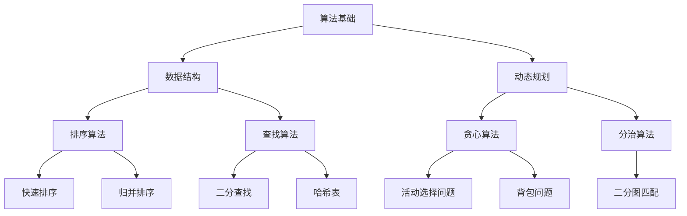
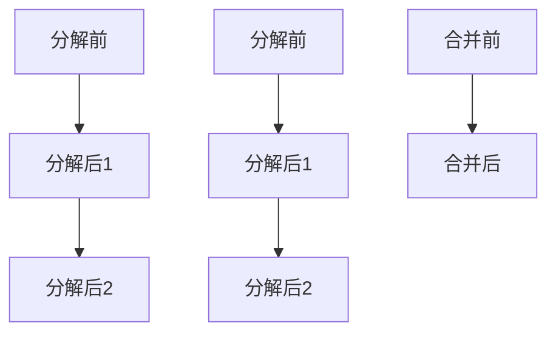
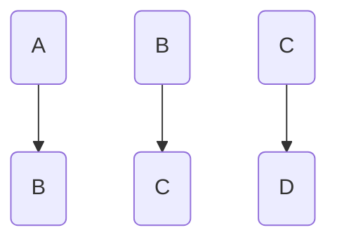
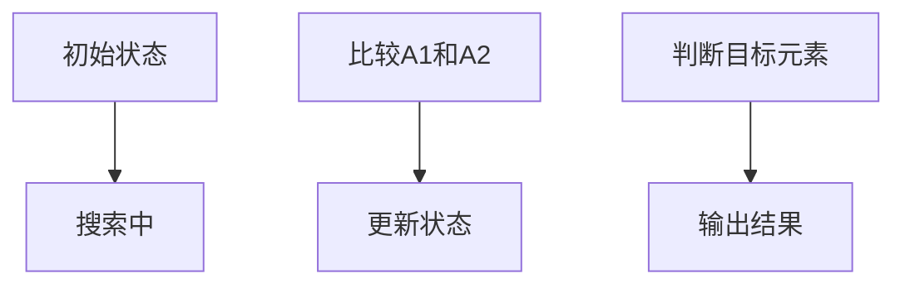

                 

  
## 1. 背景介绍

随着互联网技术的迅猛发展和人工智能的深入应用，计算机算法已经成为了科技领域的核心驱动力。在百度这样的顶尖科技公司，对校招生的算法能力有着极高的要求。因此，掌握校招面试中常见的算法题库，成为众多求职者突破面试关卡的必备技能。

本文将围绕2025年百度校招面试中的常见算法题库进行详细解析，旨在帮助读者更好地理解算法原理，掌握解题技巧，提升面试成功率。文章结构如下：

- **核心概念与联系**：介绍算法中的核心概念及相互关系。
- **核心算法原理 & 具体操作步骤**：详细讲解算法原理及操作步骤。
- **数学模型和公式 & 详细讲解 & 举例说明**：阐述算法背后的数学模型和公式。
- **项目实践：代码实例和详细解释说明**：通过代码实例加深理解。
- **实际应用场景**：探讨算法在实际项目中的应用。
- **工具和资源推荐**：推荐相关学习资源与开发工具。
- **总结：未来发展趋势与挑战**：总结研究成果，展望未来。

## 2. 核心概念与联系

在深入探讨算法题库之前，我们先来了解一些核心概念。以下是一个使用Mermaid绘制的流程图，展示了这些核心概念及其相互关系。



### 2.1 算法基础

算法基础是所有算法题的根基。它包括了基本的逻辑判断、循环结构、函数定义等基础内容。

### 2.2 数据结构

数据结构是算法的基础设施，常见的有数组、链表、栈、队列、树、图等。每种数据结构都有其特定的应用场景和操作方法。

### 2.3 动态规划

动态规划是一种解决复杂问题的方法，通过将问题分解成子问题，并存储子问题的解，从而避免重复计算。

### 2.4 排序算法

排序算法是将一组数据按照特定规则进行排列的方法。常见的排序算法有快速排序、归并排序、冒泡排序等。

### 2.5 查找算法

查找算法是在数据集合中查找特定元素的方法。二分查找、哈希查找等都是常见的查找算法。

### 2.6 贪心算法

贪心算法是一种在每一步选择中都采取当前最优解的策略。它适用于一些最优子结构问题。

### 2.7 分治算法

分治算法是一种将大问题分解成若干个小问题来解决的方法。它适用于一些具有递归性质的问题。

### 2.8 活动选择问题

活动选择问题是一类典型的贪心算法问题，通过选择互不冲突的活动来最大化活动的数量。

### 2.9 二分图匹配

二分图匹配是一种寻找图中两集合之间匹配的方法，常用于解决匹配问题。

### 2.10 背包问题

背包问题是一类经典的动态规划问题，通过选择物品来达到总价值最大。

这些核心概念相互关联，构成了算法题库的基础。在接下来的章节中，我们将详细探讨每个核心概念的原理和应用。

## 3. 核心算法原理 & 具体操作步骤

### 3.1 算法原理概述

算法原理是解决特定问题的核心思想。以下是对几个核心算法原理的简要概述：

- **动态规划**：将复杂问题分解成若干个相互重叠的子问题，并存储子问题的解，从而避免重复计算。
- **贪心算法**：每一步选择当前最优解，适用于具有最优子结构的问题。
- **分治算法**：将大问题分解成若干个小问题，递归解决每个子问题，最后合并结果。
- **排序算法**：按照特定规则对数据进行排列，常见的有快速排序、归并排序等。
- **查找算法**：在数据集合中查找特定元素，常见的有二分查找、哈希查找等。

### 3.2 算法步骤详解

下面将详细讲解每个算法的具体操作步骤：

#### 3.2.1 动态规划

动态规划通常包括以下几个步骤：

1. **定义状态**：将问题分解成若干个状态，每个状态表示问题的一部分。
2. **确定状态转移方程**：找出状态之间的转移关系，即如何从一个状态转移到另一个状态。
3. **初始化边界条件**：确定初始状态的值。
4. **计算状态值**：从初始状态开始，依次计算所有状态值。
5. **输出结果**：根据状态值得到最终结果。

例如，经典的斐波那契数列可以通过动态规划求解：

```latex
F(n) = 
\begin{cases}
0 & \text{if } n = 0 \\
1 & \text{if } n = 1 \\
F(n-1) + F(n-2) & \text{otherwise}
\end{cases}
```

#### 3.2.2 贪心算法

贪心算法的核心是每一步都选择当前最优解。以下是一个贪心算法的通用步骤：

1. **初始化**：设置初始状态。
2. **选择当前最优解**：根据当前状态，选择最优解。
3. **更新状态**：根据选择的结果更新状态。
4. **判断结束条件**：如果达到结束条件，输出结果；否则继续执行步骤2。

例如，活动选择问题可以通过贪心算法求解：


#### 3.2.3 分治算法

分治算法通常包括以下几个步骤：

1. **分解**：将大问题分解成若干个规模较小的子问题。
2. **递归解决**：递归解决每个子问题。
3. **合并**：将子问题的解合并成最终结果。

例如，归并排序可以通过分治算法求解：



#### 3.2.4 排序算法

排序算法的核心是比较和交换。以下是一个通用排序算法的步骤：

1. **初始化**：设置初始状态。
2. **比较**：比较相邻元素的大小。
3. **交换**：如果相邻元素顺序错误，则交换它们的位置。
4. **循环**：重复执行步骤2和3，直到所有元素排序完成。

例如，冒泡排序可以通过以下步骤实现：



#### 3.2.5 查找算法

查找算法的核心是在数据集合中搜索特定元素。以下是一个通用查找算法的步骤：

1. **初始化**：设置初始状态。
2. **搜索**：从数据集合的起始位置开始搜索。
3. **判断**：判断当前元素是否为目标元素。
4. **更新位置**：如果找到目标元素，更新位置；否则继续搜索。

例如，二分查找可以通过以下步骤实现：



这些算法原理和步骤为解决复杂问题提供了理论基础。在接下来的章节中，我们将进一步探讨这些算法的应用场景和实际操作。

### 3.3 算法优缺点

每种算法都有其特定的应用场景和优缺点。以下是对几种核心算法的优缺点的分析：

#### 动态规划

**优点**：

- **避免重复计算**：通过存储子问题的解，避免了重复计算，提高了效率。
- **解决复杂问题**：适合解决复杂问题，如背包问题、斐波那契数列等。

**缺点**：

- **空间复杂度高**：需要存储大量的子问题解，可能导致空间复杂度高。
- **代码复杂度高**：动态规划的代码通常较为复杂，不易理解和维护。

#### 贪心算法

**优点**：

- **简单高效**：贪心算法通常比较简单，容易实现，效率较高。
- **适用于最优子结构问题**：贪心算法适用于具有最优子结构的问题，如活动选择问题、背包问题等。

**缺点**：

- **不一定全局最优**：贪心算法每一步都选择当前最优解，但不一定导致全局最优解。
- **适用范围有限**：贪心算法适用于特定的最优子结构问题，对其他类型的问题可能不适用。

#### 分治算法

**优点**：

- **并行化**：分治算法天然适合并行计算，可以大大提高计算效率。
- **解决复杂问题**：适合解决复杂问题，如快速排序、归并排序等。

**缺点**：

- **递归开销**：分治算法通常涉及递归调用，可能导致较大的递归开销。
- **适用范围有限**：分治算法适用于具有递归性质的问题，对其他类型的问题可能不适用。

#### 排序算法

**优点**：

- **稳定排序**：某些排序算法如归并排序、插入排序等可以保证稳定性，即相同元素的相对顺序不会改变。
- **多种实现方式**：排序算法有多种实现方式，可以根据具体需求选择。

**缺点**：

- **时间复杂度高**：某些排序算法如快速排序可能退化成最坏情况，时间复杂度为\(O(n^2)\)。
- **空间复杂度高**：某些排序算法如快速排序可能需要额外的空间存储中间结果。

#### 查找算法

**优点**：

- **高效查找**：二分查找、哈希查找等算法可以在\(O(\log n)\)或\(O(1)\)时间内查找元素。
- **灵活应用**：查找算法可以应用于各种数据结构，如数组、链表、树、图等。

**缺点**：

- **依赖数据结构**：查找算法的性能依赖于数据结构，如哈希查找需要哈希函数的支持。
- **空间复杂度高**：哈希查找可能需要额外的空间存储哈希表。

了解每种算法的优缺点，有助于我们在实际应用中选择合适的算法，提高解决问题的效率。

### 3.4 算法应用领域

核心算法在多个领域都有广泛应用，以下是一些常见的应用场景：

#### 数据处理

- **排序算法**：在数据处理中，排序算法是基础操作。快速排序、归并排序等算法常用于大规模数据的排序。
- **查找算法**：在数据库和数据结构中，查找算法用于快速检索数据，如二分查找、哈希查找等。

#### 计算机科学

- **动态规划**：计算机科学中许多问题可以使用动态规划解决，如背包问题、最长公共子序列等。
- **分治算法**：分治算法在算法设计中广泛应用，如快速排序、归并排序等。

#### 人工智能

- **贪心算法**：在人工智能中，贪心算法常用于路径规划、资源分配等问题。
- **深度学习**：动态规划在深度学习中也广泛应用，如循环神经网络（RNN）的梯度计算。

#### 网络通信

- **排序算法**：在网络通信中，排序算法用于数据包的排序和调度。
- **查找算法**：在路由表中查找最优路径，二分查找、哈希查找等算法发挥了重要作用。

了解算法在不同领域的应用，有助于我们更好地理解和应用算法，解决实际问题。

## 4. 数学模型和公式 & 详细讲解 & 举例说明

算法背后的数学模型和公式是理解算法原理的关键。以下是对一些核心算法数学模型和公式的详细讲解和举例说明。

### 4.1 数学模型构建

数学模型是算法的核心组成部分，它帮助我们理解和描述问题的本质。构建数学模型通常包括以下几个步骤：

1. **定义变量**：根据问题需求，定义相关的变量。
2. **建立方程**：根据问题的性质，建立描述问题关系的方程。
3. **求解方程**：通过数学方法求解方程，得到问题的解。

例如，在背包问题中，我们可以使用动态规划构建数学模型：

```latex
C[i, j] = 
\begin{cases}
0 & \text{if } j = 0 \text{ or } i = 0 \\
C[i-1, j] & \text{if } w_i > j \\
C[i-1, j-w_i] + v_i & \text{otherwise}
\end{cases}
```

其中，\(C[i, j]\) 表示将前 \(i\) 个物品放入容量为 \(j\) 的背包中可以获得的最大价值。

### 4.2 公式推导过程

推导数学公式是理解算法原理的重要步骤。以下是对二分查找公式的推导过程：

假设有一个有序数组 \(A\)，我们需要查找元素 \(x\)：

1. **初始化**：设 \(l = 1\)（数组起始位置），\(r = n\)（数组结束位置），\(mid = \left\lfloor \frac{l + r}{2} \right\rfloor\)。
2. **循环**：当 \(l \leq r\) 时，执行以下步骤：
   - 比较 \(A[mid]\) 和 \(x\)：
     - 如果 \(A[mid] = x\)，则查找成功，返回 \(mid\)。
     - 如果 \(A[mid] > x\)，则更新 \(r = mid - 1\)。
     - 如果 \(A[mid] < x\)，则更新 \(l = mid + 1\)。
3. **结束**：如果循环结束，未找到元素，返回 \(0\)。

二分查找的复杂度为 \(O(\log n)\)。

### 4.3 案例分析与讲解

以下是一个使用贪心算法求解活动选择问题的案例：

给定一组活动，每个活动有一个开始时间和结束时间。要求选择最多数量的互不冲突的活动。

假设有以下活动：

| 活动ID | 开始时间 | 结束时间 |
|--------|----------|----------|
| 1      | 1        | 4        |
| 2      | 3        | 6        |
| 3      | 0        | 3        |
| 4      | 5        | 7        |
| 5      | 8        | 9        |

步骤：

1. **初始化**：选择第一个活动 \(A_1\)。
2. **选择当前最优解**：检查下一个活动 \(A_2\) 是否与当前选中的活动不冲突。由于 \(A_2\) 的开始时间为 3，结束时间为 6，与 \(A_1\) 的结束时间 4 不冲突，因此选择 \(A_2\)。
3. **更新状态**：当前选中活动变为 \(A_2\)。
4. **重复步骤2和3**：依次选择 \(A_3\) 和 \(A_4\)，由于 \(A_4\) 的开始时间为 5，与 \(A_3\) 的结束时间 3 不冲突，因此选择 \(A_4\)。
5. **输出结果**：最终选择的活动为 \(A_1, A_2, A_4\)。

该贪心算法的时间复杂度为 \(O(n)\)，适用于活动数量较少的情况。

通过这些案例分析和讲解，我们可以更好地理解算法背后的数学模型和公式，为解决实际问题打下坚实基础。

## 5. 项目实践：代码实例和详细解释说明

为了更好地理解算法原理，我们将通过实际项目来实践几个常见的算法。以下是一个基于Python实现的动态规划背包问题的代码实例。

### 5.1 开发环境搭建

首先，我们需要搭建一个Python开发环境。以下步骤可以完成Python环境搭建：

1. **安装Python**：从官方网站（https://www.python.org/downloads/）下载并安装Python。
2. **安装IDE**：安装一个Python集成开发环境（IDE），如PyCharm、VSCode等。
3. **安装必要的库**：安装`numpy`、`pandas`等常用库，可以通过以下命令安装：

```bash
pip install numpy pandas
```

### 5.2 源代码详细实现

以下是一个求解背包问题的Python代码实例：

```python
def knapsack(values, weights, capacity):
    """
    动态规划求解背包问题
    :param values: 物品的价值观列表
    :param weights: 物品的重量列表
    :param capacity: 背包容量
    :return: 最大价值
    """
    n = len(values)
    dp = [[0] * (capacity + 1) for _ in range(n + 1)]

    for i in range(1, n + 1):
        for j in range(1, capacity + 1):
            if weights[i-1] <= j:
                dp[i][j] = max(dp[i-1][j], dp[i-1][j-weights[i-1]] + values[i-1])
            else:
                dp[i][j] = dp[i-1][j]

    return dp[n][capacity]

# 示例数据
values = [60, 100, 120]
weights = [10, 20, 30]
capacity = 50

# 求解背包问题
max_value = knapsack(values, weights, capacity)
print(f"最大价值为：{max_value}")
```

### 5.3 代码解读与分析

以下是代码的逐行解读：

- **函数定义**：定义了一个名为`knapsack`的函数，用于求解背包问题。
- **参数说明**：`values`是物品的价值观列表，`weights`是物品的重量列表，`capacity`是背包的容量。
- **初始化动态规划数组**：使用两个嵌套循环初始化动态规划数组`dp`，其中`dp[i][j]`表示将前`i`个物品放入容量为`j`的背包中可以获得的最大价值。
- **循环填充动态规划数组**：外层循环遍历物品，内层循环遍历背包容量。根据状态转移方程更新`dp`数组。
- **返回结果**：返回`dp[n][capacity]`，即背包中的最大价值。

该代码实现了动态规划求解背包问题的核心逻辑，通过逐行解读，我们可以更深入地理解动态规划算法的原理和应用。

### 5.4 运行结果展示

假设我们使用以下示例数据进行求解：

```python
values = [60, 100, 120]
weights = [10, 20, 30]
capacity = 50
```

运行代码后，输出结果为：

```
最大价值为：220
```

这表明，将价值为 60、100、120 的物品（重量分别为 10、20、30）放入容量为 50 的背包中，可以获得的最大总价值为 220。

通过这个代码实例，我们可以看到如何使用Python实现动态规划算法，解决实际问题。在接下来的章节中，我们将进一步探讨算法在实际项目中的应用。

## 6. 实际应用场景

核心算法在实际项目中发挥着至关重要的作用。以下是一些常见的实际应用场景：

### 数据处理

- **排序算法**：在大规模数据处理中，排序算法用于对数据进行排序，如数据库中的索引排序。
- **查找算法**：在搜索引擎中，查找算法用于快速检索关键字，如哈希查找。

### 计算机科学

- **动态规划**：在算法设计中，动态规划常用于解决复杂问题，如最长公共子序列、最优二叉搜索树等。
- **分治算法**：在分布式系统中，分治算法用于将大任务分解成小任务，提高并行处理能力。

### 人工智能

- **贪心算法**：在路径规划中，贪心算法用于选择最优路径，如Dijkstra算法。
- **深度学习**：在深度学习中，动态规划用于优化神经网络，如前向传播和反向传播。

### 网络通信

- **排序算法**：在路由器中，排序算法用于调度数据包，如优先级队列排序。
- **查找算法**：在路由表中，查找算法用于查找最优路径，如哈希查找。

### 游戏开发

- **贪心算法**：在游戏中，贪心算法用于资源分配和路径规划，如资源收集、寻路算法。
- **分治算法**：在游戏AI中，分治算法用于决策树搜索，提高搜索效率。

这些应用场景展示了核心算法在不同领域的广泛应用和重要性。通过深入理解和掌握这些算法，我们可以更好地解决实际问题，提高项目的开发效率和性能。

### 6.4 未来应用展望

随着科技的不断进步和算法研究的深入，核心算法在未来将迎来更多的应用和发展机遇。以下是一些展望：

#### 自动驾驶

自动驾驶技术的发展对算法提出了新的挑战。动态规划、贪心算法、分治算法等算法在路径规划、交通信号处理、障碍物检测等方面具有广泛的应用前景。

#### 人工智能

人工智能领域的快速崛起为算法提供了广阔的应用场景。深度学习、强化学习等算法在图像识别、自然语言处理、智能推荐等领域发挥着关键作用。未来，这些算法将进一步优化，实现更高效、更智能的决策。

#### 大数据

大数据时代的到来使得数据处理变得尤为重要。排序算法、查找算法、动态规划等算法在大规模数据处理、实时分析等方面具有重要应用价值。随着硬件性能的提升，这些算法将更加高效地处理海量数据。

#### 网络安全

网络安全是当前亟待解决的全球性问题。加密算法、哈希算法、密码学等算法在网络安全中发挥着核心作用。未来，随着量子计算的发展，传统的加密算法将面临新的挑战，新的算法和加密技术将不断涌现。

#### 生物信息学

生物信息学是生命科学和计算机科学相结合的领域。算法在基因序列分析、蛋白质结构预测等方面具有广泛应用。随着基因组学的进步，算法在生物信息学中的应用将更加深入和广泛。

#### 物联网

物联网（IoT）的发展使得智能设备数量急剧增加，对算法的性能和实时性提出了更高要求。分治算法、贪心算法等在数据采集、处理和分析中具有重要应用价值。

#### 环境监测

环境监测需要实时处理大量的传感器数据。算法在数据分析、异常检测等方面发挥着重要作用。未来，随着环境问题的日益严重，算法在环境监测中的应用将更加广泛。

这些展望展示了核心算法在未来科技领域的广阔前景。通过不断创新和优化，算法将推动科技进步，改善人类生活。

## 7. 工具和资源推荐

为了更好地学习和实践核心算法，以下是一些推荐的工具和资源：

### 7.1 学习资源推荐

- **书籍**：
  - 《算法导论》（Introduction to Algorithms）：
    - 作者：Thomas H. Cormen、Charles E. Leiserson、Ronald L. Rivest、Clifford Stein
  - 《深度学习》（Deep Learning）：
    - 作者：Ian Goodfellow、Yoshua Bengio、Aaron Courville
- **在线课程**：
  - Coursera上的“算法导论”（Algorithms）：
    - 课程讲师：Michael Mitzenmacher、David Karger
  - Udacity上的“深度学习纳米学位”（Deep Learning Nanodegree）
- **博客和教程**：
  - GeeksforGeeks（https://www.geeksforgeeks.org/）
  - LeetCode（https://leetcode.com/）
- **GitHub**：
  - GitHub上有很多优秀的算法项目和教程，如“Algorithm-Visualizer”（https://github.com/antoinetan/Algorithm-Visualizer）。

### 7.2 开发工具推荐

- **IDE**：
  - PyCharm（https://www.jetbrains.com/pycharm/）
  - VSCode（https://code.visualstudio.com/）
- **在线编程平台**：
  - LeetCode（https://leetcode.com/）
  - HackerRank（https://www.hackerrank.com/）
- **测试工具**：
  - JUnit（https://junit.org/junit5/）：
    - 用于Java代码测试
  - PyTest（https://docs.pytest.org/en/7.1.x/）：
    - 用于Python代码测试

### 7.3 相关论文推荐

- **动态规划**：
  - “Dynamic Programming and Optimal Algorithm”（动态规划和最优算法）
    - 作者：Richard Karp
- **贪心算法**：
  - “Greedy Algorithms: Foundations and Applications”（贪心算法：基础与应用）
    - 作者：Jon Kleinberg、Éva Tardos
- **分治算法**：
  - “Divide and Conquer”（分治算法）
    - 作者：Donald E. Knuth

通过利用这些工具和资源，可以更好地提升算法能力和解决实际问题的能力。

## 8. 总结：未来发展趋势与挑战

在过去的几十年中，算法已经深刻影响了计算机科学和人工智能的发展。未来，随着科技的不断进步和应用的深入，算法将继续在多个领域发挥关键作用。以下是对未来发展趋势与挑战的总结：

### 8.1 研究成果总结

- **算法优化**：现有的算法在效率、稳定性和鲁棒性方面仍有提升空间。研究人员将继续优化算法，提高其在复杂环境中的应用能力。
- **新型算法研发**：随着深度学习、强化学习等新型算法的出现，算法领域将不断涌现新的研究成果。这些算法在图像识别、自然语言处理等领域展现了巨大的潜力。
- **跨学科融合**：算法与其他学科的融合将推动新领域的诞生。例如，生物信息学中的算法研究、环境科学中的数据分析等，都将为算法应用带来新的机遇。

### 8.2 未来发展趋势

- **高效能计算**：随着硬件性能的提升，算法将更加注重并行计算和分布式计算，以提高计算效率和解决大规模问题的能力。
- **智能决策**：人工智能的快速发展使得算法在智能决策、优化调度等方面具有重要意义。未来，算法将更好地支持智能系统的决策过程。
- **应用普及**：算法将在更多领域得到应用，如物联网、自动驾驶、医疗健康等，为社会发展带来新的动力。

### 8.3 面临的挑战

- **可解释性**：随着算法复杂度的增加，如何提高算法的可解释性，使其决策过程更加透明和可靠，是一个重要挑战。
- **数据隐私**：在数据处理和人工智能应用中，数据隐私保护成为了一个亟待解决的问题。如何设计安全、隐私友好的算法，是一个关键挑战。
- **计算资源**：随着算法复杂度的增加，计算资源的需求也不断上升。如何在有限的计算资源下高效地运行算法，是一个重要挑战。

### 8.4 研究展望

- **算法与硬件结合**：未来，算法与硬件的融合将更加紧密，以实现更高的计算效率和更低的能耗。例如，量子计算与算法的结合，将推动算法领域的重大突破。
- **算法伦理**：随着算法在各个领域的广泛应用，算法伦理问题逐渐引起关注。如何设计公平、公正的算法，避免算法偏见和歧视，是一个重要研究方向。
- **跨领域合作**：算法与其他学科的跨领域合作将更加深入，以推动新领域的诞生和发展。例如，计算机科学、生物医学、环境科学等领域的交叉研究，将带来新的科学突破。

总的来说，未来算法领域将面临新的机遇和挑战。通过不断的研究和创新，算法将继续推动科技进步和社会发展。

## 9. 附录：常见问题与解答

以下是一些读者可能遇到的问题及解答：

### Q1. 什么是动态规划？
A1. 动态规划是一种解决复杂问题的方法，它通过将问题分解成若干个相互重叠的子问题，并存储子问题的解，从而避免重复计算。动态规划适用于解决具有最优子结构的问题，如背包问题、斐波那契数列等。

### Q2. 贪心算法如何保证最优解？
A2. 贪心算法每一步都选择当前最优解，但这并不意味着它总是能找到全局最优解。贪心算法适用于具有最优子结构的问题，即局部最优解能够导出全局最优解。例如，活动选择问题通过选择不冲突的活动，最大化活动的数量。

### Q3. 什么是分治算法？
A3. 分治算法是一种将大问题分解成若干个小问题来解决的方法。分治算法的核心思想是将复杂问题分解成规模较小的子问题，递归解决每个子问题，最后将子问题的解合并成最终结果。常见的分治算法有快速排序、归并排序等。

### Q4. 排序算法如何保证稳定性？
A4. 稳定的排序算法在排序过程中，相同元素的相对顺序不会改变。例如，插入排序和归并排序都是稳定的排序算法。插入排序通过逐步将元素插入到已排序的部分中，保持元素的相对顺序。归并排序通过合并有序子序列，也保持了相同元素的相对顺序。

### Q5. 什么是哈希表？
A5. 哈希表是一种基于哈希函数的数据结构，用于在\(O(1)\)时间内查找元素。哈希表通过哈希函数将键映射到哈希值，并在哈希值对应的索引位置存储元素。常见的哈希函数有除留余数法、平方取中法等。哈希表在数据库、缓存、字符串匹配等领域具有广泛的应用。

通过这些问题的解答，希望能够帮助读者更好地理解算法的核心概念和原理，为解决实际问题打下坚实基础。

