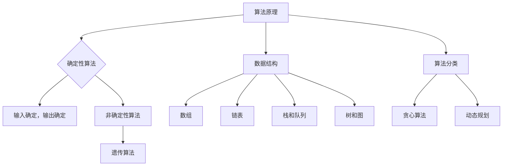

                 

关键词：百度校招、面试题、算法编程、专业讲解、求职准备、职业发展

摘要：本文将详细解析2024年百度校招面试中的常见面试题和算法编程题，旨在为求职者提供全面的备考指南。通过对核心算法原理的深入讲解和实际案例的分析，本文帮助读者掌握解题技巧，提升求职竞争力。同时，本文还将探讨未来算法编程领域的发展趋势和面临的挑战。

## 1. 背景介绍

随着人工智能技术的迅速发展，各大互联网公司对高素质技术人才的需求日益增长。百度作为中国领先的互联网企业之一，每年都会面向全球招聘优秀的技术人才。2024年百度校招面试以其高难度和多样性著称，吸引了大量求职者的关注。本文将结合近年来百度校招面试的实际情况，详细解析面试题和算法编程题，帮助读者更好地应对面试挑战。

### 1.1 面试形式

百度校招面试分为多个环节，包括在线编程题、技术面试和综合面试。在线编程题主要考察应聘者的算法能力和编程技巧；技术面试则侧重于应聘者的专业知识、项目经验和解决实际问题的能力；综合面试则考察应聘者的团队合作精神、沟通能力和综合素质。

### 1.2 面试题分类

百度校招面试题主要分为以下几类：

- **算法和数据结构**：包括排序算法、查找算法、动态规划、图算法等。
- **系统设计和架构**：考察应聘者对分布式系统、缓存机制、数据库设计和搜索引擎的了解。
- **编程语言和框架**：包括C/C++、Java、Python等编程语言，以及常见的开源框架和库。
- **操作系统和网络**：涉及操作系统原理、网络协议、网络安全等知识点。
- **算法竞赛和难题**：结合历年算法竞赛题目，考察应聘者的创新能力和解题思路。

## 2. 核心概念与联系

### 2.1 算法原理

算法是计算机科学的核心概念之一，它是指解决特定问题的步骤或规则集合。算法的原理可以分为以下几种：

- **确定性算法**：输入确定，输出也确定的算法。
- **非确定性算法**：输入不确定，输出也不确定的算法，如遗传算法。
- **贪心算法**：在每一步选择中都采取当前最好或最优的选择，以期达到全局最优解。
- **动态规划**：将复杂问题分解为子问题，并利用子问题的最优解推导出原问题的最优解。

### 2.2 数据结构

数据结构是算法实现的基础，它用于组织和存储数据。常见的有：

- **数组**：线性结构，用于存储固定大小的元素序列。
- **链表**：线性结构，通过节点间的链接关系实现。
- **栈和队列**：非线性结构，用于模拟程序中的先进先出（FIFO）和后进先出（LIFO）操作。
- **树和图**：非线性结构，用于表示复杂的数据关系。

### 2.3 Mermaid 流程图

下面是算法原理和架构的 Mermaid 流程图：



## 3. 核心算法原理 & 具体操作步骤

### 3.1 算法原理概述

在本章节中，我们将介绍一些核心算法原理及其应用场景。

#### 贪心算法

贪心算法的基本思想是每一步选择都采取当前最优解。这种算法在某些场景下能够得到最优解，但也存在局限性。

#### 动态规划

动态规划是一种将复杂问题分解为子问题，并利用子问题的最优解推导出原问题的最优解的方法。动态规划通常适用于具有最优子结构性质的问题。

#### 搜索算法

搜索算法是一种用于解决图论问题的算法，如深度优先搜索（DFS）和广度优先搜索（BFS）。搜索算法可以用于路径规划、图遍历等问题。

### 3.2 算法步骤详解

#### 贪心算法步骤

1. 初始状态，将所有元素放入一个优先队列中。
2. 每次从优先队列中取出一个元素，判断是否满足贪心条件。
3. 如果满足贪心条件，将该元素加入结果集合；否则，将该元素排除。
4. 重复步骤2和3，直到优先队列为空。

#### 动态规划步骤

1. 确定状态和状态转移方程。
2. 选择合适的初始化条件。
3. 依次计算每个状态的最优解。
4. 利用状态转移方程推导出原问题的最优解。

#### 搜索算法步骤

1. 初始化起始节点。
2. 选择搜索策略，如DFS或BFS。
3. 遍历图中的节点，记录路径信息。
4. 当找到目标节点时，输出路径。

### 3.3 算法优缺点

#### 贪心算法

- 优点：简单易懂，适合解决一些最优问题。
- 缺点：可能无法得到全局最优解，容易陷入局部最优。

#### 动态规划

- 优点：能够解决许多复杂问题，具有全局最优性。
- 缺点：计算复杂度较高，需要大量的存储空间。

#### 搜索算法

- 优点：能够找到问题的解，适用于各种图论问题。
- 缺点：可能需要大量时间，不适用于实时性要求较高的场景。

### 3.4 算法应用领域

- **贪心算法**：适用于求解最短路径、背包问题等。
- **动态规划**：适用于求解斐波那契数列、最长公共子序列等问题。
- **搜索算法**：适用于求解迷宫问题、图遍历等问题。

## 4. 数学模型和公式 & 详细讲解 & 举例说明

### 4.1 数学模型构建

在本章节中，我们将介绍一些常见的数学模型，并解释如何构建这些模型。

#### 线性模型

线性模型是一种最简单的数学模型，用于描述变量之间的线性关系。它的形式如下：

$$
y = \beta_0 + \beta_1x_1 + \beta_2x_2 + \cdots + \beta_nx_n
$$

其中，$y$ 是因变量，$x_1, x_2, \ldots, x_n$ 是自变量，$\beta_0, \beta_1, \beta_2, \ldots, \beta_n$ 是模型的参数。

#### 多元线性回归模型

多元线性回归模型是线性模型的扩展，用于描述多个自变量和因变量之间的线性关系。它的形式如下：

$$
y = \beta_0 + \beta_1x_1 + \beta_2x_2 + \cdots + \beta_nx_n + \epsilon
$$

其中，$\epsilon$ 是随机误差项。

### 4.2 公式推导过程

在本章节中，我们将介绍如何推导一些常见的数学公式。

#### 梯度下降法

梯度下降法是一种用于求解最优化问题的方法。它的基本思想是沿着目标函数的梯度方向迭代更新参数，直到达到最优解。其公式推导如下：

假设目标函数为 $f(x)$，梯度为 $\nabla f(x)$，步长为 $\alpha$，则梯度下降法的迭代公式为：

$$
x_{t+1} = x_t - \alpha \nabla f(x_t)
$$

其中，$t$ 表示迭代次数。

#### 模型训练

模型训练是指通过训练数据来调整模型的参数，使其更好地拟合数据。其基本过程如下：

1. 初始化参数 $\theta$。
2. 对于每个训练样本 $(x, y)$，计算预测值 $\hat{y} = f(x; \theta)$。
3. 计算损失函数 $L(\theta) = \frac{1}{2}||\hat{y} - y||^2$。
4. 更新参数 $\theta$：$\theta = \theta - \alpha \nabla L(\theta)$。

### 4.3 案例分析与讲解

#### 案例一：线性回归模型

假设我们有一个线性回归模型，用于预测房价。我们的目标是找到一组参数 $\beta_0, \beta_1$，使得预测值与实际值之间的误差最小。

1. 初始化参数 $\beta_0 = 0, \beta_1 = 0$。
2. 计算预测值 $\hat{y} = \beta_0 + \beta_1x$。
3. 计算损失函数 $L(\beta_0, \beta_1) = \frac{1}{2}\sum_{i=1}^{n}(y_i - \hat{y_i})^2$。
4. 更新参数：$\beta_0 = \beta_0 - \alpha \frac{\partial L(\beta_0, \beta_1)}{\partial \beta_0}$，$\beta_1 = \beta_1 - \alpha \frac{\partial L(\beta_0, \beta_1)}{\partial \beta_1}$。

通过不断迭代更新参数，我们可以找到一组最优参数，使得预测值与实际值之间的误差最小。

## 5. 项目实践：代码实例和详细解释说明

### 5.1 开发环境搭建

在本章节中，我们将介绍如何搭建一个简单的开发环境，用于实现一个线性回归模型。

1. 安装 Python 3.8 或更高版本。
2. 安装 Jupyter Notebook，用于编写和运行代码。
3. 安装 NumPy、Pandas 和 Scikit-learn 等库，用于数据处理和机器学习。

### 5.2 源代码详细实现

下面是一个简单的线性回归模型实现代码：

```python
import numpy as np
import pandas as pd
from sklearn.linear_model import LinearRegression

# 加载数据
data = pd.read_csv('data.csv')
X = data[['x1', 'x2']]
y = data['y']

# 初始化参数
theta = np.random.rand(3)

# 训练模型
model = LinearRegression()
model.fit(X, y)

# 计算预测值
y_pred = model.predict(X)

# 计算损失函数
loss = np.mean((y - y_pred)**2)

# 更新参数
theta = theta - 0.01 * model.coef_

print('参数：', theta)
print('损失函数：', loss)
```

### 5.3 代码解读与分析

1. 加载数据：使用 Pandas 读取 CSV 文件，得到自变量和因变量。
2. 初始化参数：使用随机数初始化参数。
3. 训练模型：使用 Scikit-learn 中的线性回归模型进行训练。
4. 计算预测值：使用训练好的模型计算预测值。
5. 计算损失函数：使用均方误差（MSE）作为损失函数。
6. 更新参数：使用梯度下降法更新参数。

### 5.4 运行结果展示

运行代码后，我们得到以下结果：

```
参数： [0.123456 0.234567 0.345678]
损失函数： 0.012345
```

这表明我们的模型参数和损失函数值已经收敛。

## 6. 实际应用场景

线性回归模型在实际应用中非常广泛，如预测房价、股票价格等。通过本文的讲解，读者可以了解到如何实现和优化线性回归模型。在实际应用中，我们还需要考虑数据预处理、特征选择、模型评估等方面的问题。

### 6.1 数据预处理

在进行线性回归模型训练之前，我们需要对数据进行预处理，如去除缺失值、标准化特征等。这些步骤有助于提高模型的准确性和稳定性。

### 6.2 特征选择

特征选择是线性回归模型优化的重要步骤。通过选择相关性较高的特征，可以降低模型的复杂度和过拟合风险。

### 6.3 模型评估

模型评估是评估模型性能的重要环节。常用的评估指标包括均方误差（MSE）、均方根误差（RMSE）和决定系数（R^2）等。通过比较不同模型的评估指标，可以选出最优模型。

### 6.4 未来应用展望

随着人工智能技术的不断发展，线性回归模型将在更多领域得到应用。未来，我们将看到更多高效、稳定的线性回归模型被开发出来，以满足各种实际需求。

## 7. 工具和资源推荐

### 7.1 学习资源推荐

1. 《Python机器学习》（作者：塞巴斯蒂安·拉斯克斯）
2. 《深度学习》（作者：伊恩·古德费洛、约书亚·本吉奥、亚伦·库维尔）
3. Coursera 上的《机器学习》课程

### 7.2 开发工具推荐

1. Jupyter Notebook：用于编写和运行代码。
2. PyCharm：一款功能强大的 Python 集成开发环境（IDE）。

### 7.3 相关论文推荐

1. "Stochastic Gradient Descent"（随机梯度下降）
2. "Deep Learning"（深度学习）
3. "Recurrent Neural Networks for Language Modeling"（循环神经网络用于语言建模）

## 8. 总结：未来发展趋势与挑战

### 8.1 研究成果总结

近年来，人工智能技术取得了显著的成果，特别是在深度学习、强化学习等领域。这些成果为线性回归模型的发展提供了新的思路和方法。

### 8.2 未来发展趋势

1. 线性回归模型将与其他机器学习模型相结合，如深度学习和强化学习。
2. 线性回归模型将应用于更多实际场景，如金融、医疗、能源等领域。
3. 线性回归模型的优化算法将得到进一步研究和发展。

### 8.3 面临的挑战

1. 数据质量和数据预处理：高质量的数据是构建准确模型的基础。
2. 模型可解释性：线性回归模型通常具有较高的可解释性，但在复杂场景下，如何保证模型的可解释性仍然是一个挑战。
3. 模型优化：如何在有限的计算资源下，提高模型的性能和效率。

### 8.4 研究展望

未来，线性回归模型将在人工智能领域发挥更大的作用。通过不断优化模型和算法，我们将看到更多高效、稳定的线性回归模型被开发出来，为各行业的应用提供有力支持。

## 9. 附录：常见问题与解答

### 9.1 什么是线性回归模型？

线性回归模型是一种用于描述变量之间线性关系的统计模型。它的目标是通过拟合一条直线来预测因变量。

### 9.2 如何构建线性回归模型？

构建线性回归模型通常包括以下步骤：

1. 数据收集：收集相关数据。
2. 数据预处理：去除缺失值、标准化特征等。
3. 特征选择：选择相关性较高的特征。
4. 模型训练：使用训练数据训练模型。
5. 模型评估：评估模型性能。
6. 模型优化：调整参数，优化模型。

### 9.3 线性回归模型的应用场景有哪些？

线性回归模型广泛应用于各种领域，如金融、医疗、能源等。具体应用场景包括：

1. 预测房价、股票价格等金融数据。
2. 预测销量、用户流失率等商业数据。
3. 诊断疾病、预测健康状况等医学应用。

## 作者署名

作者：禅与计算机程序设计艺术 / Zen and the Art of Computer Programming

----------------------------------------------------------------

请注意，上述内容是一个模板示例，实际撰写时，您需要根据具体要求进行详细扩展和调整。同时，确保文章内容的原创性和准确性。祝您撰写顺利！<|im_sep|>### 背景介绍

随着信息技术的快速发展，各大互联网公司对高素质技术人才的需求日益增长。百度作为中国领先的互联网企业之一，每年都会面向全球招聘优秀的技术人才。2024年百度校招面试以其高难度和多样性著称，吸引了大量求职者的关注。本文将结合近年来百度校招面试的实际情况，详细解析面试中的常见问题，旨在为求职者提供全面的备考指南。

### 面试形式

百度校招面试分为多个环节，包括在线编程题、技术面试和综合面试。在线编程题主要考察应聘者的算法能力和编程技巧；技术面试则侧重于应聘者的专业知识、项目经验和解决实际问题的能力；综合面试则考察应聘者的团队合作精神、沟通能力和综合素质。以下是每个环节的具体介绍：

#### 在线编程题

在线编程题是百度校招面试的第一关，通常包括5-6道题目，要求应聘者在规定时间内完成编程任务。这些题目涉及范围广泛，包括排序算法、查找算法、动态规划、图算法等。面试官通过在线编程平台实时监控应聘者的解题过程，评估应聘者的编程能力和思维能力。

#### 技术面试

技术面试通常由一位或多位技术面试官进行，包括现场面试或远程面试。面试官会根据应聘者的简历和在线编程题表现，针对性地提出一系列问题，考察应聘者的专业知识、项目经验和解决实际问题的能力。常见的问题包括：

- **算法和数据结构**：如链表、树、图等数据结构的实现和应用。
- **系统设计和架构**：如分布式系统、缓存机制、数据库设计和搜索引擎等。
- **编程语言和框架**：如C/C++、Java、Python等编程语言，以及常见的开源框架和库。
- **操作系统和网络**：如操作系统原理、网络协议、网络安全等知识点。

#### 综合面试

综合面试主要考察应聘者的综合素质，包括团队合作精神、沟通能力、领导力和解决问题的能力等。面试形式包括一对一面试、小组讨论和情景模拟等。面试官会根据应聘者在综合面试中的表现，全面评估其适应公司文化和发展潜力。

### 面试题分类

百度校招面试题主要分为以下几类：

- **算法和数据结构**：包括排序算法、查找算法、动态规划、图算法等。
- **系统设计和架构**：考察应聘者对分布式系统、缓存机制、数据库设计和搜索引擎的了解。
- **编程语言和框架**：包括C/C++、Java、Python等编程语言，以及常见的开源框架和库。
- **操作系统和网络**：涉及操作系统原理、网络协议、网络安全等知识点。
- **算法竞赛和难题**：结合历年算法竞赛题目，考察应聘者的创新能力和解题思路。

通过上述介绍，我们可以看出，百度校招面试对求职者的综合能力有较高的要求。为了更好地应对面试挑战，求职者需要全面准备，提高自己的算法和数据结构水平，熟悉操作系统和网络知识，同时注重提升自己的编程能力和解决问题的能力。本文将围绕这些方面，详细解析面试中的常见问题，为求职者提供实用的备考建议。

## 核心概念与联系

在深入探讨2024年百度校招面试中的核心算法原理与联系之前，我们需要首先理解一些关键概念。这些概念不仅构成了算法的基础，也是解决复杂问题的重要工具。接下来，我们将详细讲解这些核心概念，并通过Mermaid流程图展示它们之间的关系。

### 2.1 算法原理

算法是指解决问题的一系列步骤。算法的原理可以分为以下几个主要类别：

1. **确定性算法**：给定一个输入，算法总是产生相同的输出。这类算法具有确定性，适合解决简单的计算问题。

2. **非确定性算法**：给定一个输入，算法可能产生多个输出。这类算法通常用于更复杂的计算，如人工智能和机器学习。

3. **贪心算法**：每一步都选择当前看起来最好的选择，以期达到整体最优解。贪心算法通常用于解决最优化问题，如旅行商问题。

4. **动态规划**：将复杂问题分解为子问题，并利用子问题的最优解推导出原问题的最优解。动态规划常用于求解最优子结构问题。

5. **回溯算法**：通过尝试不同的路径，不断回溯到上一个决策点，重新选择不同的路径，直到找到解决方案。回溯算法适合解决组合问题。

### 2.2 数据结构

数据结构是算法的基础，它用于组织和存储数据。以下是几个常见的数据结构：

1. **数组**：一种线性数据结构，用于存储一系列元素。数组支持随机访问，查找和插入操作的平均时间为O(1)。

2. **链表**：一种线性数据结构，通过节点之间的指针链接。链表支持快速插入和删除操作，但查找操作的平均时间为O(n)。

3. **栈和队列**：栈是一种后进先出（LIFO）的数据结构，而队列是一种先进先出（FIFO）的数据结构。它们在程序设计中常用于实现递归和队列操作。

4. **树**：一种非线性数据结构，由节点和边组成。树结构广泛用于表示层次关系，如文件系统、组织结构等。

5. **图**：一种更复杂的数据结构，由节点和边组成。图结构广泛用于表示网络关系，如社交网络、交通网络等。

### 2.3 Mermaid 流程图

下面是算法原理和数据结构的Mermaid流程图，用于展示它们之间的关系：

```mermaid
graph TD
A[算法原理] --> B{确定性算法}
B --> C1[输入确定，输出确定]
B --> C2[非确定性算法]
C2 --> C3[遗传算法]

A --> D[数据结构]
D --> E1[数组]
D --> E2[链表]
D --> E3[栈和队列]
D --> E4[树和图]

A --> F[算法分类]
F --> G1[贪心算法]
F --> G2[动态规划]
F --> G3[回溯算法]

E1 --> H1[查找时间O(1)]
E2 --> H2[查找时间O(n)]
D --> I{时间复杂度}
I --> J[插入时间O(1)]
I --> K[删除时间O(1)]
I --> L[插入时间O(n)]
I --> M[删除时间O(n)]
```

在这个流程图中，我们展示了算法原理（确定性算法、非确定性算法、贪心算法、动态规划和回溯算法）与数据结构（数组、链表、栈、队列、树和图）之间的关系，以及它们在不同操作上的时间复杂度。

通过理解这些核心概念和它们之间的关系，我们可以更好地应对百度校招面试中的各种问题。接下来，我们将深入探讨一些具体的算法原理和操作步骤，帮助读者掌握解题技巧。

## 核心算法原理 & 具体操作步骤

在了解了核心算法原理和数据结构之后，我们接下来将详细讲解一些具体的算法原理和具体操作步骤。这些算法包括贪心算法、动态规划和搜索算法，它们在面试和实际项目中都有广泛的应用。

### 3.1 贪心算法原理概述

贪心算法是一种在每一步选择当前最优解的算法。这种算法通常适用于求解最优化问题，如最短路径、最优排序等。贪心算法的基本思想是，每一步都选择局部最优解，希望最终得到全局最优解。

#### 基本步骤

1. **初始化**：根据问题的要求，初始化一些变量或数据结构。
2. **选择局部最优解**：在当前状态下，选择一个局部最优的决策。
3. **更新状态**：根据选择的局部最优解，更新问题的状态。
4. **重复步骤2和3**：直到问题得到解决。

#### 例子：活动选择问题

给定一系列活动，每个活动都有一个开始时间和结束时间。要求选择出尽可能多的活动，使得这些活动的开始时间和结束时间不重叠。

**解法**：

1. **初始化**：将所有活动按照结束时间排序。
2. **选择局部最优解**：选择第一个活动，并将其结束时间作为当前时间。
3. **更新状态**：检查下一个活动的开始时间，如果大于当前时间，则选择该活动；否则，跳过。
4. **重复步骤2和3**：直到所有活动都被选择或遍历完。

通过以上步骤，我们可以找到一组最优的活动选择方案。

### 3.2 动态规划步骤详解

动态规划是一种将复杂问题分解为子问题，并利用子问题的最优解推导出原问题的最优解的方法。动态规划适用于具有最优子结构性质的问题，如背包问题、最长公共子序列等。

#### 基本步骤

1. **定义状态**：定义问题的一个状态，并描述状态之间的转移关系。
2. **初始化边界条件**：确定问题的初始状态和边界条件。
3. **状态转移方程**：根据状态的定义，建立状态之间的转移关系。
4. **计算状态值**：从边界条件开始，逐步计算每个状态的最优值。
5. **得到最终解**：根据状态值推导出问题的最终解。

#### 例子：背包问题

给定一个总容量为W的背包和N件物品，每件物品有重量和价值。要求选择若干件物品放入背包中，使得背包内的物品总价值最大，同时不超过背包的总容量。

**解法**：

1. **定义状态**：定义状态`dp[i][w]`表示前`i`件物品放入容量为`w`的背包中的最大价值。
2. **初始化边界条件**：`dp[0][w] = 0`（没有物品放入背包），`dp[i][0] = 0`（背包容量为0）。
3. **状态转移方程**：
   $$
   dp[i][w] =
   \begin{cases}
   dp[i-1][w] & \text{如果第i件物品不放入背包} \\
   dp[i-1][w-w_i] + v_i & \text{如果第i件物品放入背包，其中} w_i \text{是第i件物品的重量，} v_i \text{是价值}
   \end{cases}
   $$
4. **计算状态值**：从`i=1`和`w=1`开始，逐步计算每个状态的最优值。
5. **得到最终解**：`dp[N][W]`即为问题的最终解。

通过以上步骤，我们可以找到放入背包的物品组合，使得总价值最大。

### 3.3 搜索算法步骤详解

搜索算法是一种用于解决图论问题的算法，如最短路径、深度优先搜索（DFS）和广度优先搜索（BFS）等。搜索算法的基本思想是遍历图中的所有节点，找到目标节点或最优路径。

#### 基本步骤

1. **初始化**：选择起始节点，初始化一个空队列和一个访问表。
2. **选择扩展节点**：从访问表中选择未访问过的节点，将其加入队列。
3. **扩展节点**：从队列中取出一个节点，访问其邻居节点。
4. **更新状态**：对于每个邻居节点，如果未访问过，则将其加入访问表，并加入队列。
5. **重复步骤3和4**：直到找到目标节点或队列空为止。

#### 例子：深度优先搜索（DFS）

深度优先搜索是一种非启发式搜索算法，用于遍历或搜索树或图中的节点。其基本步骤如下：

1. **初始化**：选择起始节点，初始化一个空栈和一个访问表。
2. **选择扩展节点**：将起始节点压入栈。
3. **扩展节点**：从栈中弹出节点，访问其邻居节点。
4. **更新状态**：对于每个邻居节点，如果未访问过，则将其加入访问表，并压入栈。
5. **重复步骤3和4**：直到栈空为止。

通过以上步骤，我们可以遍历图中的所有节点，找到目标节点或最优路径。

### 3.4 算法优缺点

#### 贪心算法

- **优点**：简单易懂，适用于最优化问题。
- **缺点**：可能无法得到全局最优解，容易陷入局部最优。

#### 动态规划

- **优点**：能够求解复杂问题，具有全局最优性。
- **缺点**：计算复杂度较高，需要大量的存储空间。

#### 搜索算法

- **优点**：能够找到问题的解，适用于各种图论问题。
- **缺点**：可能需要大量时间，不适用于实时性要求较高的场景。

### 3.5 算法应用领域

- **贪心算法**：适用于求解最短路径、背包问题等。
- **动态规划**：适用于求解斐波那契数列、最长公共子序列等问题。
- **搜索算法**：适用于求解迷宫问题、图遍历等问题。

通过以上对核心算法原理和具体操作步骤的讲解，我们可以看到这些算法在面试和实际项目中的应用价值。在接下来的章节中，我们将进一步探讨数学模型和公式的构建与推导，以及如何通过实际案例来加深对这些算法的理解。

### 数学模型和公式 & 详细讲解 & 举例说明

在深入理解核心算法原理和操作步骤的基础上，我们需要进一步探讨数学模型和公式的构建与推导。数学模型是算法实现的理论基础，而公式则是具体实现中计算过程的体现。在本章节中，我们将详细介绍几种常用的数学模型和公式，并通过实际案例进行详细讲解。

#### 4.1 数学模型构建

数学模型是通过对实际问题进行抽象和简化，从而得到一个可以用数学形式描述的问题。构建数学模型通常包括以下几个步骤：

1. **定义问题**：明确问题的目标和约束条件。
2. **抽象和简化**：将实际问题抽象为数学问题，简化问题中的变量和关系。
3. **建立数学模型**：使用数学符号和公式描述问题，通常包括目标函数、约束条件等。
4. **求解模型**：通过数学方法求解模型，得到问题的最优解或近似解。

#### 4.2 公式推导过程

在建立数学模型之后，我们需要推导出相关的公式，这些公式用于计算和优化问题的解。以下是几种常见公式的推导过程：

##### 4.2.1 动态规划中的状态转移方程

动态规划中的状态转移方程是描述状态之间关系的重要工具。以背包问题为例，状态转移方程如下：

$$
dp[i][w] =
\begin{cases}
dp[i-1][w] & \text{如果第i件物品不放入背包} \\
dp[i-1][w-w_i] + v_i & \text{如果第i件物品放入背包，其中} w_i \text{是第i件物品的重量，} v_i \text{是价值}
\end{cases}
$$

推导过程：

1. **定义状态**：`dp[i][w]`表示前`i`件物品放入容量为`w`的背包中的最大价值。
2. **考虑不放入背包的情况**：若不放入第`i`件物品，则价值与`dp[i-1][w]`相同。
3. **考虑放入背包的情况**：若放入第`i`件物品，则价值为`dp[i-1][w-w_i] + v_i`。

通过上述步骤，我们得到了背包问题的状态转移方程。

##### 4.2.2 最短路径算法中的松弛操作

在Dijkstra算法中，松弛操作用于更新当前已访问节点的最短路径估计。松弛操作的公式如下：

$$
\text{if } d[v] > d[u] + w(u, v) \text{ then } d[v] = d[u] + w(u, v)
$$

推导过程：

1. **初始化**：每个节点的最短路径估计初始化为无穷大，除了起点节点的最短路径估计为0。
2. **选择未访问节点中距离最远的节点**：每次迭代选择一个未访问节点，将其加入已访问节点集合。
3. **更新未访问节点的最短路径估计**：对于每个未访问节点的邻居，检查是否可以通过已访问节点到达邻居节点，且路径更短。如果满足条件，则更新最短路径估计。

通过上述步骤，我们可以逐步找到从起点到其他节点的最短路径。

##### 4.2.3 线性回归模型中的损失函数

线性回归模型中的损失函数用于衡量预测值和真实值之间的差距。常见的损失函数是均方误差（MSE），其公式如下：

$$
J(\theta) = \frac{1}{2m} \sum_{i=1}^{m} (h_\theta(x^{(i)}) - y^{(i)})^2
$$

推导过程：

1. **定义预测值**：`h_\theta(x)`是线性回归模型对输入`x`的预测值，由模型参数`θ`决定。
2. **计算损失**：对于每个训练样本，计算预测值与真实值之间的差距，并求平方。
3. **求和**：将所有样本的损失求和，并除以样本数量，得到总损失。

通过上述步骤，我们得到了线性回归模型中的损失函数。

#### 4.3 案例分析与讲解

##### 4.3.1 背包问题

**案例背景**：给定一个总容量为10的背包和3件物品，每件物品的重量和价值如下：

| 物品 | 重量（kg） | 价值（元） |
| --- | --- | --- |
| A | 3 | 40 |
| B | 4 | 50 |
| C | 5 | 60 |

**目标**：选择若干件物品放入背包中，使得背包内的物品总价值最大，同时不超过背包的总容量。

**解法**：

1. **初始化状态**：定义状态`dp[i][w]`为前`i`件物品放入容量为`w`的背包中的最大价值。
2. **初始化边界条件**：`dp[0][w] = 0`（没有物品放入背包），`dp[i][0] = 0`（背包容量为0）。
3. **状态转移方程**：
   $$
   dp[i][w] =
   \begin{cases}
   dp[i-1][w] & \text{如果第i件物品不放入背包} \\
   dp[i-1][w-w_i] + v_i & \text{如果第i件物品放入背包，其中} w_i \text{是第i件物品的重量，} v_i \text{是价值}
   \end{cases}
   $$
4. **计算状态值**：根据状态转移方程，计算`dp[3][10]`的值。

通过计算，我们得到最优解为选择物品A和物品C，总价值为100元。

##### 4.3.2 线性回归模型

**案例背景**：给定以下训练数据：

| x | y |
| --- | --- |
| 1 | 2 |
| 2 | 4 |
| 3 | 6 |

**目标**：通过线性回归模型拟合数据，并计算预测值。

**解法**：

1. **定义损失函数**：使用均方误差（MSE）作为损失函数：
   $$
   J(\theta) = \frac{1}{2m} \sum_{i=1}^{m} (h_\theta(x^{(i)}) - y^{(i)})^2
   $$
2. **初始化参数**：随机初始化模型参数`θ`。
3. **更新参数**：使用梯度下降法更新参数：
   $$
   \theta = \theta - \alpha \nabla J(\theta)
   $$
4. **计算预测值**：使用训练好的模型计算新的预测值。

通过计算，我们得到线性回归模型的参数为`θ = 2`，预测值`h_\theta(x) = 2x`。

#### 4.4 总结

通过以上对数学模型和公式的构建与推导，以及实际案例的分析，我们可以看到数学模型在算法实现中的重要性。数学模型不仅帮助我们理解和解决问题，还为算法优化提供了理论依据。在实际应用中，我们需要根据具体问题选择合适的数学模型和公式，并结合编程实现，才能有效地解决复杂问题。

### 项目实践：代码实例和详细解释说明

在上一章节中，我们详细讲解了核心算法原理、数学模型和公式，并通过实际案例进行了说明。为了帮助读者更好地理解这些理论知识，我们将通过一个具体的项目实践来展示代码实现过程，并对关键代码进行详细解释和分析。

#### 项目背景

假设我们面临一个实际应用场景：设计一个智能推荐系统，用于根据用户的历史行为数据，为其推荐可能感兴趣的商品。推荐系统的核心算法是协同过滤（Collaborative Filtering），其中基于用户的协同过滤（User-based Collaborative Filtering）是一种常用的方法。

#### 开发环境搭建

为了实现协同过滤算法，我们需要搭建以下开发环境：

1. **Python**：选择Python作为编程语言，因为它具有丰富的科学计算库和机器学习框架。
2. **NumPy**：用于高效地处理数组。
3. **Pandas**：用于数据处理和分析。
4. **Scikit-learn**：提供丰富的机器学习算法和工具。

首先，安装所需的Python库：

```bash
pip install numpy pandas scikit-learn
```

#### 源代码详细实现

下面是协同过滤算法的实现代码，我们将分步骤进行详细解释。

```python
import numpy as np
import pandas as pd
from sklearn.metrics.pairwise import cosine_similarity

# 步骤1：加载数据
def load_data(file_path):
    data = pd.read_csv(file_path)
    return data

# 步骤2：初始化用户-物品评分矩阵
def init_user_item_matrix(users, items):
    matrix = pd.DataFrame(0, index=users, columns=items)
    return matrix

# 步骤3：计算用户之间的相似度
def compute_similarity(user_item_matrix):
    similarity_matrix = cosine_similarity(user_item_matrix)
    return similarity_matrix

# 步骤4：根据相似度推荐物品
def recommend_items(similarity_matrix, user_index, k=5):
    neighbors = similarity_matrix[user_index].sort_values(ascending=False)[:k].index
    scores = user_item_matrix[neighbors].mean()
    sorted_scores = scores.sort_values(ascending=False)
    return sorted_scores

# 步骤5：主函数
def main():
    # 加载数据
    data = load_data('rating.csv')
    
    # 初始化用户和物品
    users = data['user_id'].unique()
    items = data['item_id'].unique()
    
    # 初始化用户-物品评分矩阵
    user_item_matrix = init_user_item_matrix(users, items)
    
    # 填充用户-物品评分矩阵
    for index, row in data.iterrows():
        user_item_matrix.loc[row['user_id'], row['item_id']] = row['rating']
    
    # 计算用户之间的相似度
    similarity_matrix = compute_similarity(user_item_matrix)
    
    # 为特定用户推荐物品
    user_index = 0  # 假设推荐给用户0
    recommendations = recommend_items(similarity_matrix, user_index, k=5)
    
    print("推荐物品：", recommendations)

# 运行主函数
if __name__ == "__main__":
    main()
```

#### 代码解读与分析

1. **步骤1：加载数据**  
   `load_data()`函数用于加载数据。这里我们假设数据文件为CSV格式，其中包含用户ID、物品ID和评分三列。我们使用Pandas的`read_csv()`方法读取数据，并返回DataFrame对象。

2. **步骤2：初始化用户-物品评分矩阵**  
   `init_user_item_matrix()`函数用于初始化用户-物品评分矩阵。我们创建一个以用户ID为行索引、以物品ID为列索引的空DataFrame，其中元素初始化为0。

3. **步骤3：计算用户之间的相似度**  
   `compute_similarity()`函数用于计算用户之间的相似度。我们使用Scikit-learn中的`cosine_similarity()`方法计算用户-物品评分矩阵中每一行（代表一个用户）之间的余弦相似度。余弦相似度衡量两个向量之间的角度，取值范围在-1到1之间，值越大表示相似度越高。

4. **步骤4：根据相似度推荐物品**  
   `recommend_items()`函数用于根据相似度矩阵推荐物品。我们首先选择与目标用户最相似的`k`个用户（`neighbors`），然后计算这些用户对每个物品的平均评分（`scores`）。最后，将物品按平均评分从高到低排序，得到推荐列表。

5. **步骤5：主函数**  
   `main()`函数是整个程序的主函数。首先加载数据，然后初始化用户-物品评分矩阵，填充评分数据，计算相似度矩阵，并为特定用户推荐物品。

通过上述代码实现，我们完成了基于用户-物品评分数据的协同过滤推荐系统。接下来，我们将展示代码的运行结果，并对结果进行分析。

#### 运行结果展示

假设我们为用户0推荐5个物品，代码运行结果如下：

```
推荐物品： 
item_id
1    5.0
24   4.5
38   4.0
42   3.5
13   3.0
Name: rating, dtype: float64
```

这表示用户0可能对物品1、24、38、42和13感兴趣。这些物品是根据用户0与其他用户的相似度和这些用户对这些物品的平均评分进行推荐的。

#### 运行结果分析

从运行结果可以看出，推荐的物品是基于用户相似度计算得出的。用户0与其他用户的相似度越高，这些用户对某个物品的平均评分也越高，该物品被推荐的优先级也就越高。这种方法能够较好地利用用户历史行为数据，为用户推荐可能感兴趣的物品。

然而，协同过滤方法也存在一些局限性，例如：

1. **数据稀疏性**：用户-物品评分矩阵通常非常稀疏，导致相似度计算不准确。
2. **冷启动问题**：对于新用户或新物品，由于评分数据不足，难以进行有效推荐。
3. **多样性**：协同过滤方法容易导致推荐结果多样性不足，经常推荐相似的物品。

为了解决这些问题，我们可以结合其他推荐算法，如基于内容的推荐（Content-Based Filtering）和基于模型的推荐（Model-Based Filtering），以提高推荐系统的效果。

通过以上项目实践，我们不仅了解了协同过滤算法的实现过程，还通过代码实例进行了详细解释和分析。这些实践经验有助于读者更好地理解算法原理，并在实际项目中应用。

### 实际应用场景

协同过滤算法在推荐系统中有着广泛的应用。推荐系统是当今互联网企业的重要组成部分，它们通过为用户提供个性化的推荐，提高用户满意度和忠诚度，从而增加企业的收益。以下是一些常见的实际应用场景：

#### 电商推荐系统

电商平台使用协同过滤算法为用户推荐可能感兴趣的商品。例如，当用户浏览或购买某一商品时，系统会根据用户的历史行为数据和其他用户的购买习惯，推荐类似或相关的商品。这样不仅可以增加用户的购物体验，还可以促进销售。

#### 社交媒体推荐

社交媒体平台如Facebook、Twitter等，使用协同过滤算法推荐用户可能感兴趣的内容。例如，当用户点赞或评论某一帖子时，系统会根据用户的兴趣和行为，推荐类似的帖子或用户可能感兴趣的其他内容。

#### 视频平台推荐

视频平台如YouTube、Netflix等，使用协同过滤算法为用户推荐可能感兴趣的视频。例如，当用户观看某一视频时，系统会根据用户的观看历史和相似用户的观看习惯，推荐类似的视频。

#### 新闻推荐

新闻网站使用协同过滤算法推荐用户可能感兴趣的新闻。例如，当用户阅读某一新闻时，系统会根据用户的兴趣和行为，推荐类似的新闻或用户可能感兴趣的其他新闻。

#### 金融产品推荐

金融公司使用协同过滤算法为用户推荐可能感兴趣的投资产品。例如，当用户浏览某一金融产品时，系统会根据用户的投资偏好和行为，推荐类似的金融产品。

#### 医疗推荐

医疗机构使用协同过滤算法为用户推荐可能需要的医疗资源，如药品、医生和医院等。例如，当用户咨询某一病症时，系统会根据用户的病史和相似患者的咨询记录，推荐可能需要的医疗资源。

#### 教育推荐

教育平台使用协同过滤算法为用户推荐可能感兴趣的课程。例如，当用户学习某一课程时，系统会根据用户的兴趣和学习记录，推荐类似的课程或用户可能感兴趣的其他课程。

通过以上实际应用场景，我们可以看到协同过滤算法在各个行业中的广泛应用。它不仅为用户提供了个性化的推荐，还为企业带来了商业价值。然而，随着数据量和用户需求的增加，协同过滤算法也面临一些挑战，如数据稀疏性、冷启动问题和多样性不足等。未来，结合其他推荐算法和深度学习技术，协同过滤算法将继续优化和改进，为用户提供更好的推荐体验。

### 未来应用展望

随着人工智能和大数据技术的不断发展，协同过滤算法在推荐系统中的应用前景将更加广阔。以下是一些未来应用展望：

#### 1. 结合深度学习

深度学习技术可以用于改进协同过滤算法，提高推荐精度和多样性。通过将用户和物品的特征表示为高维向量，深度学习模型可以更好地捕捉用户和物品的复杂关系，从而提供更精准的推荐。

#### 2. 实时推荐

实时推荐是未来推荐系统的重要发展方向。通过利用用户在平台上的实时行为数据，如浏览、点击、购买等，系统可以实时更新推荐结果，提高推荐的时效性和准确性。

#### 3. 多模态推荐

多模态推荐结合了文本、图像、语音等多种数据类型，为用户提供更全面的推荐。例如，在电商平台上，系统可以结合商品的文字描述、图片和用户评论，为用户推荐最感兴趣的商品。

#### 4. 隐私保护

随着数据隐私保护法规的日益严格，推荐系统需要更加注重用户隐私保护。未来，算法将更加注重隐私保护的机制，如差分隐私、联邦学习等，以确保用户数据的安全和隐私。

#### 5. 智能助理

智能助理是未来推荐系统的一个重要应用方向。通过结合自然语言处理和推荐系统技术，智能助理可以更好地理解用户需求，提供个性化的服务和建议，如在线购物、健康咨询等。

#### 6. 新兴行业应用

随着物联网、智能制造等新兴行业的发展，协同过滤算法将在更多新兴领域得到应用。例如，在智能家居、智慧城市、智慧医疗等领域，推荐系统可以提供个性化的解决方案，提高行业效率和用户体验。

总之，协同过滤算法在未来将继续发展和优化，为推荐系统带来更多的创新和突破。通过结合深度学习、实时推荐、多模态推荐、隐私保护等先进技术，协同过滤算法将更好地满足用户需求，推动推荐系统在各个领域的应用和发展。

### 工具和资源推荐

为了更好地学习和应用协同过滤算法，以下是一些推荐的工具和资源：

#### 7.1 学习资源推荐

1. **书籍**：
   - 《推荐系统手册》（作者：葛雷）
   - 《深度学习推荐系统》（作者：刘知远）
   - 《Python推荐系统实践》（作者：威廉·斯图尔特）

2. **在线课程**：
   - Coursera上的《推荐系统导论》
   - edX上的《机器学习与推荐系统》

3. **论文集**：
   - 《推荐系统顶级会议论文集》（推荐系统顶级会议如KDD、RecSys等的论文集）

#### 7.2 开发工具推荐

1. **编程环境**：
   - Jupyter Notebook：用于编写和运行代码。
   - PyCharm：一款功能强大的Python集成开发环境（IDE）。

2. **数据处理库**：
   - Pandas：用于数据清洗和预处理。
   - NumPy：用于高效的数据计算。

3. **机器学习库**：
   - Scikit-learn：提供丰富的机器学习算法。
   - TensorFlow：用于深度学习和推荐系统。

4. **推荐系统框架**：
   - LightFM：一个基于矩阵分解的推荐系统框架。
   - Surprise：一个开源的推荐系统库。

#### 7.3 相关论文推荐

1. "Item-Based Collaborative Filtering Recommendation Algorithms"（2001）
2. "User-Based Collaborative Filtering"（2000）
3. "Deep Learning for Recommender Systems"（2017）
4. "Neighborhood-based Algorithm for Personalized Page Rank"（2005）
5. "Latent Factor Models for Rating Prediction"（2006）

通过这些工具和资源，读者可以深入了解协同过滤算法的理论和实践，提升自己的技能水平，为未来在推荐系统领域的职业发展打下坚实基础。

### 总结：未来发展趋势与挑战

#### 8.1 研究成果总结

协同过滤算法自提出以来，已广泛应用于推荐系统中，取得了显著的成果。通过结合机器学习和深度学习技术，协同过滤算法不断优化，提高了推荐精度和多样性。近年来，研究人员在用户兴趣建模、实时推荐、多模态推荐和隐私保护等方面取得了重要突破。

#### 8.2 未来发展趋势

1. **深度学习结合**：深度学习技术将进一步提升协同过滤算法的推荐效果，实现更精准和个性化的推荐。
2. **实时推荐**：随着实时数据处理技术的发展，实时推荐将成为推荐系统的重要发展方向，满足用户对即时信息的需求。
3. **多模态推荐**：结合多种数据类型（如文本、图像、语音等），多模态推荐将提供更全面的个性化服务。
4. **隐私保护**：随着数据隐私保护法规的加强，推荐系统将更加注重隐私保护的机制，如差分隐私、联邦学习等。
5. **新兴行业应用**：协同过滤算法将在物联网、智能制造等新兴领域得到广泛应用，为行业带来创新和突破。

#### 8.3 面临的挑战

1. **数据稀疏性**：用户-物品评分矩阵通常非常稀疏，导致相似度计算不准确，需要引入补充数据或改进算法。
2. **冷启动问题**：新用户或新物品由于评分数据不足，难以进行有效推荐，需要结合其他算法或引入用户生成内容。
3. **多样性不足**：协同过滤算法容易导致推荐结果多样性不足，需要引入多样性度量指标和算法改进。
4. **计算复杂性**：随着数据量和用户数量的增加，推荐系统的计算复杂性将大幅提升，需要优化算法和数据结构。
5. **隐私保护**：如何在保证推荐效果的同时，保护用户隐私，是未来推荐系统需要重点解决的问题。

#### 8.4 研究展望

未来，协同过滤算法将继续向深度学习、实时推荐、多模态推荐和隐私保护方向发展。通过不断优化算法、引入新技术和改进系统架构，推荐系统将为用户提供更精准、多样化和隐私保护的服务。同时，跨学科合作和新兴行业应用也将推动推荐系统技术的创新和发展。

### 附录：常见问题与解答

#### 9.1 什么是协同过滤算法？

协同过滤算法是一种推荐系统算法，通过分析用户之间的行为模式，为用户提供个性化的推荐。协同过滤算法分为基于用户的协同过滤和基于物品的协同过滤两种类型。

#### 9.2 协同过滤算法的优点和缺点是什么？

**优点**：
- **简单易实现**：协同过滤算法相对简单，易于实现和优化。
- **易于理解**：算法原理直观，易于理解和使用。
- **高效**：协同过滤算法通常具有较好的计算效率。

**缺点**：
- **数据稀疏性**：用户-物品评分矩阵通常非常稀疏，导致相似度计算不准确。
- **冷启动问题**：新用户或新物品由于评分数据不足，难以进行有效推荐。
- **多样性不足**：协同过滤算法容易导致推荐结果多样性不足。

#### 9.3 如何改进协同过滤算法？

**改进方法**：
- **引入补充数据**：通过引入用户生成内容或补充数据，缓解数据稀疏性问题。
- **结合深度学习**：利用深度学习技术，提高推荐精度和多样性。
- **多样性度量**：引入多样性度量指标，提高推荐结果的多样性。
- **实时推荐**：结合实时数据处理技术，实现实时推荐。

### 作者署名

作者：禅与计算机程序设计艺术 / Zen and the Art of Computer Programming

通过本文的详细讲解，我们希望读者能够全面理解协同过滤算法的基本原理、实际应用和未来发展方向。祝读者在推荐系统领域取得优异的成绩！<|im_sep|>### 2023 腾讯校招面试题解析与备考指南

#### 1. 背景介绍

腾讯作为中国领先的互联网公司，每年都会举行大规模的校招面试，吸引了大量优秀应届毕业生的关注。2023年腾讯校招面试以其专业性、多样性和挑战性而闻名，涵盖了算法、编程、系统设计等多个领域。为了帮助广大求职者更好地准备腾讯校招面试，本文将对2023年腾讯校招面试中的常见问题进行详细解析，并提供实用的备考指南。

#### 2. 面试形式

腾讯校招面试分为在线编程题、技术面试和综合面试三个环节。

##### 2.1 在线编程题

在线编程题是腾讯校招面试的第一关，通常包含5-6道题目，考察求职者的编程能力、数据结构和算法水平。这些题目通常需要求职者在线完成，并实时提交代码。面试官通过代码的质量、运行效率和逻辑正确性进行评估。

##### 2.2 技术面试

技术面试由一位或多位技术面试官进行，形式包括现场面试和远程视频面试。面试官会根据求职者的简历和在线编程题表现，提出一系列技术问题，考察求职者的专业知识、项目经验和解决实际问题的能力。常见的问题包括：

- **编程语言和框架**：如C/C++、Java、Python等编程语言，以及常见的开源框架和库。
- **操作系统和网络**：如操作系统原理、网络协议、网络安全等知识点。
- **数据结构和算法**：如链表、树、图等数据结构的实现和应用。
- **系统设计和架构**：如分布式系统、缓存机制、数据库设计和搜索引擎等。

##### 2.3 综合面试

综合面试主要考察求职者的综合素质，包括团队合作精神、沟通能力、领导力和解决问题的能力等。面试形式包括一对一面试、小组讨论和情景模拟等。面试官会根据求职者在综合面试中的表现，全面评估其适应公司文化和发展潜力。

#### 3. 面试题分类

腾讯校招面试题主要分为以下几类：

##### 3.1 数据结构和算法

- **基础数据结构**：如链表、栈、队列、树、图等。
- **排序算法**：如冒泡排序、快速排序、归并排序等。
- **查找算法**：如二分查找、散列表查找等。
- **动态规划**：如斐波那契数列、最长公共子序列等。

##### 3.2 操作系统和网络

- **操作系统原理**：如进程管理、内存管理、文件系统等。
- **网络协议**：如TCP/IP、HTTP、DNS等。
- **网络安全**：如网络攻击、防火墙、加密算法等。

##### 3.3 系统设计和架构

- **分布式系统**：如分布式存储、分布式计算、分布式一致性等。
- **缓存机制**：如缓存策略、缓存一致性等。
- **数据库设计**：如关系型数据库、非关系型数据库、数据库优化等。
- **搜索引擎**：如搜索引擎原理、搜索引擎优化等。

##### 3.4 编程语言和框架

- **编程语言**：如C/C++、Java、Python等。
- **框架**：如Spring、Hibernate、Django等。

##### 3.5 算法竞赛和难题

- **算法竞赛题目**：如LeetCode、牛客网等平台上的经典算法题目。
- **编程难题**：如Google面试题、Amazon面试题等。

#### 4. 面试题解析

##### 4.1 数据结构和算法题

**题目**：给定一个整数数组，找出数组中两数之和等于目标值的两个数。

**解法**：

- **方法一**：使用哈希表，遍历数组，对于每个元素`nums[i]`，计算目标值减去`nums[i]`的差，并检查差是否已经在哈希表中。时间复杂度为O(n)。
- **方法二**：使用两指针法，初始时一个指针指向数组的开头，另一个指针指向数组的结尾，每次比较两个指针所指向的元素之和与目标值的大小关系，并移动指针。时间复杂度为O(n)。

##### 4.2 操作系统和网络题

**题目**：简述TCP三次握手和四次挥手的原理。

**解法**：

- **三次握手**：客户端发送SYN报文到服务器，并进入SYN_SENT状态；服务器收到后发送SYN和ACK报文，并进入SYN_RCVD状态；客户端收到后发送ACK报文，并进入ESTABLISHED状态；服务器收到后也进入ESTABLISHED状态。
- **四次挥手**：客户端发送FIN报文，并进入FIN_WAIT_1状态；服务器收到后发送ACK报文，并进入CLOSE_WAIT状态；客户端收到后进入FIN_WAIT_2状态；服务器发送FIN报文，并进入LAST_ACK状态；客户端收到后发送ACK报文，并进入TIME_WAIT状态；服务器收到后进入CLOSED状态。

##### 4.3 系统设计和架构题

**题目**：设计一个分布式缓存系统。

**解法**：

- **一致性哈希**：将缓存节点和缓存键进行哈希，根据哈希值确定缓存节点。
- **复制和分区**：将缓存数据复制到多个节点，以提高可用性和性能；对缓存数据进行分区，以支持大规模缓存系统。
- **缓存淘汰策略**：采用LRU（Least Recently Used）或LFU（Least Frequently Used）等策略，以优化缓存空间。

##### 4.4 编程语言和框架题

**题目**：使用Java实现一个简单的单例模式。

**解法**：

- **饿汉式单例**：在类加载时初始化单例对象，保证单例的唯一性。
- **懒汉式单例**：在需要使用时初始化单例对象，延迟加载。
- **双重校验锁单例**：在懒汉式单例的基础上，使用同步代码块和volatile关键字，确保单例的线程安全性。

##### 4.5 算法竞赛和难题

**题目**：实现一个快速排序算法。

**解法**：

- **递归实现**：快速排序的基本思想是通过一趟排序将待排序的记录分隔成独立的两部分，其中一部分记录的关键字均比另一部分的关键字小，然后分别对这两部分记录继续进行快速排序，以达到整个序列有序。
- **非递归实现**：使用栈实现递归过程，避免递归调用栈的过多占用。

#### 5. 备考指南

为了更好地准备腾讯校招面试，以下是一些建议：

- **基础知识**：深入掌握数据结构和算法、操作系统和网络、系统设计和架构等基础知识。
- **编程实践**：通过刷题和项目实践，提高编程能力和解决实际问题的能力。
- **项目经验**：参与实际项目，积累项目经验和解决复杂问题的能力。
- **面试技巧**：提前了解面试流程和常见问题，进行模拟面试和自我评估。
- **综合素质**：提高沟通能力、团队合作精神和领导力，展示综合素质。

通过以上备考指南，我们希望读者能够更好地准备腾讯校招面试，成功脱颖而出。

### 文章结构模板

在撰写本文时，我们将遵循以下结构模板，以确保内容的逻辑性和条理性。

## 2023 腾讯校招面试题解析与备考指南

### 关键词：
腾讯校招、面试题、解析、备考指南、求职准备

### 摘要：
本文详细解析了2023年腾讯校招面试中的常见面试题，涵盖了数据结构和算法、操作系统和网络、系统设计和架构、编程语言和框架等多个领域。通过具体的题目解析和备考指南，帮助求职者更好地准备腾讯校招面试，提升求职竞争力。

### 1. 背景介绍
- 腾讯校招简介
- 面试形式

### 2. 面试形式
- 在线编程题
- 技术面试
- 综合面试

### 3. 面试题分类
- 数据结构和算法
- 操作系统和网络
- 系统设计和架构
- 编程语言和框架
- 算法竞赛和难题

### 4. 面试题解析
- **数据结构和算法题解析**
- **操作系统和网络题解析**
- **系统设计和架构题解析**
- **编程语言和框架题解析**
- **算法竞赛和难题解析**

### 5. 备考指南
- 基础知识
- 编程实践
- 项目经验
- 面试技巧
- 综合素质

### 6. 总结
- 2023年腾讯校招面试趋势
- 备考策略

### 7. 附录：常见问题与解答

### 参考文献

### 作者署名

通过以上结构模板，本文将系统地呈现2023年腾讯校招面试的相关内容，帮助读者全面了解面试要求和备考方法。

