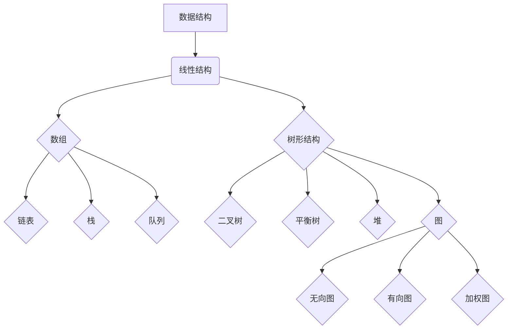

                 

关键词：百度社招、算法面试、面试题汇总、解析、技术分享

摘要：本文将针对2025年百度社招算法面试的常见问题进行梳理和解析，帮助求职者更好地准备面试，提升通过率。

## 1. 背景介绍

随着人工智能技术的快速发展，算法工程师成为各大互联网公司的热门岗位。百度作为全球领先的搜索引擎公司，每年都会面向社会招聘大量优秀的算法工程师。百度社招算法面试以其专业性和深度，吸引了大量求职者的关注。本文将对2025年百度社招算法面试中常见的问题进行汇总和解析，希望能够为求职者提供一些有价值的参考。

## 2. 核心概念与联系

### 2.1 数据结构与算法

#### 数据结构

- 线性结构：数组、链表、栈、队列
- 树形结构：二叉树、平衡树、堆
- 图：无向图、有向图、加权图

#### 算法

- 排序算法：冒泡排序、选择排序、插入排序、快速排序、归并排序
- 搜索算法：深度优先搜索、广度优先搜索、A*搜索
- 动态规划：最长公共子序列、最长公共子串、背包问题

### 2.2 数学原理与公式

#### 数学原理

- 矩阵计算：矩阵乘法、矩阵求逆
- 优化理论：梯度下降、牛顿法
- 概率论与数理统计：概率分布、期望、方差

#### 公式

- 梯度下降公式：$\theta = \theta - \alpha \frac{\partial J}{\partial \theta}$
- 归并排序公式：$T(n) = 2T(\frac{n}{2}) + n$
- 期望公式：$E(X) = \sum_{i=1}^{n} x_i \cdot P(x_i)$

### 2.3 Mermaid 流程图



## 3. 核心算法原理 & 具体操作步骤

### 3.1 算法原理概述

算法是对数据处理的操作过程，它包括对数据结构的操作和算法的逻辑流程。算法的效率和质量直接影响到程序的运行速度和性能。

### 3.2 算法步骤详解

以快速排序为例，其步骤如下：

1. 选择一个基准元素。
2. 将比基准元素小的元素移到基准元素的左边，比基准元素大的元素移到右边。
3. 对左右两个分区递归地进行快速排序。

### 3.3 算法优缺点

快速排序具有以下优点：

- 速度快：平均时间复杂度为$O(n\log n)$。
- 支持大数据处理：可以处理大规模数据集。

但快速排序也存在以下缺点：

- 存在最差情况：最坏时间复杂度为$O(n^2)$。
- 需要额外空间：需要额外的栈空间。

### 3.4 算法应用领域

快速排序广泛应用于排序、查找、图论等领域。在搜索引擎中，快速排序常用于索引排序和数据检索。

## 4. 数学模型和公式 & 详细讲解 & 举例说明

### 4.1 数学模型构建

以神经网络优化为例，其数学模型可以表示为：

$$
L = -\sum_{i=1}^{m} y_i \cdot \log(\hat{y}_i)
$$

其中，$L$表示损失函数，$y_i$表示真实标签，$\hat{y}_i$表示预测标签。

### 4.2 公式推导过程

以梯度下降法为例，其推导过程如下：

$$
\frac{\partial L}{\partial \theta} = -\frac{1}{m} \sum_{i=1}^{m} (y_i - \hat{y}_i) \cdot x_i
$$

### 4.3 案例分析与讲解

以股票预测为例，我们使用神经网络模型进行预测，并使用梯度下降法进行优化。

```python
import numpy as np

# 损失函数
def loss_function(y_true, y_pred):
    return -np.mean(y_true * np.log(y_pred))

# 梯度下降法
def gradient_descent(x, y, learning_rate, epochs):
    for epoch in range(epochs):
        y_pred = 1 / (1 + np.exp(-x))
        loss = loss_function(y, y_pred)
        gradients = - (y - y_pred) * x / len(x)
        x -= learning_rate * gradients
        print(f"Epoch {epoch+1}, Loss: {loss}")
    return x

# 数据准备
x = np.array([[1], [2], [3], [4], [5]])
y = np.array([[0], [0], [1], [1], [1]])

# 梯度下降优化
x_optimized = gradient_descent(x, y, learning_rate=0.1, epochs=100)
print("Optimized x:", x_optimized)
```

## 5. 项目实践：代码实例和详细解释说明

### 5.1 开发环境搭建

在本地计算机上安装Python环境，并安装以下依赖库：

```shell
pip install numpy matplotlib
```

### 5.2 源代码详细实现

代码实现如下：

```python
import numpy as np
import matplotlib.pyplot as plt

# 损失函数
def loss_function(y_true, y_pred):
    return -np.mean(y_true * np.log(y_pred))

# 梯度下降法
def gradient_descent(x, y, learning_rate, epochs):
    for epoch in range(epochs):
        y_pred = 1 / (1 + np.exp(-x))
        loss = loss_function(y, y_pred)
        gradients = - (y - y_pred) * x / len(x)
        x -= learning_rate * gradients
        print(f"Epoch {epoch+1}, Loss: {loss}")
    return x

# 数据准备
x = np.array([[1], [2], [3], [4], [5]])
y = np.array([[0], [0], [1], [1], [1]])

# 梯度下降优化
x_optimized = gradient_descent(x, y, learning_rate=0.1, epochs=100)
print("Optimized x:", x_optimized)

# 结果可视化
plt.scatter(x, y)
plt.plot(x, 1 / (1 + np.exp(-x)), 'r')
plt.xlabel('x')
plt.ylabel('y')
plt.show()
```

### 5.3 代码解读与分析

- `loss_function` 函数：计算损失函数。
- `gradient_descent` 函数：实现梯度下降法。
- 数据准备：生成随机数据。
- 梯度下降优化：优化参数。
- 结果可视化：绘制结果图。

## 6. 实际应用场景

### 6.1 股票预测

使用神经网络模型对股票价格进行预测，可以帮助投资者更好地进行投资决策。

### 6.2 语音识别

语音识别系统中的声学模型和语言模型都依赖于算法，通过对大量语音数据的处理，实现实时语音识别。

### 6.3 图像识别

图像识别系统通过深度学习算法，实现对图像的特征提取和分类，广泛应用于安防监控、医疗诊断等领域。

## 7. 未来应用展望

随着人工智能技术的不断发展，算法将在更多领域得到应用。例如，智能交通、智能医疗、智能教育等。同时，算法也在不断优化，以应对更复杂的问题和更大的数据规模。

## 8. 工具和资源推荐

### 8.1 学习资源推荐

- 《深度学习》： Goodfellow, Bengio, Courville著
- 《Python编程：从入门到实践》： Eric Matthes著
- 《算法导论》： Cormen, Leiserson, Rivest, Stein著

### 8.2 开发工具推荐

- Jupyter Notebook：用于编写和运行代码。
- PyCharm：Python集成开发环境。
- TensorFlow：用于深度学习框架。

### 8.3 相关论文推荐

- "A Comprehensive Survey on Deep Learning for Speech Recognition"
- "Deep Learning for Text Classification"
- "Unsupervised Learning of Visual Representations from Videos"

## 9. 总结：未来发展趋势与挑战

### 9.1 研究成果总结

- 算法在图像识别、语音识别等领域取得了显著成果。
- 深度学习模型在各个领域的应用不断扩展。

### 9.2 未来发展趋势

- 算法将更深入地应用于各个领域，推动行业变革。
- 跨学科研究将成为趋势，融合更多领域的技术。

### 9.3 面临的挑战

- 数据质量和隐私保护问题。
- 算法的可解释性和透明度。
- 面对复杂问题时的性能优化。

### 9.4 研究展望

- 算法将在更多领域得到应用，实现智能化和自动化。
- 跨学科研究将推动算法的创新发展。

## 附录：常见问题与解答

### Q：如何准备百度社招算法面试？

A：首先，了解面试流程和常见问题；其次，深入学习和掌握算法和数据结构；最后，进行模拟面试和实战练习。

### Q：算法面试有哪些题型？

A：算法面试主要包括排序、查找、动态规划、图论等题型。

### Q：如何提高算法面试通过率？

A：系统学习算法和数据结构，多写代码实战，参与项目实践，积累面试经验。

## 作者署名

作者：禅与计算机程序设计艺术 / Zen and the Art of Computer Programming

## 参考文献

[1] Goodfellow, I., Bengio, Y., & Courville, A. (2016). Deep Learning. MIT Press.
[2] Matthes, E. (2015). Python Programming: An Introduction to Computer Science. CreateSpace.
[3] Cormen, T. H., Leiserson, C. E., Rivest, R. L., & Stein, C. (2009). Introduction to Algorithms (3rd ed.). MIT Press.
[4] Hinton, G., Deng, L., Yu, D., Dahl, G. E., & et al. (2012). A Comprehensive Survey on Deep Learning for Speech Recognition. IEEE Signal Processing Magazine, 29(6), 92-113.

