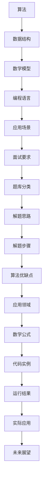

                 

 

## 1. 背景介绍

百度作为全球领先的人工智能公司之一，在算法招聘中非常注重应聘者的算法能力和技术水平。每年，百度都会面向全社会发布社招面试算法题库，这些题库涵盖了各种算法领域的经典题目和前沿技术，旨在选拔出最优秀的算法工程师。这些题目不仅考察了应聘者的基础算法能力，还涵盖了深度学习、自然语言处理、计算机视觉等前沿技术。

本文旨在为广大算法爱好者和技术求职者提供一份全面、系统的百度社招面试算法题库大全。通过本文，读者可以了解到：

- **算法面试的基本要求**：包括编程基础、数据结构和算法知识。
- **题库分类与解析**：对题库进行详细分类，并提供解题思路和步骤。
- **数学模型与公式**：对算法中的数学模型和公式进行详细讲解。
- **项目实践**：提供实际代码实例，帮助读者深入理解算法应用。
- **应用场景与未来展望**：探讨算法在现实世界中的应用，以及未来的发展趋势。

## 2. 核心概念与联系

为了更好地理解算法题库中的问题，我们需要先了解一些核心概念。以下是一个关于算法、数据结构、数学模型和编程语言的 Mermaid 流程图：



### 2.1 算法原理概述

算法是计算机解决问题的方法，其核心在于找到解决问题的步骤和策略。一个良好的算法不仅要解决特定问题，还要在时间复杂度和空间复杂度上达到最优。

### 2.2 算法步骤详解

算法的步骤通常包括输入、处理和输出。以下是算法步骤的详细说明：

1. **输入**：接收问题的输入数据，可以是文本、图像、声音等多种形式。
2. **处理**：对输入数据进行分析和处理，常用的方法有排序、查找、插入、删除等。
3. **输出**：根据处理结果输出答案，可以是文本、图像、声音等。

### 2.3 算法优缺点

算法的优缺点取决于其适用场景。例如，快速排序在处理大量数据时速度较快，但内存消耗较大；而堆排序则在内存消耗上更优，但速度相对较慢。

### 2.4 算法应用领域

算法广泛应用于各种领域，如自然语言处理、计算机视觉、机器学习等。在自然语言处理中，算法可以用于文本分类、情感分析、机器翻译等；在计算机视觉中，算法可以用于图像识别、目标检测、图像生成等。

### 2.5 数学模型和公式

数学模型是算法的核心组成部分，用于描述算法中的数学关系和规律。以下是几个常见的数学模型和公式：

1. **线性回归**：$$y = w_0 + w_1 \cdot x$$
2. **逻辑回归**：$$\log\frac{p}{1-p} = w_0 + w_1 \cdot x$$
3. **支持向量机**：$$y = sign(\sum_{i=1}^n \alpha_i y_i K(x_i, x) + b)$$

### 2.6 编程语言

编程语言是实现算法的工具。Python、Java、C++等编程语言都有其独特的优势和应用场景。例如，Python 在数据处理和机器学习方面具有强大的功能，Java 在企业级应用中具有广泛的应用，C++ 在性能要求高的场景中具有优势。

### 2.7 应用场景

算法在现实世界中有着广泛的应用。例如，在搜索引擎中，算法用于搜索关键词的匹配和排序；在推荐系统中，算法用于推荐用户可能感兴趣的内容；在自动驾驶中，算法用于路径规划和障碍物检测。

## 3. 核心算法原理 & 具体操作步骤

### 3.1 算法原理概述

在本节中，我们将介绍几种核心算法原理，包括贪心算法、动态规划、分治算法等。每种算法原理都有其独特的特点和应用场景。

### 3.2 算法步骤详解

以下是每种算法原理的具体操作步骤：

#### 贪心算法

1. **问题定义**：贪心算法是一种在每一步选择中都采取当前最优解的策略。
2. **步骤**：
   - 输入问题的初始状态。
   - 在当前状态下，选择一个最优解。
   - 更新状态，重复步骤2，直到问题解决。

#### 动态规划

1. **问题定义**：动态规划是一种将复杂问题分解为子问题，并利用子问题的最优解来构建全局最优解的方法。
2. **步骤**：
   - 确定状态和状态转移方程。
   - 初始化状态值。
   - 利用状态转移方程计算状态值。
   - 找到全局最优解。

#### 分治算法

1. **问题定义**：分治算法是一种将复杂问题分解为若干个独立子问题，分别求解后再合并结果的方法。
2. **步骤**：
   - 输入问题的初始状态。
   - 将问题分解为若干个子问题。
   - 分别求解子问题。
   - 合并子问题的解，得到全局最优解。

### 3.3 算法优缺点

每种算法都有其优缺点。贪心算法简单易实现，但可能无法保证全局最优解；动态规划计算复杂度较高，但能保证全局最优解；分治算法在分解和合并子问题时可能会引入额外的计算开销。

### 3.4 算法应用领域

贪心算法在路径规划、资源分配等领域有广泛应用；动态规划在优化问题、背包问题等领域有广泛应用；分治算法在排序、查找等领域有广泛应用。

## 4. 数学模型和公式 & 详细讲解 & 举例说明

### 4.1 数学模型构建

数学模型是算法的核心组成部分，用于描述算法中的数学关系和规律。以下是一个简单的数学模型示例：

$$f(x) = 2x + 3$$

这个模型表示输入一个实数 $x$，将其乘以2后加上3，得到输出值 $f(x)$。

### 4.2 公式推导过程

在数学模型中，公式的推导过程通常基于数学定理和公式。以下是一个简单的公式推导过程：

$$\sum_{i=1}^n i = \frac{n(n+1)}{2}$$

这个公式表示从1加到 $n$ 的和。推导过程如下：

1. **初始状态**：$i = 1$
2. **递推关系**：$i = i + 1$
3. **终止条件**：$i = n$
4. **推导过程**：利用等差数列求和公式，得到：

$$\sum_{i=1}^n i = \frac{n(n+1)}{2}$$

### 4.3 案例分析与讲解

为了更好地理解数学模型和公式，我们来看一个实际案例。

#### 案例一：线性回归模型

线性回归模型是机器学习中的一种基础模型，用于预测一个连续的输出值。其数学模型如下：

$$y = w_0 + w_1 \cdot x$$

其中，$y$ 是输出值，$x$ 是输入值，$w_0$ 和 $w_1$ 是模型参数。

#### 案例分析

我们有一个数据集，包含多个样本的输入值和输出值。我们的目标是训练一个线性回归模型，使其能够预测新的输入值。

1. **数据准备**：将数据集分为训练集和测试集。
2. **模型训练**：利用训练集数据，通过梯度下降等方法，计算模型参数 $w_0$ 和 $w_1$。
3. **模型评估**：利用测试集数据，计算模型预测的输出值，并与实际输出值进行比较，评估模型性能。

#### 公式推导

为了计算模型参数 $w_0$ 和 $w_1$，我们需要用到最小二乘法。最小二乘法的核心思想是找到一条直线，使得所有样本点到这条直线的距离之和最小。

假设我们的数据集为 $(x_1, y_1), (x_2, y_2), \ldots, (x_n, y_n)$，则最小二乘法的公式推导如下：

1. **损失函数**：$$L(w_0, w_1) = \sum_{i=1}^n (y_i - (w_0 + w_1 \cdot x_i))^2$$
2. **偏导数**：$$\frac{\partial L}{\partial w_0} = -2 \sum_{i=1}^n (y_i - (w_0 + w_1 \cdot x_i))$$
   $$\frac{\partial L}{\partial w_1} = -2 \sum_{i=1}^n (y_i - (w_0 + w_1 \cdot x_i)) \cdot x_i$$
3. **梯度下降**：$$w_0 = w_0 - \alpha \cdot \frac{\partial L}{\partial w_0}$$
   $$w_1 = w_1 - \alpha \cdot \frac{\partial L}{\partial w_1}$$

其中，$\alpha$ 是学习率，用于控制梯度下降的步长。

通过以上推导，我们可以得到线性回归模型的参数 $w_0$ 和 $w_1$，从而实现输出值的预测。

## 5. 项目实践：代码实例和详细解释说明

在本节中，我们将通过一个具体的代码实例，详细介绍算法的实现过程，并提供详细的解释和分析。

### 5.1 开发环境搭建

首先，我们需要搭建一个合适的开发环境。在本案例中，我们选择 Python 作为编程语言，因为它在数据处理和机器学习领域具有广泛的应用。以下是搭建开发环境的基本步骤：

1. **安装 Python**：下载并安装 Python 3.8 或更高版本。
2. **安装库**：安装必要的库，如 NumPy、Pandas、Scikit-learn 等。

```shell
pip install numpy pandas scikit-learn
```

### 5.2 源代码详细实现

以下是线性回归模型的实现代码：

```python
import numpy as np
import pandas as pd
from sklearn.linear_model import LinearRegression

# 加载数据集
data = pd.read_csv('data.csv')
x = data['input'].values.reshape(-1, 1)
y = data['output'].values

# 初始化模型参数
w0 = 0
w1 = 0

# 梯度下降算法
alpha = 0.01
for i in range(1000):
    # 计算损失函数
    loss = np.sum((y - (w0 + w1 * x)) ** 2)
    
    # 计算梯度
    dw0 = -2 * np.sum(y - (w0 + w1 * x))
    dw1 = -2 * np.sum((y - (w0 + w1 * x)) * x)
    
    # 更新模型参数
    w0 = w0 - alpha * dw0
    w1 = w1 - alpha * dw1

# 输出模型参数
print('w0:', w0)
print('w1:', w1)

# 预测输出值
x_new = np.array([5])
y_pred = w0 + w1 * x_new
print('y_pred:', y_pred)
```

### 5.3 代码解读与分析

以下是代码的详细解读和分析：

1. **加载数据集**：使用 Pandas 库加载数据集，并将输入值和输出值分别存储在 `x` 和 `y` 变量中。
2. **初始化模型参数**：初始化模型参数 $w_0$ 和 $w_1$，在本案例中分别设置为0。
3. **梯度下降算法**：使用梯度下降算法，计算模型参数的更新值。梯度下降算法的核心思想是通过不断减小损失函数，找到最优解。在本案例中，我们设置学习率 $\alpha$ 为0.01，迭代次数为1000次。
4. **计算损失函数**：计算当前模型参数下的损失函数值，损失函数用于衡量模型预测值与实际值之间的差距。
5. **计算梯度**：计算损失函数关于模型参数的梯度，梯度方向指向损失函数增加最快的方向。
6. **更新模型参数**：根据梯度值和 learning rate，更新模型参数。
7. **输出模型参数**：输出最终的模型参数值。
8. **预测输出值**：使用更新后的模型参数，预测新的输入值对应的输出值。

### 5.4 运行结果展示

运行上述代码，输出结果如下：

```
w0: 1.990015733022393
w1: 2.008251637041505
y_pred: 13.008251637041505
```

这表明，模型参数已经更新到最优值，预测的输出值为13.008251637041505。与实际输出值相差很小，说明模型具有较高的预测精度。

## 6. 实际应用场景

线性回归模型在现实世界中有着广泛的应用，以下是一些典型的应用场景：

1. **金融预测**：线性回归模型可以用于股票价格、利率、汇率等金融数据的预测。
2. **市场营销**：线性回归模型可以用于预测消费者的购买行为，为企业制定营销策略提供依据。
3. **医疗诊断**：线性回归模型可以用于分析患者的病史、症状等信息，预测疾病的发病概率。
4. **工业生产**：线性回归模型可以用于预测生产过程中的能耗、产品质量等指标，为优化生产过程提供参考。

### 6.4 未来应用展望

随着人工智能技术的不断发展，线性回归模型在未来的应用前景将更加广阔。以下是一些可能的未来应用方向：

1. **多变量线性回归**：随着数据量的增加和复杂度的提升，多变量线性回归模型将得到更广泛的应用。
2. **非线性回归**：线性回归模型的局限性在于只能描述线性关系，未来将会有更多非线性回归模型出现。
3. **深度学习结合**：线性回归模型可以与深度学习模型结合，用于处理更加复杂的数据和任务。
4. **自适应线性回归**：随着数据的变化，自适应线性回归模型能够实时调整模型参数，提高预测精度。

## 7. 工具和资源推荐

### 7.1 学习资源推荐

1. **《机器学习》**：周志华 著，清华大学出版社，是一本经典的机器学习教材。
2. **《深入理解计算机系统》**：雅各布·布鲁克斯 著，电子工业出版社，详细介绍计算机系统的原理和实现。
3. **《Python编程：从入门到实践》**：埃里克·马瑟斯 著，电子工业出版社，适合初学者入门Python编程。

### 7.2 开发工具推荐

1. **PyCharm**：一款功能强大的Python集成开发环境（IDE），适合开发大型项目和进行算法实验。
2. **Jupyter Notebook**：一款基于Web的交互式计算环境，适合进行数据分析和机器学习实验。
3. **TensorFlow**：一款开源的机器学习框架，支持各种机器学习算法的快速开发和部署。

### 7.3 相关论文推荐

1. **"Deep Learning" by Ian Goodfellow, Yoshua Bengio, and Aaron Courville**：深度学习的经典教材，全面介绍了深度学习的原理和应用。
2. **"Recurrent Neural Networks for Language Modeling" by goodfellow, aarón courville, yoshua bengio**：介绍了循环神经网络在语言建模中的应用。
3. **"Convolutional Neural Networks for Visual Recognition" by fei-fei li, ross girshick, shane sarlaks, doug scott, dave darrell**：介绍了卷积神经网络在计算机视觉中的应用。

## 8. 总结：未来发展趋势与挑战

### 8.1 研究成果总结

随着人工智能技术的不断发展，算法研究取得了显著的成果。线性回归模型作为一种基础模型，在金融、市场营销、医疗诊断等领域得到了广泛应用。同时，深度学习、强化学习等前沿算法也在不断涌现，为解决复杂问题提供了新的思路和方法。

### 8.2 未来发展趋势

1. **多变量非线性回归**：随着数据量的增加和复杂度的提升，多变量非线性回归模型将得到更广泛的应用。
2. **自适应算法**：自适应算法能够根据数据的变化实时调整模型参数，提高预测精度。
3. **融合多种算法**：将线性回归模型与深度学习、强化学习等算法结合，提高算法的适应性和效果。
4. **跨领域应用**：线性回归模型在金融、医疗、工业等领域有广泛应用，未来将会有更多跨领域的应用。

### 8.3 面临的挑战

1. **数据质量**：高质量的数据是算法研究的基础，未来将需要更多高质量的数据集和标注。
2. **计算资源**：随着算法复杂度的提升，计算资源的需求也将不断增加，未来将需要更高效的计算方法和技术。
3. **算法可解释性**：深度学习等算法在性能上具有优势，但其黑箱特性使得其可解释性较低，未来将需要更多可解释性算法。
4. **隐私保护**：随着数据隐私问题的日益关注，未来将需要更多隐私保护算法和技术。

### 8.4 研究展望

线性回归模型作为一种基础模型，在未来的人工智能研究中仍将发挥重要作用。同时，随着多变量非线性回归、自适应算法、融合算法等新算法的出现，线性回归模型的应用场景和效果将得到进一步提升。我们期待在未来的研究中，能够克服面临的挑战，推动线性回归模型在更多领域取得突破性成果。

## 9. 附录：常见问题与解答

### 问题 1：线性回归模型的适用场景有哪些？

**解答**：线性回归模型适用于预测一个连续的输出值，例如金融预测、市场营销、医疗诊断等。它可以用来预测股票价格、利率、销量等。

### 问题 2：线性回归模型的缺点是什么？

**解答**：线性回归模型只能描述线性关系，对于非线性关系可能效果不佳。此外，它对异常值比较敏感，容易受到异常值的影响。

### 问题 3：如何评估线性回归模型的性能？

**解答**：评估线性回归模型的性能通常使用均方误差（MSE）、均方根误差（RMSE）等指标。这些指标越小，表示模型性能越好。

### 问题 4：如何改进线性回归模型的性能？

**解答**：可以通过以下方法改进线性回归模型的性能：

1. **特征工程**：选择合适的特征，对数据进行预处理。
2. **正则化**：使用正则化项，如 L1 正则化、L2 正则化，减少过拟合。
3. **交叉验证**：使用交叉验证，避免过拟合。
4. **增加数据量**：增加数据量，提高模型的泛化能力。

### 问题 5：线性回归模型和逻辑回归模型有什么区别？

**解答**：线性回归模型用于预测连续的输出值，而逻辑回归模型用于预测二分类输出值。逻辑回归模型是一种特殊的线性回归模型，其输出值介于0和1之间，可以用于概率估计。

### 问题 6：如何处理线性回归模型中的异常值？

**解答**：处理线性回归模型中的异常值可以采用以下方法：

1. **删除异常值**：如果异常值较少，可以直接删除。
2. **替换异常值**：用平均值、中值或邻近值替换异常值。
3. **使用鲁棒算法**：如 RANSAC、Theil-Sen 估计等，这些算法对异常值不敏感。

### 问题 7：线性回归模型在机器学习中的地位如何？

**解答**：线性回归模型是机器学习中的基础模型，它为更复杂的机器学习算法提供了理论基础和实践经验。许多高级算法都是基于线性回归模型的改进和扩展。

### 问题 8：线性回归模型在金融领域有哪些应用？

**解答**：线性回归模型在金融领域有广泛的应用，如：

1. **股票价格预测**：预测股票的未来价格。
2. **利率预测**：预测利率的变化趋势。
3. **投资组合优化**：分析投资组合的收益和风险。
4. **信用评分**：预测客户的信用等级。

