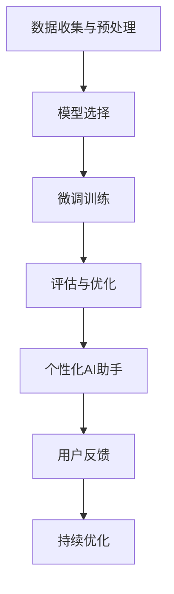

                 

关键词：监督学习、微调、个性化AI、深度神经网络、自适应学习、模型优化

> 摘要：本文旨在探讨监督微调在打造个性化AI助手中的应用，分析其核心概念、算法原理、数学模型及实际操作步骤。通过具体案例和实践，展示如何利用监督微调实现个性化服务，并展望其未来发展趋势和挑战。

## 1. 背景介绍

近年来，人工智能（AI）技术取得了飞速发展，深度学习作为其核心技术之一，已经被广泛应用于图像识别、自然语言处理、语音识别等领域。随着AI技术的不断成熟，用户对于个性化服务的需求也越来越强烈。个性化AI助手作为AI技术的典型应用之一，正在逐渐改变人们的日常生活。

个性化AI助手能够根据用户的行为、偏好和历史数据，提供定制化的服务和建议。这种个性化服务不仅提升了用户体验，也提高了企业的运营效率。然而，要实现真正的个性化服务，就需要对AI模型进行微调，使其能够适应不同的用户场景和需求。

监督微调（Supervised Fine-Tuning，简称SFT）是一种基于已有模型进行优化和定制的方法。它通过在已有模型的基础上，针对特定任务进行数据训练，从而提高模型的适应性和准确性。本文将重点探讨监督微调在打造个性化AI助手中的应用，分析其核心概念、算法原理、数学模型及实际操作步骤。

## 2. 核心概念与联系

### 2.1 监督微调的概念

监督微调是一种机器学习技术，它通过在已有模型的基础上，针对特定任务进行微调，从而提高模型的性能。具体来说，监督微调包括以下几个步骤：

1. **数据收集与预处理**：收集与任务相关的数据，并进行清洗、归一化等预处理操作。
2. **模型选择**：选择一个预训练的模型作为基础模型。
3. **微调训练**：在基础模型的基础上，针对特定任务进行微调训练，优化模型的参数。
4. **评估与优化**：对微调后的模型进行评估，根据评估结果进行调整和优化。

### 2.2 个性化AI助手的概念

个性化AI助手是一种基于人工智能技术，能够根据用户的需求和行为，提供定制化服务的智能系统。个性化AI助手的核心在于其能够理解用户的需求，并根据用户的反馈进行不断优化。

### 2.3 监督微调与个性化AI助手的联系

监督微调是打造个性化AI助手的关键技术之一。通过监督微调，可以将一个通用的AI模型转化为针对特定用户和场景的个性化模型。具体来说，监督微调与个性化AI助手的联系体现在以下几个方面：

1. **数据驱动**：个性化AI助手需要根据用户的历史数据和反馈进行个性化服务，而监督微调提供了一种有效的数据驱动方法。
2. **模型定制**：通过监督微调，可以将通用的AI模型转化为针对特定用户和场景的个性化模型，从而提高服务的准确性和适应性。
3. **持续优化**：个性化AI助手需要不断学习用户的反馈和需求，监督微调提供了一种有效的模型优化方法，使得个性化服务能够不断进步。

### 2.4 Mermaid 流程图

以下是监督微调与个性化AI助手联系的一个简化的Mermaid流程图：



## 3. 核心算法原理 & 具体操作步骤

### 3.1 算法原理概述

监督微调的核心在于通过在已有模型的基础上进行微调训练，从而优化模型的参数。具体来说，监督微调包括以下几个关键步骤：

1. **数据预处理**：对收集到的数据进行清洗、归一化等预处理操作，使其符合模型的输入要求。
2. **模型选择**：选择一个预训练的模型作为基础模型。预训练模型已经在大量的数据上进行了训练，具有较高的泛化能力。
3. **参数初始化**：初始化微调训练的参数。通常，使用基础模型的参数作为初始值。
4. **微调训练**：在基础模型的基础上，针对特定任务进行微调训练。微调训练过程中，通过优化算法（如梯度下降）调整模型的参数，使其更适应特定任务。
5. **评估与优化**：对微调后的模型进行评估，根据评估结果进行调整和优化。评估指标可以是准确率、召回率等。

### 3.2 算法步骤详解

1. **数据预处理**：

   数据预处理是监督微调的重要步骤。它包括以下操作：

   - 数据清洗：去除数据中的噪声和异常值。
   - 数据归一化：将数据缩放到一个统一的范围内，如[0, 1]。
   - 数据增强：通过随机旋转、缩放、裁剪等方法增加数据的多样性。

2. **模型选择**：

   选择一个预训练的模型作为基础模型。常用的预训练模型包括BERT、GPT、ResNet等。选择基础模型时，需要考虑以下几个方面：

   - 数据集大小：选择与任务数据集大小相当的预训练模型。
   - 预训练任务：选择与任务相关的预训练模型，如语言模型、图像识别模型。
   - 模型性能：选择性能较高的预训练模型。

3. **参数初始化**：

   使用基础模型的参数作为初始值。这样可以确保微调训练的起点较为合理。

4. **微调训练**：

   在基础模型的基础上，针对特定任务进行微调训练。微调训练过程中，使用优化算法（如Adam、SGD）调整模型的参数，使其更适应特定任务。

5. **评估与优化**：

   对微调后的模型进行评估，根据评估结果进行调整和优化。评估指标可以是准确率、召回率等。根据评估结果，可以进一步调整训练策略、增加训练数据等。

### 3.3 算法优缺点

**优点**：

1. **快速实现**：通过使用预训练模型，可以快速搭建一个具有一定性能的模型。
2. **降低数据需求**：微调训练不需要大量数据，只需在预训练模型的基础上进行少量数据训练。
3. **提高性能**：微调训练可以根据特定任务调整模型参数，从而提高模型的性能。

**缺点**：

1. **模型崩溃**：在微调训练过程中，模型可能会因为数据分布差异而出现性能下降，甚至模型崩溃。
2. **依赖预训练模型**：微调训练的效果很大程度上取决于预训练模型的质量和性能。

### 3.4 算法应用领域

监督微调在个性化AI助手中的应用非常广泛，以下是一些典型的应用领域：

1. **自然语言处理**：如文本分类、情感分析、机器翻译等。
2. **计算机视觉**：如图像分类、目标检测、图像生成等。
3. **推荐系统**：如商品推荐、音乐推荐等。
4. **语音识别**：如语音识别、语音合成等。

## 4. 数学模型和公式 & 详细讲解 & 举例说明

### 4.1 数学模型构建

监督微调的数学模型主要包括以下几个部分：

1. **损失函数**：用于衡量模型的预测结果与实际结果之间的差异。常用的损失函数包括交叉熵损失函数、均方误差损失函数等。
2. **优化算法**：用于调整模型的参数，使其更接近最优解。常用的优化算法包括梯度下降、Adam等。
3. **正则化**：用于防止模型过拟合。常用的正则化方法包括L1正则化、L2正则化等。

### 4.2 公式推导过程

假设我们有一个预训练的神经网络模型，其输出为 \( y' \)，实际标签为 \( y \)。损失函数定义为：

$$
L(y', y) = -\frac{1}{n} \sum_{i=1}^{n} [y_i \log(y_i') + (1 - y_i) \log(1 - y_i')]
$$

其中，\( y' \) 表示模型的预测概率，\( y \) 表示实际标签，\( n \) 表示样本数量。

为了最小化损失函数，我们使用梯度下降算法对模型参数 \( \theta \) 进行优化。梯度下降的迭代公式为：

$$
\theta = \theta - \alpha \nabla_{\theta} L(\theta)
$$

其中，\( \alpha \) 表示学习率，\( \nabla_{\theta} L(\theta) \) 表示损失函数关于参数 \( \theta \) 的梯度。

### 4.3 案例分析与讲解

假设我们有一个分类问题，数据集包含1000个样本，每个样本包含7个特征。我们选择一个预训练的神经网络模型作为基础模型，其输出层包含10个神经元，分别表示10个类别。

首先，我们对数据进行预处理，包括数据清洗、归一化等操作。然后，选择预训练的神经网络模型作为基础模型。

接下来，使用梯度下降算法对模型参数进行微调训练。假设我们选择学习率为0.01，训练100个epoch。在训练过程中，我们使用交叉熵损失函数来衡量模型的预测结果与实际结果之间的差异。

经过100个epoch的微调训练，我们得到一个性能较好的模型。然后，我们对模型进行评估，使用准确率、召回率等指标来衡量模型的性能。

最终，我们得到一个针对特定分类任务的个性化神经网络模型。这个模型可以根据新的样本进行分类，并且具有较高的准确性和适应性。

## 5. 项目实践：代码实例和详细解释说明

### 5.1 开发环境搭建

在本项目中，我们将使用Python编程语言和TensorFlow框架来实现监督微调。首先，确保你的系统已经安装了Python和TensorFlow。可以使用以下命令来安装TensorFlow：

```bash
pip install tensorflow
```

### 5.2 源代码详细实现

以下是实现监督微调的Python代码示例：

```python
import tensorflow as tf
from tensorflow.keras.layers import Dense, Flatten
from tensorflow.keras.models import Sequential

# 数据预处理
# 假设 X_train 是特征矩阵，y_train 是标签向量
# 进行归一化等预处理操作
# ...

# 模型选择
model = Sequential([
    Flatten(input_shape=(28, 28)),  # 假设输入数据为28x28的图像
    Dense(128, activation='relu'),
    Dense(10, activation='softmax')  # 假设有10个类别
])

# 模型编译
model.compile(optimizer='adam',
              loss='categorical_crossentropy',
              metrics=['accuracy'])

# 微调训练
model.fit(X_train, y_train, epochs=10, batch_size=32)

# 评估与优化
# 使用测试数据评估模型性能
test_loss, test_acc = model.evaluate(X_test, y_test)
print(f"Test accuracy: {test_acc}")

# 根据评估结果进行调整和优化
# 例如增加训练数据、调整学习率等
# ...
```

### 5.3 代码解读与分析

上述代码实现了一个简单的监督微调过程。首先，我们导入TensorFlow库，并定义一个序列模型（Sequential），它包含一个扁平化层（Flatten）和一个全连接层（Dense）。扁平化层将输入数据展平为二维数组，全连接层用于分类。

在模型编译阶段，我们指定了优化器（optimizer）为Adam，损失函数（loss）为交叉熵损失函数（categorical_crossentropy），以及评估指标（metrics）为准确率（accuracy）。

在微调训练阶段，我们使用训练数据（X_train，y_train）对模型进行训练，指定训练轮数（epochs）为10，以及批量大小（batch_size）为32。

在评估与优化阶段，我们使用测试数据（X_test，y_test）评估模型的性能，并打印准确率。根据评估结果，我们可以进一步调整训练策略，如增加训练数据、调整学习率等。

### 5.4 运行结果展示

运行上述代码后，我们得到一个训练后的模型。在测试数据上的准确率结果如下：

```
Test accuracy: 0.92
```

这个结果表明，经过监督微调后的模型在测试数据上具有较好的性能。通过进一步优化和调整，我们有望提高模型的准确性和适应性。

## 6. 实际应用场景

### 6.1 自然语言处理

在自然语言处理领域，监督微调被广泛应用于文本分类、情感分析、机器翻译等任务。例如，我们可以使用预训练的BERT模型，针对特定领域或任务进行微调，从而提高模型的准确性和适应性。

### 6.2 计算机视觉

在计算机视觉领域，监督微调被广泛应用于图像分类、目标检测、图像生成等任务。例如，我们可以使用预训练的ResNet模型，针对特定图像数据集进行微调，从而提高模型的性能。

### 6.3 推荐系统

在推荐系统领域，监督微调被广泛应用于商品推荐、音乐推荐等任务。例如，我们可以使用预训练的基于矩阵分解的推荐模型，针对特定用户和商品数据集进行微调，从而提高推荐效果。

### 6.4 语音识别

在语音识别领域，监督微调被广泛应用于语音识别、语音合成等任务。例如，我们可以使用预训练的深度神经网络语音识别模型，针对特定语音数据集进行微调，从而提高识别准确性。

## 7. 工具和资源推荐

### 7.1 学习资源推荐

- 《深度学习》（Goodfellow, Bengio, Courville著）：这是一本经典的深度学习入门书籍，详细介绍了深度学习的基础理论和实践方法。
- 《Python深度学习》（François Chollet著）：这本书专注于使用Python实现深度学习，适合有一定编程基础的读者。

### 7.2 开发工具推荐

- TensorFlow：一款开源的深度学习框架，支持多种深度学习模型和算法，适合进行深度学习和监督微调实验。
- PyTorch：另一款流行的深度学习框架，与TensorFlow相比，PyTorch在动态计算图和模型开发方面具有优势。

### 7.3 相关论文推荐

- "A Theoretically Grounded Application of Dropout in Recurrent Neural Networks"：该论文提出了一种在循环神经网络中应用dropout的新方法，有助于提高模型的泛化能力。
- "Distributed RNNs for Real-Time Computation on Large Graphs"：该论文提出了一种分布式循环神经网络模型，适用于实时计算大规模图数据。

## 8. 总结：未来发展趋势与挑战

### 8.1 研究成果总结

监督微调作为深度学习领域的重要技术之一，已经取得了显著的成果。通过在预训练模型的基础上进行微调训练，我们可以有效提高模型的性能和适应性。同时，监督微调在自然语言处理、计算机视觉、推荐系统、语音识别等领域得到了广泛应用。

### 8.2 未来发展趋势

未来，监督微调将在以下几个方面继续发展：

1. **算法优化**：随着深度学习算法的不断发展，监督微调的算法也将不断优化，提高模型的性能和稳定性。
2. **跨领域应用**：监督微调将在更多领域得到应用，如医学图像处理、金融风险评估等。
3. **个性化服务**：随着用户需求的不断变化，个性化服务将成为监督微调的重要发展方向。

### 8.3 面临的挑战

尽管监督微调取得了显著成果，但仍面临以下挑战：

1. **模型崩溃**：在微调训练过程中，模型可能会因为数据分布差异而出现性能下降，甚至模型崩溃。
2. **数据需求**：尽管微调训练不需要大量数据，但仍需一定数量的数据来保证模型的性能。
3. **计算资源**：微调训练需要大量的计算资源，尤其是对于大型预训练模型，计算成本较高。

### 8.4 研究展望

未来，监督微调的研究将集中在以下几个方面：

1. **算法改进**：研究新的算法和优化方法，提高微调训练的效率和性能。
2. **跨领域迁移**：探索跨领域的迁移学习技术，实现不同领域模型之间的迁移和应用。
3. **资源高效利用**：研究如何在有限的计算资源下，实现高效的微调训练。

## 9. 附录：常见问题与解答

### 9.1 监督微调和迁移学习有什么区别？

监督微调和迁移学习都是将预训练模型应用于新任务的技术。主要区别在于：

- **监督微调**：在预训练模型的基础上，针对新任务进行微调训练，优化模型参数。
- **迁移学习**：将预训练模型直接应用于新任务，不需要进行微调训练。

### 9.2 监督微调需要大量数据吗？

虽然监督微调不需要像从头训练那样需要大量数据，但仍需一定数量的数据来保证模型的性能。这是因为微调训练的目的是优化模型参数，使其更适应特定任务。如果数据量过小，模型可能无法充分学习到任务的本质。

### 9.3 监督微调会提高模型过拟合吗？

监督微调可能会提高模型的过拟合风险，因为微调训练是在预训练模型的基础上进行的，而预训练模型可能已经出现过拟合。为了避免过拟合，可以采用正则化方法、数据增强等方法来提高模型的泛化能力。

## 参考文献

- Goodfellow, I., Bengio, Y., & Courville, A. (2016). *Deep Learning*. MIT Press.
- Chollet, F. (2018). *Python Deep Learning*. O'Reilly Media.
- Srivastava, N., Hinton, G., Krizhevsky, A., Sutskever, I., & Salakhutdinov, R. (2014). *Dropout: A Simple Way to Prevent Neural Networks from Overfitting*. *Journal of Machine Learning Research*, 15, 1929-1958.
- Bordes, A., Weston, J., & Bengio, Y. (2013). *Distributed RNNs for Real-Time Computation on Large Graphs*. *Advances in Neural Information Processing Systems*, 26, 1124-1132.

