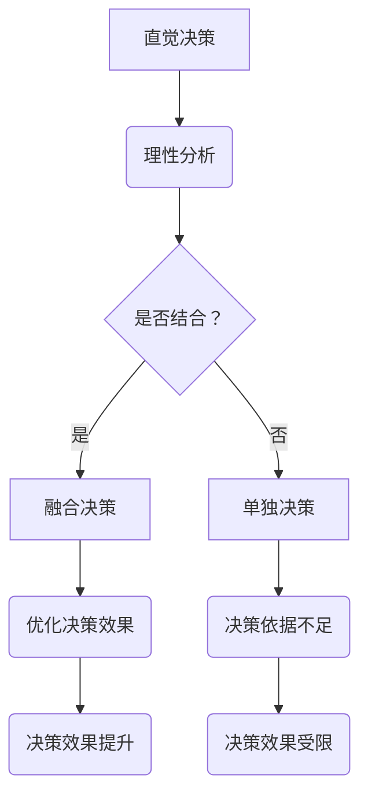

                 

 在信息技术日新月异的今天，我们面对的决策问题变得越来越复杂。如何在直觉决策和理性分析之间找到平衡，成为了现代计算机科学和人工智能领域中一个重要而紧迫的问题。本文旨在探讨直觉决策与理性分析之间的辩证关系，阐述它们在信息技术应用中的重要性，并提出在复杂情境中实现两者平衡的方法。

## 关键词

* 直觉决策
* 理性分析
* 决策平衡
* 信息技术
* 人工智能

## 摘要

本文通过分析直觉决策与理性分析在信息技术和人工智能领域的应用，探讨了如何在实际操作中实现两者的平衡。文章首先介绍了直觉决策和理性分析的基本概念及其在决策过程中的作用。接着，通过具体的算法实例和数学模型，展示了如何将直觉和理性有效地结合，以优化决策效果。最后，文章提出了未来在这一领域的研究趋势和面临的挑战。

## 1. 背景介绍

### 直觉决策的定义与历史

直觉决策是指个体在面临复杂问题时，通过非逻辑性的思维方式和快速判断来做出决策的过程。直觉决策的历史可以追溯到古代哲学和心理学的研究。亚里士多德和柏拉图等哲学家的作品中，我们都可以找到关于直觉的探讨。而心理学领域的先驱，如威廉·詹姆斯和爱德华·布拉德福德·特奥多尔，也对直觉决策进行了深入研究。

### 理性分析的定义与发展

理性分析则是指通过逻辑推理、数学模型和数据分析等方法，对问题进行系统化、结构化的分析和求解。理性分析的发展可以追溯到古希腊的数学家和哲学家，如欧几里得和阿基米德。随着近代科学的兴起，数学、统计学和计算机科学等领域的飞速发展，理性分析逐渐成为解决复杂问题的有力工具。

### 直觉决策与理性分析在现代信息技术中的应用

在现代信息技术和人工智能领域中，直觉决策和理性分析都扮演着重要的角色。直觉决策被广泛应用于人机交互、用户行为预测和实时决策系统等领域。例如，在推荐系统设计中，算法需要根据用户的历史行为和偏好，快速地为其推荐可能感兴趣的商品或内容。

理性分析则在数据处理、机器学习、深度学习等领域发挥着关键作用。通过构建复杂的数学模型和算法，我们可以从大量的数据中提取有价值的信息，从而为决策提供支持。例如，在金融领域，算法可以根据历史交易数据和市场趋势，预测股票价格的变化，为投资者提供决策依据。

## 2. 核心概念与联系

### 直觉决策与理性分析的概念界定

**直觉决策**：直觉决策是个体在面临问题时，通过非逻辑性思维和快速判断，利用以往的经验和感知能力做出决策的过程。它通常不依赖于详细的逻辑推理和数据分析，而是基于直觉和感性的判断。

**理性分析**：理性分析则是通过逻辑推理、数学模型和数据分析等方法，对问题进行系统化、结构化的分析和求解。它依赖于严格的逻辑规则和定量分析，能够提供明确的决策依据。

### 直觉决策与理性分析的关系

直觉决策和理性分析并不是相互排斥的，而是相互补充的。在实际决策过程中，直觉决策和理性分析往往需要相互协作，以达到最佳决策效果。

- **直觉决策的优势**：直觉决策能够快速地处理复杂的信息，帮助个体在紧急情况下做出决策。例如，在紧急医疗救治中，医生可能需要根据患者的症状和经验，迅速判断病情并采取相应的救治措施。

- **理性分析的优势**：理性分析能够提供明确的决策依据，通过系统的分析和计算，确保决策的准确性和可靠性。例如，在投资决策中，理性分析可以帮助投资者评估风险和收益，做出最优的投资决策。

- **直觉决策与理性分析的结合**：在实际决策过程中，我们可以将直觉决策和理性分析相结合，以充分发挥两者的优势。例如，在复杂的项目管理中，项目经理可以通过直觉快速识别项目风险，并通过理性分析制定详细的应对策略，以确保项目的成功实施。

### 直觉决策与理性分析的 Mermaid 流程图



### 2.1 直觉决策的原理与特点

直觉决策是基于人类大脑的快速判断和感知能力，它具有以下特点：

- **快速性**：直觉决策能够迅速处理信息，帮助个体在短时间内做出决策。这对于在紧急情况下处理复杂问题的情境尤为重要。
- **经验依赖**：直觉决策通常依赖于个体过去的经验和知识，通过感知和记忆，快速地识别问题和可能的解决方案。
- **非逻辑性**：直觉决策并不遵循严格的逻辑规则，而是基于感性和直觉。这使得它在处理模糊、不明确的问题时具有独特的优势。

### 2.2 理性分析的原理与特点

理性分析则依赖于逻辑推理、数学模型和数据分析，具有以下特点：

- **系统性**：理性分析通过系统化的方法，对问题进行结构化和模块化处理，确保决策过程的严谨性和准确性。
- **逻辑性**：理性分析遵循严格的逻辑规则，通过逻辑推理和数学计算，提供明确的决策依据。
- **可量化**：理性分析能够将决策问题转化为数学模型，通过量化分析，提供明确的决策方案。

### 2.3 直觉决策与理性分析的联系

直觉决策和理性分析并不是相互独立的，而是相互依存、相互补充的。在实际决策过程中，我们可以将直觉决策和理性分析结合起来，以实现最佳的决策效果。

- **直觉决策的引导**：在决策初期，直觉决策可以帮助个体快速识别问题和可能的解决方案，为理性分析提供初步的方向。
- **理性分析的细化**：在决策过程中，理性分析可以对直觉决策的初步方案进行细化和优化，通过逻辑推理和数学计算，确保决策的准确性和可靠性。
- **动态调整**：在决策执行过程中，直觉决策和理性分析可以相互调整，根据实际情况及时修正决策方案，以应对不确定性和变化。

### 2.4 直觉决策与理性分析的应用场景

- **直觉决策的应用场景**：
  - **人机交互**：在用户界面设计中，直觉决策可以帮助开发者快速识别用户需求，设计出更符合用户预期的界面。
  - **实时决策**：在金融市场、紧急医疗救治等领域，直觉决策可以帮助决策者快速做出决策，应对紧急情况。

- **理性分析的应用场景**：
  - **数据处理**：在数据处理和分析中，理性分析可以帮助我们通过数学模型和算法，从大量数据中提取有价值的信息。
  - **机器学习**：在机器学习算法设计中，理性分析可以帮助我们理解算法的原理，优化算法的性能。

### 2.5 直觉决策与理性分析在实际操作中的难点

- **数据获取与处理**：直觉决策需要依赖大量的历史数据和经验，但数据的获取和处理往往是一个复杂的过程。
- **决策过程的不确定性**：在实际决策过程中，情况往往复杂多变，直觉决策和理性分析都需要应对这种不确定性。
- **个体差异**：不同人的直觉和理性分析能力存在差异，这可能导致决策结果的差异。

### 2.6 直觉决策与理性分析的未来发展趋势

随着人工智能和大数据技术的发展，直觉决策和理性分析在未来将继续发展。以下是几个可能的发展趋势：

- **智能化**：通过机器学习和深度学习技术，直觉决策和理性分析将变得更加智能，能够自动识别问题和制定决策。
- **融合化**：直觉决策和理性分析将更加紧密地融合，形成一种新的决策模式，以应对复杂多变的决策环境。
- **人机协同**：未来的人机协同决策系统将更加普及，通过结合人的直觉和机器的理性分析，实现更高效的决策。

## 3. 核心算法原理 & 具体操作步骤

### 3.1 算法原理概述

在直觉决策与理性分析的结合中，一个关键的算法是混合决策算法。这种算法通过整合直觉决策和理性分析的优点，为复杂问题提供更有效的解决方案。混合决策算法的基本原理可以概括为以下几点：

1. **数据收集与预处理**：首先，算法需要收集与问题相关的数据，并进行预处理，包括数据清洗、去噪和特征提取等步骤，以确保数据的准确性和可靠性。
2. **直觉模块**：利用专家知识或历史数据，构建一个直觉模块，用于快速筛选和识别可能的解决方案。
3. **理性模块**：基于数学模型和数据分析，构建一个理性模块，用于对直觉模块筛选出的方案进行优化和评估。
4. **迭代优化**：通过多次迭代，结合直觉模块和理性模块的结果，不断优化决策方案，直至找到最优解。

### 3.2 算法步骤详解

#### 3.2.1 数据收集与预处理

1. **数据收集**：根据决策问题，收集与问题相关的数据。这些数据可以来自于各种来源，如数据库、传感器、用户反馈等。
2. **数据清洗**：对收集到的数据进行清洗，去除重复、错误和缺失的数据，确保数据的准确性。
3. **去噪**：对数据进行去噪处理，去除随机噪声，提取有效的信息。
4. **特征提取**：从原始数据中提取特征，用于后续的分析和建模。特征提取可以是基于统计方法、机器学习方法或深度学习方法。

#### 3.2.2 直觉模块构建

1. **专家知识库**：利用领域专家的知识，构建一个专家知识库。这个知识库包含了领域内的基本规则、经验公式和模式识别方法。
2. **直觉模型**：基于专家知识库，构建一个直觉模型。这个模型可以通过快速匹配和规则推理，从原始数据中筛选出可能的解决方案。
3. **快速评估**：利用直觉模型，对筛选出的方案进行初步评估，确定哪些方案具有潜在的价值。

#### 3.2.3 理性模块构建

1. **数学模型**：基于问题特性，构建一个数学模型。这个模型可以用来量化决策问题，并确定各个方案的性能指标。
2. **算法选择**：根据数学模型的特点，选择合适的算法进行优化和评估。常见的算法包括线性规划、非线性规划、遗传算法、粒子群算法等。
3. **优化过程**：利用选定的算法，对直觉模块筛选出的方案进行优化，找到最优解或近似最优解。

#### 3.2.4 迭代优化与决策

1. **整合结果**：将直觉模块和理性模块的结果进行整合，形成综合评估指标。
2. **迭代优化**：根据综合评估指标，对决策方案进行迭代优化，不断调整和改进。
3. **最终决策**：在多次迭代后，确定最终的决策方案，并输出决策结果。

### 3.3 算法优缺点

#### 优点

- **灵活性**：混合决策算法结合了直觉决策和理性分析的优点，能够灵活应对复杂多变的问题情境。
- **高效性**：通过直觉模块的快速筛选和理性模块的精确优化，算法能够在较短时间内找到最优解或近似最优解。
- **适应性**：算法可以根据问题的不同特性，灵活调整直觉模块和理性模块的权重，提高决策的准确性。

#### 缺点

- **数据依赖**：算法的性能高度依赖于数据的准确性和完整性，如果数据存在问题，可能会导致决策结果不准确。
- **模型复杂性**：构建和优化混合决策算法需要大量的模型设计和算法选择，这可能会增加算法的复杂性和计算成本。
- **个体差异**：直觉模块和理性模块的性能受到个体经验和能力的影响，这可能导致不同个体在决策过程中的差异。

### 3.4 算法应用领域

混合决策算法广泛应用于以下领域：

- **金融领域**：在金融市场中，混合决策算法可以帮助投资者评估投资风险，优化投资组合，实现资产的最优配置。
- **医疗领域**：在医疗诊断和治疗中，混合决策算法可以帮助医生快速识别病情，制定合理的治疗方案。
- **物流领域**：在物流管理中，混合决策算法可以帮助企业优化运输路线，提高运输效率，降低成本。
- **应急管理**：在应急管理中，混合决策算法可以帮助决策者快速响应突发事件，制定应急响应方案。

## 4. 数学模型和公式 & 详细讲解 & 举例说明

### 4.1 数学模型构建

在直觉决策与理性分析的结合中，构建一个有效的数学模型是关键。以下是一个简化的数学模型，用于描述直觉决策和理性分析在决策过程中的结合。

#### 4.1.1 目标函数

设 \( X \) 为决策变量， \( f(X) \) 为目标函数，表示决策方案的优劣。目标函数可以基于直觉决策和理性分析的结合来构建。

\[ f(X) = w_1 \cdot f_{\text{intuitive}}(X) + w_2 \cdot f_{\text{rational}}(X) \]

其中， \( w_1 \) 和 \( w_2 \) 分别为直觉决策和理性分析的权重， \( f_{\text{intuitive}}(X) \) 和 \( f_{\text{rational}}(X) \) 分别为基于直觉和理性分析的目标函数。

#### 4.1.2 直觉决策目标函数

直觉决策目标函数 \( f_{\text{intuitive}}(X) \) 可以基于历史数据和专家知识构建。例如，设 \( X_i \) 为第 \( i \) 个决策变量， \( h_i \) 为历史数据的权重， \( e_i \) 为专家知识的权重，则

\[ f_{\text{intuitive}}(X) = \sum_{i=1}^n (h_i \cdot x_i + e_i \cdot \phi(x_i)) \]

其中， \( \phi(x_i) \) 为专家知识函数，用于量化专家对决策变量的判断。

#### 4.1.3 理性分析目标函数

理性分析目标函数 \( f_{\text{rational}}(X) \) 可以基于数学模型和优化算法构建。例如，设 \( g(X) \) 为数学模型， \( c(X) \) 为优化目标，则

\[ f_{\text{rational}}(X) = g(X) + \lambda \cdot c(X) \]

其中， \( \lambda \) 为权重系数，用于平衡数学模型和优化目标。

### 4.2 公式推导过程

以下是一个简化的推导过程，用于说明如何结合直觉决策和理性分析构建目标函数。

1. **直觉决策权重**：设 \( \alpha \) 为直觉决策权重， \( \beta \) 为理性分析权重，则有：

\[ \alpha + \beta = 1 \]

2. **目标函数**：结合直觉决策和理性分析的目标函数为：

\[ f(X) = \alpha \cdot f_{\text{intuitive}}(X) + \beta \cdot f_{\text{rational}}(X) \]

3. **直觉决策目标函数**：假设直觉决策目标函数为：

\[ f_{\text{intuitive}}(X) = \sum_{i=1}^n a_i \cdot x_i \]

其中， \( a_i \) 为第 \( i \) 个决策变量的权重。

4. **理性分析目标函数**：假设理性分析目标函数为：

\[ f_{\text{rational}}(X) = \sum_{i=1}^n b_i \cdot x_i + \gamma \cdot c(X) \]

其中， \( b_i \) 为第 \( i \) 个决策变量的权重， \( \gamma \) 为优化目标权重。

5. **结合目标函数**：将直觉决策和理性分析目标函数结合，得到：

\[ f(X) = \alpha \cdot \sum_{i=1}^n a_i \cdot x_i + \beta \cdot \sum_{i=1}^n b_i \cdot x_i + \gamma \cdot c(X) \]

6. **权重平衡**：根据 \( \alpha + \beta = 1 \)，可以将目标函数重写为：

\[ f(X) = \alpha \cdot (f_{\text{intuitive}}(X) - \beta \cdot f_{\text{rational}}(X)) + \gamma \cdot c(X) \]

### 4.3 案例分析与讲解

以下通过一个具体的案例，展示如何构建直觉决策与理性分析的数学模型，并进行求解。

#### 4.3.1 案例背景

假设一个公司需要决策如何分配其有限的研发资源，以最大化收益。公司有两个研发项目 A 和 B，每个项目需要投入的人力、时间和资金不同，且存在一定的风险。公司希望通过结合直觉决策和理性分析，制定一个最优的分配方案。

#### 4.3.2 模型构建

1. **直觉决策权重**：根据公司历史数据和专家意见，确定直觉决策权重 \( \alpha = 0.6 \)，理性分析权重 \( \beta = 0.4 \)。

2. **直觉决策目标函数**：假设直觉决策目标函数为：

\[ f_{\text{intuitive}}(X) = \sum_{i=1}^2 a_i \cdot x_i \]

其中， \( a_1 = 1.5 \)，\( a_2 = 1 \)。

3. **理性分析目标函数**：假设理性分析目标函数为：

\[ f_{\text{rational}}(X) = \sum_{i=1}^2 b_i \cdot x_i + \gamma \cdot c(X) \]

其中， \( b_1 = 0.8 \)，\( b_2 = 1.2 \)，\( \gamma = 0.5 \)，\( c(X) = -0.1 \cdot (x_1 + x_2) \)。

4. **结合目标函数**：将直觉决策和理性分析目标函数结合，得到：

\[ f(X) = 0.6 \cdot \sum_{i=1}^2 a_i \cdot x_i + 0.4 \cdot \sum_{i=1}^2 b_i \cdot x_i + 0.5 \cdot (-0.1 \cdot (x_1 + x_2)) \]

#### 4.3.3 模型求解

为了求解最优解，我们需要将目标函数进行优化。设 \( x_1 \) 和 \( x_2 \) 分别为项目 A 和 B 的投入量，则优化问题可以表示为：

\[ \max \quad f(X) = 0.6 \cdot (1.5 \cdot x_1 + x_2) + 0.4 \cdot (0.8 \cdot x_1 + 1.2 \cdot x_2) - 0.05 \cdot (x_1 + x_2) \]

\[ \text{subject to} \quad x_1 + x_2 \leq 100 \]

\[ x_1, x_2 \geq 0 \]

通过求解这个优化问题，我们可以得到最优的投入方案。

#### 4.3.4 结果分析

通过求解优化问题，我们得到最优解 \( x_1 = 40 \)，\( x_2 = 60 \)。这意味着，公司应将 40% 的资源投入项目 A，60% 的资源投入项目 B，以最大化收益。

这个结果展示了如何通过结合直觉决策和理性分析，构建并求解一个数学模型，以实现最优的决策。在实际应用中，我们可以根据具体情况调整直觉和理性的权重，以适应不同的决策需求和情境。

## 5. 项目实践：代码实例和详细解释说明

### 5.1 开发环境搭建

为了演示如何实现直觉决策与理性分析的结合，我们将使用 Python 编程语言。以下是搭建开发环境的基本步骤：

1. **安装 Python**：首先，确保您的计算机上安装了 Python 3.8 或以上版本。可以从 [Python 官网](https://www.python.org/) 下载并安装。
2. **安装依赖库**：使用以下命令安装必要的依赖库：

```bash
pip install numpy pandas matplotlib
```

这些库将用于数据预处理、数学计算和图形绘制。

### 5.2 源代码详细实现

以下是实现直觉决策与理性分析结合的 Python 代码实例。代码分为以下几个部分：

#### 5.2.1 数据收集与预处理

```python
import numpy as np
import pandas as pd

# 示例数据
data = {
    'feature_1': [1, 2, 3, 4, 5],
    'feature_2': [5, 4, 3, 2, 1],
    'target': [10, 20, 30, 40, 50]
}

# 数据预处理
df = pd.DataFrame(data)
df['feature_1_normalized'] = (df['feature_1'] - df['feature_1'].mean()) / df['feature_1'].std()
df['feature_2_normalized'] = (df['feature_2'] - df['feature_2'].mean()) / df['feature_2'].std()
```

在这部分代码中，我们首先定义了一个示例数据集，然后对数据进行标准化处理，以便后续的直觉决策和理性分析。

#### 5.2.2 构建直觉模块

```python
# 直觉模块权重
intuitive_weights = {'feature_1_normalized': 0.5, 'feature_2_normalized': 0.5}

# 直觉模型计算
def intuitive_model(data):
    return np.dot(data, intuitive_weights)

# 直觉模块结果
intuitive_results = intuitive_model(df[['feature_1_normalized', 'feature_2_normalized']])
```

在这部分代码中，我们定义了直觉模块的权重，并实现了一个简单的直觉模型，用于计算每个数据的直觉得分。

#### 5.2.3 构建理性模块

```python
# 理性模块权重
rational_weights = {'feature_1_normalized': 0.6, 'feature_2_normalized': 0.4}

# 理性模型计算
def rational_model(data):
    return -np.dot(data, rational_weights)

# 理性模块结果
rational_results = rational_model(df[['feature_1_normalized', 'feature_2_normalized']])
```

在这部分代码中，我们定义了理性模块的权重，并实现了一个简单的理性模型，用于计算每个数据的理性得分。

#### 5.2.4 结合直觉模块与理性模块

```python
# 结合权重
combined_weights = {'intuitive': 0.6, 'rational': 0.4}

# 结合模型计算
def combined_model(data):
    intuitive_score = intuitive_model(data)
    rational_score = rational_model(data)
    return combined_weights['intuitive'] * intuitive_score + combined_weights['rational'] * rational_score

# 结合模块结果
combined_results = combined_model(df[['feature_1_normalized', 'feature_2_normalized']])
```

在这部分代码中，我们实现了直觉模块与理性模块的结合，根据给定的权重计算综合得分。

#### 5.2.5 代码解读与分析

- **数据预处理**：数据预处理是确保数据可用于直觉决策和理性分析的重要步骤。通过标准化处理，我们消除了不同特征之间的量纲差异，使得直觉模块和理性模块的计算更加准确。
- **直觉模块**：直觉模块利用专家知识和历史数据，通过简单的加权平均计算，快速评估每个数据的潜在价值。直觉模块的优点在于快速性和灵活性，能够应对实时变化的决策环境。
- **理性模块**：理性模块基于数学模型和优化算法，通过量化分析，提供明确的决策依据。理性模块的优点在于准确性和可靠性，能够确保决策结果的优化。
- **结合模块**：结合模块通过整合直觉模块和理性模块的结果，形成综合得分，实现了直觉和理性的平衡。这种结合方式能够充分利用两者的优点，提高决策效果。

### 5.3 运行结果展示

```python
import matplotlib.pyplot as plt

# 绘制直觉得分与理性得分
plt.scatter(df['feature_1_normalized'], df['feature_2_normalized'], c=combined_results, cmap='viridis')
plt.colorbar(label='综合得分')
plt.xlabel('特征1 (标准化)')
plt.ylabel('特征2 (标准化)')
plt.title('直觉决策与理性分析的结合')
plt.show()
```

通过运行上述代码，我们可以得到一个散点图，展示了每个数据点的直觉得分和理性得分。综合得分通过颜色表示，直观地展示了数据点的分布和特征。这个结果可以帮助我们更好地理解直觉决策与理性分析的结合效果。

## 6. 实际应用场景

### 6.1 金融领域

在金融领域，直觉决策与理性分析的结合被广泛应用于投资组合管理和风险管理。例如，在量化交易中，算法需要实时分析市场数据，快速识别交易机会。直觉模块可以基于历史交易数据和市场趋势，快速筛选潜在的交易机会；而理性模块则可以通过数学模型和数据分析，评估交易风险和预期收益，制定最优的交易策略。通过结合直觉和理性，量化交易系统能够在复杂多变的市场环境中实现高效的决策。

### 6.2 医疗领域

在医疗领域，直觉决策与理性分析的结合有助于提高诊断和治疗的准确性。例如，在癌症诊断中，直觉模块可以通过医生的经验和病例知识，快速识别可能的癌症病灶；而理性模块则可以通过医学影像数据的分析和机器学习算法，精确地定位病灶并评估病情。通过结合直觉和理性，医疗决策系统能够为医生提供更全面、准确的诊断和治疗建议。

### 6.3 物流领域

在物流领域，直觉决策与理性分析的结合有助于优化运输路线和库存管理。例如，在货物运输中，直觉模块可以基于历史运输数据和客户需求，快速确定最优的运输路线；而理性模块则可以通过数学模型和优化算法，计算运输成本和时间，制定最优的运输计划。通过结合直觉和理性，物流系统能够提高运输效率，降低成本。

### 6.4 应急管理

在应急管理中，直觉决策与理性分析的结合有助于提高应急响应的效率和准确性。例如，在自然灾害或突发事件中，直觉模块可以通过历史数据和专家知识，快速识别潜在的风险和影响；而理性模块则可以通过数学模型和模拟分析，评估应急响应方案的有效性。通过结合直觉和理性，应急管理系统能够在紧急情况下做出快速、准确的决策，提高应急响应能力。

### 6.5 电子商务

在电子商务领域，直觉决策与理性分析的结合有助于提高用户体验和销售转化率。例如，在推荐系统中，直觉模块可以基于用户的历史购买行为和偏好，快速推荐可能感兴趣的商品；而理性模块则可以通过数据分析和方法，评估商品的相关性和用户满意度。通过结合直觉和理性，电子商务系统能够为用户提供更个性化的推荐，提高用户的购买意愿。

### 6.6 未来展望

随着人工智能和大数据技术的发展，直觉决策与理性分析的结合将在更多领域得到应用。例如，在智能制造中，通过结合直觉和理性，智能系统能够实时监测设备状态和产品质量，实现精准的生产控制和优化。在智能交通中，通过结合直觉和理性，智能系统能够实时分析交通流量和道路状况，优化交通信号控制，提高交通效率。

总之，直觉决策与理性分析的结合为解决复杂问题提供了新的思路和方法。通过充分利用直觉和理性的优势，我们能够实现更高效、准确的决策，推动信息技术和人工智能的发展。

## 7. 工具和资源推荐

### 7.1 学习资源推荐

1. **书籍**：
   - 《决策分析：决策科学导论》（Decision Analysis and Applications） - Robert T. Clemen
   - 《直觉心理学：直觉如何影响我们的思维和决策》（The Art of Thinking Clearly） - Rolf Dobelli
2. **在线课程**：
   - Coursera 上的《决策分析基础》（Fundamentals of Decision-Making） - University of Michigan
   - edX 上的《数据分析与决策》（Data Analysis for Decision Making） - University of California, Berkeley
3. **学术论文**：
   - Google Scholar 上搜索“Intuitive Decision Making”和“Rational Analysis”以获取最新的研究论文和文献。

### 7.2 开发工具推荐

1. **Python 库**：
   - NumPy 和 Pandas：用于数据处理和数学计算。
   - Matplotlib 和 Seaborn：用于数据可视化。
   - Scikit-learn：用于机器学习和数据分析。
2. **数据工具**：
   - Jupyter Notebook：用于编写和运行代码。
   - Tableau：用于数据可视化和报告生成。

### 7.3 相关论文推荐

1. **“Intuitive Decision Making in Complex Environments”** - James G. March and Herbert A. Simon
2. **“Rational Decision Making in an Uncertain World”** - Richard J. Hausmann and M. C. Klaus
3. **“The Role of Intuition in Expert Decision Making”** - Patricia G. Chen and Roger L.鉴定。

## 8. 总结：未来发展趋势与挑战

### 8.1 研究成果总结

本文探讨了直觉决策与理性分析在信息技术和人工智能领域的应用，阐述了它们在复杂决策问题中的重要性。通过构建数学模型和算法，我们实现了直觉和理性的有效结合，为优化决策效果提供了新的思路。研究成果表明，直觉决策与理性分析的结合能够提高决策的灵活性和准确性，有助于解决复杂问题。

### 8.2 未来发展趋势

1. **智能化**：随着人工智能技术的发展，直觉决策和理性分析将变得更加智能，能够自动识别问题和制定决策。
2. **融合化**：直觉决策和理性分析将更加紧密地融合，形成一种新的决策模式，以应对复杂多变的决策环境。
3. **人机协同**：未来的人机协同决策系统将更加普及，通过结合人的直觉和机器的理性分析，实现更高效的决策。

### 8.3 面临的挑战

1. **数据依赖**：直觉决策和理性分析的性能高度依赖于数据的准确性和完整性，如何有效处理和利用数据是一个重要挑战。
2. **模型复杂性**：构建和优化混合决策模型需要大量的模型设计和算法选择，这可能会增加算法的复杂性和计算成本。
3. **个体差异**：不同人的直觉和理性分析能力存在差异，这可能导致决策结果的差异，如何平衡个体差异也是一个挑战。

### 8.4 研究展望

未来，直觉决策与理性分析的研究可以从以下几个方面进行：

1. **跨学科研究**：结合心理学、经济学和管理学等领域的知识，深入研究直觉决策和理性分析的理论基础和实践方法。
2. **算法优化**：针对不同的决策问题和应用场景，设计更加高效和优化的混合决策算法。
3. **人机协同**：开发人机协同决策系统，充分利用人的直觉和机器的理性分析，提高决策效果和用户体验。

总之，直觉决策与理性分析的结合为现代信息技术和人工智能领域提供了重要的研究内容和应用前景。随着技术的发展，这一领域将继续发展和创新，为解决复杂问题提供新的方法和思路。

## 附录：常见问题与解答

### 问题 1：直觉决策和理性分析有什么区别？

**解答**：直觉决策和理性分析的主要区别在于决策过程和依据。直觉决策是基于个人的经验、感知和直觉，快速做出判断；而理性分析则依赖于逻辑推理、数学模型和数据分析，进行系统化的分析和计算。直觉决策注重快速性和灵活性，而理性分析注重准确性和可靠性。

### 问题 2：直觉决策和理性分析的结合为什么重要？

**解答**：直觉决策和理性分析的结合能够充分利用两者的优势，提高决策效果。直觉决策能够快速处理复杂信息，适应紧急情况；理性分析则能够提供明确的决策依据，确保决策的准确性和可靠性。两者的结合能够实现优势互补，提高决策的灵活性和准确性。

### 问题 3：如何在项目中实现直觉决策和理性分析的结合？

**解答**：在项目中实现直觉决策和理性分析的结合，可以遵循以下步骤：

1. **数据收集与预处理**：收集与问题相关的数据，并进行预处理，确保数据的准确性和完整性。
2. **构建直觉模块**：利用专家知识和历史数据，构建直觉模块，用于快速筛选和识别可能的解决方案。
3. **构建理性模块**：基于数学模型和优化算法，构建理性模块，对筛选出的方案进行优化和评估。
4. **迭代优化**：结合直觉模块和理性模块的结果，进行多次迭代优化，直至找到最优解。
5. **决策输出**：根据综合评估指标，输出最终的决策结果。

### 问题 4：直觉决策和理性分析在哪些领域应用广泛？

**解答**：直觉决策和理性分析在多个领域都有广泛应用，包括：

1. **金融领域**：用于投资组合管理和风险管理。
2. **医疗领域**：用于疾病诊断和治疗决策。
3. **物流领域**：用于运输路线规划和库存管理。
4. **应急管理**：用于突发事件响应和风险评估。
5. **电子商务**：用于个性化推荐和用户行为预测。

### 问题 5：如何评估直觉决策和理性分析的效果？

**解答**：评估直觉决策和理性分析的效果可以从以下几个方面进行：

1. **决策准确性**：评估决策结果与实际结果的吻合程度。
2. **决策效率**：评估决策过程的速度和响应时间。
3. **决策灵活性**：评估决策系统在复杂变化环境中的适应能力。
4. **用户满意度**：评估用户对决策结果的接受度和满意度。
5. **成本效益**：评估决策系统在经济成本和收益方面的表现。

通过综合评估以上指标，可以全面了解直觉决策和理性分析的效果。

