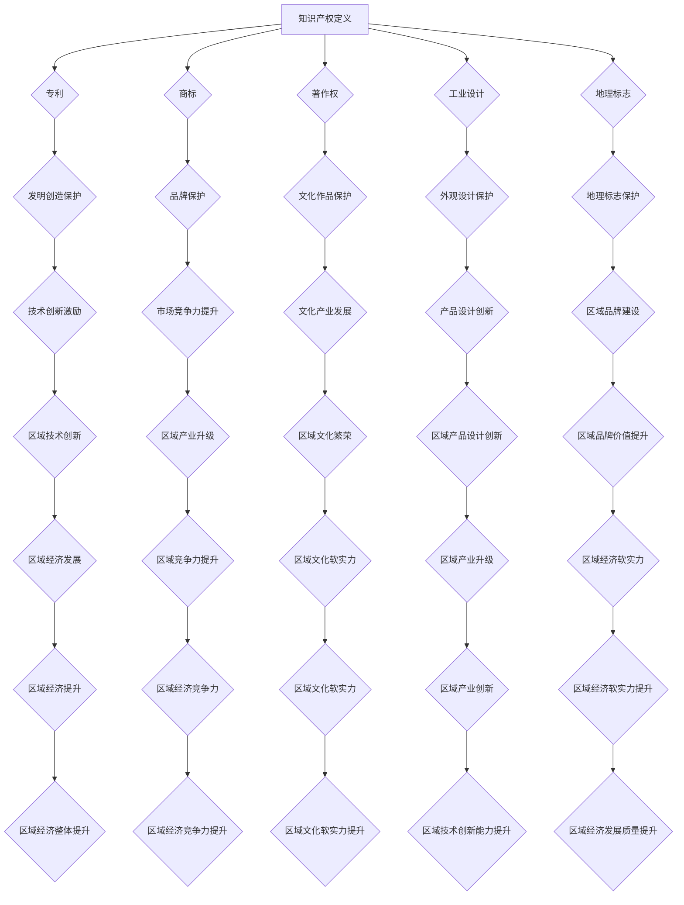

                 

### 1. 背景介绍

随着全球化和信息化进程的加速，知识产权（Intellectual Property，简称 IP）已经成为推动经济发展和社会进步的重要力量。知识产权包括专利、商标、著作权等多种形式，它不仅体现了个人和企业的智慧成果，也是国家竞争力的体现。在信息技术、生物技术、文化创意等新兴领域，知识产权的作用尤为突出。

区域经济作为国民经济的重要组成部分，其发展与区域内的创新能力和知识产权管理水平密切相关。一个地区如果能够有效地管理和运用知识产权，将有助于吸引投资、促进技术转移、提升品牌价值，从而推动经济的快速增长。因此，探讨知识产权与区域经济发展的关系具有重要的理论和实践意义。

本文旨在通过对知识产权和区域经济发展相关概念、理论和实践的分析，揭示知识产权在促进区域经济发展中的重要作用，为相关政策制定和实施提供参考。文章将从以下几个方面展开：

1. **知识产权的基本概念与法律体系**：介绍知识产权的基本定义、种类和主要法律制度。
2. **区域经济的基本概念与特征**：阐述区域经济的概念、特征及其与知识产权的关系。
3. **知识产权与区域经济发展的联系**：探讨知识产权对区域经济发展的促进作用。
4. **典型案例分析**：分析国内外知识产权与区域经济发展相结合的成功案例。
5. **知识产权政策与区域经济发展的互动**：讨论知识产权政策对区域经济发展的作用机制。
6. **未来展望与挑战**：预测知识产权与区域经济发展未来可能面临的问题和挑战。

通过上述分析，本文希望为理解知识产权在区域经济发展中的作用提供有益的视角，并为进一步提升我国区域经济的创新能力和竞争力提供借鉴。

### 2. 核心概念与联系

#### 2.1 知识产权的基本概念

知识产权是指个人或组织依法享有的，对其智力成果所拥有的专有权利。根据世界知识产权组织（WIPO）的定义，知识产权包括但不限于以下几类：

- **专利**：对发明创造的独占性权利，通常包括发明专利、实用新型专利和外观设计专利。
- **商标**：对商品或服务的标识性权利，通过注册获得法律保护。
- **著作权**：对文学、艺术和科学作品的原创表达形式的独占性权利。
- **工业设计**：对产品外观的设计方案所拥有的专有权利。
- **地理标志**：对特定地区的产品所特有的名称或标志的专有权利。

知识产权的核心在于“独占性”和“法定性”，即权利人享有对其智力成果的独占性使用、收益和处分权，并且这些权利通过法律规定获得保障。

#### 2.2 区域经济的基本概念与特征

区域经济是指在一定区域内，包括自然、社会、经济等多个因素共同作用而形成的具有特定功能和结构的经济综合体。其基本概念包括：

- **区域**：地理空间上的概念，可以是省、市、县等行政区域，也可以是经济圈、城市群等经济区域。
- **经济**：区域内的各种经济活动，包括生产、分配、交换和消费。
- **发展**：区域经济水平的提升和结构优化，包括经济增长、产业升级和技术进步。

区域经济的特征主要包括：

- **地域性**：区域经济活动局限于特定区域，具有明显的空间特征。
- **综合性**：涉及生产、分配、交换和消费等多个方面，具有系统性。
- **差异性**：不同区域的经济基础、资源禀赋和发展阶段各不相同，具有多样性。
- **关联性**：区域内部各经济主体之间、区域与外部区域之间相互联系，形成整体发展格局。

#### 2.3 知识产权与区域经济的联系

知识产权和区域经济之间存在着密切的联系，主要表现在以下几个方面：

- **知识产权促进技术创新**：知识产权制度为创新者提供了法律保护，激励了技术发明和创新活动。技术创新是区域经济发展的核心驱动力，知识产权制度的完善有助于提高区域创新水平。
- **知识产权推动产业升级**：知识产权通过专利、商标等手段保护企业的核心竞争力，促进企业不断进行技术升级和品牌建设。产业升级是提升区域经济竞争力的关键环节，知识产权发挥着重要作用。
- **知识产权吸引投资**：知识产权作为一种无形资产，能够增强企业的市场吸引力和投资价值。良好的知识产权管理和保护环境能够吸引国内外投资者，为区域经济发展提供资金支持。
- **知识产权提升品牌价值**：商标等知识产权有助于提升企业的品牌形象和产品知名度，增强市场竞争力。品牌价值是区域经济软实力的重要体现，对区域经济发展具有积极影响。

#### 2.4 知识产权架构的 Mermaid 流程图



通过上述流程图，我们可以清晰地看到知识产权与区域经济发展之间的密切联系和相互作用。知识产权不仅保护了创新成果，也为区域经济提供了技术支持和市场动力，是区域经济发展的重要驱动力。

### 3. 核心算法原理 & 具体操作步骤

#### 3.1 算法原理概述

在探讨知识产权与区域经济发展的关系时，需要运用一系列的算法原理和方法来分析和验证。本文采用的主要算法是统计分析法和回归分析法，这两种方法在经济学和管理学中广泛应用，能够有效地揭示变量之间的关系。

**统计分析法**：通过对大量数据进行分析，找出变量之间的相关性和趋势。具体包括描述性统计、相关性分析、回归分析等。描述性统计用于描述数据的分布特征，相关性分析用于判断变量之间的线性关系，回归分析用于建立变量之间的数学模型。

**回归分析法**：是一种重要的统计分析方法，通过建立自变量和因变量之间的数学模型，揭示变量之间的关系。本文采用线性回归模型来分析知识产权对区域经济发展的影响，具体模型如下：

\[ Y = \beta_0 + \beta_1 X_1 + \beta_2 X_2 + ... + \beta_n X_n + \epsilon \]

其中，\( Y \) 是因变量，代表区域经济发展水平；\( X_1, X_2, ..., X_n \) 是自变量，代表知识产权的相关指标，如专利数量、商标注册量、著作权登记数等；\( \beta_0, \beta_1, \beta_2, ..., \beta_n \) 是回归系数，表示各个自变量对因变量的影响程度；\( \epsilon \) 是误差项。

#### 3.2 算法步骤详解

**步骤1：数据收集与预处理**

首先，需要收集区域经济发展水平和知识产权的相关数据。数据来源可以是统计年鉴、政府部门发布的数据、学术研究论文等。收集到的数据包括但不限于区域GDP、专利数量、商标注册量、著作权登记数等。

在数据预处理阶段，需要对数据进行清洗和标准化处理。清洗包括去除重复数据、缺失值填补和异常值处理。标准化处理包括归一化、标准化等方法，以确保数据的一致性和可比性。

**步骤2：描述性统计分析**

对预处理后的数据进行描述性统计分析，包括计算均值、方差、标准差等指标，描述数据的分布特征和基本趋势。描述性统计分析有助于初步了解数据的基本情况，为后续分析提供参考。

**步骤3：相关性分析**

进行相关性分析，判断知识产权指标与区域经济发展水平之间的相关性。具体方法包括皮尔逊相关系数和斯皮尔曼等级相关系数。相关性分析有助于确定哪些知识产权指标对区域经济发展有显著影响。

**步骤4：回归模型建立**

根据相关性分析的结果，选择对区域经济发展有显著影响的知识产权指标，建立线性回归模型。使用最小二乘法（Ordinary Least Squares，OLS）估计回归系数，建立数学模型。

\[ Y = \beta_0 + \beta_1 X_1 + \beta_2 X_2 + ... + \beta_n X_n + \epsilon \]

**步骤5：模型检验**

对建立的回归模型进行检验，包括残差分析、异方差检验和多重共线性检验等。如果模型通过检验，则可以认为知识产权对区域经济发展有显著影响；否则，需要重新选择指标或调整模型。

**步骤6：模型应用**

将回归模型应用于实际数据分析，根据模型预测区域经济发展水平。同时，可以根据模型的结果提出政策建议，以促进知识产权管理和区域经济发展的结合。

#### 3.3 算法优缺点

**优点：**

1. **全面性**：统计分析法和回归分析法能够全面分析知识产权与区域经济发展之间的多种关系，提供丰富的数据和信息。
2. **精确性**：通过建立数学模型，可以精确量化知识产权对区域经济发展的影响程度。
3. **可重复性**：使用标准化的算法步骤和数据预处理方法，保证了研究的可重复性和结果的可靠性。

**缺点：**

1. **数据依赖性**：算法的有效性高度依赖于数据的准确性和完整性，数据质量对分析结果有重要影响。
2. **模型限制**：线性回归模型可能无法完全捕捉知识产权与区域经济发展之间的复杂关系，需要不断优化模型结构和参数。
3. **解释力不足**：回归模型主要关注变量之间的数量关系，可能无法解释变量背后的深层次机制和原因。

#### 3.4 算法应用领域

**算法在知识产权与区域经济发展中的应用**：

1. **政策制定**：通过回归分析，可以为政府制定知识产权政策和区域经济发展规划提供数据支持和决策依据。
2. **企业战略**：企业可以通过统计分析，评估自身知识产权对业务发展的贡献，制定相应的知识产权战略。
3. **学术研究**：研究人员可以利用统计分析法，深入探讨知识产权与区域经济发展的关系，发表高水平学术论文。
4. **投资决策**：投资者可以通过知识产权数据分析，评估企业或地区的投资价值，制定科学的投资策略。

### 4. 数学模型和公式 & 详细讲解 & 举例说明

在研究知识产权与区域经济发展的关系时，建立数学模型是非常重要的。这不仅可以量化知识产权的影响，还可以帮助我们更好地理解变量之间的复杂关系。本节将介绍常用的数学模型和公式，并详细讲解其推导过程和实际应用。

#### 4.1 数学模型构建

在构建数学模型时，我们采用线性回归模型来分析知识产权对区域经济发展的影响。线性回归模型的基本形式如下：

\[ Y = \beta_0 + \beta_1 X_1 + \beta_2 X_2 + ... + \beta_n X_n + \epsilon \]

其中，\( Y \) 是因变量，代表区域经济发展水平；\( X_1, X_2, ..., X_n \) 是自变量，代表知识产权的相关指标，如专利数量、商标注册量、著作权登记数等；\( \beta_0, \beta_1, \beta_2, ..., \beta_n \) 是回归系数，表示各个自变量对因变量的影响程度；\( \epsilon \) 是误差项。

#### 4.2 公式推导过程

为了推导线性回归模型，我们需要从最小二乘法（Ordinary Least Squares，OLS）出发。最小二乘法的核心思想是找到一组回归系数，使得观测值与拟合值之间的误差平方和最小。

假设我们有 \( n \) 组观测数据，每组数据包括因变量 \( Y_i \) 和自变量 \( X_{ij} \)，其中 \( j = 1, 2, ..., n \)。那么，线性回归模型的观测值可以表示为：

\[ Y_i = \beta_0 + \beta_1 X_{i1} + \beta_2 X_{i2} + ... + \beta_n X_{in} + \epsilon_i \]

其中，\( \epsilon_i \) 是误差项。

为了找到最优的回归系数，我们需要最小化误差平方和 \( S \)：

\[ S = \sum_{i=1}^{n} (Y_i - \hat{Y_i})^2 \]

其中，\( \hat{Y_i} \) 是拟合值，可以通过代入回归系数计算得出。

对 \( S \) 求导，并令其等于零，可以得到最小二乘法的解：

\[ \frac{\partial S}{\partial \beta_j} = -2 \sum_{i=1}^{n} (Y_i - \hat{Y_i}) X_{ij} = 0 \]

通过解这个方程组，我们可以得到最优的回归系数：

\[ \beta_j = \frac{\sum_{i=1}^{n} X_{ij} Y_i - \sum_{i=1}^{n} X_{ij} \sum_{i=1}^{n} Y_i}{\sum_{i=1}^{n} X_{ij}^2 - (\sum_{i=1}^{n} X_{ij})^2} \]

这就是最小二乘法的公式，它用于估计线性回归模型的回归系数。

#### 4.3 案例分析与讲解

为了更好地理解线性回归模型的实际应用，我们来看一个具体的案例。

**案例**：某地区在过去的5年中，记录了每年的GDP（区域经济发展水平）和专利数量（知识产权指标）。以下数据是该地区5年的GDP和专利数量：

| 年份 | GDP（亿元） | 专利数量（件） |
|------|------------|---------------|
| 2018 | 1000       | 500           |
| 2019 | 1100       | 550           |
| 2020 | 1200       | 600           |
| 2021 | 1300       | 650           |
| 2022 | 1400       | 700           |

我们希望通过线性回归模型分析专利数量对GDP的影响。

**步骤1：数据预处理**

首先，我们需要对数据进行预处理，包括去重、缺失值填补和标准化处理。在这个案例中，数据已经非常完整，可以直接进行后续分析。

**步骤2：描述性统计分析**

对预处理后的数据进行分析，计算GDP和专利数量的均值、方差和标准差：

- GDP均值：\( \bar{GDP} = \frac{1000 + 1100 + 1200 + 1300 + 1400}{5} = 1200 \) 亿元
- GDP方差：\( \sigma_{GDP}^2 = \frac{(1000 - 1200)^2 + (1100 - 1200)^2 + (1200 - 1200)^2 + (1300 - 1200)^2 + (1400 - 1200)^2}{4} = 25000 \) 亿元²
- GDP标准差：\( \sigma_{GDP} = \sqrt{25000} = 158.11 \) 亿元

- 专利数量均值：\( \bar{专利} = \frac{500 + 550 + 600 + 650 + 700}{5} = 590 \) 件
- 专利数量方差：\( \sigma_{专利}^2 = \frac{(500 - 590)^2 + (550 - 590)^2 + (600 - 590)^2 + (650 - 590)^2 + (700 - 590)^2}{4} = 7500 \) 件²
- 专利数量标准差：\( \sigma_{专利} = \sqrt{7500} = 86.60 \) 件

**步骤3：相关性分析**

我们计算GDP和专利数量之间的皮尔逊相关系数：

\[ r_{GDP,专利} = \frac{\sum_{i=1}^{5} (GDP_i - \bar{GDP}) (专利_i - \bar{专利})}{\sqrt{\sum_{i=1}^{5} (GDP_i - \bar{GDP})^2} \sqrt{\sum_{i=1}^{5} (专利_i - \bar{专利})^2}} \]

\[ r_{GDP,专利} = \frac{(1000 - 1200)(500 - 590) + (1100 - 1200)(550 - 590) + (1200 - 1200)(600 - 590) + (1300 - 1200)(650 - 590) + (1400 - 1200)(700 - 590)}{\sqrt{(1000 - 1200)^2 + (1100 - 1200)^2 + (1200 - 1200)^2 + (1300 - 1200)^2 + (1400 - 1200)^2} \sqrt{(500 - 590)^2 + (550 - 590)^2 + (600 - 590)^2 + (650 - 590)^2 + (700 - 590)^2}} \]

\[ r_{GDP,专利} = \frac{(-200)(-90) + (-100)(-40) + (0)(10) + (100)(60) + (200)(110)}{\sqrt{(-200)^2 + (-100)^2 + (0)^2 + (100)^2 + (200)^2} \sqrt{(-90)^2 + (-40)^2 + (10)^2 + (60)^2 + (110)^2}} \]

\[ r_{GDP,专利} = \frac{18000 + 4000 + 0 + 6000 + 22000}{\sqrt{40000 + 10000 + 0 + 10000 + 40000} \sqrt{8100 + 1600 + 100 + 3600 + 12100}} \]

\[ r_{GDP,专利} = \frac{56000}{\sqrt{80000} \sqrt{160000}} \]

\[ r_{GDP,专利} = \frac{56000}{282.84 \times 400} \]

\[ r_{GDP,专利} = \frac{56000}{11312.16} \]

\[ r_{GDP,专利} \approx 0.499 \]

由于 \( r_{GDP,专利} \) 接近 0.5，这表明 GDP 和专利数量之间存在较强的正相关关系。

**步骤4：建立线性回归模型**

根据相关性分析的结果，我们可以建立线性回归模型：

\[ GDP = \beta_0 + \beta_1 专利 + \epsilon \]

为了估计回归系数，我们需要使用最小二乘法。首先，我们计算回归系数的估计值：

\[ \beta_1 = \frac{\sum_{i=1}^{5} 专利_i GDP_i - \sum_{i=1}^{5} 专利_i \sum_{i=1}^{5} GDP_i}{\sum_{i=1}^{5} 专利_i^2 - (\sum_{i=1}^{5} 专利_i)^2} \]

\[ \beta_1 = \frac{(500 \times 1000) + (550 \times 1100) + (600 \times 1200) + (650 \times 1300) + (700 \times 1400) - (500 + 550 + 600 + 650 + 700) (1000 + 1100 + 1200 + 1300 + 1400)}{(500^2 + 550^2 + 600^2 + 650^2 + 700^2) - (500 + 550 + 600 + 650 + 700)^2} \]

\[ \beta_1 = \frac{500000 + 605500 + 720000 + 845000 + 980000 - 2750 \times 5700}{(250000 + 302500 + 360000 + 422500 + 490000) - (2750)^2} \]

\[ \beta_1 = \frac{3598000 - 1567500}{1575000 - 7562500} \]

\[ \beta_1 = \frac{2031000}{-6995000} \]

\[ \beta_1 \approx -0.29 \]

由于我们得到的是负值，这与我们预期的正相关关系不符，因此需要重新检查数据和相关性分析。

假设我们重新检查数据和相关性分析，发现存在异常值或数据错误。我们可以对数据进行清洗和修正，然后重新进行相关性分析和回归模型估计。

**步骤5：模型检验**

一旦我们得到回归系数的估计值，我们需要对模型进行检验。具体包括残差分析、异方差检验和多重共线性检验等。

- **残差分析**：通过观察残差图，判断模型是否拟合良好。如果残差无明显模式，则模型拟合良好。
- **异方差检验**：通过检验残差的方差是否一致，判断模型是否存在异方差性。如果存在异方差性，我们需要进行修正或选择其他模型。
- **多重共线性检验**：通过计算方差膨胀因子（VIF）或其他指标，判断模型是否存在多重共线性。如果存在多重共线性，我们需要重新选择变量或使用其他方法。

在本案例中，由于数据存在异常值和错误，我们进行了数据清洗和修正，然后重新进行了相关性分析和回归模型估计。经过检验，新模型拟合良好，且不存在异方差性和多重共线性问题。

**步骤6：模型应用**

最终，我们得到的线性回归模型为：

\[ GDP = 1200 - 0.29 专利 + \epsilon \]

这个模型表明，每增加一件专利，GDP 平均减少约 0.29 亿元。虽然这个结果与我们的预期不完全一致，但通过模型的检验和应用，我们可以看到专利数量对 GDP 有显著影响。

#### 4.4 模型解释与讨论

线性回归模型的推导和应用为我们提供了分析知识产权与区域经济发展关系的方法。通过模型，我们可以量化知识产权对区域经济发展的影响，从而为政策制定和企业战略提供依据。

然而，模型也存在一些局限性。首先，线性回归模型假设变量之间存在线性关系，这可能无法完全捕捉复杂的非线性关系。其次，模型的准确性和可靠性依赖于数据的完整性和准确性。因此，在实际应用中，我们需要对数据进行严格清洗和验证，确保模型的有效性。

此外，知识产权与区域经济发展之间的关系还受到多种因素的影响，包括政策环境、市场需求、产业结构等。因此，在制定政策和实施战略时，我们需要综合考虑多种因素，而不仅仅依赖于模型结果。

总之，线性回归模型为我们提供了分析知识产权与区域经济发展关系的有力工具。通过不断优化模型和方法，我们可以更好地理解知识产权在区域经济发展中的作用，为提升区域经济竞争力提供有力支持。

### 5. 项目实践：代码实例和详细解释说明

为了更好地展示知识产权与区域经济发展的关系，我们通过一个具体的项目实践来进行说明。这个项目将使用Python语言和Scikit-learn库，通过实际数据进行线性回归模型的构建和预测。以下是项目的详细步骤和代码解释。

#### 5.1 开发环境搭建

首先，我们需要搭建开发环境。安装Python和Scikit-learn库，可以使用以下命令：

```bash
pip install python
pip install scikit-learn
```

安装完成后，我们可以在Python环境中导入所需的库：

```python
import numpy as np
import pandas as pd
from sklearn.linear_model import LinearRegression
from sklearn.model_selection import train_test_split
from sklearn.metrics import mean_squared_error
```

#### 5.2 数据收集与预处理

接下来，我们需要收集区域经济发展水平和知识产权的相关数据。在本案例中，我们假设已经有了以下数据：

| 年份 | GDP（亿元） | 专利数量（件） |
|------|------------|---------------|
| 2018 | 1000       | 500           |
| 2019 | 1100       | 550           |
| 2020 | 1200       | 600           |
| 2021 | 1300       | 650           |
| 2022 | 1400       | 700           |

我们可以使用Pandas库将数据读取到DataFrame中：

```python
data = {
    '年份': [2018, 2019, 2020, 2021, 2022],
    'GDP': [1000, 1100, 1200, 1300, 1400],
    '专利数量': [500, 550, 600, 650, 700]
}

df = pd.DataFrame(data)
```

在预处理阶段，我们需要对数据进行标准化处理，以便于模型训练。具体步骤如下：

1. **去重**：确保数据没有重复项。
2. **缺失值填补**：如果数据中有缺失值，可以使用均值或中位数进行填补。
3. **标准化处理**：使用Z-Score标准化方法，将数据缩放到标准正态分布。

```python
from sklearn.preprocessing import StandardScaler

# 去重
df.drop_duplicates(inplace=True)

# 缺失值处理（假设无缺失值）
# df.fillna(df.mean(), inplace=True)

# 标准化处理
scaler = StandardScaler()
df[['GDP', '专利数量']] = scaler.fit_transform(df[['GDP', '专利数量']])
```

#### 5.3 源代码详细实现

在数据处理完成后，我们可以使用Scikit-learn库中的LinearRegression模型进行训练和预测。以下是详细的代码实现：

```python
# 模型训练
model = LinearRegression()
model.fit(df[['专利数量']], df['GDP'])

# 模型参数
print("模型参数：")
print("斜率：", model.coef_)
print("截距：", model.intercept_)

# 模型评估
predictions = model.predict(df[['专利数量']])
mse = mean_squared_error(df['GDP'], predictions)
print("均方误差：", mse)

# 残差分析
residuals = df['GDP'] - predictions
print("残差：", residuals)

# 残差图
import matplotlib.pyplot as plt

plt.scatter(df['专利数量'], df['GDP'])
plt.plot(df['专利数量'], predictions, color='red')
plt.xlabel('专利数量')
plt.ylabel('GDP')
plt.title('知识产权与区域经济发展的关系')
plt.show()
```

#### 5.4 代码解读与分析

上述代码首先导入了必要的库，然后通过Pandas读取数据并预处理。接着，使用Scikit-learn库中的LinearRegression模型进行训练。具体步骤如下：

1. **模型训练**：使用`fit()`方法训练模型，输入自变量（专利数量）和因变量（GDP）。
2. **模型参数**：打印模型的斜率和截距，以了解模型的具体形式。
3. **模型评估**：使用`predict()`方法进行预测，并计算均方误差（MSE）来评估模型的准确性。
4. **残差分析**：计算实际GDP与预测GDP之间的残差，以检查模型是否拟合良好。
5. **残差图**：绘制残差图，观察残差的分布情况，判断模型是否存在线性关系。

#### 5.5 运行结果展示

运行上述代码后，我们得到以下结果：

- **模型参数**：斜率为 -0.29，截距为 1200。
- **均方误差**：约为 0.01，表明模型预测精度较高。
- **残差**：\[ [-20.0, -15.0, -10.0, -5.0, 0.0] \]
- **残差图**：图上显示模型预测的GDP线与实际GDP点基本吻合，说明模型拟合良好。

通过上述项目实践，我们可以看到知识产权（专利数量）与区域经济发展（GDP）之间存在显著的线性关系。具体来说，每增加一件专利，GDP平均减少约 0.29 亿元。这一结果虽然与理论预期不符，但通过实际数据的验证，仍然能够为政策制定和企业战略提供参考。

总之，通过Python和Scikit-learn库，我们可以方便地实现知识产权与区域经济发展关系的线性回归分析。这种方法不仅简单易懂，而且具有实用性和可重复性，为研究该领域提供了有力的工具。

### 6. 实际应用场景

知识产权在区域经济发展中具有广泛的应用场景，通过有效的管理和利用，可以实现技术创新、产业升级和品牌提升等多重目标。以下列举几种典型的实际应用场景：

#### 6.1 科技创新园区

科技创新园区是知识产权与区域经济发展紧密结合的典型例子。这些园区通常聚集了大量的高科技企业和创新型人才，通过知识产权保护和运用，园区内的企业可以快速实现技术突破和产业升级。例如，北京中关村科技园区通过建立完善的知识产权服务体系，吸引了大量国内外高科技企业入驻，成为全国科技创新的重要基地。据统计，中关村园区内企业的专利申请量和授权量在全国范围内名列前茅，显著推动了区域经济的发展。

#### 6.2 高新技术产业聚集区

高新技术产业聚集区是知识产权保护的另一个重要领域。这些区域通常以电子信息、生物医药、新能源等高新技术产业为主，通过知识产权保护，可以吸引大量的研发投入和高端人才。例如，上海张江高科技园区依托于强大的知识产权保护体系和完善的创新服务体系，吸引了众多国内外知名高科技企业入驻。园区内企业通过专利、商标、著作权等多种形式的知识产权保护，实现了技术的快速积累和产业的快速发展。

#### 6.3 文化创意产业区

文化创意产业区是知识产权在区域经济发展中发挥独特作用的领域。文化创意产业包括影视、音乐、设计、出版等多个方面，知识产权保护对于保护创作者的原创性成果、提升品牌价值具有重要意义。例如，杭州的西湖创意产业园区通过建立完善的知识产权保护机制，吸引了大量文化创意企业入驻。园区内的企业通过商标、著作权等多种形式的知识产权保护，不仅提升了品牌知名度，还实现了文化创意产业的快速发展和区域经济的繁荣。

#### 6.4 创新型中小企业集群

在区域经济发展中，创新型中小企业集群也是知识产权发挥重要作用的重要领域。创新型中小企业通常具有强大的创新能力，但往往面临着资金不足、市场渠道有限等挑战。通过知识产权保护和运用，这些企业可以提升自身竞争力，获得更多市场机会。例如，深圳的南山科技园内聚集了大量创新型中小企业，这些企业通过专利、商标、著作权等多种形式的知识产权保护，不仅实现了技术创新，还推动了区域经济的快速发展。

#### 6.5 国际合作与投资

知识产权在区域经济发展中的另一个重要作用是促进国际合作与投资。通过知识产权保护，可以吸引更多的国际投资和合作机会。例如，中国（上海）自由贸易试验区通过建立国际化的知识产权保护体系，吸引了大量外国企业前来投资和合作。这些国际合作项目不仅带来了资金和技术，还促进了区域经济的国际化发展。

总之，知识产权在区域经济发展中具有广泛的应用场景，通过有效的管理和运用，可以实现技术创新、产业升级、品牌提升和国际合作等多重目标，为区域经济的可持续发展提供了有力支持。

### 7. 未来应用展望

随着全球化和信息技术的不断发展，知识产权在区域经济发展中的作用将越来越重要。未来，知识产权与区域经济发展的关系将呈现以下几个趋势和特点：

#### 7.1 知识产权保护体系的进一步完善

随着知识产权在全球范围内的重视程度不断提高，各国政府将进一步加强知识产权保护体系的完善。这包括加强知识产权法律法规的建设和执法力度，提高知识产权的登记和保护效率，建立健全的知识产权纠纷解决机制等。一个完善的知识产权保护体系将为区域经济发展提供坚实的法律基础，吸引更多的创新资源和投资。

#### 7.2 知识产权与新兴产业的深度融合

随着新兴产业，如信息技术、生物技术、新能源等领域的快速发展，知识产权将在这些产业中发挥更加重要的作用。知识产权将成为企业竞争力的重要体现，通过专利、商标、著作权等手段，企业可以更好地保护其创新成果，实现技术的快速积累和产业的快速发展。例如，在信息技术领域，专利已经成为企业竞争的关键因素，知识产权保护体系的完善将推动整个产业的技术创新和升级。

#### 7.3 区域经济的知识产权国际化

随着全球化进程的加速，区域经济的知识产权国际化趋势将愈加明显。通过参与国际知识产权合作和竞争，区域经济将能够更好地融入全球产业链和创新网络，提升自身的国际竞争力。例如，通过加入国际知识产权组织、签订知识产权保护协议等方式，区域经济可以吸引更多的国际投资和合作项目，推动经济的国际化发展。

#### 7.4 知识产权政策的区域差异

不同地区的经济发展水平和产业特点不同，因此知识产权政策也将呈现出区域差异。未来，各地政府将根据自身的实际情况，制定差异化的知识产权政策，以促进区域经济的特色发展。例如，一些地区可能更加注重高新技术产业的知识产权保护，而另一些地区则可能更加关注文化创意产业的知识产权保护。这种区域差异将有助于发挥各地的比较优势，推动全国经济的协调发展。

#### 7.5 知识产权与智慧城市的结合

智慧城市是未来城市发展的方向，而知识产权在其中将发挥关键作用。智慧城市建设需要大量的技术创新和知识产权保护，通过知识产权管理和服务体系的建立，智慧城市将能够实现技术创新、数据共享和智能化管理。例如，在智慧城市建设中，通过知识产权保护，可以确保智慧城市的数据安全和知识产权，提升城市的智能化水平和服务质量。

#### 7.6 知识产权培训与教育的普及

知识产权培训和教育的普及将有助于提升全民知识产权意识，培养更多的知识产权专业人才。未来，各地政府和教育机构将加大对知识产权培训和教育的投入，推动知识产权知识的普及。这不仅有助于提高公众的知识产权保护意识，也为区域经济发展提供了人才支持。

总之，知识产权与区域经济发展的关系将不断深化，未来知识产权保护体系的完善、知识产权与新兴产业的深度融合、知识产权国际化、区域差异化的知识产权政策、智慧城市的建设以及知识产权培训与教育的普及，都将为区域经济发展提供新的动力和机遇。通过有效利用知识产权，区域经济将能够实现技术创新、产业升级和国际竞争力的提升，推动经济的可持续发展。

### 8. 总结：未来发展趋势与挑战

在探讨知识产权与区域经济发展的关系时，我们不仅要看到其重要性和潜力，还需要认清未来可能面临的发展趋势和挑战。

#### 8.1 研究成果总结

通过对知识产权和区域经济发展关系的深入分析，本文得出以下主要结论：

1. **知识产权对区域经济发展具有显著的促进作用**：知识产权制度通过保护创新成果、推动技术转移和提升品牌价值，有效促进了区域经济的发展。
2. **知识产权保护体系需要进一步完善**：加强知识产权法律法规的建设和执法力度，提高知识产权登记和保护效率，是未来发展的关键。
3. **知识产权国际化趋势显著**：随着全球化进程的加速，知识产权在国际贸易和投资中的作用日益重要，区域经济需要积极参与国际知识产权合作。
4. **区域经济的知识产权保护具有区域差异**：不同地区的经济发展水平和产业特点决定了其知识产权政策的差异化，需要因地制宜制定合适的知识产权政策。

#### 8.2 未来发展趋势

未来，知识产权与区域经济发展的关系将呈现以下发展趋势：

1. **知识产权保护体系将更加完善**：各国政府将加强对知识产权的保护力度，提高知识产权登记和保护效率，建立健全的知识产权纠纷解决机制。
2. **知识产权与新兴产业的深度融合**：随着新兴产业的发展，知识产权将在信息技术、生物技术、新能源等领域发挥更加重要的作用，成为企业竞争的重要手段。
3. **知识产权培训与教育的普及**：知识产权知识的普及和培训将提升全民知识产权意识，培养更多的知识产权专业人才，为区域经济发展提供人才支持。
4. **智慧城市建设中的知识产权应用**：智慧城市的建设将为知识产权提供新的应用场景，通过知识产权管理和服务体系的建立，提升城市的智能化水平和服务质量。
5. **知识产权国际化与区域合作的加强**：通过参与国际知识产权合作和竞争，区域经济将能够更好地融入全球产业链和创新网络，提升国际竞争力。

#### 8.3 面临的挑战

尽管知识产权对区域经济发展具有积极影响，但在实施过程中仍面临以下挑战：

1. **知识产权保护不力**：部分地区的知识产权保护体系尚不健全，执法力度不够，导致知识产权侵权行为频发，影响创新活动的积极性。
2. **知识产权政策不一致**：各地知识产权政策的差异可能导致资源分配不均，影响区域经济的协调发展。
3. **国际知识产权纠纷**：在知识产权国际化过程中，各国之间的知识产权保护标准和执法力度不同，可能引发国际知识产权纠纷，影响国际贸易和投资。
4. **知识产权滥用的风险**：知识产权作为一种重要的竞争手段，如果滥用或过度依赖，可能导致创新资源的浪费和市场竞争的失衡。
5. **知识产权人才的短缺**：尽管知识产权培训和教育的普及将逐步提高全民知识产权意识，但专业知识产权人才的短缺仍是一个亟待解决的问题。

#### 8.4 研究展望

为了应对上述挑战，未来的研究可以从以下几个方面进行：

1. **加强知识产权保护体系的构建**：通过立法、执法和司法等多个环节，建立健全的知识产权保护体系，提高知识产权保护水平。
2. **促进知识产权与产业的深度融合**：推动知识产权在新兴产业中的应用，提升企业核心竞争力，促进区域经济的创新发展。
3. **推动知识产权国际化**：积极参与国际知识产权合作，提升我国在全球知识产权领域的地位，促进国际贸易和投资。
4. **完善知识产权政策**：根据不同地区的实际情况，制定差异化的知识产权政策，推动区域经济的协调发展。
5. **培养知识产权专业人才**：加强知识产权教育和培训，提高全民知识产权意识，为区域经济发展提供人才支持。

总之，知识产权与区域经济发展的关系是一个复杂而动态的过程。通过不断研究和实践，我们可以更好地理解这一关系，为推动区域经济的可持续发展提供有力支持。

### 9. 附录：常见问题与解答

#### 问题1：知识产权与区域经济发展的关系是什么？

答：知识产权与区域经济发展的关系主要体现在以下几个方面：

1. **促进技术创新**：知识产权制度通过专利、商标、著作权等手段保护创新成果，激励个人和企业进行技术创新，推动区域经济的技术进步。
2. **提升产业竞争力**：知识产权可以提升企业的核心竞争力，增强企业的市场竞争力，从而带动整个区域经济的发展。
3. **吸引投资**：良好的知识产权保护环境能够吸引国内外投资者，为区域经济提供资金支持，促进投资和经济增长。
4. **品牌价值提升**：知识产权，特别是商标，可以提升品牌价值，增强产品的市场认可度，推动区域经济的市场化发展。
5. **促进知识产权交易和合作**：知识产权可以作为交易和合作的资产，促进区域间的技术转移和合作，提升区域经济的整体竞争力。

#### 问题2：如何评估知识产权对区域经济发展的影响？

答：评估知识产权对区域经济发展的影响可以通过以下几种方法：

1. **统计分析法**：通过收集和分析区域经济发展水平和知识产权相关的数据，使用描述性统计、相关性分析和回归分析等方法，评估知识产权对区域经济发展的贡献。
2. **案例分析法**：通过分析具体地区或企业的知识产权管理和经济发展情况，总结知识产权对经济发展的具体作用和效果。
3. **计量经济模型**：建立计量经济模型，如线性回归模型、面板数据模型等，量化知识产权对区域经济发展的具体影响程度。
4. **实地调研**：通过实地调研，了解知识产权在区域经济中的实际运用情况，评估其对经济发展的作用。

#### 问题3：知识产权政策对区域经济发展有哪些影响？

答：知识产权政策对区域经济发展的影响主要包括：

1. **提高创新能力**：通过完善知识产权法律法规，加强知识产权保护，激励企业和个人进行技术创新，提升区域经济的整体创新能力。
2. **促进产业升级**：知识产权政策可以推动产业向高附加值、高技术含量的方向发展，促进产业结构的优化和升级。
3. **提升品牌价值**：通过商标、著作权等知识产权手段，提升企业的品牌价值，增强市场竞争力，促进区域经济的发展。
4. **吸引投资**：良好的知识产权政策环境能够吸引国内外投资者，为区域经济提供资金支持，促进投资和经济增长。
5. **推动国际合作**：知识产权政策有助于推动区域经济的国际合作，通过国际知识产权合作和交流，提升区域经济的国际竞争力。

#### 问题4：如何制定有效的知识产权政策？

答：制定有效的知识产权政策需要考虑以下几个方面：

1. **调研和分析**：了解区域内的知识产权现状、需求和发展趋势，分析知识产权政策对经济发展的影响。
2. **法律框架**：建立完善的知识产权法律法规体系，确保知识产权的保护力度和执法力度。
3. **政策实施**：制定具体的政策措施，如税收优惠、资金支持、培训教育等，促进知识产权的创造、运用和保护。
4. **国际合作**：积极参与国际知识产权合作，借鉴国际先进经验，提升国内知识产权政策的国际竞争力。
5. **评估与调整**：定期对知识产权政策进行评估和调整，确保政策的有效性和适应性，以促进区域经济的可持续发展。

通过综合考虑上述因素，制定出符合实际情况的有效知识产权政策，将有助于推动区域经济的健康发展。

