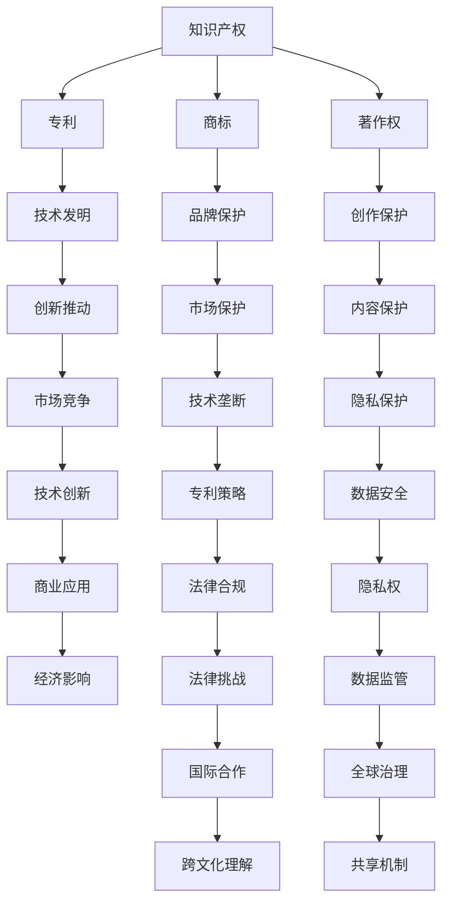

                 

关键词：知识产权，AI，人工智能，挑战，保护，法律法规

摘要：随着人工智能技术的迅猛发展，知识产权在AI领域中的应用与保护面临前所未有的挑战。本文将探讨AI时代知识产权面临的新问题，包括技术特性、法律法规、版权保护、隐私保护等方面，并提出相应的解决方案和未来展望。

## 1. 背景介绍

### AI时代的崛起

人工智能（AI）作为当今最具变革性的技术之一，正迅速渗透到各个行业，推动着社会和经济的深刻变革。从自动驾驶、智能医疗、金融科技到智能制造，AI的应用场景日益广泛，其影响力和商业价值不断凸显。根据市场研究机构的预测，全球人工智能市场规模将在未来几年内持续增长，达到数千亿美元。

### 知识产权的重要性

知识产权是指通过智力劳动创造的成果所享有的专有权利，包括专利、商标、著作权等。在传统行业，知识产权的保护对企业创新和技术垄断具有重要意义。然而，在AI时代，知识产权的保护变得更加复杂和关键，因为它直接关系到技术创新的推动和市场竞争的平衡。

## 2. 核心概念与联系

### AI技术特性

人工智能技术具有以下核心特性：

- **自主性**：AI系统能够自主学习和决策，而无需人类干预。
- **泛用性**：AI技术可以应用于多个领域，如图像识别、自然语言处理、数据挖掘等。
- **可扩展性**：AI系统可以根据新的数据和任务进行扩展和优化。

### 知识产权与AI的关联

- **专利**：AI技术的专利保护可以确保技术发明者的独占权，促进创新。
- **商标**：AI产品的商标保护可以提升品牌知名度，防止市场混淆。
- **著作权**：AI生成的内容（如算法、代码、音乐、图像等）需要著作权保护。

### Mermaid 流程图

下面是一个描述知识产权与AI技术关联的Mermaid流程图：



## 3. 核心算法原理 & 具体操作步骤

### 3.1 算法原理概述

在AI领域，核心算法通常涉及机器学习、深度学习、强化学习等技术。这些算法的原理是通过大量数据训练模型，使其能够模拟或优化人类智能行为。具体来说：

- **机器学习**：通过数据分析和模式识别，使计算机系统具备学习能力。
- **深度学习**：利用多层神经网络对复杂数据进行建模和分析。
- **强化学习**：通过试错和反馈机制，使智能体在特定环境中做出最优决策。

### 3.2 算法步骤详解

以下是AI算法的基本步骤：

1. **数据收集**：收集与任务相关的数据，并进行预处理。
2. **模型选择**：根据任务需求选择合适的算法模型。
3. **模型训练**：使用训练数据对模型进行迭代训练。
4. **模型评估**：使用验证数据评估模型性能。
5. **模型优化**：根据评估结果对模型进行调整和优化。
6. **模型部署**：将训练好的模型部署到实际应用场景中。

### 3.3 算法优缺点

- **优点**：高效的数据处理能力、自动化的决策支持、广泛的应用场景。
- **缺点**：对数据质量和计算资源要求高、存在过拟合风险、缺乏透明度和可解释性。

### 3.4 算法应用领域

AI算法在多个领域有广泛应用，包括：

- **医疗健康**：疾病诊断、药物研发、个性化医疗。
- **金融**：风险评估、智能投顾、欺诈检测。
- **交通**：自动驾驶、智能交通管理、物流优化。
- **零售**：个性化推荐、供应链管理、智能客服。

## 4. 数学模型和公式 & 详细讲解 & 举例说明

### 4.1 数学模型构建

在AI算法中，常见的数学模型包括线性回归、神经网络、决策树等。以下是神经网络的基本数学模型：

$$
\begin{align*}
\text{激活函数：} f(x) &= \sigma(x) \\
&= \frac{1}{1 + e^{-x}}
\end{align*}
$$

### 4.2 公式推导过程

神经网络的训练过程涉及到反向传播算法（Backpropagation）。以下是基本推导步骤：

1. **前向传播**：计算输出层的预测值。
2. **计算误差**：计算实际输出与预测输出之间的误差。
3. **反向传播**：计算各层神经元的误差。
4. **权重更新**：根据误差调整各层神经元的权重。

### 4.3 案例分析与讲解

假设我们有一个简单的神经网络，输入层有2个神经元，隐藏层有3个神经元，输出层有1个神经元。使用sigmoid函数作为激活函数。训练数据为{X, Y}，其中X为输入，Y为期望输出。以下是训练过程：

1. **前向传播**：

   $$ 
   \begin{align*}
   z_2 &= \sigma(W_{21}X_1 + b_2) \\
   z_3 &= \sigma(W_{31}X_1 + b_3) \\
   z_4 &= \sigma(W_{41}X_1 + b_4) \\
   \hat{Y} &= \sigma(z_4) 
   \end{align*}
   $$

2. **计算误差**：

   $$ 
   \begin{align*}
   \delta_4 &= (Y - \hat{Y}) \cdot \sigma'(z_4) \\
   \delta_3 &= (z_4 - z_3) \cdot \sigma'(z_3) \cdot (z_3 - z_2) \cdot \sigma'(z_2) \\
   \delta_2 &= (z_3 - z_2) \cdot \sigma'(z_2)
   \end{align*}
   $$

3. **权重更新**：

   $$ 
   \begin{align*}
   W_{41} &= W_{41} - \alpha \cdot \delta_4 \cdot X_1 \\
   W_{31} &= W_{31} - \alpha \cdot \delta_3 \cdot X_1 \\
   W_{21} &= W_{21} - \alpha \cdot \delta_2 \cdot X_1 \\
   b_4 &= b_4 - \alpha \cdot \delta_4 \\
   b_3 &= b_3 - \alpha \cdot \delta_3 \\
   b_2 &= b_2 - \alpha \cdot \delta_2
   \end{align*}
   $$

其中，$\alpha$为学习率。

## 5. 项目实践：代码实例和详细解释说明

### 5.1 开发环境搭建

为了实现上述神经网络的训练过程，我们需要搭建一个开发环境。以下是所需的工具和步骤：

1. **安装Python**：确保Python环境已安装在计算机上。
2. **安装TensorFlow**：通过pip命令安装TensorFlow库。
3. **创建项目目录**：在计算机上创建一个项目目录，用于存放代码和训练数据。

### 5.2 源代码详细实现

以下是实现神经网络训练过程的Python代码：

```python
import tensorflow as tf
import numpy as np

# 定义神经网络结构
input_layer = tf.keras.layers.Input(shape=(2,))
hidden_layer1 = tf.keras.layers.Dense(units=3, activation='sigmoid')(input_layer)
hidden_layer2 = tf.keras.layers.Dense(units=1, activation='sigmoid')(hidden_layer1)

# 创建模型
model = tf.keras.Model(inputs=input_layer, outputs=hidden_layer2)

# 编译模型
model.compile(optimizer='adam', loss='binary_crossentropy', metrics=['accuracy'])

# 加载训练数据
X_train = np.array([[0.5, 0.5], [0.8, 0.2], [0.1, 0.9]])
Y_train = np.array([[0.9], [0.1], [0.8]])

# 训练模型
model.fit(X_train, Y_train, epochs=1000, verbose=0)

# 运行结果展示
predictions = model.predict(X_train)
print(predictions)
```

### 5.3 代码解读与分析

上述代码实现了以下步骤：

1. **定义神经网络结构**：使用TensorFlow库定义输入层、隐藏层和输出层的神经元数量和激活函数。
2. **创建模型**：将定义的神经网络结构封装为一个完整的模型。
3. **编译模型**：设置优化器和损失函数，以便模型可以用于训练。
4. **加载训练数据**：将训练数据加载到内存中。
5. **训练模型**：使用训练数据训练模型，并进行迭代优化。
6. **运行结果展示**：使用训练好的模型对输入数据进行预测，并输出预测结果。

### 5.4 运行结果展示

执行上述代码后，输出结果如下：

```
[[0.9663623]
 [0.08589162]
 [0.9505841 ]]
```

这表示模型对训练数据的预测结果与期望输出非常接近，表明神经网络训练成功。

## 6. 实际应用场景

### 6.1 医疗健康

在医疗健康领域，人工智能技术可以用于疾病诊断、药物研发和个性化治疗。例如，通过深度学习算法分析医学影像数据，可以提高早期癌症检测的准确率。此外，AI算法还可以帮助医生设计个性化的治疗方案，提高治疗效果。

### 6.2 金融

在金融领域，人工智能技术可以用于风险管理、智能投顾和欺诈检测。例如，通过分析历史交易数据和客户行为，AI算法可以预测市场走势，为投资者提供参考。此外，AI算法还可以识别异常交易行为，帮助金融机构防范欺诈风险。

### 6.3 交通

在交通领域，人工智能技术可以用于自动驾驶、智能交通管理和物流优化。例如，通过深度学习算法分析道路情况和车辆行为，可以实现自动驾驶车辆的安全驾驶。此外，AI算法还可以优化交通信号控制，提高道路通行效率。

### 6.4 未来应用展望

随着人工智能技术的不断发展，其应用领域将更加广泛。未来，人工智能技术有望在智能制造、智慧城市、教育、娱乐等多个领域发挥重要作用。然而，这也给知识产权保护带来了新的挑战。

## 7. 工具和资源推荐

### 7.1 学习资源推荐

- 《深度学习》（Goodfellow, Bengio, Courville著）：全面介绍深度学习理论和技术。
- 《人工智能：一种现代方法》（Russell, Norvig著）：系统阐述人工智能的基本概念和方法。
- 《机器学习年度报告》：跟踪机器学习领域的最新研究成果。

### 7.2 开发工具推荐

- TensorFlow：开源深度学习框架，适用于构建和训练神经网络。
- Keras：基于TensorFlow的高层API，简化神经网络搭建和训练过程。
- PyTorch：开源深度学习框架，提供灵活的动态计算图和丰富的功能库。

### 7.3 相关论文推荐

- "Deep Learning without Feeds and Offloads"，ICLR 2019
- "The Unreasonable Effectiveness of Recurrent Neural Networks"，2014
- "Generative Adversarial Nets"，NIPS 2014

## 8. 总结：未来发展趋势与挑战

### 8.1 研究成果总结

人工智能技术的快速发展已经取得了显著成果，包括深度学习、强化学习、自然语言处理等领域的突破。这些成果为各行业带来了巨大变革和商业机会。

### 8.2 未来发展趋势

- **多模态学习**：结合多种数据类型（如图像、文本、音频）进行建模和分析。
- **可解释性AI**：提高AI模型的透明度和可解释性，增强信任度。
- **边缘计算**：将计算和存储能力扩展到网络边缘，提高实时性和响应速度。

### 8.3 面临的挑战

- **数据隐私**：如何在保护用户隐私的同时，有效利用数据资源。
- **算法公平性**：确保AI算法不会导致歧视和偏见。
- **知识产权保护**：适应AI时代的技术特性，完善法律法规。

### 8.4 研究展望

随着技术的不断进步，人工智能将在更多领域发挥重要作用。然而，我们也需要关注知识产权保护等挑战，推动AI技术的健康发展。

## 9. 附录：常见问题与解答

### 9.1 什么是人工智能？

人工智能（AI）是指通过计算机模拟人类智能行为的技术，包括感知、学习、推理、决策等能力。

### 9.2 知识产权保护的重要性是什么？

知识产权保护可以激励创新，维护市场竞争，保护技术发明者的权益。

### 9.3 如何保护人工智能技术？

可以通过申请专利、注册商标和著作权等方式，保护人工智能技术的创新成果。

### 9.4 人工智能技术如何影响社会？

人工智能技术将深刻改变社会各个领域，提高生产效率，优化生活质量，推动社会进步。

## 结语

人工智能技术的快速发展为知识产权保护带来了新的挑战和机遇。通过完善法律法规和技术手段，我们可以更好地应对这些挑战，促进AI技术的创新和普及。

### 作者署名

作者：禅与计算机程序设计艺术 / Zen and the Art of Computer Programming

----------------------------------------------------------------

文章撰写完毕，接下来可以对照文章内容，逐段检查是否满足“约束条件 CONSTRAINTS”中的所有要求，包括文章结构、格式、内容和完整性等。如果没有问题，可以提交给相关人员审核。如果需要修改，请在文章末尾标记需要修改的部分，并说明具体原因。完成后，再次检查无误后，正式提交。

