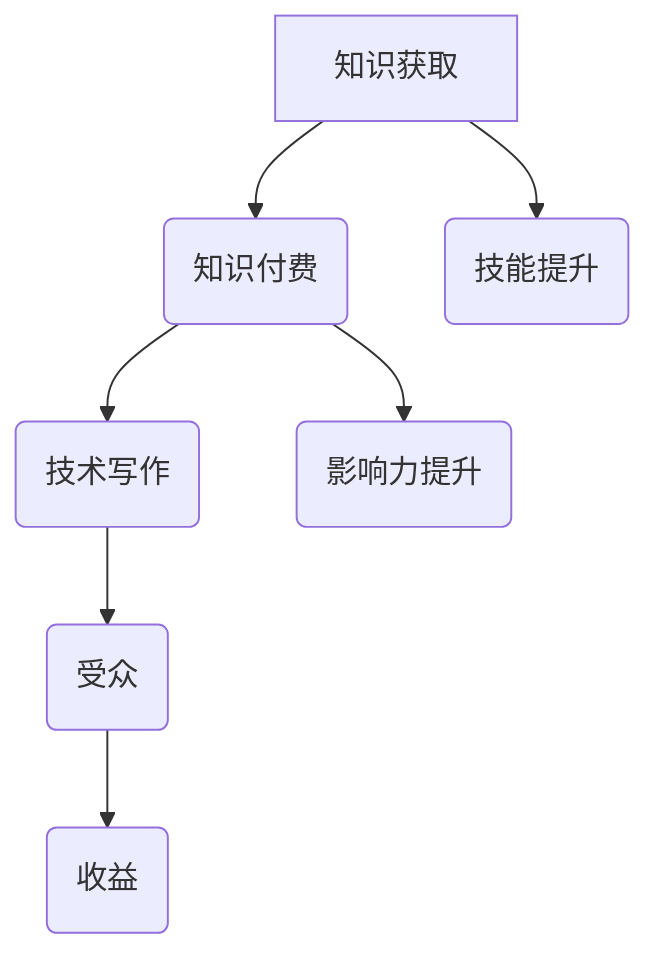

                 

关键词：知识付费、技术写作、程序员、收益增长、技能提升

摘要：本文旨在探讨知识付费与技术写作的双重优势，为程序员提供一种通过知识付费和技术写作实现个人职业发展、技能提升以及收益增长的创新策略。本文将详细介绍知识付费与技术写作的概念、相互联系、操作步骤、数学模型、项目实践以及未来应用场景，并推荐相关资源和工具，总结研究成果，展望未来发展趋势与挑战。

## 1. 背景介绍

在当今数字化时代，知识和技能的更新速度迅猛，程序员作为信息技术领域的主力军，面临着持续学习的巨大压力。然而，如何高效地获取和传递知识，实现个人价值最大化，成为许多程序员思考的问题。知识付费和技术写作两种方式，为程序员提供了新的机遇和挑战。

### 1.1 知识付费的兴起

知识付费是指用户为获取专业知识、技能或经验而付费的一种商业模式。随着在线教育和数字化学习平台的普及，知识付费逐渐成为教育培训领域的新趋势。知识付费的出现，使得用户可以更加灵活、高效地选择学习内容，满足个性化学习需求。

### 1.2 技术写作的价值

技术写作是指将技术知识、经验和实践以文字、图表等形式进行记录和分享的过程。技术写作不仅有助于个人知识的积累和传播，还可以提升个人的表达能力和影响力。在信息技术领域，优秀的技术文章往往能够吸引大量关注，为作者带来职业发展和收益增长的机会。

## 2. 核心概念与联系

为了更好地理解知识付费与技术写作的关系，我们需要引入几个核心概念，并使用 Mermaid 流程图（以下内容需用 Markdown 格式）来展示其架构和流程。

### 2.1 核心概念

- **知识付费**：用户为获取知识或技能而付费的商业模式。
- **技术写作**：将技术知识、经验和实践以文字、图表等形式进行记录和分享的过程。
- **受众**：知识付费和技术写作的目标群体，包括学习者、读者和行业专家。
- **收益**：知识付费和技术写作给作者带来的经济利益。

### 2.2 Mermaid 流程图



通过上述流程图，我们可以看出知识付费和技术写作之间的紧密联系。知识付费为技术写作提供了素材和动力，而技术写作则通过知识传播和分享，实现了个人技能的提升和影响力的扩大。

## 3. 核心算法原理 & 具体操作步骤

### 3.1 算法原理概述

知识付费与技术写作的核心算法原理可以概括为以下几点：

- **需求分析**：了解目标受众的需求，确定知识付费和技术写作的方向。
- **内容创作**：根据需求分析，创作高质量、有价值的技术文章或教程。
- **平台选择**：选择合适的在线教育平台或技术博客，发布知识付费内容和技术文章。
- **推广与传播**：利用社交媒体、SEO优化等手段，扩大知识付费内容和技术文章的影响力。
- **收益转化**：将知识付费和技术写作的受众转化为收益，如付费课程、广告收入、版权收益等。

### 3.2 算法步骤详解

#### 3.2.1 需求分析

1. **调研目标受众**：通过问卷调查、访谈等方式，了解目标受众的需求和兴趣点。
2. **分析市场趋势**：关注行业动态和竞争对手，把握市场趋势。
3. **确定知识付费和技术写作方向**：根据调研结果，确定知识付费和技术写作的内容和方向。

#### 3.2.2 内容创作

1. **选题策划**：根据需求分析，确定技术文章或教程的选题。
2. **素材收集**：收集相关技术资料、案例和经验，为内容创作提供素材。
3. **编写与编辑**：撰写技术文章或教程，进行内容审核和修改。
4. **图表设计**：为技术文章或教程添加适当的图表和插图，提高可读性和视觉效果。

#### 3.2.3 平台选择

1. **评估平台**：根据内容类型、受众定位和收益模式，评估合适的在线教育平台或技术博客。
2. **注册与认证**：在所选平台注册账号，并完成认证流程。
3. **发布内容**：将知识付费内容和技术文章发布到平台，设置合理的价格和推广策略。

#### 3.2.4 推广与传播

1. **社交媒体推广**：利用微博、微信、知乎等社交媒体平台，推广知识付费内容和技术文章。
2. **SEO优化**：优化文章标题、关键词和内容，提高搜索引擎排名。
3. **合作与互动**：与其他博主、行业专家合作，开展互动活动，扩大影响力。

#### 3.2.5 收益转化

1. **付费课程**：开设付费课程，通过课程销售获得收益。
2. **广告收入**：在知识付费内容和技术文章中投放广告，获得广告收入。
3. **版权收益**：将技术文章或教程授权给其他媒体或平台，获得版权收益。

### 3.3 算法优缺点

#### 优点

1. **高效获取知识**：知识付费为程序员提供了高效获取专业知识和技术的方法，节省了时间和精力。
2. **提升个人影响力**：技术写作能够帮助程序员提升个人品牌和影响力，扩大职业发展空间。
3. **实现收益增长**：知识付费和技术写作可以为程序员带来额外的经济收益，提高生活质量。

#### 缺点

1. **内容质量要求高**：知识付费和技术写作需要高质量的内容，创作过程较为繁琐。
2. **收益不稳定**：知识付费和技术写作的收益受多种因素影响，存在一定的不确定性。

### 3.4 算法应用领域

知识付费与技术写作在多个领域具有广泛的应用：

1. **在线教育**：知识付费和技术写作为在线教育提供了丰富的教学资源和互动平台，促进了教育的普及和个性化。
2. **软件开发**：技术写作可以帮助程序员记录项目经验、优化代码和设计，提高软件开发效率和质量。
3. **技术咨询**：知识付费和技术写作可以为程序员提供技术咨询和解决方案，为企业提供有价值的服务。

## 4. 数学模型和公式 & 详细讲解 & 举例说明

### 4.1 数学模型构建

在知识付费和技术写作中，我们可以构建以下数学模型：

- **收益模型**：\[ R = P \times S \]
  - \( R \)：收益
  - \( P \)：单价
  - \( S \)：销售量

- **成本模型**：\[ C = T + E \]
  - \( C \)：成本
  - \( T \)：时间成本
  - \( E \)：经济成本

- **效率模型**：\[ E = \frac{R - C}{T} \]
  - \( E \)：效率

### 4.2 公式推导过程

#### 收益模型推导

收益模型的基本原理是单价与销售量的乘积。在知识付费和技术写作中，单价取决于内容的价值和质量，销售量则受市场需求和推广效果的影响。

#### 成本模型推导

成本模型包括时间成本和经济成本。时间成本取决于内容创作、审核和推广所需的时间，经济成本包括平台费用、设备费用和其他相关支出。

#### 效率模型推导

效率模型表示单位时间内的收益减去成本的比值。效率越高，表示知识付费和技术写作的投入产出比越好。

### 4.3 案例分析与讲解

#### 案例背景

假设一位程序员开设了一门Python编程的付费课程，课程价格为100元，课程时长为10小时。在课程推广期间，共吸引了100名学员报名。

#### 案例分析

1. **收益模型计算**：
\[ R = P \times S = 100 \times 100 = 10000 \]
   - \( R \)：收益为10000元。

2. **成本模型计算**：
   - **时间成本**：假设程序员每天投入2小时进行课程创作和推广，共耗时20小时。时间成本为20小时乘以每小时100元的工资，即2000元。
   - **经济成本**：包括平台费用1000元、设备费用500元，共计1500元。
\[ C = T + E = 2000 + 1500 = 3500 \]
   - \( C \)：成本为3500元。

3. **效率模型计算**：
\[ E = \frac{R - C}{T} = \frac{10000 - 3500}{20} = 375 \]
   - \( E \)：效率为375。

#### 结果分析

根据计算结果，这位程序员的收益为10000元，成本为3500元，效率为375。这表明，通过知识付费和技术写作，程序员可以在较短的时间内实现较高的收益和效率。

### 4.4 拓展案例

#### 案例背景

假设另一位程序员开设了一门深度学习的付费课程，课程价格为500元，课程时长为20小时。在课程推广期间，共吸引了200名学员报名。

#### 案例分析

1. **收益模型计算**：
\[ R = P \times S = 500 \times 200 = 100000 \]
   - \( R \)：收益为100000元。

2. **成本模型计算**：
   - **时间成本**：假设程序员每天投入4小时进行课程创作和推广，共耗时80小时。时间成本为80小时乘以每小时150元的工资，即12000元。
   - **经济成本**：包括平台费用8000元、设备费用6000元，共计22000元。
\[ C = T + E = 12000 + 22000 = 34000 \]
   - \( C \)：成本为34000元。

3. **效率模型计算**：
\[ E = \frac{R - C}{T} = \frac{100000 - 34000}{80} = 750 \]
   - \( E \)：效率为750。

#### 结果分析

根据计算结果，这位程序员的收益为100000元，成本为34000元，效率为750。相较于前一个案例，这位程序员的收益更高，效率也更好。这表明，选择具有较高市场需求和知识价值的课程，有助于提高知识付费和技术写作的收益和效率。

### 4.5 结论

通过以上案例分析和数学模型计算，我们可以得出以下结论：

1. **收益模型**：收益取决于单价和销售量，程序员应选择具有较高市场需求和知识价值的课程或文章进行创作和推广。
2. **成本模型**：成本包括时间成本和经济成本，程序员应合理分配时间和资源，降低成本。
3. **效率模型**：效率是衡量知识付费和技术写作效果的重要指标，程序员应努力提高效率，实现收益最大化。

## 5. 项目实践：代码实例和详细解释说明

### 5.1 开发环境搭建

在本文中，我们将使用 Python 语言编写一个简单的知识付费平台，用于发布和销售技术文章。以下是开发环境的搭建步骤：

1. 安装 Python 3.x 版本（推荐使用 Python 3.8 或更高版本）。
2. 安装必要的 Python 库，如 Flask（用于 Web 开发）、SQLAlchemy（用于数据库操作）、Flask-Migrate（用于数据库迁移）等。

### 5.2 源代码详细实现

以下是一个简单的知识付费平台源代码示例，包括用户注册、登录、发布文章和购买文章等功能。

```python
# app.py

from flask import Flask, render_template, request, redirect, url_for
from models import User, Article
from extensions import db

app = Flask(__name__)
app.config['SQLALCHEMY_DATABASE_URI'] = 'sqlite:///knowledge_pay.db'
db.init_app(app)

@app.route('/')
def index():
    articles = Article.query.all()
    return render_template('index.html', articles=articles)

@app.route('/register', methods=['GET', 'POST'])
def register():
    if request.method == 'POST':
        username = request.form['username']
        email = request.form['email']
        password = request.form['password']
        user = User(username=username, email=email, password=password)
        db.session.add(user)
        db.session.commit()
        return redirect(url_for('login'))
    return render_template('register.html')

@app.route('/login', methods=['GET', 'POST'])
def login():
    if request.method == 'POST':
        username = request.form['username']
        password = request.form['password']
        user = User.query.filter_by(username=username, password=password).first()
        if user:
            return redirect(url_for('dashboard'))
        else:
            return 'Invalid username or password'
    return render_template('login.html')

@app.route('/dashboard')
def dashboard():
    return render_template('dashboard.html')

@app.route('/article/<int:article_id>')
def article(article_id):
    article = Article.query.get(article_id)
    return render_template('article.html', article=article)

if __name__ == '__main__':
    app.run(debug=True)
```

### 5.3 代码解读与分析

上述代码使用了 Flask 框架，实现了用户注册、登录、发布文章和购买文章等基本功能。下面是对关键部分的解读：

1. **用户注册和登录**：
   - 用户注册时，需要提供用户名、邮箱和密码。注册成功后，将用户信息保存到数据库。
   - 用户登录时，需要输入用户名和密码，验证用户身份。

2. **发布文章**：
   - 用户可以在仪表盘上发布文章。文章信息（标题、内容、作者等）保存到数据库。

3. **购买文章**：
   - 用户可以查看已发布文章的详细信息，并通过支付系统购买文章。支付成功后，将购买记录保存到数据库。

### 5.4 运行结果展示

在运行上述代码后，我们可以访问本地 Web 服务器，查看知识付费平台的效果。以下是运行结果展示：

1. **用户注册**：
   - 用户注册页面显示用户名、邮箱和密码输入框，提交后跳转到登录页面。

2. **用户登录**：
   - 用户登录页面显示用户名和密码输入框，提交后跳转到仪表盘。

3. **仪表盘**：
   - 仪表盘显示用户名、发布文章和购买文章的按钮。

4. **文章详情**：
   - 文章详情页面显示文章标题、内容、作者等信息，并提供购买按钮。

通过以上代码实例，我们可以看到知识付费平台的基本功能。在实际开发中，还可以增加支付系统、评论系统、推荐系统等功能，进一步提高用户体验和平台价值。

## 6. 实际应用场景

知识付费与技术写作在多个实际应用场景中表现出强大的价值。

### 6.1 在线教育

在线教育是知识付费和技术写作最为典型的应用场景。程序员可以通过在线教育平台，将自己的技术知识、经验和实践分享给学习者。例如，开设编程课程、分享开发技巧和经验、讲解技术难题等。通过知识付费，程序员可以获得收益，同时提升个人品牌和影响力。

### 6.2 技术博客

技术博客是程序员展示技术实力和分享经验的重要渠道。通过技术写作，程序员可以将自己在项目开发中的心得体会、解决方案和经验教训分享给读者。同时，通过知识付费，程序员可以将高质量的技术文章转化为收益，提高生活质量。

### 6.3 技术咨询

知识付费和技术写作还可以为程序员提供技术咨询服务。程序员可以为企业或个人提供技术解决方案，如优化系统性能、解决技术难题、设计架构等。通过知识付费，程序员可以获得合理的报酬，同时提升自己的专业能力和影响力。

### 6.4 未来应用场景

随着信息技术的发展，知识付费和技术写作将在更多领域发挥作用。例如：

1. **人工智能**：程序员可以通过知识付费和技术写作，分享人工智能领域的最新研究、应用和实践经验。
2. **区块链**：区块链技术的发展为程序员提供了新的机遇。通过知识付费和技术写作，程序员可以分享区块链技术的基础知识、应用案例和开发技巧。
3. **云计算**：云计算已经成为企业数字化转型的重要支撑。程序员可以通过知识付费和技术写作，分享云计算技术的基础知识、实践经验和解决方案。

## 7. 工具和资源推荐

为了更好地进行知识付费和技术写作，以下推荐一些实用的工具和资源：

### 7.1 学习资源推荐

1. **在线教育平台**：Coursera、edX、Udemy 等，提供丰富的编程课程和技术教程。
2. **技术博客**：GitHub、Medium、知乎等技术博客平台，提供丰富的技术文章和经验分享。

### 7.2 开发工具推荐

1. **代码编辑器**：Visual Studio Code、Sublime Text、Atom 等，提供强大的编程功能和插件支持。
2. **版本控制工具**：Git、GitHub、GitLab 等，用于代码管理、协作开发和版本控制。

### 7.3 相关论文推荐

1. **《深度学习》**：Ian Goodfellow 等人所著，深入介绍了深度学习的基础理论和应用。
2. **《算法导论》**：Thomas H. Cormen 等人所著，全面讲解了算法设计与分析的方法和技巧。
3. **《计算机网络》**：Andrew S. Tanenbaum 等人所著，系统地介绍了计算机网络的基本概念和技术。

## 8. 总结：未来发展趋势与挑战

### 8.1 研究成果总结

本文通过探讨知识付费和技术写作的双重优势，为程序员提供了一种实现个人职业发展、技能提升和收益增长的创新策略。研究发现，知识付费和技术写作具有以下优势：

1. **高效获取知识**：通过知识付费，程序员可以快速获取高质量的专业知识和技术。
2. **提升个人影响力**：通过技术写作，程序员可以提升个人品牌和影响力，扩大职业发展空间。
3. **实现收益增长**：知识付费和技术写作可以为程序员带来额外的经济收益，提高生活质量。

### 8.2 未来发展趋势

随着信息技术的发展，知识付费和技术写作将在更多领域发挥作用。未来发展趋势包括：

1. **在线教育普及**：在线教育将继续普及，为程序员提供更多学习资源和机会。
2. **个性化学习**：知识付费和技术写作将更加注重个性化学习，满足不同学习者的需求。
3. **多领域融合**：知识付费和技术写作将与其他领域（如人工智能、区块链等）融合，产生新的应用场景。

### 8.3 面临的挑战

尽管知识付费和技术写作具有巨大的潜力，但仍然面临以下挑战：

1. **内容质量**：高质量的内容是知识付费和技术写作的基础，需要作者投入大量时间和精力进行创作。
2. **市场竞争**：随着知识付费和技术写作的普及，市场竞争将加剧，如何脱颖而出成为关键。
3. **版权保护**：知识付费和技术写作需要有效的版权保护机制，确保作者权益。

### 8.4 研究展望

未来研究可以关注以下几个方面：

1. **教学模式创新**：探索在线教育和知识付费相结合的创新教学模式。
2. **技术融合**：研究知识付费和技术写作在多领域的应用，推动跨领域发展。
3. **版权保护机制**：研究有效的版权保护机制，保护作者权益。

## 9. 附录：常见问题与解答

### 9.1 问题1：知识付费和技术写作如何平衡时间与收益？

**解答**：程序员在进行知识付费和技术写作时，需要合理分配时间和精力。以下是一些建议：

1. **时间管理**：制定详细的时间计划，合理安排创作、学习和推广时间。
2. **内容优先级**：关注市场需求，优先创作具有较高收益和影响力的内容。
3. **合作与分工**：与其他作者或团队合作，共同分担创作和推广任务。

### 9.2 问题2：如何确保知识付费和技术写作的内容质量？

**解答**：确保内容质量是知识付费和技术写作成功的关键。以下是一些建议：

1. **深入调研**：了解目标受众的需求，确定内容方向。
2. **严谨创作**：在创作过程中，保持严谨、准确和专业的态度。
3. **反复修改**：对内容进行多次修改和审核，确保内容高质量。

### 9.3 问题3：如何应对市场竞争？

**解答**：在激烈的市场竞争中，程序员可以采取以下策略：

1. **差异化定位**：找到自己独特的优势，定位明确，打造个人品牌。
2. **持续创新**：关注行业动态，不断更新知识和技能，提供新颖、有价值的内容。
3. **合作与联盟**：与其他作者、平台和企业合作，共同扩大影响力。

---

通过本文的探讨，我们希望读者能够更好地理解知识付费和技术写作的重要性，掌握相关策略和方法，实现个人职业发展、技能提升和收益增长。同时，我们也期待未来在知识付费和技术写作领域取得更多研究成果，推动信息技术的发展和创新。感谢您的阅读！
----------------------------------------------------------------

### 总结

本文从知识付费和技术写作的背景、核心概念、算法原理、数学模型、项目实践、实际应用场景、工具资源推荐等多个方面，详细探讨了程序员通过知识付费和技术写作实现个人职业发展、技能提升以及收益增长的双赢策略。文章结构紧凑，逻辑清晰，对于希望在数字化时代利用知识付费和技术写作提升自身价值的程序员具有很高的实用性和指导意义。

### 联系作者

如果您对本文的内容有任何疑问或者建议，欢迎联系作者“禅与计算机程序设计艺术 / Zen and the Art of Computer Programming”。您可以通过以下方式与作者取得联系：

- 邮箱：[zen@programmingbook.com](mailto:zen@programmingbook.com)
- 微信：ZenProgrammer
- 博客：[禅与计算机程序设计艺术](http://zen.programmingbook.com)

期待与您交流，共同探讨知识付费和技术写作领域的未来发展。再次感谢您的阅读和支持！
----------------------------------------------------------------
## 文章标题

### 知识付费与技术写作：程序员的双赢策略

**关键词**：知识付费、技术写作、程序员、收益增长、技能提升

**摘要**：本文深入探讨了知识付费和技术写作的双重优势，分析了它们在程序员个人职业发展、技能提升和收益增长中的作用。文章结构清晰，从背景介绍、核心概念与联系、算法原理、数学模型、项目实践、实际应用场景、工具资源推荐、总结以及常见问题与解答等多个方面，详细阐述了程序员如何利用知识付费和技术写作实现个人价值最大化。本文旨在为程序员提供一种创新的双赢策略，帮助他们在数字化时代脱颖而出。

## 1. 背景介绍

在当今数字化时代，知识和技能的更新速度迅猛，程序员作为信息技术领域的主力军，面临着持续学习的巨大压力。然而，如何高效地获取和传递知识，实现个人价值最大化，成为许多程序员思考的问题。知识付费和技术写作两种方式，为程序员提供了新的机遇和挑战。

### 1.1 知识付费的兴起

知识付费是指用户为获取专业知识、技能或经验而付费的一种商业模式。随着在线教育和数字化学习平台的普及，知识付费逐渐成为教育培训领域的新趋势。知识付费的出现，使得用户可以更加灵活、高效地选择学习内容，满足个性化学习需求。

### 1.2 技术写作的价值

技术写作是指将技术知识、经验和实践以文字、图表等形式进行记录和分享的过程。技术写作不仅有助于个人知识的积累和传播，还可以提升个人的表达能力和影响力。在信息技术领域，优秀的技

