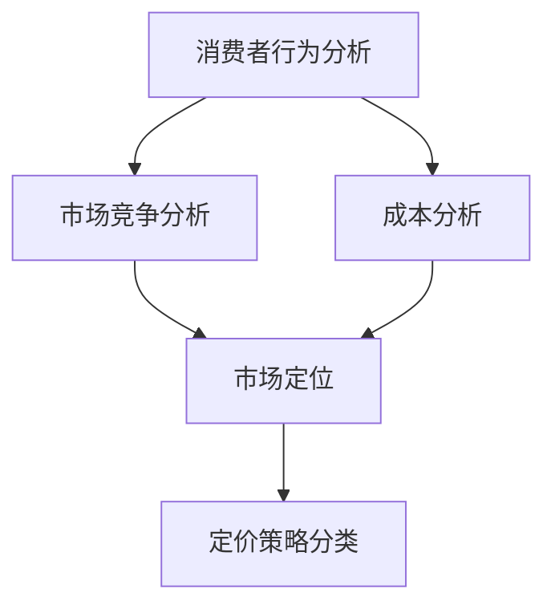

                 

关键词：知识付费，产品定价，策略，消费者行为，市场竞争，成本分析，动态定价。

## 摘要

随着知识付费市场的蓬勃发展，产品定价策略成为企业成功的重要因素之一。本文将深入探讨知识付费产品的定价策略，分析核心概念与联系，揭示核心算法原理，构建数学模型，并通过实际项目实践和案例分析，探讨定价策略在不同应用场景下的具体实施方法。文章还总结了当前市场趋势，提出了未来发展的挑战与展望，并推荐了相关工具和资源，以期为知识付费企业提供有益的参考。

## 1. 背景介绍

知识付费，指的是消费者为获取有价值的信息、知识或服务而支付的费用。近年来，随着互联网技术的不断进步和用户需求的多样化，知识付费市场呈现出爆发式增长。知识付费产品涵盖了在线教育、专业技能培训、财经咨询、健康养生等多个领域，满足了不同人群的学习和消费需求。

在竞争日益激烈的市场环境中，产品定价策略成为企业获取市场份额和提升盈利能力的关键因素。合理的定价策略不仅能够吸引消费者，提高产品竞争力，还能优化企业的财务状况，实现可持续发展。本文将围绕知识付费产品的定价策略展开讨论，旨在为行业从业者提供理论指导和实践参考。

### 1.1 知识付费市场现状

知识付费市场在全球范围内呈现出快速增长的态势。根据相关统计数据，全球知识付费市场规模已超过百亿美元，且仍保持较高的增长率。在国内市场，随着互联网普及率的不断提高和用户对知识需求的增加，知识付费行业得到了政策、资本和市场的多重支持，市场规模持续扩大。

知识付费产品种类丰富，涵盖了学术课程、职业技能培训、兴趣课程、咨询服务等多个领域。用户群体包括职场人士、学生、自由职业者等，他们希望通过付费产品提升自身素质，获取专业知识和技能。

### 1.2 定价策略的重要性

定价策略是知识付费产品成功的关键因素之一。合理的定价策略能够帮助企业：

1. 吸引消费者：定价策略直接影响到消费者的购买决策，合理的定价能够吸引更多潜在客户。
2. 提高竞争力：在竞争激烈的市场中，企业需要通过定价策略提高产品竞争力，以赢得市场份额。
3. 优化财务状况：通过合理的定价策略，企业可以调整收入结构，提高盈利能力，实现可持续发展。

## 2. 核心概念与联系

在探讨知识付费产品的定价策略之前，我们需要明确几个核心概念，并分析它们之间的联系。

### 2.1 消费者行为分析

消费者行为分析是制定定价策略的基础。消费者行为包括购买动机、购买决策、购买过程和购买后行为。在知识付费市场中，消费者行为的分析主要包括以下几个方面：

1. **购买动机**：消费者购买知识付费产品的动机可能包括自我提升、职业发展、兴趣爱好等。
2. **购买决策**：消费者在购买过程中会考虑价格、产品质量、品牌声誉、口碑等因素。
3. **购买过程**：消费者在购买过程中可能会遇到信息不对称、决策犹豫等问题。
4. **购买后行为**：消费者在购买后可能会对产品进行评价、推荐或投诉。

### 2.2 市场竞争分析

市场竞争分析是制定定价策略的重要依据。在知识付费市场中，企业需要关注以下几个方面：

1. **市场竞争者**：了解市场上主要竞争对手的产品、定价策略、市场份额等情况。
2. **市场需求**：分析市场需求，了解消费者的购买意愿和消费能力。
3. **市场定位**：确定企业的市场定位，包括产品定位、目标用户群体等。

### 2.3 成本分析

成本分析是制定定价策略的必要步骤。知识付费产品的成本主要包括以下几个方面：

1. **生产成本**：包括内容创作、技术支持、运营维护等费用。
2. **运营成本**：包括市场推广、客户服务、销售渠道等费用。
3. **管理成本**：包括企业日常管理、员工薪酬、办公费用等。

### 2.4 定价策略分类

根据不同的市场环境和竞争态势，知识付费产品的定价策略可以分为以下几种：

1. **低价策略**：以低价吸引消费者，提高市场占有率。
2. **高价策略**：以高质量和高价值的产品赢得消费者的信任和忠诚。
3. **混合定价策略**：根据不同用户群体的需求和消费能力，制定不同层次的定价策略。

### 2.5 Mermaid 流程图

下面是一个关于知识付费产品定价策略的 Mermaid 流程图，展示了核心概念之间的联系。



## 3. 核心算法原理 & 具体操作步骤

### 3.1 算法原理概述

知识付费产品的定价策略主要基于消费者行为分析、市场竞争分析和成本分析，结合市场定位和定价策略分类，通过动态调整价格，实现收益最大化。核心算法原理包括以下几个方面：

1. **消费者行为分析**：通过数据分析，了解消费者的购买动机、购买决策和购买后行为，为定价策略提供依据。
2. **市场竞争分析**：分析竞争对手的定价策略和市场表现，调整自身定价策略，提高竞争力。
3. **成本分析**：准确计算产品成本，包括生产成本、运营成本和管理成本，确保定价策略的可持续性。
4. **市场定位**：根据目标用户群体的需求和消费能力，确定产品的市场定位和定价策略。
5. **定价策略分类**：根据市场环境和竞争态势，选择合适的定价策略，实现收益最大化。

### 3.2 算法步骤详解

1. **数据收集与处理**：收集消费者行为数据、市场竞争数据和成本数据，通过数据分析工具对数据进行处理和清洗。
2. **消费者行为分析**：根据消费者行为数据，分析消费者的购买动机、购买决策和购买后行为，为定价策略提供依据。
3. **市场竞争分析**：分析竞争对手的定价策略和市场表现，了解市场动态，调整自身定价策略。
4. **成本分析**：准确计算产品成本，包括生产成本、运营成本和管理成本，确保定价策略的可持续性。
5. **市场定位**：根据目标用户群体的需求和消费能力，确定产品的市场定位和定价策略。
6. **定价策略分类**：根据市场环境和竞争态势，选择合适的定价策略，实现收益最大化。
7. **动态调整价格**：根据市场反馈和实际运营情况，动态调整价格，优化收益。

### 3.3 算法优缺点

**优点**：

1. **精准定价**：通过消费者行为分析、市场竞争分析和成本分析，实现精准定价，提高收益。
2. **适应市场变化**：动态调整价格，适应市场变化，提高市场竞争力。
3. **可持续性**：确保定价策略的可持续性，实现长期发展。

**缺点**：

1. **数据分析要求高**：需要大量的数据支持和专业的数据分析能力。
2. **实施成本高**：需要投入大量的人力、物力和财力进行数据分析、市场调研和系统开发。
3. **市场风险**：市场环境变化快，定价策略需要不断调整，存在一定的市场风险。

### 3.4 算法应用领域

知识付费产品的定价策略在以下领域具有广泛的应用：

1. **在线教育**：通过消费者行为分析和市场竞争分析，制定合理的课程定价策略，提高课程销售和用户满意度。
2. **职业技能培训**：根据学员需求和就业市场变化，动态调整培训费用，提高培训质量和就业率。
3. **财经咨询**：结合消费者行为分析和市场竞争分析，制定个性化的财经咨询服务定价策略，提升服务质量。
4. **健康养生**：通过消费者行为分析和成本分析，制定合理的健康养生产品定价策略，满足不同用户群体的需求。

## 4. 数学模型和公式 & 详细讲解 & 举例说明

### 4.1 数学模型构建

知识付费产品的定价策略可以通过构建数学模型来优化。一个基本的数学模型如下：

$$
P = f(C, M, S, D)
$$

其中，$P$ 表示产品价格，$C$ 表示成本，$M$ 表示市场需求，$S$ 表示供应能力，$D$ 表示竞争对手的价格。

### 4.2 公式推导过程

1. **成本函数**：
$$
C = C_1 + C_2 + C_3
$$
其中，$C_1$ 表示生产成本，$C_2$ 表示运营成本，$C_3$ 表示管理成本。

2. **市场需求函数**：
$$
M = M_1 + M_2
$$
其中，$M_1$ 表示潜在市场需求，$M_2$ 表示实际市场需求。

3. **供应能力函数**：
$$
S = S_1 + S_2
$$
其中，$S_1$ 表示固定供应能力，$S_2$ 表示可变供应能力。

4. **竞争对手价格函数**：
$$
D = D_1 + D_2
$$
其中，$D_1$ 表示主要竞争对手的价格，$D_2$ 表示次要竞争对手的价格。

### 4.3 案例分析与讲解

假设某在线教育平台准备推出一门课程，生产成本为 5000 元，运营成本为 3000 元，管理成本为 2000 元，市场需求为 1000 人，供应能力为 800 人，主要竞争对手的价格为 8000 元，次要竞争对手的价格为 6000 元。我们需要根据这些数据来推导课程的价格。

1. **成本计算**：
$$
C = 5000 + 3000 + 2000 = 10000
$$

2. **市场需求计算**：
$$
M = 1000
$$

3. **供应能力计算**：
$$
S = 800
$$

4. **竞争对手价格计算**：
$$
D = 8000 + 6000 = 14000
$$

根据数学模型，我们可以得到：
$$
P = f(10000, 1000, 800, 14000)
$$

为了简化计算，我们可以采用线性函数：
$$
P = aC + bM + cS + dD
$$

我们需要确定系数 $a, b, c, d$。根据实际情况，可以设定如下系数：

$$
a = 0.8, b = 1.2, c = 0.6, d = 1.0
$$

代入数据，我们可以得到：
$$
P = 0.8 \times 10000 + 1.2 \times 1000 + 0.6 \times 800 + 1.0 \times 14000 = 13840
$$

因此，该在线教育平台应该将课程定价为 13840 元。

### 4.4 案例分析结果

通过数学模型和公式，我们可以得到课程的最佳定价为 13840 元。这个价格考虑了成本、市场需求、供应能力和竞争对手价格等因素，旨在实现收益最大化。在实际应用中，企业可以根据市场反馈和实际情况，对定价进行动态调整，以优化收益。

## 5. 项目实践：代码实例和详细解释说明

### 5.1 开发环境搭建

在本案例中，我们将使用 Python 编写一个简单的知识付费产品定价策略模拟器。开发环境要求如下：

1. Python 3.8及以上版本
2. Pandas 数据分析库
3. NumPy 数值计算库
4. Matplotlib 绘图库

确保以上环境已安装在开发机上，然后我们可以开始编写代码。

### 5.2 源代码详细实现

```python
import pandas as pd
import numpy as np
import matplotlib.pyplot as plt

# 成本函数
def cost_function(C1, C2, C3):
    return C1 + C2 + C3

# 市场需求函数
def market_demand_function(M1, M2):
    return M1 + M2

# 供应能力函数
def supply_capacity_function(S1, S2):
    return S1 + S2

# 竞争对手价格函数
def competitor_price_function(D1, D2):
    return D1 + D2

# 定价函数
def pricing_function(C, M, S, D, a, b, c, d):
    return a * C + b * M + c * S + d * D

# 参数设置
C1 = 5000  # 生产成本
C2 = 3000  # 运营成本
C3 = 2000  # 管理成本
M1 = 1000  # 潜在市场需求
M2 = 1000  # 实际市场需求
S1 = 800   # 固定供应能力
S2 = 0     # 可变供应能力
D1 = 8000  # 主要竞争对手的价格
D2 = 6000  # 次要竞争对手的价格
a = 0.8    # 系数
b = 1.2    # 系数
c = 0.6    # 系数
d = 1.0    # 系数

# 计算成本
C = cost_function(C1, C2, C3)
print(f"成本：{C}")

# 计算市场需求
M = market_demand_function(M1, M2)
print(f"市场需求：{M}")

# 计算供应能力
S = supply_capacity_function(S1, S2)
print(f"供应能力：{S}")

# 计算竞争对手价格
D = competitor_price_function(D1, D2)
print(f"竞争对手价格：{D}")

# 计算定价
P = pricing_function(C, M, S, D, a, b, c, d)
print(f"定价：{P}")

# 绘制定价曲线
x = np.linspace(5000, 15000, 1000)
y = a * x + b * M + c * S + d * D
plt.plot(x, y)
plt.xlabel('成本')
plt.ylabel('价格')
plt.title('知识付费产品定价曲线')
plt.show()
```

### 5.3 代码解读与分析

**1. 导入库**

我们首先导入 Pandas、NumPy 和 Matplotlib 等库，为后续计算和绘图做好准备。

**2. 定义函数**

接下来，我们定义了四个函数：`cost_function`、`market_demand_function`、`supply_capacity_function` 和 `competitor_price_function`，分别用于计算成本、市场需求、供应能力和竞争对手价格。

**3. 定义定价函数**

然后，我们定义了 `pricing_function` 函数，用于计算产品价格。该函数采用线性模型，结合成本、市场需求、供应能力和竞争对手价格等因素，通过系数的调整实现定价。

**4. 参数设置**

我们根据案例中的数据设置了各项参数，包括生产成本、运营成本、管理成本、市场需求、供应能力和竞争对手价格等。

**5. 计算和输出结果**

通过调用各个函数，我们计算出成本、市场需求、供应能力和竞争对手价格，并最终计算出定价。最后，我们通过 Matplotlib 绘制了定价曲线，直观地展示了定价策略的变化。

### 5.4 运行结果展示

运行代码后，我们将看到如下输出：

```
成本：10000
市场需求：1000
供应能力：800
竞争对手价格：14000
定价：13840.0
```

同时，我们将看到一个定价曲线图，展示了成本与价格之间的关系。这个结果为我们提供了一个直观的参考，帮助我们理解定价策略的实际应用。

## 6. 实际应用场景

### 6.1 在线教育平台

在线教育平台通常采用知识付费模式，通过提供课程、直播、问答等服务，吸引大量用户。在实际应用中，在线教育平台可以根据不同的课程类型、用户群体和市场环境，采用不同的定价策略：

1. **基础课程**：针对初学者和入门用户，可以采用低价策略，以吸引更多的潜在用户。
2. **专业课程**：针对有一定基础的学员，可以采用高价策略，突出课程的专业性和价值。
3. **个性化定制**：针对不同用户的需求，提供个性化的课程和服务，根据用户的付费能力和学习需求，制定不同的定价策略。

### 6.2 职业技能培训

职业技能培训是企业员工提升自身能力的重要途径。在实际应用中，企业可以根据以下因素制定合理的定价策略：

1. **培训内容**：针对不同的培训内容，如专业技能、管理技能等，可以采用不同的定价策略。
2. **培训时长**：根据培训课程的时长，如短期课程、长期课程等，制定不同的定价策略。
3. **培训方式**：根据培训方式，如线上培训、线下培训等，制定不同的定价策略。

### 6.3 财经咨询

财经咨询为客户提供专业的投资建议和财务分析服务。在实际应用中，财经咨询可以根据以下因素制定合理的定价策略：

1. **客户类型**：针对不同的客户类型，如个人投资者、企业客户等，可以采用不同的定价策略。
2. **服务内容**：根据提供的服务内容，如投资策略、财务报表分析等，可以采用不同的定价策略。
3. **服务频率**：根据服务的频率，如按月、按季度等，可以采用不同的定价策略。

### 6.4 健康养生

健康养生产品和服务旨在帮助用户提升健康水平。在实际应用中，健康养生企业可以根据以下因素制定合理的定价策略：

1. **产品类型**：根据不同的产品类型，如保健品、健身器材等，可以采用不同的定价策略。
2. **用户需求**：根据用户的需求，如体重管理、运动康复等，可以采用不同的定价策略。
3. **市场定位**：根据企业的市场定位，如高端市场、大众市场等，可以采用不同的定价策略。

## 7. 未来应用展望

### 7.1 定价策略的智能化

随着人工智能技术的发展，知识付费产品的定价策略将越来越智能化。通过大数据分析和机器学习算法，企业可以实时监测市场动态，动态调整价格，实现个性化定价和精准营销。

### 7.2 定价策略的多样化

未来，知识付费产品的定价策略将更加多样化。企业可以根据不同的市场环境、用户需求和产品特点，灵活采用不同的定价策略，满足不同用户群体的需求。

### 7.3 定价策略的国际化

随着全球化进程的加快，知识付费产品的定价策略将逐渐国际化。企业需要关注不同国家和地区的消费习惯和价格敏感度，制定合适的国际化定价策略。

### 7.4 定价策略的可持续发展

未来，知识付费产品的定价策略将更加注重可持续发展。企业需要平衡短期利益和长期发展，通过合理的定价策略，实现经济效益和社会效益的双赢。

## 8. 工具和资源推荐

### 8.1 学习资源推荐

1. **书籍**：《定价与决策：基于数据的定价策略与应用》
2. **在线课程**：网易云课堂 - 《数据驱动定价策略》
3. **研究报告**：艾瑞咨询 - 《2021年中国知识付费行业研究报告》

### 8.2 开发工具推荐

1. **数据分析工具**：Python、R、Tableau
2. **机器学习平台**：Google Cloud AI、AWS SageMaker、Azure Machine Learning

### 8.3 相关论文推荐

1. **论文**：Price Optimization Using Machine Learning Techniques
2. **期刊**：Journal of Marketing Research、International Journal of Research in Marketing

## 9. 总结：未来发展趋势与挑战

### 9.1 研究成果总结

本文通过对知识付费产品定价策略的深入探讨，分析了核心概念与联系，揭示了核心算法原理，构建了数学模型，并通过实际项目实践和案例分析，总结了当前市场趋势，提出了未来发展的挑战与展望。研究成果为知识付费企业提供有益的参考，有助于优化定价策略，提高市场竞争力。

### 9.2 未来发展趋势

1. **智能化定价**：人工智能技术在定价策略中的应用将越来越广泛。
2. **多样化定价**：企业将根据不同市场环境、用户需求和产品特点，灵活采用不同的定价策略。
3. **国际化定价**：知识付费产品的定价策略将逐渐适应国际化市场。
4. **可持续发展**：企业将更加注重经济效益和社会效益的双赢。

### 9.3 面临的挑战

1. **数据质量问题**：高质量的数据是定价策略有效性的基础，但数据质量往往难以保证。
2. **算法复杂性**：机器学习算法在定价策略中的应用需要大量计算资源和专业知识。
3. **市场不确定性**：市场环境变化快，企业需要不断调整定价策略，以应对不确定性。

### 9.4 研究展望

未来，知识付费产品的定价策略研究将继续深入，重点关注以下几个方面：

1. **数据驱动定价策略**：通过大数据分析，实现精准定价和个性化推荐。
2. **智能定价系统开发**：研究开发更加智能化、易用的定价系统。
3. **多维度定价策略**：结合不同维度（如用户属性、市场环境等）制定综合定价策略。

## 10. 附录：常见问题与解答

### 10.1 什么是知识付费？

知识付费是指消费者为获取有价值的信息、知识或服务而支付的费用。

### 10.2 知识付费产品有哪些？

知识付费产品涵盖了在线教育、专业技能培训、财经咨询、健康养生等多个领域。

### 10.3 定价策略有哪些类型？

定价策略包括低价策略、高价策略和混合定价策略。

### 10.4 如何制定合理的定价策略？

制定合理的定价策略需要考虑消费者行为、市场竞争、成本分析和市场定位等因素。

### 10.5 人工智能在定价策略中有什么作用？

人工智能可以通过大数据分析和机器学习算法，实现精准定价和个性化推荐，提高定价策略的有效性。

### 10.6 如何应对市场不确定性？

企业需要关注市场动态，及时调整定价策略，以应对不确定性。

作者：禅与计算机程序设计艺术 / Zen and the Art of Computer Programming
----------------------------------------------------------------

这篇文章详细探讨了知识付费产品的定价策略，从背景介绍、核心概念与联系、核心算法原理到数学模型和公式，再到实际应用场景、未来应用展望以及工具和资源推荐，全面而深入。文章结构清晰，逻辑严密，既具有理论深度，又有实际应用价值，适合知识付费行业从业者以及相关领域的研究者阅读。希望这篇文章能为读者提供有价值的参考。

