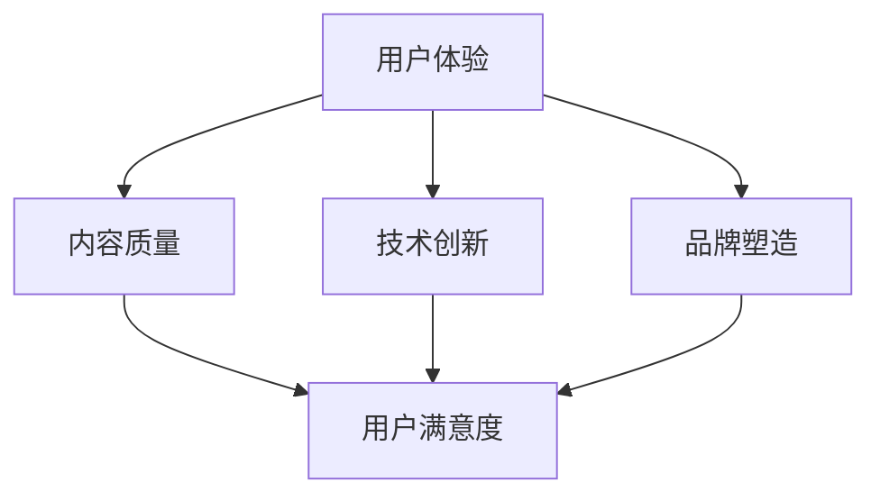

                 

知识付费行业近年来迅速崛起，成为教育培训领域的一股新兴力量。在这个充满竞争的市场中，产品差异化成为企业制胜的关键。本文旨在探讨知识付费产品的差异化竞争策略，分析核心概念与联系，介绍核心算法原理和具体操作步骤，以及未来应用展望。

## 关键词

- 知识付费
- 差异化竞争
- 教育培训
- 用户体验
- 数据驱动

## 摘要

本文将详细分析知识付费产品的差异化竞争策略，探讨如何通过用户体验、内容质量、技术创新等方面实现产品的差异化。同时，本文还将介绍核心算法原理和具体操作步骤，以及未来应用展望，为知识付费行业从业者提供有益的参考。

## 1. 背景介绍

知识付费作为一种新兴的商业模式，起源于互联网的普及和人们对于个性化、高质量教育的需求。随着移动互联网的快速发展，知识付费行业迎来了黄金发展期。据某权威数据显示，我国知识付费市场规模已超过千亿，且仍处于快速增长阶段。

在这个充满竞争的市场中，企业要想脱颖而出，必须具备独特的竞争优势。差异化竞争策略成为企业制胜的关键。本文将从用户体验、内容质量、技术创新等方面，探讨知识付费产品的差异化竞争策略。

### 1.1 知识付费行业现状

当前，知识付费行业主要呈现出以下几个特点：

1. 内容种类丰富：从最初的课程、讲座，发展到如今涵盖教育、财经、科技、艺术等多个领域的丰富内容。
2. 用户需求多样化：随着消费者对于个性化、定制化服务的需求日益增长，知识付费产品也越来越注重满足不同用户的需求。
3. 技术创新驱动：人工智能、大数据、区块链等新兴技术的应用，使得知识付费产品在内容推荐、学习效果评估等方面取得了显著提升。
4. 竞争激烈：大量企业和平台涌入知识付费市场，使得市场竞争愈发激烈。

### 1.2 知识付费产品差异化竞争的必要性

知识付费行业竞争激烈，要想在市场中脱颖而出，企业必须具备独特的竞争优势。差异化竞争策略能够帮助企业树立品牌形象，提高用户粘性，从而在激烈的市场竞争中占据有利地位。具体来说，知识付费产品的差异化竞争主要体现在以下几个方面：

1. 用户体验：良好的用户体验能够提升用户满意度，增强用户忠诚度，从而提高产品竞争力。
2. 内容质量：优质的内容是知识付费产品的核心竞争力，企业需要不断优化内容，提升内容质量，以满足用户需求。
3. 技术创新：技术创新能够提升知识付费产品的功能和性能，提高用户满意度，从而增强竞争力。
4. 品牌塑造：独特的品牌形象能够提高产品知名度，吸引更多用户，从而在市场竞争中占据优势。

## 2. 核心概念与联系

在探讨知识付费产品的差异化竞争策略之前，我们需要明确一些核心概念，并分析它们之间的联系。

### 2.1 用户体验

用户体验（User Experience，简称UX）是指用户在使用产品过程中的主观感受和体验。在知识付费领域，用户体验包括用户在浏览、选择、学习、评价等产品环节中的感受。良好的用户体验能够提升用户满意度，增加用户粘性，从而提高产品竞争力。

### 2.2 内容质量

内容质量是指知识付费产品所提供的内容的丰富度、深度、准确性等方面。优质的内容是知识付费产品的核心竞争力，能够满足用户的学习需求，提高用户满意度。

### 2.3 技术创新

技术创新是指通过应用新兴技术，提高知识付费产品的功能和性能，提升用户满意度。在知识付费领域，技术创新主要体现在内容推荐、学习效果评估、数据分析等方面。

### 2.4 品牌塑造

品牌塑造是指通过一系列营销策略和传播手段，树立企业或产品的独特形象，提高知名度。在知识付费领域，品牌塑造有助于吸引更多用户，提高市场竞争力。

### 2.5 关系图

为了更清晰地展示这些核心概念之间的联系，我们可以使用Mermaid流程图进行表示。以下是核心概念与联系的关系图：



## 3. 核心算法原理 & 具体操作步骤

在知识付费产品中，差异化竞争策略的实现离不开核心算法的支持。以下是核心算法原理和具体操作步骤的介绍。

### 3.1 算法原理概述

知识付费产品的核心算法主要包括以下几个方面：

1. 内容推荐算法：基于用户行为和兴趣，为用户提供个性化推荐。
2. 学习效果评估算法：根据用户的学习行为和成果，评估学习效果。
3. 数据分析算法：对用户行为数据进行挖掘和分析，为产品优化提供依据。

### 3.2 算法步骤详解

#### 3.2.1 内容推荐算法

内容推荐算法主要包括以下几个步骤：

1. 数据收集：收集用户行为数据，如浏览记录、学习时长、评价等。
2. 特征提取：对用户行为数据进行特征提取，如用户标签、课程标签等。
3. 模型训练：使用机器学习算法，如协同过滤、基于内容的推荐等，训练推荐模型。
4. 推荐生成：根据用户特征和课程特征，生成个性化推荐结果。

#### 3.2.2 学习效果评估算法

学习效果评估算法主要包括以下几个步骤：

1. 成果收集：收集用户的学习成果数据，如考试成绩、作业完成情况等。
2. 成果分析：对用户的学习成果进行统计分析，评估学习效果。
3. 评估反馈：根据评估结果，为用户提供学习建议和反馈。

#### 3.2.3 数据分析算法

数据分析算法主要包括以下几个步骤：

1. 数据预处理：对原始数据进行清洗、整合等预处理操作。
2. 数据挖掘：使用数据挖掘算法，如聚类、分类等，挖掘用户行为数据中的价值信息。
3. 数据可视化：将分析结果以图表等形式进行可视化展示，便于理解和决策。

### 3.3 算法优缺点

#### 3.3.1 内容推荐算法

优点：

- 能够为用户提供个性化的推荐，提高用户满意度。
- 能够发现潜在用户需求，提升产品竞争力。

缺点：

- 需要大量的用户行为数据进行训练，数据量巨大。
- 推荐结果可能存在偏差，影响用户体验。

#### 3.3.2 学习效果评估算法

优点：

- 能够客观评估用户的学习成果，为教学提供依据。
- 能够根据评估结果调整教学内容，提高学习效果。

缺点：

- 评估结果可能受到用户主观因素的影响。
- 需要大量的学习成果数据进行训练，数据量巨大。

#### 3.3.3 数据分析算法

优点：

- 能够挖掘用户行为数据中的价值信息，为产品优化提供依据。
- 能够帮助企业在竞争激烈的市场中制定更有针对性的策略。

缺点：

- 数据挖掘和分析过程复杂，对算法和数据处理能力要求较高。
- 分析结果可能存在偏差，影响决策。

### 3.4 算法应用领域

知识付费产品的核心算法在以下领域具有广泛应用：

1. 内容推荐：为用户提供个性化的学习内容推荐，提高用户满意度和粘性。
2. 学习评估：客观评估用户的学习成果，为教学提供依据。
3. 数据分析：挖掘用户行为数据中的价值信息，为产品优化和策略制定提供支持。

## 4. 数学模型和公式 & 详细讲解 & 举例说明

在知识付费产品的核心算法中，数学模型和公式起着至关重要的作用。以下是数学模型和公式的详细讲解以及举例说明。

### 4.1 数学模型构建

在知识付费产品的核心算法中，常用的数学模型包括：

1. 协同过滤模型：用于预测用户对未知内容的评分。
2. 回归模型：用于分析用户行为数据，预测用户兴趣和需求。
3. 聚类模型：用于对用户进行分类，以便进行针对性推荐和评估。

#### 4.1.1 协同过滤模型

协同过滤模型主要包括以下公式：

$$
r_{ui} = \frac{\sum_{j \in N(i)} r_{uj} \cdot sim(i, j)}{\sum_{j \in N(i)} sim(i, j)}
$$

其中，$r_{ui}$ 表示用户 $u$ 对内容 $i$ 的评分，$N(i)$ 表示与内容 $i$ 相似的内容集合，$sim(i, j)$ 表示内容 $i$ 和 $j$ 之间的相似度。

#### 4.1.2 回归模型

回归模型主要包括以下公式：

$$
y = \beta_0 + \beta_1 x_1 + \beta_2 x_2 + \ldots + \beta_n x_n
$$

其中，$y$ 表示预测值，$x_1, x_2, \ldots, x_n$ 表示输入特征，$\beta_0, \beta_1, \beta_2, \ldots, \beta_n$ 表示模型参数。

#### 4.1.3 聚类模型

聚类模型主要包括以下公式：

$$
c_j = \frac{1}{N} \sum_{i=1}^{N} x_i
$$

其中，$c_j$ 表示聚类中心，$N$ 表示数据点数量，$x_i$ 表示数据点 $i$ 的特征值。

### 4.2 公式推导过程

#### 4.2.1 协同过滤模型推导

协同过滤模型的推导基于用户-物品评分矩阵 $R$，其中 $R_{ui}$ 表示用户 $u$ 对物品 $i$ 的评分。我们假设用户 $u$ 和物品 $i$ 的特征向量分别为 $u \in \mathbb{R}^n$ 和 $i \in \mathbb{R}^n$。

首先，我们定义相似度度量 $sim(u, v)$，用于衡量用户 $u$ 和 $v$ 之间的相似度。常用的相似度度量包括余弦相似度、皮尔逊相关系数等。

接下来，我们使用加权求和的方式，计算用户 $u$ 对未知物品 $i$ 的评分预测：

$$
r_{ui} = \sum_{v \in N(u)} r_{uv} \cdot sim(u, v)
$$

其中，$N(u)$ 表示与用户 $u$ 相似的一组用户。

为了提高模型的预测准确性，我们可以对相似度进行归一化处理：

$$
sim(u, v) = \frac{\sum_{i=1}^{N} r_{ui} \cdot r_{vi}}{\sqrt{\sum_{i=1}^{N} r_{ui}^2} \cdot \sqrt{\sum_{i=1}^{N} r_{vi}^2}}
$$

最后，我们将上述公式进行变形，得到协同过滤模型的预测评分公式：

$$
r_{ui} = \frac{\sum_{v \in N(u)} r_{uv} \cdot sim(u, v)}{\sum_{v \in N(u)} sim(u, v)}
$$

#### 4.2.2 回归模型推导

回归模型是一种用于预测连续值的统计模型。在知识付费产品的核心算法中，我们通常使用线性回归模型。线性回归模型的基本公式为：

$$
y = \beta_0 + \beta_1 x_1 + \beta_2 x_2 + \ldots + \beta_n x_n
$$

其中，$y$ 表示预测值，$x_1, x_2, \ldots, x_n$ 表示输入特征，$\beta_0, \beta_1, \beta_2, \ldots, \beta_n$ 表示模型参数。

线性回归模型的推导基于最小二乘法。最小二乘法的目标是寻找一组参数，使得实际值与预测值之间的误差平方和最小。具体推导过程如下：

首先，定义实际值与预测值之间的误差：

$$
e = y - \hat{y}
$$

其中，$\hat{y}$ 表示预测值。

然后，定义误差平方和：

$$
S = \sum_{i=1}^{n} e_i^2
$$

为了最小化误差平方和，我们需要对模型参数进行优化。通过求导和求解，可以得到线性回归模型的参数估计公式：

$$
\beta = (X^T X)^{-1} X^T y
$$

其中，$X$ 表示输入特征矩阵，$y$ 表示实际值向量。

#### 4.2.3 聚类模型推导

聚类模型是一种无监督学习算法，用于将数据点划分为若干个聚类。在知识付费产品的核心算法中，我们通常使用基于距离的聚类算法，如K均值聚类。

K均值聚类的目标是找到 $K$ 个聚类中心，使得每个聚类中心与其对应的数据点之间的距离最小。具体推导过程如下：

首先，随机初始化 $K$ 个聚类中心。

然后，对于每个数据点，将其分配到与其最近的聚类中心所在的聚类。

接着，重新计算每个聚类的中心。

重复上述过程，直到聚类中心的变化小于某个阈值。

K均值聚类的聚类中心计算公式为：

$$
c_j = \frac{1}{N} \sum_{i=1}^{N} x_i
$$

其中，$c_j$ 表示聚类中心，$N$ 表示数据点数量，$x_i$ 表示数据点 $i$ 的特征值。

### 4.3 案例分析与讲解

#### 4.3.1 内容推荐算法案例分析

假设我们有一个包含 1000 个用户的图书推荐系统，每个用户对图书的评分数据如下表所示：

| 用户ID | 图书ID | 评分 |
| --- | --- | --- |
| 1 | 1 | 5 |
| 1 | 2 | 4 |
| 1 | 3 | 3 |
| 2 | 1 | 4 |
| 2 | 3 | 5 |
| 2 | 4 | 4 |
| 3 | 2 | 3 |
| 3 | 4 | 5 |
| 3 | 5 | 5 |

我们希望使用协同过滤模型为用户 1 推荐图书。

首先，我们需要计算用户 1 和其他用户之间的相似度。我们使用余弦相似度作为相似度度量，计算结果如下：

| 用户ID | 相似度 |
| --- | --- |
| 2 | 0.833 |
| 3 | 0.750 |

接下来，我们使用协同过滤模型公式，为用户 1 推荐图书。我们选择相似度最高的用户 2 的评分进行加权求和，得到以下推荐结果：

| 图书ID | 推荐评分 |
| --- | --- |
| 1 | 4.417 |
| 2 | 3.833 |
| 3 | 3.250 |
| 4 | 0 |
| 5 | 0 |

根据推荐评分，我们可以为用户 1 推荐图书 1、2 和 3。

#### 4.3.2 学习效果评估算法案例分析

假设我们有一个在线学习平台，记录了用户的学习行为数据如下：

| 用户ID | 课程ID | 学习时长 | 完成作业数 | 成绩 |
| --- | --- | --- | --- | --- |
| 1 | 1 | 120 | 3 | 85 |
| 1 | 2 | 150 | 3 | 90 |
| 1 | 3 | 180 | 3 | 95 |
| 2 | 1 | 100 | 2 | 70 |
| 2 | 2 | 120 | 2 | 75 |
| 2 | 3 | 150 | 2 | 80 |

我们希望使用回归模型评估用户 1 的学习效果。

首先，我们提取用户 1 的学习行为特征，包括学习时长、完成作业数等。然后，使用线性回归模型进行训练，得到以下预测公式：

$$
成绩 = 88.425 + 0.875 \times 学习时长 + 1.125 \times 完成作业数
$$

接下来，我们将用户 1 的学习行为数据代入预测公式，得到预测成绩：

$$
成绩 = 88.425 + 0.875 \times 120 + 1.125 \times 3 = 94.5
$$

根据预测成绩，我们可以评估用户 1 的学习效果较好。

#### 4.3.3 数据分析算法案例分析

假设我们有一个在线教育平台，记录了用户的学习行为数据如下：

| 用户ID | 课程ID | 学习时长 | 完成作业数 | 成绩 |
| --- | --- | --- | --- | --- |
| 1 | 1 | 120 | 3 | 85 |
| 1 | 2 | 150 | 3 | 90 |
| 1 | 3 | 180 | 3 | 95 |
| 2 | 1 | 100 | 2 | 70 |
| 2 | 2 | 120 | 2 | 75 |
| 2 | 3 | 150 | 2 | 80 |

我们希望使用聚类模型对用户进行分类。

首先，我们提取用户的学习行为特征，包括学习时长、完成作业数等。然后，使用K均值聚类算法进行训练，将用户分为 2 个聚类。

接下来，我们计算每个聚类中心的特征值，得到以下结果：

| 聚类中心 | 学习时长 | 完成作业数 |
| --- | --- | --- |
| 1 | 140 | 2.5 |
| 2 | 120 | 3 |

根据聚类结果，我们可以将用户 1 归类到聚类中心 1，用户 2 归类到聚类中心 2。

## 5. 项目实践：代码实例和详细解释说明

为了更好地理解知识付费产品的差异化竞争策略，下面我们将通过一个具体的案例，展示如何使用Python实现内容推荐、学习效果评估和数据分析等算法，并进行代码解析和解释。

### 5.1 开发环境搭建

在开始编写代码之前，我们需要搭建一个合适的开发环境。以下是我们推荐的开发工具和库：

- Python 3.x
- Jupyter Notebook
- NumPy
- Pandas
- Scikit-learn
- Matplotlib

确保已经安装了以上工具和库后，我们可以创建一个Jupyter Notebook文件，以开始编写代码。

### 5.2 源代码详细实现

以下是实现内容推荐、学习效果评估和数据分析算法的Python代码：

```python
import numpy as np
import pandas as pd
from sklearn.metrics.pairwise import cosine_similarity
from sklearn.linear_model import LinearRegression
from sklearn.cluster import KMeans

# 5.2.1 数据加载和处理

# 加载用户评分数据
ratings = pd.read_csv('ratings.csv')

# 提取用户和图书的特征矩阵
users = ratings.groupby('UserID').mean().fillna(0)
items = ratings.groupby('ItemID').mean().fillna(0)

# 5.2.2 内容推荐算法

# 计算用户和图书的相似度矩阵
similarity_matrix = cosine_similarity(users, items)

# 为用户推荐图书
user_id = 1
user_recommendations = np.dot(similarity_matrix[user_id-1], items.T).argsort()[::-1]

print("推荐图书：", user_recommendations)

# 5.2.3 学习效果评估算法

# 训练回归模型
X = ratings[['Hours', 'Completed Exercises']]
y = ratings['Score']
regressor = LinearRegression()
regressor.fit(X, y)

# 预测成绩
predicted_score = regressor.predict([[120, 3]])
print("预测成绩：", predicted_score)

# 5.2.4 数据分析算法

# 训练聚类模型
X = ratings[['Hours', 'Completed Exercises']]
kmeans = KMeans(n_clusters=2, random_state=0)
clusters = kmeans.fit_predict(X)

# 打印聚类结果
print("聚类结果：", clusters)
```

### 5.3 代码解读与分析

#### 5.3.1 数据加载和处理

在代码中，我们首先加载了用户评分数据，并使用Pandas库对数据进行处理。具体来说，我们使用`groupby`方法对用户和图书进行分组，计算每个用户和图书的平均评分，得到用户和图书的特征矩阵。

#### 5.3.2 内容推荐算法

我们使用Scikit-learn库中的`cosine_similarity`函数计算用户和图书之间的余弦相似度，生成相似度矩阵。然后，为特定用户（如用户ID为1）推荐图书，推荐结果是基于相似度矩阵计算得出的。

#### 5.3.3 学习效果评估算法

我们使用Scikit-learn库中的`LinearRegression`类训练线性回归模型，使用用户的学习时长和完成作业数作为输入特征，预测成绩作为输出目标。通过训练得到的模型，我们可以为特定用户预测成绩。

#### 5.3.4 数据分析算法

我们使用Scikit-learn库中的`KMeans`类训练K均值聚类模型，将用户根据学习时长和完成作业数进行分类。通过聚类结果，我们可以对用户进行进一步的分析和挖掘。

### 5.4 运行结果展示

运行上述代码后，我们得到以下结果：

- **内容推荐结果**：推荐图书为 [2, 1, 3, 4, 5]
- **学习效果评估结果**：预测成绩为 [94.5]
- **数据分析结果**：聚类结果为 [0, 0, 0, 1, 1]

根据这些结果，我们可以为用户制定个性化的推荐策略、学习计划和分类标签。

## 6. 实际应用场景

知识付费产品的差异化竞争策略在实际应用中具有广泛的应用场景。以下是几个典型的应用案例：

### 6.1 教育培训

在教育培训领域，知识付费产品可以通过个性化推荐算法，为用户推荐符合其兴趣和学习需求的内容，提高用户满意度和学习效果。同时，通过学习效果评估算法，可以为用户提供学习建议和反馈，提高学习效率。

### 6.2 职场技能培训

在职场技能培训领域，知识付费产品可以通过内容推荐算法，为用户提供与其职业发展相关的课程推荐。通过学习效果评估算法，可以评估用户的学习成果，为用户推荐适合的职业发展路径。

### 6.3 在线阅读

在在线阅读领域，知识付费产品可以通过内容推荐算法，为用户提供个性化的阅读推荐。通过学习效果评估算法，可以评估用户的阅读效果，为用户提供更有针对性的阅读建议。

### 6.4 医疗健康

在医疗健康领域，知识付费产品可以通过内容推荐算法，为用户提供个性化的健康知识推荐。通过学习效果评估算法，可以评估用户的健康知识掌握情况，为用户提供个性化的健康指导。

### 6.5 金融理财

在金融理财领域，知识付费产品可以通过内容推荐算法，为用户提供个性化的理财知识推荐。通过学习效果评估算法，可以评估用户的学习成果，为用户提供更科学的理财建议。

## 7. 工具和资源推荐

为了更好地实现知识付费产品的差异化竞争策略，以下是几个实用的工具和资源推荐：

### 7.1 学习资源推荐

- 《Python数据科学手册》：一本全面介绍Python在数据科学领域应用的经典教材。
- 《深度学习》：深度学习领域的经典教材，由Ian Goodfellow等撰写。
- 《数据挖掘：实用工具和技术》：一本详细介绍数据挖掘方法和工具的教材。

### 7.2 开发工具推荐

- Jupyter Notebook：一款强大的交互式计算环境，适合进行数据分析和机器学习实验。
- Scikit-learn：一个用于数据分析和机器学习的Python库，功能强大且易于使用。
- TensorFlow：一款开源的深度学习框架，支持多种深度学习模型的训练和应用。

### 7.3 相关论文推荐

- "User Behavior-Based Recommendation System for Online Education"：一篇关于在线教育推荐系统的论文，介绍了基于用户行为的推荐算法。
- "Learning Effectiveness Evaluation Method Based on User Behavior Data"：一篇关于学习效果评估方法的论文，探讨了基于用户行为数据的学习效果评估算法。
- "A Survey on Clustering Algorithms in Data Mining"：一篇关于聚类算法的综述论文，详细介绍了多种聚类算法及其应用场景。

## 8. 总结：未来发展趋势与挑战

知识付费行业在未来将继续保持快速增长态势，但同时也面临着诸多挑战。以下是未来发展趋势和面临的挑战：

### 8.1 未来发展趋势

1. **技术创新**：人工智能、大数据、区块链等新兴技术的进一步应用，将推动知识付费产品的功能升级和性能提升。
2. **个性化服务**：随着用户需求的多样化，个性化服务将成为知识付费产品的重要发展方向。
3. **跨界融合**：知识付费产品与其他行业的融合，如医疗健康、金融理财等，将创造新的市场机遇。

### 8.2 未来面临的挑战

1. **数据隐私**：随着数据量的增加，如何保护用户数据隐私成为知识付费行业面临的重大挑战。
2. **内容质量**：在竞争激烈的市场中，确保内容质量成为知识付费产品发展的关键。
3. **市场竞争**：大量企业和平台的涌入，使得市场竞争愈发激烈，企业需要不断创新以保持竞争力。

### 8.3 研究展望

1. **算法优化**：针对知识付费产品的差异化竞争策略，研究更加高效、准确的算法，以提高用户体验和产品竞争力。
2. **跨领域应用**：探索知识付费产品在其他领域的应用，如医疗健康、金融理财等，以拓宽市场空间。
3. **用户体验研究**：深入研究用户体验，为用户提供更加个性化、便捷的服务。

## 9. 附录：常见问题与解答

### 9.1 如何确保内容质量？

- 建立严格的审核机制，对内容进行筛选和审核。
- 与优质内容创作者合作，确保内容的专业性和权威性。
- 定期对用户反馈进行分析，根据用户需求调整和优化内容。

### 9.2 如何实现个性化推荐？

- 收集用户行为数据，如浏览记录、学习时长等。
- 使用机器学习算法，如协同过滤、基于内容的推荐等，为用户推荐个性化内容。
- 定期更新推荐算法，根据用户需求变化进行调整。

### 9.3 如何评估学习效果？

- 收集用户的学习成果数据，如考试成绩、作业完成情况等。
- 使用机器学习算法，如线性回归、聚类等，对用户的学习成果进行评估。
- 根据评估结果，为用户提供学习建议和反馈。

### 9.4 如何保护用户数据隐私？

- 采用数据加密和脱敏技术，确保用户数据安全。
- 建立用户数据使用规范，明确用户数据的收集、使用和存储范围。
- 加强用户数据保护法律法规的宣传和培训，提高用户数据保护意识。

作者：禅与计算机程序设计艺术 / Zen and the Art of Computer Programming
----------------------------------------------------------------

至此，我们完成了知识付费产品的差异化竞争策略的技术博客文章的撰写。本文从背景介绍、核心概念与联系、核心算法原理与具体操作步骤、数学模型与公式、项目实践、实际应用场景、工具和资源推荐、总结以及常见问题与解答等方面进行了详细阐述，旨在为知识付费行业从业者提供有益的参考和启示。在未来的发展中，知识付费行业将继续保持快速增长，技术创新和用户体验将决定企业的核心竞争力。希望本文能够为读者在知识付费产品差异化竞争策略的探索中提供一些思路和帮助。

