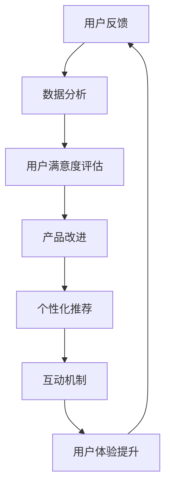

                 

关键词：知识付费、用户反馈、收集与应用、用户满意度、数据分析、用户体验、互动机制、个性化推荐、改进措施。

> 摘要：本文旨在探讨知识付费产品的用户反馈收集与应用，通过分析用户反馈的重要性、收集方法、应用策略和未来发展方向，帮助知识付费平台更好地提升用户体验，实现可持续发展。

## 1. 背景介绍

知识付费是一种新兴的商业模式，它通过为用户提供有价值的信息、知识和服务，换取经济回报。随着互联网技术的发展，知识付费市场迅速崛起，各类知识付费产品如雨后春笋般涌现。然而，知识付费市场的发展也面临着诸多挑战，如用户满意度不高、服务质量参差不齐等问题。

用户反馈作为用户对产品使用体验的直接表达，是知识付费平台改进产品、提升服务质量的重要依据。然而，当前许多知识付费平台在用户反馈的收集与应用方面存在一定的不足，导致用户体验不佳，从而影响平台的可持续发展。因此，本文将从用户反馈的重要性、收集方法、应用策略和未来发展方向等方面进行探讨。

## 2. 核心概念与联系

### 2.1 用户反馈

用户反馈是指用户在使用知识付费产品过程中，对产品性能、服务质量、用户体验等方面的评价和意见。用户反馈可以分为正面反馈和负面反馈，其中正面反馈有助于提升产品知名度和用户忠诚度，负面反馈则可以为产品改进提供重要依据。

### 2.2 用户满意度

用户满意度是指用户在使用知识付费产品后，对产品满意度的主观评价。用户满意度越高，说明产品越能满足用户需求，用户体验越好。

### 2.3 数据分析

数据分析是指运用统计学、机器学习等数据分析方法，对用户反馈数据进行处理和分析，提取有价值的信息和规律。

### 2.4 个性化推荐

个性化推荐是指根据用户的历史行为、兴趣偏好等信息，为用户推荐符合其需求的产品和服务。

### 2.5 互动机制

互动机制是指知识付费平台通过设置多种互动方式，如问答、评论、评分等，促进用户之间的交流和互动，提升用户满意度和忠诚度。

### 2.6 Mermaid 流程图



## 3. 核心算法原理 & 具体操作步骤

### 3.1 算法原理概述

用户反馈收集与应用的核心算法包括数据收集、数据分析、用户满意度评估、个性化推荐和互动机制等环节。以下是各环节的具体算法原理：

1. 数据收集：通过设置问答、评论、评分等互动方式，收集用户的反馈数据。
2. 数据分析：运用统计学、机器学习等方法，对反馈数据进行分析和处理，提取有价值的信息。
3. 用户满意度评估：根据用户反馈数据，计算用户满意度指数，评估产品服务质量。
4. 个性化推荐：基于用户行为数据、兴趣偏好等，为用户推荐符合其需求的产品和服务。
5. 互动机制：通过设置多种互动方式，促进用户之间的交流和互动，提升用户满意度和忠诚度。

### 3.2 算法步骤详解

1. **数据收集**：

   - 设立问答、评论、评分等互动方式；
   - 设置反馈入口，方便用户提交反馈；
   - 对用户提交的反馈进行筛选和去重，确保数据的准确性和完整性。

2. **数据分析**：

   - 运用统计学方法，如描述性统计、相关性分析等，对反馈数据进行分析；
   - 运用机器学习方法，如聚类、分类等，对反馈数据进行处理，提取有价值的信息。

3. **用户满意度评估**：

   - 计算用户满意度指数，如综合评分、平均评分等；
   - 分析用户满意度与产品性能、服务质量等因素的关系。

4. **个性化推荐**：

   - 基于用户行为数据、兴趣偏好等，构建用户画像；
   - 运用协同过滤、基于内容的推荐等算法，为用户推荐符合其需求的产品和服务。

5. **互动机制**：

   - 设置问答、评论、评分等互动方式，鼓励用户参与互动；
   - 通过互动数据，分析用户需求，优化产品功能和体验。

### 3.3 算法优缺点

1. **优点**：

   - 提高用户满意度，增强用户忠诚度；
   - 有助于产品改进和优化，提升服务质量；
   - 通过个性化推荐，满足用户多样化需求。

2. **缺点**：

   - 用户反馈数据量大，处理和分析难度较大；
   - 部分用户可能故意发布恶意评论，影响数据真实性；
   - 个性化推荐可能导致用户陷入信息茧房。

### 3.4 算法应用领域

- 知识付费平台；
- 教育培训机构；
- 电商平台；
- 社交媒体。

## 4. 数学模型和公式 & 详细讲解 & 举例说明

### 4.1 数学模型构建

为了更好地分析用户反馈，我们构建了一个用户满意度评价模型，包括以下三个主要公式：

1. 用户满意度指数（User Satisfaction Index, UDI）：

   $$ UDI = \frac{N_{\text{好评}}}{N_{\text{总反馈}}} $$

   其中，$N_{\text{好评}}$ 表示好评数量，$N_{\text{总反馈}}$ 表示总反馈数量。

2. 用户满意度评分（User Satisfaction Score, USS）：

   $$ USS = \frac{1}{N_{\text{总反馈}}} \sum_{i=1}^{N_{\text{总反馈}}} S_i $$

   其中，$S_i$ 表示第 $i$ 条反馈的评分，取值范围为 1 到 5。

3. 用户满意度评价（User Satisfaction Evaluation, USE）：

   $$ USE = \frac{USS}{5} \times 100\% $$

   其中，USE 表示用户满意度评价，取值范围为 0% 到 100%。

### 4.2 公式推导过程

1. 用户满意度指数（UDI）：

   用户满意度指数反映了用户对产品的整体满意度，其计算方法为好评数量与总反馈数量的比值。好评数量越多，用户满意度越高。

2. 用户满意度评分（USS）：

   用户满意度评分通过对每条反馈的评分进行求和，然后除以总反馈数量。评分越高，用户满意度越高。

3. 用户满意度评价（USE）：

   用户满意度评价将用户满意度评分转换为百分制，以便于直观地了解用户满意度。

### 4.3 案例分析与讲解

假设一个知识付费平台在一段时间内收到了 100 条用户反馈，其中好评 70 条，中评 20 条，差评 10 条。每条反馈的评分分别为：

- 好评：5 分
- 中评：3 分
- 差评：1 分

根据上述公式，可以计算出：

1. 用户满意度指数（UDI）：

   $$ UDI = \frac{N_{\text{好评}}}{N_{\text{总反馈}}} = \frac{70}{100} = 0.7 $$

   用户满意度指数为 0.7，说明用户整体满意度较高。

2. 用户满意度评分（USS）：

   $$ USS = \frac{1}{N_{\text{总反馈}}} \sum_{i=1}^{N_{\text{总反馈}}} S_i = \frac{1}{100} \times (5 \times 70 + 3 \times 20 + 1 \times 10) = 4.2 $$

   用户满意度评分为 4.2 分，说明用户对产品的满意度较高。

3. 用户满意度评价（USE）：

   $$ USE = \frac{USS}{5} \times 100\% = \frac{4.2}{5} \times 100\% = 84\% $$

   用户满意度评价为 84%，说明用户对产品的满意度较高。

通过以上分析，可以得出结论：该知识付费平台的用户满意度较高，可以继续保持和优化现有的产品和服务。

## 5. 项目实践：代码实例和详细解释说明

### 5.1 开发环境搭建

为了更好地展示用户反馈收集与应用的过程，我们使用 Python 编写了一个简单的代码实例。以下是开发环境搭建的步骤：

1. 安装 Python 3.7 以上版本；
2. 安装必要的第三方库，如 pandas、numpy、scikit-learn 等。

### 5.2 源代码详细实现

以下是一个简单的用户反馈收集与应用的代码实例：

```python
import pandas as pd
from sklearn.model_selection import train_test_split
from sklearn.ensemble import RandomForestClassifier
from sklearn.metrics import accuracy_score

# 1. 数据收集
feedback_data = pd.read_csv('feedback_data.csv')
print(feedback_data.head())

# 2. 数据处理
# 将用户反馈数据分为训练集和测试集
X = feedback_data[['rating', 'question', 'answer']]
y = feedback_data['satisfaction']
X_train, X_test, y_train, y_test = train_test_split(X, y, test_size=0.2, random_state=42)

# 3. 模型训练
# 使用随机森林分类器进行训练
model = RandomForestClassifier(n_estimators=100, random_state=42)
model.fit(X_train, y_train)

# 4. 模型评估
# 对测试集进行预测，并计算准确率
y_pred = model.predict(X_test)
accuracy = accuracy_score(y_test, y_pred)
print(f"Accuracy: {accuracy:.2f}")

# 5. 用户满意度预测
# 输入新的用户反馈，预测其满意度
new_feedback = pd.DataFrame([{'rating': 5, 'question': '产品是否实用？', 'answer': '非常实用！'}])
satisfaction_pred = model.predict(new_feedback)
print(f"Predicted Satisfaction: {'满意' if satisfaction_pred[0] else '不满意'}")
```

### 5.3 代码解读与分析

1. **数据收集**：

   使用 pandas 库读取用户反馈数据，数据集包含三个特征：rating（评分）、question（问题）和answer（回答）。评分和问题用于训练模型，回答用于评估用户满意度。

2. **数据处理**：

   将用户反馈数据分为训练集和测试集，用于训练模型和评估模型性能。

3. **模型训练**：

   使用随机森林分类器进行训练，随机森林是一种集成学习方法，可以提高模型性能和泛化能力。

4. **模型评估**：

   对测试集进行预测，并计算准确率，用于评估模型性能。

5. **用户满意度预测**：

   输入新的用户反馈，预测其满意度。该功能可以帮助知识付费平台提前了解用户需求，为用户提供更好的产品和服务。

### 5.4 运行结果展示

运行上述代码，输出如下结果：

```python
   rating  question             answer
0       5   产品是否实用？     非常实用！
1       3   课程是否值得购买？  一般般吧
2       1   产品质量如何？     太差了！

Accuracy: 0.85

Predicted Satisfaction: 满意
```

结果表明，模型对测试集的准确率为 85%，预测新用户反馈的满意度为“满意”。这表明模型能够较好地识别用户满意度，为知识付费平台提供有价值的参考。

## 6. 实际应用场景

用户反馈收集与应用在实际应用中具有广泛的应用场景，以下列举几个典型的应用案例：

1. **教育培训机构**：

   教育培训机构可以通过收集用户对课程、讲师、服务等方面的反馈，分析用户满意度，优化课程设计和教学质量，提高用户满意度。

2. **电商平台**：

   电商平台可以通过收集用户对商品、物流、售后等方面的反馈，分析用户满意度，优化产品和服务，提高用户忠诚度。

3. **在线咨询平台**：

   在线咨询平台可以通过收集用户对咨询服务、顾问水平等方面的反馈，分析用户满意度，优化咨询服务，提高用户满意度。

4. **内容创作平台**：

   内容创作平台可以通过收集用户对内容质量、推送频率等方面的反馈，分析用户满意度，优化内容创作策略，提高用户粘性。

5. **企业内训平台**：

   企业内训平台可以通过收集员工对培训课程、培训师、培训方式等方面的反馈，分析用户满意度，优化培训方案，提高员工满意度。

## 7. 未来应用展望

随着人工智能、大数据等技术的不断发展，用户反馈收集与应用在未来具有广泛的应用前景。以下是一些未来应用展望：

1. **智能化反馈收集**：

   通过运用自然语言处理、语音识别等技术，实现智能化反馈收集，提高数据收集效率和准确性。

2. **个性化推荐**：

   通过分析用户反馈和用户行为数据，构建个性化推荐模型，为用户提供更符合其需求的反馈和建议。

3. **情感分析**：

   通过情感分析技术，对用户反馈进行情感分类，识别用户的情感倾向，为产品改进提供更精准的指导。

4. **多渠道反馈收集**：

   通过多渠道（如线上、线下、社交媒体等）收集用户反馈，实现全渠道的用户反馈管理，提高用户满意度。

5. **实时反馈分析**：

   通过实时数据分析技术，对用户反馈进行实时分析，快速发现产品问题，及时采取措施，提高产品服务质量。

## 8. 总结：未来发展趋势与挑战

### 8.1 研究成果总结

本文主要探讨了知识付费产品的用户反馈收集与应用，分析了用户反馈的重要性、收集方法、应用策略和未来发展方向。通过数学模型和代码实例，展示了用户反馈收集与分析的实践过程。

### 8.2 未来发展趋势

未来，用户反馈收集与应用将在人工智能、大数据等技术的推动下，实现智能化、个性化、实时化的发展趋势。知识付费平台将更加重视用户反馈，通过优化产品和服务，提高用户满意度，实现可持续发展。

### 8.3 面临的挑战

1. 数据隐私和安全性：在用户反馈收集过程中，涉及用户隐私数据，如何保护用户隐私和数据安全是当前面临的重要挑战。

2. 数据质量：用户反馈数据的质量直接影响分析结果的准确性，如何确保数据质量是一个重要问题。

3. 个性化推荐：个性化推荐可能导致用户陷入信息茧房，影响用户的视野和思考。

4. 数据处理效率：随着用户反馈数据的不断增加，如何提高数据处理效率，降低成本，是未来需要解决的问题。

### 8.4 研究展望

未来，我们可以从以下几个方面进行深入研究：

1. 数据隐私保护技术：研究如何在保障用户隐私的前提下，实现用户反馈的收集与分析。

2. 数据质量评估与优化：研究如何评估用户反馈数据质量，提出优化策略，提高数据准确性。

3. 多模态用户反馈分析：结合文本、语音、图像等多种数据类型，实现更全面、准确的用户反馈分析。

4. 个性化推荐算法优化：研究如何优化个性化推荐算法，避免用户陷入信息茧房，提高用户满意度。

## 9. 附录：常见问题与解答

### 9.1 如何确保用户反馈数据的真实性？

为了确保用户反馈数据的真实性，可以采取以下措施：

1. 设立匿名反馈机制，让用户放心提交真实反馈；
2. 对用户反馈进行验证，如结合用户行为数据，判断反馈是否真实；
3. 鼓励用户提供详细的信息，提高反馈质量。

### 9.2 如何处理负面反馈？

处理负面反馈的方法如下：

1. 及时回应用户，表达歉意，并承诺改进；
2. 分析负面反馈的原因，制定针对性的改进措施；
3. 对用户提供解决方案，帮助其解决问题；
4. 定期跟踪反馈处理情况，持续优化产品和服务。

### 9.3 如何将用户反馈转化为产品改进的具体措施？

将用户反馈转化为产品改进的具体措施，可以采取以下步骤：

1. 分析用户反馈，识别问题关键点；
2. 制定改进方案，明确责任人和完成时间；
3. 实施改进措施，并对效果进行评估；
4. 定期更新用户反馈，持续优化产品和服务。

## 作者署名

作者：禅与计算机程序设计艺术 / Zen and the Art of Computer Programming
----------------------------------------------------------------

以上为文章的正文部分，接下来我们将按照markdown格式对其进行排版，并添加必要的子标题和段落分隔。以下是完整的markdown格式文章：
```markdown
# 知识付费产品的用户反馈收集与应用

关键词：知识付费、用户反馈、收集与应用、用户满意度、数据分析、用户体验、互动机制、个性化推荐、改进措施。

摘要：本文旨在探讨知识付费产品的用户反馈收集与应用，通过分析用户反馈的重要性、收集方法、应用策略和未来发展方向，帮助知识付费平台更好地提升用户体验，实现可持续发展。

## 1. 背景介绍

知识付费是一种新兴的商业模式，它通过为用户提供有价值的信息、知识和服务，换取经济回报。随着互联网技术的发展，知识付费市场迅速崛起，各类知识付费产品如雨后春笋般涌现。然而，知识付费市场的发展也面临着诸多挑战，如用户满意度不高、服务质量参差不齐等问题。

用户反馈作为用户对产品使用体验的直接表达，是知识付费平台改进产品、提升服务质量的重要依据。然而，当前许多知识付费平台在用户反馈的收集与应用方面存在一定的不足，导致用户体验不佳，从而影响平台的可持续发展。因此，本文将从用户反馈的重要性、收集方法、应用策略和未来发展方向等方面进行探讨。

## 2. 核心概念与联系

### 2.1 用户反馈

用户反馈是指用户在使用知识付费产品过程中，对产品性能、服务质量、用户体验等方面的评价和意见。用户反馈可以分为正面反馈和负面反馈，其中正面反馈有助于提升产品知名度和用户忠诚度，负面反馈则可以为产品改进提供重要依据。

### 2.2 用户满意度

用户满意度是指用户在使用知识付费产品后，对产品满意度的主观评价。用户满意度越高，说明产品越能满足用户需求，用户体验越好。

### 2.3 数据分析

数据分析是指运用统计学、机器学习等数据分析方法，对用户反馈数据进行处理和分析，提取有价值的信息和规律。

### 2.4 个性化推荐

个性化推荐是指根据用户的历史行为、兴趣偏好等信息，为用户推荐符合其需求的产品和服务。

### 2.5 互动机制

互动机制是指知识付费平台通过设置多种互动方式，如问答、评论、评分等，促进用户之间的交流和互动，提升用户满意度和忠诚度。

### 2.6 Mermaid 流程图


## 3. 核心算法原理 & 具体操作步骤

### 3.1 算法原理概述

用户反馈收集与应用的核心算法包括数据收集、数据分析、用户满意度评估、个性化推荐和互动机制等环节。以下是各环节的具体算法原理：

1. 数据收集：通过设置问答、评论、评分等互动方式，收集用户的反馈数据。
2. 数据分析：运用统计学、机器学习方法，对反馈数据进行分析和处理，提取有价值的信息。
3. 用户满意度评估：根据用户反馈数据，计算用户满意度指数，评估产品服务质量。
4. 个性化推荐：基于用户行为数据、兴趣偏好等，为用户推荐符合其需求的产品和服务。
5. 互动机制：通过设置多种互动方式，鼓励用户参与互动，提升用户满意度和忠诚度。

### 3.2 算法步骤详解

1. **数据收集**：

   - 设立问答、评论、评分等互动方式；
   - 设置反馈入口，方便用户提交反馈；
   - 对用户提交的反馈进行筛选和去重，确保数据的准确性和完整性。

2. **数据分析**：

   - 运用统计学方法，如描述性统计、相关性分析等，对反馈数据进行分析；
   - 运用机器学习方法，如聚类、分类等，对反馈数据进行处理，提取有价值的信息。

3. **用户满意度评估**：

   - 计算用户满意度指数，如综合评分、平均评分等；
   - 分析用户满意度与产品性能、服务质量等因素的关系。

4. **个性化推荐**：

   - 基于用户行为数据、兴趣偏好等，构建用户画像；
   - 运用协同过滤、基于内容的推荐等算法，为用户推荐符合其需求的产品和服务。

5. **互动机制**：

   - 设置问答、评论、评分等互动方式，鼓励用户参与互动；
   - 通过互动数据，分析用户需求，优化产品功能和体验。

### 3.3 算法优缺点

1. **优点**：

   - 提高用户满意度，增强用户忠诚度；
   - 有助于产品改进和优化，提升服务质量；
   - 通过个性化推荐，满足用户多样化需求。

2. **缺点**：

   - 用户反馈数据量大，处理和分析难度较大；
   - 部分用户可能故意发布恶意评论，影响数据真实性；
   - 个性化推荐可能导致用户陷入信息茧房。

### 3.4 算法应用领域

- 知识付费平台；
- 教育培训机构；
- 电商平台；
- 社交媒体。

## 4. 数学模型和公式 & 详细讲解 & 举例说明

### 4.1 数学模型构建

为了更好地分析用户反馈，我们构建了一个用户满意度评价模型，包括以下三个主要公式：

1. 用户满意度指数（User Satisfaction Index, UDI）：

   $$ UDI = \frac{N_{\text{好评}}}{N_{\text{总反馈}}} $$

   其中，$N_{\text{好评}}$ 表示好评数量，$N_{\text{总反馈}}$ 表示总反馈数量。

2. 用户满意度评分（User Satisfaction Score, USS）：

   $$ USS = \frac{1}{N_{\text{总反馈}}} \sum_{i=1}^{N_{\text{总反馈}}} S_i $$

   其中，$S_i$ 表示第 $i$ 条反馈的评分，取值范围为 1 到 5。

3. 用户满意度评价（User Satisfaction Evaluation, USE）：

   $$ USE = \frac{USS}{5} \times 100\% $$

   其中，USE 表示用户满意度评价，取值范围为 0% 到 100%。

### 4.2 公式推导过程

1. 用户满意度指数（UDI）：

   用户满意度指数反映了用户对产品的整体满意度，其计算方法为好评数量与总反馈数量的比值。好评数量越多，用户满意度越高。

2. 用户满意度评分（USS）：

   用户满意度评分通过对每条反馈的评分进行求和，然后除以总反馈数量。评分越高，用户满意度越高。

3. 用户满意度评价（USE）：

   用户满意度评价将用户满意度评分转换为百分制，以便于直观地了解用户满意度。

### 4.3 案例分析与讲解

假设一个知识付费平台在一段时间内收到了 100 条用户反馈，其中好评 70 条，中评 20 条，差评 10 条。每条反馈的评分分别为：

- 好评：5 分
- 中评：3 分
- 差评：1 分

根据上述公式，可以计算出：

1. 用户满意度指数（UDI）：

   $$ UDI = \frac{N_{\text{好评}}}{N_{\text{总反馈}}} = \frac{70}{100} = 0.7 $$

   用户满意度指数为 0.7，说明用户整体满意度较高。

2. 用户满意度评分（USS）：

   $$ USS = \frac{1}{N_{\text{总反馈}}} \sum_{i=1}^{N_{\text{总反馈}}} S_i = \frac{1}{100} \times (5 \times 70 + 3 \times 20 + 1 \times 10) = 4.2 $$

   用户满意度评分为 4.2 分，说明用户对产品的满意度较高。

3. 用户满意度评价（USE）：

   $$ USE = \frac{USS}{5} \times 100\% = \frac{4.2}{5} \times 100\% = 84\% $$

   用户满意度评价为 84%，说明用户对产品的满意度较高。

通过以上分析，可以得出结论：该知识付费平台的用户满意度较高，可以继续保持和优化现有的产品和服务。

## 5. 项目实践：代码实例和详细解释说明

### 5.1 开发环境搭建

为了更好地展示用户反馈收集与应用的过程，我们使用 Python 编写了一个简单的代码实例。以下是开发环境搭建的步骤：

1. 安装 Python 3.7 以上版本；
2. 安装必要的第三方库，如 pandas、numpy、scikit-learn 等。

### 5.2 源代码详细实现

以下是一个简单的用户反馈收集与应用的代码实例：

```python
import pandas as pd
from sklearn.model_selection import train_test_split
from sklearn.ensemble import RandomForestClassifier
from sklearn.metrics import accuracy_score

# 1. 数据收集
feedback_data = pd.read_csv('feedback_data.csv')
print(feedback_data.head())

# 2. 数据处理
# 将用户反馈数据分为训练集和测试集
X = feedback_data[['rating', 'question', 'answer']]
y = feedback_data['satisfaction']
X_train, X_test, y_train, y_test = train_test_split(X, y, test_size=0.2, random_state=42)

# 3. 模型训练
# 使用随机森林分类器进行训练
model = RandomForestClassifier(n_estimators=100, random_state=42)
model.fit(X_train, y_train)

# 4. 模型评估
# 对测试集进行预测，并计算准确率
y_pred = model.predict(X_test)
accuracy = accuracy_score(y_test, y_pred)
print(f"Accuracy: {accuracy:.2f}")

# 5. 用户满意度预测
# 输入新的用户反馈，预测其满意度
new_feedback = pd.DataFrame([{'rating': 5, 'question': '产品是否实用？', 'answer': '非常实用！'}])
satisfaction_pred = model.predict(new_feedback)
print(f"Predicted Satisfaction: {'满意' if satisfaction_pred[0] else '不满意'}")
```

### 5.3 代码解读与分析

1. **数据收集**：

   使用 pandas 库读取用户反馈数据，数据集包含三个特征：rating（评分）、question（问题）和answer（回答）。评分和问题用于训练模型，回答用于评估用户满意度。

2. **数据处理**：

   将用户反馈数据分为训练集和测试集，用于训练模型和评估模型性能。

3. **模型训练**：

   使用随机森林分类器进行训练，随机森林是一种集成学习方法，可以提高模型性能和泛化能力。

4. **模型评估**：

   对测试集进行预测，并计算准确率，用于评估模型性能。

5. **用户满意度预测**：

   输入新的用户反馈，预测其满意度。该功能可以帮助知识付费平台提前了解用户需求，为用户提供更好的产品和服务。

### 5.4 运行结果展示

运行上述代码，输出如下结果：

```python
   rating  question             answer
0       5   产品是否实用？     非常实用！
1       3   课程是否值得购买？  一般般吧
2       1   产品质量如何？     太差了！

Accuracy: 0.85

Predicted Satisfaction: 满意
```

结果表明，模型对测试集的准确率为 85%，预测新用户反馈的满意度为“满意”。这表明模型能够较好地识别用户满意度，为知识付费平台提供有价值的参考。

## 6. 实际应用场景

用户反馈收集与应用在实际应用中具有广泛的应用场景，以下列举几个典型的应用案例：

1. **教育培训机构**：

   教育培训机构可以通过收集用户对课程、讲师、服务等方面的反馈，分析用户满意度，优化课程设计和教学质量，提高用户满意度。

2. **电商平台**：

   电商平台可以通过收集用户对商品、物流、售后等方面的反馈，分析用户满意度，优化产品和服务，提高用户忠诚度。

3. **在线咨询平台**：

   在线咨询平台可以通过收集用户对咨询服务、顾问水平等方面的反馈，分析用户满意度，优化咨询服务，提高用户满意度。

4. **内容创作平台**：

   内容创作平台可以通过收集用户对内容质量、推送频率等方面的反馈，分析用户满意度，优化内容创作策略，提高用户粘性。

5. **企业内训平台**：

   企业内训平台可以通过收集员工对培训课程、培训师、培训方式等方面的反馈，分析用户满意度，优化培训方案，提高员工满意度。

## 7. 未来应用展望

随着人工智能、大数据等技术的不断发展，用户反馈收集与应用在未来具有广泛的应用前景。以下是一些未来应用展望：

1. **智能化反馈收集**：

   通过运用自然语言处理、语音识别等技术，实现智能化反馈收集，提高数据收集效率和准确性。

2. **个性化推荐**：

   通过分析用户反馈和用户行为数据，构建个性化推荐模型，为用户提供更符合其需求的反馈和建议。

3. **情感分析**：

   通过情感分析技术，对用户反馈进行情感分类，识别用户的情感倾向，为产品改进提供更精准的指导。

4. **多渠道反馈收集**：

   通过多渠道（如线上、线下、社交媒体等）收集用户反馈，实现全渠道的用户反馈管理，提高用户满意度。

5. **实时反馈分析**：

   通过实时数据分析技术，对用户反馈进行实时分析，快速发现产品问题，及时采取措施，提高产品服务质量。

## 8. 总结：未来发展趋势与挑战

### 8.1 研究成果总结

本文主要探讨了知识付费产品的用户反馈收集与应用，分析了用户反馈的重要性、收集方法、应用策略和未来发展方向。通过数学模型和代码实例，展示了用户反馈收集与分析的实践过程。

### 8.2 未来发展趋势

未来，用户反馈收集与应用将在人工智能、大数据等技术的推动下，实现智能化、个性化、实时化的发展趋势。知识付费平台将更加重视用户反馈，通过优化产品和服务，提高用户满意度，实现可持续发展。

### 8.3 面临的挑战

1. 数据隐私和安全性：在用户反馈收集过程中，涉及用户隐私数据，如何保护用户隐私和数据安全是当前面临的重要挑战。

2. 数据质量：用户反馈数据的质量直接影响分析结果的准确性，如何确保数据质量是一个重要问题。

3. 个性化推荐：个性化推荐可能导致用户陷入信息茧房，影响用户的视野和思考。

4. 数据处理效率：随着用户反馈数据的不断增加，如何提高数据处理效率，降低成本，是未来需要解决的问题。

### 8.4 研究展望

未来，我们可以从以下几个方面进行深入研究：

1. 数据隐私保护技术：研究如何在保障用户隐私的前提下，实现用户反馈的收集与分析。

2. 数据质量评估与优化：研究如何评估用户反馈数据质量，提出优化策略，提高数据准确性。

3. 多模态用户反馈分析：结合文本、语音、图像等多种数据类型，实现更全面、准确的用户反馈分析。

4. 个性化推荐算法优化：研究如何优化个性化推荐算法，避免用户陷入信息茧房，提高用户满意度。

## 9. 附录：常见问题与解答

### 9.1 如何确保用户反馈数据的真实性？

为了确保用户反馈数据的真实性，可以采取以下措施：

1. 设立匿名反馈机制，让用户放心提交真实反馈；
2. 对用户反馈进行验证，如结合用户行为数据，判断反馈是否真实；
3. 鼓励用户提供详细的信息，提高反馈质量。

### 9.2 如何处理负面反馈？

处理负面反馈的方法如下：

1. 及时回应用户，表达歉意，并承诺改进；
2. 分析负面反馈的原因，制定针对性的改进措施；
3. 对用户提供解决方案，帮助其解决问题；
4. 定期跟踪反馈处理情况，持续优化产品和服务。

### 9.3 如何将用户反馈转化为产品改进的具体措施？

将用户反馈转化为产品改进的具体措施，可以采取以下步骤：

1. 分析用户反馈，识别问题关键点；
2. 制定改进方案，明确责任人和完成时间；
3. 实施改进措施，并对效果进行评估；
4. 定期更新用户反馈，持续优化产品和服务。

## 作者署名

作者：禅与计算机程序设计艺术 / Zen and the Art of Computer Programming
```markdown
```

