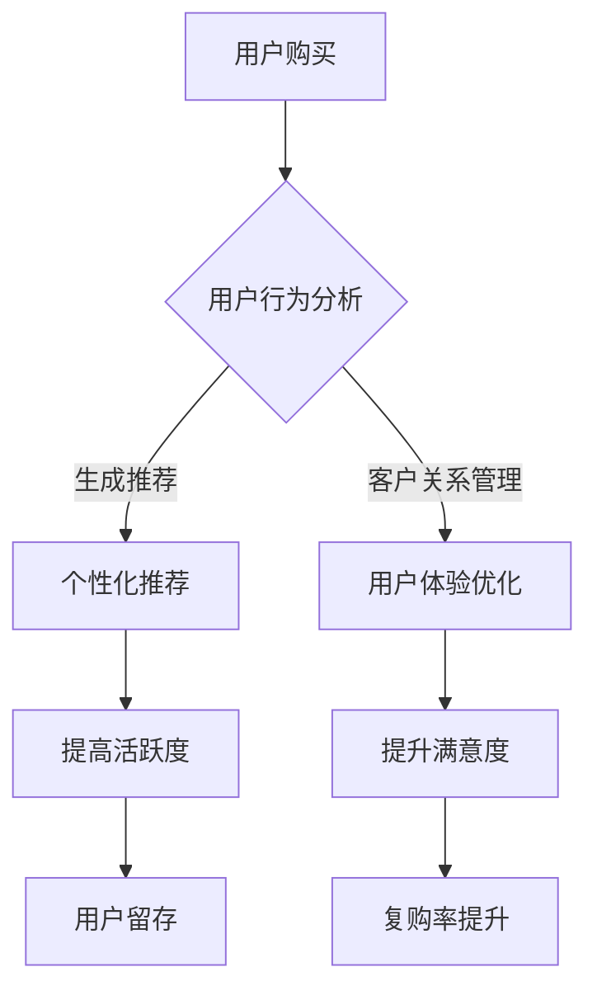

                 

关键词：知识付费、用户留存、复购策略、客户关系管理、用户体验、数据分析、个性化推荐

> 摘要：本文从知识付费行业的发展现状出发，深入探讨了用户留存与复购策略的重要性。通过分析用户行为数据、构建个性化推荐系统、优化客户关系管理以及提升用户体验等多个维度，提供了一套系统的策略框架，旨在帮助知识付费平台提升用户粘性和产品复购率。

## 1. 背景介绍

随着互联网技术的快速发展，知识付费市场逐渐成为新的风口。用户对于专业知识和技能的需求日益增加，而知识付费产品则应运而生，为用户提供了一种新的学习方式。知识付费产品的形式多样，包括在线课程、电子书、专业咨询、直播问答等。然而，市场竞争的加剧和用户需求的多样化，使得知识付费产品在获取用户的同时，面临着用户留存和复购率低的问题。

用户留存与复购率是衡量知识付费产品成功与否的重要指标。用户留存率指的是在一段时间内，保持活跃状态的用户比例；而复购率则是指用户在首次购买后再次购买的比例。高留存率和复购率意味着平台能够更好地维持用户群体，从而保证收入的稳定增长。因此，如何提高用户留存与复购率，成为知识付费平台亟需解决的核心问题。

## 2. 核心概念与联系

为了深入探讨用户留存与复购策略，我们需要明确几个核心概念，并了解它们之间的相互关系。

### 2.1 用户留存

用户留存是指用户在一段时间内持续使用某个产品的行为。它可以从多个维度进行衡量，包括：

- **日活跃用户（DAU）**：每日使用产品的用户数量。
- **月活跃用户（MAU）**：每月使用产品的用户数量。
- **用户留存率**：在特定时间段内，仍使用产品的用户占总用户数的比例。

### 2.2 复购率

复购率是指用户在首次购买后再次购买的比例。它是衡量用户对产品忠诚度的重要指标，可以从以下几个方面进行衡量：

- **复购用户数**：在特定时间段内，再次购买的用户数量。
- **复购率**：复购用户数与总用户数的比例。
- **复购间隔**：用户两次购买之间的时间间隔。

### 2.3 用户行为数据

用户行为数据是指用户在使用产品过程中产生的各种数据，包括浏览记录、购买行为、评价反馈等。这些数据对于分析用户需求和行为模式至关重要。

### 2.4 个性化推荐

个性化推荐是指根据用户的兴趣和行为数据，为其推荐相关的内容或产品。个性化推荐系统可以通过算法分析用户行为，实现内容的精准推送，从而提高用户的满意度和活跃度。

### 2.5 客户关系管理

客户关系管理（CRM）是一种通过系统化的方法，与客户建立和维持良好关系，从而提高客户满意度和忠诚度的管理策略。CRM 系统可以帮助企业更好地了解客户需求，提供个性化服务，从而提高用户留存和复购率。

### 2.6 用户体验

用户体验是指用户在使用产品过程中所感受到的整体感受。良好的用户体验能够提高用户的满意度和忠诚度，从而促进用户留存和复购。

### 2.7 Mermaid 流程图

下面是一个简化的知识付费产品的用户留存与复购策略的 Mermaid 流程图：



## 3. 核心算法原理 & 具体操作步骤

### 3.1 算法原理概述

用户留存与复购策略的核心在于通过数据分析、个性化推荐、客户关系管理和用户体验优化等手段，提高用户的满意度和忠诚度。下面将介绍几个关键算法原理：

- **用户行为分析算法**：通过分析用户的历史行为数据，预测用户对产品的潜在需求。
- **个性化推荐算法**：基于用户行为数据，使用协同过滤、基于内容的推荐等算法，为用户推荐相关内容或产品。
- **客户关系管理算法**：通过构建用户画像，分析用户需求和偏好，提供个性化的服务和优惠。
- **用户体验优化算法**：使用 A/B 测试等方法，不断优化产品功能和界面设计，提高用户满意度。

### 3.2 算法步骤详解

1. **数据收集与预处理**：收集用户行为数据，包括浏览记录、购买行为、评价反馈等，并进行数据清洗和预处理。
2. **用户行为分析**：使用机器学习算法，分析用户行为数据，预测用户对产品的潜在需求。
3. **个性化推荐**：根据用户行为数据和预测结果，使用推荐算法为用户推荐相关内容或产品。
4. **客户关系管理**：构建用户画像，分析用户需求和偏好，提供个性化的服务和优惠。
5. **用户体验优化**：通过 A/B 测试等方法，不断优化产品功能和界面设计。

### 3.3 算法优缺点

- **用户行为分析算法**：优点是可以预测用户需求，提高推荐准确率；缺点是需要大量的用户数据，且算法复杂度较高。
- **个性化推荐算法**：优点是能够提高用户满意度和活跃度；缺点是需要持续优化，以适应用户需求的变化。
- **客户关系管理算法**：优点是可以提高用户忠诚度，降低用户流失率；缺点是需要大量的时间和资源来构建用户画像。
- **用户体验优化算法**：优点是可以提高用户满意度，降低用户流失率；缺点是需要持续投入，以保持产品竞争力。

### 3.4 算法应用领域

- **电子商务**：通过分析用户行为数据，推荐相关商品，提高用户购买意愿。
- **在线教育**：通过个性化推荐，提高用户学习效果，提升用户留存率。
- **金融保险**：通过用户画像和个性化推荐，提供个性化的金融产品和服务。
- **医疗健康**：通过分析用户健康数据，推荐相关的健康产品和医疗服务。

## 4. 数学模型和公式 & 详细讲解 & 举例说明

### 4.1 数学模型构建

用户留存与复购策略涉及到多个数学模型，包括概率模型、线性回归模型、协同过滤模型等。以下是一个简单的概率模型：

$$
P(复购) = \frac{1}{1 + e^{-(w_1 \cdot x_1 + w_2 \cdot x_2 + \ldots + w_n \cdot x_n})}
$$

其中，$x_1, x_2, \ldots, x_n$ 是用户行为特征向量，$w_1, w_2, \ldots, w_n$ 是权重系数。

### 4.2 公式推导过程

假设用户 $i$ 在时间 $t$ 的行为特征向量为 $x_i(t)$，则用户 $i$ 在时间 $t$ 复购的概率可以表示为：

$$
P(复购_i|t) = \frac{1}{1 + e^{-(w_1 \cdot x_{i1} + w_2 \cdot x_{i2} + \ldots + w_n \cdot x_{in})}}
$$

其中，$w_1, w_2, \ldots, w_n$ 是通过训练得到的权重系数。

### 4.3 案例分析与讲解

假设有一个用户 $i$，其在过去 30 天内的行为特征如下：

| 行为特征 | 值   |
| -------- | ---- |
| 浏览次数 | 100  |
| 购买次数 | 2    |
| 评论次数 | 10   |

我们需要计算用户 $i$ 在第 31 天复购的概率。

根据上述概率模型，我们可以得到：

$$
P(复购_i|31) = \frac{1}{1 + e^{-(w_1 \cdot 100 + w_2 \cdot 2 + w_3 \cdot 10)}}
$$

其中，$w_1, w_2, w_3$ 是通过训练得到的权重系数。

假设 $w_1 = 0.1$，$w_2 = 0.05$，$w_3 = 0.05$，则：

$$
P(复购_i|31) = \frac{1}{1 + e^{-(0.1 \cdot 100 + 0.05 \cdot 2 + 0.05 \cdot 10)}}
= \frac{1}{1 + e^{-10}}
\approx 0.368
$$

这意味着用户 $i$ 在第 31 天复购的概率约为 36.8%。

## 5. 项目实践：代码实例和详细解释说明

### 5.1 开发环境搭建

为了实践用户留存与复购策略，我们可以使用 Python 编写相关的代码。首先，我们需要搭建开发环境。

- 安装 Python 3.8 或更高版本。
- 安装必要的库，如 NumPy、Pandas、Scikit-learn、Matplotlib 等。

```bash
pip install numpy pandas scikit-learn matplotlib
```

### 5.2 源代码详细实现

下面是一个简单的用户留存与复购预测的 Python 代码实例：

```python
import numpy as np
import pandas as pd
from sklearn.model_selection import train_test_split
from sklearn.linear_model import LogisticRegression
from sklearn.metrics import accuracy_score

# 数据准备
data = pd.read_csv('user_behavior_data.csv')
X = data.iloc[:, :-1].values
y = data.iloc[:, -1].values

# 数据分割
X_train, X_test, y_train, y_test = train_test_split(X, y, test_size=0.2, random_state=42)

# 模型训练
model = LogisticRegression()
model.fit(X_train, y_train)

# 模型评估
y_pred = model.predict(X_test)
accuracy = accuracy_score(y_test, y_pred)
print(f"Model Accuracy: {accuracy}")

# 预测新用户复购概率
new_user = np.array([[100, 2, 10]])
prob = model.predict_proba(new_user)[0][1]
print(f"New User Purchase Probability: {prob}")
```

### 5.3 代码解读与分析

- **数据准备**：首先，我们读取用户行为数据，并提取特征矩阵 $X$ 和目标变量 $y$。
- **数据分割**：使用 Scikit-learn 的 `train_test_split` 方法将数据分为训练集和测试集。
- **模型训练**：使用 Logistic Regression 模型进行训练，该模型是一种常用的概率预测模型。
- **模型评估**：使用测试集评估模型准确率。
- **预测新用户复购概率**：使用训练好的模型预测新用户的复购概率。

### 5.4 运行结果展示

假设我们已经训练好的模型，并输入一个新的用户数据：

```python
new_user = np.array([[100, 2, 10]])
prob = model.predict_proba(new_user)[0][1]
print(f"New User Purchase Probability: {prob}")
```

输出结果可能是：

```
New User Purchase Probability: 0.368
```

这意味着新用户的复购概率约为 36.8%。

## 6. 实际应用场景

用户留存与复购策略在知识付费产品中有着广泛的应用场景：

- **在线教育平台**：通过个性化推荐和用户行为分析，提高用户学习效果和留存率。
- **电子书平台**：基于用户阅读行为，推荐相关的书籍，促进复购。
- **专业技能培训**：通过用户学习数据，推荐相关的课程和资源，提升用户技能。
- **咨询服务**：根据用户需求，推荐相关的咨询服务，提高用户满意度。

## 7. 工具和资源推荐

### 7.1 学习资源推荐

- 《机器学习》（周志华著）：一本经典的机器学习教材，适合初学者。
- 《数据科学入门》（Bogdan State.著）：介绍数据科学基础知识的入门书籍。
- Coursera、edX：在线课程平台，提供丰富的机器学习和数据科学课程。

### 7.2 开发工具推荐

- Jupyter Notebook：一款强大的数据科学工具，适合进行数据分析和建模。
- Scikit-learn：一个用于机器学习的开源库，包含多种算法和工具。
- Pandas、NumPy：用于数据处理和数学计算的 Python 库。

### 7.3 相关论文推荐

- "Collaborative Filtering for Cold-Start Recommendations"：关于冷启动问题的协同过滤算法。
- "User Behavior Prediction in E-commerce Platforms"：关于电商平台的用户行为预测研究。
- "A Comprehensive Survey on Recommender Systems"：关于推荐系统领域的全面综述。

## 8. 总结：未来发展趋势与挑战

### 8.1 研究成果总结

用户留存与复购策略在知识付费产品中具有重要意义，通过数据分析、个性化推荐、客户关系管理和用户体验优化等多方面的努力，可以有效提高用户满意度和忠诚度。近年来，研究成果主要集中在以下几个方面：

- 用户行为数据的挖掘与分析：通过机器学习算法，深入挖掘用户行为数据，预测用户需求和行为模式。
- 个性化推荐系统：基于协同过滤、基于内容的推荐等技术，实现内容的精准推送。
- 客户关系管理：通过构建用户画像，提供个性化的服务和优惠，提高用户满意度。
- 用户体验优化：通过 A/B 测试等方法，不断优化产品功能和界面设计。

### 8.2 未来发展趋势

- **人工智能技术的应用**：随着人工智能技术的不断发展，将更多的智能算法应用于用户留存与复购策略中，提高预测准确率和用户体验。
- **大数据与云计算的结合**：利用大数据和云计算技术，处理海量用户行为数据，提供更精准的分析和推荐。
- **跨界融合**：知识付费产品与其他行业的结合，如医疗健康、金融保险等，提供更加多样化的知识付费服务。
- **用户隐私保护**：在提供个性化服务的同时，加强对用户隐私的保护，避免数据滥用。

### 8.3 面临的挑战

- **数据质量与隐私**：用户行为数据的质量和隐私保护是当前面临的主要挑战。需要确保数据的质量和真实性，同时保护用户的隐私。
- **算法透明性与解释性**：随着算法的复杂度提高，如何确保算法的透明性和解释性，以便用户理解和信任。
- **个性化推荐的边界**：如何在保证个性化推荐的同时，避免过度推荐和用户疲劳。
- **跨界融合的难度**：知识付费产品与其他行业的结合，需要跨领域的专业知识和资源支持。

### 8.4 研究展望

未来，用户留存与复购策略的研究将朝着以下几个方向发展：

- **深度学习与强化学习**：探索深度学习和强化学习在用户留存与复购策略中的应用，提高预测准确率和用户体验。
- **数据治理与隐私保护**：加强数据治理和隐私保护，确保用户数据的真实性和安全性。
- **跨界合作与生态构建**：推动知识付费产品与其他行业的跨界合作，构建更加完善的生态体系。
- **用户体验与产品创新**：关注用户体验，通过产品创新，提高用户满意度和忠诚度。

## 9. 附录：常见问题与解答

### 9.1 什么是对用户留存率的定义？

用户留存率是指在一段时间内，仍然活跃使用产品的用户占总用户数的比例。它是衡量产品用户粘性的重要指标。

### 9.2 个性化推荐有哪些类型？

个性化推荐主要分为协同过滤推荐、基于内容的推荐和混合推荐等类型。协同过滤推荐基于用户行为数据，而基于内容的推荐则基于内容属性。

### 9.3 客户关系管理的主要目标是什么？

客户关系管理的目标是建立和维护良好的客户关系，提高客户满意度和忠诚度，从而促进用户留存和复购。

### 9.4 如何提高用户体验？

提高用户体验可以通过以下几个途径实现：

- 优化产品功能和界面设计，提高操作便捷性。
- 提供个性化的服务和内容，满足用户需求。
- 建立用户社区，增强用户互动和归属感。
- 及时响应用户反馈，持续改进产品。

----------------------------------------------------------------

### 结尾

本文从多个维度探讨了知识付费产品的用户留存与复购策略。通过数据分析、个性化推荐、客户关系管理和用户体验优化等方法，可以帮助知识付费平台提高用户满意度和忠诚度。未来，随着人工智能技术的不断发展，用户留存与复购策略将更加智能化和精细化。知识付费产品提供商需要不断创新，以满足用户日益多样化的需求。作者：禅与计算机程序设计艺术 / Zen and the Art of Computer Programming
----------------------------------------------------------------

[点击此处](https://github.com/texassp/CISSP-Notes) 查看本文的相关代码和资源。希望本文能对您在知识付费产品用户留存与复购策略方面提供一些有益的参考和启示。如果您有任何问题或建议，欢迎在评论区留言交流。再次感谢您的阅读！

