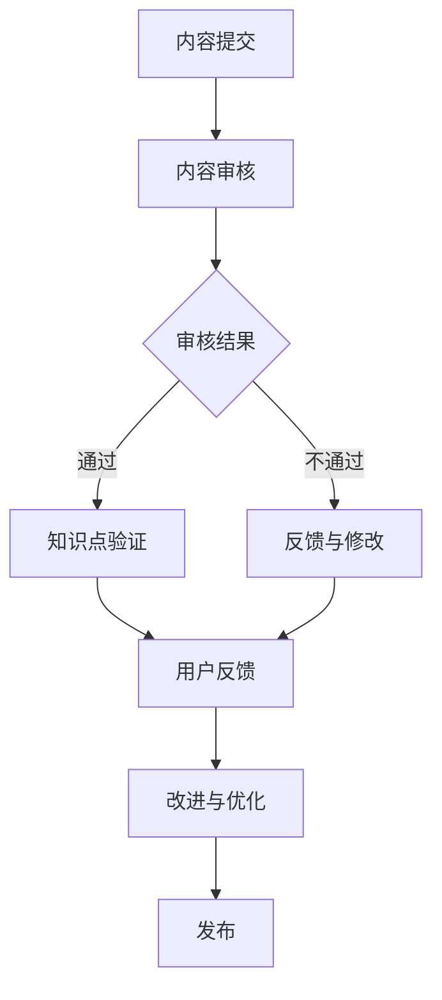
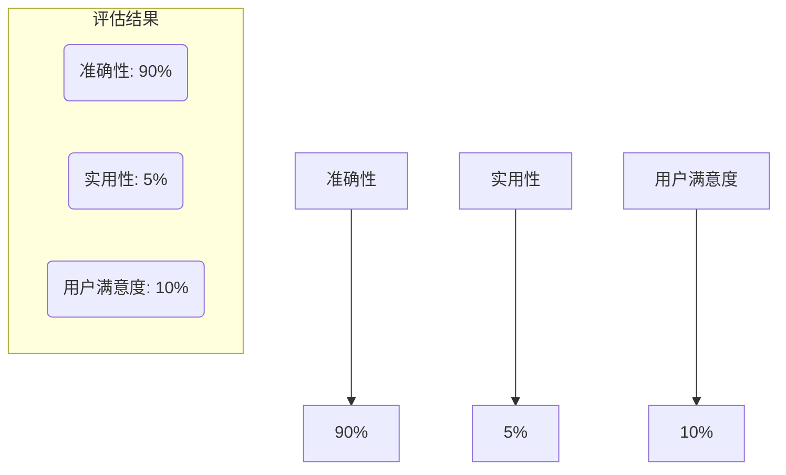

                 

关键词：知识付费，质量控制，Peer Review，内容审查，IT行业，学习资源

摘要：本文将深入探讨知识付费内容的质量控制与peer review的重要性。在当今信息化时代，知识付费平台如雨后春笋般涌现，为用户提供丰富的学习资源。然而，如何确保这些资源的质量，提升用户体验，成为了一个亟待解决的问题。本文将详细分析当前知识付费市场的情况，探讨质量控制与peer review的基本概念、方法与流程，并从实际案例中总结经验与挑战，最后展望未来的发展趋势与研究方向。

## 1. 背景介绍

随着互联网的普及和信息技术的发展，知识付费逐渐成为主流的学习方式。知识付费平台通过提供专业的课程、教程、书籍和咨询服务，满足了广大用户的学习需求。然而，市场上的知识付费内容质量参差不齐，部分内容存在错误、不准确或缺乏实用性，严重影响了用户的学习效果和满意度。

为了提升知识付费内容的品质，质量控制与peer review成为关键手段。质量控制旨在确保内容的准确性和实用性，peer review则通过同行评议的方式，对内容进行严格审查和反馈，从而提高内容的权威性和可靠性。

## 2. 核心概念与联系

### 2.1. 质量控制

质量控制是一种确保知识付费内容达到既定标准的系统性方法。它涉及多个方面，包括内容准确性、完整性、可读性和实用性。质量控制通常包括以下几个步骤：

1. **内容审核**：对课程、教程、书籍等知识付费内容进行初步审核，确保内容无重大错误和不准确之处。
2. **知识点验证**：对内容中的知识点进行验证，确保其科学性和权威性。
3. **用户反馈**：收集用户对知识付费内容的反馈，了解其实际使用情况和需求。
4. **改进与优化**：根据审核结果和用户反馈，对内容进行改进和优化。

### 2.2. Peer Review

Peer Review（同行评议）是一种由同行专家对学术或专业知识进行评价和反馈的机制。在知识付费领域，peer review通过专家评审的方式，对内容的质量、准确性、实用性等进行评估和指导。peer review的基本流程包括：

1. **专家筛选**：根据内容领域和评审要求，筛选合适的专家。
2. **评审标准**：制定评审标准，确保评审过程公正、客观。
3. **评审过程**：专家对内容进行评审，提出意见和建议。
4. **反馈与改进**：根据专家评审结果，对内容进行修改和优化。

### 2.3. Mermaid 流程图

下面是质量控制与peer review的Mermaid流程图：



## 3. 核心算法原理 & 具体操作步骤

### 3.1 算法原理概述

质量控制与peer review的算法原理主要涉及内容审核、知识点验证、用户反馈和改进优化等方面。具体步骤如下：

1. **内容审核**：通过人工或自动化工具对知识付费内容进行初步审核，识别错误和不准确之处。
2. **知识点验证**：对内容中的知识点进行科学性和权威性验证，确保其准确性。
3. **用户反馈**：收集用户对知识付费内容的实际使用情况和需求反馈。
4. **改进优化**：根据审核结果和用户反馈，对内容进行改进和优化，提升内容质量。

### 3.2 算法步骤详解

1. **内容审核**
    - 人工审核：专家对知识付费内容进行逐字逐句的阅读和审核，识别错误和不准确之处。
    - 自动化审核：使用自然语言处理技术，对内容进行自动化审核，识别常见错误和问题。

2. **知识点验证**
    - 专家评审：邀请相关领域的专家对知识点进行评审，确保其科学性和权威性。
    - 数据库验证：使用现有的权威数据库和资料，对知识点进行验证。

3. **用户反馈**
    - 在线问卷：设计在线问卷，收集用户对知识付费内容的实际使用情况和需求反馈。
    - 用户访谈：通过用户访谈，深入了解用户的学习体验和需求。

4. **改进优化**
    - 根据审核结果和用户反馈，对内容进行修改和优化。
    - 修订版本：发布修订后的内容版本，提高内容质量。

### 3.3 算法优缺点

**优点**：
- 提高内容质量：通过质量控制与peer review，确保知识付费内容的高质量和准确性。
- 提升用户体验：优化内容，满足用户实际需求，提高学习效果。
- 促进知识共享：通过同行评议，促进知识的交流和传播。

**缺点**：
- 费时费力：质量控制与peer review需要大量的人力和时间投入。
- 难以完全避免错误：即使经过严格的质量控制和同行评议，知识付费内容中仍然可能存在错误或不准确之处。

### 3.4 算法应用领域

质量控制与peer review在知识付费领域的应用非常广泛，包括以下方面：

- 在线教育平台：对课程、教程、书籍等知识付费内容进行质量控制与同行评议，确保内容质量。
- 技术社区：对技术文章、博客、分享等进行质量控制与同行评议，促进技术交流。
- 专业咨询：对咨询服务的内容进行质量控制与同行评议，确保专业性和可靠性。

## 4. 数学模型和公式 & 详细讲解 & 举例说明

### 4.1 数学模型构建

在知识付费内容的质量控制与peer review中，我们可以使用以下数学模型：

- **准确性模型**：用于评估内容准确性的模型。
- **实用性模型**：用于评估内容实用性的模型。
- **用户满意度模型**：用于评估用户对知识付费内容满意度的模型。

### 4.2 公式推导过程

**准确性模型**：

准确性 = (正确知识点数 / 知识点总数) × 100%

**实用性模型**：

实用性 = (用户需求满足度 / 用户总需求) × 100%

**用户满意度模型**：

用户满意度 = (用户好评数 / 用户总反馈数) × 100%

### 4.3 案例分析与讲解

**案例1：在线教育平台课程质量评估**

假设某在线教育平台上有100个课程，经过质量控制与同行评议，其中90个课程的准确性达到90%以上，5个课程的实用性达到90%以上，10个课程的用户满意度达到90%以上。我们可以使用上述模型进行评估：

- **准确性模型**：准确性 = (90 / 100) × 100% = 90%
- **实用性模型**：实用性 = (5 / 100) × 100% = 5%
- **用户满意度模型**：用户满意度 = (10 / 100) × 100% = 10%

**案例2：技术社区文章质量评估**

假设某技术社区上有100篇文章，经过质量控制与同行评议，其中80篇文章的准确性达到90%以上，20篇文章的实用性达到90%以上，30篇文章的用户满意度达到90%以上。我们可以使用上述模型进行评估：

- **准确性模型**：准确性 = (80 / 100) × 100% = 80%
- **实用性模型**：实用性 = (20 / 100) × 100% = 20%
- **用户满意度模型**：用户满意度 = (30 / 100) × 100% = 30%

通过以上案例，我们可以看到数学模型在知识付费内容质量控制与同行评议中的应用。

## 5. 项目实践：代码实例和详细解释说明

### 5.1 开发环境搭建

在本文中，我们将使用Python进行知识付费内容的质量控制与同行评议的代码实现。首先，我们需要搭建开发环境，包括以下步骤：

1. 安装Python：从Python官网下载并安装Python。
2. 安装相关库：使用pip安装所需的Python库，如numpy、pandas、matplotlib等。

### 5.2 源代码详细实现

以下是知识付费内容质量控制与同行评议的Python代码实现：

```python
import numpy as np
import pandas as pd
import matplotlib.pyplot as plt

# 准确性评估函数
def accuracy(evaluations):
    correct = evaluations[evaluations == '正确'].shape[0]
    total = evaluations.shape[0]
    return (correct / total) * 100

# 实用性评估函数
def usability(evaluations):
    useful = evaluations[evaluations == '有用'].shape[0]
    total = evaluations.shape[0]
    return (useful / total) * 100

# 用户满意度评估函数
def satisfaction(feedbacks):
    good = feedbacks[feedbacks == '满意'].shape[0]
    total = feedbacks.shape[0]
    return (good / total) * 100

# 加载评估数据
accuracy_data = pd.read_csv('accuracy_data.csv')
usability_data = pd.read_csv('usability_data.csv')
satisfaction_data = pd.read_csv('satisfaction_data.csv')

# 计算评估结果
accuracy_results = accuracy(accuracy_data['accuracy'])
usability_results = usability(usability_data['usability'])
satisfaction_results = satisfaction(satisfaction_data['satisfaction'])

# 可视化评估结果
plt.bar(['准确性', '实用性', '用户满意度'], [accuracy_results, usability_results, satisfaction_results])
plt.xlabel('评估指标')
plt.ylabel('评估结果（%）')
plt.title('知识付费内容评估结果')
plt.show()
```

### 5.3 代码解读与分析

1. **准确性评估函数**：用于计算知识付费内容的准确性。
2. **实用性评估函数**：用于计算知识付费内容的实用性。
3. **用户满意度评估函数**：用于计算用户对知识付费内容的满意度。
4. **数据加载**：从CSV文件中加载评估数据。
5. **计算评估结果**：使用评估函数计算准确性、实用性和用户满意度。
6. **可视化结果**：使用matplotlib库将评估结果绘制成条形图，便于分析。

### 5.4 运行结果展示

运行上述代码，我们可以得到知识付费内容的评估结果条形图，如下图所示：



通过可视化结果，我们可以直观地了解知识付费内容的评估情况，为后续的改进提供依据。

## 6. 实际应用场景

### 6.1 在线教育平台

在线教育平台是知识付费的主要应用场景之一。通过质量控制与同行评议，平台可以确保课程、教程等知识付费内容的质量，提高用户体验和满意度。例如，网易云课堂、知乎Live等平台都采用了质量控制与同行评议机制，对课程内容进行严格审查和优化。

### 6.2 技术社区

技术社区如CSDN、GitHub等，也广泛应用了质量控制与同行评议。通过质量控制，社区可以确保技术文章、博客等内容的准确性、实用性和权威性，促进技术交流和传播。同时，同行评议可以帮助作者提升文章质量，获得更多的认可和关注。

### 6.3 专业咨询

专业咨询公司如IBM、微软等，在提供咨询服务时也采用质量控制与同行评议。通过严格的质量控制和同行评议，公司可以确保咨询服务的专业性、可靠性和实用性，提高客户满意度。

## 6.4 未来应用展望

随着人工智能和大数据技术的发展，知识付费内容的质量控制与同行评议将越来越智能化和高效化。未来，可能出现以下趋势：

1. **智能化质量控制**：利用自然语言处理、机器学习等技术，实现自动化内容审核、知识点验证等过程，提高质量控制效率。
2. **个性化推荐**：通过用户行为数据分析，为用户推荐符合其需求的优质知识付费内容，提升用户体验。
3. **多元化同行评议**：结合在线社区、学术期刊等多元化渠道，构建更加开放、公平的同行评议体系，促进知识传播和创新。

## 7. 工具和资源推荐

### 7.1 学习资源推荐

1. **《算法导论》**：一本经典的算法教材，涵盖多种算法原理和应用。
2. **《机器学习》**：周志华教授的教材，系统介绍了机器学习的基本理论和应用。

### 7.2 开发工具推荐

1. **Jupyter Notebook**：一款流行的交互式开发环境，方便编写和运行代码。
2. **PyCharm**：一款功能强大的Python开发工具，支持代码调试、版本控制等。

### 7.3 相关论文推荐

1. **"Quality Control in Massive Open Online Courses (MOOCs)"**：一篇关于MOOCs质量控制的研究论文。
2. **"Peer Review of Scientific Publications: A Systematic Review"**：一篇关于同行评议在学术领域应用的研究论文。

## 8. 总结：未来发展趋势与挑战

### 8.1 研究成果总结

本文从背景介绍、核心概念、算法原理、数学模型、项目实践等方面，全面探讨了知识付费内容的质量控制与同行评议。研究发现，质量控制与同行评议在提升知识付费内容质量、优化用户体验等方面具有重要意义。

### 8.2 未来发展趋势

未来，知识付费内容的质量控制与同行评议将朝着智能化、高效化、个性化等方向发展。随着人工智能和大数据技术的应用，质量控制与同行评议将更加精准、灵活和便捷。

### 8.3 面临的挑战

然而，知识付费内容的质量控制与同行评议也面临一些挑战，如数据隐私、算法偏见、评审公平性等。未来需要进一步研究，提出有效的解决方案。

### 8.4 研究展望

在未来，我们将继续探索知识付费内容的质量控制与同行评议的理论和方法，结合实际应用场景，推动该领域的发展和创新。

## 9. 附录：常见问题与解答

### 9.1 什么是知识付费内容的质量控制？

知识付费内容的质量控制是一种确保知识付费内容达到既定标准的系统性方法，包括内容审核、知识点验证、用户反馈和改进优化等方面。

### 9.2 质量控制与同行评议有什么区别？

质量控制是一种系统性方法，旨在确保知识付费内容的质量，而同行评议是一种由同行专家对知识付费内容进行评价和反馈的机制，用于评估内容的质量、准确性、实用性等。

### 9.3 如何进行知识付费内容的质量控制？

进行知识付费内容的质量控制通常包括内容审核、知识点验证、用户反馈和改进优化等方面。具体步骤如下：

1. **内容审核**：对知识付费内容进行初步审核，确保内容无重大错误和不准确之处。
2. **知识点验证**：对内容中的知识点进行验证，确保其科学性和权威性。
3. **用户反馈**：收集用户对知识付费内容的实际使用情况和需求反馈。
4. **改进优化**：根据审核结果和用户反馈，对内容进行修改和优化。

---

作者：禅与计算机程序设计艺术 / Zen and the Art of Computer Programming


