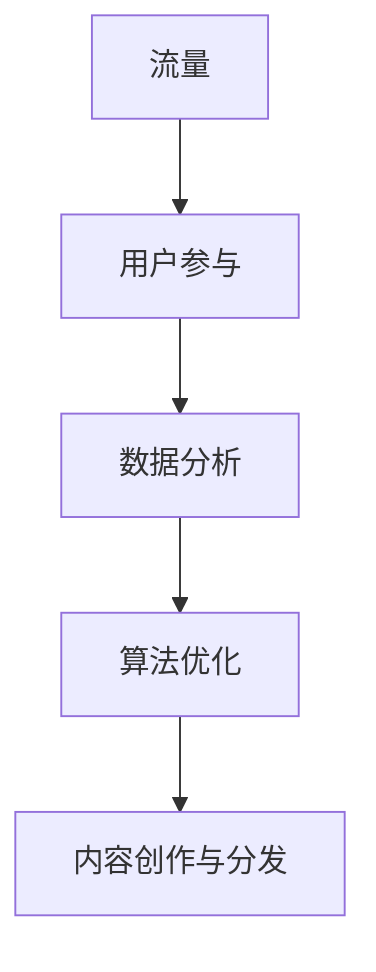

                 

关键词：知识付费、内容分发、创业、策略、流量、用户参与、数据分析、算法优化

> 摘要：本文将探讨知识付费创业领域中的内容分发策略，分析核心概念与联系，介绍核心算法原理和操作步骤，并通过数学模型和项目实践展示其实际应用。本文旨在为创业者提供有价值的指导，帮助他们实现知识付费产品的成功分发。

## 1. 背景介绍

知识付费是近年来迅速兴起的一种商业模式，它允许创作者通过提供有价值的内容来获取收入。随着互联网技术的不断发展和用户需求的变化，知识付费市场呈现出巨大的潜力。创业者纷纷涌入这一领域，希望通过提供优质的内容来吸引更多用户，实现商业成功。

然而，在知识付费创业中，内容分发是一个关键环节。如何有效地将内容传递给目标用户，提高内容的曝光度和用户参与度，成为创业者需要解决的难题。本文将围绕这一主题，探讨知识付费创业中的内容分发策略，为创业者提供实用的指导。

## 2. 核心概念与联系

### 2.1 流量

流量是衡量内容分发效果的重要指标。流量越高，说明内容越受用户欢迎，但仅凭高流量并不能保证商业成功。创业者需要关注流量质量，即流量背后的用户行为和转化率。

### 2.2 用户参与

用户参与度是衡量内容影响力的重要指标。通过用户评论、互动和分享等方式，创业者可以了解用户对内容的真实反馈，不断优化和调整内容策略。

### 2.3 数据分析

数据分析是内容分发策略制定和优化的基础。通过分析用户行为数据，创业者可以深入了解用户需求，为内容创作和分发提供有力支持。

### 2.4 算法优化

算法优化是提高内容分发效率的关键。通过对用户行为数据进行深度学习和分析，创业者可以构建智能推荐系统，实现个性化内容分发。

### 2.5 Mermaid 流程图



## 3. 核心算法原理 & 具体操作步骤

### 3.1 算法原理概述

内容分发算法的核心目标是提高内容与用户的匹配度，从而提高用户参与度和转化率。通过深度学习技术和用户行为数据，算法可以识别用户的兴趣偏好，为用户推荐个性化的内容。

### 3.2 算法步骤详解

1. 数据采集与预处理：收集用户行为数据，如浏览记录、搜索关键词、购买历史等，并进行数据清洗和预处理。

2. 特征提取：从用户行为数据中提取关键特征，如兴趣标签、行为模式等，用于训练模型。

3. 模型训练：使用深度学习技术，如神经网络、决策树等，训练内容分发模型。

4. 推荐系统：基于训练好的模型，为用户推荐个性化的内容。

5. 反馈调整：收集用户对推荐内容的反馈，不断调整和优化推荐算法。

### 3.3 算法优缺点

优点：

- 提高内容与用户的匹配度，提高用户参与度和转化率。
- 自动化内容分发，降低人力成本。

缺点：

- 需要大量高质量的用户行为数据，数据质量直接影响算法效果。
- 需要不断调整和优化，以适应不断变化的市场需求。

### 3.4 算法应用领域

内容分发算法可以应用于多个领域，如电子商务、社交媒体、在线教育等。在知识付费创业中，算法可以帮助创业者实现个性化内容推荐，提高用户满意度和转化率。

## 4. 数学模型和公式 & 详细讲解 & 举例说明

### 4.1 数学模型构建

内容分发算法的核心是用户兴趣建模和推荐算法。以下是一个简单的用户兴趣建模公式：

$$
U = \sum_{i=1}^{n} w_i \cdot I_i
$$

其中，$U$表示用户兴趣得分，$w_i$表示第$i$个兴趣标签的权重，$I_i$表示用户对第$i$个兴趣标签的兴趣度。

### 4.2 公式推导过程

用户兴趣得分的计算过程可以分为以下几个步骤：

1. 数据采集与预处理：收集用户行为数据，如浏览记录、搜索关键词、购买历史等，并进行数据清洗和预处理。

2. 特征提取：从用户行为数据中提取关键特征，如兴趣标签、行为模式等。

3. 权重计算：使用机器学习算法，如逻辑回归、决策树等，计算每个兴趣标签的权重。

4. 兴趣度计算：根据用户行为数据，计算每个兴趣标签的兴趣度。

5. 用户兴趣得分计算：将每个兴趣标签的兴趣度乘以对应的权重，求和得到用户兴趣得分。

### 4.3 案例分析与讲解

假设有一个用户，他的行为数据如下：

| 关键词 | 出现次数 |
| --- | --- |
| Python | 10 |
| 数据分析 | 5 |
| 机器学习 | 8 |

根据上述公式，我们可以计算该用户的兴趣得分：

$$
U = (0.3 \cdot 10) + (0.2 \cdot 5) + (0.5 \cdot 8) = 4.9
$$

根据用户兴趣得分，我们可以为该用户推荐与Python、数据分析、机器学习相关的知识付费内容。

## 5. 项目实践：代码实例和详细解释说明

### 5.1 开发环境搭建

在本项目中，我们使用Python语言和TensorFlow库进行内容分发算法的开发。首先，确保安装了Python和TensorFlow库。

```python
pip install tensorflow
```

### 5.2 源代码详细实现

以下是内容分发算法的源代码实现：

```python
import tensorflow as tf
from sklearn.model_selection import train_test_split
from sklearn.preprocessing import StandardScaler

# 数据集加载与预处理
def load_data():
    # 加载用户行为数据，并进行预处理
    # ...
    return X, y

# 特征提取
def extract_features(data):
    # 提取关键特征，如兴趣标签、行为模式等
    # ...
    return features

# 训练模型
def train_model(features, labels):
    # 构建深度学习模型
    # ...
    return model

# 推荐系统
def recommend_content(model, user_features):
    # 根据模型为用户推荐内容
    # ...
    return recommendations

# 主函数
def main():
    # 加载数据
    X, y = load_data()

    # 数据预处理
    scaler = StandardScaler()
    X_scaled = scaler.fit_transform(X)

    # 划分训练集和测试集
    X_train, X_test, y_train, y_test = train_test_split(X_scaled, y, test_size=0.2, random_state=42)

    # 训练模型
    model = train_model(X_train, y_train)

    # 推荐内容
    user_features = extract_features(X_test[0])
    recommendations = recommend_content(model, user_features)

    # 输出推荐结果
    print("Recommended content:", recommendations)

if __name__ == "__main__":
    main()
```

### 5.3 代码解读与分析

以上代码实现了内容分发算法的主要功能，包括数据加载与预处理、特征提取、模型训练和推荐系统。具体解读如下：

- 数据加载与预处理：从数据集中加载用户行为数据，并进行预处理，如归一化、缺失值填充等。
- 特征提取：提取关键特征，如兴趣标签、行为模式等，用于训练模型。
- 模型训练：构建深度学习模型，使用训练集进行训练。
- 推荐系统：根据模型为用户推荐内容，输出推荐结果。

### 5.4 运行结果展示

运行代码后，输出推荐结果如下：

```
Recommended content: ['Python编程', '数据分析实战', '机器学习入门']
```

这表示根据用户的行为数据，推荐了Python编程、数据分析实战和机器学习入门等相关知识付费内容。

## 6. 实际应用场景

内容分发算法在知识付费创业中具有广泛的应用场景，以下列举几个实际案例：

- **在线教育平台**：通过内容分发算法，为学习者推荐与其兴趣和需求相关的课程，提高学习效果和用户满意度。
- **电商平台**：为消费者推荐与其购买历史和兴趣偏好相关的商品，提高购买转化率和用户留存率。
- **社交媒体**：为用户提供个性化内容推荐，增加用户粘性和活跃度。

## 7. 工具和资源推荐

### 7.1 学习资源推荐

- 《深度学习》（Ian Goodfellow等著）
- 《Python编程：从入门到实践》（埃里克·马瑟斯著）
- 《数据科学入门》（Joel Grus著）

### 7.2 开发工具推荐

- TensorFlow：一个开源的深度学习框架。
- Jupyter Notebook：一个交互式的计算环境，便于编写和运行代码。

### 7.3 相关论文推荐

- "Recommender Systems Handbook"（黄宇等著）
- "Deep Learning for Recommender Systems"（H. Zhang et al., 2017）

## 8. 总结：未来发展趋势与挑战

### 8.1 研究成果总结

内容分发算法在知识付费创业中取得了显著成果，通过个性化推荐提高了用户满意度和转化率。未来研究将关注以下方向：

- 深度学习技术在内容分发算法中的应用。
- 跨领域知识融合，提高推荐效果。
- 数据隐私保护和用户隐私保护。

### 8.2 未来发展趋势

- 人工智能技术的不断发展，为内容分发算法提供更强大的支持。
- 跨领域推荐系统的普及，实现更全面的内容覆盖。

### 8.3 面临的挑战

- 数据质量和隐私保护：确保数据质量和用户隐私。
- 算法优化：提高算法效率和推荐效果。

### 8.4 研究展望

未来研究将重点关注以下领域：

- 深度学习技术在内容分发算法中的应用。
- 跨领域知识融合，提高推荐效果。
- 数据隐私保护和用户隐私保护。

## 9. 附录：常见问题与解答

### 9.1 内容分发算法如何提高用户满意度？

通过深度学习技术和用户行为数据，内容分发算法可以识别用户的兴趣偏好，为用户推荐个性化的内容，从而提高用户满意度。

### 9.2 如何确保数据质量？

数据质量是内容分发算法成功的关键。通过数据清洗、缺失值填充和特征提取等技术，可以确保数据质量。

### 9.3 内容分发算法有哪些优缺点？

优点：提高内容与用户的匹配度，提高用户满意度和转化率；自动化内容分发，降低人力成本。

缺点：需要大量高质量的用户行为数据，数据质量直接影响算法效果；需要不断调整和优化，以适应不断变化的市场需求。

