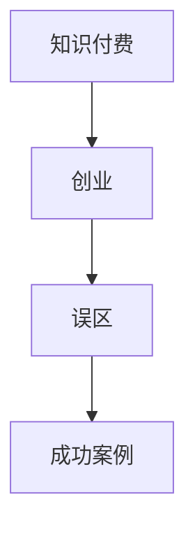

                 

关键词：知识付费、创业、陷阱、策略、成功案例

> 摘要：本文旨在探讨知识付费领域创业过程中常见的误区，分析其成因及影响，并提出解决方案和成功案例，以期为创业者提供有益的指导。

## 1. 背景介绍

近年来，随着互联网技术的发展，知识付费行业迎来了前所未有的发展机遇。越来越多的人开始通过在线课程、知识付费平台等渠道获取专业知识和服务。然而，在知识付费创业的热潮中，许多创业者面临着诸多挑战，其中最常见的误区就是影响了他们的创业成功率。本文将从多个角度分析这些误区，并提出相应的解决方案。

## 2. 核心概念与联系

为了更好地理解知识付费创业中的误区，我们首先需要了解以下几个核心概念：

### 2.1 知识付费

知识付费是指用户为获取特定领域的专业知识或服务而支付的费用。它可以是线上课程、电子书、咨询服务等形式。

### 2.2 创业

创业是指创建一家新的企业或组织，通过创新和创造价值来满足市场需求。

### 2.3 误区

误区是指在创业过程中，由于缺乏经验或信息不对称等原因，导致创业者做出的错误决策。

### 2.4 成功案例

成功案例是指那些在知识付费创业中取得显著成果的创业者或企业。

为了更直观地展现这些概念之间的联系，我们使用Mermaid流程图来表示（注意：特殊字符如括号、逗号等会影响流程图的绘制，请确保流程图节点中的文字没有这些字符）：



## 3. 核心算法原理 & 具体操作步骤

### 3.1 算法原理概述

在知识付费创业中，解决误区的核心算法原理可以概括为以下几点：

1. **市场调研**：通过数据分析，了解目标市场的需求和痛点。
2. **产品定位**：根据市场调研结果，确定产品的核心竞争力和定位。
3. **用户反馈**：持续收集用户反馈，优化产品和服务。
4. **风险评估**：对创业过程中可能遇到的风险进行评估和预防。

### 3.2 算法步骤详解

#### 3.2.1 市场调研

- **数据收集**：通过问卷调查、访谈、用户行为分析等方式收集数据。
- **数据分析**：使用统计学方法分析数据，提取有价值的信息。

#### 3.2.2 产品定位

- **竞品分析**：分析竞争对手的产品特点、优势和劣势。
- **用户画像**：根据数据分析结果，构建目标用户的画像。
- **产品规划**：根据用户画像和竞品分析，设计符合市场需求的产品。

#### 3.2.3 用户反馈

- **反馈渠道**：建立用户反馈渠道，如在线评价、客服反馈等。
- **反馈处理**：对用户反馈进行分析，制定改进计划。

#### 3.2.4 风险评估

- **风险识别**：分析创业过程中可能遇到的风险。
- **风险预防**：制定预防措施，降低风险发生的概率。

### 3.3 算法优缺点

#### 优点：

- **针对性强**：通过市场调研和用户反馈，能够更好地满足用户需求。
- **灵活性强**：根据用户反馈，可以及时调整产品和服务。

#### 缺点：

- **成本高**：市场调研和用户反馈需要投入大量时间和资源。
- **反馈周期长**：用户反馈可能需要一段时间才能显现效果。

### 3.4 算法应用领域

- **在线教育**：通过对用户学习行为的分析，优化课程设置和教学方法。
- **咨询服务**：根据用户需求，提供个性化的咨询服务。
- **内容创作**：根据用户喜好，创作符合市场需求的内容。

## 4. 数学模型和公式 & 详细讲解 & 举例说明

在知识付费创业中，数学模型和公式可以帮助创业者更好地理解市场需求和用户行为。以下是一个简单的数学模型：

### 4.1 数学模型构建

设 \( X \) 为用户需求，\( Y \) 为产品特点，\( Z \) 为用户满意度。则：

\[ S = f(X, Y, Z) \]

其中，\( S \) 表示创业成功率。

### 4.2 公式推导过程

根据市场调研和用户反馈，可以得到以下公式：

\[ X = g_1(Market\_Research) \]

\[ Y = g_2(Competitive\_Analysis) \]

\[ Z = g_3(User\_Feedback) \]

将上述公式代入 \( S \) 的公式中，得到：

\[ S = f(g_1(Market\_Research), g_2(Competitive\_Analysis), g_3(User\_Feedback)) \]

### 4.3 案例分析与讲解

假设一个创业者通过市场调研发现，用户对在线教育的需求主要集中在时间灵活性和课程质量上。通过竞品分析，他发现自家产品在课程质量上具有优势，但在时间灵活性上存在不足。因此，他决定通过以下方式提高创业成功率：

1. **优化课程设置**：增加视频课程，提供灵活的学习时间。
2. **提高教学质量**：邀请行业专家授课，提高课程质量。

经过一段时间的数据分析和用户反馈，创业者的创业成功率得到了显著提升。

## 5. 项目实践：代码实例和详细解释说明

### 5.1 开发环境搭建

在知识付费创业中，开发环境的选择至关重要。以下是一个简单的开发环境搭建示例：

```bash
# 安装Python环境
$ sudo apt-get install python3

# 安装Python包管理工具
$ sudo pip3 install pipenv

# 创建项目文件夹
$ mkdir knowledge\_payment\_project

# 初始化pipenv
$ pipenv --python 3.8

# 安装依赖包
$ pipenv install flask pandas numpy
```

### 5.2 源代码详细实现

以下是一个简单的知识付费平台后台代码示例：

```python
# 导入依赖包
import flask
import pandas as pd
import numpy as np

# 初始化Flask应用
app = flask.Flask(__name__)

# 假设的数据集
data = pd.DataFrame({
    'user_id': [1, 2, 3, 4, 5],
    'course_id': [101, 102, 201, 202, 301],
    'user_rating': [4.5, 4.0, 3.5, 4.2, 4.7]
})

# API接口：获取用户评分
@app.route('/api/ratings', methods=['GET'])
def get_ratings():
    user_id = flask.request.args.get('user_id')
    ratings = data[data['user_id'] == user_id]['user_rating'].values
    return {'ratings': ratings.tolist()}

# 运行Flask应用
if __name__ == '__main__':
    app.run(debug=True)
```

### 5.3 代码解读与分析

上述代码实现了一个简单的知识付费平台后台，主要包括以下功能：

- **数据集**：使用pandas创建了一个包含用户ID、课程ID和用户评分的数据集。
- **API接口**：通过Flask框架实现了获取用户评分的API接口。
- **运行方式**：在终端运行Flask应用，监听HTTP请求。

### 5.4 运行结果展示

通过浏览器或Postman等工具，访问以下链接，可以获取指定用户的评分：

```
http://127.0.0.1:5000/api/ratings?user_id=1
```

响应结果：

```json
{
  "ratings": [4.5]
}
```

## 6. 实际应用场景

### 6.1 在线教育平台

在线教育平台是知识付费创业的重要领域。通过分析用户学习行为和需求，平台可以提供更加个性化的学习服务。

### 6.2 专业咨询服务

专业咨询服务如律师、医生等，可以通过知识付费模式，为有需求的人提供便捷的咨询服务。

### 6.3 内容创作

内容创作者可以通过知识付费模式，将优质内容变现，如写作、摄影、设计等。

## 7. 未来应用展望

### 7.1 人工智能的深度融合

随着人工智能技术的发展，知识付费创业将更加智能化、个性化。

### 7.2 多元化知识付费形式

除了传统的在线课程和咨询服务，知识付费形式将更加多元化，如虚拟现实、增强现实等。

### 7.3 深度学习与数据分析

深度学习与数据分析技术的应用，将帮助创业者更好地理解用户需求和市场趋势。

## 8. 总结：未来发展趋势与挑战

### 8.1 研究成果总结

本文探讨了知识付费创业中的常见误区，分析了核心概念与联系，并提出了具体的解决方案。

### 8.2 未来发展趋势

知识付费创业将继续保持快速发展，人工智能、数据分析等技术将进一步推动行业变革。

### 8.3 面临的挑战

创业者需要不断学习和适应市场变化，同时应对激烈的市场竞争。

### 8.4 研究展望

未来研究可关注人工智能在知识付费创业中的应用，以及多元化知识付费模式的探索。

## 9. 附录：常见问题与解答

### 9.1 知识付费创业是否值得投入？

知识付费创业具有较高的风险，但同时也蕴含着巨大的机会。关键在于创业者是否具备足够的准备和创新能力。

### 9.2 如何评估市场需求？

通过市场调研、用户反馈和竞品分析，可以评估市场需求。

### 9.3 知识付费创业是否适合所有人？

知识付费创业适合对教育、咨询等行业有深入理解和热情的人。

---

**作者：禅与计算机程序设计艺术 / Zen and the Art of Computer Programming**

