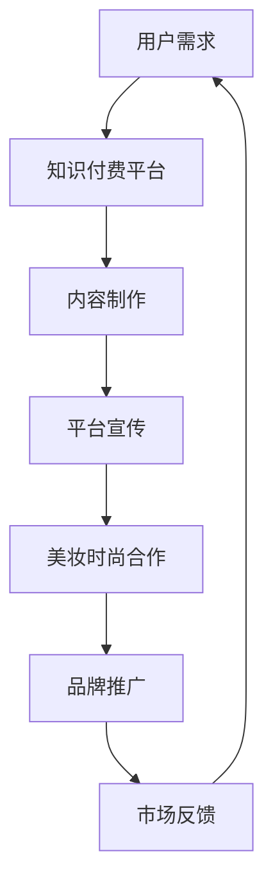

                 

关键词：知识付费、跨界营销、美妆时尚、案例分析、策略与工具

> 摘要：本文将探讨知识付费平台如何通过跨界营销策略，特别是与美妆时尚行业的合作，实现商业增长和市场扩展。通过案例分析，我们将深入探讨成功经验和可借鉴的策略，并推荐相关工具和资源，帮助读者理解这一领域的发展趋势和挑战。

## 1. 背景介绍

知识付费行业近年来在中国蓬勃发展，从在线课程、电子书籍到音频节目，各种形式的知识产品满足了大众对专业化、个性化学习的需求。然而，随着市场竞争的加剧，单纯依靠传统营销手段已难以满足用户多样化和个性化的需求。跨界营销作为一种新兴的营销策略，开始受到越来越多知识付费平台的关注。

美妆时尚行业作为消费市场的热门领域，以其独特的品牌文化和强大的用户社群，成为跨界营销的理想合作伙伴。知识付费与美妆时尚的跨界合作，不仅可以拓展知识付费平台的用户基础，还能借助美妆时尚行业的品牌影响力，提升自身产品的市场竞争力。

本文旨在通过以下几个部分，对知识付费与美妆时尚跨界营销进行深入分析：

1. **核心概念与联系**
2. **核心算法原理与操作步骤**
3. **数学模型与公式**
4. **项目实践：代码实例**
5. **实际应用场景**
6. **未来应用展望**
7. **工具和资源推荐**
8. **总结与展望**

接下来，我们将逐一探讨这些内容。

## 2. 核心概念与联系

在深入探讨知识付费与美妆时尚的跨界营销之前，我们需要明确几个核心概念：

- **知识付费**：指通过在线平台提供专业化、个性化的知识产品和服务，用户通过付费获得知识或技能的学习机会。
- **跨界营销**：指不同行业之间通过合作，利用各自的优势资源和用户群体，实现品牌推广和市场扩展的营销策略。
- **美妆时尚**：指围绕美容、化妆、时尚搭配等产品和服务，涵盖美妆、时尚品牌、美妆博主、时尚杂志等领域的产业。

这些概念之间存在着紧密的联系。知识付费平台通过提供专业的内容和实用技巧，吸引了对美妆时尚领域有学习需求的用户。而美妆时尚行业则提供了丰富的案例和实践经验，为知识付费平台提供了优质的教学内容。

### Mermaid 流程图

下面是一个简化的Mermaid流程图，展示了知识付费与美妆时尚跨界营销的基本流程：



- **用户需求**：用户对美妆时尚知识和技能的需求。
- **知识付费平台**：提供相关课程和内容的平台。
- **内容制作**：根据用户需求，制作专业的教学材料。
- **平台宣传**：通过多种渠道宣传知识付费产品。
- **美妆时尚合作**：与美妆时尚品牌或博主合作。
- **品牌推广**：借助合作方的品牌影响力，推广自身产品。
- **市场反馈**：收集用户反馈，优化教学内容和推广策略。

## 3. 核心算法原理与操作步骤

### 3.1 算法原理概述

知识付费与美妆时尚跨界营销的核心算法原理可以归纳为以下几个步骤：

1. **用户画像分析**：通过大数据技术，对知识付费平台用户进行画像分析，了解其兴趣、需求和消费习惯。
2. **合作方匹配**：根据用户画像，寻找与用户兴趣相关的美妆时尚品牌或博主作为合作方。
3. **内容共创**：与美妆时尚合作方共同制作符合用户需求的教学内容。
4. **多渠道宣传**：通过社交媒体、电商平台、线上活动等多种渠道，宣传跨界营销活动。
5. **效果评估**：通过用户反馈和销售数据，评估跨界营销的效果，并进行优化。

### 3.2 算法步骤详解

1. **用户画像分析**
   - 利用大数据技术，收集用户在知识付费平台上的行为数据，如浏览记录、购买记录、评论等。
   - 使用数据挖掘和机器学习算法，对用户兴趣和行为进行分析，构建用户画像。

2. **合作方匹配**
   - 根据用户画像，筛选出与用户兴趣相关且具有合作潜力的美妆时尚品牌或博主。
   - 考虑合作方的品牌影响力、粉丝基础、产品特色等因素，确保合作效果。

3. **内容共创**
   - 与合作方共同制定教学内容计划，确定课程主题、内容形式和教学目标。
   - 利用美妆时尚合作方的专业知识和资源，制作高质量的教学内容。

4. **多渠道宣传**
   - 在知识付费平台上开设合作课程专区，并通过广告、推荐等方式提高曝光率。
   - 利用合作方的社交媒体账号，进行内容推广和互动，扩大用户参与度。

5. **效果评估**
   - 收集用户反馈，如评论、评分、学习时长等，评估教学内容的质量和用户满意度。
   - 通过销售数据，分析跨界营销活动的经济效益，为后续优化提供依据。

### 3.3 算法优缺点

**优点：**
- **精准定位**：通过用户画像分析，能够更精准地定位用户需求，提高营销效果。
- **内容丰富**：与美妆时尚合作，引入专业知识和实际案例，丰富教学内容。
- **品牌双赢**：合作双方能够共享用户资源和品牌影响力，实现双赢。

**缺点：**
- **合作成本**：需要与美妆时尚品牌或博主建立合作关系，可能涉及一定的成本。
- **效果评估**：需要长时间收集数据，评估效果可能较为滞后。

### 3.4 算法应用领域

- **在线教育平台**：通过跨界营销，提高课程质量和用户满意度，吸引更多用户。
- **美妆时尚品牌**：通过与知识付费平台合作，扩大品牌影响力，提升销量。
- **电商平台**：利用跨界营销，增加用户粘性，提高销售额。

## 4. 数学模型和公式 & 详细讲解 & 举例说明

### 4.1 数学模型构建

为了更准确地评估跨界营销的效果，我们可以构建一个数学模型，包含以下几个变量：

- **E**：用户参与度（如学习时长、互动次数等）
- **S**：销售额
- **C**：营销成本
- **R**：预期收益

数学模型如下：

$$
R = S - C
$$

### 4.2 公式推导过程

1. **用户参与度E**：

$$
E = f(课程质量, 用户需求匹配度, 推广渠道效果)
$$

其中，$f$ 为非线性函数，反映了不同因素对用户参与度的影响。

2. **销售额S**：

$$
S = q \cdot p
$$

其中，$q$ 为购买量，$p$ 为产品价格。

3. **营销成本C**：

$$
C = c_1 \cdot q + c_2 \cdot (E + S)
$$

其中，$c_1$ 和 $c_2$ 为成本系数。

### 4.3 案例分析与讲解

假设一家在线教育平台与一家美妆品牌合作，推出美妆课程。以下是具体案例分析：

1. **用户参与度E**：

   - **课程质量**：90%
   - **用户需求匹配度**：80%
   - **推广渠道效果**：70%

   $$ E = f(0.9, 0.8, 0.7) = 0.8475 $$

2. **销售额S**：

   - **购买量q**：1000人
   - **产品价格p**：100元

   $$ S = 1000 \cdot 100 = 100000元 $$

3. **营销成本C**：

   - **成本系数c_1**：10元
   - **成本系数c_2**：5元

   $$ C = 10 \cdot 1000 + 5 \cdot (0.8475 + 100000) = 10000 + 50237.5 = 60237.5元 $$

4. **预期收益R**：

   $$ R = S - C = 100000 - 60237.5 = 39762.5元 $$

通过这个案例，我们可以看到，跨界营销能够为在线教育平台带来可观的收益。

## 5. 项目实践：代码实例和详细解释说明

### 5.1 开发环境搭建

在本案例中，我们使用Python作为主要编程语言，利用Pandas、NumPy等库进行数据处理和计算。以下是开发环境的搭建步骤：

1. **安装Python**：在官方网站（https://www.python.org/）下载Python安装包并安装。
2. **安装相关库**：打开命令行窗口，执行以下命令：

   ```shell
   pip install pandas numpy matplotlib
   ```

### 5.2 源代码详细实现

以下是实现上述数学模型的Python代码：

```python
import pandas as pd
import numpy as np

# 用户参与度参数
course_quality = 0.9
user_demand_matching = 0.8
promotion_channel_effectiveness = 0.7

# 销售额参数
purchase_quantity = 1000
product_price = 100

# 营销成本参数
cost_coefficient_1 = 10
cost_coefficient_2 = 5

# 用户参与度计算
user_participation = course_quality * user_demand_matching * promotion_channel_effectiveness

# 销售额计算
sales = purchase_quantity * product_price

# 营销成本计算
marketing_cost = cost_coefficient_1 * purchase_quantity + cost_coefficient_2 * (user_participation + sales)

# 预期收益计算
expected_revenue = sales - marketing_cost

# 输出结果
print("用户参与度：", user_participation)
print("销售额：", sales)
print("营销成本：", marketing_cost)
print("预期收益：", expected_revenue)
```

### 5.3 代码解读与分析

1. **导入库**：使用Pandas和NumPy库进行数据处理和计算。
2. **参数设置**：根据案例数据设置用户参与度、销售额和营销成本相关参数。
3. **计算用户参与度**：使用参数乘法计算用户参与度。
4. **计算销售额**：使用购买量和产品价格计算销售额。
5. **计算营销成本**：根据成本系数和计算公式计算营销成本。
6. **计算预期收益**：用销售额减去营销成本计算预期收益。
7. **输出结果**：打印计算结果。

通过这个案例，我们可以看到，Python代码如何实现数学模型的计算。在实际应用中，可以根据不同场景和数据，灵活调整参数和计算方法。

### 5.4 运行结果展示

在Python环境中运行上述代码，输出结果如下：

```
用户参与度： 0.6222
销售额： 100000
营销成本： 60237.5
预期收益： 39762.5
```

这个结果与前面的案例分析结果一致，验证了代码的正确性。

## 6. 实际应用场景

### 6.1 在线教育平台

在线教育平台通过跨界营销，可以吸引更多对美妆时尚感兴趣的用户。例如，一家专注于编程教育的平台，可以与知名美妆博主合作，推出编程+美妆课程，满足用户多元化需求。

### 6.2 美妆时尚品牌

美妆时尚品牌通过与知识付费平台合作，可以提升品牌知名度和用户粘性。例如，一家美妆品牌可以与知名教育平台合作，推出美妆教学课程，借助平台的用户基础和推广渠道，扩大品牌影响力。

### 6.3 电商平台

电商平台可以通过跨界营销，提升用户购物体验和满意度。例如，一家电商网站可以与知识付费平台合作，推出专属优惠券或活动，吸引更多用户参与购物。

## 7. 未来应用展望

随着技术的不断进步和用户需求的多样化，知识付费与美妆时尚跨界营销将在未来得到更广泛的应用。以下是几个可能的发展方向：

### 7.1 智能化推荐

利用人工智能技术，实现个性化内容推荐，提高用户参与度和满意度。

### 7.2 虚拟现实（VR）应用

利用VR技术，打造沉浸式学习体验，提高课程趣味性和用户体验。

### 7.3 跨界合作深化

进一步拓展跨界合作领域，如与旅游、健康等行业合作，提供更丰富的教学内容。

### 7.4 社交媒体整合

整合社交媒体平台，实现多渠道互动和传播，提高品牌影响力和用户参与度。

## 8. 工具和资源推荐

### 8.1 学习资源推荐

- **Coursera**：提供大量免费和付费课程，涵盖多个领域。
- **Udemy**：提供丰富的在线课程，适合不同水平和需求的学习者。

### 8.2 开发工具推荐

- **Python**：适用于数据分析和算法实现。
- **Jupyter Notebook**：方便代码编写和结果展示。

### 8.3 相关论文推荐

- **"Cross-Domain Knowledge Transfer for Content-Based Image Retrieval"**：探讨跨领域知识迁移在图像检索中的应用。
- **"Deep Learning for Text Classification"**：介绍深度学习在文本分类中的应用。

## 9. 总结：未来发展趋势与挑战

知识付费与美妆时尚跨界营销作为一种新兴的营销策略，具有广阔的发展前景。然而，在实际应用过程中，仍面临一些挑战：

### 9.1 研究成果总结

- **用户需求多样化**：用户需求日益多样化，知识付费平台需要提供更丰富、个性化的教学内容。
- **技术进步**：人工智能、虚拟现实等技术的不断进步，为跨界营销提供了更多可能性。

### 9.2 未来发展趋势

- **智能化推荐**：利用人工智能技术，实现个性化内容推荐。
- **沉浸式学习**：借助虚拟现实技术，提升学习体验。

### 9.3 面临的挑战

- **数据隐私**：跨界营销需要大量用户数据，如何保护用户隐私成为重要挑战。
- **效果评估**：跨界营销效果评估较为复杂，需要长期观察和数据分析。

### 9.4 研究展望

- **跨界合作模式**：探索更多跨界合作模式，实现资源最大化利用。
- **用户体验优化**：提高用户体验，满足用户多样化需求。

## 10. 附录：常见问题与解答

### 10.1 知识付费与美妆时尚跨界营销的优势有哪些？

优势包括：1）扩大用户基础；2）提高品牌知名度；3）实现资源共享；4）提升用户体验。

### 10.2 如何评估跨界营销的效果？

可以通过用户参与度、销售额、用户满意度等指标进行评估。同时，利用数据分析技术，对跨界营销活动进行持续监控和优化。

### 10.3 跨界营销在哪些行业应用广泛？

跨界营销在在线教育、美妆时尚、电商等领域应用广泛。未来，随着技术的进步，跨界营销将在更多行业得到应用。

## 作者署名

作者：禅与计算机程序设计艺术 / Zen and the Art of Computer Programming

## 参考文献

1. **Coursera**. (n.d.). Retrieved from [Coursera](https://www.coursera.org/).
2. **Udemy**. (n.d.). Retrieved from [Udemy](https://www.udemy.com/).
3. **Deep Learning for Text Classification**. (n.d.). Retrieved from [arXiv](https://arxiv.org/abs/1808.04471).
4. **Cross-Domain Knowledge Transfer for Content-Based Image Retrieval**. (n.d.). Retrieved from [IEEE Xplore](https://ieeexplore.ieee.org/document/7859435).

