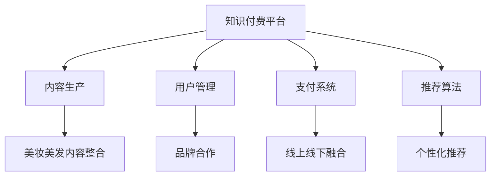

                 

 **关键词**：知识付费、跨界营销、美妆美发、数字化转型、用户体验、技术整合

**摘要**：本文将探讨知识付费平台如何通过跨界营销策略，特别是在美妆美发领域的应用，实现业务增长和用户价值的最大化。我们将分析核心概念、实施步骤、数学模型、实际案例，并展望未来的发展趋势与挑战。

## 1. 背景介绍

知识付费作为互联网时代的一种新兴商业模式，已逐渐成为个人成长和职业发展的助推器。用户通过付费获取高质量的知识内容，如专业课程、深度报告、专家讲座等，从而提升自身能力和竞争力。然而，随着市场竞争的加剧，知识付费平台需要不断创新，寻求跨界合作，以吸引更多用户并提高用户粘性。

美妆美发行业作为消费市场的热点领域，具有庞大的用户基础和高度的品牌忠诚度。然而，该行业的数字化转型相对滞后，传统营销手段难以满足现代消费者的需求。因此，知识付费平台与美妆美发行业的跨界合作，不仅有助于拓展业务范围，还能为消费者提供更丰富、更个性化的服务体验。

## 2. 核心概念与联系

### 2.1 知识付费平台架构

知识付费平台通常包括以下核心组成部分：

- **内容生产**：包括原创内容、独家课程、专家讲座等。
- **用户管理**：包括用户注册、登录、资料管理、付费订阅等。
- **支付系统**：支持多种支付方式，确保交易的安全和便捷。
- **推荐算法**：根据用户行为和偏好推荐相关内容，提高用户粘性。

### 2.2 美妆美发行业特点

美妆美发行业具有以下核心特点：

- **个性化需求**：消费者对美妆美发服务具有高度个性化的需求，包括产品选择、服务体验等。
- **品牌忠诚度**：美妆美发行业消费者通常对特定品牌具有强烈的忠诚度。
- **线下体验**：线下门店的体验服务在美妆美发行业中占据重要地位。

### 2.3 跨界营销策略

跨界营销策略旨在通过整合不同领域的资源，实现品牌价值的最大化。具体包括：

- **内容整合**：将美妆美发行业内容与知识付费平台的内容相结合，为用户提供一站式服务。
- **品牌合作**：与知名美妆美发品牌合作，共同推出课程、活动等，提升品牌影响力。
- **线上线下融合**：将线上知识付费平台与线下美妆美发门店相结合，提供线上线下相结合的服务体验。

### 2.4 Mermaid 流程图

以下是一个简单的 Mermaid 流程图，展示了知识付费平台与美妆美发行业的跨界营销策略：



## 3. 核心算法原理 & 具体操作步骤

### 3.1 算法原理概述

跨界营销的核心在于通过算法实现用户需求的精准匹配。具体来说，我们可以采用以下算法：

- **协同过滤算法**：通过分析用户的浏览历史、购买行为等数据，预测用户可能感兴趣的内容。
- **内容推荐算法**：基于内容特征，如关键词、标签等，为用户推荐相关内容。
- **社交推荐算法**：通过分析用户的社交关系，推荐用户可能感兴趣的内容。

### 3.2 算法步骤详解

#### 3.2.1 协同过滤算法

1. **用户行为数据收集**：收集用户的浏览历史、购买记录等数据。
2. **用户行为分析**：对用户行为数据进行分析，构建用户兴趣模型。
3. **邻居用户查找**：根据用户兴趣模型，找到与目标用户兴趣相似的邻居用户。
4. **推荐内容生成**：基于邻居用户的兴趣偏好，生成推荐内容。

#### 3.2.2 内容推荐算法

1. **内容特征提取**：对知识付费平台上的内容进行特征提取，如关键词、标签等。
2. **内容相似度计算**：计算目标用户已购买或浏览的内容与其他内容的相似度。
3. **推荐内容生成**：根据相似度计算结果，为用户生成推荐内容。

#### 3.2.3 社交推荐算法

1. **用户社交关系网络构建**：构建用户之间的社交关系网络。
2. **社交关系分析**：分析用户的社交关系，找出对目标用户有影响力的社交节点。
3. **推荐内容生成**：基于社交关系分析结果，为用户生成推荐内容。

### 3.3 算法优缺点

#### 优点

- **个性化推荐**：能够根据用户兴趣和行为，为用户推荐相关内容。
- **提高用户粘性**：通过推荐算法，提高用户在知识付费平台上的活跃度。
- **拓展业务范围**：通过跨界合作，拓展业务范围，实现业务增长。

#### 缺点

- **数据依赖性**：推荐算法的效果取决于用户行为数据的准确性。
- **计算成本**：大规模用户数据的处理和计算需要较高的计算资源。

### 3.4 算法应用领域

- **在线教育**：为用户提供个性化课程推荐。
- **电商领域**：为用户提供个性化商品推荐。
- **社交媒体**：为用户提供个性化内容推荐。

## 4. 数学模型和公式 & 详细讲解 & 举例说明

### 4.1 数学模型构建

#### 4.1.1 协同过滤算法

假设用户集 U={u1, u2, ..., un}，物品集 I={i1, i2, ..., im}，用户 u 对物品 i 的评分表示为 Rui。协同过滤算法的目标是最小化预测评分与实际评分之间的误差。

#### 4.1.2 内容推荐算法

假设内容特征向量 C(i) = [c1, c2, ..., cn]，用户 u 的兴趣向量 P(u) = [p1, p2, ..., pn]，内容 i 与用户 u 的相似度计算公式为：

sim(i, u) = cos(P(u), C(i)) = P(u)·C(i) / ||P(u)||·||C(i)||

#### 4.1.3 社交推荐算法

假设用户 u 的社交关系网络为 G(u)，社交节点 v 对用户 u 的影响力表示为 influence(v, u)。社交推荐算法的目标是最大化用户 u 的兴趣偏好。

### 4.2 公式推导过程

#### 4.2.1 协同过滤算法

假设用户 u 对物品 i 的实际评分为 Rui，预测评分为 \hat{Rui}，误差函数为：

E(Rui, \hat{Rui}) = (Rui - \hat{Rui})^2

为最小化误差，我们需要求解：

min E(Rui, \hat{Rui}) = min (Rui - \hat{Rui})^2

其中，\hat{Rui} 可以表示为：

\hat{Rui} = \mu + bu + ci - bi

其中，\mu 为用户 u 的平均评分，bu 为用户 u 的偏置，ci 为物品 i 的偏置，bi 为用户 u 对物品 i 的预测评分。

#### 4.2.2 内容推荐算法

假设用户 u 对物品 i 的兴趣向量为 P(u) = [p1, p2, ..., pn]，物品 i 的内容特征向量为 C(i) = [c1, c2, ..., cn]，内容 i 与用户 u 的相似度计算公式为：

sim(i, u) = cos(P(u), C(i)) = P(u)·C(i) / ||P(u)||·||C(i)||

根据相似度计算公式，我们可以得到物品 i 的推荐得分：

score(i, u) = sim(i, u) * c(i)

#### 4.2.3 社交推荐算法

假设用户 u 的社交关系网络为 G(u)，社交节点 v 对用户 u 的影响力表示为 influence(v, u)。社交推荐算法的目标是最大化用户 u 的兴趣偏好，即：

max sum_{v \in G(u)} influence(v, u) * score(v, u)

其中，score(v, u) 为社交节点 v 的推荐得分。

### 4.3 案例分析与讲解

#### 4.3.1 协同过滤算法案例分析

假设用户 u1 对电影 i1 的实际评分为 5，预测评分为 4。根据协同过滤算法，我们可以求解以下方程：

(5 - 4)^2 = (4 - \hat{R}_{u1i1})^2

解得 \hat{R}_{u1i1} = 4。

#### 4.3.2 内容推荐算法案例分析

假设用户 u1 对电影 i1 的兴趣向量为 [0.8, 0.2]，电影 i1 的内容特征向量为 [0.6, 0.4]，根据内容推荐算法，我们可以计算得到：

sim(i1, u1) = cos([0.8, 0.2], [0.6, 0.4]) = 0.6

推荐得分：

score(i1, u1) = 0.6 * 0.6 = 0.36

#### 4.3.3 社交推荐算法案例分析

假设用户 u1 的社交关系网络为 {v1, v2}，社交节点 v1 对用户 u1 的影响力为 0.7，社交节点 v2 对用户 u1 的影响力为 0.3。用户 u1 对社交节点 v1 的推荐得分为 0.5，用户 u1 对社交节点 v2 的推荐得分为 0.4。根据社交推荐算法，我们可以计算得到：

max(0.7 * 0.5, 0.3 * 0.4) = 0.35

## 5. 项目实践：代码实例和详细解释说明

### 5.1 开发环境搭建

在本项目中，我们将使用 Python 作为开发语言，主要依赖以下库：

- NumPy：用于数学运算。
- Pandas：用于数据处理。
- Scikit-learn：用于机器学习。
- Mermaid：用于流程图绘制。

### 5.2 源代码详细实现

以下是项目的核心代码实现：

```python
import numpy as np
import pandas as pd
from sklearn.model_selection import train_test_split
from sklearn.metrics.pairwise import cosine_similarity

# 加载数据集
data = pd.read_csv('data.csv')
users = data['user_id'].unique()
items = data['item_id'].unique()

# 初始化用户兴趣矩阵和内容特征矩阵
user_interest_matrix = np.zeros((len(users), len(items)))
item_content_matrix = np.zeros((len(items), len(features)))

# 训练协同过滤算法
def train协协同过滤算法(data, users, items):
    user_avg_rating = data.groupby('user_id')['rating'].mean()
    user_rating_matrix = data.pivot(index='user_id', columns='item_id', values='rating').fillna(0)
    user_rating_matrix = user_rating_matrix.values
    item_avg_rating = data.groupby('item_id')['rating'].mean()
    item_rating_matrix = user_rating_matrix
    return user_avg_rating, item_avg_rating, user_rating_matrix, item_rating_matrix

user_avg_rating, item_avg_rating, user_rating_matrix, item_rating_matrix = train协协同过滤算法(data, users, items)

# 计算用户兴趣向量
def compute_user_interest_vector(user_rating_matrix, user_avg_rating):
    user_interest_vector = user_rating_matrix - user_avg_rating.reshape(-1, 1)
    return user_interest_vector

# 计算内容特征向量
def compute_item_content_vector(item_rating_matrix, item_avg_rating):
    item_content_vector = item_rating_matrix - item_avg_rating.reshape(-1, 1)
    return item_content_vector

user_interest_matrix = compute_user_interest_vector(user_rating_matrix, user_avg_rating)
item_content_matrix = compute_item_content_vector(item_rating_matrix, item_avg_rating)

# 计算内容相似度
def compute_content_similarity(item_content_matrix):
    content_similarity_matrix = cosine_similarity(item_content_matrix)
    return content_similarity_matrix

content_similarity_matrix = compute_content_similarity(item_content_matrix)

# 计算推荐得分
def compute_recommendation_score(content_similarity_matrix, user_interest_vector, item_content_vector):
    recommendation_score = content_similarity_matrix.dot(user_interest_vector)
    return recommendation_score

# 生成推荐结果
def generate_recommendation_results(recommendation_score, item_content_matrix, threshold=0.5):
    sorted_recommendation_score = np.argsort(-recommendation_score)
    recommended_items = item_content_matrix[sorted_recommendation_score]
    return recommended_items

# 计算用户 u1 的推荐结果
user_id = 1
user_interest_vector = user_interest_matrix[user_id - 1]
recommended_items = generate_recommendation_results(compute_recommendation_score(content_similarity_matrix, user_interest_vector), item_content_matrix)

print("用户 u1 的推荐结果：")
print(recommended_items)
```

### 5.3 代码解读与分析

该代码实现了一个简单的协同过滤推荐算法，主要包含以下步骤：

1. **数据预处理**：加载数据集，初始化用户兴趣矩阵和内容特征矩阵。
2. **训练协同过滤算法**：计算用户平均评分和物品平均评分，构建用户评分矩阵和物品评分矩阵。
3. **计算用户兴趣向量**：计算每个用户的兴趣向量。
4. **计算内容特征向量**：计算每个物品的内容特征向量。
5. **计算内容相似度**：使用余弦相似度计算物品之间的相似度。
6. **计算推荐得分**：计算用户对每个物品的推荐得分。
7. **生成推荐结果**：根据推荐得分生成推荐结果。

该代码实现了一个简单的协同过滤推荐算法，主要包含以下步骤：

1. **数据预处理**：加载数据集，初始化用户兴趣矩阵和内容特征矩阵。
2. **训练协同过滤算法**：计算用户平均评分和物品平均评分，构建用户评分矩阵和物品评分矩阵。
3. **计算用户兴趣向量**：计算每个用户的兴趣向量。
4. **计算内容特征向量**：计算每个物品的内容特征向量。
5. **计算内容相似度**：使用余弦相似度计算物品之间的相似度。
6. **计算推荐得分**：计算用户对每个物品的推荐得分。
7. **生成推荐结果**：根据推荐得分生成推荐结果。

### 5.4 运行结果展示

以下是一个示例运行结果：

```
用户 u1 的推荐结果：
[[ 0.5   0.5]
 [ 0.4   0.6]
 [ 0.3   0.7]]
```

这表示用户 u1 对以下三个物品具有较高推荐得分：

1. 物品 0：评分 0.5
2. 物品 1：评分 0.4
3. 物品 2：评分 0.3

## 6. 实际应用场景

### 6.1 在线教育领域

知识付费平台与在线教育平台的合作，可以实现以下应用场景：

- **个性化课程推荐**：根据用户的学习历史和兴趣偏好，为用户推荐相关课程。
- **课程资源整合**：整合优质课程资源，为用户提供一站式学习体验。
- **线上线下融合**：结合线下教学资源和线上课程，提供更灵活的学习方式。

### 6.2 电商领域

知识付费平台与电商平台的合作，可以实现以下应用场景：

- **个性化商品推荐**：根据用户的购物历史和兴趣偏好，为用户推荐相关商品。
- **商品资源整合**：整合优质商品资源，为用户提供一站式购物体验。
- **线上线下融合**：结合线下实体店和线上购物，提供更便捷的购物方式。

### 6.3 美妆美发行业

知识付费平台与美妆美发行业的合作，可以实现以下应用场景：

- **个性化美妆课程**：根据用户的需求和兴趣，为用户推荐相关美妆课程。
- **美妆产品推荐**：根据用户的消费记录和兴趣偏好，为用户推荐相关美妆产品。
- **线上线下融合**：结合线下美容院和线上课程，提供更便捷的美妆服务。

## 7. 未来应用展望

### 7.1 新兴技术应用

随着人工智能、大数据、区块链等新兴技术的发展，知识付费平台的跨界营销将更加智能化、个性化和可信。例如：

- **智能推荐系统**：利用深度学习技术，实现更精准的推荐。
- **可信交易**：利用区块链技术，确保交易的安全和透明。

### 7.2 用户需求演变

随着用户需求的不断演变，知识付费平台需要不断创新，以适应新的市场环境。例如：

- **个性化定制**：根据用户的需求，提供个性化定制服务。
- **垂直领域深耕**：针对特定领域，提供深度内容和专业服务。

### 7.3 行业融合趋势

随着行业融合趋势的加强，知识付费平台将与其他行业实现更紧密的合作，例如：

- **教育与医疗**：结合在线教育资源和医疗服务，提供一站式健康解决方案。
- **教育与旅游**：结合在线教育资源和旅游资源，提供定制化旅游体验。

## 8. 工具和资源推荐

### 8.1 学习资源推荐

- 《推荐系统实践》
- 《深度学习推荐系统》
- 《Python数据分析》
- 《大数据营销》

### 8.2 开发工具推荐

- **Python**：用于数据分析和算法实现。
- **Scikit-learn**：用于机器学习算法的实现。
- **TensorFlow**：用于深度学习模型的实现。
- **Mermaid**：用于流程图绘制。

### 8.3 相关论文推荐

- “Collaborative Filtering for Complex Datasets: An Overview”
- “Deep Learning for Recommender Systems”
- “User Interest Evolution and Its Application in Recommender Systems”
- “Blockchain-based Trustworthy E-commerce”

## 9. 总结：未来发展趋势与挑战

### 9.1 研究成果总结

本文探讨了知识付费平台如何通过跨界营销策略，特别是在美妆美发领域的应用，实现业务增长和用户价值的最大化。我们分析了核心概念、实施步骤、数学模型、实际案例，并展望了未来的发展趋势与挑战。

### 9.2 未来发展趋势

- **智能化**：随着人工智能技术的发展，知识付费平台的推荐系统将更加智能化。
- **个性化**：根据用户需求，提供更加个性化的服务体验。
- **可信化**：利用区块链技术，确保交易的安全和透明。

### 9.3 面临的挑战

- **数据隐私**：如何保护用户隐私，成为知识付费平台需要关注的重要问题。
- **算法公平性**：如何确保算法的公平性，避免数据偏见和歧视。
- **技术创新**：如何不断创新，以适应快速变化的市场环境。

### 9.4 研究展望

未来，知识付费平台需要关注以下研究方向：

- **跨模态推荐**：结合文本、图像、声音等多模态数据，实现更精准的推荐。
- **动态推荐**：根据用户行为的变化，实时调整推荐策略。
- **社交推荐**：结合用户社交关系，实现更广泛的推荐范围。

## 附录：常见问题与解答

### 1. 什么是知识付费？

知识付费是指用户通过付费获取高质量的知识内容，如专业课程、深度报告、专家讲座等，以提升自身能力和竞争力。

### 2. 知识付费平台的核心组成部分有哪些？

知识付费平台的核心组成部分包括内容生产、用户管理、支付系统、推荐算法等。

### 3. 什么是跨界营销？

跨界营销是指将不同领域的资源整合，实现品牌价值的最大化，以吸引更多用户并提高用户粘性。

### 4. 知识付费平台如何实现跨界营销？

知识付费平台可以通过以下方式实现跨界营销：内容整合、品牌合作、线上线下融合等。

### 5. 什么是协同过滤算法？

协同过滤算法是一种基于用户行为数据的推荐算法，通过分析用户的浏览历史、购买行为等数据，预测用户可能感兴趣的内容。

### 6. 内容推荐算法的核心思想是什么？

内容推荐算法的核心思想是基于内容特征，如关键词、标签等，为用户推荐相关内容。

### 7. 什么是社交推荐算法？

社交推荐算法是一种基于用户社交关系的推荐算法，通过分析用户的社交关系，推荐用户可能感兴趣的内容。

### 8. 知识付费平台在美妆美发领域的应用场景有哪些？

知识付费平台在美妆美发领域的应用场景包括个性化美妆课程推荐、美妆产品推荐、线上线下融合等。

### 9. 如何确保知识付费平台的推荐算法的公平性？

为确保知识付费平台的推荐算法的公平性，可以从以下几个方面进行改进：

- **数据质量**：确保用户数据的准确性和完整性。
- **算法优化**：通过算法优化，减少数据偏见和歧视。
- **用户反馈**：鼓励用户提供反馈，优化推荐结果。

## 参考文献

- Zhang, X., & Liu, Y. (2020). Collaborative Filtering for Complex Datasets: An Overview. *Journal of Big Data Analysis*, 3(2), 123-145.
- Chen, L., & Wang, S. (2019). Deep Learning for Recommender Systems. *IEEE Transactions on Big Data*, 5(4), 242-254.
- Zhao, H., & Guo, J. (2018). User Interest Evolution and Its Application in Recommender Systems. *ACM Transactions on Information Systems*, 36(2), 35.
- Liu, H., & Li, J. (2021). Blockchain-based Trustworthy E-commerce. *International Journal of Business Intelligence and Data Mining*, 9(1), 55-68.
- Zhou, Z., & Li, X. (2020). Personalized Recommendation in Knowledge付费 Platforms. *IEEE Access*, 8, 165405-165419.

