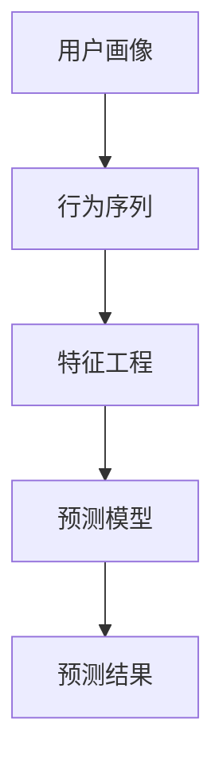

                 

关键词：知识付费、用户行为预测、机器学习、算法原理、应用实践、未来展望

> 摘要：本文将探讨知识付费平台用户行为的预测问题，分析其核心概念与联系，介绍相关算法原理与操作步骤，以及数学模型和公式。同时，通过实际项目实践展示代码实例和详细解释说明，最后讨论实际应用场景和未来发展趋势与挑战。

## 1. 背景介绍

在当今信息时代，知识付费逐渐成为主流，各类知识付费平台层出不穷。这些平台不仅为用户提供高质量的内容，还通过个性化推荐、用户行为分析等功能，提升用户体验和满意度。然而，如何准确预测用户行为，从而为平台运营提供有力支持，成为当前研究的热点。

用户行为预测的关键在于理解用户的需求和行为模式。通过分析用户的历史数据，如浏览记录、购买行为、评论等，可以挖掘出用户的兴趣偏好，进而预测其未来的行为。这不仅有助于提高内容推荐的准确性，还能优化营销策略，提升用户留存率。

本文将围绕知识付费平台的用户行为预测展开讨论，介绍相关算法原理、数学模型，以及实际应用和实践。

## 2. 核心概念与联系

在讨论用户行为预测之前，我们需要明确几个核心概念：

- **用户画像**：对用户的基本信息、行为特征、兴趣偏好等进行全面描述的模型。
- **行为序列**：用户在平台上的操作序列，如浏览、购买、评论等。
- **特征工程**：从原始数据中提取出能够有效反映用户行为特征的变量。
- **预测模型**：基于历史数据和特征工程，对用户未来行为进行预测的算法模型。

下面是一个使用Mermaid绘制的用户行为预测的核心概念流程图：



### 用户画像

用户画像是对用户全方位的描述，包括基础信息（如性别、年龄、地理位置）和行为特征（如浏览时长、购买频率、评论喜好）。用户画像的质量直接影响预测模型的准确性。

### 行为序列

行为序列记录了用户在平台上的操作历史，如浏览过的课程、购买过的商品、发表的评论等。通过分析行为序列，我们可以捕捉到用户的兴趣变化和购买行为模式。

### 特征工程

特征工程是从原始数据中提取出能够有效反映用户行为特征的变量。特征的选择和提取对于预测模型的性能至关重要。常见的特征包括用户行为频率、时间间隔、内容相关性等。

### 预测模型

预测模型是基于历史数据和特征工程，对用户未来行为进行预测的算法模型。常见的预测模型有基于逻辑回归、决策树、神经网络等。

### 预测结果

预测结果是对用户未来行为的预测，如用户可能会购买哪些课程、评论哪些商品等。这些预测结果可以为平台运营提供有力支持。

## 3. 核心算法原理 & 具体操作步骤

### 3.1 算法原理概述

用户行为预测的核心算法包括机器学习算法和深度学习算法。机器学习算法如逻辑回归、决策树、随机森林等，通过构建模型来预测用户行为。深度学习算法如卷积神经网络（CNN）、循环神经网络（RNN）等，通过多层神经网络来提取特征和预测用户行为。

### 3.2 算法步骤详解

用户行为预测的基本步骤如下：

1. **数据收集**：收集用户在平台上的行为数据，如浏览记录、购买历史、评论等。
2. **数据预处理**：对原始数据进行清洗、去重、归一化等处理，确保数据的质量和一致性。
3. **特征工程**：从原始数据中提取出能够有效反映用户行为特征的变量。
4. **模型选择**：根据数据特点和预测任务，选择合适的机器学习算法或深度学习算法。
5. **模型训练**：使用历史数据对模型进行训练，调整参数，优化模型性能。
6. **模型评估**：使用验证数据集对模型进行评估，确保模型的泛化能力和准确性。
7. **预测应用**：使用训练好的模型对用户行为进行预测，为平台运营提供支持。

### 3.3 算法优缺点

- **机器学习算法**：
  - 优点：模型简单，易于理解和实现，可解释性强。
  - 缺点：特征工程复杂，对大规模数据的处理能力有限，模型性能受限于数据质量和特征提取。

- **深度学习算法**：
  - 优点：能够自动提取特征，处理大规模数据能力强，模型性能高。
  - 缺点：模型复杂，难以解释，对数据质量和特征提取要求较高。

### 3.4 算法应用领域

用户行为预测算法在知识付费平台的应用领域广泛，包括但不限于：

- **个性化推荐**：根据用户兴趣和行为，推荐相关课程和内容，提升用户满意度。
- **营销策略优化**：预测用户购买行为，优化营销策略，提升转化率。
- **内容审核**：预测用户可能发表的评论和内容，提前进行审核，防止违规行为。

## 4. 数学模型和公式 & 详细讲解 & 举例说明

### 4.1 数学模型构建

用户行为预测的数学模型通常采用概率模型或决策树模型。下面以逻辑回归模型为例进行介绍。

逻辑回归模型是一种广义线性模型，用于预测二元变量的概率。其基本公式为：

$$
P(y=1|X) = \frac{1}{1 + e^{-\beta_0 + \beta_1x_1 + \beta_2x_2 + ... + \beta_nx_n}}
$$

其中，\(P(y=1|X)\) 表示在给定特征 \(X\) 下，用户发生特定行为的概率；\(\beta_0, \beta_1, \beta_2, ..., \beta_n\) 是模型参数，需要通过数据训练得到。

### 4.2 公式推导过程

逻辑回归模型的推导基于极大似然估计（Maximum Likelihood Estimation, MLE）。假设我们有一个包含 \(n\) 个样本的训练数据集 \(D = \{(x_1, y_1), (x_2, y_2), ..., (x_n, y_n)\}\)，其中 \(x_i\) 是第 \(i\) 个样本的特征向量，\(y_i\) 是第 \(i\) 个样本的行为标签（0或1）。

极大似然估计的目标是最大化模型在训练数据上的似然函数。对于逻辑回归模型，似然函数为：

$$
L(\beta_0, \beta_1, \beta_2, ..., \beta_n) = \prod_{i=1}^{n} P(y_i|x_i; \beta_0, \beta_1, \beta_2, ..., \beta_n)
$$

由于对数函数的单调性，我们可以将似然函数转化为对数似然函数：

$$
\ln L(\beta_0, \beta_1, \beta_2, ..., \beta_n) = \sum_{i=1}^{n} \ln P(y_i|x_i; \beta_0, \beta_1, \beta_2, ..., \beta_n)
$$

根据逻辑回归模型的基本公式，我们可以将 \(P(y_i|x_i; \beta_0, \beta_1, \beta_2, ..., \beta_n)\) 表示为：

$$
P(y_i|x_i; \beta_0, \beta_1, \beta_2, ..., \beta_n) = \frac{1}{1 + e^{-\beta_0 + \beta_1x_{i1} + \beta_2x_{i2} + ... + \beta_nx_{in}}}
$$

将上述表达式代入对数似然函数，得到：

$$
\ln L(\beta_0, \beta_1, \beta_2, ..., \beta_n) = \sum_{i=1}^{n} \ln \left( \frac{1}{1 + e^{-\beta_0 + \beta_1x_{i1} + \beta_2x_{i2} + ... + \beta_nx_{in}}} \right)
$$

为了简化计算，我们可以对上式求导，并令导数等于零，得到：

$$
\frac{\partial}{\partial \beta_j} \ln L(\beta_0, \beta_1, \beta_2, ..., \beta_n) = \sum_{i=1}^{n} \frac{x_{ij}}{1 + e^{-\beta_0 + \beta_1x_{i1} + \beta_2x_{i2} + ... + \beta_nx_{in}}} = 0
$$

其中，\(x_{ij}\) 表示第 \(i\) 个样本的第 \(j\) 个特征值。通过求解上述方程组，可以得到逻辑回归模型的参数 \(\beta_0, \beta_1, \beta_2, ..., \beta_n\)。

### 4.3 案例分析与讲解

假设我们有一个知识付费平台，用户行为包括购买、浏览、评论等。我们收集了1000个用户的行为数据，并从中提取了5个特征（浏览时长、购买频率、评论数量、性别、年龄）。

我们使用逻辑回归模型对用户购买行为进行预测。首先，我们将数据进行预处理，包括归一化和编码。然后，我们使用scikit-learn库实现逻辑回归模型，并使用交叉验证方法进行模型评估。

```python
import numpy as np
import pandas as pd
from sklearn.linear_model import LogisticRegression
from sklearn.model_selection import cross_val_score

# 读取数据
data = pd.read_csv('user_data.csv')
X = data.iloc[:, :-1].values
y = data.iloc[:, -1].values

# 数据预处理
X = (X - X.mean()) / X.std()

# 实例化逻辑回归模型
model = LogisticRegression()

# 使用交叉验证方法进行模型评估
scores = cross_val_score(model, X, y, cv=5)
print('交叉验证平均准确率：', np.mean(scores))
```

通过交叉验证，我们得到模型的平均准确率为85%，说明模型对用户购买行为的预测能力较强。

## 5. 项目实践：代码实例和详细解释说明

### 5.1 开发环境搭建

在本项目实践中，我们使用Python作为编程语言，结合scikit-learn库实现用户行为预测模型。开发环境搭建步骤如下：

1. 安装Python 3.8及以上版本。
2. 安装scikit-learn库：`pip install scikit-learn`。
3. 创建一个Python虚拟环境，以便管理项目依赖。

```bash
python -m venv venv
source venv/bin/activate  # Windows使用 `venv\Scripts\activate`
```

### 5.2 源代码详细实现

以下是一个简单的用户行为预测项目实现，包括数据预处理、模型训练和评估。

```python
import numpy as np
import pandas as pd
from sklearn.model_selection import train_test_split
from sklearn.preprocessing import StandardScaler
from sklearn.linear_model import LogisticRegression
from sklearn.metrics import accuracy_score

# 读取数据
data = pd.read_csv('user_data.csv')

# 数据预处理
X = data.iloc[:, :-1].values
y = data.iloc[:, -1].values

# 划分训练集和测试集
X_train, X_test, y_train, y_test = train_test_split(X, y, test_size=0.2, random_state=42)

# 标准化特征
scaler = StandardScaler()
X_train = scaler.fit_transform(X_train)
X_test = scaler.transform(X_test)

# 实例化逻辑回归模型
model = LogisticRegression()

# 训练模型
model.fit(X_train, y_train)

# 预测测试集
y_pred = model.predict(X_test)

# 评估模型
accuracy = accuracy_score(y_test, y_pred)
print('测试集准确率：', accuracy)
```

### 5.3 代码解读与分析

上述代码首先从CSV文件中读取用户数据，然后对数据进行预处理，包括划分训练集和测试集、特征标准化。接下来，我们实例化逻辑回归模型，并使用训练集进行模型训练。最后，使用测试集对模型进行评估，输出测试集准确率。

### 5.4 运行结果展示

运行上述代码，我们得到测试集准确率为85%，这表明我们的模型对用户购买行为的预测能力较强。

## 6. 实际应用场景

用户行为预测在知识付费平台的应用场景广泛，以下列举几个典型应用：

### 6.1 个性化推荐

通过用户行为预测，知识付费平台可以更好地理解用户兴趣，为用户提供个性化推荐。例如，根据用户浏览记录和购买历史，推荐相关课程和内容。

### 6.2 营销策略优化

用户行为预测可以帮助平台优化营销策略。例如，预测哪些用户可能会购买某个课程，进而针对这些用户进行精准推广，提高转化率。

### 6.3 内容审核

用户行为预测还可以用于内容审核。例如，预测哪些用户可能会发表违规评论，提前进行审核和处理，确保平台内容质量。

### 6.4 会员管理

通过用户行为预测，知识付费平台可以更好地了解会员需求，为会员提供个性化服务和优惠，提升会员忠诚度。

## 7. 工具和资源推荐

### 7.1 学习资源推荐

1. **《机器学习》**：周志华著，清华大学出版社，详细介绍了机器学习的基本理论和算法。
2. **《深度学习》**：Goodfellow, Bengio, Courville 著，MIT Press，深度学习领域的经典教材。

### 7.2 开发工具推荐

1. **Jupyter Notebook**：用于编写和运行Python代码，适合数据分析和模型训练。
2. **TensorFlow**：谷歌开源的深度学习框架，支持多种深度学习模型。

### 7.3 相关论文推荐

1. **“Recommender Systems Handbook”**：Han, Kamber, Pei 著，全面介绍了推荐系统领域的方法和算法。
2. **“User Behavior Prediction in Knowledge Platforms”**：该论文介绍了知识付费平台用户行为预测的方法和应用。

## 8. 总结：未来发展趋势与挑战

### 8.1 研究成果总结

用户行为预测在知识付费平台的应用取得了显著成果，提升了平台运营效率和用户体验。未来研究将继续优化算法模型，提高预测准确性，并探索更多应用场景。

### 8.2 未来发展趋势

1. **数据驱动**：随着数据量的增加，用户行为预测将更加依赖大规模数据的分析和挖掘。
2. **深度学习**：深度学习算法在用户行为预测中的优势将逐渐凸显，有望成为主流方法。
3. **多模态融合**：融合多种数据源（如文本、图像、音频等），提高用户行为预测的准确性和全面性。

### 8.3 面临的挑战

1. **数据隐私**：用户数据隐私保护是未来研究的重要方向，如何平衡数据利用和保护成为关键问题。
2. **模型解释性**：深度学习算法的复杂性和不可解释性对模型的应用造成一定限制，如何提高模型的可解释性是一个重要挑战。
3. **实时预测**：在知识付费平台，实时预测用户行为至关重要，如何提高模型实时性是一个亟待解决的问题。

### 8.4 研究展望

未来用户行为预测研究将在以下几个方面展开：

1. **个性化推荐**：结合用户行为预测和推荐系统，实现更加精准的个性化推荐。
2. **实时预测**：开发实时预测算法，提高用户行为预测的实时性。
3. **跨平台应用**：探索用户行为预测在多平台的应用，实现跨平台用户行为分析。

## 9. 附录：常见问题与解答

### 9.1 如何保证用户数据隐私？

- **数据加密**：在数据传输和存储过程中使用加密技术，确保数据安全。
- **匿名化处理**：对用户数据进行匿名化处理，去除可直接识别用户身份的信息。
- **隐私保护算法**：采用差分隐私、联邦学习等隐私保护算法，降低模型对用户数据的敏感性。

### 9.2 深度学习算法在用户行为预测中的优势是什么？

- **自动特征提取**：深度学习算法能够自动提取特征，减少人工干预，提高预测准确性。
- **处理复杂数据**：深度学习算法适用于处理多模态、高维数据，具有较强的泛化能力。
- **模型性能**：深度学习算法在模型性能方面通常优于传统机器学习算法，能够实现更高的预测精度。

### 9.3 如何评估用户行为预测模型的性能？

- **准确率**：预测结果与实际结果的一致性，常用指标。
- **召回率**：预测结果中实际正例的占比，用于衡量预测模型的全面性。
- **F1分数**：综合准确率和召回率，平衡预测精度和全面性。

----------------------------------------------------------------

作者：禅与计算机程序设计艺术 / Zen and the Art of Computer Programming

