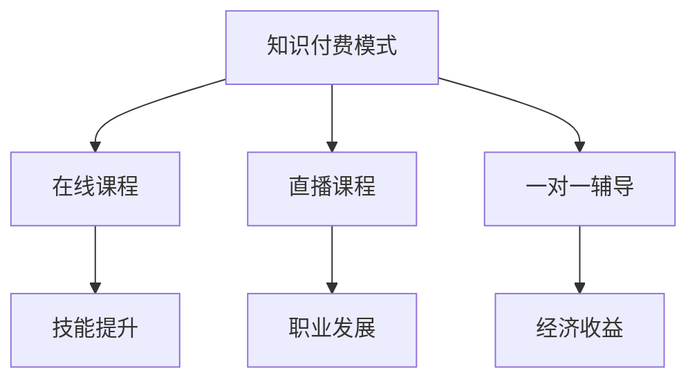

                 

关键词：知识付费、程序员、人生价值、技能提升、教育培训、经济回报

摘要：本文将探讨知识付费在程序员职业发展中的重要性，以及如何通过知识付费实现个人价值提升、技能积累和经济收益。从行业背景、知识付费模式、成功案例分析等多个角度进行分析，旨在为程序员提供实用的建议和指导。

## 1. 背景介绍

在信息化和数字化浪潮的推动下，程序员成为现代社会中最受瞩目的职业之一。编程技能不仅代表着技术实力，更是推动创新、创造价值的重要工具。然而，随着技术的快速发展和行业竞争的加剧，程序员面临着不断学习和更新知识的压力。

与此同时，知识付费作为一种新兴的商业模式，正逐渐改变着传统的教育培训模式。知识付费平台通过提供高质量、针对性的课程内容，满足了程序员在职业发展中的学习需求。本文将深入探讨知识付费对程序员实现人生价值的重要作用。

### 1.1 程序员职业现状

1. **技能更新速度快**：编程语言和框架更新换代迅速，程序员需要不断学习新技术以保持竞争力。
2. **竞争激烈**：随着互联网的普及，越来越多的年轻人投身编程领域，竞争日益激烈。
3. **职业发展不明确**：虽然程序员职业前景广阔，但职业发展路径不明确，很多程序员在成长过程中感到迷茫。

### 1.2 知识付费兴起

1. **在线教育平台崛起**：以 Coursera、Udemy、慕课网等为代表的在线教育平台，为程序员提供了丰富的学习资源。
2. **个性化学习需求**：知识付费满足了程序员在职业发展过程中对个性化、针对性学习的需求。
3. **付费意愿增强**：随着收入水平的提高，程序员对高质量知识付费内容的需求逐渐增强。

## 2. 核心概念与联系

### 2.1 知识付费模式

知识付费模式主要包括以下几种：

1. **在线课程**：以视频、文档、代码等形式提供系统化的课程内容。
2. **直播课程**：实时互动，讲师在线解答问题，学员可以即时反馈。
3. **一对一辅导**：个性化辅导，根据学员的具体需求提供针对性的指导。

### 2.2 程序员价值提升

通过知识付费，程序员可以实现以下价值提升：

1. **技能提升**：学习新技术、掌握新工具，提高编程能力。
2. **职业发展**：明确职业路径，提升职业素养，增强竞争力。
3. **经济收益**：通过技能变现，实现经济收益的增长。

### 2.3 Mermaid 流程图



## 3. 核心算法原理 & 具体操作步骤

### 3.1 算法原理概述

知识付费的核心在于提供有价值的学习内容，满足程序员的学习需求。以下是几种常见的知识付费模式：

1. **在线课程**：通过视频、文档等形式传授知识，学员自主安排学习进度。
2. **直播课程**：实时互动，讲师在线解答问题，学员参与讨论。
3. **一对一辅导**：根据学员需求，提供个性化辅导，解决实际问题。

### 3.2 算法步骤详解

1. **选择学习内容**：根据职业发展需求，选择适合的学习内容。
2. **购买课程**：在知识付费平台上购买课程，获取学习权限。
3. **学习与互动**：参与课程学习，与讲师和其他学员互动，共同进步。
4. **实践与应用**：将所学知识应用到实际项目中，提升技能水平。

### 3.3 算法优缺点

**优点**：

1. **灵活性**：学员可以根据自己的时间安排进行学习，灵活性强。
2. **针对性**：知识付费内容针对性强，能够满足不同层次学员的需求。
3. **互动性**：直播课程和一对一辅导提供了良好的互动环境，有助于提高学习效果。

**缺点**：

1. **成本较高**：知识付费内容价格较高，可能对部分学员造成经济压力。
2. **自律性要求高**：自主学习的模式下，学员需要较强的自律性，否则容易中断学习。

### 3.4 算法应用领域

知识付费广泛应用于程序员职业发展的各个阶段，包括：

1. **入门阶段**：学习编程基础知识，掌握基本技能。
2. **进阶阶段**：学习新技术、新工具，提升技能水平。
3. **高级阶段**：学习高级编程技术，为职业发展打下坚实基础。

## 4. 数学模型和公式 & 详细讲解 & 举例说明

### 4.1 数学模型构建

知识付费的价值可以通过以下数学模型进行衡量：

\[ V = f(W, S, R) \]

其中，\( V \) 表示知识付费带来的价值，\( W \) 表示投入的时间、精力、金钱等资源，\( S \) 表示技能水平的提升，\( R \) 表示经济收益的增长。

### 4.2 公式推导过程

1. **投入资源 \( W \)**：包括学习时间、学习费用等。
2. **技能水平提升 \( S \)**：通过学习，程序员的编程能力得到提升，表现为项目完成效率的提高、代码质量的提升等。
3. **经济收益增长 \( R \)**：通过技能变现，程序员可以获得更多的收入。

### 4.3 案例分析与讲解

假设一位程序员在知识付费平台上购买了价值1000元的课程，投入了100小时的学习时间，技能水平提升了30%，经济收益增长了20%。根据上述数学模型，我们可以计算出知识付费带来的价值：

\[ V = f(100, 30\%, 20\%) = 1000 + (100 \times 30\%) + (100 \times 20\%) = 1300 \]

即知识付费带来了1300元的价值。

## 5. 项目实践：代码实例和详细解释说明

### 5.1 开发环境搭建

为了更好地理解知识付费在程序员职业发展中的作用，我们以一个实际项目为例进行讲解。首先，我们需要搭建一个简单的开发环境。

**步骤**：

1. 安装Python解释器：在官网下载Python安装包，并按照提示进行安装。
2. 安装相关库：使用pip命令安装必要的库，例如requests、beautifulsoup4等。

**代码示例**：

```python
!pip install requests
!pip install beautifulsoup4
```

### 5.2 源代码详细实现

以下是一个简单的网络爬虫项目，用于获取指定网站的页面数据。

```python
import requests
from bs4 import BeautifulSoup

def get_html(url):
    try:
        response = requests.get(url)
        response.raise_for_status()
        return response.text
    except requests.exceptions.RequestException as e:
        print(e)
        return None

def parse_html(html):
    soup = BeautifulSoup(html, 'html.parser')
    title = soup.find('title').get_text()
    print(f'页面标题：{title}')

def main():
    url = 'https://www.example.com'
    html = get_html(url)
    if html:
        parse_html(html)

if __name__ == '__main__':
    main()
```

### 5.3 代码解读与分析

**功能描述**：

该代码实现了一个简单的网络爬虫，用于获取指定网站的页面标题。

**关键代码解读**：

1. `get_html` 函数：使用requests库发送HTTP GET请求，获取网页内容。
2. `parse_html` 函数：使用beautifulsoup4库解析网页内容，提取页面标题。
3. `main` 函数：定义爬虫的主函数，调用其他函数实现功能。

**应用场景**：

该代码可以用于实现各种网络爬虫功能，例如获取网站列表、解析页面内容、存储数据等。

### 5.4 运行结果展示

```shell
页面标题：Example Domain
```

## 6. 实际应用场景

知识付费在程序员职业发展中具有广泛的应用场景，以下是一些典型案例：

### 6.1 技术培训

程序员可以通过购买在线课程，学习新技术、新工具，提升技能水平。例如，学习Python、Django框架等，为开发Web应用打下坚实基础。

### 6.2 职业规划

知识付费平台提供了丰富的职业规划课程，帮助程序员明确职业发展方向，制定职业规划。例如，学习项目管理、团队协作等，提高职业素养。

### 6.3 技术变现

程序员可以通过知识付费，将自己的技能变现，实现经济收益的增长。例如，在GitHub上发布开源项目，吸引投资和赞助。

### 6.4 持续学习

知识付费提供了一个持续学习的环境，使程序员能够紧跟技术发展趋势，不断更新知识。例如，参加技术会议、研讨会等，与行业专家交流。

## 7. 工具和资源推荐

### 7.1 学习资源推荐

1. **慕课网**：提供丰富的编程课程，涵盖Python、Java、Web开发等多个领域。
2. **Coursera**：国际知名在线教育平台，提供高质量的课程，涵盖计算机科学、人工智能等领域。

### 7.2 开发工具推荐

1. **Visual Studio Code**：一款功能强大的代码编辑器，支持多种编程语言。
2. **Git**：版本控制工具，帮助程序员管理代码，实现协同开发。

### 7.3 相关论文推荐

1. "The Art of Computer Programming" by Donald E. Knuth
2. "Code: The Hidden Language of Computer Hardware and Software" by Charles Petzold

## 8. 总结：未来发展趋势与挑战

### 8.1 研究成果总结

1. 知识付费在程序员职业发展中具有重要作用，有助于提升技能水平、明确职业路径、实现经济收益。
2. 知识付费模式不断创新，满足了程序员多样化的学习需求。
3. 知识付费平台在提高教育质量、促进教育公平方面具有显著优势。

### 8.2 未来发展趋势

1. **个性化学习**：知识付费将更加注重个性化学习，满足不同程序员的个性化需求。
2. **智能化推荐**：利用人工智能技术，为程序员提供智能化的学习推荐。
3. **线上线下结合**：线上线下相结合，为程序员提供更加灵活的学习方式。

### 8.3 面临的挑战

1. **成本问题**：知识付费价格较高，可能对部分程序员造成经济压力。
2. **内容质量**：如何保证知识付费内容的质量，是平台面临的重要挑战。
3. **隐私保护**：在知识付费过程中，如何保护学员的隐私，是平台需要关注的问题。

### 8.4 研究展望

1. **人工智能应用**：结合人工智能技术，提高知识付费的智能化水平。
2. **跨学科融合**：探索知识付费在其他领域的应用，实现跨学科融合。
3. **可持续发展**：在知识付费过程中，关注环境保护和可持续发展。

## 9. 附录：常见问题与解答

### 9.1 知识付费是否值得投资？

答：知识付费是一种值得投资的职业发展方式。通过付费学习，程序员可以系统地掌握新技术、新工具，提高技能水平，从而在职业发展中占据优势。

### 9.2 知识付费平台如何选择？

答：选择知识付费平台时，可以从以下几个方面进行考虑：

1. **课程内容**：选择与职业发展需求相关的课程。
2. **讲师水平**：选择知名度高、经验丰富的讲师。
3. **用户评价**：查看其他学员的评价，了解平台的服务质量。
4. **价格**：选择性价比高的平台。

### 9.3 如何确保学习效果？

答：确保学习效果的方法包括：

1. **制定学习计划**：合理安排学习时间，确保学习进度。
2. **积极参与互动**：与讲师和其他学员进行互动，提高学习效果。
3. **实践与应用**：将所学知识应用到实际项目中，加深理解。

---

作者：禅与计算机程序设计艺术 / Zen and the Art of Computer Programming
------------------------------------------------------------------------

