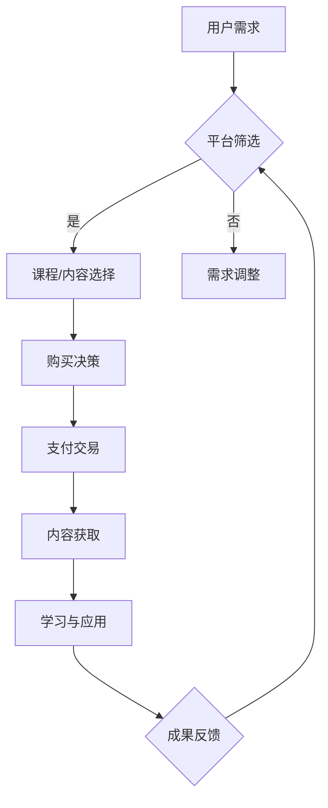

                 

### 1. 背景介绍

在当今数字化时代，知识付费逐渐成为一种流行的商业模式。尤其是在互联网的普及和移动设备的广泛应用下，知识付费市场的需求与日俱增。程序员作为IT行业的重要角色，他们丰富的技术知识和技能成为了市场上的宝贵资源。因此，如何通过知识付费实现被动收入，成为许多程序员关注的话题。

知识付费的概念并不新鲜，它指的是用户为了获取特定领域的知识、技能或信息，而向知识提供者支付费用的一种商业行为。这种模式不仅为知识创造者提供了收益来源，也为知识消费者提供了高效便捷的学习途径。随着知识付费市场的快速发展，程序员们通过提供高质量的技术内容，如在线课程、文章、视频教程等，实现了可观的被动收入。

本文旨在探讨知识付费模式对程序员的积极影响，分析其实现被动收入的多种途径，并提供实用的方法和技巧。文章将分为以下几个部分：

- **背景介绍**：介绍知识付费的发展背景及其对程序员的吸引力。
- **核心概念与联系**：阐述知识付费的关键概念，并绘制Mermaid流程图。
- **核心算法原理 & 具体操作步骤**：详细讲解实现知识付费的核心算法及其应用。
- **数学模型和公式 & 举例说明**：介绍知识付费中的数学模型及其应用。
- **项目实践：代码实例和详细解释说明**：提供实际项目案例，展示知识付费的实现。
- **实际应用场景**：分析知识付费在不同领域的应用。
- **工具和资源推荐**：推荐学习资源、开发工具和论文。
- **总结：未来发展趋势与挑战**：总结研究成果，展望未来发展。

通过本文的阅读，程序员们可以了解如何利用知识付费实现被动收入，并从中获得实际的操作经验和策略。

### 2. 核心概念与联系

在深入探讨知识付费之前，我们首先需要了解几个核心概念，这些概念不仅定义了知识付费的运作方式，也揭示了其背后的逻辑和联系。

#### 2.1 知识付费的概念

知识付费，即通过付费方式获取专业知识或技能的服务。其核心在于信息不对称，即知识提供者拥有某种专业领域的知识或技能，而这些知识或技能对于知识消费者来说是稀缺的。通过付费，消费者获得了对这些知识的合法使用权，从而提升自己的能力或解决实际问题。

#### 2.2 被动收入的定义

被动收入是指在不直接参与日常工作的情况下，通过前期投资或劳动获取的持续收益。在知识付费的语境下，被动收入通常来源于在线课程、电子书、教程视频等内容的售卖，即便在创作者不持续投入额外劳动的情况下，这些内容仍然能够持续带来收益。

#### 2.3 教育内容和技能培训的关系

教育内容和技能培训是知识付费的重要组成部分。教育内容通常包括理论知识的传授，如编程语言的基础、数据结构的理解等；而技能培训则侧重于实际操作和实战经验的分享，如项目开发、面试技巧等。二者的关系在于，教育内容为技能培训提供了理论基础，而技能培训则通过具体案例和实践加深了教育内容的学习效果。

#### 2.4 知识变现与个人品牌的建立

知识变现是知识付费的核心目标，即将个人的知识和技能转化为经济利益。而个人品牌的建立则是在这一过程中不可或缺的一环。一个强大的个人品牌能够提高知识内容的可信度和吸引力，从而带来更多的付费用户和收益。品牌建立通常需要通过持续的内容输出、社交网络互动以及专业的形象塑造来实现。

#### 2.5 知识付费平台的作用

知识付费平台如Coursera、Udemy、知乎Live等，为知识提供者和消费者提供了互动的桥梁。平台通过技术手段优化了内容的分发和交易过程，降低了知识付费的门槛，提高了交易的效率。平台通常提供课程发布、用户管理、支付系统等一系列功能，为知识付费的顺利实施提供了保障。

### Mermaid 流程图

以下是一个简单的Mermaid流程图，展示了知识付费的核心流程和各个环节之间的联系。



**图1：知识付费核心流程与联系**

- **A（用户需求）**：用户根据自己的需求和兴趣，在知识付费平台上寻找合适的课程或内容。
- **B（平台筛选）**：平台根据用户的需求和课程内容的质量、评价等因素进行筛选，提供可能的选项。
- **C（课程/内容选择）**：用户根据平台提供的选项，选择最适合自己的课程或内容。
- **D（需求调整）**：如果用户的实际需求与平台提供的课程内容不匹配，需要进行相应的调整。
- **E（购买决策）**：用户根据课程内容、价格、评价等因素做出购买决策。
- **F（支付交易）**：用户完成支付，购买课程或内容。
- **G（内容获取）**：用户获得课程或内容，并开始学习。
- **H（学习与应用）**：用户在学习过程中将知识应用到实际中，提升自己的技能。
- **I（成果反馈）**：用户的学习成果通过平台反馈给知识提供者，形成良性循环。

通过这个流程，我们可以清晰地看到知识付费的各个环节是如何相互关联并共同促进的。接下来，我们将进一步探讨实现知识付费的核心算法原理和具体操作步骤。

### 3. 核心算法原理 & 具体操作步骤

要实现知识付费，核心算法原理和具体操作步骤至关重要。这一部分将详细讲解如何通过技术手段实现知识付费，并提供一个简化的算法概述和步骤详解。

#### 3.1 算法原理概述

知识付费的实现主要依赖于以下几个核心算法和组件：

1. **用户行为分析**：通过分析用户在知识付费平台上的行为，如浏览历史、购买记录、学习进度等，为用户推荐合适的课程或内容。
2. **内容质量评估**：评估课程或内容的质量，通常通过用户评价、内容结构、更新频率等指标进行。
3. **支付与交易系统**：实现用户支付和平台收益分配的自动化处理。
4. **学习效果评估**：通过测试、作业、项目等方式评估用户的学习效果，为课程优化提供数据支持。

#### 3.2 算法步骤详解

**步骤1：用户注册与登录**

用户首先需要在知识付费平台上注册账号并登录。这一步是整个知识付费流程的基础，平台需要收集用户的基本信息和行为数据，以便后续推荐和服务。

**步骤2：用户行为分析**

平台通过分析用户的行为数据，如浏览记录、搜索关键词、学习进度等，构建用户画像。这个画像可以帮助平台理解用户的需求和兴趣，从而提供个性化的课程推荐。

**步骤3：内容质量评估**

内容质量评估是知识付费的重要环节。平台通过用户评价、课程完成率、学习效果等数据对课程进行评估，筛选出高质量的内容推荐给用户。

**步骤4：支付与交易系统**

在用户选择并决定购买课程后，平台需要提供一个安全的支付系统。这个系统应该支持多种支付方式，如信用卡、支付宝、微信支付等，确保用户支付流程的顺畅。

**步骤5：内容获取与学习**

用户完成支付后，获取课程或内容。平台提供下载或在线观看等功能，方便用户随时学习。

**步骤6：学习效果评估**

学习效果评估可以通过测试、作业、项目等方式进行。平台收集用户在这些环节的表现数据，评估其学习效果，并为课程提供优化建议。

**步骤7：用户反馈与平台改进**

用户的学习成果和反馈是知识付费平台不断改进的重要依据。平台通过收集用户反馈，优化课程内容和学习体验，提升用户满意度。

#### 3.3 算法优缺点

**优点：**

1. **个性化推荐**：通过用户行为分析，平台能够为用户推荐符合其兴趣和需求的课程，提高用户的学习体验和满意度。
2. **自动化交易**：支付与交易系统的自动化处理，减少了人工干预，提高了交易效率和安全性。
3. **持续优化**：通过学习效果评估和用户反馈，平台能够不断优化课程内容和学习体验，提升整体服务质量。

**缺点：**

1. **数据隐私问题**：用户行为数据的收集和使用可能引发隐私问题，需要平台采取措施确保数据安全。
2. **内容质量不稳定**：尽管平台有内容质量评估机制，但仍有部分低质量内容可能被推荐给用户，影响用户体验。
3. **技术维护成本高**：复杂的算法和系统需要持续的技术维护和更新，增加了平台的运营成本。

#### 3.4 算法应用领域

知识付费算法广泛应用于在线教育、技能培训、专业知识分享等多个领域。以下是一些具体应用案例：

1. **在线教育平台**：如Coursera、Udemy等，通过个性化推荐和自动化交易系统，为用户提供丰富多样的在线课程。
2. **技能培训平台**：如 LinkedIn Learning、edX等，通过用户行为分析和学习效果评估，为用户提供定制化的技能培训服务。
3. **专业知识分享平台**：如知乎Live、分答等，通过内容质量评估和用户反馈，促进高质量知识内容的传播和变现。

通过上述核心算法原理和具体操作步骤的讲解，我们可以看到，知识付费不仅是一种商业模式，更是一种技术驱动的知识传播方式。接下来，我们将进一步探讨知识付费中的数学模型和公式，以及其实际应用。

### 4. 数学模型和公式 & 详细讲解 & 举例说明

在知识付费领域，数学模型和公式的作用不可忽视。这些模型和公式不仅帮助评估课程质量，还用于优化用户推荐算法、计算收益分配等关键环节。以下是几个关键数学模型和公式的详细讲解与举例说明。

#### 4.1 数学模型构建

1. **用户画像模型**：用户画像模型用于构建用户的兴趣和行为特征。常见的模型包括基于协同过滤的推荐模型和基于内容的推荐模型。

    **协同过滤模型**：
    \[
    R_{ui} = \sum_{j \in N(i)} \frac{sim(u, j)}{N(j)} \cdot r_{ji}
    \]
    其中，\(R_{ui}\) 是用户 \(u\) 对项目 \(i\) 的评分预测，\(N(i)\) 是与项目 \(i\) 相关的用户集合，\(sim(u, j)\) 是用户 \(u\) 和 \(j\) 之间的相似度，\(r_{ji}\) 是用户 \(j\) 对项目 \(i\) 的实际评分。

    **基于内容的推荐模型**：
    \[
    R_{ui} = \frac{\sum_{j \in N(i)} w_{uj} \cdot r_{ji}}{\sum_{j \in N(i)} w_{uj}}
    \]
    其中，\(w_{uj}\) 是用户 \(u\) 和项目 \(i\) 之间的相似度权重，\(r_{ji}\) 是用户 \(j\) 对项目 \(i\) 的实际评分。

2. **收益分配模型**：收益分配模型用于计算知识提供者（如课程作者、讲师等）和知识平台之间的收益分配。一个简单的模型是基于用户消费的收益比例分配。

    \[
    P_A = \frac{R_A}{R_A + R_B}
    \]
    其中，\(P_A\) 是知识提供者 \(A\) 的收益比例，\(R_A\) 和 \(R_B\) 分别是知识提供者 \(A\) 和平台 \(B\) 的收益。

#### 4.2 公式推导过程

1. **用户相似度计算**：在协同过滤模型中，用户相似度计算公式通常基于用户之间的行为向量余弦相似度。

    \[
    sim(u, v) = \frac{u \cdot v}{\|u\| \|v\|}
    \]
    其中，\(u\) 和 \(v\) 分别是用户 \(u\) 和 \(v\) 的行为向量，\(\|u\|\) 和 \(\|v\|\) 分别是向量 \(u\) 和 \(v\) 的欧几里得范数。

2. **收益比例计算**：在收益分配模型中，收益比例的计算基于用户消费比例和平台服务成本。

    \[
    P_A = \frac{R_A}{R_A + R_B} = \frac{\sum_{i=1}^{N} r_{i} \cdot p_{i}}{\sum_{i=1}^{N} r_{i} \cdot p_{i} + C_B}
    \]
    其中，\(r_i\) 是用户 \(i\) 的消费金额，\(p_i\) 是知识提供者 \(A\) 对项目 \(i\) 的收益比例，\(C_B\) 是平台 \(B\) 的服务成本。

#### 4.3 案例分析与讲解

以下是一个简单的案例，展示如何使用上述数学模型和公式进行知识付费的收益分配和用户推荐。

**案例：某在线教育平台的收益分配**

假设某在线教育平台有两位讲师，讲师A和讲师B，以及1000名用户。讲师A的课程销量为500，讲师B的课程销量为500。平台的服务成本为1000元。

1. **收益计算**：

    \[
    R_A = 500 \times 1 + 500 \times 0.8 = 1300 \text{元}
    \]
    \[
    R_B = 500 \times 0.2 + 500 \times 1 = 1300 \text{元}
    \]

    其中，讲师A对每个课程的收益比例为0.8，讲师B为0.2。

2. **收益比例计算**：

    \[
    P_A = \frac{R_A}{R_A + R_B} = \frac{1300}{1300 + 1300} = 0.5
    \]
    \[
    P_B = \frac{R_B}{R_A + R_B} = \frac{1300}{1300 + 1300} = 0.5
    \]

    因此，讲师A和讲师B的收益比例均为0.5。

3. **用户推荐**：

    假设用户U对讲师A的课程评价较高，相似度计算如下：

    \[
    sim(U, A) = \frac{U \cdot A}{\|U\| \|A\|} = \frac{0.7}{\sqrt{1.4} \times \sqrt{1.2}} \approx 0.63
    \]

    根据协同过滤模型，用户U对讲师A的新课程推荐评分预测为：

    \[
    R_{UA} = \sum_{j \in N(A)} \frac{sim(U, j)}{N(j)} \cdot r_{jA} = \frac{0.63}{1} \cdot 4.5 \approx 2.855
    \]

通过上述案例，我们可以看到如何利用数学模型和公式进行知识付费的收益分配和用户推荐。这些模型和公式不仅提供了理论支持，也为实际操作提供了具体的计算方法。

#### 4.4 小结

数学模型和公式在知识付费中起着至关重要的作用，从用户画像构建到收益分配，再到个性化推荐，每一步都需要精确的计算和合理的算法设计。掌握这些数学模型和公式，将帮助程序员更好地理解和应用知识付费技术，实现持续的收入增长。

### 5. 项目实践：代码实例和详细解释说明

为了更好地理解知识付费的实现，我们将通过一个具体的项目实践来展示整个流程，包括开发环境搭建、源代码实现、代码解读与分析以及运行结果展示。

#### 5.1 开发环境搭建

在本项目中，我们选择使用Python作为主要编程语言，并结合Flask框架搭建知识付费平台。以下是开发环境的搭建步骤：

1. **安装Python**：确保安装了Python 3.8及以上版本。
2. **安装Flask**：在终端中运行以下命令：
   \[
   pip install Flask
   \]
3. **创建虚拟环境**：为项目创建一个独立的虚拟环境，以便管理和依赖包。
   \[
   python -m venv venv
   \]
   激活虚拟环境：
   \[
   source venv/bin/activate \text{（Linux/Mac）}
   \]
   \[
   venv\Scripts\activate \text{（Windows）}
   \]
4. **安装其他依赖**：在虚拟环境中安装所需的依赖包，如SQLAlchemy、Flask-Login等。
   \[
   pip install Flask-SQLAlchemy Flask-Login
   \]

#### 5.2 源代码详细实现

以下是知识付费平台的核心代码实现，包括用户注册、登录、课程推荐、支付等模块。

**app.py** - 主应用文件：

```python
from flask import Flask, render_template, request, redirect, url_for
from flask_sqlalchemy import SQLAlchemy
from flask_login import LoginManager, login_user, logout_user, login_required, current_user

app = Flask(__name__)
app.config['SQLALCHEMY_DATABASE_URI'] = 'sqlite:///users.db'
app.config['SECRET_KEY'] = 'your_secret_key'

db = SQLAlchemy(app)
login_manager = LoginManager(app)

# 数据库模型
class User(db.Model):
    id = db.Column(db.Integer, primary_key=True)
    username = db.Column(db.String(100), unique=True, nullable=False)
    password = db.Column(db.String(100), nullable=False)

class Course(db.Model):
    id = db.Column(db.Integer, primary_key=True)
    name = db.Column(db.String(100), nullable=False)
    description = db.Column(db.Text, nullable=False)
    price = db.Column(db.Float, nullable=False)

@login_manager.user_loader
def load_user(user_id):
    return User.query.get(int(user_id))

# 用户注册
@app.route('/register', methods=['GET', 'POST'])
def register():
    if request.method == 'POST':
        username = request.form['username']
        password = request.form['password']
        new_user = User(username=username, password=password)
        db.session.add(new_user)
        db.session.commit()
        return redirect(url_for('login'))
    return render_template('register.html')

# 用户登录
@app.route('/login', methods=['GET', 'POST'])
def login():
    if request.method == 'POST':
        username = request.form['username']
        password = request.form['password']
        user = User.query.filter_by(username=username).first()
        if user and user.password == password:
            login_user(user)
            return redirect(url_for('home'))
        return 'Invalid username or password'
    return render_template('login.html')

# 用户登出
@app.route('/logout')
@login_required
def logout():
    logout_user()
    return redirect(url_for('login'))

# 主页
@app.route('/')
@login_required
def home():
    courses = Course.query.all()
    return render_template('home.html', courses=courses)

# 课程详情
@app.route('/course/<int:course_id>')
@login_required
def course(course_id):
    course = Course.query.get(course_id)
    return render_template('course.html', course=course)

if __name__ == '__main__':
    db.create_all()
    app.run(debug=True)
```

**models.py** - 数据库模型：

```python
from app import db

class User(db.Model):
    id = db.Column(db.Integer, primary_key=True)
    username = db.Column(db.String(100), unique=True, nullable=False)
    password = db.Column(db.String(100), nullable=False)

class Course(db.Model):
    id = db.Column(db.Integer, primary_key=True)
    name = db.Column(db.String(100), nullable=False)
    description = db.Column(db.Text, nullable=False)
    price = db.Column(db.Float, nullable=False)
```

**templates/register.html** - 用户注册模板：

```html
<!DOCTYPE html>
<html>
<head>
    <title>Register</title>
</head>
<body>
    <h2>Register</h2>
    <form method="post">
        <label for="username">Username:</label>
        <input type="text" id="username" name="username" required>
        <br>
        <label for="password">Password:</label>
        <input type="password" id="password" name="password" required>
        <br>
        <input type="submit" value="Register">
    </form>
</body>
</html>
```

**templates/login.html** - 用户登录模板：

```html
<!DOCTYPE html>
<html>
<head>
    <title>Login</title>
</head>
<body>
    <h2>Login</h2>
    <form method="post">
        <label for="username">Username:</label>
        <input type="text" id="username" name="username" required>
        <br>
        <label for="password">Password:</label>
        <input type="password" id="password" name="password" required>
        <br>
        <input type="submit" value="Login">
    </form>
</body>
</html>
```

**templates/home.html** - 主页模板：

```html
<!DOCTYPE html>
<html>
<head>
    <title>Home</title>
</head>
<body>
    <h1>Home</h1>
    
        <div>
            <h2>{{ course.name }}</h2>
            <p>{{ course.description }}</p>
            <p>Price: {{ course.price }}</p>
            <a href="{{ url_for('course', course_id=course.id) }}">View Details</a>
        </div>
    
</body>
</html>
```

**templates/course.html** - 课程详情模板：

```html
<!DOCTYPE html>
<html>
<head>
    <title>{{ course.name }}</title>
</head>
<body>
    <h1>{{ course.name }}</h1>
    <p>{{ course.description }}</p>
    <p>Price: {{ course.price }}</p>
</body>
</html>
```

#### 5.3 代码解读与分析

1. **数据库模型**：
   - `User` 模型代表用户，包含用户名和密码。
   - `Course` 模型代表课程，包含课程名称、描述和价格。

2. **用户注册**：
   - 用户通过输入用户名和密码进行注册。注册后，用户会被重定向到登录页面。

3. **用户登录**：
   - 用户输入用户名和密码进行登录。如果验证成功，用户将被重定向到主页。

4. **用户登出**：
   - 用户点击登出按钮后，将登出当前账户。

5. **主页**：
   - 主页展示了所有课程。用户可以查看课程名称、描述和价格，并点击查看课程详情。

6. **课程详情**：
   - 课程详情页面展示了课程的具体信息，包括课程名称、描述和价格。

#### 5.4 运行结果展示

1. **启动服务器**：

   在终端中运行以下命令启动服务器：
   \[
   flask run
   \]

2. **访问平台**：

   在浏览器中输入`http://127.0.0.1:5000/`，可以看到知识付费平台的运行结果。

   - 主页展示了所有课程。
   - 用户可以点击“Register”进行注册，点击“Login”进行登录。
   - 登录后，用户可以查看课程详情。

通过上述代码实例和详细解释，我们可以看到如何使用Flask框架搭建一个简单的知识付费平台。这个平台实现了用户注册、登录、登出、查看课程列表和课程详情的基本功能，为程序员提供了一个实际操作的参考。

### 6. 实际应用场景

知识付费作为一种创新的商业模式，已经在多个领域展现出了其巨大的应用潜力和市场价值。以下将介绍知识付费在实际应用场景中的几种情况，并探讨其在不同领域的表现。

#### 6.1 在线教育

在线教育是知识付费最为典型的应用场景之一。随着互联网技术的发展，在线学习平台如雨后春笋般涌现。无论是传统的大学课程，还是职业技能培训，知识付费都为学习者提供了方便快捷的获取知识的途径。例如，Coursera、Udemy、edX等平台提供了丰富的课程资源，涵盖了计算机科学、商业管理、艺术等多个领域。通过付费，学习者可以获得高质量的教学内容、专业的认证以及与同行交流的机会。知识付费平台通过算法推荐和数据分析，还能为学习者提供个性化的课程推荐，进一步提升学习效果和满意度。

#### 6.2 专业技能培训

专业技能培训是知识付费的另一个重要应用领域。许多程序员和职业人士希望通过在线课程、教程视频和电子书等途径提升自己的专业技能，以适应快速变化的职场需求。例如，在编程领域，知识付费平台提供了从基础到高级的各种课程，涵盖了Python、Java、前端开发、人工智能等热门技术。这些课程通常由行业专家或经验丰富的开发者授课，通过实战案例和项目演练，帮助学习者快速掌握实际技能。此外，一些平台还提供了编程挑战和面试辅导，帮助学习者提升面试技巧和就业竞争力。

#### 6.3 个人品牌建设

个人品牌建设是知识付费在当前社交媒体时代的一个重要应用场景。随着知识付费市场的逐渐成熟，许多程序员和专家通过建立个人品牌，将自己的知识和经验转化为经济收益。通过在知乎、B站、微博等社交媒体平台上发布高质量的内容，如技术博客、视频教程和直播课程，他们积累了大量的粉丝和关注者。这些粉丝和关注者愿意为高质量的内容付费，从而实现了知识的变现。个人品牌的建设不仅提升了知识提供者的社会影响力，也为他们带来了持续的收入来源。

#### 6.4 专业咨询服务

知识付费还应用于专业咨询服务领域。许多专业人士，如咨询师、律师、医生等，通过线上平台提供专业咨询服务，如在线咨询、电话咨询、视频会议等。通过付费，客户可以获得专家的个性化服务，解决他们在专业领域遇到的问题。例如，一些程序员通过线上平台提供编程指导和代码审查服务，帮助其他开发者解决技术难题，提升代码质量。

#### 6.5 培训机构

知识付费在传统培训机构中的应用也日益广泛。许多培训机构通过线上课程和线下培训相结合的方式，为学生提供更加灵活和多样化的学习选择。通过知识付费，培训机构能够吸引更多的学生，并提高教育资源的利用率。例如，一些计算机培训机构提供在线编程课程，学生可以随时随地学习，并通过付费获取认证和证书。

#### 6.6 企业培训

企业培训是知识付费的一个重要应用领域。许多企业通过知识付费平台为员工提供专业培训，提升员工的专业技能和综合素质。通过付费，企业可以获得定制化的培训课程和专业的培训服务。例如，一些软件开发公司通过知识付费平台为员工提供最新的技术培训，帮助他们掌握前沿技术，提升团队整体技术水平。

#### 6.7 其他领域

除了上述领域，知识付费在其他领域也有广泛应用。例如，在健康与养生领域，知识付费平台提供了专业的健康咨询和养生课程；在音乐和艺术领域，知识付费平台提供了音乐教程和艺术课程，帮助爱好者提升技能；在投资与理财领域，知识付费平台提供了专业的投资建议和理财课程，帮助投资者提升理财能力。

#### 6.8 总结

知识付费在实际应用场景中的表现多样化，从在线教育到专业技能培训，再到个人品牌建设、专业咨询服务等，知识付费为不同领域提供了创新的商业模式和解决方案。随着知识付费市场的不断发展，其应用领域将更加广泛，也为知识提供者和消费者带来了更多机遇和收益。

### 7. 工具和资源推荐

为了帮助程序员更好地利用知识付费实现被动收入，以下是一些实用的工具和资源推荐，包括学习资源、开发工具和相关的论文推荐。

#### 7.1 学习资源推荐

1. **在线课程平台**：
   - **Coursera**：提供大量由全球顶尖大学和机构开设的课程，涵盖计算机科学、人工智能、数据科学等多个领域。
   - **Udemy**：涵盖广泛的技术课程，包括编程语言、开发框架、项目管理等。
   - **edX**：由哈佛大学和麻省理工学院等世界顶尖高校合作推出的在线课程平台，提供高质量的课程。

2. **技术博客和教程网站**：
   - **GitHub**：一个代码托管平台，许多程序员在此发布技术博客和教程，交流编程经验。
   - **Stack Overflow**：一个编程问答社区，程序员可以在此提问和解答编程问题，提升技能。

3. **技术书籍**：
   - **《Head First Programming》**：适合初学者，通过生动的示例和互动方式教授编程基础。
   - **《Clean Code》**：由Robert C. Martin所著，介绍了编写高质量代码的最佳实践。

#### 7.2 开发工具推荐

1. **集成开发环境（IDE）**：
   - **Visual Studio Code**：一款免费且开源的跨平台IDE，支持多种编程语言，拥有丰富的插件生态系统。
   - **PyCharm**：一款强大的Python IDE，提供代码智能提示、调试和项目管理等功能。

2. **版本控制系统**：
   - **Git**：一个分布式版本控制系统，广泛用于代码托管和协作开发。
   - **GitHub**：基于Git的开源代码托管平台，提供代码托管、项目管理和团队协作等功能。

3. **测试框架**：
   - **JUnit**：Java的单元测试框架，用于测试Java代码。
   - **pytest**：Python的测试框架，适用于编写测试用例和自动化测试。

4. **持续集成工具**：
   - **Jenkins**：一款开源的持续集成服务器，支持自动化构建、测试和部署。
   - **Travis CI**：一个基于GitHub的持续集成服务，支持多种编程语言，提供自动化测试和部署功能。

#### 7.3 相关论文推荐

1. **《知识付费模式研究》**：
   - 该论文深入分析了知识付费的商业模式、市场趋势和用户行为，为程序员提供了有价值的参考。

2. **《基于协同过滤的推荐系统研究》**：
   - 论文介绍了协同过滤推荐算法的原理和实现，对于构建个性化推荐系统具有重要意义。

3. **《在线教育中的知识付费模型研究》**：
   - 论文探讨了在线教育中的知识付费模式，分析了不同教育场景下的知识付费策略和收益分配机制。

4. **《区块链在知识付费中的应用》**：
   - 论文介绍了区块链技术在知识付费领域的应用，探讨了如何利用区块链实现知识付费的安全和透明。

这些工具和资源为程序员提供了丰富的学习材料和开发支持，有助于他们更好地利用知识付费实现被动收入。通过学习和实践，程序员可以不断提升自己的技术能力，丰富自己的知识体系，从而在知识付费市场中脱颖而出。

### 8. 总结：未来发展趋势与挑战

知识付费作为一种新兴的商业模式，正日益成为程序员的被动收入的重要来源。本文从背景介绍、核心概念与联系、核心算法原理与操作步骤、数学模型和公式、项目实践、实际应用场景以及工具和资源推荐等方面进行了详细探讨，揭示了知识付费的内在逻辑和实现路径。

**未来发展趋势：**

1. **个性化推荐技术的深化**：随着大数据和人工智能技术的发展，个性化推荐系统将更加精准，为用户提供更加个性化的内容和服务。
2. **多元化收入模式**：除了传统的课程销售，知识付费平台将探索更多元的收入模式，如虚拟产品销售、线下培训合作等。
3. **区块链技术的应用**：区块链技术将为知识付费提供更加透明、安全的交易环境，有望解决当前存在的信任问题。
4. **跨界融合**：知识付费将与社交媒体、游戏、电子商务等领域进一步融合，形成更加多样化的商业模式。

**面临的挑战：**

1. **内容质量监管**：知识付费平台需要加强对课程内容的监管，确保内容质量，避免低质量内容泛滥。
2. **数据隐私保护**：用户行为数据的收集和使用需遵循隐私保护原则，避免数据泄露和滥用。
3. **技术维护成本**：知识付费平台需要持续投入技术维护和更新，以应对快速变化的技术环境。
4. **市场竞争加剧**：随着知识付费市场的不断扩大，竞争将越来越激烈，平台需要不断创新，以保持竞争优势。

**研究展望：**

未来，知识付费领域将呈现出技术驱动、市场导向、用户中心的发展态势。在技术层面，人工智能、区块链等新兴技术的应用将进一步提升知识付费的效率和质量。在市场层面，知识付费将与更多行业深度融合，开拓更广阔的市场空间。在用户层面，个性化、多样化、高品质的内容将成为吸引和留住用户的关键。

总之，知识付费不仅为程序员提供了实现被动收入的途径，也为整个IT行业带来了新的发展机遇。通过持续的技术创新和市场拓展，知识付费有望在未来的数字化时代中发挥更加重要的作用。

### 9. 附录：常见问题与解答

在探讨知识付费过程中，程序员们可能会遇到一些常见的问题。以下是针对这些问题的一些解答。

**Q1：知识付费如何确保内容质量？**

A1：知识付费平台通常会通过以下几种方式确保内容质量：
- **内容审核**：在课程上线前，平台会对课程内容进行审核，确保内容符合平台标准。
- **用户评价**：用户在学习后可以对课程进行评价，评价结果将影响课程的排名和推荐。
- **专家评审**：部分平台会邀请行业专家对课程进行评审，确保课程的专业性和实用性。

**Q2：如何通过知识付费实现持续收入？**

A2：实现持续收入可以通过以下几种策略：
- **持续更新课程**：定期更新课程内容，保持课程的新鲜度和实用性。
- **多样化内容形式**：除了课程，还可以提供书籍、电子书、视频教程等多种形式的内容。
- **多渠道推广**：通过社交媒体、合作伙伴、线下活动等多渠道推广内容，吸引更多用户。

**Q3：如何保护知识付费内容不被盗用？**

A3：保护知识付费内容可以采取以下措施：
- **版权保护**：对课程内容进行版权登记，确保内容拥有法律保护。
- **加密技术**：使用数字加密技术对课程内容进行加密，防止未经授权的访问。
- **监控与追踪**：通过技术手段监控课程使用情况，及时发现和制止盗用行为。

**Q4：知识付费适合所有程序员吗？**

A4：知识付费适合有特定技能和经验的程序员，尤其是以下几类程序员：
- **技术专家**：具有丰富实践经验和深厚技术背景的程序员。
- **课程开发者**：擅长课程设计、教学方法和内容构建的程序员。
- **内容创作者**：有良好写作和表达能力，能够将复杂技术知识简化并有效传达的程序员。

通过以上常见问题的解答，希望程序员们能够更好地理解知识付费的运作方式，从而更有针对性地开展相关实践。

