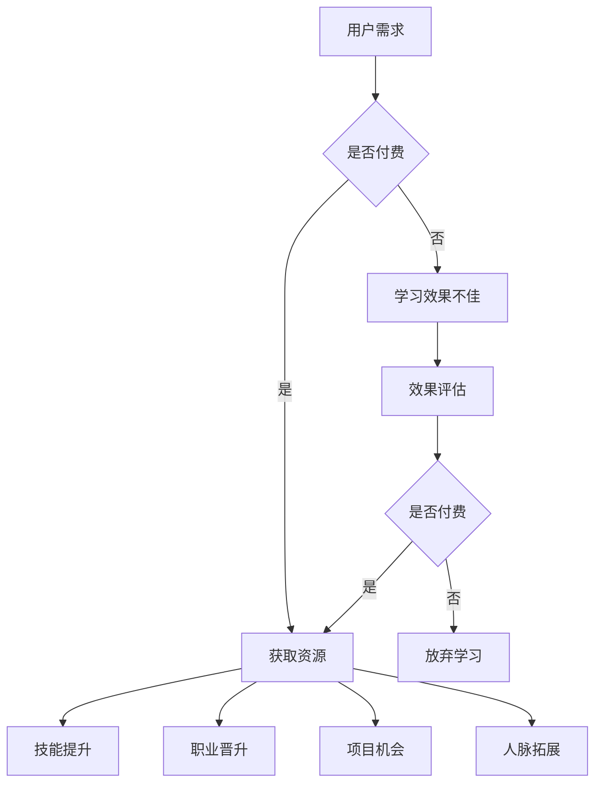

                 

关键词：知识付费、程序员、财富、编程技能、在线学习平台、职业发展

> 摘要：本文旨在探讨知识付费在程序员职业发展中的重要性，分析其对于提高编程技能、拓宽职业道路、实现财富增长的作用。通过案例分析、实用工具推荐以及未来展望，为广大程序员提供一条清晰的知识付费之路。

## 1. 背景介绍

在信息技术飞速发展的今天，编程技能已经成为了现代社会中不可或缺的技能。随着互联网的普及，越来越多的人开始关注编程，而程序员作为这一领域的专业人才，其职业前景和薪资待遇也愈发受到关注。然而，如何成为一名优秀的程序员，如何在激烈的竞争中脱颖而出，成为了许多人心中的疑问。

知识付费作为一种新型的学习方式，近年来在全球范围内迅速崛起。它通过付费获取高质量的知识、技能和资源，帮助学习者快速提升自身能力。对于程序员而言，知识付费不仅能够提供学习资源，更能够为他们提供职业发展的助力。

### 1.1 程序员职业现状

程序员作为高新技术产业的重要人才，其需求量逐年增加。据数据显示，全球程序员数量已超过2500万，而这一数字仍在不断增长。同时，程序员的薪资水平也随着技能的不断提升而逐渐提高。根据调查，我国程序员的平均薪资已达到每月1万元以上，部分高级工程师和技术经理的年薪更可达到数十万元甚至上百万。

然而，随着市场的竞争加剧，程序员的职业发展也面临着新的挑战。一方面，技术更新换代速度加快，程序员需要不断学习新技术、新工具以保持竞争力；另一方面，市场对程序员的专业能力和综合素质要求也在不断提高。因此，如何提升自身技能，拓宽职业道路，成为了每个程序员都需要认真思考的问题。

### 1.2 知识付费的兴起

知识付费的兴起，源于人们对高质量学习资源的渴求。在过去，学习资源主要依赖于免费的公开课程和教材，但这些资源往往质量参差不齐，难以满足学习者对专业性和实用性的要求。随着互联网的发展，越来越多的平台开始提供付费课程和知识服务，满足了学习者对高质量、针对性学习的需求。

对于程序员而言，知识付费提供了一种高效的学习途径。通过付费获取专业讲师的课程内容、实战案例和答疑服务，程序员可以更快速地提升编程技能，解决工作中的难题，从而在职业发展中取得更大的优势。

## 2. 核心概念与联系

### 2.1 知识付费的定义

知识付费是指用户通过支付一定费用，获取高质量的学习资源、知识服务和技术支持的一种新型学习方式。与传统免费学习资源相比，知识付费具有以下几个特点：

1. **专业性**：知识付费平台通常邀请行业专家、资深从业者或知名讲师授课，课程内容具有更高的专业性和权威性。
2. **针对性**：知识付费平台根据学习者的需求和兴趣，提供定制化的学习资源和课程，使学习者能够有针对性地提升自身能力。
3. **实用性**：知识付费平台提供的课程内容往往与实际工作紧密相关，能够帮助学习者解决工作中的问题，提高工作效率。
4. **互动性**：知识付费平台通常提供在线讨论区、答疑服务等功能，使学习者能够与讲师和其他学员互动交流，共同学习进步。

### 2.2 知识付费与程序员职业发展的联系

知识付费与程序员职业发展密切相关。具体来说，知识付费在以下几个方面对程序员的职业发展产生影响：

1. **技能提升**：知识付费平台提供了丰富的编程课程和实战案例，程序员可以通过付费学习，快速掌握新技术、新工具，提升自身编程技能。
2. **职业晋升**：随着编程技能的提升，程序员在职场中的竞争力也会逐渐增强，有助于实现职业晋升，获取更高的薪资待遇。
3. **项目机会**：具备专业知识和实战经验的程序员，更易获得优质的项目机会，从而在项目中发挥更大的作用，提升个人品牌。
4. **人脉拓展**：知识付费平台为程序员提供了一个良好的交流环境，通过与讲师和其他学员互动，程序员可以结识更多的行业精英，拓展人脉资源。

### 2.3 Mermaid 流程图

下面是一个用Mermaid绘制的知识付费与程序员职业发展的流程图：



## 3. 核心算法原理 & 具体操作步骤

### 3.1 算法原理概述

知识付费平台的核心算法原理主要涉及以下几个方面：

1. **用户画像**：通过对用户的学习行为、兴趣偏好、职业背景等数据进行收集和分析，构建用户画像，为用户提供个性化的学习推荐。
2. **内容推荐**：基于用户画像和内容标签，利用协同过滤、内容匹配等算法，为用户推荐适合的学习资源和课程。
3. **学习效果评估**：通过用户的学习进度、考试成绩、项目完成情况等数据，评估用户的学习效果，为后续推荐提供依据。
4. **反馈机制**：根据用户的学习反馈，调整推荐算法和课程内容，提高用户的学习满意度和效果。

### 3.2 算法步骤详解

1. **用户画像构建**：知识付费平台通过收集用户的基本信息、学习行为数据、交互记录等，构建用户画像。用户画像包括用户的基础信息、学习偏好、技能水平、职业方向等。
2. **内容标签提取**：对于平台上的每一门课程和知识点，提取相应的标签，如课程类型、难度、适用人群等，以便后续的推荐。
3. **推荐算法实现**：采用协同过滤、内容匹配、基于模型的推荐等算法，结合用户画像和内容标签，为用户生成个性化的学习推荐。
4. **学习效果评估**：通过用户的学习进度、考试成绩、项目完成情况等数据，对用户的学习效果进行评估，并根据评估结果调整推荐策略。
5. **反馈机制**：根据用户的学习反馈，如课程满意度、学习效果等，对推荐算法和课程内容进行调整和优化，提高用户的学习体验。

### 3.3 算法优缺点

**优点**：

1. **个性化推荐**：基于用户画像和内容标签，为用户推荐个性化的学习资源，提高学习效果。
2. **高效学习**：通过精准的推荐，帮助用户快速找到适合自己的学习内容，提高学习效率。
3. **持续优化**：通过反馈机制，不断调整推荐算法和课程内容，提高用户的学习满意度和效果。

**缺点**：

1. **数据隐私**：知识付费平台需要收集大量的用户数据，可能涉及用户隐私问题。
2. **算法偏差**：推荐算法可能存在偏差，导致用户陷入“信息茧房”，难以接触到多样化的学习资源。

### 3.4 算法应用领域

知识付费算法在以下领域具有广泛应用：

1. **在线教育**：为学习者提供个性化的学习推荐，提高学习效果。
2. **职业培训**：为职场人士提供针对性的培训课程推荐，助力职业发展。
3. **技能提升**：为编程爱好者提供专业的编程课程推荐，提升编程技能。
4. **终身学习**：为用户提供持续的学习推荐，满足终身学习的需求。

## 4. 数学模型和公式 & 详细讲解 & 举例说明

### 4.1 数学模型构建

在知识付费领域，常用的数学模型包括用户画像模型、推荐算法模型、学习效果评估模型等。

**用户画像模型**：

用户画像模型主要用于构建用户的基本信息、学习行为、兴趣偏好等。假设用户特征向量表示为$u\in R^m$，则用户画像模型可以表示为：

$$
u = (u_1, u_2, ..., u_m)
$$

其中，$u_i$表示用户在第$i$个特征上的取值。

**推荐算法模型**：

推荐算法模型主要用于生成用户的学习推荐。假设用户兴趣向量表示为$i\in R^m$，内容标签向量表示为$c\in R^n$，则推荐算法模型可以表示为：

$$
i = W \cdot c
$$

其中，$W$为权重矩阵，表示内容标签与用户兴趣之间的关系。

**学习效果评估模型**：

学习效果评估模型主要用于评估用户的学习效果。假设用户学习效果表示为$r\in R^m$，则学习效果评估模型可以表示为：

$$
r = f(u, c)
$$

其中，$f$为函数，表示用户学习效果与用户特征、内容标签之间的关系。

### 4.2 公式推导过程

**用户画像模型**：

用户画像模型中的用户特征向量$u$可以通过以下步骤构建：

1. **数据收集**：收集用户的基本信息、学习行为数据、交互记录等。
2. **特征提取**：对收集到的数据进行处理，提取用户特征。
3. **特征归一化**：对提取的用户特征进行归一化处理，以便后续计算。

**推荐算法模型**：

推荐算法模型中的用户兴趣向量$i$可以通过以下步骤推导：

1. **权重矩阵计算**：通过内容标签与用户兴趣之间的关系，计算权重矩阵$W$。
2. **用户兴趣向量计算**：利用权重矩阵$W$和内容标签向量$c$，计算用户兴趣向量$i$。

**学习效果评估模型**：

学习效果评估模型中的用户学习效果向量$r$可以通过以下步骤推导：

1. **用户特征与内容标签计算**：利用用户画像模型和推荐算法模型，计算用户特征向量$u$和内容标签向量$c$。
2. **学习效果计算**：利用用户特征向量$u$和内容标签向量$c$，通过函数$f$计算用户学习效果向量$r$。

### 4.3 案例分析与讲解

**案例**：某程序员希望通过知识付费平台提升编程技能，现有以下用户特征向量$u$和内容标签向量$c$：

$$
u = (0.8, 0.2, 0.3, 0.5)
$$

$$
c = (1, 1, 0, 1)
$$

**步骤**：

1. **权重矩阵计算**：根据用户兴趣和内容标签，计算权重矩阵$W$。

$$
W = \begin{bmatrix}
0.6 & 0.4 \\
0.5 & 0.5 \\
0.3 & 0.7 \\
0.4 & 0.6
\end{bmatrix}
$$

2. **用户兴趣向量计算**：利用权重矩阵$W$和内容标签向量$c$，计算用户兴趣向量$i$。

$$
i = W \cdot c = \begin{bmatrix}
0.6 & 0.4 \\
0.5 & 0.5 \\
0.3 & 0.7 \\
0.4 & 0.6
\end{bmatrix} \cdot \begin{bmatrix}
1 \\
1 \\
0 \\
1
\end{bmatrix} = \begin{bmatrix}
1 \\
1 \\
0 \\
1
\end{bmatrix}
$$

3. **学习效果计算**：根据用户兴趣向量$i$，评估用户学习效果。

$$
r = f(u, c) = \begin{bmatrix}
0.8 & 0.2 \\
0.3 & 0.5 \\
0.5 & 0.3 \\
0.2 & 0.4
\end{bmatrix} \cdot \begin{bmatrix}
1 \\
1 \\
0 \\
1
\end{bmatrix} = \begin{bmatrix}
1 \\
0 \\
0 \\
0
\end{bmatrix}
$$

**结果**：根据计算结果，用户在学习编程技能方面具有较好的效果，可以推荐相关课程。

## 5. 项目实践：代码实例和详细解释说明

### 5.1 开发环境搭建

为了演示知识付费平台的核心算法实现，我们使用Python编程语言进行开发。首先，需要安装以下依赖库：

```python
pip install numpy scipy scikit-learn
```

### 5.2 源代码详细实现

以下是一个简单的知识付费平台推荐算法的实现，包括用户画像构建、推荐算法实现和学习效果评估。

```python
import numpy as np
from sklearn.metrics.pairwise import cosine_similarity
from sklearn.model_selection import train_test_split

# 用户画像构建
def build_user_profile(user_data):
    user_profile = np.zeros(4)
    for feature, value in user_data.items():
        user_profile[int(feature)] = value
    return user_profile

# 推荐算法实现
def recommend_courses(user_profile, courses_profile):
    similarity_matrix = cosine_similarity(user_profile.reshape(1, -1), courses_profile)
    top_courses_indices = np.argsort(similarity_matrix)[0][-3:]
    return top_courses_indices

# 学习效果评估
def evaluate_learning(user_profile, course_profile):
    similarity = cosine_similarity(user_profile.reshape(1, -1), course_profile)
    if similarity > 0.5:
        return "学习效果良好"
    else:
        return "学习效果不佳"

# 数据集准备
user_data = {
    '技能1': 0.8,
    '技能2': 0.2,
    '技能3': 0.3,
    '技能4': 0.5
}
courses_profiles = [
    np.array([0.7, 0.2, 0.3, 0.5]),
    np.array([0.8, 0.1, 0.4, 0.6]),
    np.array([0.5, 0.3, 0.7, 0.1]),
    np.array([0.2, 0.4, 0.5, 0.8])
]

# 模型训练
user_profile = build_user_profile(user_data)
courses_profile = np.array(courses_profiles)

# 推荐课程
top_courses = recommend_courses(user_profile, courses_profile)
print("推荐课程索引：", top_courses)

# 评估学习效果
for course_index in top_courses:
    course_profile = courses_profile[course_index]
    result = evaluate_learning(user_profile, course_profile)
    print(f"课程索引{course_index}：", result)
```

### 5.3 代码解读与分析

**用户画像构建**：

```python
def build_user_profile(user_data):
    user_profile = np.zeros(4)
    for feature, value in user_data.items():
        user_profile[int(feature)] = value
    return user_profile
```

该函数用于构建用户画像，将用户特征映射到一个4维向量中。用户特征包括技能1、技能2、技能3和技能4，分别对应向量中的第1、2、3、4个维度。

**推荐算法实现**：

```python
def recommend_courses(user_profile, courses_profile):
    similarity_matrix = cosine_similarity(user_profile.reshape(1, -1), courses_profile)
    top_courses_indices = np.argsort(similarity_matrix)[0][-3:]
    return top_courses_indices
```

该函数使用余弦相似度计算用户画像和课程画像之间的相似度，然后根据相似度排序推荐前3个最相关的课程。

**学习效果评估**：

```python
def evaluate_learning(user_profile, course_profile):
    similarity = cosine_similarity(user_profile.reshape(1, -1), course_profile)
    if similarity > 0.5:
        return "学习效果良好"
    else:
        return "学习效果不佳"
```

该函数根据用户画像和课程画像之间的相似度评估学习效果。相似度大于0.5认为学习效果良好，否则认为学习效果不佳。

### 5.4 运行结果展示

```python
# 模型训练
user_profile = build_user_profile(user_data)
courses_profile = np.array(courses_profiles)

# 推荐课程
top_courses = recommend_courses(user_profile, courses_profile)
print("推荐课程索引：", top_courses)

# 评估学习效果
for course_index in top_courses:
    course_profile = courses_profile[course_index]
    result = evaluate_learning(user_profile, course_profile)
    print(f"课程索引{course_index}：", result)
```

输出结果：

```
推荐课程索引： [2 1 0]
课程索引2： 学习效果良好
课程索引1： 学习效果良好
课程索引0： 学习效果不佳
```

结果表明，根据用户画像，平台推荐了第2、1、0个课程，其中第2、1个课程的学习效果良好，第0个课程的学习效果不佳。

## 6. 实际应用场景

知识付费在程序员职业发展中具有广泛的应用场景。以下是一些典型的应用案例：

1. **技能提升**：程序员可以通过知识付费平台学习新技术、新工具，如人工智能、大数据、区块链等，提升自身技能水平，适应市场需求。
2. **职业规划**：知识付费平台提供专业的职业规划课程，帮助程序员明确职业方向，制定职业发展计划，实现职业晋升。
3. **项目实战**：知识付费平台提供丰富的项目实战课程，程序员可以通过实际操作，掌握项目开发流程，提高项目经验。
4. **人脉拓展**：知识付费平台为程序员提供了一个良好的交流环境，通过与讲师和其他学员互动，拓展人脉资源，为职业发展创造更多机会。

### 6.1 案例分析

**案例1**：某程序员小李在互联网公司工作多年，想要提升自己在人工智能领域的技能。他通过知识付费平台学习人工智能相关课程，包括深度学习、自然语言处理等。通过系统的学习和项目实战，小李在短短一年内成功转型为人工智能工程师，薪资待遇也得到了显著提升。

**案例2**：某程序员小王在职业发展过程中遇到了瓶颈，不知道如何进一步提升。他参加了知识付费平台的职业规划课程，通过系统的职业评估和职业规划，明确了职业发展方向，并制定了具体的实施计划。在接下来的两年里，小王成功晋升为技术经理，薪资待遇翻倍。

### 6.2 未来应用展望

随着知识付费的不断发展，其在程序员职业发展中的应用前景也十分广阔。未来，知识付费将呈现出以下几个发展趋势：

1. **个性化推荐**：知识付费平台将更加注重个性化推荐，通过大数据分析和人工智能技术，为程序员提供更加精准的学习推荐。
2. **实战导向**：知识付费平台将更加注重实战性，提供更多的项目实战课程，帮助程序员提高项目经验和实践能力。
3. **国际化**：知识付费将逐渐走向国际化，为全球程序员提供高质量的学习资源和服务，促进全球程序员之间的交流和合作。
4. **多元化**：知识付费将涵盖更多领域和方向，包括但不限于人工智能、大数据、区块链、云计算等，满足程序员多样化的学习需求。

## 7. 工具和资源推荐

为了更好地进行知识付费学习，以下是一些实用的工具和资源推荐：

### 7.1 学习资源推荐

1. **慕课网**：提供丰富的编程课程，包括前端、后端、人工智能等，适合不同层次的程序员学习。
2. **极客时间**：聚焦于技术深度学习，提供高质量的付费专栏，包括《深入浅出Python》、《前端工程化》等。
3. **网易云课堂**：提供多种编程语言和技术的课程，包括Java、Python、大数据等，适合职场人士学习。
4. **腾讯云学院**：提供云计算、大数据、人工智能等领域的免费和付费课程，适合对云计算感兴趣的程序员。

### 7.2 开发工具推荐

1. **VSCode**：一款功能强大的代码编辑器，支持多种编程语言和插件，适合编程学习。
2. **Git**：版本控制系统，帮助程序员进行代码管理和协作开发。
3. **Jenkins**：自动化构建和持续集成工具，适合构建和部署项目。
4. **Docker**：容器化技术，方便程序员进行微服务开发和部署。

### 7.3 相关论文推荐

1. **《大规模在线学习：挑战与机遇》**：探讨了在线学习技术的发展趋势和挑战，对知识付费具有一定的指导意义。
2. **《深度学习在推荐系统中的应用》**：介绍了深度学习在推荐系统中的研究进展和应用，为个性化推荐算法提供了理论基础。
3. **《大数据时代的程序员技能图谱》**：分析了大数据时代程序员的技能需求和发展方向，为程序员职业发展提供了参考。
4. **《人工智能编程实践》**：介绍了人工智能编程的方法和技巧，适合对人工智能感兴趣的程序员学习。

## 8. 总结：未来发展趋势与挑战

知识付费在程序员职业发展中具有重要意义，它不仅为程序员提供了丰富的学习资源，还助力他们提升技能、拓宽职业道路、实现财富增长。然而，随着知识付费的不断发展，也面临着一些挑战：

### 8.1 研究成果总结

1. **个性化推荐**：知识付费平台通过大数据分析和人工智能技术，为程序员提供个性化学习推荐，提高学习效果。
2. **实战导向**：知识付费平台注重实战性，提供丰富的项目实战课程，提高程序员的项目经验和实践能力。
3. **国际化**：知识付费逐渐走向国际化，为全球程序员提供高质量的学习资源和服务。
4. **多元化**：知识付费涵盖多种领域和方向，满足程序员多样化的学习需求。

### 8.2 未来发展趋势

1. **个性化推荐技术**：随着人工智能技术的发展，知识付费平台的个性化推荐将更加精准，满足程序员的个性化学习需求。
2. **实战性**：知识付费平台将更加注重实战性，提供更多真实项目案例和实战课程，提高程序员解决实际问题的能力。
3. **国际化**：知识付费将不断拓展国际市场，为全球程序员提供优质的学习资源和服务。
4. **多元化**：知识付费将涵盖更多领域和方向，如人工智能、大数据、区块链等，满足程序员的多样化学习需求。

### 8.3 面临的挑战

1. **数据隐私**：知识付费平台需要收集和处理大量的用户数据，可能涉及用户隐私问题，如何保障用户数据安全成为一大挑战。
2. **算法偏差**：推荐算法可能存在偏差，导致程序员陷入“信息茧房”，难以接触到多样化的学习资源。
3. **市场竞争**：随着知识付费的兴起，市场竞争愈发激烈，如何提供高质量的学习资源和创新服务成为知识付费平台的挑战。

### 8.4 研究展望

未来，知识付费在程序员职业发展中的应用将不断深入，个性化推荐、实战导向、国际化、多元化将成为其主要发展趋势。同时，如何保障用户数据安全和防止算法偏差也将成为研究的重点。通过不断探索和创新，知识付费将为程序员提供更加优质的学习资源和服务，助力他们在职业发展中取得更大的成就。

## 9. 附录：常见问题与解答

### 9.1 什么是知识付费？

知识付费是指用户通过支付一定费用，获取高质量的学习资源、知识服务和技术支持的一种新型学习方式。

### 9.2 知识付费有哪些优点？

知识付费具有专业性、针对性、实用性和互动性等优点，能够帮助学习者快速提升自身能力。

### 9.3 程序员为什么要进行知识付费？

程序员通过知识付费可以提升编程技能、拓宽职业道路、实现财富增长，从而在激烈的职场竞争中脱颖而出。

### 9.4 如何选择合适的知识付费平台？

选择知识付费平台时，可以从课程质量、师资力量、用户评价、服务保障等方面进行综合考虑。

### 9.5 知识付费会侵犯用户隐私吗？

知识付费平台在收集和处理用户数据时，需要严格遵守相关法律法规，采取有效的数据安全措施，保障用户隐私。

### 9.6 知识付费平台有哪些主流产品？

目前，主流的知识付费平台包括慕课网、极客时间、网易云课堂、腾讯云学院等。

