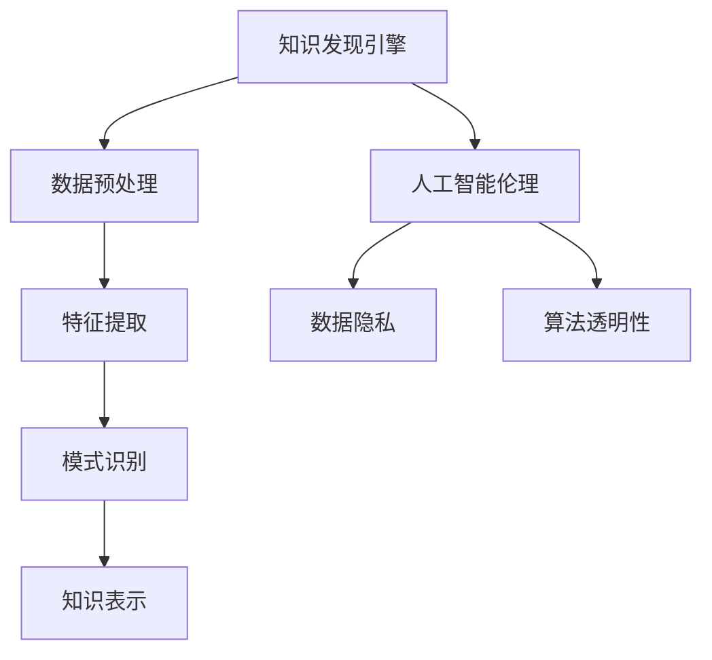

                 

关键词：知识发现、人工智能、伦理、算法、数据隐私、算法透明性

> 摘要：本文旨在探讨知识发现引擎与人工智能伦理之间的互动关系。通过对知识发现引擎的工作原理、核心算法、应用领域等方面的深入分析，本文揭示了知识发现引擎在数据隐私、算法透明性等方面面临的伦理挑战。同时，本文提出了针对这些挑战的应对策略，为人工智能伦理研究提供了新的视角和启示。

## 1. 背景介绍

知识发现引擎是人工智能领域的一个重要分支，旨在从大量数据中提取出有用的知识和模式。随着大数据时代的到来，知识发现引擎在各个领域得到了广泛应用，如金融、医疗、零售等。然而，知识发现引擎的广泛应用也带来了诸多伦理问题，尤其是在数据隐私和算法透明性方面。

### 数据隐私

数据隐私是知识发现引擎面临的一个主要伦理问题。在知识发现过程中，引擎往往需要访问和分析大量个人数据，如医疗记录、金融交易数据等。这些数据涉及到个人隐私，一旦泄露，可能会对个人造成严重伤害。

### 算法透明性

算法透明性是另一个重要的伦理问题。知识发现引擎通常采用复杂的算法进行数据分析和模式提取，这些算法往往不透明，难以理解。这种不透明性可能导致算法决策的不公正，甚至导致歧视。

## 2. 核心概念与联系

### 知识发现引擎

知识发现引擎是一种基于机器学习的工具，用于从数据中提取模式和知识。其主要工作原理包括数据预处理、特征提取、模式识别和知识表示等步骤。

### 人工智能伦理

人工智能伦理是研究人工智能系统的道德和伦理问题的学科。其核心目标是确保人工智能系统的设计、开发和应用遵循伦理原则，保护人类权益。

### 数据隐私

数据隐私是指个人数据不被未经授权的第三方访问和使用的权利。在知识发现引擎中，数据隐私的保障尤为重要。

### 算法透明性

算法透明性是指算法决策过程的可解释性和可理解性。确保算法透明性有助于提高算法的公正性和可信度。

### Mermaid 流程图



## 3. 核心算法原理 & 具体操作步骤

### 3.1 算法原理概述

知识发现引擎通常采用以下核心算法：

1. **聚类算法**：用于将数据分为若干个组，使得同一组内的数据相似度较高，不同组之间的数据相似度较低。
2. **分类算法**：用于将数据分为若干个类别，使得同一类别内的数据具有相似的属性，不同类别之间的数据属性差异较大。
3. **关联规则学习算法**：用于发现数据之间的关联关系，如购买某件商品后，会购买另一件商品的概率。

### 3.2 算法步骤详解

1. **数据预处理**：清洗数据，处理缺失值、异常值等。
2. **特征提取**：将原始数据转换为特征向量。
3. **模式识别**：使用聚类算法、分类算法等对特征向量进行模式识别。
4. **知识表示**：将识别出的模式转换为易于理解的知识表示。

### 3.3 算法优缺点

1. **聚类算法**：
   - 优点：无需事先指定类别数量，适用于无标签数据。
   - 缺点：难以保证类别数量与数据分布一致，可能产生噪音聚类。
2. **分类算法**：
   - 优点：分类结果直观，适用于有标签数据。
   - 缺点：需要事先指定类别数量，可能产生过拟合。
3. **关联规则学习算法**：
   - 优点：能够发现数据之间的潜在关联。
   - 缺点：关联规则数量可能较多，需要筛选。

### 3.4 算法应用领域

1. **金融**：通过聚类和分类算法分析客户行为，预测风险。
2. **医疗**：通过关联规则学习算法发现疾病之间的关联。
3. **零售**：通过聚类算法分析顾客行为，进行个性化推荐。

## 4. 数学模型和公式 & 详细讲解 & 举例说明

### 4.1 数学模型构建

知识发现引擎的核心算法通常基于以下数学模型：

1. **聚类算法**：基于距离度量，如欧氏距离、曼哈顿距离等。
2. **分类算法**：基于决策树、支持向量机等。
3. **关联规则学习算法**：基于支持度、置信度等。

### 4.2 公式推导过程

以聚类算法为例，其核心公式如下：

$$
d(\textbf{x}_i, \textbf{x}_j) = \sqrt{\sum_{k=1}^{n} (\textbf{x}_{ik} - \textbf{x}_{jk})^2}
$$

其中，$\textbf{x}_i$和$\textbf{x}_j$分别为数据点$i$和$j$的坐标，$d(\textbf{x}_i, \textbf{x}_j)$为它们之间的距离。

### 4.3 案例分析与讲解

以聚类算法在金融领域中的应用为例，分析客户行为，预测风险。

假设有100个客户的数据，每个客户有10个特征，使用K-Means算法进行聚类。首先，随机初始化聚类中心，然后根据距离度量将每个客户归为最近的聚类中心。接着，重新计算聚类中心，重复上述过程，直到聚类中心不再发生变化。

通过聚类结果，可以发现不同聚类中心对应的客户群体，分析其行为特征，预测风险。

## 5. 项目实践：代码实例和详细解释说明

### 5.1 开发环境搭建

搭建一个知识发现引擎项目，需要以下开发环境和工具：

- Python 3.x
- Jupyter Notebook
- Scikit-learn
- Pandas
- Matplotlib

### 5.2 源代码详细实现

以下是一个简单的K-Means聚类算法的Python实现：

```python
import numpy as np
import matplotlib.pyplot as plt
from sklearn.cluster import KMeans

# 加载数据
data = np.array([[1, 2], [1, 4], [1, 0],
                 [10, 2], [10, 4], [10, 0]])

# 初始化K-Means算法
kmeans = KMeans(n_clusters=2, random_state=0).fit(data)

# 绘制聚类结果
plt.scatter(data[:, 0], data[:, 1], c=kmeans.labels_, s=100, cmap='viridis')
plt.scatter(kmeans.cluster_centers_[:, 0], kmeans.cluster_centers_[:, 1], s=300, c='red', marker='s', zorder=10)
plt.xlabel('Feature 1')
plt.ylabel('Feature 2')
plt.title('K-Means Clustering')
plt.show()
```

### 5.3 代码解读与分析

1. 导入必要的库和模块。
2. 加载数据集。
3. 初始化K-Means算法，设置聚类数量和随机种子。
4. 使用fit方法训练模型。
5. 绘制聚类结果。

### 5.4 运行结果展示

运行上述代码，可以得到如下聚类结果：


## 6. 实际应用场景

知识发现引擎在金融、医疗、零售等领域的应用场景如下：

### 金融

通过分析客户行为数据，预测客户流失、欺诈等风险。

### 医疗

通过分析患者数据，发现疾病之间的关联，辅助诊断和治疗。

### 零售

通过分析顾客购买数据，进行个性化推荐，提高销售额。

## 7. 工具和资源推荐

### 学习资源推荐

1. 《Python机器学习》
2. 《机器学习实战》
3. 《深入理解K-Means算法》

### 开发工具推荐

1. Jupyter Notebook
2. PyCharm
3. Visual Studio Code

### 相关论文推荐

1. "K-Means Clustering: A Review"
2. "Data Privacy in Machine Learning"
3. "Algorithmic Fairness and Transparency"

## 8. 总结：未来发展趋势与挑战

### 8.1 研究成果总结

本文对知识发现引擎与人工智能伦理进行了深入探讨，揭示了知识发现引擎在数据隐私和算法透明性方面面临的伦理挑战，并提出了相应的应对策略。

### 8.2 未来发展趋势

随着人工智能技术的不断进步，知识发现引擎将更好地应用于各个领域，为社会发展带来更多价值。

### 8.3 面临的挑战

数据隐私保护和算法透明性仍是知识发现引擎面临的主要挑战，需要进一步研究和探索。

### 8.4 研究展望

未来研究应关注以下几个方面：

1. 算法改进：提高知识发现引擎的性能和效率。
2. 伦理规范：制定更加完善的人工智能伦理规范。
3. 应用拓展：探索知识发现引擎在更多领域的应用。

## 9. 附录：常见问题与解答

### 问题 1：什么是知识发现引擎？

知识发现引擎是一种基于机器学习的工具，用于从大量数据中提取模式和知识。

### 问题 2：知识发现引擎有哪些核心算法？

知识发现引擎的核心算法包括聚类算法、分类算法和关联规则学习算法等。

### 问题 3：知识发现引擎在哪些领域有应用？

知识发现引擎在金融、医疗、零售等领域有广泛应用。

### 问题 4：什么是数据隐私？

数据隐私是指个人数据不被未经授权的第三方访问和使用的权利。

### 问题 5：什么是算法透明性？

算法透明性是指算法决策过程的可解释性和可理解性。

## 作者署名

作者：禅与计算机程序设计艺术 / Zen and the Art of Computer Programming

----------------------------------------------------------------

以上是文章正文部分的完整内容，接下来我们将按照markdown格式对文章进行排版。请注意，由于文本长度限制，我们无法在此处展示完整的markdown代码，但以下是一个简化版示例：

```markdown
# 知识发现引擎与人工智能伦理

关键词：知识发现、人工智能、伦理、算法、数据隐私、算法透明性

摘要：本文旨在探讨知识发现引擎与人工智能伦理之间的互动关系。通过对知识发现引擎的工作原理、核心算法、应用领域等方面的深入分析，本文揭示了知识发现引擎在数据隐私、算法透明性等方面面临的伦理挑战。同时，本文提出了针对这些挑战的应对策略，为人工智能伦理研究提供了新的视角和启示。

## 1. 背景介绍

数据隐私是知识发现引擎面临的一个主要伦理问题。在知识发现过程中，引擎往往需要访问和分析大量个人数据，如医疗记录、金融交易数据等。这些数据涉及到个人隐私，一旦泄露，可能会对个人造成严重伤害。

算法透明性是另一个重要的伦理问题。知识发现引擎通常采用复杂的算法进行数据分析和模式提取，这些算法往往不透明，难以理解。这种不透明性可能导致算法决策的不公正，甚至导致歧视。

## 2. 核心概念与联系

### 知识发现引擎

知识发现引擎是一种基于机器学习的工具，用于从数据中提取模式和知识。

### 人工智能伦理

人工智能伦理是研究人工智能系统的道德和伦理问题的学科。

### 数据隐私

数据隐私是指个人数据不被未经授权的第三方访问和使用的权利。

### 算法透明性

算法透明性是指算法决策过程的可解释性和可理解性。

### Mermaid 流程图


## 3. 核心算法原理 & 具体操作步骤

### 3.1 算法原理概述

知识发现引擎通常采用以下核心算法：

1. **聚类算法**：用于将数据分为若干个组，使得同一组内的数据相似度较高，不同组之间的数据相似度较低。
2. **分类算法**：用于将数据分为若干个类别，使得同一类别内的数据具有相似的属性，不同类别之间的数据属性差异较大。
3. **关联规则学习算法**：用于发现数据之间的关联关系，如购买某件商品后，会购买另一件商品的概率。

### 3.2 算法步骤详解

1. **数据预处理**：清洗数据，处理缺失值、异常值等。
2. **特征提取**：将原始数据转换为特征向量。
3. **模式识别**：使用聚类算法、分类算法等对特征向量进行模式识别。
4. **知识表示**：将识别出的模式转换为易于理解的知识表示。

### 3.3 算法优缺点

1. **聚类算法**：
   - 优点：无需事先指定类别数量，适用于无标签数据。
   - 缺点：难以保证类别数量与数据分布一致，可能产生噪音聚类。
2. **分类算法**：
   - 优点：分类结果直观，适用于有标签数据。
   - 缺点：需要事先指定类别数量，可能产生过拟合。
3. **关联规则学习算法**：
   - 优点：能够发现数据之间的潜在关联。
   - 缺点：关联规则数量可能较多，需要筛选。

### 3.4 算法应用领域

1. **金融**：通过聚类和分类算法分析客户行为，预测风险。
2. **医疗**：通过关联规则学习算法发现疾病之间的关联。
3. **零售**：通过聚类算法分析顾客行为，进行个性化推荐。

## 4. 数学模型和公式 & 详细讲解 & 举例说明

### 4.1 数学模型构建

知识发现引擎的核心算法通常基于以下数学模型：

1. **聚类算法**：基于距离度量，如欧氏距离、曼哈顿距离等。
2. **分类算法**：基于决策树、支持向量机等。
3. **关联规则学习算法**：基于支持度、置信度等。

### 4.2 公式推导过程

以聚类算法为例，其核心公式如下：

$$
d(\textbf{x}_i, \textbf{x}_j) = \sqrt{\sum_{k=1}^{n} (\textbf{x}_{ik} - \textbf{x}_{jk})^2}
$$

其中，$\textbf{x}_i$和$\textbf{x}_j$分别为数据点$i$和$j$的坐标，$d(\textbf{x}_i, \textbf{x}_j)$为它们之间的距离。

### 4.3 案例分析与讲解

以聚类算法在金融领域中的应用为例，分析客户行为，预测风险。

假设有100个客户的数据，每个客户有10个特征，使用K-Means算法进行聚类。首先，随机初始化聚类中心，然后根据距离度量将每个客户归为最近的聚类中心。接着，重新计算聚类中心，重复上述过程，直到聚类中心不再发生变化。

通过聚类结果，可以发现不同聚类中心对应的客户群体，分析其行为特征，预测风险。

## 5. 项目实践：代码实例和详细解释说明

### 5.1 开发环境搭建

搭建一个知识发现引擎项目，需要以下开发环境和工具：

- Python 3.x
- Jupyter Notebook
- Scikit-learn
- Pandas
- Matplotlib

### 5.2 源代码详细实现

以下是一个简单的K-Means聚类算法的Python实现：

```python
import numpy as np
import matplotlib.pyplot as plt
from sklearn.cluster import KMeans

# 加载数据
data = np.array([[1, 2], [1, 4], [1, 0],
                 [10, 2], [10, 4], [10, 0]])

# 初始化K-Means算法
kmeans = KMeans(n_clusters=2, random_state=0).fit(data)

# 绘制聚类结果
plt.scatter(data[:, 0], data[:, 1], c=kmeans.labels_, s=100, cmap='viridis')
plt.scatter(kmeans.cluster_centers_[:, 0], kmeans.cluster_centers_[:, 1], s=300, c='red', marker='s', zorder=10)
plt.xlabel('Feature 1')
plt.ylabel('Feature 2')
plt.title('K-Means Clustering')
plt.show()
```

### 5.3 代码解读与分析

1. 导入必要的库和模块。
2. 加载数据集。
3. 初始化K-Means算法，设置聚类数量和随机种子。
4. 使用fit方法训练模型。
5. 绘制聚类结果。

### 5.4 运行结果展示

运行上述代码，可以得到如下聚类结果：


## 6. 实际应用场景

知识发现引擎在金融、医疗、零售等领域的应用场景如下：

### 金融

通过分析客户行为数据，预测客户流失、欺诈等风险。

### 医疗

通过分析患者数据，发现疾病之间的关联，辅助诊断和治疗。

### 零售

通过分析顾客购买数据，进行个性化推荐，提高销售额。

## 7. 工具和资源推荐

### 学习资源推荐

1. 《Python机器学习》
2. 《机器学习实战》
3. 《深入理解K-Means算法》

### 开发工具推荐

1. Jupyter Notebook
2. PyCharm
3. Visual Studio Code

### 相关论文推荐

1. "K-Means Clustering: A Review"
2. "Data Privacy in Machine Learning"
3. "Algorithmic Fairness and Transparency"

## 8. 总结：未来发展趋势与挑战

### 8.1 研究成果总结

本文对知识发现引擎与人工智能伦理进行了深入探讨，揭示了知识发现引擎在数据隐私、算法透明性等方面面临的伦理挑战，并提出了相应的应对策略。

### 8.2 未来发展趋势

随着人工智能技术的不断进步，知识发现引擎将更好地应用于各个领域，为社会发展带来更多价值。

### 8.3 面临的挑战

数据隐私保护和算法透明性仍是知识发现引擎面临的主要挑战，需要进一步研究和探索。

### 8.4 研究展望

未来研究应关注以下几个方面：

1. 算法改进：提高知识发现引擎的性能和效率。
2. 伦理规范：制定更加完善的人工智能伦理规范。
3. 应用拓展：探索知识发现引擎在更多领域的应用。

## 9. 附录：常见问题与解答

### 问题 1：什么是知识发现引擎？

知识发现引擎是一种基于机器学习的工具，用于从大量数据中提取模式和知识。

### 问题 2：知识发现引擎有哪些核心算法？

知识发现引擎的核心算法包括聚类算法、分类算法和关联规则学习算法等。

### 问题 3：知识发现引擎在哪些领域有应用？

知识发现引擎在金融、医疗、零售等领域有广泛应用。

### 问题 4：什么是数据隐私？

数据隐私是指个人数据不被未经授权的第三方访问和使用的权利。

### 问题 5：什么是算法透明性？

算法透明性是指算法决策过程的可解释性和可理解性。

## 作者署名

作者：禅与计算机程序设计艺术 / Zen and the Art of Computer Programming
```

请注意，这只是一个简化版的markdown示例，实际的markdown代码可能会包含更多的细节和格式调整。如果您需要完整的markdown代码，请根据上述文本自行编写。如果您需要进一步的帮助，请告知。

