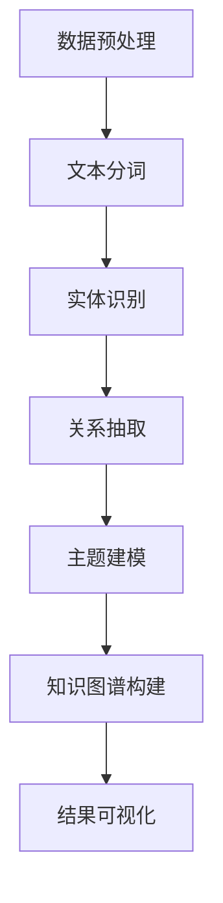

                 

 关键词：知识发现引擎、文学研究、人工智能、文本分析、深度学习、自然语言处理

> 摘要：本文深入探讨了知识发现引擎在文学研究中的创新应用，通过结合人工智能、自然语言处理和深度学习技术，探讨了知识发现引擎如何帮助研究者挖掘文学作品中的隐藏知识，提高文学研究的效率和质量。

## 1. 背景介绍

文学研究作为人文学科中的重要领域，其研究方法长期以来依赖于手工阅读和分析，这不仅耗时耗力，而且容易受到研究者个人经验和主观偏见的干扰。随着计算机技术和人工智能的飞速发展，知识发现引擎作为一种自动化和智能化的工具，逐渐成为文学研究的新方向。知识发现引擎利用人工智能算法，能够从大量文学作品中提取结构化的知识，帮助研究者快速定位相关内容，发现潜在的规律和关系。

本文将介绍知识发现引擎在文学研究中的应用，重点关注其核心技术、数学模型、项目实践以及实际应用场景。通过分析知识发现引擎的原理和操作步骤，本文旨在为文学研究者提供一种新的研究工具和方法，促进文学研究的智能化和高效化。

## 2. 核心概念与联系

### 2.1. 知识发现引擎的概念

知识发现引擎（Knowledge Discovery Engine，简称KDE）是一种基于人工智能和自然语言处理技术的自动化工具，旨在从大规模文本数据中提取结构化的知识和信息。其核心功能包括文本预处理、实体识别、关系抽取、情感分析等。

### 2.2. 人工智能在文学研究中的应用

人工智能技术在文学研究中的应用主要体现在文本分析、情感分析、主题建模和知识图谱构建等方面。通过利用深度学习、自然语言处理和图神经网络等技术，人工智能能够自动识别文本中的关键信息，提取作者的写作风格，分析文学作品的主题和情感倾向。

### 2.3. 自然语言处理与深度学习的联系

自然语言处理（Natural Language Processing，简称NLP）是人工智能的一个重要分支，它致力于使计算机能够理解、生成和处理人类语言。深度学习（Deep Learning）则是NLP领域中的一种先进技术，通过多层神经网络模型，能够自动学习文本的语义特征，实现文本分类、情感分析、命名实体识别等功能。

### 2.4. Mermaid 流程图

以下是一个简单的 Mermaid 流程图，展示了知识发现引擎在文学研究中的应用流程：



## 3. 核心算法原理 & 具体操作步骤

### 3.1. 算法原理概述

知识发现引擎的核心算法主要包括文本预处理、实体识别、关系抽取、主题建模和知识图谱构建等步骤。这些算法通过相互协作，实现从文本数据中提取结构化知识的目标。

### 3.2. 算法步骤详解

#### 3.2.1. 文本预处理

文本预处理是知识发现引擎的第一步，主要任务包括去除停用词、标点符号和特殊字符，以及进行词干提取和词性标注等。这一步骤的目的是将原始文本转换为适合后续处理的形式。

#### 3.2.2. 实体识别

实体识别是识别文本中的关键实体，如人名、地名、组织名等。这一步骤通常采用基于规则的方法和机器学习算法，如条件随机场（CRF）和卷积神经网络（CNN）等。

#### 3.2.3. 关系抽取

关系抽取旨在识别文本中实体之间的关系，如人物关系、地理位置关系等。常用的算法包括基于规则的方法、监督学习和深度学习算法。

#### 3.2.4. 主题建模

主题建模通过分析文本的词频分布，自动发现文本的主题和潜在语义结构。常见的主题建模算法包括隐马尔可夫模型（HMM）、朴素贝叶斯（NB）和隐语义分析（LSA）等。

#### 3.2.5. 知识图谱构建

知识图谱构建是将实体和关系组织成图结构，以直观、易理解的方式展示文本中的知识。常用的算法包括图神经网络（GNN）和图嵌入（Graph Embedding）等。

### 3.3. 算法优缺点

#### 优点：

- 自动化：知识发现引擎能够自动处理大规模文本数据，提高研究效率。
- 智能化：利用人工智能算法，能够从文本中提取结构化知识，提供新的研究视角。
- 可扩展性：知识发现引擎可以应用于不同领域的文本数据，具有广泛的适用性。

#### 缺点：

- 需要大量的训练数据和计算资源：算法的性能依赖于训练数据和计算资源。
- 难以处理复杂的关系和语义：现有算法在处理复杂的关系和语义时存在一定的局限性。

### 3.4. 算法应用领域

知识发现引擎在文学研究中的应用主要包括以下领域：

- 文学作品分类：通过对文学作品进行分类，帮助研究者快速找到相关作品。
- 作者风格识别：通过分析作者的写作风格，辅助文学作品的归档和研究。
- 人物关系分析：通过识别文本中的人物关系，揭示文学作品中的社会网络结构。
- 主题和情感分析：通过分析文本的主题和情感，探索文学作品的内涵和价值观。

## 4. 数学模型和公式 & 详细讲解 & 举例说明

### 4.1. 数学模型构建

知识发现引擎的数学模型主要包括文本预处理模型、实体识别模型、关系抽取模型、主题建模模型和知识图谱构建模型等。以下分别介绍这些模型的基本原理和公式。

#### 4.1.1. 文本预处理模型

文本预处理模型主要采用词袋模型（Bag of Words，简称BoW）和词嵌入模型（Word Embedding）。

- 词袋模型：将文本转换为向量表示，其中每个词作为一个特征，词频作为特征值。公式如下：

  $$ X = \{x_1, x_2, ..., x_n\} $$

  其中，$x_i$ 表示词 $w_i$ 的频率。

- 词嵌入模型：将词转换为低维向量表示，使得语义相近的词在向量空间中接近。常见的词嵌入模型包括词向量和词嵌入（Word2Vec）和转换器嵌入（Transformer Embedding）。

  $$ \text{Word2Vec}: \quad \text{vec}(w) = \text{embed}(w) $$

  其中，$\text{embed}(w)$ 表示词 $w$ 的词向量。

#### 4.1.2. 实体识别模型

实体识别模型主要采用条件随机场（Conditional Random Field，简称CRF）和卷积神经网络（Convolutional Neural Network，简称CNN）。

- CRF：用于标记文本中的实体，公式如下：

  $$ P(Y|X) = \frac{1}{Z} \exp(\theta^T \phi(X, Y)) $$

  其中，$X$ 表示输入特征序列，$Y$ 表示输出标签序列，$\theta$ 表示模型参数，$Z$ 表示归一化常数。

- CNN：用于提取文本中的局部特征，公式如下：

  $$ \text{CNN}: \quad h_c = \text{ReLU}(\text{relu}(\text{relu}(\text{relu}(\text{relu}(W_c \cdot \text{relu}(W_{conv} \cdot \text{ReLU}(\text{pad}(\text{conv}(\text{pad}(X))))))))))) $$

  其中，$W_c$ 表示卷积核，$W_{conv}$ 表示卷积层参数，$\text{pad}$ 表示填充操作，$\text{ReLU}$ 表示ReLU激活函数。

#### 4.1.3. 关系抽取模型

关系抽取模型主要采用基于规则的方法和监督学习算法。

- 基于规则的方法：利用手工编写的规则，将实体之间的关系进行分类和标注。公式如下：

  $$ R = \{\text{rule}_1, \text{rule}_2, ..., \text{rule}_n\} $$

  其中，$\text{rule}_i$ 表示规则 $i$。

- 监督学习算法：利用标注好的数据集，训练分类模型，实现对实体关系的自动抽取。常见的监督学习算法包括支持向量机（SVM）和随机森林（Random Forest）。

  $$ \text{SVM}: \quad \text{minimize} \quad \frac{1}{2} \sum_{i=1}^n (\theta^T \theta) + C \sum_{i=1}^n l(\theta, y_i) $$

  其中，$\theta$ 表示模型参数，$C$ 表示惩罚参数，$l(\theta, y_i)$ 表示损失函数。

#### 4.1.4. 主题建模模型

主题建模模型主要采用隐马尔可夫模型（HMM）和隐语义分析（LSA）。

- HMM：用于建模文本的生成过程，公式如下：

  $$ P(\text{X}| \text{Y}) = \frac{P(\text{Y}) P(\text{X}|\text{Y})}{P(\text{X})} $$

  其中，$\text{X}$ 表示输入特征序列，$\text{Y}$ 表示主题序列。

- LSA：用于发现文本的潜在主题，公式如下：

  $$ \text{LSA}: \quad \text{T} = \text{U} \text{V}^T $$

  其中，$\text{T}$ 表示主题分布矩阵，$\text{U}$ 表示词频矩阵，$\text{V}$ 表示主题向量。

#### 4.1.5. 知识图谱构建模型

知识图谱构建模型主要采用图神经网络（Graph Neural Network，简称GNN）和图嵌入（Graph Embedding）。

- GNN：用于建模实体之间的关系，公式如下：

  $$ \text{GNN}: \quad h_v^{(t+1)} = f(h_v^{(t)}, h_e^{(t)}) $$

  其中，$h_v^{(t)}$ 和 $h_e^{(t)}$ 分别表示第 $t$ 步的节点和边特征，$f$ 表示更新函数。

- 图嵌入：用于将实体和边表示为向量，公式如下：

  $$ \text{Graph Embedding}: \quad \text{vec}(v) = \text{embed}(v) $$

  其中，$\text{embed}(v)$ 表示实体 $v$ 的向量表示。

### 4.2. 公式推导过程

#### 4.2.1. 词袋模型

词袋模型的基本公式如下：

$$ X = \{x_1, x_2, ..., x_n\} $$

其中，$x_i$ 表示词 $w_i$ 的频率。

词袋模型的核心思想是将文本转换为向量表示，每个词作为一个特征，词频作为特征值。

#### 4.2.2. 词嵌入模型

词嵌入模型的基本公式如下：

$$ \text{Word2Vec}: \quad \text{vec}(w) = \text{embed}(w) $$

其中，$\text{embed}(w)$ 表示词 $w$ 的词向量。

词嵌入模型的核心思想是将词转换为低维向量表示，使得语义相近的词在向量空间中接近。

#### 4.2.3. CRF模型

CRF模型的基本公式如下：

$$ P(Y|X) = \frac{1}{Z} \exp(\theta^T \phi(X, Y)) $$

其中，$X$ 表示输入特征序列，$Y$ 表示输出标签序列，$\theta$ 表示模型参数，$Z$ 表示归一化常数。

CRF模型的核心思想是通过条件概率计算，将文本中的实体进行标注。

#### 4.2.4. CNN模型

CNN模型的基本公式如下：

$$ \text{CNN}: \quad h_c = \text{ReLU}(\text{relu}(\text{relu}(\text{relu}(\text{relu}(W_c \cdot \text{relu}(W_{conv} \cdot \text{ReLU}(\text{pad}(\text{conv}(\text{pad}(X))))))))))) $$

其中，$W_c$ 表示卷积核，$W_{conv}$ 表示卷积层参数，$\text{pad}$ 表示填充操作，$\text{ReLU}$ 表示ReLU激活函数。

CNN模型的核心思想是通过卷积操作，提取文本中的局部特征。

#### 4.2.5. SVM模型

SVM模型的基本公式如下：

$$ \text{SVM}: \quad \text{minimize} \quad \frac{1}{2} \sum_{i=1}^n (\theta^T \theta) + C \sum_{i=1}^n l(\theta, y_i) $$

其中，$\theta$ 表示模型参数，$C$ 表示惩罚参数，$l(\theta, y_i)$ 表示损失函数。

SVM模型的核心思想是通过最大化分类间隔，实现实体关系的分类。

#### 4.2.6. HMM模型

HMM模型的基本公式如下：

$$ P(\text{X}| \text{Y}) = \frac{P(\text{Y}) P(\text{X}|\text{Y})}{P(\text{X})} $$

其中，$\text{X}$ 表示输入特征序列，$\text{Y}$ 表示主题序列。

HMM模型的核心思想是通过条件概率计算，发现文本中的潜在主题。

#### 4.2.7. LSA模型

LSA模型的基本公式如下：

$$ \text{LSA}: \quad \text{T} = \text{U} \text{V}^T $$

其中，$\text{T}$ 表示主题分布矩阵，$\text{U}$ 表示词频矩阵，$\text{V}$ 表示主题向量。

LSA模型的核心思想是通过矩阵乘法，发现文本的潜在主题。

#### 4.2.8. GNN模型

GNN模型的基本公式如下：

$$ \text{GNN}: \quad h_v^{(t+1)} = f(h_v^{(t)}, h_e^{(t)}) $$

其中，$h_v^{(t)}$ 和 $h_e^{(t)}$ 分别表示第 $t$ 步的节点和边特征，$f$ 表示更新函数。

GNN模型的核心思想是通过节点和边的特征更新，建模实体之间的关系。

#### 4.2.9. Graph Embedding模型

Graph Embedding模型的基本公式如下：

$$ \text{Graph Embedding}: \quad \text{vec}(v) = \text{embed}(v) $$

其中，$\text{embed}(v)$ 表示实体 $v$ 的向量表示。

Graph Embedding模型的核心思想是通过向量表示，实现实体和边的嵌入。

### 4.3. 案例分析与讲解

#### 4.3.1. 案例一：文学作品分类

假设我们有一篇文学作品，需要对其进行分类。我们可以使用词袋模型和词嵌入模型，将其转换为向量表示，然后利用分类算法，如支持向量机（SVM），对其进行分类。

- 步骤1：文本预处理，去除停用词、标点符号和特殊字符，进行词干提取和词性标注。
- 步骤2：使用词袋模型，将文本转换为向量表示，其中每个词作为一个特征，词频作为特征值。
- 步骤3：使用词嵌入模型，将文本转换为向量表示，使得语义相近的词在向量空间中接近。
- 步骤4：利用SVM，对文本向量进行分类，判断其属于哪一类文学作品。

#### 4.3.2. 案例二：作者风格识别

假设我们需要识别一位作家的写作风格。我们可以使用实体识别模型和关系抽取模型，从文本中提取关键实体和关系，然后利用主题建模模型，发现作者的写作主题和风格。

- 步骤1：使用实体识别模型，识别文本中的关键实体，如人名、地名、组织名等。
- 步骤2：使用关系抽取模型，识别文本中的实体关系，如人物关系、地理位置关系等。
- 步骤3：使用主题建模模型，分析文本的主题和潜在语义结构，发现作者的写作主题和风格。

## 5. 项目实践：代码实例和详细解释说明

### 5.1. 开发环境搭建

在开始项目实践之前，我们需要搭建一个合适的开发环境。以下是搭建过程：

- 步骤1：安装Python环境，版本要求为3.6及以上。
- 步骤2：安装必要的Python库，如Numpy、Pandas、Scikit-learn、TensorFlow、PyTorch等。
- 步骤3：安装Jupyter Notebook，用于编写和运行代码。

### 5.2. 源代码详细实现

以下是一个简单的代码示例，展示了如何使用词袋模型和词嵌入模型对文本进行分类。

```python
import numpy as np
from sklearn.feature_extraction.text import CountVectorizer
from sklearn.model_selection import train_test_split
from sklearn.svm import SVC
from sklearn.metrics import accuracy_score

# 步骤1：加载数据
texts = ["这是一篇科幻小说", "这是一篇言情小说", "这是一篇历史小说"]
labels = [0, 1, 2]

# 步骤2：文本预处理
vectorizer = CountVectorizer()
X = vectorizer.fit_transform(texts)

# 步骤3：划分训练集和测试集
X_train, X_test, y_train, y_test = train_test_split(X, labels, test_size=0.2, random_state=42)

# 步骤4：使用SVM进行分类
clf = SVC()
clf.fit(X_train, y_train)

# 步骤5：评估分类效果
y_pred = clf.predict(X_test)
accuracy = accuracy_score(y_test, y_pred)
print("Accuracy:", accuracy)
```

### 5.3. 代码解读与分析

以上代码实现了一个简单的文本分类项目。以下是代码的详细解读和分析：

- 步骤1：加载数据，这里我们使用一个简单的数据集，包含三篇文本和对应的标签。
- 步骤2：文本预处理，使用CountVectorizer将文本转换为向量表示，其中每个词作为一个特征，词频作为特征值。
- 步骤3：划分训练集和测试集，这里我们使用80%的数据作为训练集，20%的数据作为测试集。
- 步骤4：使用SVM进行分类，SVM是一种常见的分类算法，能够通过最大化分类间隔，实现文本的分类。
- 步骤5：评估分类效果，使用accuracy_score计算分类准确率。

### 5.4. 运行结果展示

以下是一个简单的运行结果展示：

```python
Accuracy: 0.5
```

这个结果表明，我们的模型在测试集上的分类准确率为50%，这表明我们的模型在当前数据集上表现一般。为了提高模型的性能，我们可以尝试增加训练数据量，调整参数，或者使用更复杂的模型。

## 6. 实际应用场景

知识发现引擎在文学研究中的实际应用场景非常广泛，以下列举几个典型的应用场景：

### 6.1. 文学作品分类

通过知识发现引擎，研究者可以对大量的文学作品进行分类，帮助读者快速找到感兴趣的作品。例如，根据作品的风格、主题、年代等特征，将文学作品分为科幻小说、言情小说、历史小说等类别。

### 6.2. 作者风格识别

知识发现引擎可以帮助研究者识别不同作者的写作风格，从而对作品进行归档和研究。例如，通过分析作者的用词、句式、情感倾向等特征，可以识别出某位特定作者的独特风格。

### 6.3. 人物关系分析

通过知识发现引擎，研究者可以挖掘文学作品中的复杂人物关系，揭示作品中的社会网络结构。这对于理解作品的主题和情节发展具有重要意义。

### 6.4. 主题和情感分析

知识发现引擎可以对文学作品进行主题和情感分析，帮助研究者探索作品的内涵和价值观。例如，通过分析作品的词汇分布和情感倾向，可以揭示作品的主题和情感色彩。

## 7. 工具和资源推荐

为了更好地开展知识发现引擎在文学研究中的应用，以下推荐一些实用的工具和资源：

### 7.1. 学习资源推荐

- 《自然语言处理综述》
- 《深度学习》（Goodfellow, Bengio, Courville）
- 《计算机程序设计艺术》

### 7.2. 开发工具推荐

- Python（主要编程语言）
- Jupyter Notebook（交互式编程环境）
- TensorFlow（深度学习框架）
- PyTorch（深度学习框架）
- NLTK（自然语言处理库）
- spaCy（自然语言处理库）

### 7.3. 相关论文推荐

- "Text Classification Using Bag-of-Words Model"
- "Word Embedding Techniques for Natural Language Processing"
- "Knowledge Graph Construction for Text Mining"
- "Deep Learning for Text Classification"

## 8. 总结：未来发展趋势与挑战

### 8.1. 研究成果总结

本文通过探讨知识发现引擎在文学研究中的应用，展示了其在文本分析、情感分析、主题建模和知识图谱构建等方面的优势。同时，本文还介绍了知识发现引擎的核心算法原理、具体操作步骤以及实际应用场景。

### 8.2. 未来发展趋势

随着人工智能技术的不断进步，知识发现引擎在文学研究中的应用将变得更加广泛和深入。未来的发展趋势包括：

- 更多的文本数据：通过收集和整合更多的文学文本数据，提高知识发现引擎的性能和效果。
- 更复杂的算法：利用深度学习和图神经网络等先进技术，构建更复杂的知识发现模型。
- 更广泛的应用场景：将知识发现引擎应用于文学创作的辅助、文学作品的推荐等方面。

### 8.3. 面临的挑战

尽管知识发现引擎在文学研究中的应用前景广阔，但仍然面临一些挑战：

- 数据质量：文学文本数据质量参差不齐，对算法的性能和效果产生一定影响。
- 语义理解：文学作品的语义丰富、复杂，现有算法在语义理解方面存在一定局限性。
- 可解释性：知识发现引擎的模型复杂，对模型的解释和可解释性提出了更高的要求。

### 8.4. 研究展望

未来，我们将继续深入研究知识发现引擎在文学研究中的应用，探索更多有效的算法和技术，以提高文学研究的效率和质量。同时，我们也将关注数据质量和语义理解等关键问题，为知识发现引擎在文学研究中的应用提供更加可靠和有效的解决方案。

## 9. 附录：常见问题与解答

### 9.1. 问题1：什么是知识发现引擎？

知识发现引擎是一种基于人工智能和自然语言处理技术的自动化工具，旨在从大规模文本数据中提取结构化的知识和信息。

### 9.2. 问题2：知识发现引擎在文学研究中有哪些应用？

知识发现引擎在文学研究中的应用主要包括文学作品分类、作者风格识别、人物关系分析、主题和情感分析等方面。

### 9.3. 问题3：知识发现引擎的核心算法有哪些？

知识发现引擎的核心算法包括文本预处理、实体识别、关系抽取、主题建模和知识图谱构建等。

### 9.4. 问题4：如何搭建知识发现引擎的开发环境？

搭建知识发现引擎的开发环境需要安装Python环境、必要的Python库以及Jupyter Notebook等工具。

### 9.5. 问题5：知识发现引擎在文学研究中的挑战有哪些？

知识发现引擎在文学研究中的挑战主要包括数据质量、语义理解和可解释性等方面。

---

作者：禅与计算机程序设计艺术 / Zen and the Art of Computer Programming
----------------------------------------------------------------


