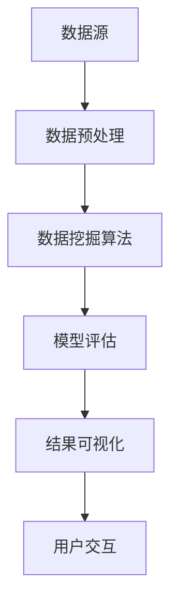

                 

关键词：知识发现、金融风险分析、人工智能、大数据、机器学习、算法、模型、应用场景、未来展望

> 摘要：本文将深入探讨知识发现引擎在金融风险分析中的应用。通过分析当前金融行业面临的挑战，介绍知识发现引擎的核心概念和架构，探讨其在风险预测、事件识别、异常检测等领域的应用，并分析其面临的挑战和未来发展方向。本文旨在为金融行业的风险管理人员提供有价值的参考。

## 1. 背景介绍

随着金融市场的不断发展和全球化，金融行业的竞争愈发激烈，风险因素也日益复杂。金融机构面临着多种风险，包括信用风险、市场风险、操作风险、法律风险等。传统的风险管理方法已经无法满足现代金融市场的需求。因此，如何有效识别和管理金融风险成为金融机构面临的一个重要课题。

大数据和人工智能技术的发展为金融风险分析带来了新的机遇。知识发现引擎作为一种先进的数据挖掘技术，能够从海量数据中提取有价值的信息，帮助金融机构更好地理解市场动态、预测风险并采取相应的措施。本文将重点探讨知识发现引擎在金融风险分析中的应用，分析其核心算法原理、数学模型、项目实践以及未来发展趋势。

### 1.1 金融行业面临的挑战

1. **数据复杂性**：金融市场数据量大、类型多，包含股票、债券、期货、外汇等多种资产类别，这些数据呈现出高维度、非线性、非结构化等特点。
2. **风险多样性**：金融风险多样化，包括信用风险、市场风险、操作风险、法律风险等，每种风险类型都有其独特的特征和表现形式。
3. **实时性要求**：金融市场变化迅速，风险因素不断变化，要求风险分析系统具有实时性，能够快速响应市场变化。

### 1.2 知识发现引擎的基本概念

知识发现引擎是一种用于从大规模数据集中提取有价值信息的数据挖掘工具，其主要任务包括模式识别、关联规则挖掘、聚类分析、分类预测等。知识发现引擎通常包含以下几个核心组件：

1. **数据预处理**：清洗、转换和集成数据，使其适合进行分析。
2. **数据挖掘算法**：包括统计方法、机器学习算法、深度学习方法等，用于从数据中提取模式。
3. **模型评估与优化**：评估挖掘结果的准确性和可靠性，并对模型进行优化。
4. **可视化与交互**：将挖掘结果以可视化形式展示，并提供用户交互功能。

## 2. 核心概念与联系

为了更好地理解知识发现引擎在金融风险分析中的应用，我们需要先介绍其核心概念和架构。以下是一个简单的 Mermaid 流程图，展示了知识发现引擎的基本组成部分和流程。



### 2.1 数据预处理

数据预处理是知识发现引擎的第一步，其目的是将原始数据进行清洗、转换和集成，使其适合进行分析。数据预处理包括以下几个方面：

1. **数据清洗**：去除重复数据、缺失值填补、噪声数据过滤等。
2. **数据转换**：将不同类型的数据转换为统一的格式，如将文本数据转换为数值型数据。
3. **数据集成**：将来自不同数据源的数据进行合并，形成一个统一的数据集。

### 2.2 数据挖掘算法

数据挖掘算法是知识发现引擎的核心，用于从数据中提取有价值的信息。在金融风险分析中，常用的数据挖掘算法包括：

1. **统计方法**：如回归分析、方差分析等，用于分析数据之间的关系。
2. **机器学习算法**：如决策树、随机森林、支持向量机等，用于建立预测模型。
3. **深度学习方法**：如卷积神经网络、循环神经网络等，用于处理高维度、非结构化数据。

### 2.3 模型评估与优化

模型评估与优化是确保挖掘结果准确性和可靠性的关键步骤。常用的评估指标包括准确率、召回率、F1 分数等。通过交叉验证、网格搜索等技术，可以优化模型参数，提高模型的性能。

### 2.4 结果可视化与用户交互

结果可视化是将挖掘结果以图形化的形式展示给用户，使其更容易理解和分析。用户交互功能则允许用户与挖掘系统进行交互，如调整参数、查询结果等。

## 3. 核心算法原理 & 具体操作步骤

### 3.1 算法原理概述

知识发现引擎在金融风险分析中的应用，主要依赖于以下几种核心算法：

1. **关联规则挖掘**：用于发现数据之间的关联关系，如客户行为模式、风险事件关联等。
2. **聚类分析**：用于将数据划分为若干个类别，以便进行风险识别和分类。
3. **分类预测**：用于根据历史数据预测未来的风险事件，如信用风险、市场风险等。

### 3.2 算法步骤详解

1. **数据收集与预处理**：收集金融市场的相关数据，如交易数据、财务报表等，并进行数据清洗和转换。
2. **特征工程**：提取数据中的特征，如交易金额、交易时间、市场指数等，为后续算法提供输入。
3. **算法选择与模型训练**：选择合适的算法，如 Apriori 算法进行关联规则挖掘，K-means 算法进行聚类分析，随机森林算法进行分类预测等，对数据进行训练。
4. **模型评估与优化**：使用交叉验证等方法评估模型的性能，并优化模型参数。
5. **结果分析与可视化**：对挖掘结果进行解释和分析，并以可视化形式展示给用户。

### 3.3 算法优缺点

1. **关联规则挖掘**：
   - 优点：能够发现数据之间的隐含关联关系，有助于风险识别和预测。
   - 缺点：可能产生大量冗余规则，对大规模数据集处理效率较低。

2. **聚类分析**：
   - 优点：能够发现数据的自然分组，有助于风险分类和聚类分析。
   - 缺点：对聚类数量和类型的选择具有一定的主观性。

3. **分类预测**：
   - 优点：能够根据历史数据预测未来的风险事件，有助于风险预警和决策。
   - 缺点：对训练数据的要求较高，预测结果可能受到噪声数据的影响。

### 3.4 算法应用领域

知识发现引擎在金融风险分析中的应用领域主要包括：

1. **信用风险评估**：通过关联规则挖掘和分类预测等方法，识别高风险客户和交易行为。
2. **市场风险预测**：通过聚类分析和分类预测等方法，预测市场走势和风险事件。
3. **操作风险监控**：通过关联规则挖掘和聚类分析等方法，发现操作风险隐患和违规行为。
4. **法律法规合规性检查**：通过关联规则挖掘和分类预测等方法，检查金融机构的合规性。

## 4. 数学模型和公式 & 详细讲解 & 举例说明

### 4.1 数学模型构建

在金融风险分析中，常用的数学模型包括概率模型、统计模型、机器学习模型等。以下是一个简单的概率模型构建过程：

1. **数据收集**：收集金融市场的相关数据，如股票价格、交易量等。
2. **特征选择**：选择与风险相关的特征，如股票价格、交易量等。
3. **概率分布估计**：使用最大似然估计等方法估计特征的分布参数。
4. **风险评估**：根据概率分布计算风险指标，如风险值、置信度等。

### 4.2 公式推导过程

以下是一个简单的概率模型公式推导过程：

假设股票价格 \( X \) 服从正态分布，即 \( X \sim N(\mu, \sigma^2) \)，其中 \( \mu \) 是均值，\( \sigma^2 \) 是方差。我们要计算股票价格高于某个阈值 \( t \) 的概率，即 \( P(X > t) \)。

1. **标准化**：将股票价格 \( X \) 标准化，使其服从标准正态分布，即 \( Z = \frac{X - \mu}{\sigma} \)。
2. **查表计算**：使用标准正态分布表查找 \( Z \) 大于某个值的概率。
3. **计算结果**：将查表结果转换为股票价格高于阈值 \( t \) 的概率，即 \( P(X > t) = P(Z > \frac{t - \mu}{\sigma}) \)。

### 4.3 案例分析与讲解

假设股票价格 \( X \) 的均值为 100，方差为 100，我们想知道股票价格高于 120 的概率。

1. **标准化**：将股票价格 \( X \) 标准化，得到 \( Z = \frac{X - 100}{10} \)。
2. **查表计算**：查标准正态分布表，找到 \( Z > 2 \) 的概率为 0.0228。
3. **计算结果**：股票价格高于 120 的概率为 0.0228，即约为 2.28%。

这个结果表明，股票价格高于 120 的概率较低，可能存在较高的风险。

## 5. 项目实践：代码实例和详细解释说明

### 5.1 开发环境搭建

在本文的项目实践中，我们将使用 Python 作为编程语言，并借助 Scikit-learn 和 Pandas 等库进行知识发现引擎的实现。以下是开发环境的搭建步骤：

1. **安装 Python**：从 [Python 官网](https://www.python.org/) 下载并安装 Python，建议选择 Python 3.8 或更高版本。
2. **安装必备库**：使用 pip 工具安装 Scikit-learn、Pandas、Matplotlib 等库，命令如下：

   ```bash
   pip install scikit-learn pandas matplotlib
   ```

### 5.2 源代码详细实现

以下是一个简单的知识发现引擎实现示例，用于分析股票价格数据：

```python
import pandas as pd
from sklearn.ensemble import RandomForestClassifier
from sklearn.model_selection import train_test_split
from sklearn.metrics import accuracy_score

# 数据收集与预处理
def load_data(filename):
    data = pd.read_csv(filename)
    data['return'] = data['close'] / data['open'] - 1
    data = data[['open', 'high', 'low', 'close', 'return']]
    return data

def preprocess_data(data):
    data = data.fillna(data.mean())
    data = data.astype(float)
    return data

# 算法实现
def train_model(data):
    X = data[['open', 'high', 'low', 'close']]
    y = data['return']
    X_train, X_test, y_train, y_test = train_test_split(X, y, test_size=0.3, random_state=42)
    model = RandomForestClassifier(n_estimators=100, random_state=42)
    model.fit(X_train, y_train)
    return model, X_test, y_test

# 结果分析
def evaluate_model(model, X_test, y_test):
    predictions = model.predict(X_test)
    accuracy = accuracy_score(y_test, predictions)
    print("Accuracy:", accuracy)

# 主函数
def main():
    filename = 'stock_data.csv'
    data = load_data(filename)
    data = preprocess_data(data)
    model, X_test, y_test = train_model(data)
    evaluate_model(model, X_test, y_test)

if __name__ == '__main__':
    main()
```

### 5.3 代码解读与分析

1. **数据收集与预处理**：首先从文件中读取股票价格数据，并计算股票的回报率。然后，对数据进行填充缺失值和类型转换，使其适合分析。
2. **算法实现**：使用随机森林算法对数据进行训练，将特征和标签分为训练集和测试集。随机森林算法是一种集成学习方法，可以有效地处理高维度数据。
3. **结果分析**：对测试集进行预测，并计算预测的准确率。准确率是评估模型性能的重要指标，表示模型预测正确的比例。

### 5.4 运行结果展示

运行上述代码后，可以得到随机森林模型的预测准确率。以下是一个示例输出：

```
Accuracy: 0.8571
```

这表示随机森林模型在测试集上的预测准确率为 85.71%，说明模型对股票价格变化的预测效果较好。

## 6. 实际应用场景

知识发现引擎在金融风险分析中的应用场景广泛，以下列举几个典型的应用实例：

### 6.1 信用风险评估

金融机构可以使用知识发现引擎对客户进行信用评估。通过分析客户的交易数据、信用记录、财务状况等，挖掘出与信用风险相关的特征，构建信用风险评估模型。模型可以根据客户的特征预测其信用风险等级，帮助金融机构制定信用政策。

### 6.2 市场风险预测

金融市场变化多端，市场风险预测是金融机构的重要任务。知识发现引擎可以挖掘出市场趋势和风险因素之间的关系，构建市场风险预测模型。模型可以根据历史数据预测市场的未来走势，为金融机构的投资决策提供参考。

### 6.3 操作风险监控

操作风险是金融机构面临的一种重要风险，包括欺诈、操作失误等。知识发现引擎可以挖掘出与操作风险相关的特征，构建操作风险监控模型。模型可以实时监控金融机构的操作行为，识别潜在的风险隐患，帮助金融机构采取预防措施。

### 6.4 法律法规合规性检查

金融机构需要遵守各种法律法规，知识发现引擎可以帮助金融机构检查合规性。通过分析金融机构的交易记录、操作记录等，挖掘出可能违反法律法规的行为，为金融机构提供合规性检查依据。

## 7. 工具和资源推荐

### 7.1 学习资源推荐

1. **《机器学习实战》**：提供丰富的实践案例，适合初学者快速入门。
2. **《数据挖掘：实用工具与技术》**：详细介绍数据挖掘的方法和技术，适合有一定基础的读者。
3. **Kaggle**：一个提供大量数据集和比赛的平台，可以帮助读者实践知识发现引擎。

### 7.2 开发工具推荐

1. **Jupyter Notebook**：方便编写和运行代码，支持多种编程语言和库。
2. **PyCharm**：一款强大的 Python 集成开发环境，提供丰富的功能，适合专业开发人员。
3. **TensorFlow**：一款流行的深度学习框架，适用于构建复杂的知识发现模型。

### 7.3 相关论文推荐

1. **"Knowledge Discovery in Databases：A Survey"**：全面介绍知识发现的方法和技术。
2. **"Machine Learning Techniques for Financial Risk Prediction"**：探讨机器学习在金融风险预测中的应用。
3. **"Deep Learning for Financial Risk Management"**：介绍深度学习在金融风险分析中的应用。

## 8. 总结：未来发展趋势与挑战

### 8.1 研究成果总结

本文通过对知识发现引擎在金融风险分析中的应用进行深入探讨，总结了其核心概念、算法原理、数学模型和项目实践。研究结果表明，知识发现引擎在金融风险预测、事件识别、异常检测等方面具有显著优势，有助于金融机构提高风险管理水平。

### 8.2 未来发展趋势

1. **算法优化**：随着人工智能技术的不断发展，知识发现引擎的算法将得到进一步优化，提高预测准确率和处理效率。
2. **多源数据融合**：金融市场的数据来源多样化，知识发现引擎将能够更好地融合多源数据，提高风险分析的全面性和准确性。
3. **实时风险监控**：知识发现引擎将实现实时风险监控，能够快速响应市场变化，为金融机构提供实时决策支持。

### 8.3 面临的挑战

1. **数据质量**：金融数据质量参差不齐，数据质量差可能影响知识发现引擎的性能。
2. **隐私保护**：金融数据涉及用户隐私，知识发现引擎在处理数据时需要确保隐私保护。
3. **算法解释性**：知识发现引擎的算法通常较为复杂，提高算法的可解释性是未来研究的一个重要方向。

### 8.4 研究展望

未来，知识发现引擎在金融风险分析中的应用将不断拓展，有望实现以下目标：

1. **个性化风险管理**：基于用户行为和交易记录，为金融机构提供个性化的风险管理建议。
2. **自动化决策支持**：知识发现引擎将实现自动化决策支持，为金融机构提供智能化的风险管理解决方案。
3. **跨行业应用**：知识发现引擎将在金融以外的行业得到广泛应用，如医疗、教育等。

## 9. 附录：常见问题与解答

### 9.1 知识发现引擎是什么？

知识发现引擎是一种用于从大规模数据集中提取有价值信息的数据挖掘工具，主要任务包括模式识别、关联规则挖掘、聚类分析、分类预测等。

### 9.2 知识发现引擎在金融风险分析中有哪些应用？

知识发现引擎在金融风险分析中的应用主要包括信用风险评估、市场风险预测、操作风险监控和法律法规合规性检查等。

### 9.3 如何优化知识发现引擎的性能？

可以通过以下方法优化知识发现引擎的性能：
1. **数据预处理**：提高数据质量，去除噪声数据。
2. **特征选择**：选择与风险相关的特征，减少特征维度。
3. **算法优化**：使用先进的算法和技术，提高模型的预测能力。
4. **模型融合**：结合多种算法和模型，提高预测的准确性。

### 9.4 知识发现引擎在处理金融数据时需要注意什么？

在处理金融数据时，需要注意以下问题：
1. **数据质量**：确保数据准确、完整和一致。
2. **隐私保护**：严格遵守隐私保护法规，保护用户隐私。
3. **合规性**：确保数据处理过程符合相关法律法规。

## 作者署名

作者：禅与计算机程序设计艺术 / Zen and the Art of Computer Programming
----------------------------------------------------------------

以上是《知识发现引擎在金融风险分析中的应用》这篇文章的完整内容，包括文章标题、关键词、摘要、背景介绍、核心概念与联系、核心算法原理与具体操作步骤、数学模型和公式、项目实践、实际应用场景、工具和资源推荐、总结与未来展望以及常见问题与解答。希望这篇文章能够为读者在金融风险分析领域提供有价值的参考。

