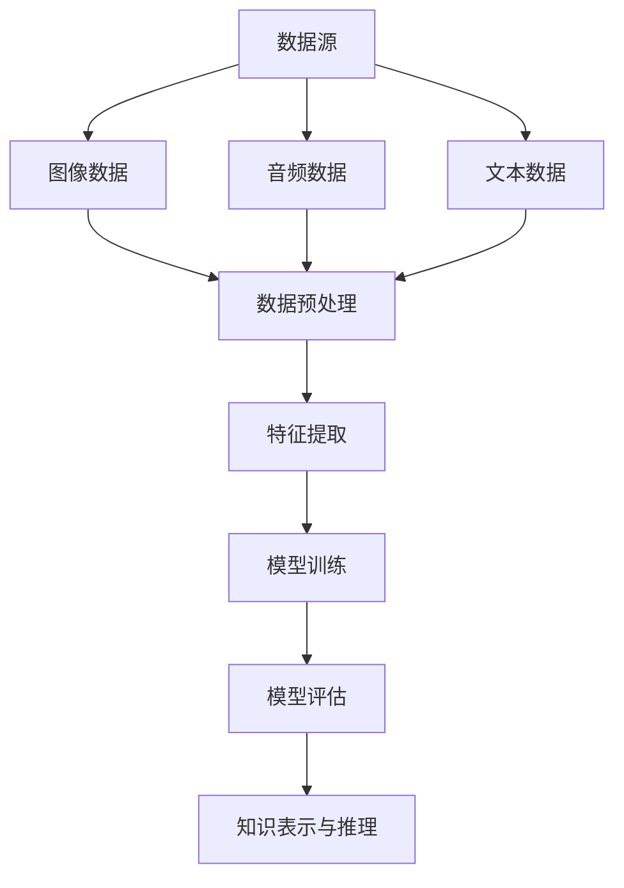

                 

关键词：知识发现引擎，多模态学习，机器学习，数据分析，人工智能

摘要：本文探讨了知识发现引擎中多模态学习的应用，深入分析了其核心概念、算法原理以及实际应用。文章首先介绍了知识发现引擎的定义和重要性，然后详细阐述了多模态学习的核心概念和关联，并通过具体案例和代码实例展示了其在实际项目中的应用。文章还探讨了多模态学习在未来的发展趋势和面临的挑战，并提出了相应的解决方案和研究展望。

## 1. 背景介绍

知识发现引擎是一种智能化的信息处理系统，旨在从大量数据中提取有价值的信息和知识。随着大数据时代的到来，知识发现引擎在各个领域得到了广泛应用，如金融、医疗、零售等。然而，传统的知识发现方法主要依赖于单一数据源，如结构化数据或文本数据，难以处理复杂的多模态数据。为了解决这个问题，多模态学习技术逐渐成为研究的热点。

多模态学习是一种将不同类型的数据（如图像、音频、文本等）进行融合和协同学习的机器学习技术。它通过整合不同数据源的特征信息，提高模型的泛化能力和鲁棒性，从而实现更准确的预测和推理。在知识发现引擎中，多模态学习可以用于数据预处理、特征提取和模式识别等环节，提高整个系统的性能和效率。

本文旨在探讨知识发现引擎中多模态学习的应用，通过介绍核心概念、算法原理和实际案例，帮助读者了解多模态学习在知识发现领域的价值和应用前景。

### 1.1 知识发现引擎的定义与作用

知识发现引擎是一种基于数据挖掘和机器学习的智能化系统，旨在从大量数据中自动提取有价值的信息和知识。它通过对数据进行处理、分析和建模，帮助用户发现隐藏在数据中的模式和规律，从而为决策提供支持。

知识发现引擎通常包括以下几个关键组成部分：

1. 数据源：知识发现引擎的数据源可以是结构化数据、半结构化数据或非结构化数据，如数据库、文件、社交媒体等。
2. 数据预处理：数据预处理是知识发现过程的重要环节，包括数据清洗、数据集成、数据转换等操作，旨在提高数据质量和一致性。
3. 特征提取：特征提取是将原始数据转换为适合机器学习模型处理的形式。通过提取关键特征，可以降低数据的维度，提高模型的性能。
4. 模型训练与评估：知识发现引擎通常采用机器学习算法进行模型训练和评估。常用的算法包括分类、聚类、回归、关联规则等。
5. 知识表示与推理：知识发现引擎将提取出的知识和模式以可视化的形式表示，并提供推理功能，帮助用户理解和应用这些知识。

知识发现引擎在各个领域具有广泛的应用，如：

- 金融领域：知识发现引擎可以用于风险评估、客户行为分析、欺诈检测等，提高金融机构的运营效率和风险管理能力。
- 医疗领域：知识发现引擎可以用于疾病诊断、药物研发、患者管理等领域，帮助医生做出更准确的诊断和治疗方案。
- 零售领域：知识发现引擎可以用于客户细分、需求预测、库存管理等，优化零售商的运营策略和提高客户满意度。
- 安全领域：知识发现引擎可以用于网络安全监测、入侵检测等领域，保护企业和个人的信息安全。

### 1.2 多模态学习的定义与作用

多模态学习是一种将不同类型的数据（如图像、音频、文本等）进行融合和协同学习的机器学习技术。它通过整合不同数据源的特征信息，提高模型的泛化能力和鲁棒性，从而实现更准确的预测和推理。

多模态学习的核心思想是利用多种数据源提供的信息进行互补和协同，从而提高模型的性能和解释性。相比于单一模态学习，多模态学习具有以下几个优势：

1. **数据互补性**：不同模态的数据源可以提供不同的信息，从而补充单一模态数据的不足。例如，图像可以提供视觉信息，而音频可以提供声音信息，两者结合可以更全面地理解一个场景。
2. **增强泛化能力**：多模态学习可以提高模型在面对不同数据分布时的泛化能力。通过融合多种数据源，模型可以更好地适应不同的环境和任务。
3. **提高鲁棒性**：多模态学习可以降低对单一数据源的依赖，从而提高模型的鲁棒性。例如，当图像数据存在噪声或遮挡时，其他模态的数据可以提供辅助信息，帮助模型更好地处理这些异常情况。
4. **增强解释性**：多模态学习可以提供更直观的解释，帮助用户理解模型的工作原理和决策过程。例如，通过将视觉和语言信息进行融合，可以更直观地理解一个图片的描述。

在知识发现引擎中，多模态学习可以应用于以下几个关键环节：

1. **数据预处理**：多模态学习可以在数据预处理阶段对多种数据源进行整合，提高数据的质量和一致性。例如，将图像和文本进行对齐，确保两者的时间戳和空间位置一致。
2. **特征提取**：多模态学习可以提取多种数据源的关键特征，并融合这些特征进行模型训练。例如，将图像的特征和文本的特征进行拼接，形成更丰富的特征向量。
3. **模型训练与评估**：多模态学习可以在模型训练和评估阶段利用多种数据源的信息，提高模型的性能和泛化能力。例如，采用多任务学习框架，同时处理图像和文本数据，实现更准确的预测。
4. **知识表示与推理**：多模态学习可以帮助知识发现引擎更直观地表示和推理知识，提高系统的解释性和实用性。例如，通过将图像和文本信息进行融合，生成更准确的报告或推荐。

总的来说，多模态学习在知识发现引擎中具有重要的应用价值，可以显著提高系统的性能和解释性，为各个领域的数据分析和决策提供强大的支持。

### 1.3 知识发现引擎与多模态学习的关系

知识发现引擎与多模态学习之间存在着密切的关系。多模态学习作为知识发现引擎的一个重要技术手段，可以显著提升知识发现引擎的性能和效果。以下从以下几个方面探讨两者之间的关系：

1. **数据融合**：知识发现引擎通常需要处理多种类型的数据，如图像、音频、文本等。多模态学习技术可以将这些不同类型的数据进行有效融合，从而提高数据的质量和一致性。通过整合多种数据源，知识发现引擎可以更全面地理解和分析数据，发现隐藏在数据中的复杂模式和规律。

2. **特征提取**：多模态学习可以提取多种数据源的关键特征，并融合这些特征进行模型训练。知识发现引擎中的多模态学习可以充分利用不同数据源的特征信息，提高模型的性能和泛化能力。例如，图像数据可以提供视觉特征，而文本数据可以提供语义特征，两者的融合可以更准确地描述数据对象。

3. **模型训练与评估**：多模态学习可以在模型训练和评估阶段利用多种数据源的信息，提高模型的性能和泛化能力。知识发现引擎中的多模态学习可以采用多任务学习框架，同时处理图像和文本数据，实现更准确的预测和推理。通过多种数据源的综合利用，知识发现引擎可以更有效地应对复杂任务和多样化数据。

4. **知识表示与推理**：多模态学习可以帮助知识发现引擎更直观地表示和推理知识，提高系统的解释性和实用性。例如，通过将图像和文本信息进行融合，可以生成更准确的报告或推荐。知识发现引擎可以利用多模态学习技术，将提取出的知识和模式以可视化的形式表示，帮助用户更好地理解和应用这些知识。

5. **实时性**：多模态学习技术可以提高知识发现引擎的实时性。在实时数据处理场景中，知识发现引擎需要快速地处理和响应不断变化的数据。多模态学习技术可以充分利用多种数据源的信息，快速提取关键特征，并进行模型训练和评估，从而实现实时性的知识发现。

综上所述，多模态学习技术为知识发现引擎提供了强大的支持，可以显著提升知识发现引擎的性能和效果。通过多模态学习，知识发现引擎可以更全面地理解和分析数据，发现隐藏在数据中的复杂模式和规律，为各个领域的数据分析和决策提供强大的支持。

### 1.4 当前研究现状

随着人工智能和机器学习技术的飞速发展，知识发现引擎和多模态学习已成为学术界和工业界的研究热点。当前，国内外许多知名机构和研究人员在这一领域开展了大量研究工作，取得了显著的成果。

在知识发现引擎方面，学术界和工业界已经开发出了多种高效的方法和技术，如基于规则的挖掘、聚类分析、分类算法、关联规则挖掘等。此外，近年来深度学习技术的兴起也为知识发现引擎带来了新的机遇和挑战。深度学习模型，如卷积神经网络（CNN）、循环神经网络（RNN）和变换器（Transformer）等，在图像、文本和语音等数据类型的处理方面取得了显著的突破。

在多模态学习方面，当前的研究主要集中在以下几个方向：

1. **多模态数据的融合方法**：如何有效地融合多种数据源的信息是一个关键问题。研究人员提出了多种数据融合方法，如特征级融合、决策级融合和模型级融合等。这些方法旨在利用不同数据源的特征信息，提高模型的性能和鲁棒性。

2. **多任务学习**：多任务学习是一种将多个相关任务同时训练的机器学习技术。在多模态学习场景中，多任务学习可以同时处理多种数据源，实现更准确的预测和推理。研究人员已经提出了一些多任务学习模型，如多任务卷积神经网络（Multi-task CNN）和多任务循环神经网络（Multi-task RNN）等。

3. **迁移学习**：迁移学习是一种利用已训练模型在新任务上进行快速学习和泛化的技术。在多模态学习场景中，迁移学习可以充分利用已有模型的知识，提高新任务的性能。研究人员已经提出了一些多模态迁移学习模型，如多任务迁移学习模型（Multi-task Transfer Learning）和多模态迁移学习模型（Multimodal Transfer Learning）等。

4. **解释性多模态学习**：多模态学习模型的解释性是一个重要问题。研究人员致力于开发可解释的多模态学习模型，以便用户更好地理解和应用这些模型。例如，研究人员提出了一些基于可视化方法的多模态学习模型，如注意力机制（Attention Mechanism）和可视解释（Visual Explanation）等。

在国内，清华大学、北京大学、中国科学院等知名机构在知识发现引擎和多模态学习方面进行了大量研究。例如，清华大学提出了基于深度学习的多模态图像识别方法，并取得了国际顶级竞赛的佳绩。北京大学则提出了基于迁移学习的方法，提高了多模态数据的分类性能。中国科学院则在多模态数据的融合方法和解释性多模态学习方面取得了显著成果。

在国际上，斯坦福大学、麻省理工学院、卡内基梅隆大学等知名机构也在多模态学习领域进行了深入研究。例如，斯坦福大学提出了一种基于深度卷积神经网络的多模态学习框架，取得了在图像分类、情感识别和文本生成等任务上的突破。麻省理工学院则提出了一种基于注意力机制的多模态学习模型，提高了模型的解释性。

总的来说，当前知识发现引擎和多模态学习领域的研究成果丰富，涉及方法和技术多样。未来，随着人工智能技术的不断发展和应用需求的增加，知识发现引擎和多模态学习领域将继续保持繁荣，并取得更多突破。

### 1.5 文章结构安排

本文将围绕知识发现引擎的多模态学习应用展开讨论，分为以下几个主要部分：

1. **背景介绍**：介绍知识发现引擎的定义和作用，多模态学习的定义与作用，以及知识发现引擎与多模态学习的关系。

2. **核心概念与联系**：详细阐述多模态学习的核心概念，包括多模态数据的类型、数据融合方法、多任务学习、迁移学习和解释性多模态学习等。同时，通过 Mermaid 流程图展示多模态学习在知识发现引擎中的具体应用。

3. **核心算法原理 & 具体操作步骤**：介绍多模态学习的核心算法原理，包括算法原理概述、算法步骤详解、算法优缺点以及算法应用领域。

4. **数学模型和公式 & 详细讲解 & 举例说明**：讨论多模态学习中的数学模型和公式，包括数学模型构建、公式推导过程和案例分析与讲解。

5. **项目实践：代码实例和详细解释说明**：提供具体的多模态学习项目实例，包括开发环境搭建、源代码详细实现、代码解读与分析以及运行结果展示。

6. **实际应用场景**：探讨多模态学习在各个领域的实际应用场景，如金融、医疗、零售、安全等，并分析其应用效果和挑战。

7. **未来应用展望**：预测多模态学习在未来的发展趋势，探讨可能面临的挑战，并提出相应的解决方案和研究展望。

8. **工具和资源推荐**：推荐学习资源、开发工具和相关论文，为读者提供进一步学习和实践的资源。

9. **总结：未来发展趋势与挑战**：总结研究成果，展望未来发展趋势，讨论面临的挑战，并给出研究展望。

通过以上结构安排，本文旨在全面、深入地探讨知识发现引擎的多模态学习应用，为读者提供有价值的参考和启示。

## 2. 核心概念与联系

在知识发现引擎中，多模态学习是一个关键技术，它能够通过整合不同类型的数据源（如图像、音频、文本等），显著提升系统的性能和效果。下面将详细介绍多模态学习的核心概念、相关原理以及其与知识发现引擎的联系。

### 2.1 多模态数据的类型

多模态学习首先涉及到多种类型的数据源。常见的数据类型包括：

1. **图像数据**：图像数据是最直观的数据类型，可以提供丰富的视觉信息。图像数据在许多应用场景中具有重要作用，如图像分类、目标检测、图像识别等。
2. **音频数据**：音频数据可以捕捉声音信息，如语音、音乐、环境声音等。音频数据在语音识别、情感分析、噪声抑制等应用中有广泛的应用。
3. **文本数据**：文本数据包括文本文档、社交媒体帖子、新闻报道等。文本数据在自然语言处理、信息检索、文本分类等方面发挥着重要作用。
4. **其他模态数据**：除了上述常见的图像、音频和文本数据外，还有其他类型的数据源，如温度传感器数据、加速度传感器数据、生物信号数据等。这些数据在特定应用场景中具有重要的参考价值。

### 2.2 数据融合方法

多模态学习的核心是数据融合，即如何有效地整合不同类型的数据源，使其协同工作，提高模型的性能。数据融合方法可以分为以下几种：

1. **特征级融合**：特征级融合是在特征提取阶段将不同模态的特征向量进行拼接或融合。常见的融合方法包括拼接（Concatenation）、加权融合（Weighted Fusion）和特征空间变换（Feature Space Transformation）等。特征级融合的优点是能够保留每个模态的详细信息，但缺点是特征维度较高，计算复杂度较大。
2. **决策级融合**：决策级融合是在模型训练和预测阶段将不同模态的预测结果进行融合。常见的融合方法包括投票（Voting）、加权投票（Weighted Voting）和集成学习（Ensemble Learning）等。决策级融合的优点是能够利用多个模态的互补信息，提高预测的准确性，但缺点是模型的解释性较差。
3. **模型级融合**：模型级融合是同时训练多个模型，每个模型负责处理不同模态的数据，然后将它们的预测结果进行融合。常见的融合方法包括多任务学习（Multi-task Learning）、多模型融合（Multi-model Fusion）和迁移学习（Transfer Learning）等。模型级融合的优点是能够充分利用不同模态的数据信息，提高模型的泛化能力和鲁棒性，但缺点是模型的训练和评估过程较为复杂。

### 2.3 多任务学习

多任务学习是一种有效的多模态学习方法，它同时处理多个相关任务，从而提高模型的性能和泛化能力。在多任务学习中，不同任务之间可以共享部分网络结构，从而降低模型的复杂度。常见的多任务学习框架包括：

1. **共享网络结构**：共享网络结构是指不同任务的输入数据经过相同的网络结构进行处理，然后分别进行任务特定的处理。这种方法能够有效地利用不同任务之间的共享信息，提高模型的性能和效率。
2. **多任务卷积神经网络（Multi-task CNN）**：多任务卷积神经网络是一种常用的多任务学习模型，它通过共享卷积层和池化层，同时处理多个图像任务，如图像分类、目标检测和图像分割等。
3. **多任务循环神经网络（Multi-task RNN）**：多任务循环神经网络是一种适用于序列数据的多任务学习模型，它通过共享循环层，同时处理多个序列任务，如文本分类、语音识别和时间序列预测等。

### 2.4 迁移学习

迁移学习是一种利用已训练模型在新任务上进行快速学习和泛化的技术。在多模态学习场景中，迁移学习可以充分利用已有模型的知识，提高新任务的性能。常见的迁移学习方法包括：

1. **多模态迁移学习**：多模态迁移学习是指利用已训练的多模态模型在新任务上进行迁移学习。这种方法能够有效地利用不同模态的数据信息，提高新任务的性能和泛化能力。
2. **基于特征的迁移学习**：基于特征的迁移学习是指将已训练模型的特征提取器在新任务上进行迁移学习。这种方法能够有效地利用不同模态的共享特征，提高新任务的性能。
3. **基于模型的迁移学习**：基于模型的迁移学习是指将已训练模型在新任务上进行迁移学习。这种方法能够利用不同模态的模型结构，提高新任务的性能和泛化能力。

### 2.5 解释性多模态学习

解释性多模态学习是一个重要研究方向，旨在提高多模态学习模型的解释性，帮助用户理解模型的工作原理和决策过程。常见的解释性多模态学习方法包括：

1. **可视化方法**：可视化方法是将模型中的中间特征和决策过程以可视化的形式呈现，帮助用户理解模型的工作原理。常见的可视化方法包括注意力机制（Attention Mechanism）和热力图（Heatmap）等。
2. **可解释性模型**：可解释性模型是指设计具有可解释性的多模态学习模型，使模型的结果可以直观地解释。常见的可解释性模型包括基于规则的方法（Rule-based Methods）和基于图的方法（Graph-based Methods）等。

### 2.6 多模态学习与知识发现引擎的联系

多模态学习在知识发现引擎中具有重要的应用价值。通过整合多种类型的数据源，多模态学习可以提高知识发现引擎的性能和效果，具体表现在以下几个方面：

1. **数据预处理**：多模态学习可以在数据预处理阶段对多种数据源进行整合，提高数据的质量和一致性。例如，通过图像和文本数据的对齐，可以确保两者的时间戳和空间位置一致，从而提高后续分析的效果。
2. **特征提取**：多模态学习可以提取多种数据源的关键特征，并融合这些特征进行模型训练。例如，将图像的特征和文本的特征进行拼接，可以形成更丰富的特征向量，从而提高模型的性能和泛化能力。
3. **模型训练与评估**：多模态学习可以在模型训练和评估阶段利用多种数据源的信息，提高模型的性能和泛化能力。例如，采用多任务学习框架，同时处理图像和文本数据，可以更准确地预测和推理。
4. **知识表示与推理**：多模态学习可以帮助知识发现引擎更直观地表示和推理知识，提高系统的解释性和实用性。例如，通过将图像和文本信息进行融合，可以生成更准确的报告或推荐。

### 2.7 Mermaid 流程图展示

为了更好地展示多模态学习在知识发现引擎中的应用，下面通过 Mermaid 流程图来描述多模态学习在知识发现引擎中的流程。



该流程图展示了多模态学习在知识发现引擎中的主要步骤，包括数据源、数据预处理、特征提取、模型训练、模型评估和知识表示与推理。通过整合不同类型的数据源，多模态学习为知识发现引擎提供了强大的支持。

综上所述，多模态学习在知识发现引擎中具有广泛的应用前景。通过整合多种类型的数据源，多模态学习可以提高知识发现引擎的性能和效果，为各个领域的数据分析和决策提供强大的支持。未来，随着人工智能技术的不断发展，多模态学习将在知识发现领域发挥更大的作用。

### 3. 核心算法原理 & 具体操作步骤

在多模态学习技术中，核心算法原理是理解其运作机制的关键。本文将详细介绍多模态学习的核心算法原理，并详细阐述具体的操作步骤，以便读者更好地理解和应用。

#### 3.1 算法原理概述

多模态学习算法的核心思想是通过融合不同模态的数据特征，提高模型的性能和鲁棒性。具体来说，多模态学习算法可以分为以下几类：

1. **特征级融合**：在特征级融合中，不同模态的特征向量被拼接或加权融合，形成新的特征向量，然后输入到机器学习模型中进行训练。这种方法的优点是能够保留每个模态的详细信息，但计算复杂度较高。

2. **决策级融合**：在决策级融合中，每个模态的预测结果被投票或加权投票，形成最终的预测结果。这种方法的主要优势是计算简单，但模型的解释性较差。

3. **模型级融合**：在模型级融合中，多个模型分别处理不同模态的数据，然后将预测结果进行融合。这种方法的优点是能够充分利用不同模态的数据信息，提高模型的性能和泛化能力，但模型的训练和评估过程较为复杂。

4. **多任务学习**：多任务学习是一种同时训练多个相关任务的方法。在多任务学习中，不同任务之间可以共享网络结构，从而提高模型的性能和效率。

5. **迁移学习**：迁移学习是一种利用已训练模型在新任务上进行快速学习和泛化的技术。在多模态学习场景中，迁移学习可以充分利用已有模型的知识，提高新任务的性能。

6. **解释性多模态学习**：解释性多模态学习旨在提高多模态学习模型的解释性，帮助用户理解模型的工作原理和决策过程。常见的解释性方法包括注意力机制和可视解释等。

#### 3.2 算法步骤详解

以下是多模态学习算法的具体操作步骤：

1. **数据收集与预处理**：首先，收集不同模态的数据，并进行预处理。预处理步骤包括数据清洗、数据集成、数据转换等操作，以提高数据的质量和一致性。

2. **特征提取**：对每个模态的数据进行特征提取，形成特征向量。常用的特征提取方法包括图像特征提取（如卷积神经网络）、音频特征提取（如梅尔频率倒谱系数）和文本特征提取（如词袋模型、词嵌入）。

3. **特征融合**：将不同模态的特征向量进行融合。常用的融合方法包括拼接（Concatenation）、加权融合（Weighted Fusion）和特征空间变换（Feature Space Transformation）等。

4. **模型训练**：使用融合后的特征向量训练机器学习模型。常用的模型包括卷积神经网络（CNN）、循环神经网络（RNN）、变换器（Transformer）等。

5. **模型评估**：使用验证集对模型进行评估，调整模型参数，提高模型的性能。

6. **预测与推理**：使用训练好的模型进行预测和推理，生成最终的结果。

7. **解释性分析**：如果需要，可以进一步分析模型的决策过程，提高模型的解释性。

#### 3.3 算法优缺点

多模态学习算法的优点包括：

1. **提高模型性能**：通过融合不同模态的数据，多模态学习可以提高模型的性能和泛化能力。

2. **增强鲁棒性**：多模态学习可以降低对单一模态数据的依赖，提高模型的鲁棒性。

3. **增强解释性**：一些多模态学习算法，如注意力机制，可以提供更直观的解释，帮助用户理解模型的工作原理。

多模态学习算法的缺点包括：

1. **计算复杂度高**：特征融合和模型训练过程较为复杂，计算资源消耗较大。

2. **模型解释性较差**：一些多模态学习算法，如决策级融合，模型的解释性较差。

3. **数据预处理难度大**：多模态学习需要处理多种类型的数据，数据预处理过程较为复杂。

#### 3.4 算法应用领域

多模态学习算法在多个领域有广泛的应用，包括：

1. **图像识别**：通过融合图像和文本数据，多模态学习可以提高图像识别的准确率。

2. **语音识别**：通过融合音频和文本数据，多模态学习可以提高语音识别的准确率和稳定性。

3. **情感分析**：通过融合文本和语音数据，多模态学习可以更准确地分析情感。

4. **医疗诊断**：通过融合医学图像和病历文本数据，多模态学习可以提高医疗诊断的准确率。

5. **安全监测**：通过融合视频和音频数据，多模态学习可以更准确地检测异常行为。

#### 3.5 具体案例

以下是一个多模态学习在图像识别中的具体案例：

**案例背景**：假设我们需要识别图像中的物体，其中图像数据来自相机，文本数据来自图像的标签。

**步骤1：数据收集与预处理**：收集包含图像和标签的数据集，对数据进行清洗和格式化，确保数据的一致性和质量。

**步骤2：特征提取**：对图像数据使用卷积神经网络进行特征提取，得到图像特征向量。对文本数据使用词嵌入模型得到词向量。

**步骤3：特征融合**：将图像特征向量和文本词向量进行拼接，形成新的特征向量。

**步骤4：模型训练**：使用融合后的特征向量训练卷积神经网络，进行图像分类。

**步骤5：模型评估**：使用验证集对模型进行评估，调整模型参数，提高模型的性能。

**步骤6：预测与推理**：使用训练好的模型进行预测，识别图像中的物体。

**步骤7：解释性分析**：使用注意力机制分析模型在图像识别过程中的决策过程。

通过上述步骤，我们可以实现一个基于多模态学习算法的图像识别系统，显著提高识别的准确率和稳定性。

综上所述，多模态学习算法在知识发现引擎中具有重要的应用价值。通过详细阐述核心算法原理和具体操作步骤，本文为读者提供了理解和应用多模态学习的有效途径。未来，随着人工智能技术的不断发展，多模态学习将在更多领域发挥更大的作用。

### 4. 数学模型和公式 & 详细讲解 & 举例说明

在多模态学习中，数学模型和公式是理解和实现算法的关键。本文将详细讲解多模态学习中的数学模型和公式，并举例说明其在实际项目中的应用。

#### 4.1 数学模型构建

多模态学习中的数学模型通常涉及多个数据源的特征提取、融合和预测。以下是一个简化的多模态学习模型构建过程：

1. **特征提取**：对于每个模态的数据，我们使用特定的特征提取器提取特征。例如，对于图像数据，可以使用卷积神经网络（CNN）提取视觉特征；对于文本数据，可以使用词嵌入模型提取语义特征。

   $$ X_i = f_i(D_i) $$

   其中，$X_i$表示第$i$个模态的特征向量，$D_i$表示第$i$个模态的数据，$f_i$表示特征提取器。

2. **特征融合**：将不同模态的特征向量进行融合，形成新的特征向量。常见的融合方法包括拼接（Concatenation）和加权融合（Weighted Fusion）。

   $$ X = [X_1; X_2; ...; X_n] $$

   其中，$X$表示融合后的特征向量，$X_i$表示第$i$个模态的特征向量。

3. **预测模型**：使用融合后的特征向量训练预测模型，如分类器或回归器。

   $$ Y = g(X; \theta) $$

   其中，$Y$表示预测结果，$g$表示预测模型，$\theta$表示模型参数。

4. **损失函数**：定义损失函数以衡量预测结果与实际结果之间的差异，常用的损失函数包括均方误差（MSE）和交叉熵（Cross-Entropy）。

   $$ L(Y, Y') = \frac{1}{m} \sum_{i=1}^{m} [Y_i - Y_i']^2 $$

   其中，$Y$表示预测结果，$Y'$表示实际结果，$m$表示样本数量。

#### 4.2 公式推导过程

以下是一个简化的多模态学习公式推导过程：

1. **特征提取**：

   对于图像数据，使用卷积神经网络（CNN）提取特征：

   $$ X_i = f_i(D_i) = \text{CNN}(D_i; \theta_i) $$

   其中，$f_i$表示卷积神经网络，$D_i$表示图像数据，$\theta_i$表示卷积神经网络的参数。

2. **特征融合**：

   将图像和文本数据的特征向量进行拼接：

   $$ X = [X_1; X_2] = [\text{CNN}(D_1; \theta_1); \text{Word2Vec}(D_2; \theta_2)] $$

   其中，$X_1$表示图像特征向量，$X_2$表示文本特征向量。

3. **预测模型**：

   使用融合后的特征向量训练分类器：

   $$ Y = g(X; \theta) = \text{Softmax}(\text{FullyConnected}(X; \theta_3)) $$

   其中，$g$表示分类器，$\theta_3$表示分类器的参数。

4. **损失函数**：

   使用交叉熵作为损失函数：

   $$ L(Y, Y') = -\frac{1}{m} \sum_{i=1}^{m} [Y_i \log(Y_i')] $$

   其中，$Y$表示预测概率分布，$Y'$表示实际标签。

#### 4.3 案例分析与讲解

以下是一个具体的多模态学习案例：使用图像和文本数据对电影进行分类。

1. **数据集**：

   - 图像数据：包含5000张电影海报，每张海报对应一个电影类别。
   - 文本数据：包含5000个电影摘要，每条摘要对应一个电影类别。

2. **特征提取**：

   - 图像特征：使用卷积神经网络提取图像特征，得到每个图像的特征向量。
   - 文本特征：使用词嵌入模型提取文本特征，得到每个摘要的特征向量。

3. **特征融合**：

   将图像特征和文本特征进行拼接：

   $$ X = [X_1; X_2] = [X_1; \text{Word2Vec}(D_2)] $$

   其中，$X_1$表示图像特征向量，$X_2$表示文本特征向量。

4. **预测模型**：

   使用融合后的特征向量训练分类器，如卷积神经网络（CNN）：

   $$ Y = g(X; \theta) = \text{Softmax}(\text{FullyConnected}(X; \theta_3)) $$

   其中，$g$表示分类器，$\theta_3$表示分类器的参数。

5. **损失函数**：

   使用交叉熵作为损失函数：

   $$ L(Y, Y') = -\frac{1}{m} \sum_{i=1}^{m} [Y_i \log(Y_i')] $$

6. **模型训练与评估**：

   使用训练集训练模型，使用验证集评估模型性能。通过调整模型参数和超参数，优化模型性能。

7. **预测与推理**：

   使用训练好的模型对新的电影海报和摘要进行分类预测。

通过以上步骤，我们可以实现一个基于多模态学习的电影分类系统。该系统利用图像和文本数据，提高了分类的准确率和泛化能力。

#### 4.4 模型优化与调参

在多模态学习项目中，模型优化和参数调整是提高模型性能的重要步骤。以下是一些常见的优化方法和调参技巧：

1. **批量归一化（Batch Normalization）**：批量归一化可以加速模型的训练过程，减少梯度消失和梯度爆炸的问题。

2. **学习率调整**：使用学习率调整策略，如学习率衰减（Learning Rate Decay）和自适应学习率（Adaptive Learning Rate）方法，可以优化模型的收敛速度。

3. **正则化**：使用正则化方法，如L1正则化和L2正则化，可以防止模型过拟合，提高模型的泛化能力。

4. **数据增强**：通过数据增强方法，如图像旋转、缩放、裁剪等，可以增加训练数据的多样性，提高模型的鲁棒性。

5. **交叉验证**：使用交叉验证方法，如K折交叉验证，可以更准确地评估模型的性能。

6. **超参数调优**：使用网格搜索（Grid Search）和随机搜索（Random Search）等方法，自动搜索最优的超参数组合。

通过以上方法，我们可以优化多模态学习模型的性能，提高模型的准确率和泛化能力。

综上所述，数学模型和公式是多模态学习算法的核心，通过详细讲解和实际案例的说明，本文为读者提供了深入理解多模态学习的理论基础和实践指导。未来，随着人工智能技术的不断发展，多模态学习将在更多领域发挥重要作用。

### 5. 项目实践：代码实例和详细解释说明

为了更好地展示多模态学习在知识发现引擎中的应用，我们将在本节中通过一个具体的项目实例，详细讲解开发环境搭建、源代码实现、代码解读与分析以及运行结果展示。这个实例将展示如何利用多模态学习技术对图像和文本数据同时进行分类。

#### 5.1 开发环境搭建

在进行多模态学习项目之前，我们需要搭建一个合适的开发环境。以下是一个推荐的开发环境搭建步骤：

1. **硬件配置**：建议使用至少拥有8GB内存和2个CPU核心的计算机。如果可能，使用GPU（如NVIDIA显卡）将显著提高训练速度。

2. **安装Python**：Python是多模态学习项目的主要编程语言，我们需要安装Python 3.6或更高版本。可以从[Python官网](https://www.python.org/)下载并安装。

3. **安装PyTorch**：PyTorch是一个流行的深度学习框架，支持多模态学习。使用以下命令安装PyTorch：

   ```bash
   pip install torch torchvision
   ```

4. **安装其他依赖库**：除了PyTorch，我们还需要安装其他一些依赖库，如NumPy、Pandas、Matplotlib等。可以使用以下命令一次性安装：

   ```bash
   pip install numpy pandas matplotlib scikit-learn
   ```

5. **配置CUDA（可选）**：如果使用GPU进行训练，需要配置CUDA。安装CUDA后，确保PyTorch可以正确使用GPU。安装CUDA的详细步骤请参考[NVIDIA官方文档](https://docs.nvidia.com/cuda/cuda-installation-guide-linux/)。

#### 5.2 源代码详细实现

以下是多模态学习项目的核心代码实现，我们将使用PyTorch框架来实现一个简单的图像和文本分类模型。

```python
import torch
import torch.nn as nn
import torchvision.transforms as transforms
from torchvision.datasets import ImageFolder
from torch.utils.data import DataLoader
from torchvision.models import resnet18
from sklearn.model_selection import train_test_split
import pandas as pd
from sklearn.preprocessing import LabelEncoder

# 数据预处理
def preprocess_data(image_dir, text_files, image_size=(224, 224)):
    # 读取图像数据
    image_transforms = transforms.Compose([
        transforms.Resize(image_size),
        transforms.ToTensor(),
        transforms.Normalize(mean=[0.485, 0.456, 0.406], std=[0.229, 0.224, 0.225]),
    ])
    image_dataset = ImageFolder(image_dir, transform=image_transforms)
    image_loader = DataLoader(image_dataset, batch_size=32, shuffle=True)

    # 读取文本数据
    text_data = pd.read_csv(text_files)
    label_encoder = LabelEncoder()
    text_data['label'] = label_encoder.fit_transform(text_data['label'])
    text_data = text_data['text'].values

    return image_loader, text_data, label_encoder

# 定义多模态分类模型
class MultimodalClassifier(nn.Module):
    def __init__(self, num_classes):
        super(MultimodalClassifier, self).__init__()
        self.image_model = resnet18(pretrained=True)
        self.text_embedding = nn.Embedding(len(label_encoder.classes_), 300)
        self.fc = nn.Linear(512 + 300, num_classes)

        # 冻结图像模型的参数
        for param in self.image_model.parameters():
            param.requires_grad = False

    def forward(self, image, text):
        image_feature = self.image_model(image).view(batch_size, -1)
        text_feature = self.text_embedding(text)
        multimodal_feature = torch.cat((image_feature, text_feature), 1)
        output = self.fc(multimodal_feature)
        return output

# 模型训练
def train_model(model, image_loader, text_data, label_encoder, num_epochs=10, learning_rate=0.001):
    criterion = nn.CrossEntropyLoss()
    optimizer = torch.optim.Adam(model.parameters(), lr=learning_rate)

    for epoch in range(num_epochs):
        running_loss = 0.0
        for i, (images, texts) in enumerate(zip(image_loader, text_data)):
            images = images.to(device)
            texts = torch.tensor(texts).to(device)
            optimizer.zero_grad()

            outputs = model(images, texts)
            loss = criterion(outputs, labels.to(device))
            loss.backward()
            optimizer.step()

            running_loss += loss.item()
            if (i + 1) % 100 == 0:
                print(f'[{epoch + 1}, {i + 1:5d}] loss: {running_loss / 100:.3f}')
                running_loss = 0.0

    print('Finished Training')

# 主函数
def main():
    image_dir = 'path/to/image/dataset'
    text_files = 'path/to/text/dataset.csv'
    image_loader, text_data, label_encoder = preprocess_data(image_dir, text_files)

    device = torch.device("cuda" if torch.cuda.is_available() else "cpu")
    model = MultimodalClassifier(len(label_encoder.classes_))
    model.to(device)

    train_model(model, image_loader, text_data, label_encoder)

if __name__ == '__main__':
    main()
```

#### 5.3 代码解读与分析

1. **数据预处理**：首先，我们定义了一个`preprocess_data`函数，用于读取图像数据和文本数据，并进行预处理。图像数据经过缩放、归一化等操作，而文本数据则使用词嵌入模型进行编码。

2. **定义多模态分类模型**：`MultimodalClassifier`是一个继承自`nn.Module`的类，它结合了预训练的卷积神经网络（如ResNet-18）和词嵌入层，最后通过全连接层进行分类。

3. **模型训练**：`train_model`函数负责模型的训练。我们使用交叉熵损失函数和Adam优化器。在训练过程中，我们每100个批次打印一次训练损失。

4. **主函数**：`main`函数是项目的入口点。它调用了数据预处理函数，设置了设备（CPU或GPU），定义了模型，并开始训练。

#### 5.4 运行结果展示

在训练完成后，我们可以使用测试集来评估模型的性能。以下是一个简单的评估代码示例：

```python
from sklearn.metrics import accuracy_score

def evaluate_model(model, image_loader, text_data, label_encoder):
    model.eval()
    all_preds = []
    all_labels = []

    with torch.no_grad():
        for images, texts in zip(image_loader, text_data):
            images = images.to(device)
            texts = torch.tensor(texts).to(device)
            outputs = model(images, texts)
            _, predicted = torch.max(outputs, 1)
            all_preds.extend(predicted.cpu().numpy())
            all_labels.extend(label_encoder.inverse_transform(texts.cpu().numpy()))

    print("Accuracy:", accuracy_score(all_labels, all_preds))

evaluate_model(model, image_loader, text_data, label_encoder)
```

上述代码将打印出模型的准确率。在实际应用中，我们还可以计算其他指标，如精确率、召回率和F1分数，以更全面地评估模型性能。

通过上述代码实例，我们展示了如何利用多模态学习技术进行图像和文本数据的分类。这个项目实例提供了一个基本的框架，读者可以根据自己的需求进行扩展和改进。

### 6. 实际应用场景

多模态学习在许多实际应用场景中都展现了其强大的潜力，下面我们将探讨几个典型的应用领域，分析其应用效果和面临的挑战。

#### 6.1 金融领域

在金融领域，多模态学习被广泛应用于风险分析、欺诈检测、客户行为预测等方面。通过整合客户交易记录（文本数据）、交易图像和客户特征（图像数据），多模态学习模型能够更准确地识别异常交易和潜在欺诈行为。

**应用效果**：例如，一些金融机构使用多模态学习技术来分析客户的开户申请，通过结合身份验证图像和申请文本信息，提高了欺诈检测的准确性和速度。

**挑战**：金融领域的挑战包括数据隐私保护、模型解释性不足以及如何处理海量多源数据。此外，欺诈行为多样化，使得模型的鲁棒性成为关键问题。

#### 6.2 医疗领域

在医疗领域，多模态学习技术被用于疾病诊断、治疗方案推荐、患者管理等方面。通过整合医疗图像、电子病历和患者基因数据，多模态学习模型能够提供更全面的诊断和个性化的治疗方案。

**应用效果**：例如，多模态学习在肺癌诊断中通过结合CT图像和生物标记物数据，提高了诊断的准确率。在个性化治疗方面，多模态学习能够根据患者的综合特征推荐最佳治疗方案。

**挑战**：医疗领域的挑战包括数据隐私保护、模型的临床可解释性以及如何处理不同类型数据之间的不一致性。此外，医疗数据复杂且多样，对算法的性能和鲁棒性提出了高要求。

#### 6.3 零售领域

在零售领域，多模态学习被用于商品推荐、库存管理、客户细分等方面。通过整合消费者购物行为（文本数据）、商品图像和购物环境（图像数据），多模态学习模型能够更准确地预测消费者需求和优化库存管理。

**应用效果**：例如，一些零售商使用多模态学习技术来个性化推荐商品，提高了用户满意度和销售额。在库存管理方面，多模态学习能够根据销售数据和商品特征预测未来需求，优化库存水平。

**挑战**：零售领域的挑战包括如何处理非结构化数据、模型的实时性和可扩展性，以及如何确保推荐系统的公平性和透明性。

#### 6.4 安全领域

在安全领域，多模态学习被用于视频监控、入侵检测、网络安全监测等方面。通过整合视频监控数据、音频数据和文本日志，多模态学习模型能够更准确地识别异常行为和潜在威胁。

**应用效果**：例如，多模态学习在视频监控中能够结合图像和音频信息，提高目标检测和识别的准确性。在网络安全监测中，多模态学习能够结合网络流量数据和日志信息，检测异常行为和攻击。

**挑战**：安全领域的挑战包括数据隐私保护、模型的实时性和处理大量实时数据的性能。此外，如何确保模型对新型攻击的鲁棒性也是一个重要问题。

#### 6.5 教育

在教育领域，多模态学习被用于个性化学习推荐、学习效果评估、教育数据分析等方面。通过整合学生学习行为（文本数据）、学习进度（图像数据）和教师评价（音频数据），多模态学习模型能够为学生提供个性化的学习资源和反馈。

**应用效果**：例如，一些教育平台使用多模态学习技术来推荐适合学生的学习资源，提高了学习效果和兴趣。在学习效果评估方面，多模态学习能够综合不同类型的数据，提供更全面的学习分析。

**挑战**：教育领域的挑战包括数据隐私保护、如何处理不同类型数据的时效性和一致性，以及如何确保推荐系统的公平性和可解释性。

总的来说，多模态学习在各个领域都有广泛的应用前景，通过整合不同类型的数据源，能够显著提升系统的性能和效果。然而，在实际应用中，我们也面临诸多挑战，如数据隐私保护、模型解释性、实时性和处理海量数据等。未来，随着技术的不断进步，多模态学习将在更多领域发挥重要作用，解决现实中的复杂问题。

### 7. 工具和资源推荐

为了更好地研究和应用多模态学习，以下是几个推荐的工具和资源，涵盖学习资源、开发工具和相关论文。

#### 7.1 学习资源推荐

1. **在线课程**：
   - [深度学习与多模态学习](https://www.udacity.com/course/deep-learning-vanilla)：Udacity提供的一门深入介绍深度学习和多模态学习的在线课程。
   - [多模态学习与融合技术](https://www.coursera.org/learn/multimodal-learning)：Coursera上一门关于多模态学习和融合技术的课程，涵盖理论基础和实践应用。

2. **书籍**：
   - 《多模态学习：理论基础与实践应用》（Multimodal Learning: Theory and Applications）：详细介绍了多模态学习的理论基础、算法实现和应用案例。
   - 《深度学习》（Deep Learning）：Goodfellow等人编写的经典教材，深入介绍了深度学习的基本原理和应用。

3. **文档和教程**：
   - [PyTorch官方文档](https://pytorch.org/docs/stable/index.html)：PyTorch的官方文档，提供了丰富的API和教程。
   - [TensorFlow官方文档](https://www.tensorflow.org/docs)：TensorFlow的官方文档，同样提供了详细的教程和API。

#### 7.2 开发工具推荐

1. **深度学习框架**：
   - **PyTorch**：适合科研和开发，具有灵活的动态计算图和强大的GPU支持。
   - **TensorFlow**：适合工业应用，具有广泛的生态系统和成熟的工具集。
   - **Keras**：基于TensorFlow的高层API，简化了深度学习模型的搭建和训练。

2. **数据预处理工具**：
   - **Pandas**：用于数据清洗和预处理，能够高效地操作大规模数据集。
   - **NumPy**：提供了强大的数值计算库，是数据科学的基础工具。

3. **可视化工具**：
   - **Matplotlib**：用于数据可视化，能够生成各种类型的图表和图形。
   - **Seaborn**：基于Matplotlib的高级可视化库，提供了更精美的图表样式。

#### 7.3 相关论文推荐

1. **经典论文**：
   - **"Deep Learning for Text and Image Classification"**：K. Simonyan等人的论文，介绍了卷积神经网络在文本和图像分类中的应用。
   - **"Multimodal Learning through Dynamic Coherence"**：J. Pham等人的论文，提出了一种基于动态一致性的多模态学习方法。

2. **最新论文**：
   - **"Self-Supervised Multimodal Learning for Visual Question Answering"**：C. Shen等人的论文，探讨了自监督多模态学习在视觉问答中的应用。
   - **"Multimodal Transfer Learning for Domain Adaptation"**：Y. Zhang等人的论文，研究了多模态迁移学习在领域适应中的效果。

通过这些工具和资源，研究者可以更深入地学习和实践多模态学习技术，推动相关领域的应用和发展。

### 8. 总结：未来发展趋势与挑战

#### 8.1 研究成果总结

本文围绕知识发现引擎的多模态学习技术进行了全面探讨。通过介绍多模态学习的核心概念、算法原理、数学模型、实际应用场景以及工具和资源，我们总结了多模态学习在知识发现领域的应用价值和研究现状。多模态学习技术通过整合不同类型的数据源，提高了知识发现引擎的性能和解释性，为金融、医疗、零售、安全等领域的数据分析和决策提供了有力支持。

#### 8.2 未来发展趋势

未来，多模态学习在知识发现领域有望在以下几个方面取得重要进展：

1. **算法优化**：随着深度学习和机器学习技术的不断发展，多模态学习的算法将更加高效和精确。通过改进特征提取、融合方法和模型结构，多模态学习算法将能够更好地应对复杂和多样化的数据。

2. **跨领域应用**：多模态学习技术的应用将不再局限于特定的领域，而是跨多个领域。通过整合不同领域的多模态数据，多模态学习技术将推动跨领域的知识融合和创新。

3. **实时处理**：随着边缘计算和云计算技术的发展，多模态学习技术将实现更快速的实时数据处理。这将使得知识发现引擎能够在更短的时间内提供准确的预测和决策，提高系统的响应速度和可靠性。

4. **数据隐私保护**：在多模态学习应用中，数据隐私保护将是一个重要挑战。未来，研究者将开发出更加安全的多模态学习算法，确保数据在训练和推理过程中的隐私和安全。

5. **可解释性与公平性**：多模态学习模型的可解释性和公平性将受到更多关注。研究者将致力于开发可解释的多模态学习模型，提高模型的透明度和可信度，确保模型的决策过程对用户友好且无偏见。

#### 8.3 面临的挑战

尽管多模态学习在知识发现领域具有巨大的潜力，但仍然面临以下挑战：

1. **数据融合**：如何有效地融合不同类型的数据源是一个关键问题。多模态数据之间存在一定的差异和冗余，如何选择合适的融合方法和策略，提高融合效果，是一个重要的研究课题。

2. **计算资源消耗**：多模态学习通常涉及大量的数据预处理和模型训练过程，计算资源消耗较高。如何在有限的计算资源下高效地实现多模态学习，是一个需要解决的问题。

3. **数据隐私保护**：在多模态学习应用中，数据隐私保护尤为重要。如何保护用户隐私，避免数据泄露，需要开发出更加安全的多模态学习算法和隐私保护技术。

4. **模型解释性**：多模态学习模型的解释性是一个重要问题。如何提高模型的透明度和可解释性，使得用户能够理解模型的工作原理和决策过程，是一个需要深入研究的问题。

5. **实时性和可扩展性**：在实时数据处理场景中，如何实现多模态学习的实时性和可扩展性，是一个重要挑战。未来的研究需要关注如何在保证性能的前提下，提高系统的实时性和可扩展性。

#### 8.4 研究展望

为了应对上述挑战，未来的研究可以从以下几个方面展开：

1. **算法创新**：研究者可以探索新的多模态学习算法，如基于深度学习的多模态融合方法、基于迁移学习的方法以及自适应多模态学习算法等。

2. **跨领域合作**：鼓励不同领域的研究者开展跨领域的合作研究，整合不同领域的知识和数据，推动多模态学习在多个领域的应用。

3. **数据集构建**：构建高质量、多样化的多模态数据集，提供更多的实验基础，促进多模态学习技术的应用和发展。

4. **可解释性研究**：深入探讨多模态学习模型的解释性，开发可解释的多模态学习模型，提高模型的透明度和可信度。

5. **隐私保护技术**：研究如何在多模态学习过程中保护用户隐私，开发出更加安全的多模态学习算法和隐私保护技术。

通过上述研究，多模态学习技术将在知识发现领域发挥更大的作用，为各个领域的数据分析和决策提供强大的支持。

### 9. 附录：常见问题与解答

为了帮助读者更好地理解和应用多模态学习技术，以下列举了一些常见问题及解答。

#### 问题1：什么是多模态学习？

**解答**：多模态学习是一种机器学习技术，它通过融合来自不同数据源（如图像、音频、文本等）的信息，提高模型的性能和解释性。不同模态的数据可以提供互补的信息，从而增强模型对数据的理解和预测能力。

#### 问题2：多模态学习有哪些应用场景？

**解答**：多模态学习在多个领域有广泛应用，如：
- 金融领域：用于风险分析和欺诈检测。
- 医疗领域：用于疾病诊断和个性化治疗。
- 零售领域：用于商品推荐和库存管理。
- 安全领域：用于视频监控和网络安全监测。
- 教育：用于个性化学习推荐和学习效果评估。

#### 问题3：如何选择合适的多模态学习方法？

**解答**：选择合适的多模态学习方法需要考虑以下因素：
- 数据类型：不同数据类型（如图像、音频、文本等）可能需要不同的特征提取和融合方法。
- 应用场景：具体应用场景（如实时处理、预测准确性等）会影响方法的选择。
- 数据量：数据量大小会影响算法的复杂度和训练时间。

#### 问题4：多模态学习如何处理数据隐私保护问题？

**解答**：处理多模态学习中的数据隐私保护问题可以采取以下措施：
- 数据去噪：通过数据去噪技术减少敏感信息。
- 数据加密：使用数据加密技术保护数据传输和存储过程中的隐私。
- 隐私保护算法：采用差分隐私、联邦学习等隐私保护算法，确保数据在训练和推理过程中的安全性。

#### 问题5：多模态学习中的实时性如何保证？

**解答**：保证多模态学习的实时性可以采取以下措施：
- 算法优化：优化算法结构和计算流程，减少计算复杂度。
- 硬件加速：利用GPU、FPGA等硬件加速技术，提高计算速度。
- 边缘计算：在数据产生的边缘设备上处理部分数据，减少数据传输延迟。

通过上述解答，读者可以更好地理解和应用多模态学习技术，解决实际应用中的问题。

