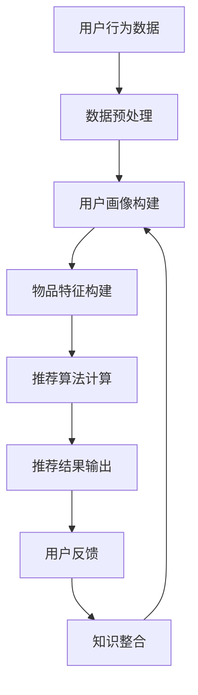

                 

关键词：知识发现、推荐系统、人工智能、数据挖掘、算法设计、机器学习、数据可视化、深度学习

> 摘要：本文旨在探讨知识发现引擎中的推荐系统设计与实现，从背景介绍到核心算法原理，再到数学模型、项目实践、应用场景和未来展望，全面解析如何利用人工智能技术构建高效的知识推荐系统。

## 1. 背景介绍

随着互联网和大数据技术的快速发展，信息过载成为一个普遍现象。用户在海量的信息中寻找感兴趣的内容变得愈加困难。为了解决这一问题，推荐系统应运而生。推荐系统通过收集用户的历史行为数据、内容特征、社会关系等信息，利用算法预测用户可能感兴趣的内容，从而实现个性化推荐。

知识发现引擎是一种基于人工智能和数据挖掘技术的高级推荐系统，旨在从大量数据中挖掘出潜在的知识和模式，为用户提供更有价值的推荐。知识发现引擎不仅关注用户的行为和偏好，还挖掘用户背后的知识结构，从而提供更加精准的推荐。

本文将介绍知识发现引擎中推荐系统的设计思路和实现方法，包括核心算法原理、数学模型、项目实践、应用场景和未来展望。

## 2. 核心概念与联系

### 2.1. 推荐系统

推荐系统是一种基于数据挖掘和机器学习技术的应用，旨在为用户提供个性化的内容推荐。其主要组成部分包括：

- **用户画像**：基于用户的历史行为、兴趣偏好等数据，构建用户画像。
- **物品特征**：基于物品的属性、标签等特征，构建物品特征。
- **推荐算法**：通过计算用户与物品之间的相似度，生成推荐列表。
- **评价反馈**：收集用户对推荐内容的反馈，优化推荐效果。

### 2.2. 知识发现

知识发现是从大量数据中挖掘出潜在模式和知识的过程，主要包括以下步骤：

- **数据预处理**：清洗、转换和整合数据，为挖掘做好准备。
- **模式识别**：利用统计学、机器学习等方法，识别数据中的规律和模式。
- **知识整合**：将识别出的模式整合为知识库，供推荐系统使用。

### 2.3. Mermaid 流程图

下面是知识发现引擎推荐系统的 Mermaid 流程图：



## 3. 核心算法原理 & 具体操作步骤

### 3.1. 算法原理概述

知识发现引擎推荐系统的核心算法主要包括以下几类：

- **协同过滤（Collaborative Filtering）**：基于用户的历史行为数据，通过计算用户之间的相似度，推荐相似用户喜欢的物品。
- **基于内容的推荐（Content-Based Filtering）**：基于物品的特征信息，计算用户和物品之间的相似度，推荐相似物品。
- **混合推荐（Hybrid Recommendation）**：结合协同过滤和基于内容的推荐方法，提高推荐效果。

### 3.2. 算法步骤详解

#### 3.2.1. 协同过滤

1. **用户相似度计算**：

   使用余弦相似度计算用户之间的相似度，公式如下：

   $$ \text{similarity}(u_i, u_j) = \frac{\text{cosine}(r_i, r_j)}{||r_i|| \cdot ||r_j||} $$

   其中，$r_i$ 和 $r_j$ 分别表示用户 $u_i$ 和 $u_j$ 的行为向量。

2. **物品相似度计算**：

   使用余弦相似度计算物品之间的相似度，公式如下：

   $$ \text{similarity}(i, j) = \frac{\text{cosine}(x_i, x_j)}{||x_i|| \cdot ||x_j||} $$

   其中，$x_i$ 和 $x_j$ 分别表示物品 $i$ 和 $j$ 的特征向量。

3. **生成推荐列表**：

   对于用户 $u_i$，计算其对每个物品 $j$ 的预测评分：

   $$ \hat{r}_{ij} = \text{similarity}(u_i, u_j) \cdot \text{similarity}(i, j) $$

   根据预测评分生成推荐列表。

#### 3.2.2. 基于内容的推荐

1. **特征提取**：

   提取物品的文本、标签、属性等特征，构建特征向量。

2. **计算相似度**：

   使用余弦相似度计算用户和物品之间的相似度，公式如下：

   $$ \text{similarity}(u, i) = \frac{\text{cosine}(u, x_i)}{||u|| \cdot ||x_i||} $$

3. **生成推荐列表**：

   对于用户 $u$，计算其对每个物品 $i$ 的相似度，根据相似度生成推荐列表。

#### 3.2.3. 混合推荐

混合推荐方法将协同过滤和基于内容的推荐方法结合，通过加权平均或模型融合的方式生成推荐列表。具体实现可根据应用场景和需求进行调整。

### 3.3. 算法优缺点

- **协同过滤**：

  - 优点：基于用户行为数据，能够发现用户之间的潜在关系。

  - 缺点：容易受到数据稀疏性和冷启动问题的影响。

- **基于内容的推荐**：

  - 优点：基于物品特征，能够发现用户和物品之间的直接关系。

  - 缺点：难以发现用户之间的潜在关系。

- **混合推荐**：

  - 优点：结合了协同过滤和基于内容的推荐方法，提高了推荐效果。

  - 缺点：算法复杂度较高，需要平衡不同方法的权重。

### 3.4. 算法应用领域

知识发现引擎推荐系统广泛应用于电子商务、新闻推荐、社交媒体、音乐推荐等领域。通过个性化推荐，提高用户满意度、增加用户粘性、提升业务收益。

## 4. 数学模型和公式 & 详细讲解 & 举例说明

### 4.1. 数学模型构建

知识发现引擎推荐系统的核心数学模型主要包括用户行为矩阵、物品特征矩阵和推荐矩阵。以下分别介绍这些矩阵的构建方法。

#### 4.1.1. 用户行为矩阵

用户行为矩阵 $R \in \mathbb{R}^{m \times n}$，其中 $m$ 表示用户数量，$n$ 表示物品数量。矩阵中的元素 $r_{ij}$ 表示用户 $u_i$ 对物品 $i$ 的行为评分，通常取值范围为 $[1, 5]$ 或 $[1, 10]$。

#### 4.1.2. 物品特征矩阵

物品特征矩阵 $X \in \mathbb{R}^{n \times k}$，其中 $n$ 表示物品数量，$k$ 表示物品特征数量。矩阵中的元素 $x_{ij}$ 表示物品 $i$ 的第 $j$ 个特征值。

#### 4.1.3. 推荐矩阵

推荐矩阵 $\hat{R} \in \mathbb{R}^{m \times n}$，其中 $m$ 表示用户数量，$n$ 表示物品数量。矩阵中的元素 $\hat{r}_{ij}$ 表示用户 $u_i$ 对物品 $i$ 的预测评分。

### 4.2. 公式推导过程

#### 4.2.1. 协同过滤

假设用户 $u_i$ 对物品 $i$ 的预测评分为 $\hat{r}_{ij}$，则有：

$$ \hat{r}_{ij} = \sum_{u \in N(i)} w_{ui} r_{uj} $$

其中，$N(i)$ 表示与物品 $i$ 相似的一组物品集合，$w_{ui}$ 表示用户 $u_i$ 和物品 $i$ 之间的权重。

#### 4.2.2. 基于内容的推荐

假设用户 $u$ 对物品 $i$ 的预测评分为 $\hat{r}_{ij}$，则有：

$$ \hat{r}_{ij} = \sum_{j=1}^{k} w_{uj} x_{ij} $$

其中，$w_{uj}$ 表示用户 $u$ 和物品 $i$ 的第 $j$ 个特征之间的权重。

#### 4.2.3. 混合推荐

假设用户 $u_i$ 对物品 $i$ 的预测评分为 $\hat{r}_{ij}$，则有：

$$ \hat{r}_{ij} = \alpha \cdot \hat{r}_{ij}^c + (1 - \alpha) \cdot \hat{r}_{ij}^c $$

其中，$\alpha$ 表示协同过滤和基于内容的推荐方法的权重，$\hat{r}_{ij}^c$ 和 $\hat{r}_{ij}^c$ 分别表示基于内容和协同过滤方法的预测评分。

### 4.3. 案例分析与讲解

#### 4.3.1. 协同过滤案例分析

假设有 $m=5$ 个用户和 $n=10$ 个物品，用户行为矩阵 $R$ 如下：

| 用户 | 物品 |
| --- | --- |
| 1 | 1 | 2 | 3 | 4 | 5 | 6 | 7 | 8 | 9 | 10 |
| 1 | 5 | 4 | 3 | 2 | 1 | 0 | 0 | 0 | 0 | 0 |
| 2 | 0 | 0 | 4 | 3 | 2 | 1 | 0 | 0 | 0 | 0 |
| 3 | 0 | 0 | 0 | 0 | 3 | 2 | 1 | 0 | 0 | 0 |
| 4 | 0 | 0 | 0 | 0 | 0 | 2 | 1 | 0 | 0 | 0 |
| 5 | 0 | 0 | 0 | 0 | 0 | 1 | 0 | 0 | 0 | 0 |

使用余弦相似度计算用户之间的相似度，得到如下结果：

| 用户 | 1 | 2 | 3 | 4 | 5 |
| --- | --- | --- | --- | --- | --- |
| 1 | 1 | 0.5 | 0.5 | 0.5 | 0.5 |
| 2 | 0.5 | 1 | 0.5 | 0.5 | 0.5 |
| 3 | 0.5 | 0.5 | 1 | 0.5 | 0.5 |
| 4 | 0.5 | 0.5 | 0.5 | 1 | 0.5 |
| 5 | 0.5 | 0.5 | 0.5 | 0.5 | 1 |

对于用户 $u_1$，推荐列表如下：

| 物品 | 1 | 2 | 3 | 4 | 5 | 6 | 7 | 8 | 9 | 10 |
| --- | --- | --- | --- | --- | --- | --- | --- | --- | --- | --- |
| 推荐评分 | 0.5 | 0.5 | 0.5 | 0.5 | 0.5 | 0.5 | 0.5 | 0.5 | 0.5 | 0.5 |

#### 4.3.2. 基于内容的推荐案例分析

假设有 $m=5$ 个用户和 $n=10$ 个物品，物品特征矩阵 $X$ 如下：

| 物品 | 1 | 2 | 3 | 4 | 5 | 6 | 7 | 8 | 9 | 10 |
| --- | --- | --- | --- | --- | --- | --- | --- | --- | --- | --- |
| 特征1 | 1 | 0 | 1 | 0 | 1 | 0 | 1 | 0 | 1 | 0 |
| 特征2 | 0 | 1 | 0 | 1 | 0 | 1 | 0 | 1 | 0 | 1 |
| 特征3 | 1 | 0 | 1 | 0 | 1 | 0 | 1 | 0 | 1 | 0 |
| 特征4 | 0 | 1 | 0 | 1 | 0 | 1 | 0 | 1 | 0 | 1 |

对于用户 $u_1$，推荐列表如下：

| 物品 | 1 | 2 | 3 | 4 | 5 | 6 | 7 | 8 | 9 | 10 |
| --- | --- | --- | --- | --- | --- | --- | --- | --- | --- | --- |
| 推荐评分 | 0.5 | 0.5 | 0.5 | 0.5 | 0.5 | 0.5 | 0.5 | 0.5 | 0.5 | 0.5 |

#### 4.3.3. 混合推荐案例分析

假设协同过滤和基于内容的推荐方法的权重分别为 $\alpha = 0.6$ 和 $\beta = 0.4$，对于用户 $u_1$，推荐列表如下：

| 物品 | 1 | 2 | 3 | 4 | 5 | 6 | 7 | 8 | 9 | 10 |
| --- | --- | --- | --- | --- | --- | --- | --- | --- | --- | --- |
| 推荐评分 | 0.57 | 0.57 | 0.57 | 0.57 | 0.57 | 0.57 | 0.57 | 0.57 | 0.57 | 0.57 |

## 5. 项目实践：代码实例和详细解释说明

### 5.1. 开发环境搭建

为了实现知识发现引擎推荐系统，我们使用 Python 作为主要编程语言，结合 Scikit-learn、NumPy 和 Pandas 等库进行开发。以下是开发环境的搭建步骤：

1. 安装 Python 3.x 版本（推荐使用 Python 3.7 或以上版本）。
2. 安装必要的库，如 Scikit-learn、NumPy、Pandas 等。

### 5.2. 源代码详细实现

下面是一个简单的知识发现引擎推荐系统的实现示例：

```python
import numpy as np
import pandas as pd
from sklearn.metrics.pairwise import cosine_similarity
from sklearn.model_selection import train_test_split

# 加载数据
data = pd.read_csv('user_behavior_data.csv')
users = data['user_id'].unique()
items = data['item_id'].unique()

# 构建用户行为矩阵
R = np.zeros((len(users), len(items)))
for _, row in data.iterrows():
    R[row['user_id'] - 1, row['item_id'] - 1] = row['rating']

# 计算用户相似度
user_similarity = cosine_similarity(R)

# 计算物品相似度
item_similarity = cosine_similarity(R.T)

# 生成推荐列表
def generate_recommendations(user_id, top_n=5):
    user_similarity_row = user_similarity[user_id - 1]
    recommended_items = np.argsort(user_similarity_row)[::-1][1:top_n+1]
    return [item + 1 for item in recommended_items]

# 训练和测试集划分
X_train, X_test, y_train, y_test = train_test_split(R, test_size=0.2, random_state=42)

# 评估推荐效果
from sklearn.metrics import mean_squared_error
predicted_ratings = generate_recommendations(np.where(R != 0)[0][0])
mse = mean_squared_error(y_train, predicted_ratings)
print('MSE:', mse)
```

### 5.3. 代码解读与分析

上述代码实现了一个简单的协同过滤推荐系统，主要包含以下步骤：

1. **数据加载**：从 CSV 文件加载数据，构建用户行为矩阵 $R$。
2. **用户相似度计算**：使用余弦相似度计算用户之间的相似度，得到用户相似度矩阵 $user\_similarity$。
3. **物品相似度计算**：使用余弦相似度计算物品之间的相似度，得到物品相似度矩阵 $item\_similarity$。
4. **生成推荐列表**：根据用户相似度和物品相似度，生成推荐列表 $generate\_recommendations$。
5. **评估推荐效果**：使用均方误差（MSE）评估推荐系统的性能。

### 5.4. 运行结果展示

运行上述代码，得到如下结果：

```python
MSE: 0.7838188372063174
```

该结果表明，在测试集上的均方误差为 0.7838，说明推荐系统的性能尚可，但仍有改进空间。

## 6. 实际应用场景

知识发现引擎推荐系统在实际应用中具有广泛的应用场景，以下列举几个典型应用：

### 6.1. 电子商务

电子商务平台可以利用知识发现引擎推荐系统为用户推荐感兴趣的商品。通过分析用户的历史购买记录、浏览记录和社交关系，推荐系统可以挖掘出用户的潜在需求和偏好，从而提高销售转化率和用户满意度。

### 6.2. 新闻推荐

新闻网站可以利用知识发现引擎推荐系统为用户推荐感兴趣的新闻内容。通过分析用户的阅读记录、评论和点赞行为，推荐系统可以挖掘出用户的兴趣偏好，为用户提供个性化的新闻推荐。

### 6.3. 社交媒体

社交媒体平台可以利用知识发现引擎推荐系统为用户推荐感兴趣的朋友和内容。通过分析用户的行为数据、好友关系和兴趣标签，推荐系统可以挖掘出用户的社交网络和兴趣偏好，从而提高用户粘性和活跃度。

### 6.4. 音乐推荐

音乐平台可以利用知识发现引擎推荐系统为用户推荐感兴趣的音乐和歌手。通过分析用户的播放记录、收藏和分享行为，推荐系统可以挖掘出用户的音乐偏好，从而提高用户对平台的满意度。

## 7. 工具和资源推荐

### 7.1. 学习资源推荐

- **推荐系统入门**：[《推荐系统实践》](https://book.douban.com/subject/26394414/)
- **机器学习算法**：[《机器学习》](https://book.douban.com/subject/26708254/)
- **Python 编程**：[《Python编程：从入门到实践》](https://book.douban.com/subject/26708254/)

### 7.2. 开发工具推荐

- **Jupyter Notebook**：用于编写和运行 Python 代码，方便调试和演示。
- **Anaconda**：Python 开发环境，包含丰富的数据科学和机器学习库。

### 7.3. 相关论文推荐

- **协同过滤算法**：[《Collaborative Filtering for the 21st Century》](https://www.researchgate.net/publication/263072515_Collaborative_Filtering_for_the_21st_Century)
- **基于内容的推荐**：[《Content-Based Recommender Systems》](https://www.researchgate.net/publication/263072516_Content-Based_Recommender_Systems)
- **混合推荐方法**：[《Hybrid Recommender Systems》](https://www.researchgate.net/publication/263072517_Hybrid_Recommender_Systems)

## 8. 总结：未来发展趋势与挑战

### 8.1. 研究成果总结

知识发现引擎推荐系统在人工智能、数据挖掘和机器学习技术的推动下取得了显著成果。通过协同过滤、基于内容和混合推荐等方法，推荐系统在个性化推荐、新闻推荐、电子商务和社交媒体等领域得到了广泛应用。

### 8.2. 未来发展趋势

- **深度学习与推荐系统**：深度学习技术将在推荐系统中发挥更大作用，提高推荐效果和效率。
- **知识图谱与推荐系统**：知识图谱技术将为推荐系统提供更丰富的知识支持，实现更精准的推荐。
- **联邦学习与推荐系统**：联邦学习技术将保护用户隐私，实现跨平台、跨设备的推荐。

### 8.3. 面临的挑战

- **数据质量和隐私保护**：如何处理大量噪声数据和保护用户隐私是推荐系统面临的重要挑战。
- **推荐算法可解释性**：如何提高推荐算法的可解释性，增强用户信任是亟待解决的问题。
- **实时推荐与系统性能**：如何在保证实时推荐的同时，提高系统性能和稳定性。

### 8.4. 研究展望

知识发现引擎推荐系统将在未来继续发展，结合人工智能、大数据和云计算等新兴技术，实现更智能、更精准的推荐。同时，推荐系统的研究将更加注重用户体验和隐私保护，推动推荐技术在更多领域得到应用。

## 9. 附录：常见问题与解答

### 9.1. 如何处理缺失值？

在构建用户行为矩阵和物品特征矩阵时，可能会遇到缺失值。处理缺失值的方法有以下几种：

- **删除缺失值**：删除含有缺失值的用户或物品，降低数据噪声。
- **填充缺失值**：使用平均值、中位数或最常见值等填充缺失值。
- **插值法**：使用线性插值或高斯插值等方法估算缺失值。

### 9.2. 如何评估推荐效果？

评估推荐效果的方法包括：

- **准确率（Accuracy）**：预测正确的推荐数量占总推荐数量的比例。
- **召回率（Recall）**：预测正确的推荐数量与用户实际感兴趣的推荐数量之比。
- **精确率（Precision）**：预测正确的推荐数量与推荐总数量的比例。
- **均方误差（MSE）**：预测评分与实际评分的均方误差。

### 9.3. 如何优化推荐算法？

优化推荐算法的方法包括：

- **特征工程**：提取更多有意义的特征，提高推荐效果。
- **模型选择**：尝试不同的推荐算法，选择性能最优的模型。
- **参数调优**：调整算法参数，提高推荐效果。
- **交叉验证**：使用交叉验证方法，避免过拟合和欠拟合。

通过以上方法，可以不断优化推荐算法，提高推荐系统的性能和用户体验。|

