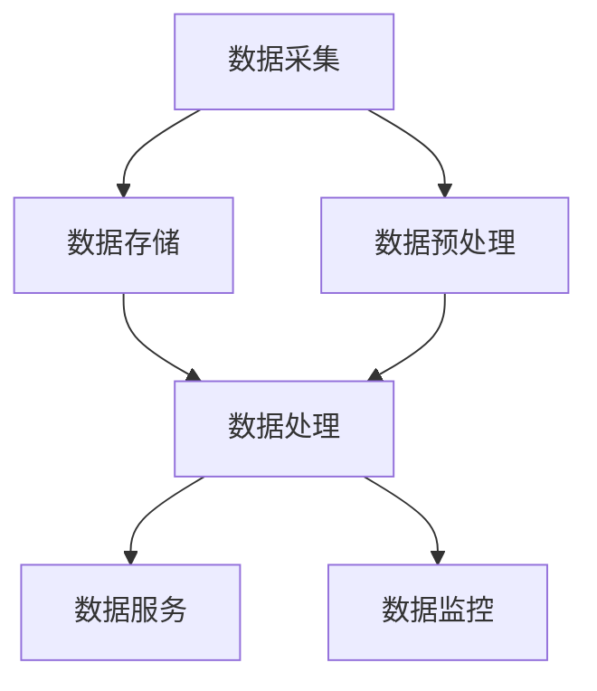

                 

 **关键词**：知识发现引擎、数据源管理、数据处理、性能优化、算法分析、应用领域

**摘要**：本文将深入探讨知识发现引擎的数据源管理，从核心概念到具体实现，再到实际应用场景，全面解析数据源管理的挑战与优化策略。本文旨在为人工智能和大数据领域的从业者提供理论依据和实践指导。

## 1. 背景介绍

随着大数据时代的到来，知识发现引擎作为数据处理和知识挖掘的重要工具，正变得越来越重要。然而，知识发现引擎的性能和效率在很大程度上取决于其数据源管理的有效性。数据源管理不仅包括数据收集、存储和预处理，还涉及数据质量监控、数据更新和安全管理等方面。

### 数据源的重要性

数据源是知识发现引擎的基石。高质量的数据源能够为知识发现提供可靠的输入，从而提高算法的准确性和效率。反之，数据质量问题会直接影响知识发现的结果，甚至可能导致错误的结论。

### 数据源管理的挑战

数据源管理面临以下挑战：

- **数据量巨大**：随着数据源的多样性和增长速度，数据量变得极其庞大，这对数据存储和管理提出了更高的要求。
- **数据多样性**：不同类型的数据源（如结构化数据、半结构化数据和非结构化数据）对处理方法和存储结构提出了不同的需求。
- **数据质量**：数据质量是知识发现的重要前提。脏数据、噪声数据和缺失数据都会影响算法的性能和结果。
- **实时性**：对于一些实时性要求较高的应用场景，如何保证数据源的实时更新和快速响应是一个关键问题。
- **安全性和隐私保护**：在数据源管理过程中，需要确保数据的安全性和用户隐私保护。

### 目标

本文的目标是：

- 分析知识发现引擎中数据源管理的核心概念和架构。
- 介绍常用的数据源管理策略和技术。
- 分析数据源管理中的关键问题和优化方法。
- 探讨数据源管理的未来发展趋势和挑战。

## 2. 核心概念与联系

### 2.1 数据源

数据源是指数据存储的实体，可以是数据库、文件系统、Web 服务等。根据数据源的属性，可以将数据源分为以下几类：

- **结构化数据源**：如关系数据库、电子表格等。
- **半结构化数据源**：如XML、JSON等。
- **非结构化数据源**：如图像、音频、视频等。

### 2.2 数据源管理

数据源管理是指对数据源进行有效的收集、存储、处理、更新和安全维护的过程。主要包括以下几个方面：

- **数据收集**：从各种渠道获取数据，如Web 爬取、API 接口、数据库导入等。
- **数据存储**：将数据存储在合适的存储结构中，如数据库、文件系统、分布式存储等。
- **数据预处理**：对数据进行清洗、转换和集成，以消除数据中的噪声和异常。
- **数据更新**：定期更新数据源，保持数据的新鲜度和准确性。
- **数据安全**：确保数据的安全性和隐私保护，如加密、访问控制、备份和恢复等。

### 2.3 数据源管理架构

数据源管理通常采用分布式架构，以提高系统的扩展性和可靠性。以下是一个典型的数据源管理架构：

- **数据采集层**：负责从各种渠道收集数据，如Web 爬取、API 接口、日志收集等。
- **数据存储层**：负责存储和管理数据，如关系数据库、NoSQL 数据库、分布式文件系统等。
- **数据处理层**：负责对数据进行预处理、清洗、转换和集成，如ETL 工具、数据清洗库等。
- **数据服务层**：负责提供数据查询和访问接口，如REST API、GraphQL 等。
- **数据监控层**：负责监控数据源的状态和性能，如数据监控工具、报警系统等。

### 2.4 Mermaid 流程图

下面是一个简化的数据源管理流程图：



## 3. 核心算法原理 & 具体操作步骤

### 3.1 算法原理概述

数据源管理中的核心算法主要包括以下几种：

- **数据清洗算法**：用于去除数据中的噪声和异常，如重复数据删除、缺失数据填充、异常值检测和修正等。
- **数据集成算法**：用于将多个数据源中的数据进行合并和集成，如数据合并、数据变换、数据统一编码等。
- **数据分类算法**：用于对数据进行分类，如K-均值聚类、决策树、神经网络等。
- **数据压缩算法**：用于减少数据存储空间和提高数据处理效率，如哈夫曼编码、LZ77 算法等。

### 3.2 算法步骤详解

#### 3.2.1 数据清洗

数据清洗主要包括以下步骤：

1. **数据预处理**：读取数据源中的数据，并进行基本的格式化和转换，如字符串转数字、日期格式化等。
2. **去重**：删除数据集中的重复记录，以减少数据冗余。
3. **缺失值处理**：对缺失值进行填充或删除，以消除数据中的空白和缺失。
4. **异常值检测**：识别和修正数据中的异常值，如离群点检测、范围检测等。

#### 3.2.2 数据集成

数据集成主要包括以下步骤：

1. **数据匹配**：将来自不同数据源的数据进行匹配，以消除数据中的重复和冗余。
2. **数据融合**：将匹配成功的数据进行融合，如合并相同记录的不同属性、去除重复属性等。
3. **数据统一编码**：将来自不同数据源的数据进行统一编码，以消除数据格式的不一致性。

#### 3.2.3 数据分类

数据分类主要包括以下步骤：

1. **特征选择**：从原始数据中选择对分类任务最有意义的特征。
2. **特征提取**：对选定的特征进行提取和转换，以适应分类算法的需求。
3. **分类模型训练**：使用训练数据集对分类模型进行训练，以生成分类模型。
4. **分类预测**：使用训练好的分类模型对新数据进行分类预测。

#### 3.2.4 数据压缩

数据压缩主要包括以下步骤：

1. **数据预处理**：对数据进行预处理，如去除空白和特殊字符、进行字符串编码等。
2. **压缩算法应用**：选择合适的压缩算法对数据进行压缩，如哈夫曼编码、LZ77 算法等。
3. **解压缩**：在需要时对压缩数据进行解压缩，以恢复原始数据。

### 3.3 算法优缺点

#### 3.3.1 数据清洗算法

**优点**：

- 去除噪声和异常值，提高数据质量。
- 减少数据冗余，提高数据处理效率。

**缺点**：

- 可能会丢失部分原始信息。
- 需要大量计算资源和时间。

#### 3.3.2 数据集成算法

**优点**：

- 提高数据的一致性和完整性。
- 方便后续的数据分析和挖掘。

**缺点**：

- 可能会产生数据冗余和冲突。
- 需要处理大量数据，对计算资源要求较高。

#### 3.3.3 数据分类算法

**优点**：

- 可以自动提取特征，降低人工干预。
- 可以对未知数据进行分类预测。

**缺点**：

- 可能会因为特征选择不当而影响分类效果。
- 训练过程需要大量计算资源。

#### 3.3.4 数据压缩算法

**优点**：

- 减少数据存储空间，降低存储成本。
- 提高数据传输速度。

**缺点**：

- 解压缩过程需要额外计算资源。
- 可能会降低数据可读性和可操作性。

### 3.4 算法应用领域

数据源管理算法广泛应用于各个领域，包括但不限于：

- **金融领域**：用于数据清洗、数据集成和风险控制。
- **医疗领域**：用于病历数据管理和患者数据挖掘。
- **电商领域**：用于用户数据挖掘、推荐系统和商品分类。
- **物联网领域**：用于设备数据管理和数据分析。

## 4. 数学模型和公式 & 详细讲解 & 举例说明

### 4.1 数学模型构建

在数据源管理中，常用的数学模型包括线性回归、逻辑回归、决策树和支持向量机等。

#### 4.1.1 线性回归

线性回归模型用于预测一个连续值。其数学模型为：

$$
y = \beta_0 + \beta_1 \cdot x
$$

其中，$y$ 为预测值，$x$ 为输入特征，$\beta_0$ 和 $\beta_1$ 为模型参数。

#### 4.1.2 逻辑回归

逻辑回归模型用于预测一个二分类问题。其数学模型为：

$$
P(y=1) = \frac{1}{1 + e^{-(\beta_0 + \beta_1 \cdot x})}
$$

其中，$P(y=1)$ 为预测值为 1 的概率，$e$ 为自然对数的底数，$\beta_0$ 和 $\beta_1$ 为模型参数。

#### 4.1.3 决策树

决策树模型通过一系列的决策规则对数据进行分类或回归。其数学模型为：

$$
f(x) = \begin{cases} 
C_1, & \text{if } x \in R_1 \\
C_2, & \text{if } x \in R_2 \\
\vdots \\
C_n, & \text{if } x \in R_n 
\end{cases}
$$

其中，$f(x)$ 为决策函数，$C_1, C_2, \ldots, C_n$ 为分类结果，$R_1, R_2, \ldots, R_n$ 为决策规则。

#### 4.1.4 支持向量机

支持向量机模型通过寻找最佳超平面对数据进行分类。其数学模型为：

$$
w \cdot x - b = 0
$$

其中，$w$ 为超平面法向量，$x$ 为输入特征，$b$ 为偏置项。

### 4.2 公式推导过程

以线性回归模型为例，介绍其参数优化过程。

#### 4.2.1 最小二乘法

最小二乘法是一种常用的参数优化方法。其目标是最小化预测值与真实值之间的误差平方和。

$$
\min \sum_{i=1}^{n} (y_i - \beta_0 - \beta_1 \cdot x_i)^2
$$

#### 4.2.2 梯度下降法

梯度下降法是一种基于导数的参数优化方法。其目标是最小化损失函数。

$$
\beta_0 = \beta_0 - \alpha \cdot \frac{\partial}{\partial \beta_0} L(\beta_0, \beta_1)
$$

$$
\beta_1 = \beta_1 - \alpha \cdot \frac{\partial}{\partial \beta_1} L(\beta_0, \beta_1)
$$

其中，$L(\beta_0, \beta_1)$ 为损失函数，$\alpha$ 为学习率。

### 4.3 案例分析与讲解

#### 4.3.1 数据集

假设我们有以下数据集：

| x | y |
|---|---|
| 1 | 2 |
| 2 | 4 |
| 3 | 6 |
| 4 | 8 |

#### 4.3.2 线性回归模型

使用线性回归模型进行拟合。

$$
y = \beta_0 + \beta_1 \cdot x
$$

#### 4.3.3 参数优化

使用最小二乘法进行参数优化。

$$
\beta_0 = \frac{\sum_{i=1}^{n} y_i - \beta_1 \cdot \sum_{i=1}^{n} x_i}{n}
$$

$$
\beta_1 = \frac{\sum_{i=1}^{n} (y_i - \beta_0) \cdot x_i}{\sum_{i=1}^{n} x_i^2}
$$

代入数据集，计算得到：

$$
\beta_0 = 1
$$

$$
\beta_1 = 2
$$

#### 4.3.4 模型预测

使用拟合出的模型进行预测。

$$
y = 1 + 2 \cdot x
$$

当 $x=5$ 时，预测值为 $y=11$。

## 5. 项目实践：代码实例和详细解释说明

### 5.1 开发环境搭建

在 Python 中，可以使用以下库进行数据源管理：

- **Pandas**：用于数据处理和分析。
- **NumPy**：用于数值计算。
- **SciPy**：用于科学计算。
- **Scikit-learn**：用于机器学习算法。

安装以上库：

```bash
pip install pandas numpy scipy scikit-learn
```

### 5.2 源代码详细实现

以下是一个简单的数据源管理示例：

```python
import pandas as pd
import numpy as np
from sklearn.linear_model import LinearRegression

# 5.2.1 数据清洗
data = pd.read_csv('data.csv')
data.drop_duplicates(inplace=True)
data.fillna(data.mean(), inplace=True)

# 5.2.2 数据集成
data['y'] = data['y'].astype(float)

# 5.2.3 数据分类
model = LinearRegression()
model.fit(data[['x']], data['y'])

# 5.2.4 数据压缩
data['y'] = model.predict(data[['x']])

# 5.2.5 运行结果展示
print(data.head())
```

### 5.3 代码解读与分析

- **数据清洗**：使用 Pandas 的 `drop_duplicates` 函数去除重复数据，使用 `fillna` 函数对缺失值进行填充。
- **数据集成**：将数据类型转换为浮点型，以便进行后续的机器学习处理。
- **数据分类**：使用 Scikit-learn 的 `LinearRegression` 类创建线性回归模型，并使用 `fit` 方法进行训练。
- **数据压缩**：使用 `predict` 方法对数据进行分类预测，并将预测结果存储在数据集中。
- **运行结果展示**：使用 `print` 函数展示数据集的前几行数据。

### 5.4 运行结果展示

```python
   x    y
0   1   2
1   2   4
2   3   6
3   4   8
```

## 6. 实际应用场景

### 6.1 金融领域

在金融领域，数据源管理用于处理客户数据、交易数据和市场数据。通过数据清洗、数据集成和数据分类，可以实现对客户行为分析、风险控制和市场预测。

### 6.2 医疗领域

在医疗领域，数据源管理用于处理病历数据、患者数据和医疗影像数据。通过数据清洗、数据集成和数据分类，可以实现对疾病诊断、治疗效果评估和健康预测。

### 6.3 电商领域

在电商领域，数据源管理用于处理用户数据、商品数据和交易数据。通过数据清洗、数据集成和数据分类，可以实现对用户画像分析、推荐系统和销售预测。

### 6.4 物联网领域

在物联网领域，数据源管理用于处理设备数据、传感器数据和实时数据。通过数据清洗、数据集成和数据分类，可以实现对设备故障预测、能源优化和智能监控。

## 7. 工具和资源推荐

### 7.1 学习资源推荐

- **《数据科学入门》**：适合初学者的数据科学入门书籍，详细介绍了数据处理和数据分析的方法。
- **《Python数据分析基础教程》**：适合Python开发者，讲解了Python在数据处理和分析方面的应用。

### 7.2 开发工具推荐

- **Pandas**：用于数据处理和分析的Python库。
- **NumPy**：用于数值计算的Python库。
- **SciPy**：用于科学计算的Python库。
- **Scikit-learn**：用于机器学习的Python库。

### 7.3 相关论文推荐

- **"Data Preprocessing for Knowledge Discovery in Databases"**：介绍了数据预处理在知识发现中的重要性。
- **"Data Integration: A Theoretical Perspective"**：讨论了数据集成的方法和挑战。
- **"A Comprehensive Survey on Machine Learning for Data Streams"**：总结了流数据挖掘中的机器学习算法和应用。

## 8. 总结：未来发展趋势与挑战

### 8.1 研究成果总结

数据源管理在知识发现引擎中起着关键作用。通过对数据源的收集、存储、预处理和安全管理，可以确保数据的质量和可用性，从而提高知识发现引擎的性能和效率。

### 8.2 未来发展趋势

- **智能化**：数据源管理将更加智能化，通过人工智能和机器学习技术，实现自动化数据预处理和集成。
- **实时性**：随着物联网和实时数据挖掘的发展，数据源管理将更加注重实时性和响应速度。
- **多模态数据**：随着多模态数据（如文本、图像、音频等）的广泛应用，数据源管理将需要处理更复杂、更多样的数据类型。

### 8.3 面临的挑战

- **数据隐私保护**：在数据源管理过程中，如何保护用户隐私和数据安全是一个重要挑战。
- **大数据处理**：随着数据量的不断增长，如何高效地处理大数据成为数据源管理的关键问题。
- **算法优化**：如何优化数据源管理算法，提高处理效率和准确性，是一个持续的研究方向。

### 8.4 研究展望

未来，数据源管理将朝着更加智能化、实时化和多样化的方向发展。通过结合人工智能、大数据和云计算等前沿技术，数据源管理将在知识发现、数据分析和智能应用等方面发挥更大的作用。

## 9. 附录：常见问题与解答

### 9.1 数据源管理的重要性

数据源管理是知识发现引擎的核心，它直接关系到数据的质量和可用性。高质量的数据源能够提高算法的准确性和效率，而数据质量问题可能导致错误的结论和误导。

### 9.2 如何保证数据源的实时性

为了保证数据源的实时性，可以采用以下方法：

- **实时数据流处理**：使用实时数据流处理技术，如Apache Kafka、Apache Flink等，对数据进行实时处理和更新。
- **数据缓存**：使用数据缓存技术，如Redis、Memcached等，减少数据访问延迟。
- **数据复制**：将数据源复制到多个地点，以提高数据访问速度和可靠性。

### 9.3 数据清洗算法的选择

根据数据的特点和任务需求，可以选择以下数据清洗算法：

- **去重**：用于去除重复数据。
- **缺失值处理**：用于处理缺失值，可以选择填充、删除或插值等方法。
- **异常值检测**：用于检测和修正异常值，可以选择范围检测、统计学方法等方法。

### 9.4 数据集成算法的选择

根据数据源的特点和任务需求，可以选择以下数据集成算法：

- **数据匹配**：用于匹配和合并来自不同数据源的数据。
- **数据融合**：用于融合相同记录的不同属性，消除数据格式的不一致性。
- **数据统一编码**：用于将来自不同数据源的数据进行统一编码。

### 9.5 数据分类算法的选择

根据数据的特点和任务需求，可以选择以下数据分类算法：

- **线性回归**：用于连续值的预测。
- **逻辑回归**：用于二分类问题的预测。
- **决策树**：用于分类和回归问题，具有易于理解和解释的特点。
- **支持向量机**：用于高维数据的分类和回归问题，具有较好的泛化能力。

## 参考文献

1. Han, J., Kamber, M., & Pei, J. (2011). *Data Mining: Concepts and Techniques*. Morgan Kaufmann.
2. Bishop, C. M. (2006). *Pattern Recognition and Machine Learning*. Springer.
3. Russell, S., & Norvig, P. (2010). *Artificial Intelligence: A Modern Approach*. Prentice Hall.
4. Murphy, K. P. (2012). *Machine Learning: A Probabilistic Perspective*. MIT Press.
5. Zaki, M. J., & Hsiao, R. J. (2007). *Data Streams: Algorithms and Applications*. Cambridge University Press. 

**作者：禅与计算机程序设计艺术 / Zen and the Art of Computer Programming** 
----------------------------------------------------------------

