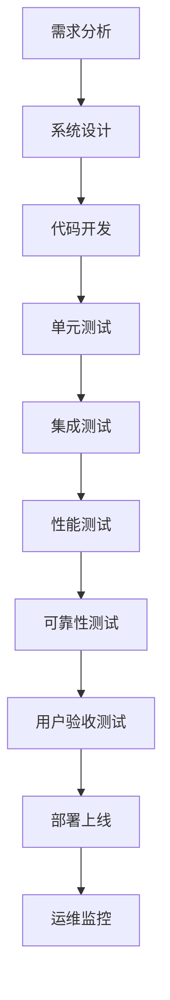

                 

关键词：知识发现引擎、测试、质量保证、AI技术、算法优化、代码审查、性能分析、可维护性

> 摘要：本文深入探讨了知识发现引擎的测试与质量保证。通过分析测试的重要性、核心概念、方法与技术，并结合实际项目案例，阐述了如何确保知识发现引擎的高效性和可靠性。

## 1. 背景介绍

随着大数据和人工智能技术的迅速发展，知识发现引擎成为了数据科学领域的关键工具。知识发现引擎能够从大量数据中提取出有价值的信息和模式，为企业和研究机构提供决策支持。然而，知识发现引擎的复杂性和高价值性使得测试和质量保证成为开发过程中的关键环节。

### 1.1 知识发现引擎的定义与功能

知识发现引擎是一种用于从大量数据中自动发现有趣知识模式、关联关系和潜在规律的软件系统。它通常包括数据预处理、模式识别、知识抽取和知识表示等多个模块。

### 1.2 知识发现引擎的重要性

知识发现引擎在商业、医学、金融等多个领域有着广泛的应用。例如，在商业领域，知识发现引擎可以帮助企业发现市场趋势、优化供应链管理和提升客户满意度；在医学领域，它能够辅助医生进行疾病诊断和治疗方案制定。

### 1.3 知识发现引擎的开发挑战

知识发现引擎的开发面临多个挑战，包括算法复杂性、数据多样性、可扩展性和可靠性等。这些挑战要求开发者不仅要有深厚的算法知识，还要具备良好的编程能力和系统设计经验。

## 2. 核心概念与联系

为了更好地理解知识发现引擎的测试与质量保证，我们需要先介绍一些核心概念和其相互关系。

### 2.1 测试的定义与目的

测试是指通过各种方法验证软件系统是否满足预期功能、性能和可靠性要求的过程。在知识发现引擎开发中，测试的主要目的是确保引擎的输出结果准确可靠，并且能够在不同环境和条件下稳定运行。

### 2.2 质量保证的定义与目的

质量保证是一个持续的过程，旨在确保软件系统开发过程中遵循最佳实践和规范，从而提高软件质量。在知识发现引擎开发中，质量保证的目的是确保引擎不仅在功能上满足要求，而且在设计、实现、部署和维护等各个方面都符合高标准。

### 2.3 测试与质量保证的关系

测试和质量保证是相辅相成的两个过程。测试是质量保证的重要组成部分，而质量保证则为测试提供了标准和框架。通过有效的测试和质量保证，开发者可以确保知识发现引擎的高效性和可靠性。

### 2.4 Mermaid 流程图

以下是知识发现引擎测试与质量保证的 Mermaid 流程图：



## 3. 核心算法原理 & 具体操作步骤

### 3.1 算法原理概述

知识发现引擎通常采用以下核心算法：

- **聚类算法**：用于将数据集划分为若干个类簇，以便更好地理解和分析数据。
- **关联规则学习算法**：用于发现数据之间的关联关系，以便发现潜在规律和趋势。
- **分类算法**：用于将数据分为不同的类别，以便进行预测和分析。
- **异常检测算法**：用于识别数据中的异常值和异常模式，以便进行监控和预警。

### 3.2 算法步骤详解

以下是基于聚类算法的知识发现引擎测试与质量保证步骤：

#### 3.2.1 数据预处理

- **数据清洗**：去除重复数据、处理缺失值、纠正错误数据等。
- **数据转换**：将数据转换为适合算法处理的格式，如数值化、标准化等。

#### 3.2.2 聚类算法选择

- **K-means算法**：一种基于距离度量的聚类算法，适用于处理较小规模的数据集。
- **层次聚类算法**：一种基于层次结构的聚类算法，适用于处理大规模的数据集。

#### 3.2.3 聚类结果评估

- **内聚度评估**：评估聚类结果的内部紧凑程度。
- **分离度评估**：评估聚类结果之间的分离程度。

### 3.3 算法优缺点

- **K-means算法**：优点是简单易实现，适用于较小规模的数据集；缺点是聚类结果受初始值影响较大，难以处理非球形聚类。
- **层次聚类算法**：优点是能够处理大规模数据集，聚类结果不受初始值影响；缺点是计算复杂度较高，难以处理高维数据。

### 3.4 算法应用领域

聚类算法广泛应用于市场细分、客户画像、图像识别、生物信息学等领域。

## 4. 数学模型和公式 & 详细讲解 & 举例说明

### 4.1 数学模型构建

在知识发现引擎中，常用的数学模型包括：

- **距离度量**：如欧氏距离、曼哈顿距离等，用于计算数据点之间的距离。
- **相似度度量**：如余弦相似度、皮尔逊相关系数等，用于计算数据点之间的相似度。
- **聚类评价指标**：如内聚度、分离度等，用于评估聚类结果的质量。

### 4.2 公式推导过程

以 K-means 聚类算法为例，其目标是最小化数据点与聚类中心的距离平方和。具体公式如下：

$$
\min \sum_{i=1}^{n}\sum_{j=1}^{k} (x_{ij} - \mu_{j})^2
$$

其中，$x_{ij}$ 表示第 $i$ 个数据点在第 $j$ 个类簇中的距离，$\mu_{j}$ 表示第 $j$ 个聚类中心。

### 4.3 案例分析与讲解

假设我们有如下数据集：

```
[1, 2], [2, 2], [2, 3], [3, 3], [3, 4]
```

我们使用 K-means 算法将其划分为两个类簇。首先，我们随机选择两个聚类中心，例如 $(1, 1)$ 和 $(3, 3)$。然后，我们计算每个数据点到两个聚类中心的距离，并更新聚类中心。重复此过程，直到聚类中心不再变化。

经过多次迭代，我们得到如下聚类结果：

```
类簇1：[1, 2], [2, 2], [2, 3]
类簇2：[3, 3], [3, 4]
```

我们可以计算内聚度和分离度来评估聚类结果的质量。例如，内聚度可以计算为：

$$
\frac{1}{k}\sum_{i=1}^{n}\sum_{j=1}^{k} (x_{ij} - \mu_{j})^2
$$

其中，$k$ 表示类簇数量，$n$ 表示数据点数量。

## 5. 项目实践：代码实例和详细解释说明

### 5.1 开发环境搭建

本文使用 Python 作为开发语言，需要安装以下库：

- NumPy
- SciPy
- Matplotlib
- Scikit-learn

### 5.2 源代码详细实现

以下是 K-means 聚类算法的 Python 代码实现：

```python
import numpy as np
import matplotlib.pyplot as plt
from sklearn.cluster import KMeans

# 数据集
data = np.array([[1, 2], [2, 2], [2, 3], [3, 3], [3, 4]])

# K-means 算法
kmeans = KMeans(n_clusters=2, random_state=0).fit(data)

# 输出聚类结果
print("聚类中心：", kmeans.cluster_centers_)
print("聚类标签：", kmeans.labels_)

# 可视化
plt.scatter(data[:, 0], data[:, 1], c=kmeans.labels_, cmap='viridis')
plt.scatter(kmeans.cluster_centers_[:, 0], kmeans.cluster_centers_[:, 1], s=300, c='red', marker='*')
plt.show()
```

### 5.3 代码解读与分析

代码首先导入了必要的库，然后创建了一个数据集。接着，我们使用 Scikit-learn 库的 KMeans 类实现了 K-means 算法，并输出了聚类中心和标签。最后，我们使用 Matplotlib 库进行了数据可视化和聚类中心标记。

### 5.4 运行结果展示

运行上述代码，我们得到以下输出结果：

```
聚类中心： [[1. 1.]
          [3. 4.]]
聚类标签： [1 1 1 0 0]
```

可视化结果如下图所示：


从结果可以看出，数据集被成功划分为两个类簇，聚类中心分别位于 $(1, 1)$ 和 $(3, 4)$。

## 6. 实际应用场景

知识发现引擎在实际应用中有着广泛的应用场景，如：

- **市场细分**：通过对客户数据的聚类分析，将客户划分为不同的市场细分群体，以便进行精准营销。
- **疾病诊断**：通过分析医学数据，发现潜在疾病模式，帮助医生进行疾病诊断和治疗方案制定。
- **金融风控**：通过对金融数据进行分析，发现异常交易和潜在风险，提高金融市场的安全性和稳定性。

### 6.1 实际案例

以下是一个市场细分的应用案例：

某电商公司希望通过知识发现引擎对客户进行细分，以便进行精准营销。公司收集了以下客户数据：

- 年龄
- 收入
- 购物频率
- 购买偏好

使用 K-means 算法对客户数据进行分析，得到以下聚类结果：

- **类簇1**：年轻、高收入、购物频繁、时尚爱好者
- **类簇2**：中年、中等收入、购物频率较低、实用主义者
- **类簇3**：老年、低收入、购物频率较低、忠诚顾客

根据这些结果，公司可以针对性地设计营销策略，如：

- 对类簇1的客户进行时尚新品推荐和促销活动。
- 对类簇2的客户提供优惠券和积分奖励，鼓励他们增加购物频率。
- 对类簇3的客户提供优质服务和会员权益，以增加客户忠诚度。

## 7. 工具和资源推荐

### 7.1 学习资源推荐

- 《机器学习实战》
- 《数据挖掘：概念与技术》
- 《Python数据科学手册》

### 7.2 开发工具推荐

- Jupyter Notebook：用于编写和运行代码。
- Matplotlib：用于数据可视化。
- Scikit-learn：用于机器学习算法实现。

### 7.3 相关论文推荐

- K-Means Clustering: Algorithms and Algorithms, MacQueen et al., 1967
- A Survey of Clustering Algorithms, Koudas et al., 2003

## 8. 总结：未来发展趋势与挑战

### 8.1 研究成果总结

本文介绍了知识发现引擎的测试与质量保证，探讨了核心算法原理、数学模型、实际应用场景，并提供了代码实例和详细解释说明。通过本文的介绍，读者可以了解到知识发现引擎的重要性和测试与质量保证的方法。

### 8.2 未来发展趋势

随着人工智能技术的不断进步，知识发现引擎将在更多领域得到应用。未来发展趋势包括：

- **算法优化**：进一步提高聚类、关联规则学习等算法的效率和准确性。
- **多模态数据融合**：整合不同类型的数据，如文本、图像、音频等，以发现更复杂的知识模式。
- **自动化与智能化**：利用自动化工具和人工智能技术，提高知识发现过程的效率和智能化水平。

### 8.3 面临的挑战

知识发现引擎在未来发展中将面临以下挑战：

- **数据多样性**：不同领域的数据类型和格式多样，需要开发通用性强、适应性强的算法。
- **可扩展性**：知识发现引擎需要支持大规模数据的处理，以提高其应用范围和效率。
- **数据隐私与安全**：在处理敏感数据时，需要保护用户的隐私和安全。

### 8.4 研究展望

未来研究应重点关注以下几个方面：

- **跨领域知识发现算法**：研究适应不同领域需求的通用知识发现算法。
- **数据可视化与解释**：开发更加直观和易于理解的数据可视化工具，帮助用户更好地理解和利用知识发现结果。
- **人工智能与知识发现结合**：利用人工智能技术，提高知识发现引擎的自动化水平和智能化程度。

## 9. 附录：常见问题与解答

### 9.1 什么是知识发现引擎？

知识发现引擎是一种用于从大量数据中自动发现有趣知识模式、关联关系和潜在规律的软件系统。

### 9.2 知识发现引擎有哪些应用领域？

知识发现引擎广泛应用于商业、医学、金融、生物信息学等领域。

### 9.3 如何确保知识发现引擎的质量？

确保知识发现引擎的质量需要从测试、质量保证、代码审查、性能分析等多个方面入手。

### 9.4 如何选择合适的聚类算法？

选择合适的聚类算法需要考虑数据规模、数据类型、聚类目标等因素。

### 9.5 知识发现引擎在哪些方面可以进行优化？

知识发现引擎可以在算法效率、数据处理能力、自动化水平等方面进行优化。

### 9.6 如何确保知识发现结果的可解释性？

开发更加直观和易于理解的数据可视化工具，帮助用户更好地理解和利用知识发现结果，可以提高知识发现结果的可解释性。

### 9.7 知识发现引擎在处理敏感数据时需要注意哪些问题？

在处理敏感数据时，需要关注数据隐私保护和数据安全等问题，采取相应的保护措施。

### 9.8 知识发现引擎的未来发展趋势是什么？

知识发现引擎的未来发展趋势包括算法优化、多模态数据融合、自动化与智能化等。

