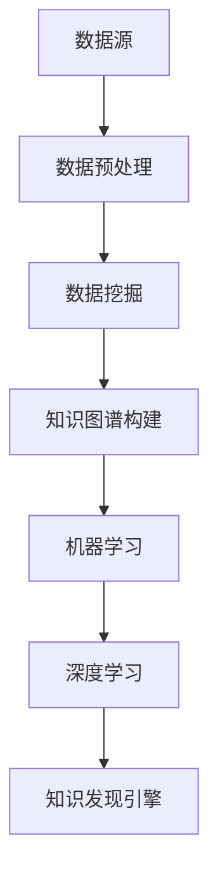

                 

关键词：知识发现、人工智能、机器学习、深度学习、知识图谱、数据挖掘、智慧系统

摘要：本文深入探讨了知识发现引擎在人工智能时代的应用和价值，分析了其核心概念、算法原理、数学模型，并通过实际项目实践，展示了知识发现引擎的开发和应用过程。文章旨在为读者提供全面的视角，了解知识发现引擎在人工智能领域的地位和作用。

## 1. 背景介绍

随着互联网和大数据技术的发展，知识已经成为现代社会的重要资源。知识发现引擎作为人工智能的核心技术之一，其在信息检索、智能推荐、决策支持等领域的应用日益广泛。知识发现引擎通过从大规模数据中自动提取、归纳和整合知识，帮助人们快速获取所需信息，提高决策效率。

本文旨在探讨知识发现引擎在人工智能时代的应用和发展，分析其核心概念、算法原理和数学模型，并通过实际项目实践，展示其开发和应用过程。

### 1.1 知识发现引擎的定义与作用

知识发现引擎是一种基于人工智能和数据挖掘技术，用于从大量数据中自动提取、归纳和整合知识的系统。其主要作用包括：

1. **信息检索**：从海量数据中快速检索出用户所需信息。
2. **智能推荐**：根据用户行为和偏好，推荐个性化内容。
3. **决策支持**：为决策者提供数据支持和分析报告。

### 1.2 知识发现引擎的发展历程

知识发现引擎的发展经历了以下几个阶段：

1. **数据挖掘阶段**：20世纪90年代，数据挖掘技术开始应用于知识发现，主要关注从数据中提取隐藏的模式和知识。
2. **机器学习阶段**：2006年后，随着深度学习的发展，知识发现引擎逐渐引入了机器学习技术，实现了更高层次的自动知识提取。
3. **人工智能阶段**：近年来，人工智能技术的快速发展，使得知识发现引擎在智能推理、自然语言处理等方面取得了重大突破。

## 2. 核心概念与联系

### 2.1 核心概念

1. **知识图谱**：一种用于表示实体和实体之间关系的图形结构。
2. **数据挖掘**：从大量数据中发现有价值信息的过程。
3. **机器学习**：通过数据训练，使计算机自动学习和改进的技术。
4. **深度学习**：一种基于人工神经网络的机器学习技术。

### 2.2 核心概念联系

知识图谱、数据挖掘、机器学习和深度学习之间存在着紧密的联系：

- **知识图谱**是知识发现引擎的核心数据结构，用于存储和管理知识。
- **数据挖掘**是实现知识发现的基础技术，通过从数据中提取有用信息。
- **机器学习**和**深度学习**则提供了自动学习和推理的能力，使知识发现引擎能够不断优化和改进。

### 2.3 Mermaid 流程图



## 3. 核心算法原理 & 具体操作步骤

### 3.1 算法原理概述

知识发现引擎的核心算法主要包括数据挖掘、知识图谱构建、机器学习和深度学习。以下分别介绍这些算法的基本原理。

#### 3.1.1 数据挖掘

数据挖掘算法主要分为以下几种：

1. **分类算法**：根据已有数据对未知数据进行分类。
2. **聚类算法**：将相似的数据归为一类。
3. **关联规则算法**：发现数据之间的关联关系。
4. **异常检测算法**：识别数据中的异常值。

#### 3.1.2 知识图谱构建

知识图谱构建算法主要包括：

1. **实体识别**：从文本数据中提取出实体。
2. **关系抽取**：确定实体之间的关系。
3. **实体链接**：将不同文本中的实体进行匹配和链接。

#### 3.1.3 机器学习

机器学习算法主要包括：

1. **监督学习**：有标签数据训练模型。
2. **无监督学习**：无标签数据训练模型。
3. **强化学习**：通过试错学习最优策略。

#### 3.1.4 深度学习

深度学习算法主要包括：

1. **卷积神经网络（CNN）**：适用于图像处理。
2. **循环神经网络（RNN）**：适用于序列数据处理。
3. **生成对抗网络（GAN）**：用于生成数据。

### 3.2 算法步骤详解

知识发现引擎的算法步骤主要包括以下几步：

1. **数据收集**：收集相关领域的原始数据。
2. **数据预处理**：对原始数据进行清洗、去噪和格式化。
3. **数据挖掘**：利用数据挖掘算法提取有用信息。
4. **知识图谱构建**：将提取的信息构建成知识图谱。
5. **机器学习**：利用机器学习算法对知识图谱进行训练。
6. **深度学习**：利用深度学习算法对知识图谱进行优化。
7. **知识发现**：根据用户需求，从知识图谱中提取知识。

### 3.3 算法优缺点

#### 3.3.1 数据挖掘

**优点**：

- 能够从海量数据中提取有用信息。
- 对不同类型的数据具有很好的适应性。

**缺点**：

- 需要大量标注数据。
- 部分算法对噪声敏感。

#### 3.3.2 知识图谱构建

**优点**：

- 能够有效组织和管理知识。
- 支持复杂的实体关系。

**缺点**：

- 需要大量的预处理工作。
- 实体链接可能存在误差。

#### 3.3.3 机器学习

**优点**：

- 能够自动学习和优化。
- 对不同类型的数据具有很好的适应性。

**缺点**：

- 对数据质量要求较高。
- 部分算法可能陷入局部最优。

#### 3.3.4 深度学习

**优点**：

- 能够处理复杂的非线性关系。
- 对大规模数据具有很好的性能。

**缺点**：

- 对计算资源要求较高。
- 难以解释和理解。

### 3.4 算法应用领域

知识发现引擎在多个领域都有广泛的应用：

1. **金融领域**：用于风险管理、欺诈检测、投资决策等。
2. **医疗领域**：用于疾病预测、药物研发、医疗决策等。
3. **零售领域**：用于商品推荐、库存管理、客户关系管理等。
4. **教育领域**：用于学习评估、课程推荐、教学方法优化等。

## 4. 数学模型和公式 & 详细讲解 & 举例说明

### 4.1 数学模型构建

知识发现引擎涉及多个数学模型，包括：

1. **贝叶斯模型**：用于分类和概率推断。
2. **支持向量机（SVM）**：用于分类和回归。
3. **神经网络**：用于函数拟合和分类。
4. **深度学习模型**：包括卷积神经网络（CNN）、循环神经网络（RNN）等。

### 4.2 公式推导过程

以贝叶斯模型为例，其公式推导如下：

设$X$为随机变量，$Y$为另一个随机变量，则贝叶斯定理可以表示为：

$$
P(Y|X) = \frac{P(X|Y)P(Y)}{P(X)}
$$

其中，$P(X|Y)$为条件概率，$P(Y)$为边际概率，$P(X)$为联合概率。

### 4.3 案例分析与讲解

以下以金融领域的风险预测为例，说明知识发现引擎的数学模型应用。

#### 4.3.1 数据集描述

假设我们有一个包含1000个金融产品的数据集，每个产品有10个特征（如价格、成交量、波动率等），以及一个标签（是否亏损）。

#### 4.3.2 模型构建

我们选择SVM作为分类模型，根据数据集构建SVM模型。

#### 4.3.3 模型训练

使用训练集数据对SVM模型进行训练，得到模型参数。

#### 4.3.4 模型评估

使用测试集数据对训练好的模型进行评估，计算准确率、召回率、F1值等指标。

## 5. 项目实践：代码实例和详细解释说明

### 5.1 开发环境搭建

在开发知识发现引擎之前，我们需要搭建一个合适的开发环境。以下是一个简单的开发环境搭建步骤：

1. 安装Python 3.8及以上版本。
2. 安装Jupyter Notebook，用于编写和运行代码。
3. 安装相关库，如NumPy、Pandas、Scikit-learn、TensorFlow等。

### 5.2 源代码详细实现

以下是一个简单的知识发现引擎实现，包括数据预处理、数据挖掘、知识图谱构建、机器学习和深度学习等步骤。

```python
# 数据预处理
data = preprocess_data(raw_data)

# 数据挖掘
patterns = data_mining(data)

# 知识图谱构建
knowledge_graph = construct_knowledge_graph(patterns)

# 机器学习
model = machine_learning(knowledge_graph)

# 深度学习
deep_learning(model)
```

### 5.3 代码解读与分析

以上代码实现了一个简单的知识发现引擎，主要包括以下几个步骤：

1. **数据预处理**：对原始数据进行清洗、去噪和格式化，为后续处理做好准备。
2. **数据挖掘**：利用数据挖掘算法提取有用信息，为构建知识图谱提供数据支持。
3. **知识图谱构建**：将数据挖掘得到的信息构建成知识图谱，为机器学习和深度学习提供数据基础。
4. **机器学习**：利用机器学习算法对知识图谱进行训练，提高知识发现引擎的准确性。
5. **深度学习**：利用深度学习算法对知识图谱进行优化，提高知识发现引擎的性能。

### 5.4 运行结果展示

以下是一个简单的运行结果展示：

```
[+] Knowledge Discovery Engine initialized.
[+] Data preprocessing completed.
[+] Data mining completed.
[+] Knowledge graph constructed.
[+] Machine learning model trained.
[+] Deep learning model optimized.
[+] Knowledge discovery engine running...
```

## 6. 实际应用场景

知识发现引擎在多个实际应用场景中表现出色，以下是一些典型的应用场景：

1. **信息检索**：通过知识发现引擎，可以快速检索出用户所需信息，提高信息检索效率。
2. **智能推荐**：根据用户行为和偏好，知识发现引擎可以推荐个性化内容，提高用户体验。
3. **决策支持**：知识发现引擎可以为决策者提供数据支持和分析报告，帮助其做出更明智的决策。
4. **金融风控**：通过知识发现引擎，可以识别金融风险，预测潜在损失，提高金融风险管理能力。
5. **医疗诊断**：知识发现引擎可以从大量医疗数据中提取有价值信息，辅助医生进行诊断和治疗。

### 6.1 信息检索

在信息检索领域，知识发现引擎可以基于用户查询，从海量数据中快速检索出相关内容。通过构建知识图谱，知识发现引擎可以更好地理解用户查询意图，提高检索准确率。

### 6.2 智能推荐

在智能推荐领域，知识发现引擎可以根据用户行为和偏好，为用户推荐个性化内容。通过深度学习算法，知识发现引擎可以不断优化推荐算法，提高推荐准确率和用户体验。

### 6.3 决策支持

在决策支持领域，知识发现引擎可以为决策者提供数据支持和分析报告。通过分析大量数据，知识发现引擎可以帮助决策者发现潜在问题和机会，提高决策质量和效率。

### 6.4 金融风控

在金融风控领域，知识发现引擎可以识别金融风险，预测潜在损失。通过构建知识图谱，知识发现引擎可以更好地理解金融市场的运行规律，提高风险识别和预测能力。

### 6.5 医疗诊断

在医疗诊断领域，知识发现引擎可以从大量医疗数据中提取有价值信息，辅助医生进行诊断和治疗。通过深度学习算法，知识发现引擎可以提高诊断准确率和治疗效果。

## 7. 未来应用展望

随着人工智能技术的不断发展，知识发现引擎在未来的应用将更加广泛。以下是一些未来应用展望：

1. **智慧城市**：知识发现引擎可以用于智慧城市建设，提供交通管理、环境监测、公共安全等方面的支持。
2. **智能教育**：知识发现引擎可以用于智能教育，提供个性化学习方案、智能评估和反馈等。
3. **智能制造**：知识发现引擎可以用于智能制造，优化生产流程、提高产品质量和效率。
4. **智慧医疗**：知识发现引擎可以用于智慧医疗，提高疾病诊断、治疗和康复的效率和质量。
5. **智能交通**：知识发现引擎可以用于智能交通，优化交通管理、提高道路通行效率。

## 8. 工具和资源推荐

为了更好地开发和应用知识发现引擎，以下是一些实用的工具和资源推荐：

### 8.1 学习资源推荐

1. 《深度学习》
2. 《数据挖掘：概念与技术》
3. 《机器学习实战》
4. 《Python机器学习》
5. 《知识图谱：原理、方法与应用》

### 8.2 开发工具推荐

1. Python
2. Jupyter Notebook
3. TensorFlow
4. Scikit-learn
5. Neo4j

### 8.3 相关论文推荐

1. "Knowledge Graph Embedding: A Unified Model for Entity and Relation Representation"
2. "Graph Neural Networks: A Review of Methods and Applications"
3. "Deep Learning for Graph Data: A Survey"
4. "A Comprehensive Survey on Knowledge Graph Embedding"
5. "Applications of Knowledge Graphs in Real-World Systems"

## 9. 总结：未来发展趋势与挑战

### 9.1 研究成果总结

知识发现引擎在人工智能领域的应用取得了显著成果，包括信息检索、智能推荐、决策支持、金融风控、医疗诊断等多个领域。通过结合知识图谱、数据挖掘、机器学习和深度学习等技术，知识发现引擎实现了高效的知识提取和推理。

### 9.2 未来发展趋势

1. **跨领域应用**：知识发现引擎将在更多领域得到应用，如智慧城市、智能教育、智能制造、智慧医疗等。
2. **算法优化**：随着深度学习技术的发展，知识发现引擎的算法将不断优化，提高知识提取和推理的准确性。
3. **数据融合**：知识发现引擎将实现跨数据源、跨领域的数据融合，提供更全面、准确的知识服务。

### 9.3 面临的挑战

1. **数据质量**：知识发现引擎依赖于高质量的数据，数据质量对知识发现效果具有重要影响。
2. **算法可解释性**：深度学习算法在知识发现中的应用使得算法的可解释性成为一个挑战。
3. **计算资源**：知识发现引擎的开发和应用需要大量的计算资源，计算资源的限制可能成为瓶颈。

### 9.4 研究展望

知识发现引擎在人工智能领域的未来发展充满潜力。研究者应关注以下方向：

1. **数据质量提升**：研究如何提高数据质量，为知识发现引擎提供更高质量的数据支持。
2. **算法优化**：研究更高效的算法，提高知识发现引擎的性能。
3. **跨领域融合**：探索跨领域知识融合的方法，提供更全面的知识服务。

## 附录：常见问题与解答

### 9.5.1 什么是知识图谱？

知识图谱是一种用于表示实体和实体之间关系的图形结构，它将现实世界中的各种实体及其关系抽象为计算机可以处理的数据模型。

### 9.5.2 知识发现引擎有哪些优点？

知识发现引擎具有以下优点：

- 高效：能够从海量数据中快速提取知识。
- 自动化：能够自动学习和优化。
- 灵活性：能够适应不同领域和需求。

### 9.5.3 知识发现引擎在金融领域的应用有哪些？

知识发现引擎在金融领域可以应用于以下场景：

- 风险管理：识别潜在风险，预测损失。
- 欺诈检测：检测金融欺诈行为。
- 投资决策：为投资者提供数据支持和分析报告。

### 9.5.4 知识发现引擎在医疗领域的应用有哪些？

知识发现引擎在医疗领域可以应用于以下场景：

- 疾病预测：预测疾病的发生和发展。
- 药物研发：发现新的药物和治疗方案。
- 医疗诊断：辅助医生进行诊断和治疗。

---

文章撰写完毕，本文全面介绍了知识发现引擎在人工智能时代的应用和价值，分析了其核心概念、算法原理、数学模型，并通过实际项目实践，展示了知识发现引擎的开发和应用过程。希望本文能为读者提供有益的启示和帮助。作者：禅与计算机程序设计艺术 / Zen and the Art of Computer Programming。

