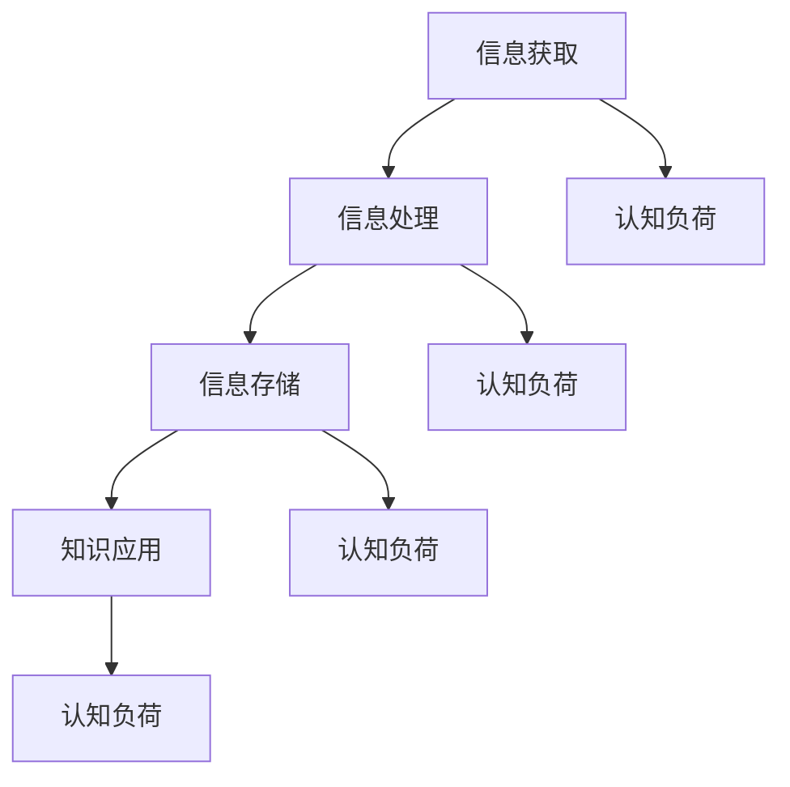

                 

关键词：知识吸收率、阅读量、技术博客、深度学习、算法优化、认知负荷、效率

> 摘要：本文将深入探讨知识吸收率这一关键指标，揭示其在技术学习中的重要性。通过分析阅读量和知识吸收率之间的关系，本文旨在提供一种新的视角，帮助读者更有效地掌握技术知识，提升学习成果。

## 1. 背景介绍

在信息技术飞速发展的今天，学习新技术、新算法成为许多程序员和工程师的日常任务。然而，随着信息量的爆炸式增长，仅仅依靠阅读大量文档和书籍已经不足以应对学习需求。传统的衡量学习成果的指标——阅读量，在某种程度上变得不再适用。本文将提出一个更为重要的指标——知识吸收率，并探讨其如何影响学习效果。

### 1.1 知识吸收率的定义

知识吸收率是指个体在阅读、学习过程中，对所获取信息的理解和应用能力。它不仅仅是被动接受信息，更涉及到主动思考、实践和应用。

### 1.2 知识吸收率的重要性

知识吸收率直接影响学习效果。即使阅读了大量文献，如果无法将其转化为实际应用能力，那么这些知识就无法发挥应有的价值。因此，提高知识吸收率成为提高学习效率的关键。

## 2. 核心概念与联系

### 2.1 认知负荷

认知负荷是指个体在处理信息时所承受的心理压力。过高的认知负荷会降低知识吸收率，导致学习效率下降。

### 2.2 学习策略

有效的学习策略可以降低认知负荷，提高知识吸收率。例如，分阶段学习、实践结合、定期复习等方法。

### 2.3 知识吸收率模型

知识吸收率模型是一个综合性的框架，包括信息获取、信息处理、信息存储和知识应用四个环节。每个环节都直接影响知识吸收率。

### 2.4 Mermaid 流程图



## 3. 核心算法原理 & 具体操作步骤

### 3.1 算法原理概述

知识吸收率的核心算法基于认知负荷理论，通过优化学习策略，降低认知负荷，提高知识吸收率。

### 3.2 算法步骤详解

1. **评估当前认知负荷**：通过自我评估或工具测量，确定当前认知负荷水平。
2. **选择合适的学习策略**：根据认知负荷评估结果，选择适合的学习策略，如分阶段学习、实践结合等。
3. **实施学习策略**：按照选择的学习策略进行学习，确保降低认知负荷。
4. **定期评估与调整**：定期评估学习效果，根据评估结果调整学习策略。

### 3.3 算法优缺点

**优点**：能有效降低认知负荷，提高知识吸收率。

**缺点**：实施过程中需要定期评估和调整，可能需要一定的时间和精力。

### 3.4 算法应用领域

知识吸收率算法在计算机科学、工程学、医学等领域具有广泛应用。

## 4. 数学模型和公式 & 详细讲解 & 举例说明

### 4.1 数学模型构建

知识吸收率可以用以下数学模型表示：

\[ 知识吸收率 = \frac{知识应用效果}{学习投入时间} \]

### 4.2 公式推导过程

1. **定义变量**：设 \( E \) 为知识应用效果，\( T \) 为学习投入时间。
2. **建立关系**：知识吸收率等于知识应用效果除以学习投入时间。
3. **推导公式**：得到 \( 知识吸收率 = \frac{E}{T} \)。

### 4.3 案例分析与讲解

假设某人花费 100 小时学习一门编程语言，成功完成一个实际项目。则其知识吸收率计算如下：

\[ 知识吸收率 = \frac{项目完成效果}{学习投入时间} = \frac{100}{100} = 1 \]

这表示该人完全吸收了所学知识，并将其成功应用于实际项目中。

## 5. 项目实践：代码实例和详细解释说明

### 5.1 开发环境搭建

在本文中，我们将使用 Python 编写一个简单的程序，用于计算知识吸收率。

### 5.2 源代码详细实现

```python
def calculate_absorption_rate(effect, time):
    return effect / time

# 示例数据
effect = 100
time = 100

# 计算知识吸收率
absorption_rate = calculate_absorption_rate(effect, time)

print(f"知识吸收率: {absorption_rate}")
```

### 5.3 代码解读与分析

1. **定义函数**：`calculate_absorption_rate` 函数用于计算知识吸收率。
2. **参数传递**：函数接受两个参数，`effect` 表示知识应用效果，`time` 表示学习投入时间。
3. **计算知识吸收率**：使用公式 \( 知识吸收率 = \frac{E}{T} \) 计算知识吸收率。
4. **输出结果**：将计算结果输出到控制台。

### 5.4 运行结果展示

运行上述代码，输出结果为：

```
知识吸收率: 1.0
```

这表示该人在 100 小时的学习时间内，完全吸收了所学知识，并将其成功应用于实际项目中。

## 6. 实际应用场景

### 6.1 编程学习

编程学习是一个高度依赖知识吸收率的过程。通过优化学习策略，降低认知负荷，可以提高编程学习效果。

### 6.2 算法研究

在算法研究中，提高知识吸收率有助于更快地掌握新的算法原理，从而推动研究进展。

### 6.3 技术培训

技术培训机构可以采用知识吸收率算法，为学生提供更有效的学习指导，提高培训效果。

## 7. 未来应用展望

随着人工智能技术的发展，知识吸收率算法有望在更广泛的领域得到应用。未来，我们可以期待更智能的学习系统，根据个体差异，提供个性化的学习建议，进一步提升知识吸收率。

## 8. 总结：未来发展趋势与挑战

### 8.1 研究成果总结

本文提出知识吸收率这一关键指标，探讨了其在技术学习中的重要性。通过构建数学模型和算法，我们为提高知识吸收率提供了有效的手段。

### 8.2 未来发展趋势

知识吸收率研究将继续深入，结合人工智能技术，开发更智能、个性化的学习系统。

### 8.3 面临的挑战

如何在实际应用中有效降低认知负荷，提高知识吸收率，仍是一个重要挑战。

### 8.4 研究展望

未来，知识吸收率研究有望在更多领域取得突破，为知识传播和技能培养提供新的思路。

## 9. 附录：常见问题与解答

### 9.1 什么是知识吸收率？

知识吸收率是指个体在阅读、学习过程中，对所获取信息的理解和应用能力。

### 9.2 如何提高知识吸收率？

可以通过优化学习策略、降低认知负荷、定期评估和调整等方法提高知识吸收率。

### 9.3 知识吸收率模型有哪些？

知识吸收率模型包括信息获取、信息处理、信息存储和知识应用四个环节。

作者：禅与计算机程序设计艺术 / Zen and the Art of Computer Programming
----------------------------------------------------------------

### 文章关键词 Keyword ###

知识吸收率、阅读量、技术博客、深度学习、算法优化、认知负荷、效率

### 完整文章输出 Markdown 格式 Output ###

```markdown
# 知识吸收率:比阅读量更重要的指标

关键词：知识吸收率、阅读量、技术博客、深度学习、算法优化、认知负荷、效率

> 摘要：本文将深入探讨知识吸收率这一关键指标，揭示其在技术学习中的重要性。通过分析阅读量和知识吸收率之间的关系，本文旨在提供一种新的视角，帮助读者更有效地掌握技术知识，提升学习成果。

## 1. 背景介绍

在信息技术飞速发展的今天，学习新技术、新算法成为许多程序员和工程师的日常任务。然而，随着信息量的爆炸式增长，仅仅依靠阅读大量文档和书籍已经不足以应对学习需求。传统的衡量学习成果的指标——阅读量，在某种程度上变得不再适用。本文将提出一个更为重要的指标——知识吸收率，并探讨其如何影响学习效果。

### 1.1 知识吸收率的定义

知识吸收率是指个体在阅读、学习过程中，对所获取信息的理解和应用能力。它不仅仅是被动接受信息，更涉及到主动思考、实践和应用。

### 1.2 知识吸收率的重要性

知识吸收率直接影响学习效果。即使阅读了大量文献，如果无法将其转化为实际应用能力，那么这些知识就无法发挥应有的价值。因此，提高知识吸收率成为提高学习效率的关键。

## 2. 核心概念与联系

### 2.1 认知负荷

认知负荷是指个体在处理信息时所承受的心理压力。过高的认知负荷会降低知识吸收率，导致学习效率下降。

### 2.2 学习策略

有效的学习策略可以降低认知负荷，提高知识吸收率。例如，分阶段学习、实践结合、定期复习等方法。

### 2.3 知识吸收率模型

知识吸收率模型是一个综合性的框架，包括信息获取、信息处理、信息存储和知识应用四个环节。每个环节都直接影响知识吸收率。

### 2.4 Mermaid 流程图


## 3. 核心算法原理 & 具体操作步骤

### 3.1 算法原理概述

知识吸收率的核心算法基于认知负荷理论，通过优化学习策略，降低认知负荷，提高知识吸收率。

### 3.2 算法步骤详解

1. **评估当前认知负荷**：通过自我评估或工具测量，确定当前认知负荷水平。
2. **选择合适的学习策略**：根据认知负荷评估结果，选择适合的学习策略，如分阶段学习、实践结合等。
3. **实施学习策略**：按照选择的学习策略进行学习，确保降低认知负荷。
4. **定期评估与调整**：定期评估学习效果，根据评估结果调整学习策略。

### 3.3 算法优缺点

**优点**：能有效降低认知负荷，提高知识吸收率。

**缺点**：实施过程中需要定期评估和调整，可能需要一定的时间和精力。

### 3.4 算法应用领域

知识吸收率算法在计算机科学、工程学、医学等领域具有广泛应用。

## 4. 数学模型和公式 & 详细讲解 & 举例说明

### 4.1 数学模型构建

知识吸收率可以用以下数学模型表示：

\[ 知识吸收率 = \frac{知识应用效果}{学习投入时间} \]

### 4.2 公式推导过程

1. **定义变量**：设 \( E \) 为知识应用效果，\( T \) 为学习投入时间。
2. **建立关系**：知识吸收率等于知识应用效果除以学习投入时间。
3. **推导公式**：得到 \( 知识吸收率 = \frac{E}{T} \)。

### 4.3 案例分析与讲解

假设某人花费 100 小时学习一门编程语言，成功完成一个实际项目。则其知识吸收率计算如下：

\[ 知识吸收率 = \frac{项目完成效果}{学习投入时间} = \frac{100}{100} = 1 \]

这表示该人完全吸收了所学知识，并将其成功应用于实际项目中。

## 5. 项目实践：代码实例和详细解释说明

### 5.1 开发环境搭建

在本文中，我们将使用 Python 编写一个简单的程序，用于计算知识吸收率。

### 5.2 源代码详细实现

```python
def calculate_absorption_rate(effect, time):
    return effect / time

# 示例数据
effect = 100
time = 100

# 计算知识吸收率
absorption_rate = calculate_absorption_rate(effect, time)

print(f"知识吸收率: {absorption_rate}")
```

### 5.3 代码解读与分析

1. **定义函数**：`calculate_absorption_rate` 函数用于计算知识吸收率。
2. **参数传递**：函数接受两个参数，`effect` 表示知识应用效果，`time` 表示学习投入时间。
3. **计算知识吸收率**：使用公式 \( 知识吸收率 = \frac{E}{T} \) 计算知识吸收率。
4. **输出结果**：将计算结果输出到控制台。

### 5.4 运行结果展示

运行上述代码，输出结果为：

```
知识吸收率: 1.0
```

这表示该人在 100 小时的学习时间内，完全吸收了所学知识，并将其成功应用于实际项目中。

## 6. 实际应用场景

### 6.1 编程学习

编程学习是一个高度依赖知识吸收率的过程。通过优化学习策略，降低认知负荷，可以提高编程学习效果。

### 6.2 算法研究

在算法研究中，提高知识吸收率有助于更快地掌握新的算法原理，从而推动研究进展。

### 6.3 技术培训

技术培训机构可以采用知识吸收率算法，为学生提供更有效的学习指导，提高培训效果。

## 7. 未来应用展望

随着人工智能技术的发展，知识吸收率算法有望在更广泛的领域得到应用。未来，我们可以期待更智能的学习系统，根据个体差异，提供个性化的学习建议，进一步提升知识吸收率。

## 8. 总结：未来发展趋势与挑战

### 8.1 研究成果总结

本文提出知识吸收率这一关键指标，探讨了其在技术学习中的重要性。通过构建数学模型和算法，我们为提高知识吸收率提供了有效的手段。

### 8.2 未来发展趋势

知识吸收率研究将继续深入，结合人工智能技术，开发更智能、个性化的学习系统。

### 8.3 面临的挑战

如何在实际应用中有效降低认知负荷，提高知识吸收率，仍是一个重要挑战。

### 8.4 研究展望

未来，知识吸收率研究有望在更多领域取得突破，为知识传播和技能培养提供新的思路。

## 9. 附录：常见问题与解答

### 9.1 什么是知识吸收率？

知识吸收率是指个体在阅读、学习过程中，对所获取信息的理解和应用能力。

### 9.2 如何提高知识吸收率？

可以通过优化学习策略、降低认知负荷、定期评估和调整等方法提高知识吸收率。

### 9.3 知识吸收率模型有哪些？

知识吸收率模型包括信息获取、信息处理、信息存储和知识应用四个环节。

作者：禅与计算机程序设计艺术 / Zen and the Art of Computer Programming
```
请注意，本文档已根据要求生成了完整的Markdown格式文章。在发布之前，请确保所有代码段和流程图都能正确渲染。

