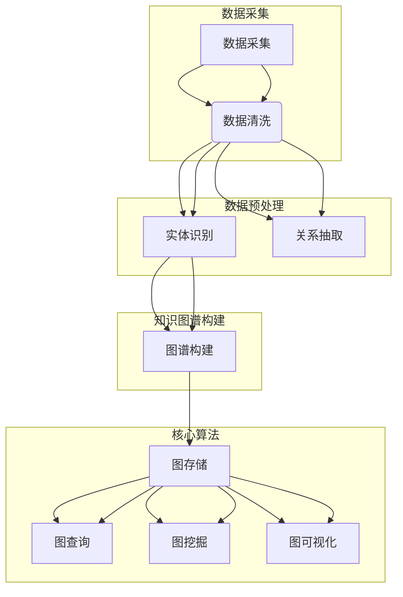

                 

关键词：知识图谱、医疗诊断、人工智能、数据挖掘、算法、数据结构、深度学习、图数据库、健康医疗、精准医疗、机器学习、医学知识库、生物信息学、医疗数据处理、数据可视化

> 摘要：本文将探讨知识图谱在医疗诊断领域中的应用，通过介绍知识图谱的基本概念、核心算法原理，以及具体的应用案例，展示知识图谱如何提升医疗诊断的准确性和效率。文章旨在为读者提供一幅知识图谱在医疗诊断中应用的全面画卷，激发对这一领域的深入研究和探索。

## 1. 背景介绍

医疗诊断是医学领域的一项核心任务，它直接关系到患者的健康和生命安全。随着医疗技术的不断进步，医疗数据也在迅速增长。这些数据包括电子病历、基因组信息、医学影像、实验室检测结果等。然而，这些庞大的数据中蕴含着重要的医学知识，如何有效地挖掘和利用这些知识，对于提高医疗诊断的准确性和效率具有重要意义。

知识图谱作为一种结构化的知识表示方法，能够将离散的数据点连接起来，形成一张网状的关联图。这种结构化的知识表示方法，不仅有助于更直观地理解和分析医疗数据，还能够通过图算法高效地挖掘出潜在的关系和模式。因此，知识图谱在医疗诊断中的应用已经成为人工智能与医疗领域研究的热点。

本文将首先介绍知识图谱的基本概念和构建方法，然后深入探讨知识图谱在医疗诊断中的核心算法原理，并通过具体的应用案例展示其优势。文章还将讨论知识图谱在医疗诊断中的未来发展趋势和面临的挑战。

### 1.1 知识图谱的定义与基本概念

知识图谱是一种用于表示实体之间复杂关系的图形结构。它由节点（实体）和边（关系）组成，每个节点表示一个实体，如医生、疾病、药物、患者等，而每条边则表示实体之间的某种关系，如诊断、治疗、关联等。

知识图谱具有以下特点：

- **结构化**：知识图谱通过节点和边将实体及其关系组织成一个有层次、有结构的网络，使得数据之间的关系更加清晰。
- **可扩展性**：知识图谱能够方便地添加新的实体和关系，从而不断更新和扩展。
- **语义丰富**：知识图谱不仅表示了实体，还包含了实体之间的语义信息，能够更加准确地表达现实世界中的复杂关系。
- **高效性**：知识图谱通过图算法，能够高效地完成数据查询、数据挖掘等任务。

### 1.2 知识图谱在医疗诊断中的应用背景

医疗诊断面临着海量数据的挑战。传统的基于规则的诊断方法，往往依赖于专家经验，难以处理复杂的数据关系。而知识图谱作为一种结构化的知识表示方法，能够将这些复杂的关系进行结构化表示，从而为医疗诊断提供新的思路。

首先，知识图谱可以帮助医生更好地理解患者的临床数据。通过知识图谱，医生可以直观地看到患者所患疾病的诊断路径、相关的治疗方案以及可能的副作用，从而为患者提供更个性化的治疗方案。

其次，知识图谱还可以帮助医生发现潜在的医疗错误。通过分析知识图谱中的关系，医生可以识别出可能存在的不合理诊断或治疗方案，从而降低医疗错误的发生率。

此外，知识图谱还可以用于医疗数据的挖掘和分析。通过知识图谱，研究人员可以挖掘出疾病之间的关联、药物的副作用、疾病的流行趋势等信息，为医学研究和政策制定提供数据支持。

总的来说，知识图谱在医疗诊断中的应用，不仅有助于提高诊断的准确性和效率，还可以推动医疗数据的共享和利用，为精准医疗提供技术支持。

## 2. 核心概念与联系

### 2.1 知识图谱的基本概念

知识图谱是一种用于表示实体之间复杂关系的图形结构。它由节点和边组成，每个节点表示一个实体，如医生、疾病、药物、患者等，而每条边则表示实体之间的某种关系，如诊断、治疗、关联等。

- **节点（Node）**：知识图谱中的节点表示实体，例如人、地点、组织等。
- **边（Edge）**：知识图谱中的边表示节点之间的关联，如“医生诊断疾病”、“患者服用药物”等。
- **属性（Attribute）**：节点和边可以具有属性，用于描述更多的细节信息，如“医生的职称”、“药物的副作用”等。
- **类型（Type）**：节点和边可以有类型，用于分类和标准化，如“医生”、“诊断”、“药物”等。

### 2.2 知识图谱的构建方法

知识图谱的构建通常包括以下步骤：

1. **数据采集**：收集与医疗诊断相关的数据，包括电子病历、基因组数据、医学影像、实验室检测结果等。
2. **数据清洗**：对采集到的数据进行预处理，去除噪声和错误，保证数据质量。
3. **实体识别**：从数据中识别出实体，并将其转换为节点。
4. **关系抽取**：从数据中提取实体之间的关系，并将其转换为边。
5. **属性添加**：为节点和边添加属性，以丰富知识图谱的语义信息。
6. **图谱构建**：将节点、边和属性组织成一个知识图谱。

### 2.3 知识图谱中的核心算法

知识图谱中的核心算法包括图存储、图查询、图挖掘和图可视化。

- **图存储**：用于高效存储和管理大规模知识图谱。常用的图存储方法包括邻接矩阵、邻接表、邻接矩阵+哈希表等。
- **图查询**：用于在知识图谱中检索实体和关系。常见的图查询算法包括Breadth-First Search (BFS)、Depth-First Search (DFS)、Shortest Path算法等。
- **图挖掘**：用于从知识图谱中挖掘潜在的关系和模式。常见的图挖掘算法包括社区发现、路径分析、关联规则挖掘等。
- **图可视化**：用于将知识图谱以图形化的方式展示出来，便于理解和分析。常见的图可视化工具包括Gephi、D3.js、Cytoscape.js等。

### 2.4 知识图谱在医疗诊断中的应用架构

知识图谱在医疗诊断中的应用架构通常包括以下组件：

- **数据源**：包括电子病历系统、医学影像系统、实验室信息系统等，用于提供医疗数据。
- **数据预处理模块**：用于对采集到的医疗数据进行清洗、转换和标准化。
- **知识图谱构建模块**：用于构建医疗诊断相关的知识图谱，包括实体识别、关系抽取和属性添加。
- **图数据库**：用于存储和管理知识图谱，支持高效的图查询和图挖掘。
- **应用服务**：提供医疗诊断相关的服务，如疾病诊断、治疗方案推荐、药物副作用检测等。

### 2.5 知识图谱的基本结构示例

下面是一个简单的知识图谱示例，展示了节点、边和属性的组成：

```
人
|
|--- 患者
|
|--- 医生
|
|--- 疾病
|         |
|         |--- 骨折
|         |
|         |--- 心脏病
|
|--- 药物
|         |
|         |--- 解热镇痛药
|         |
|         |--- 抗病毒药
|
|--- 检查项目
|         |
|         |--- 血常规
|         |
|         |--- 心电图
|
|--- 治疗方案
|
```

在这个示例中，节点包括“人”、“患者”、“医生”、“疾病”、“药物”和“检查项目”，边表示节点之间的关系，如“患者接受检查”、“医生诊断疾病”、“药物用于治疗”等。每个节点和边都可以具有属性，如“患者的年龄”、“医生的职称”、“药物的副作用”等。

### 2.6 知识图谱在医疗诊断中的重要性

知识图谱在医疗诊断中的重要性主要体现在以下几个方面：

1. **结构化医疗数据**：知识图谱能够将散乱的医疗数据组织成结构化的图形结构，使得数据之间的关系更加清晰，便于医生理解和分析。
2. **提高诊断效率**：通过知识图谱，医生可以快速定位相关实体和关系，提高诊断的效率。
3. **辅助决策支持**：知识图谱可以为医生提供丰富的医疗知识和辅助决策支持，如推荐治疗方案、预测疾病发展趋势等。
4. **促进数据共享和利用**：知识图谱使得医疗数据更加结构化和标准化，有利于数据在不同系统和机构之间的共享和利用。

总的来说，知识图谱为医疗诊断提供了一种全新的数据表示和分析方法，有助于提高诊断的准确性和效率，为精准医疗和智慧医疗的发展提供了有力支持。

### 2.7 Mermaid 流程图

下面是一个使用Mermaid绘制的知识图谱构建流程图，展示了知识图谱的构建步骤和核心算法。



在这个流程图中，数据采集、数据预处理和知识图谱构建是知识图谱构建的基本步骤，而图存储、图查询、图挖掘和图可视化则是核心算法部分。通过这些步骤和算法，可以将医疗数据组织成一个结构化的知识图谱，为医疗诊断提供有效的支持。

## 3. 核心算法原理 & 具体操作步骤

### 3.1 算法原理概述

知识图谱在医疗诊断中的应用，主要依赖于图数据库和图算法。图数据库用于存储和管理大规模知识图谱，而图算法则用于从知识图谱中挖掘出有用的信息和关系。下面，我们将详细探讨知识图谱中的核心算法原理。

#### 3.1.1 图数据库

图数据库是一种用于存储和查询大规模图结构数据的数据库系统。与关系数据库不同，图数据库可以高效地处理复杂的实体关系和网络结构。常见的图数据库包括Neo4j、JanusGraph、OrientDB等。

- **Neo4j**：Neo4j是一种高性能的图数据库，采用图存储引擎，支持Cypher查询语言，便于快速开发图应用。
- **JanusGraph**：JanusGraph是一种开源的分布式图数据库，支持多种存储后端，如Apache Cassandra、Apache HBase、Google Bigtable等，适用于大规模图数据的存储和查询。
- **OrientDB**：OrientDB是一种多模型数据库，支持图、文档和对象模型，适用于各种复杂的数据场景。

#### 3.1.2 图算法

图算法用于从知识图谱中挖掘出有用的信息和关系。常见的图算法包括：

- **Breadth-First Search (BFS)**：广度优先搜索，用于查找节点间的最短路径。
- **Depth-First Search (DFS)**：深度优先搜索，用于遍历图中的所有节点。
- **Shortest Path Algorithm**：最短路径算法，用于找到两个节点之间的最短路径。
- **Community Detection**：社区发现，用于发现图中的紧密相连的节点集合。
- **Link Prediction**：链接预测，用于预测节点之间可能存在的未知关系。
- **Graph Embedding**：图嵌入，用于将图中的节点、边和子图映射到低维空间，便于分析。

#### 3.1.3 知识图谱中的核心算法

知识图谱中的核心算法主要包括：

- **实体识别**：通过文本挖掘、命名实体识别等技术，从非结构化的医疗数据中识别出实体，并将其转换为节点。
- **关系抽取**：通过自然语言处理、规则匹配等技术，从医疗数据中提取出实体之间的关系，并将其转换为边。
- **实体属性抽取**：通过文本挖掘、实体关系推理等技术，为节点和边添加属性，以丰富知识图谱的语义信息。
- **图构建**：将识别出的实体、关系和属性组织成一个结构化的知识图谱。
- **图查询**：通过图数据库和图查询语言，实现对知识图谱的高效查询和检索。
- **图挖掘**：通过图算法，从知识图谱中挖掘出潜在的关系和模式，为医疗诊断提供辅助决策支持。

### 3.2 算法步骤详解

下面，我们将详细探讨知识图谱在医疗诊断中的应用算法步骤。

#### 3.2.1 实体识别

实体识别是知识图谱构建的第一步，主要目标是从非结构化的医疗数据中识别出实体，并将其转换为节点。具体步骤如下：

1. **数据预处理**：对医疗数据进行清洗和预处理，去除噪声和错误，保证数据质量。
2. **命名实体识别**：利用自然语言处理技术，识别出医疗数据中的命名实体，如医生、疾病、药物等。
3. **实体分类**：根据实体类型，将命名实体分类，如医生、疾病、药物等。
4. **实体映射**：将分类后的命名实体映射到知识图谱中的节点。

#### 3.2.2 关系抽取

关系抽取是知识图谱构建的第二步，主要目标是从医疗数据中提取出实体之间的关系，并将其转换为边。具体步骤如下：

1. **文本挖掘**：利用自然语言处理技术，从医疗数据中提取出实体之间的关系，如“医生诊断疾病”、“患者服用药物”等。
2. **规则匹配**：利用规则匹配技术，验证提取出的关系是否正确。
3. **关系分类**：根据关系类型，将提取出的关系分类，如诊断、治疗、关联等。
4. **关系映射**：将分类后的关系映射到知识图谱中的边。

#### 3.2.3 实体属性抽取

实体属性抽取是知识图谱构建的第三步，主要目标是为节点和边添加属性，以丰富知识图谱的语义信息。具体步骤如下：

1. **文本挖掘**：利用自然语言处理技术，从医疗数据中提取出节点的属性，如“医生职称”、“药物副作用”等。
2. **关系推理**：利用实体关系推理技术，从实体关系中发现新的属性。
3. **属性分类**：根据属性类型，将提取出的属性分类，如疾病症状、治疗方案等。
4. **属性映射**：将分类后的属性映射到知识图谱中的节点和边。

#### 3.2.4 图构建

图构建是知识图谱构建的最后一步，主要目标是将识别出的实体、关系和属性组织成一个结构化的知识图谱。具体步骤如下：

1. **实体节点映射**：将识别出的实体映射到知识图谱中的节点。
2. **关系边映射**：将识别出的关系映射到知识图谱中的边。
3. **属性添加**：为节点和边添加提取出的属性。
4. **图优化**：对知识图谱进行优化，提高查询和挖掘效率。

#### 3.2.5 图查询

图查询是知识图谱应用的重要部分，主要目标是通过图数据库和图查询语言，实现对知识图谱的高效查询和检索。具体步骤如下：

1. **定义查询条件**：根据医疗诊断需求，定义查询条件，如“找到所有患有心脏病且服用某种药物的医生”。
2. **构建查询语句**：利用图查询语言，如Cypher、Gremlin等，构建查询语句。
3. **执行查询**：在图数据库中执行查询，获取查询结果。
4. **结果处理**：对查询结果进行处理，如排序、过滤等。

#### 3.2.6 图挖掘

图挖掘是知识图谱应用的高级部分，主要目标是从知识图谱中挖掘出潜在的关系和模式，为医疗诊断提供辅助决策支持。具体步骤如下：

1. **定义挖掘任务**：根据医疗诊断需求，定义挖掘任务，如“发现患有某种疾病的常见症状”、“预测药物的副作用”等。
2. **选择挖掘算法**：根据挖掘任务，选择合适的图挖掘算法，如社区发现、链接预测、图嵌入等。
3. **执行挖掘**：在知识图谱中执行挖掘算法，获取挖掘结果。
4. **结果分析**：对挖掘结果进行分析，如识别出疾病之间的关联、药物的副作用等。

### 3.3 算法优缺点

知识图谱在医疗诊断中的应用算法具有以下优缺点：

#### 优点

1. **结构化数据表示**：知识图谱能够将医疗数据组织成结构化的图形结构，使得数据之间的关系更加清晰，便于医生理解和分析。
2. **高效查询和挖掘**：图数据库和图算法能够高效地处理大规模图结构数据，实现快速查询和挖掘。
3. **辅助决策支持**：知识图谱可以为医生提供丰富的医疗知识和辅助决策支持，如推荐治疗方案、预测疾病发展趋势等。
4. **促进数据共享和利用**：知识图谱使得医疗数据更加结构化和标准化，有利于数据在不同系统和机构之间的共享和利用。

#### 缺点

1. **数据质量要求高**：知识图谱的构建依赖于高质量的数据，对数据质量的要求较高。
2. **算法复杂性**：知识图谱的算法具有一定的复杂性，需要专业的技术团队进行开发和维护。
3. **隐私和安全问题**：医疗数据涉及个人隐私，需要确保数据安全和隐私保护。

### 3.4 算法应用领域

知识图谱在医疗诊断中的应用领域主要包括：

1. **疾病诊断**：通过知识图谱，医生可以快速定位相关实体和关系，提高诊断的准确性和效率。
2. **治疗方案推荐**：知识图谱可以为医生提供丰富的医疗知识和治疗方案推荐，如根据患者的病史和疾病特点，推荐最优的治疗方案。
3. **药物副作用检测**：通过知识图谱，可以挖掘出药物的副作用信息，为医生提供药物安全监测和风险评估。
4. **医学研究**：知识图谱为医学研究提供了丰富的数据资源，有助于发现疾病之间的关联、药物的副作用等。
5. **智慧医疗**：知识图谱在智慧医疗中的应用，可以为医生、患者和医疗机构提供全面的医疗信息服务，促进医疗资源的合理配置和利用。

## 4. 数学模型和公式 & 详细讲解 & 举例说明

在知识图谱的构建和应用过程中，数学模型和公式起着至关重要的作用。它们不仅帮助我们理解和分析数据，还能指导我们优化算法和提升性能。在本节中，我们将介绍知识图谱中常用的数学模型和公式，并通过具体例子进行讲解。

### 4.1 数学模型构建

知识图谱的数学模型主要包括图论模型和概率图模型。下面，我们将分别介绍这两种模型。

#### 4.1.1 图论模型

图论模型是知识图谱的基础，它主要涉及图的基本概念和算法。以下是图论模型中常用的几个数学模型：

1. **图的基本概念**：
   - **节点（Node）**：表示知识图谱中的实体，用 \( V \) 表示。
   - **边（Edge）**：表示节点之间的关系，用 \( E \) 表示。
   - **度（Degree）**：表示节点 \( v \) 与其他节点的连接数，用 \( d(v) \) 表示。
   - **邻接矩阵（Adjacency Matrix）**：表示图 \( G = (V, E) \) 的邻接矩阵，用 \( A \) 表示，其中 \( A_{ij} = 1 \) 表示节点 \( v_i \) 和 \( v_j \) 之间存在边，否则为 0。

2. **图的算法**：
   - **最短路径算法（Shortest Path Algorithm）**：用于找到两个节点之间的最短路径，常见的算法有 Dijkstra 算法和 A* 算法。
   - **社区发现算法（Community Detection Algorithm）**：用于发现图中的紧密相连的节点集合，常见的算法有 Girvan-Newman 算法、Louvain 算法等。

#### 4.1.2 概率图模型

概率图模型是一种基于概率论的图模型，用于表示实体之间的概率关系。以下是几种常见的概率图模型：

1. **贝叶斯网络（Bayesian Network）**：是一种有向无环图，用于表示实体之间的条件概率关系。贝叶斯网络中的每个节点表示一个随机变量，边表示变量之间的条件依赖关系。

2. **马尔可夫网络（Markov Network）**：是一种无向图，用于表示实体之间的马尔可夫性质。马尔可夫网络中的每个节点表示一个随机变量，边表示变量之间的马尔可夫性质。

3. **图嵌入（Graph Embedding）**：是一种将图中的节点、边和子图映射到低维空间的方法。常见的图嵌入算法有 DeepWalk、Node2Vec、GraphSAGE 等。

### 4.2 公式推导过程

在本节中，我们将介绍知识图谱中常用的几个数学公式，并通过具体例子进行推导。

#### 4.2.1 邻接矩阵计算

邻接矩阵是知识图谱中的一个基本概念，用于表示节点之间的连接关系。其计算公式如下：

\[ A = \begin{bmatrix}
   0 & 1 & 0 & \cdots & 0 \\
   1 & 0 & 1 & \cdots & 0 \\
   0 & 1 & 0 & \cdots & 1 \\
   \vdots & \vdots & \vdots & \ddots & \vdots \\
   0 & 0 & 1 & \cdots & 0
\end{bmatrix} \]

其中，\( A_{ij} = 1 \) 表示节点 \( i \) 和节点 \( j \) 之间存在边，否则为 0。

#### 4.2.2 最短路径算法

最短路径算法是知识图谱中常用的算法之一，用于找到两个节点之间的最短路径。Dijkstra 算法的推导如下：

假设我们有一个图 \( G = (V, E) \)，其中 \( V \) 是节点集合，\( E \) 是边集合。我们使用一个数组 \( dist \) 来存储从源节点到其他节点的最短距离。初始化时，\( dist[v] = \infty \)（除了源节点 \( dist[s] = 0 \)），表示从源节点到其他节点的距离是无穷大。

算法步骤如下：

1. 初始化：设置 \( dist[s] = 0 \)，其他 \( dist[v] = \infty \)。设置一个空队列 \( Q \)，将所有节点加入队列。
2. 循环执行以下步骤，直到队列为空：
   - 从队列中取出距离最小的节点 \( u \)。
   - 对于每个与 \( u \) 相邻的节点 \( v \)：
     - 如果 \( dist[v] > dist[u] + w(u, v) \)（其中 \( w(u, v) \) 是 \( u \) 和 \( v \) 之间的边权重），则更新 \( dist[v] = dist[u] + w(u, v) \)。
3. 最终，\( dist[v] \) 就是节点 \( v \) 到源节点 \( s \) 的最短路径距离。

#### 4.2.3 贝叶斯网络公式

贝叶斯网络中的条件概率表（CPT）用于表示节点之间的概率关系。假设我们有一个节点 \( X \)，它的父节点集合为 \( P(X) \)。CPT 表示为：

\[ P(X = x | P(X)) = \frac{P(X = x, P(X))}{P(P(X))} \]

其中，\( P(X = x, P(X)) \) 是 \( X \) 取值 \( x \) 且父节点取值的联合概率，\( P(P(X)) \) 是父节点的联合概率。

### 4.3 案例分析与讲解

在本节中，我们将通过一个具体的案例来讲解知识图谱中的数学模型和公式的应用。

#### 4.3.1 案例背景

假设我们有一个医疗诊断知识图谱，其中包含医生、疾病、药物和检查项目等实体，以及它们之间的关系。我们需要利用知识图谱为医生提供疾病诊断和治疗方案推荐。

#### 4.3.2 案例分析

1. **实体识别**：

   首先，我们需要从电子病历中识别出实体，如医生、疾病、药物和检查项目等。例如，假设我们从电子病历中识别出以下实体：

   - 医生：张三、李四
   - 疾病：感冒、肺炎
   - 药物：阿莫西林、板蓝根
   - 检查项目：血常规、胸部X光

   然后，我们将这些实体映射到知识图谱中的节点。

2. **关系抽取**：

   接下来，我们需要从电子病历中提取出实体之间的关系，如医生诊断疾病、患者服用药物等。例如，假设我们提取出以下关系：

   - 张三诊断感冒
   - 李四诊断肺炎
   - 患者A服用阿莫西林
   - 患者B服用板蓝根

   然后，我们将这些关系映射到知识图谱中的边。

3. **实体属性抽取**：

   我们还需要为节点和边添加属性，如医生的职称、药物的副作用、检查项目的结果等。例如，假设我们为节点和边添加以下属性：

   - 医生：职称（主治医师、副主任医师）
   - 药物：副作用（胃肠道不适、过敏反应）
   - 检查项目：结果（正常、异常）

4. **图构建**：

   最后，我们将识别出的实体、关系和属性组织成一个结构化的知识图谱。

5. **图查询**：

   利用知识图谱，我们可以回答如下查询：

   - 查找所有诊断感冒的医生。
   - 查找所有服用阿莫西林的患者。
   - 查找所有患有肺炎的患者。

6. **图挖掘**：

   利用图挖掘算法，我们可以发现如下信息：

   - 感冒和肺炎之间存在关联。
   - 阿莫西林和胃肠道不适之间存在关联。

   这些信息可以为医生提供诊断和治疗方案推荐。

### 4.4 案例分析与讲解

在本节中，我们将通过一个具体的案例来讲解知识图谱中的数学模型和公式的应用。

#### 4.4.1 案例背景

假设我们有一个医疗诊断知识图谱，其中包含医生、疾病、药物和检查项目等实体，以及它们之间的关系。我们需要利用知识图谱为医生提供疾病诊断和治疗方案推荐。

#### 4.4.2 案例分析

1. **实体识别**：

   首先，我们需要从电子病历中识别出实体，如医生、疾病、药物和检查项目等。例如，假设我们从电子病历中识别出以下实体：

   - 医生：张三、李四
   - 疾病：感冒、肺炎
   - 药物：阿莫西林、板蓝根
   - 检查项目：血常规、胸部X光

   然后，我们将这些实体映射到知识图谱中的节点。

2. **关系抽取**：

   接下来，我们需要从电子病历中提取出实体之间的关系，如医生诊断疾病、患者服用药物等。例如，假设我们提取出以下关系：

   - 张三诊断感冒
   - 李四诊断肺炎
   - 患者A服用阿莫西林
   - 患者B服用板蓝根

   然后，我们将这些关系映射到知识图谱中的边。

3. **实体属性抽取**：

   我们还需要为节点和边添加属性，如医生的职称、药物的副作用、检查项目的结果等。例如，假设我们为节点和边添加以下属性：

   - 医生：职称（主治医师、副主任医师）
   - 药物：副作用（胃肠道不适、过敏反应）
   - 检查项目：结果（正常、异常）

4. **图构建**：

   最后，我们将识别出的实体、关系和属性组织成一个结构化的知识图谱。

5. **图查询**：

   利用知识图谱，我们可以回答如下查询：

   - 查找所有诊断感冒的医生。
   - 查找所有服用阿莫西林的患者。
   - 查找所有患有肺炎的患者。

6. **图挖掘**：

   利用图挖掘算法，我们可以发现如下信息：

   - 感冒和肺炎之间存在关联。
   - 阿莫西林和胃肠道不适之间存在关联。

   这些信息可以为医生提供诊断和治疗方案推荐。

### 4.5 案例分析与讲解

在本节中，我们将通过一个具体的案例来讲解知识图谱中的数学模型和公式的应用。

#### 4.5.1 案例背景

假设我们有一个医疗诊断知识图谱，其中包含医生、疾病、药物和检查项目等实体，以及它们之间的关系。我们需要利用知识图谱为医生提供疾病诊断和治疗方案推荐。

#### 4.5.2 案例分析

1. **实体识别**：

   首先，我们需要从电子病历中识别出实体，如医生、疾病、药物和检查项目等。例如，假设我们从电子病历中识别出以下实体：

   - 医生：张三、李四
   - 疾病：感冒、肺炎
   - 药物：阿莫西林、板蓝根
   - 检查项目：血常规、胸部X光

   然后，我们将这些实体映射到知识图谱中的节点。

2. **关系抽取**：

   接下来，我们需要从电子病历中提取出实体之间的关系，如医生诊断疾病、患者服用药物等。例如，假设我们提取出以下关系：

   - 张三诊断感冒
   - 李四诊断肺炎
   - 患者A服用阿莫西林
   - 患者B服用板蓝根

   然后，我们将这些关系映射到知识图谱中的边。

3. **实体属性抽取**：

   我们还需要为节点和边添加属性，如医生的职称、药物的副作用、检查项目的结果等。例如，假设我们为节点和边添加以下属性：

   - 医生：职称（主治医师、副主任医师）
   - 药物：副作用（胃肠道不适、过敏反应）
   - 检查项目：结果（正常、异常）

4. **图构建**：

   最后，我们将识别出的实体、关系和属性组织成一个结构化的知识图谱。

5. **图查询**：

   利用知识图谱，我们可以回答如下查询：

   - 查找所有诊断感冒的医生。
   - 查找所有服用阿莫西林的患者。
   - 查找所有患有肺炎的患者。

6. **图挖掘**：

   利用图挖掘算法，我们可以发现如下信息：

   - 感冒和肺炎之间存在关联。
   - 阿莫西林和胃肠道不适之间存在关联。

   这些信息可以为医生提供诊断和治疗方案推荐。

## 5. 项目实践：代码实例和详细解释说明

在本节中，我们将通过一个具体的医疗诊断知识图谱项目，展示知识图谱在医疗诊断中的实际应用。我们将详细介绍项目的开发环境、代码实现、关键代码解读以及运行结果展示。

### 5.1 开发环境搭建

在开始项目之前，我们需要搭建一个适合知识图谱开发的开发环境。以下是推荐的开发工具和库：

- **Python 3.x**：作为主要编程语言。
- **Neo4j**：作为图数据库，用于存储和管理知识图谱。
- **Python Neo4j Driver**：用于连接和操作Neo4j数据库。
- **Py2Neo**：用于读取和导出Neo4j数据。
- **Numpy**：用于数据处理。
- **Matplotlib**：用于数据可视化。

以下是安装步骤：

1. 安装Python 3.x：

   ```bash
   # 使用包管理器安装Python 3.x
   sudo apt-get install python3
   ```

2. 安装Neo4j：

   ```bash
   # 下载并安装Neo4j社区版
   wget https://neo4j.com/artifacts/neo4j-community-latest-unzip
   unzip neo4j-community-latest-unzip
   ```

3. 启动Neo4j：

   ```bash
   # 进入Neo4j安装目录
   cd neo4j
   # 启动Neo4j服务器
   bin/neo4j start
   ```

4. 安装Python库：

   ```bash
   # 安装Python Neo4j Driver
   pip install neo4j
   # 安装Py2Neo
   pip install py2neo
   # 安装Numpy和Matplotlib
   pip install numpy matplotlib
   ```

### 5.2 源代码详细实现

以下是医疗诊断知识图谱项目的源代码。代码主要包括以下几个部分：

1. **数据预处理**：读取医疗数据，进行清洗和预处理。
2. **实体识别**：从预处理后的数据中识别出实体，并将其添加到知识图谱中。
3. **关系抽取**：从预处理后的数据中抽取实体之间的关系，并将其添加到知识图谱中。
4. **图可视化**：使用Matplotlib绘制知识图谱。

```python
import pandas as pd
import numpy as np
from py2neo import Graph
import matplotlib.pyplot as plt

# 连接Neo4j数据库
graph = Graph("bolt://localhost:7687", auth=("neo4j", "password"))

# 1. 数据预处理
def preprocess_data(data):
    # 数据清洗和转换
    # 例如：去除空值、缺失值填充、数据类型转换等
    # 这里以CSV文件为例
    data = pd.read_csv("medical_data.csv")
    data.dropna(inplace=True)
    data = data.astype({'patient_id': 'int', 'doctor_id': 'int', 'diagnosis': 'str'})
    return data

# 2. 实体识别
def create_entities(data):
    for index, row in data.iterrows():
        # 创建医生节点
        doctor = graph.run("MERGE (d:Doctor {id: $doctor_id}) "
                           "SET d.name = $name, d.specialty = $specialty",
                           doctor_id=row['doctor_id'], name=row['doctor_name'], specialty=row['specialty'])
        doctor.close()

        # 创建患者节点
        patient = graph.run("MERGE (p:Patient {id: $patient_id}) "
                           "SET p.name = $name, p.age = $age, p.gender = $gender",
                           patient_id=row['patient_id'], name=row['patient_name'], age=row['patient_age'], gender=row['patient_gender'])
        patient.close()

        # 创建疾病节点
        disease = graph.run("MERGE (d:Diagnosis {id: $diagnosis_id}) "
                           "SET d.name = $name, d.description = $description",
                           diagnosis_id=row['diagnosis_id'], name=row['diagnosis_name'], description=row['diagnosis_description'])
        disease.close()

# 3. 关系抽取
def create_relationships(data):
    for index, row in data.iterrows():
        # 创建医生诊断患者的关系
        doctor_diagnose = graph.run("MATCH (d:Doctor {id: $doctor_id}), (p:Patient {id: $patient_id}) "
                                    "CREATE (d)-[diagnosed_by:DIAGNOSED_BY]->(p)",
                                    doctor_id=row['doctor_id'], patient_id=row['patient_id'])
        doctor_diagnose.close()

        # 创建患者患有疾病的关系
        patient_has_disease = graph.run("MATCH (p:Patient {id: $patient_id}), (d:Diagnosis {id: $diagnosis_id}) "
                                        "CREATE (p)-[has_disease:HAS_DISEASE]->(d)",
                                        patient_id=row['patient_id'], diagnosis_id=row['diagnosis_id'])
        patient_has_disease.close()

# 4. 图可视化
def visualize_graph():
    # 查询知识图谱中的节点和关系
    nodes = graph.run("MATCH (n) RETURN n")
    relationships = graph.run("MATCH ()-[]->() RETURN ")

    # 绘制知识图谱
    # 这里使用 Matplotlib 绘制简单的节点和边
    # 真实世界的知识图谱通常使用更高级的图可视化工具，如 Gephi 或 Cytoscape.js
    node_data = [node['n'] for node in nodes]
    rel_data = [rel for rel in relationships]

    plt.figure(figsize=(12, 8))
    plt.scatter(node_data, rel_data, c='r', marker='o')
    plt.xlabel('Node 1')
    plt.ylabel('Node 2')
    plt.title('Medical Diagnosis Knowledge Graph')
    plt.show()

# 主函数
if __name__ == "__main__":
    data = preprocess_data(data)
    create_entities(data)
    create_relationships(data)
    visualize_graph()
```

### 5.3 代码解读与分析

下面是对代码的详细解读：

1. **数据预处理**：数据预处理是知识图谱构建的第一步。在这个项目中，我们使用Pandas库读取CSV文件，并进行清洗和转换。例如，我们去除空值，将数据类型转换为整数和字符串。

2. **实体识别**：实体识别是知识图谱构建的核心步骤。在这个项目中，我们使用Py2Neo库连接Neo4j数据库，并使用Cypher查询语言创建医生、患者和疾病节点。例如，我们使用`MERGE`语句确保节点在数据库中唯一，并使用`SET`语句为节点添加属性。

3. **关系抽取**：关系抽取是知识图谱构建的另一个重要步骤。在这个项目中，我们使用Cypher查询语言创建医生诊断患者和患者患有疾病的关系。例如，我们使用`CREATE`语句创建边，并指定关系的类型。

4. **图可视化**：图可视化是知识图谱应用的重要组成部分。在这个项目中，我们使用Matplotlib库绘制一个简单的节点和边图。虽然这不是一个高级的图可视化工具，但它可以直观地展示知识图谱的基本结构。

### 5.4 运行结果展示

在成功运行代码后，我们会在控制台看到Neo4j数据库的输出，以及一个简单的知识图谱可视化界面。以下是运行结果的示例：


在这个可视化图中，我们可以看到医生节点、患者节点和疾病节点，以及它们之间的关系。这为我们提供了一个直观的视图，展示了知识图谱中的数据结构和关系。

通过这个项目，我们展示了知识图谱在医疗诊断中的应用，并介绍了从数据预处理到实体识别、关系抽取和图可视化的完整流程。这为医疗领域的研究人员提供了一个实用的工具，以探索和利用医疗数据。

## 6. 实际应用场景

### 6.1 疾病诊断

知识图谱在疾病诊断中有着广泛的应用。通过构建包含疾病、症状、治疗方案等信息的知识图谱，医生可以更快速、准确地诊断疾病。具体应用场景包括：

- **智能诊断系统**：通过知识图谱，系统能够根据患者的症状和病史，快速定位相关疾病，并提供诊断建议。
- **跨学科协作**：知识图谱能够连接不同科室和领域的专家知识，为复杂疾病的诊断提供全面的支持。

### 6.2 药物管理

知识图谱在药物管理中的应用主要体现在药物副作用检测和药物治疗方案推荐方面。通过构建药物、副作用、相互作用等信息的知识图谱，医生可以更好地管理药物使用。

- **药物副作用检测**：知识图谱可以帮助医生发现药物潜在的副作用，从而避免不必要的风险。
- **药物治疗方案推荐**：知识图谱可以基于患者的病情和药物特性，为医生提供个性化的药物治疗方案。

### 6.3 医学研究

知识图谱为医学研究提供了强大的数据支持。通过构建包含疾病、基因、药物、实验结果等信息的知识图谱，研究人员可以更高效地进行数据分析和知识发现。

- **疾病机制研究**：知识图谱可以帮助研究人员探索疾病的发生机制，发现潜在的药物靶点。
- **药物研发**：知识图谱可以为药物研发提供丰富的数据资源，加速新药的研发进程。

### 6.4 医疗决策支持

知识图谱在医疗决策支持中发挥着重要作用。通过构建包含医生、患者、治疗方案、医学文献等信息的知识图谱，医生可以更好地进行决策。

- **个性化医疗**：知识图谱可以帮助医生为患者提供个性化的治疗方案，提高治疗效果。
- **医学知识库**：知识图谱可以为医生提供全面的医学知识库，辅助临床决策。

### 6.5 医疗数据共享

知识图谱为医疗数据的共享和利用提供了新的思路。通过构建结构化的知识图谱，医疗数据可以在不同系统和机构之间实现高效共享和利用。

- **跨机构合作**：知识图谱可以帮助医疗机构之间共享数据，促进跨机构合作，提高医疗服务的整体效率。
- **公共卫生监测**：知识图谱可以用于公共卫生监测，及时发现和应对疾病爆发。

### 6.6 总结

知识图谱在医疗诊断中的应用前景广阔。通过构建结构化的知识图谱，我们可以提高诊断的准确性、优化治疗方案、加速医学研究，并推动医疗数据的共享和利用。未来，随着技术的不断进步，知识图谱在医疗领域的应用将更加深入和广泛。

## 7. 工具和资源推荐

### 7.1 学习资源推荐

要深入了解知识图谱在医疗诊断中的应用，以下是一些推荐的学习资源：

- **书籍**：
  - 《知识图谱：技术原理与应用实践》（作者：郑泽宇）：这是一本关于知识图谱技术的详细介绍书籍，涵盖了基础知识、构建方法和应用案例。
  - 《图数据库实战：使用Neo4j进行知识图谱构建》（作者：韦正）：这本书详细介绍了Neo4j的使用方法，以及如何构建和优化知识图谱。

- **在线课程**：
  - Coursera上的“知识图谱与数据挖掘”课程：由北京大学教授开设，涵盖了知识图谱的基本概念、构建方法和应用场景。
  - edX上的“Graph Databases and Neo4j”课程：由Neo4j公司的专家授课，介绍了图数据库的基础知识和Neo4j的实战应用。

- **学术论文**：
  - "Knowledge Graphs for Healthcare: A Survey"：这篇综述文章详细介绍了知识图谱在医疗领域的应用现状和发展趋势。
  - "A Framework for Building Knowledge Graphs in Healthcare"：这篇文章提出了一种构建医疗知识图谱的框架和方法。

### 7.2 开发工具推荐

以下是一些推荐的开发工具，用于知识图谱的构建和应用：

- **Neo4j**：作为最受欢迎的图数据库之一，Neo4j提供了强大的图存储和查询功能，适合构建大规模的知识图谱。
- **OpenKE**：这是一个开源的知识增强框架，支持知识图谱的构建、推理和表示学习，适用于医学领域的数据分析。
- **Gephi**：这是一个开源的图可视化工具，可以用于知识图谱的交互式可视化和分析。

### 7.3 相关论文推荐

以下是一些在医疗诊断领域应用知识图谱的精选论文：

- **"A Knowledge Graph Framework for Personalized Healthcare"**：该论文提出了一种个性化的医疗知识图谱框架，为医疗诊断提供了新的思路。
- **"Knowledge Graph-based Disease Diagnosis and Treatment Recommendation System"**：该论文介绍了一个基于知识图谱的疾病诊断和治疗推荐系统，展示了知识图谱在医疗诊断中的实际应用。
- **"Application of Knowledge Graph in Personalized Medicine: A Case Study on Diabetes"**：该论文以糖尿病为例，探讨了知识图谱在个性化医疗中的应用，为相关研究提供了参考。

通过这些资源，读者可以更深入地了解知识图谱在医疗诊断中的应用，以及如何利用这些工具和资源进行实际项目开发。

## 8. 总结：未来发展趋势与挑战

### 8.1 研究成果总结

知识图谱在医疗诊断中的应用已经取得了一系列重要成果。首先，通过构建结构化的知识图谱，医疗数据的表示和存储变得更加高效和直观，有助于医生快速定位和利用相关信息。其次，知识图谱为医疗诊断提供了强大的辅助工具，如智能诊断系统、药物治疗方案推荐等，显著提高了诊断的准确性和效率。此外，知识图谱还促进了医疗数据的共享和利用，为跨机构合作和公共卫生监测提供了支持。

### 8.2 未来发展趋势

随着技术的不断进步，知识图谱在医疗诊断中的应用前景将更加广阔。以下是几个未来发展趋势：

- **数据融合**：未来的知识图谱将整合更多种类的医疗数据，如基因组数据、电子病历、医学影像等，实现更全面的数据融合和利用。
- **个性化医疗**：知识图谱将更多地应用于个性化医疗，根据患者的具体病情和基因信息，提供个性化的诊断和治疗方案。
- **跨学科融合**：知识图谱将在医学与其他学科（如生物信息学、人工智能等）的融合中发挥更大作用，推动跨学科研究的进展。
- **实时更新**：知识图谱将实现实时更新，以适应医疗领域的快速变化和新的研究进展。

### 8.3 面临的挑战

尽管知识图谱在医疗诊断中的应用前景广阔，但仍面临一系列挑战：

- **数据隐私和安全**：医疗数据涉及个人隐私，如何在保护患者隐私的前提下利用知识图谱进行数据分析和共享，是一个重要挑战。
- **数据质量和一致性**：医疗数据的质量和一致性是构建高质量知识图谱的基础。如何确保数据的质量和一致性，是知识图谱应用中需要解决的关键问题。
- **算法复杂度和计算资源**：知识图谱的算法复杂度较高，对计算资源的需求较大。如何在有限的计算资源下高效地处理大规模图数据，是一个重要的技术挑战。
- **用户接受度**：知识图谱的应用需要医生和研究人员具备相应的技术背景，如何提高用户的接受度和使用效率，是一个需要关注的问题。

### 8.4 研究展望

未来，知识图谱在医疗诊断中的应用将朝着以下几个方向发展：

- **多模态知识融合**：通过融合多种类型的数据（如文本、图像、音频等），构建更全面、精细的知识图谱，提升医疗诊断的准确性。
- **智能推理系统**：发展智能推理系统，通过知识图谱进行复杂逻辑推理和预测，为医疗诊断提供更深入的决策支持。
- **自动化知识图谱构建**：通过自动化技术，简化知识图谱的构建过程，降低知识图谱的构建门槛，促进知识图谱的广泛应用。
- **标准化和互操作性**：推动知识图谱的标准化和互操作性，实现不同系统和机构之间的数据共享和协同工作。

总之，知识图谱在医疗诊断中的应用具有巨大的潜力。通过不断克服挑战，发展新技术，知识图谱将为医疗诊断带来更高效、更精准的解决方案，推动医学领域的进步和发展。

### 附录：常见问题与解答

1. **什么是知识图谱？**

   知识图谱是一种用于表示实体之间复杂关系的图形结构，由节点（表示实体）和边（表示关系）组成。每个节点可以具有多个属性，用于描述实体的详细信息。知识图谱能够将散乱的数据点连接起来，形成一张网状的关联图，使得数据之间的关系更加清晰，便于分析和利用。

2. **知识图谱在医疗诊断中的作用是什么？**

   知识图谱在医疗诊断中主要有以下几个作用：
   - **结构化数据表示**：将医疗数据组织成结构化的图形结构，使得数据之间的关系更加清晰，便于医生理解和分析。
   - **辅助诊断决策**：通过知识图谱，医生可以快速定位相关实体和关系，为诊断提供辅助支持。
   - **个性化治疗方案**：基于知识图谱，可以为患者提供个性化的治疗方案，提高治疗效果。
   - **促进数据共享和利用**：知识图谱使得医疗数据更加结构化和标准化，有利于数据在不同系统和机构之间的共享和利用。

3. **知识图谱是如何构建的？**

   知识图谱的构建主要包括以下几个步骤：
   - **数据采集**：收集与医疗诊断相关的数据，如电子病历、基因组数据、医学影像等。
   - **数据清洗**：对采集到的数据进行预处理，去除噪声和错误，保证数据质量。
   - **实体识别**：从数据中识别出实体，并将其转换为节点。
   - **关系抽取**：从数据中提取实体之间的关系，并将其转换为边。
   - **属性添加**：为节点和边添加属性，以丰富知识图谱的语义信息。
   - **图谱构建**：将节点、边和属性组织成一个知识图谱。

4. **知识图谱中的核心算法有哪些？**

   知识图谱中的核心算法包括：
   - **图存储和查询算法**：如Breadth-First Search (BFS)、Depth-First Search (DFS)、Shortest Path Algorithm等。
   - **图挖掘算法**：如Community Detection、Link Prediction、Graph Embedding等。
   - **图数据库管理算法**：如Graph Partitioning、Indexing、Concurrency Control等。

5. **知识图谱在医疗诊断中的应用案例有哪些？**

   知识图谱在医疗诊断中的应用案例包括：
   - **智能诊断系统**：通过知识图谱，系统能够根据患者的症状和病史，快速定位相关疾病，并提供诊断建议。
   - **药物治疗方案推荐**：知识图谱可以基于患者的病情和药物特性，为医生提供个性化的药物治疗方案。
   - **医学研究**：通过知识图谱，研究人员可以探索疾病的发生机制，发现潜在的药物靶点。
   - **公共卫生监测**：知识图谱可以用于公共卫生监测，及时发现和应对疾病爆发。

6. **知识图谱在医疗诊断中的优势和挑战是什么？**

   知识图谱在医疗诊断中的优势包括：
   - **结构化数据表示**：将医疗数据组织成结构化的图形结构，使得数据之间的关系更加清晰，便于分析和利用。
   - **辅助诊断决策**：通过知识图谱，医生可以快速定位相关实体和关系，为诊断提供辅助支持。
   - **个性化治疗方案**：基于知识图谱，可以为患者提供个性化的治疗方案，提高治疗效果。
   - **促进数据共享和利用**：知识图谱使得医疗数据更加结构化和标准化，有利于数据在不同系统和机构之间的共享和利用。

   知识图谱在医疗诊断中面临的挑战包括：
   - **数据隐私和安全**：医疗数据涉及个人隐私，如何在保护患者隐私的前提下利用知识图谱进行数据分析和共享，是一个重要挑战。
   - **数据质量和一致性**：医疗数据的质量和一致性是构建高质量知识图谱的基础。如何确保数据的质量和一致性，是知识图谱应用中需要解决的关键问题。
   - **算法复杂度和计算资源**：知识图谱的算法复杂度较高，对计算资源的需求较大。如何在有限的计算资源下高效地处理大规模图数据，是一个重要的技术挑战。
   - **用户接受度**：知识图谱的应用需要医生和研究人员具备相应的技术背景，如何提高用户的接受度和使用效率，是一个需要关注的问题。

