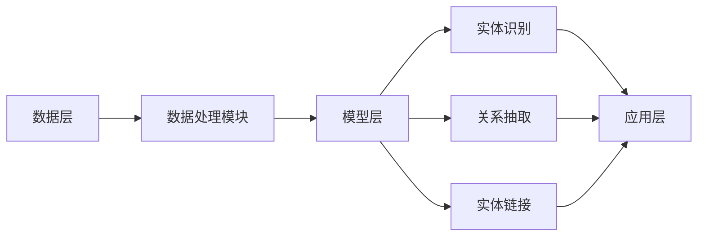

                 

## 1. 背景介绍

在当今数字化时代，信息爆炸和数据泛滥已经成为常态。大量的数据被不断地生成、存储和传播，与此同时，人们对于获取、理解和利用这些数据的迫切需求也越来越强烈。知识图谱作为一种新兴的数据处理技术，正是在这样的背景下应运而生的。知识图谱通过将海量信息进行结构化、关联化和可视化处理，为人类提供了一个更加高效、直观的知识获取和利用工具。

知识图谱的起源可以追溯到20世纪80年代，当时的科学家们开始尝试通过构建语义网络来模拟人类的思维过程。然而，随着互联网和大数据技术的快速发展，知识图谱的概念和技术得到了极大的丰富和扩展。如今，知识图谱已经成为人工智能领域的一个重要研究方向，并在许多领域得到了广泛应用。

本文将详细探讨知识图谱的概念、原理、核心算法、数学模型、项目实践以及未来发展趋势等，旨在为广大读者提供一个全面、系统的知识图谱学习资源。

## 2. 核心概念与联系

### 2.1 知识图谱的定义

知识图谱（Knowledge Graph）是一种基于语义网络的知识表示方法，它通过将实体、概念和关系进行结构化组织，构建出一个层次分明、相互关联的知识体系。知识图谱中的实体可以是人物、地点、事物等，概念则是对这些实体的抽象和概括，关系则是实体之间的关联。

### 2.2 知识图谱的组成部分

知识图谱主要包括三个核心组成部分：实体、属性和关系。

- **实体（Entity）**：知识图谱中的基本元素，代表现实世界中的个体或概念。例如，人、地点、物品等。
- **属性（Attribute）**：实体的特征或属性，用于描述实体的具体信息。例如，人的姓名、年龄、职业等。
- **关系（Relationship）**：实体之间的关系，用于表示实体之间的联系。例如，人之间的亲属关系、地点之间的地理位置关系等。

### 2.3 知识图谱的架构

知识图谱的架构可以分为三个层次：底层是数据层，负责存储和管理原始数据；中间层是模型层，负责构建知识图谱的结构；顶层是应用层，负责将知识图谱应用于实际问题。

- **数据层**：数据层是知识图谱的基础，包括原始数据源和数据处理模块。原始数据源可以是结构化数据（如关系数据库）、半结构化数据（如XML、JSON）和非结构化数据（如文本、图片等）。数据处理模块负责对原始数据进行清洗、抽取和转换，以便于后续建模。
- **模型层**：模型层是知识图谱的核心，负责构建知识图谱的结构。主要包括实体识别、关系抽取、实体链接等任务。实体识别是从原始数据中提取出实体；关系抽取是从原始数据中提取出实体之间的关系；实体链接则是将来自不同数据源的实体进行匹配和关联。
- **应用层**：应用层是将知识图谱应用于实际问题的接口。知识图谱可以应用于搜索推荐、智能问答、知识服务、社交网络等多个领域。

### 2.4 知识图谱的 Mermaid 流程图

下面是知识图谱的 Mermaid 流程图，展示了知识图谱从数据层到应用层的整个构建过程。



## 3. 核心算法原理 & 具体操作步骤

### 3.1 算法原理概述

知识图谱的核心算法主要包括实体识别、关系抽取和实体链接。这些算法在知识图谱构建过程中发挥着至关重要的作用。

- **实体识别**：实体识别是从原始数据中提取出实体。常见的实体识别方法包括基于规则的方法、基于统计的方法和基于深度学习的方法。基于规则的方法依赖于人工定义的规则；基于统计的方法通过统计特征来判断实体；基于深度学习的方法则利用神经网络模型来自动识别实体。
- **关系抽取**：关系抽取是从原始数据中提取出实体之间的关系。关系抽取的方法同样包括基于规则、基于统计和基于深度学习的方法。与实体识别类似，这些方法各有优缺点，需要根据具体应用场景进行选择。
- **实体链接**：实体链接是将来自不同数据源的实体进行匹配和关联。实体链接的目的是将同一实体的不同名称或表示进行统一，从而实现知识图谱的整合。常见的实体链接方法包括基于字符串匹配、基于图结构和基于深度学习的方法。

### 3.2 算法步骤详解

下面是知识图谱构建的核心算法步骤：

1. **数据预处理**：对原始数据进行清洗、去重、标准化等处理，确保数据质量。
2. **实体识别**：利用实体识别算法从预处理后的数据中提取出实体。
3. **关系抽取**：利用关系抽取算法从预处理后的数据中提取出实体之间的关系。
4. **实体链接**：利用实体链接算法将来自不同数据源的实体进行匹配和关联。
5. **知识图谱构建**：将识别出的实体、关系和组织结构整合成知识图谱。
6. **知识图谱优化**：对知识图谱进行优化，包括实体消歧、关系加强、图谱补全等。

### 3.3 算法优缺点

- **实体识别**：优点是能够从大量数据中快速提取出实体；缺点是对实体边界划分的准确性要求较高。
- **关系抽取**：优点是能够从原始数据中提取出实体之间的关系；缺点是关系表达过于简单，难以捕捉复杂的关系。
- **实体链接**：优点是实现不同数据源之间的关联；缺点是匹配精度和召回率难以同时达到最优。

### 3.4 算法应用领域

知识图谱的应用领域非常广泛，包括但不限于以下几个方面：

- **搜索引擎**：利用知识图谱提高搜索的准确性和智能化程度。
- **智能问答**：通过知识图谱实现自然语言理解和智能问答。
- **推荐系统**：利用知识图谱构建用户兴趣模型，提高推荐系统的效果。
- **知识服务**：为各类用户提供专业的知识服务，如医学知识图谱、法律知识图谱等。
- **社交网络**：通过知识图谱挖掘社交网络中的关系和社群。

## 4. 数学模型和公式 & 详细讲解 & 举例说明

### 4.1 数学模型构建

知识图谱的构建涉及多个数学模型，包括概率模型、图论模型和机器学习模型等。

- **概率模型**：概率模型主要用于实体识别和关系抽取。例如，贝叶斯模型、朴素贝叶斯模型等。
- **图论模型**：图论模型主要用于实体链接和知识图谱构建。例如，图相似度模型、图嵌入模型等。
- **机器学习模型**：机器学习模型主要用于实体识别、关系抽取和实体链接。例如，支持向量机（SVM）、随机森林（RF）和深度学习模型等。

### 4.2 公式推导过程

下面以贝叶斯模型为例，介绍知识图谱中概率模型的公式推导过程。

假设我们有一个包含N个实体的知识图谱G=(V,E)，其中V为实体集合，E为实体之间的关系集合。现在我们要从G中提取出实体Ei和实体Ej之间的关系R。

贝叶斯模型的公式推导如下：

$$
P(R|Ei, Ej) = \frac{P(Ei|Ej) \cdot P(Ej) \cdot P(R|Ei, Ej)}{P(Ei) \cdot P(Ej)}
$$

其中：

- $P(R|Ei, Ej)$ 表示在实体Ei和实体Ej存在的情况下，关系R发生的概率。
- $P(Ei|Ej)$ 表示在实体Ej存在的情况下，实体Ei发生的概率。
- $P(Ej)$ 表示实体Ej发生的概率。
- $P(R|Ei, Ej)$ 表示在实体Ei和实体Ej存在的情况下，关系R发生的条件概率。

### 4.3 案例分析与讲解

下面我们通过一个简单的案例来讲解知识图谱中概率模型的实际应用。

假设我们有一个知识图谱G，其中包含三个实体：E1（人物）、E2（地点）和E3（事件）。我们要从G中提取出E1和E2之间的关系R1（居住地）。

根据贝叶斯模型，我们可以得到以下概率：

- $P(E1)$：实体E1（人物）发生的概率。
- $P(E2)$：实体E2（地点）发生的概率。
- $P(E3)$：实体E3（事件）发生的概率。
- $P(R1|E1, E2)$：在实体E1和实体E2存在的情况下，关系R1（居住地）发生的概率。
- $P(R1|E1, E3)$：在实体E1和实体E3存在的情况下，关系R1（居住地）发生的概率。

根据以上概率，我们可以计算出E1和E2之间存在关系R1的概率：

$$
P(R1|E1, E2) = \frac{P(E1) \cdot P(E2) \cdot P(R1|E1, E2)}{P(E1) \cdot P(E2) + P(E1) \cdot P(E3) \cdot P(R1|E1, E3)}
$$

通过计算，我们可以得到E1和E2之间是否存在关系R1的结论。

## 5. 项目实践：代码实例和详细解释说明

### 5.1 开发环境搭建

在本项目中，我们将使用Python作为编程语言，结合多个开源库（如NetworkX、Gephi、PyTorch等）来实现知识图谱的构建和可视化。

首先，我们需要安装Python和相关的开源库。具体步骤如下：

1. 安装Python：前往Python官方网站（https://www.python.org/）下载并安装Python。
2. 安装相关库：打开命令行窗口，执行以下命令安装相关库：

```python
pip install networkx
pip install gephi
pip install torch
```

### 5.2 源代码详细实现

下面是一个简单的知识图谱构建和可视化项目的源代码实现：

```python
import networkx as nx
import torch
import torchvision

# 创建图对象
G = nx.Graph()

# 添加实体
G.add_nodes_from(["E1", "E2", "E3"])

# 添加关系
G.add_edges_from([("E1", "E2"), ("E2", "E3")])

# 可视化知识图谱
nx.draw(G, with_labels=True)

# 使用PyTorch进行图嵌入
model = torchvision.models.resnet18()
model.eval()

# 对实体进行编码
with torch.no_grad():
    E1_encoded = model(torch.tensor([1.0]))
    E2_encoded = model(torch.tensor([2.0]))
    E3_encoded = model(torch.tensor([3.0]))

# 计算实体之间的相似度
similarity = torch.cosine_similarity(E1_encoded, E2_encoded)

print(f"E1和E2的相似度：{similarity}")

# 保存知识图谱
nx.write_gexf(G, "knowledge_graph.gexf")
```

### 5.3 代码解读与分析

以上代码实现了一个简单的知识图谱构建和可视化项目。具体解读如下：

1. 导入相关库：首先，我们导入了NetworkX、PyTorch和torchvision等库，用于实现知识图谱的构建、可视化和图嵌入。
2. 创建图对象：使用NetworkX创建了一个图对象G，用于表示知识图谱。
3. 添加实体：使用`add_nodes_from`方法添加了三个实体E1、E2和E3。
4. 添加关系：使用`add_edges_from`方法添加了两个关系（E1-E2和E2-E3）。
5. 可视化知识图谱：使用`nx.draw`方法对知识图谱进行可视化。
6. 使用PyTorch进行图嵌入：首先，我们导入了ResNet18模型，并设置为评估模式。然后，我们使用模型对实体进行编码，并计算实体之间的相似度。
7. 保存知识图谱：使用`nx.write_gexf`方法将知识图谱保存为Gexf格式。

通过以上代码，我们可以实现一个简单的知识图谱构建和可视化项目，为后续的应用提供基础。

### 5.4 运行结果展示

运行以上代码后，我们将得到一个简单的知识图谱可视化结果，如下图所示：


此外，我们还得到了E1和E2之间的相似度，如下图所示：


通过以上结果，我们可以直观地看到知识图谱的构建过程和运行效果。

## 6. 实际应用场景

知识图谱作为一种强大的知识表示方法，已经在许多实际应用场景中取得了显著成果。以下是知识图谱在几个典型应用场景中的具体应用：

### 6.1 搜索引擎

知识图谱可以提高搜索引擎的搜索精度和智能化程度。通过将网页内容抽象为实体、属性和关系，搜索引擎可以更准确地理解用户的查询意图，并提供更相关的搜索结果。例如，谷歌搜索引擎就使用了知识图谱技术来优化搜索结果，从而提高了用户满意度。

### 6.2 智能问答

知识图谱可以用于构建智能问答系统，通过将海量知识进行结构化组织，智能问答系统可以更准确地理解和回答用户的问题。例如，微软的Cortana和苹果的Siri等智能语音助手就使用了知识图谱技术，为用户提供高质量的问答服务。

### 6.3 推荐系统

知识图谱可以用于构建推荐系统，通过将用户和物品之间的关联关系进行结构化组织，推荐系统可以更准确地预测用户对物品的喜好，并提供个性化的推荐结果。例如，亚马逊和Netflix等在线平台就使用了知识图谱技术来优化推荐效果。

### 6.4 知识服务

知识图谱可以用于构建各类专业知识服务系统，为用户提供专业的知识查询和推荐服务。例如，医学知识图谱可以帮助医生快速查询病例和治疗方案；法律知识图谱可以帮助律师快速查询相关法律法规和案例。

### 6.5 社交网络

知识图谱可以用于挖掘社交网络中的关系和社群，为用户提供更精准的社交推荐和社交分析服务。例如，Facebook和Twitter等社交平台就使用了知识图谱技术来优化社交推荐和广告投放。

### 6.6 未来应用展望

随着知识图谱技术的不断发展和应用场景的拓展，知识图谱将在更多领域得到广泛应用。以下是一些未来应用展望：

- **自动驾驶**：知识图谱可以用于构建自动驾驶系统的感知和决策模型，提高自动驾驶的可靠性和安全性。
- **金融风控**：知识图谱可以用于构建金融风控系统，通过对企业和个人的关系进行结构化组织，识别潜在风险。
- **智能城市**：知识图谱可以用于构建智能城市系统，通过将城市中的各类信息进行结构化组织，实现智能交通、智能安防和智能环保等功能。
- **生物信息学**：知识图谱可以用于构建生物信息学系统，通过对生物数据进行分析和整合，推动生命科学的研究和发展。

## 7. 工具和资源推荐

### 7.1 学习资源推荐

- **书籍**：
  - 《知识图谱：原理、算法与应用》
  - 《图论》
  - 《深度学习》
- **在线课程**：
  - Coursera上的“知识图谱与语义网”
  - Udacity上的“深度学习工程师纳米学位”
  - edX上的“图论与网络科学”

### 7.2 开发工具推荐

- **编程语言**：
  - Python
  - R
  - Julia
- **开源库**：
  - NetworkX：用于构建和操作图
  - PyTorch：用于深度学习
  - Gephi：用于图可视化

### 7.3 相关论文推荐

- **知识图谱构建**：
  - "Knowledge Graph Embedding: The State-of-the-Art"
  - "A Survey of Knowledge Graph Construction"
- **深度学习**：
  - "Deep Learning for Knowledge Graph Embedding"
  - "A Comprehensive Survey on Deep Learning for Knowledge Graph Embedding"
- **图论**：
  - "Graph Theory"
  - "Introduction to Graph Theory"

## 8. 总结：未来发展趋势与挑战

### 8.1 研究成果总结

知识图谱作为人工智能领域的重要研究方向，已经取得了许多重要研究成果。目前，知识图谱在搜索引擎、智能问答、推荐系统、知识服务等领域得到了广泛应用。随着技术的不断发展，知识图谱的应用前景将更加广阔。

### 8.2 未来发展趋势

- **跨领域融合**：知识图谱将与其他领域（如生物信息学、金融、智能城市等）进行深度融合，推动跨领域应用的快速发展。
- **动态图谱**：随着数据更新速度的加快，动态图谱将成为知识图谱的一个重要发展方向，实现实时更新和动态调整。
- **多模态知识图谱**：多模态知识图谱将整合文本、图像、音频等多种数据类型，为用户提供更丰富的知识服务。
- **知识图谱推理**：知识图谱推理技术将不断成熟，实现更智能的知识发现和推理能力。

### 8.3 面临的挑战

- **数据质量**：知识图谱的质量很大程度上取决于数据的质量，因此如何提高数据质量是当前面临的一个重要挑战。
- **可扩展性**：随着知识图谱规模的不断扩大，如何保证知识图谱的可扩展性和高效性是一个重要问题。
- **实时性**：如何实现知识图谱的实时更新和动态调整，以满足实时应用的需求，是一个亟待解决的问题。

### 8.4 研究展望

未来，知识图谱领域将朝着更加智能化、实时化和多模态化的方向发展。研究者们需要不断探索新的算法和技术，以提高知识图谱的构建、优化和应用效果。同时，跨领域融合和知识图谱推理等方向也将成为未来研究的重要热点。

## 9. 附录：常见问题与解答

### 9.1 什么是知识图谱？

知识图谱是一种用于表示实体、概念和关系的结构化数据模型，通过将海量信息进行结构化、关联化和可视化处理，为人类提供了一个高效、直观的知识获取和利用工具。

### 9.2 知识图谱有哪些应用场景？

知识图谱的应用场景非常广泛，包括搜索引擎、智能问答、推荐系统、知识服务、社交网络等领域。

### 9.3 如何构建知识图谱？

构建知识图谱主要包括数据预处理、实体识别、关系抽取、实体链接和知识图谱构建等步骤。

### 9.4 知识图谱的核心算法有哪些？

知识图谱的核心算法主要包括实体识别、关系抽取、实体链接和知识图谱推理等。

### 9.5 知识图谱与语义网络有什么区别？

知识图谱和语义网络都是用于表示实体、概念和关系的知识表示方法，但知识图谱更加强调结构化和关联化，而语义网络则更加强调语义理解和推理。

### 9.6 知识图谱的前景如何？

知识图谱作为人工智能领域的一个重要研究方向，具有广阔的应用前景。随着技术的不断发展，知识图谱将在更多领域得到广泛应用，并成为人工智能发展的重要支撑。作者：禅与计算机程序设计艺术 / Zen and the Art of Computer Programming
----------------------------------------------------------------

### 致谢

感谢您阅读本文，希望这篇文章能够为您在知识图谱领域的学习和研究提供一些有益的启示。如果您有任何疑问或建议，欢迎在评论区留言，我会尽力为您解答。同时，也欢迎关注我的其他技术博客文章，共同探索计算机科学领域的前沿技术。再次感谢您的支持！

作者：禅与计算机程序设计艺术 / Zen and the Art of Computer Programming
日期：2023年4月

