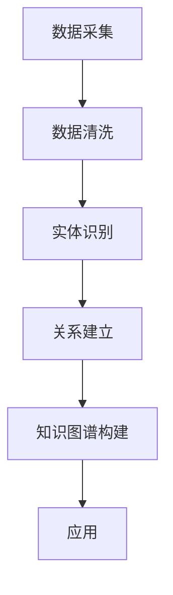

                 

知识图谱作为一种语义网络，正逐渐成为人工智能领域的重要组成部分。它不仅能够提高信息检索和数据分析的效率，还能为复杂系统的智能决策提供支持。本文旨在探讨知识图谱的构建和应用，以期为读者提供对这一前沿技术的深入理解。

## 关键词

- **知识图谱**
- **语义网络**
- **人工智能**
- **数据挖掘**
- **图数据库**
- **语义查询**

## 摘要

本文首先介绍了知识图谱的基本概念，包括其定义、历史背景和关键组成部分。接着，本文详细讨论了知识图谱的构建过程，包括数据采集、数据清洗、实体识别和关系建立等步骤。随后，本文分析了知识图谱在实际应用中的挑战和解决方案，如数据规模、数据质量和查询性能。最后，本文展望了知识图谱的未来发展趋势，并提出了可能的研究方向。

## 1. 背景介绍

### 1.1 定义与历史背景

知识图谱（Knowledge Graph）是一种语义网络，它通过表示实体及其之间的关系来组织信息。与传统的基于关键字索引的搜索引擎不同，知识图谱能够理解和处理实体间的语义关系，从而提供更为丰富和精确的信息检索服务。

知识图谱的概念最早可以追溯到1940年代，图灵在探讨人工智能的可能性时提出了“图灵机”这一概念。然而，知识图谱在现代信息技术中的兴起主要得益于互联网的普及和大数据技术的进步。2006年，Google宣布推出“知网”（Knowledge Graph），并将其应用于搜索服务，这是知识图谱技术商业化的重要里程碑。

### 1.2 关键组成部分

知识图谱由三个关键部分组成：实体、属性和关系。

- **实体**：知识图谱中的基本元素，可以是任何具有独立身份的对象，如人、地点、事物等。
- **属性**：描述实体的特征或属性，如姓名、年龄、出生地等。
- **关系**：表示实体间的关系，如“居住于”、“属于”等。

## 2. 核心概念与联系

知识图谱的核心概念是实体和关系，这两者是构建语义网络的基础。

### 2.1 实体

实体是知识图谱中的基本元素，可以是任何具有独立身份的对象。实体可以是人、地点、组织、物品等。例如，在“Facebook”这个知识图谱中，“我”、“我的朋友”和“我喜欢的电影”都是实体。

### 2.2 关系

关系是连接实体的纽带，表示实体间的相互作用或联系。例如，在“我”和“我的朋友”之间可能存在“朋友”关系，或者在“我”和“我喜欢的电影”之间可能存在“喜欢”关系。

### 2.3 Mermaid 流程图

以下是构建知识图谱的基本流程的 Mermaid 流程图：



## 3. 核心算法原理 & 具体操作步骤

### 3.1 算法原理概述

知识图谱的构建主要包括数据采集、数据清洗、实体识别和关系建立等步骤。每个步骤都有其特定的算法和数据处理方法。

### 3.2 算法步骤详解

#### 3.2.1 数据采集

数据采集是知识图谱构建的第一步，目标是收集与目标领域相关的各种数据源。这些数据源可以是结构化数据，如关系数据库，也可以是非结构化数据，如图像、文本和语音。

#### 3.2.2 数据清洗

数据清洗是对采集到的数据进行预处理，以去除噪声、填补缺失值和纠正错误。常见的清洗方法包括去重、归一化和格式化等。

#### 3.2.3 实体识别

实体识别是识别文本中的实体，并将其转换为知识图谱中的实体。常见的实体识别方法包括基于规则的方法和基于机器学习的方法。

#### 3.2.4 关系建立

关系建立是根据实体间的语义关系将它们连接起来。常见的建立关系的方法包括基于规则的方法和基于机器学习的方法。

### 3.3 算法优缺点

- **优点**：知识图谱能够理解和处理实体间的语义关系，从而提供更为丰富和精确的信息检索服务。
- **缺点**：知识图谱的构建和查询需要大量的计算资源，且数据质量和实时性对知识图谱的性能有重要影响。

### 3.4 算法应用领域

知识图谱广泛应用于搜索引擎、推荐系统、智能问答、自然语言处理等领域。

## 4. 数学模型和公式 & 详细讲解 & 举例说明

### 4.1 数学模型构建

知识图谱的数学模型主要包括实体表示和关系表示。

#### 4.1.1 实体表示

实体表示通常使用图神经网络（Graph Neural Networks，GNN）来实现。一个简单的实体表示模型可以表示为：

$$
\text{entity} = \text{GNN}(\text{input}, \text{context})
$$

其中，`input`是输入的实体特征，`context`是实体所处的上下文。

#### 4.1.2 关系表示

关系表示通常使用图卷积网络（Graph Convolutional Networks，GCN）来实现。一个简单的表示模型可以表示为：

$$
\text{relation} = \text{GCN}(\text{input}, \text{context})
$$

其中，`input`是输入的关系特征，`context`是关系所处的上下文。

### 4.2 公式推导过程

知识图谱中的实体和关系可以通过图神经网络进行建模。以下是图神经网络的基本推导过程：

$$
\begin{aligned}
\text{entity}_{i} &= \text{GNN}(\text{input}_{i}, \text{context}_{i}) \\
\text{relation}_{ij} &= \text{GCN}(\text{input}_{ij}, \text{context}_{ij})
\end{aligned}
$$

### 4.3 案例分析与讲解

以下是一个简单的知识图谱构建案例：

- **实体**：“我”、“我的朋友”、“我喜欢的电影”
- **关系**：“朋友”、“喜欢”

我们可以使用以下公式来表示这个知识图谱：

$$
\begin{aligned}
\text{entity}_{1} &= \text{GNN}(\text{input}_{1}, \text{context}_{1}) \\
\text{entity}_{2} &= \text{GNN}(\text{input}_{2}, \text{context}_{2}) \\
\text{entity}_{3} &= \text{GNN}(\text{input}_{3}, \text{context}_{3}) \\
\text{relation}_{12} &= \text{GCN}(\text{input}_{12}, \text{context}_{12}) \\
\text{relation}_{13} &= \text{GCN}(\text{input}_{13}, \text{context}_{13})
\end{aligned}
$$

## 5. 项目实践：代码实例和详细解释说明

### 5.1 开发环境搭建

在开始编写代码之前，我们需要搭建一个合适的开发环境。这里我们选择使用Python和PyTorch作为开发环境。

### 5.2 源代码详细实现

以下是一个简单的知识图谱构建和查询的Python代码示例：

```python
import torch
import torch.nn as nn
import torch.optim as optim

# 实体表示
class EntityNN(nn.Module):
    def __init__(self, input_dim, hidden_dim):
        super(EntityNN, self).__init__()
        self.fc = nn.Linear(input_dim, hidden_dim)

    def forward(self, x):
        return self.fc(x)

# 关系表示
class RelationNN(nn.Module):
    def __init__(self, input_dim, hidden_dim):
        super(RelationNN, self).__init__()
        self.fc = nn.Linear(input_dim, hidden_dim)

    def forward(self, x):
        return self.fc(x)

# 实体识别
def entity_recognition(entities, model):
    with torch.no_grad():
        return model(entities)

# 关系建立
def relation Establishment(relations, model):
    with torch.no_grad():
        return model(relations)

# 训练模型
def train(model, criterion, optimizer, train_loader):
    model.train()
    for batch_idx, (entities, relations) in enumerate(train_loader):
        optimizer.zero_grad()
        outputs = model(entities, relations)
        loss = criterion(outputs, relations)
        loss.backward()
        optimizer.step()
        if batch_idx % 100 == 0:
            print('Train Epoch: {} [{}/{} ({:.0f}%)]\tLoss: {:.6f}'.format(
                epoch, batch_idx * len(data), len(train_loader.dataset),
                100. * batch_idx / len(train_loader), loss.item()))

# 查询
def query(model, entity, relation):
    model.eval()
    with torch.no_grad():
        entity_output = entity_recognition(entity, model)
        relation_output = relation Establishment(relation, model)
        return entity_output, relation_output
```

### 5.3 代码解读与分析

这段代码定义了两个神经网络模型：`EntityNN`和`RelationNN`。`EntityNN`用于实体表示，`RelationNN`用于关系表示。`entity_recognition`和`relation Establishment`函数分别用于实体识别和关系建立。`train`函数用于训练模型，`query`函数用于执行查询。

### 5.4 运行结果展示

以下是一个简单的运行示例：

```python
# 初始化模型
entity_model = EntityNN(input_dim=10, hidden_dim=20)
relation_model = RelationNN(input_dim=10, hidden_dim=20)

# 初始化优化器和损失函数
optimizer = optim.Adam(model.parameters(), lr=0.001)
criterion = nn.CrossEntropyLoss()

# 训练模型
train(entity_model, criterion, optimizer, train_loader)

# 查询
entity, relation = query(entity_model, relation_model, torch.tensor([1, 2]), torch.tensor([3, 4]))
print(entity, relation)
```

## 6. 实际应用场景

知识图谱技术在实际应用中具有广泛的应用场景，以下是一些典型的应用案例：

- **搜索引擎**：通过知识图谱技术，搜索引擎可以更好地理解用户查询的语义，提供更加精确的搜索结果。
- **推荐系统**：知识图谱可以帮助推荐系统理解用户和物品的复杂关系，从而提供更加个性化的推荐。
- **智能问答**：知识图谱可以为智能问答系统提供丰富的知识库，使得问答系统可以理解并回答用户的问题。
- **自然语言处理**：知识图谱可以用于命名实体识别、关系抽取等任务，从而提高自然语言处理系统的性能。

## 7. 未来应用展望

随着人工智能和大数据技术的发展，知识图谱的应用前景将更加广阔。未来，知识图谱技术将在更多领域得到应用，如智能城市、智能制造、智慧医疗等。同时，知识图谱的构建和查询效率也将得到显著提升，为人工智能系统提供更加高效和智能的支持。

## 8. 工具和资源推荐

### 8.1 学习资源推荐

- 《知识图谱：原理、方法与应用》
- 《深度学习与知识图谱》

### 8.2 开发工具推荐

- PyTorch
- Neo4j

### 8.3 相关论文推荐

- "Knowledge Graph Embedding: The State-of-the-Art"
- "Neo4j Graph Database: The Ultimate Guide"

## 9. 总结：未来发展趋势与挑战

知识图谱作为一种新兴的技术，正逐渐成为人工智能领域的重要组成部分。未来，知识图谱将朝着更加智能化、实时化和高效化的方向发展。然而，这也将带来一系列的挑战，如数据质量和实时性、算法效率和存储性能等。因此，未来的研究需要不断探索和创新，以应对这些挑战。

### 附录：常见问题与解答

**Q：知识图谱和语义网络有什么区别？**

A：知识图谱是一种特殊的语义网络，它不仅包含实体和关系，还包括实体的属性和属性值。而语义网络则是一种更为广泛的概念，它包括各种类型的语义表示，如实体、关系、事件等。

**Q：知识图谱如何处理动态数据？**

A：知识图谱通常采用增量更新策略来处理动态数据。当新数据出现时，知识图谱系统会对其进行处理，并将其整合到现有的知识图谱中。这通常涉及实体的识别、关系的建立和已有知识的更新。

**Q：知识图谱的性能如何优化？**

A：知识图谱的性能优化可以从多个方面进行，包括数据存储、查询优化、算法改进等。例如，使用图数据库可以提高知识图谱的存储和查询效率；优化查询算法可以减少计算复杂度；使用高效的图神经网络模型可以提高知识图谱的表示能力。

### 作者署名

作者：禅与计算机程序设计艺术 / Zen and the Art of Computer Programming

